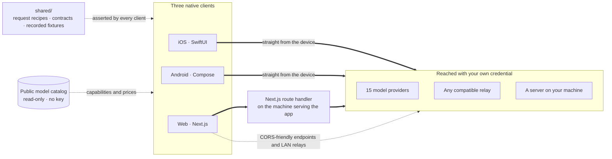

<div align="center">


# Oriveo Community Edition

**Every model, one app.**

Open-source, bring-your-own-key AI chat for iOS, Android, and the web,
with a native macOS client in development.
No account, no subscription, and no service of ours in the chat request path.

<a href="LICENSE"></a>
<a href="ios/README.md"></a>
<a href="android/README.md"></a>
<a href="web/README.md"></a>
<a href="macos/README.md"></a>
<a href="https://github.com/oriveo/oriveo/releases/latest"></a>
<a href="https://github.com/oriveo/oriveo/stargazers"></a>

**Get Oriveo:**
<a href="https://oriveoai.com"><b>oriveoai.com</b></a> &nbsp;·&nbsp;
<a href="https://apps.apple.com/app/oriveo/id6775370458">App Store</a> &nbsp;·&nbsp;
<a href="https://play.google.com/store/apps/details?id=com.kenny.oriveo">Google Play</a> &nbsp;·&nbsp;
<a href="https://app.oriveoai.com">Web app</a>

<sub>The store builds are <b>Oriveo</b>, the commercial edition. This repository is <a href="#community-edition-and-oriveo">Community Edition</a>, built from source.</sub>

<a href="#get-started">Build from source</a> &nbsp;·&nbsp;
<a href="#architecture">Architecture</a> &nbsp;·&nbsp;
<a href="#community-edition-and-oriveo">Editions</a> &nbsp;·&nbsp;
<a href="#faq">FAQ</a> &nbsp;·&nbsp;
<a href="CONTRIBUTING.md">Contributing</a>

<sub>

**English** ·
<a href="readme_i18n/ar/README.md">العربية</a> ·
<a href="readme_i18n/de/README.md">Deutsch</a> ·
<a href="readme_i18n/es/README.md">Español</a> ·
<a href="readme_i18n/fr/README.md">Français</a> ·
<a href="readme_i18n/hi/README.md">हिन्दी</a> ·
<a href="readme_i18n/id/README.md">Indonesia</a> ·
<a href="readme_i18n/ja/README.md">日本語</a> ·
<a href="readme_i18n/ko/README.md">한국어</a> ·
<a href="readme_i18n/pt-BR/README.md">Português</a> ·
<a href="readme_i18n/ru/README.md">Русский</a> ·
<a href="readme_i18n/th/README.md">ไทย</a> ·
<a href="readme_i18n/tr/README.md">Türkçe</a> ·
<a href="readme_i18n/vi/README.md">Tiếng Việt</a> ·
<a href="readme_i18n/zh-Hans/README.md">简体中文</a> ·
<a href="readme_i18n/zh-Hant/README.md">繁體中文</a>

</sub>

&nbsp;
&nbsp;


<sub>Every provider you use and what each has cost · a second model checking the first · a reply kept as a note</sub>

</div>

---

## What Oriveo is

Oriveo Community Edition is an open-source, bring-your-own-key (BYOK) multi-model AI chat client
for iOS, Android, and the web, with a native macOS client in development. It is a local-first
alternative to a hosted ChatGPT or Claude plan, for people who would rather pay a model provider
directly than pay a subscription to whatever sits in front of it. You supply API keys you already
own, the client talks to the provider with them, and the web client is yours to self-host — no
Oriveo account, and nothing reporting back to us.

It speaks to **15 model providers** natively — OpenAI, Anthropic, Google Gemini, OpenRouter,
DeepSeek, Grok, Mistral, Groq, Together AI, Fireworks AI, MiniMax, Z.ai, Qwen, Kimi (Moonshot) and
SiliconFlow — plus **any OpenAI-, Anthropic- or Gemini-compatible endpoint** you point it at,
including llama.cpp, Ollama, LM Studio or vLLM running on your own machine. One LLM client, one set
of conversations, whichever model answers.

<table>
<tr>
<td width="33%" valign="top"><b>15 providers</b><br>Plus relay endpoints and local model servers.</td>
<td width="33%" valign="top"><b>Local by default</b><br>Conversations, notes, folders, skills and attachments stay on the device.</td>
<td width="33%" valign="top"><b>One behaviour, three clients</b><br>One spec in <code>shared/</code>, three suites assert it.</td>
</tr><tr>
<td valign="top"><b>No account</b><br>Nothing reports back to us.</td>
<td valign="top"><b>Self-host</b><br>The web client runs on your machine.</td>
<td valign="top"><b>16 languages</b><br>Full right-to-left layout for Arabic.</td>
</tr></table>

## Why it exists

Nobody should be able to meter, log, or mark up the model you are paying for.

- **Your keys, your bill.** You pay the provider's list price. Nothing is marked up, metered, or
  resold.
- **Local by default.** Conversations, notes, folders, skills, and attachments live on the device.
  Export them to a file whenever you want; there is no cloud copy to lose access to.
- **One behaviour, three clients.** How a request is shaped for a given provider, transport, and
  capability is written down once in [`shared/`](shared/README.md), and all three clients assert
  against the same JSON fixtures. A quirk that lives in that data is fixed once; one that lives in a
  parser is caught by three suites at the same time.
- **The one thing it fetches.** A public, read-only model catalog, so a model released today works
  without an app update — no key, no identifier we attach, and pointable at a host of your own.

## Features

- **Chat** — streaming, reasoning blocks, citations, attachments (images and video, PDF, Office
  (docx, xlsx, pptx), OpenDocument, EPUB, RTF, HTML, and any plain-text or source file),
  quote-a-selection, retry, regenerate, continue after an interrupted answer
- **Providers** — 15 built in, each with your own key; per-provider model and generation-parameter
  overrides, and a choice of regional endpoint where the provider offers one
- **Relay** — any OpenAI-, Anthropic- or Gemini-compatible endpoint, plus llama.cpp's native API,
  including one on your LAN
- **Local model servers** — llama.cpp, Ollama, LM Studio, vLLM, Open WebUI; iOS and Android find
  them on the local network by mDNS where the engine advertises itself, else by probing usual ports
- **Subscription sign-in** — use a ChatGPT or Grok subscription you already hold instead of an API
  key, over each provider's own device-authorization flow
- **Skills** — reusable system prompts with their own model, reasoning setting, and reference
  documents
- **Notes and folders** — capture a reply as a note, organise conversations, search across both
- **Cross-check** — hand an answer to a second model for review and keep the two together
- **Cost** — per-message and per-provider spend, computed on the device from what each response
  actually reported, including the cache read and cache write tiers
- **Image generation** — where the provider supports it
- **Backup** — export everything to a file; the provider keys in it, if you choose to include them,
  are encrypted with a password of yours
- **16 interface languages**, including full right-to-left layout for Arabic

## Community Edition and Oriveo

This repository is **Oriveo Community Edition**, licensed under
[AGPL-3.0-or-later](LICENSE). The apps on the App Store, Google Play, and the hosted web app are
**Oriveo** — a separate proprietary product that adds an account layer.

| | Community Edition | Oriveo |
|---|---|---|
| Source | This repository, AGPL-3.0-or-later | Proprietary |
| Chat with your own provider keys | Yes | Yes |
| Relay and local model servers | Yes | Yes |
| Notes, folders, skills, attachments | Yes | Yes |
| On-device cost tracking | Yes | Yes |
| Account | None | Oriveo account |
| Storage | On the device; manual export and restore | Local-first, plus cross-device cloud sync |
| Usage insights and budget alerts | — | Yes |
| Models paid for by Oriveo | — | Yes |
| Analytics and crash reporting | None. The web bundle's Sentry stays silent without a DSN of your own | Yes |

Community Edition builds use the `ai.oriveo.community` identifier prefix, so one can sit on the
same device as a store build without the two sharing a keychain or any local data. What this
edition will and will not accept is written down in [COMMUNITY.md](COMMUNITY.md).

**Oriveo, the full product:** [iPhone and iPad](https://apps.apple.com/app/oriveo/id6775370458) ·
[Android](https://play.google.com/store/apps/details?id=com.kenny.oriveo) · [Web](https://app.oriveoai.com) · [oriveoai.com](https://oriveoai.com)

## Providers

Every provider below is reached with a key you create yourself. Two of them can also be reached by
signing in with a subscription you already hold instead of a key: OpenAI with a ChatGPT plan, and
Grok.

| Provider | Where to get a key |
|---|---|
| OpenAI | [platform.openai.com](https://platform.openai.com/api-keys) |
| Anthropic | [platform.claude.com](https://platform.claude.com/settings/keys) |
| Google Gemini | [aistudio.google.com](https://aistudio.google.com/apikey) |
| OpenRouter | [openrouter.ai](https://openrouter.ai/keys) |
| DeepSeek | [platform.deepseek.com](https://platform.deepseek.com/api_keys) |
| Grok | [console.x.ai](https://console.x.ai/) |
| Mistral | [console.mistral.ai](https://console.mistral.ai/api-keys) |
| Groq | [console.groq.com](https://console.groq.com/keys) |
| Together AI | [api.together.xyz](https://api.together.xyz/settings/api-keys) |
| Fireworks AI | [fireworks.ai](https://fireworks.ai/api-keys) |
| MiniMax | [platform.minimax.io](https://platform.minimax.io/docs/guides/quickstart-preparation) |
| Z.ai | [open.bigmodel.cn](https://open.bigmodel.cn/usercenter/apikeys) |
| Qwen | [bailian.console.alibabacloud.com](https://bailian.console.alibabacloud.com/?apiKey=1#/api-key) |
| Kimi (Moonshot) | [platform.kimi.ai](https://platform.kimi.ai/console/api-keys) |
| SiliconFlow | [cloud.siliconflow.cn](https://cloud.siliconflow.cn/account/ak) |
| **Relay** | Any OpenAI-, Anthropic- or Gemini-compatible endpoint, plus llama.cpp's native API, including one on your own machine |

## Architecture

Three native clients, one definition of how to talk to a model provider.



Each client owns its own UI, storage, and navigation, and meets the shared contracts at exactly one
seam: the layer that turns *this model, this capability* into an HTTP request.

The one asymmetry worth knowing about is the web client. Most provider APIs send no CORS headers, so
a browser cannot call them directly. Those requests pass through a Next.js route handler running on
whatever machine serves the app — your own, when you run it locally. The handful of endpoints that
do allow a browser (Kimi's China endpoint, and the balance endpoints of OpenRouter, SiliconFlow,
DeepSeek and Kimi) and relays on your own network are called directly. The iOS and Android clients
have no such constraint and always go straight to the provider.

**The architecture of each client:**

| | Stack | README |
|---|---|---|
| **iOS** | SwiftUI with a UIKit transcript, GRDB | [ios/README.md](ios/README.md) |
| **Android** | Jetpack Compose, Room, Koin, Ktor/OkHttp | [android/README.md](android/README.md) |
| **Web** | Next.js App Router, React, Zustand, TypeScript | [web/README.md](web/README.md) |
| **macOS** | In development, arriving in the coming months | [macos/README.md](macos/README.md) |
| **Shared** | Contracts, recorded fixtures, and the Swift wire kernel | [shared/README.md](shared/README.md) |

## Get started

There are no prebuilt binaries here — no APK, no `.ipa`. Community Edition is source you build
yourself. The web client is the shortest path to a running app.

<details open>
<summary><b>Web</b> — the quickest way to try it</summary>

<br>

Requires Node 22.22.2 or a later 22.x (see [`web/.nvmrc`](web/.nvmrc)); Node 23+ is not supported.

```bash
cd web
npm install
npm run dev:app        # http://localhost:3001
```

The first screen asks for a provider API key. Nothing else is required.
More commands and configuration: [web/README.md](web/README.md).

</details>

<details>
<summary><b>iOS</b> — build and run on your own iPhone</summary>

<br>

Requires a Mac with Xcode 26 and a device on iOS 18 or later. A free Apple Developer account is
enough — the app uses no paid capabilities.

1. Open `ios/Oriveo/Oriveo.xcodeproj`
2. Select the `Oriveo` scheme
3. Under Signing &amp; Capabilities, choose your own Team
4. If Xcode cannot register `ai.oriveo.community`, change the bundle identifier to one your team owns
5. Run

Full walkthrough, including what to do if Xcode refuses to open the project:
[ios/README.md](ios/README.md).

</details>

<details>
<summary><b>Android</b> — build the APK</summary>

<br>

Requires JDK 21 and the Android SDK. The build uses AGP 9.3, Gradle 9.5 and Kotlin 2.3, so
Android Studio has to be a release that can sync them. From the command line only the JDK and the
SDK are needed.

```bash
cd android
./gradlew :app:assembleDebug
```

Serving the model catalog from your own host: [android/README.md](android/README.md).

</details>

## Privacy

- **Provider keys** go to the iOS Keychain, and on Android to `EncryptedSharedPreferences` under a
  key held in the Android Keystore. A browser has no equivalent facility, so on the web they sit
  unencrypted in IndexedDB — the same model browser BYOK clients generally use. For the strongest
  guarantee, use the iOS or Android client.
- **Conversations, notes, folders, skills, and attachments** are stored on the device. Nothing is
  uploaded anywhere.
- **No account, and no analytics.** There is nothing to sign in to, and nothing counts what you do.
  The web bundle includes Sentry for error reporting. It stays silent until you set
  `NEXT_PUBLIC_SENTRY_DSN` to a project of your own, and if you do, it is configured to capture
  session replays as well as stack traces. The iOS and Android clients contain no reporting SDK at
  all.
- **On iOS and Android, chat requests go straight from the device to the provider.** On the web most
  of them pass through the Next.js server that serves the app, because most provider APIs do not
  permit a direct browser call. That server does not persist keys or messages, and when you run the
  app locally it is your own machine.
- **Two requests of our own:** a read-only model catalog, read in two calls. One covers how each
  model wants to be addressed; the other the facts about individual models, which iOS reads only
  after a subscription sign-in. Between them, a model released today works without a new build.
  Neither carries a key, a conversation, or an identifier we attach. The host sees the platform's
  default User-Agent, and the only thing the client sends back is the catalog's own `ETag`, as
  `If-None-Match`. The web client (`NEXT_PUBLIC_BACKEND_URL`) and the Android build
  (`-PORIVEO_METADATA_BASE_URL`) can be pointed at a host of your own; on iOS that override is a
  Debug-build convenience only.

## FAQ

<details>
<summary><b>Is Oriveo a BYOK client for OpenAI, Claude, Gemini and OpenRouter?</b></summary>

<br>

Bring your own key. You create an API key in a provider's own console — OpenAI, Anthropic, Google,
and so on — and paste it into Oriveo. Requests are billed by that provider at its list price.
Oriveo is the client; it is not a reseller and takes no cut.

</details>

<details>
<summary><b>Is Oriveo a free, open-source ChatGPT alternative?</b></summary>

<br>

The client is: open source, nothing to subscribe to, and no part of it held back behind a payment.
What you pay is the model provider's own list price for the requests you make, billed by them on
the account the key belongs to. Oriveo never sees that bill.

</details>

<details>
<summary><b>Do my conversations go through an Oriveo server?</b></summary>

<br>

No. iOS and Android call the provider directly. On the web most requests pass through the Next.js
server serving the app — your own machine when you run it locally — because most provider APIs
refuse a browser call. No server we operate sits in the chat path. See [Privacy](#privacy).

</details>

<details>
<summary><b>Does it work with Ollama, LM Studio or llama.cpp?</b></summary>

<br>

Yes. Add a Relay connection pointing at any OpenAI-, Anthropic- or Gemini-compatible server —
llama.cpp, Ollama, LM Studio, vLLM, Open WebUI, or anything else speaking one of those protocols.
The iOS and Android clients find one on the local network by mDNS where the engine advertises
itself and by probing the usual ports otherwise; the web client suggests each engine's usual
address. Local HTTP uses no credential and never leaves your network.

</details>

<details>
<summary><b>Can I self-host Oriveo?</b></summary>

<br>

Yes. The web client is the only part of the project with a server side, and it stores neither keys
nor messages. Point it at a model server on your own hardware, self-host the catalog with
`NEXT_PUBLIC_BACKEND_URL` (web) or `-PORIVEO_METADATA_BASE_URL` (Android), and nothing reaches past
your network. On iOS that override exists only in Debug builds. See [Privacy](#privacy).

</details>

<details>
<summary><b>How is Community Edition different from the Oriveo app on the App Store?</b></summary>

<br>

The store apps are Oriveo, a proprietary product that adds an account, cross-device cloud sync,
usage insights, and models Oriveo pays for. Community Edition has none of that. See
[Community Edition and Oriveo](#community-edition-and-oriveo) for the full comparison.

</details>

<details>
<summary><b>Is there a macOS app?</b></summary>

<br>

A native macOS client is in development and will arrive in the coming months; [`macos/`](macos/README.md)
is where it will land. Until then the web client makes a good desktop app in any browser, and the
iOS build runs on an Apple silicon Mac straight from Xcode. The Swift package that speaks to the
providers already declares macOS 15, so the wire layer a Mac client needs is under test today.

</details>

<details>
<summary><b>Which languages is the interface available in?</b></summary>

<br>

Sixteen: Arabic, German, English, Spanish, French, Hindi, Indonesian, Japanese, Korean, Brazilian
Portuguese, Russian, Thai, Turkish, Vietnamese, Simplified Chinese, and Traditional Chinese. Arabic
gets a full right-to-left layout.

</details>

## Repository layout

```
ios/           iOS client (SwiftUI)
android/       Android client (Jetpack Compose)
web/           Web client (Next.js)
macos/         macOS client — in development, arriving in the coming months
shared/        Cross-client contracts, recorded fixtures, and the Swift wire kernel
readme_i18n/   These READMEs in fifteen more languages
docs/assets/   Images used by the READMEs
llms.txt       A machine-readable index of this documentation
.github/       Issue and pull request templates
```

## Contributing

Bug reports and pull requests are welcome. [CONTRIBUTING.md](CONTRIBUTING.md) covers how to build
each client and what a good pull request looks like. [COMMUNITY.md](COMMUNITY.md) describes what
this edition is for, and the few kinds of change that will not be accepted no matter how well
written.

Found a security problem? Please do not open a public issue — [SECURITY.md](SECURITY.md) explains
how to report it privately, and what this project does and does not treat as a vulnerability.
Everyone taking part is expected to follow the [code of conduct](CODE_OF_CONDUCT.md).

## License

[AGPL-3.0-or-later](LICENSE). Contributions are accepted under the same license.

Provider names and logos belong to their respective owners and appear here only to identify the
services this client can be pointed at. They are not covered by this repository's license, and
their presence is not an endorsement by anyone. The fonts and libraries the clients bundle, and
the terms they come under, are listed in [THIRD-PARTY-NOTICES.md](THIRD-PARTY-NOTICES.md).
