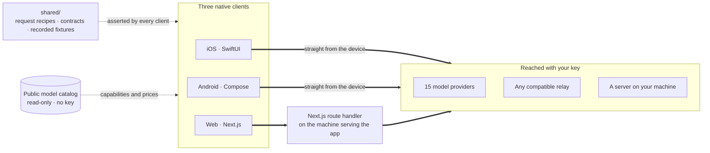

<div align="center">


# Oriveo

**Every model, one app.**

Open-source, bring-your-own-key AI chat for iOS, Android, and the web.
No account, no subscription, and no service of ours in the request path.

<a href="LICENSE"></a>
<a href="ios/README.md"></a>
<a href="android/README.md"></a>
<a href="web/README.md"></a>


<a href="https://oriveoai.com">Website</a> &nbsp;·&nbsp;
<a href="#get-started">Get started</a> &nbsp;·&nbsp;
<a href="#architecture">Architecture</a> &nbsp;·&nbsp;
<a href="#community-edition-and-oriveo">Editions</a> &nbsp;·&nbsp;
<a href="#faq">FAQ</a> &nbsp;·&nbsp;
<a href="CONTRIBUTING.md">Contributing</a>

<sub>

**English** ·
<a href="readme_i18n/ar/README.md">العربية</a> ·
<a href="readme_i18n/de/README.md">Deutsch</a> ·
<a href="readme_i18n/es/README.md">Español</a> ·
<a href="readme_i18n/fr/README.md">Français</a> ·
<a href="readme_i18n/hi/README.md">हिन्दी</a> ·
<a href="readme_i18n/id/README.md">Indonesia</a> ·
<a href="readme_i18n/ja/README.md">日本語</a> ·
<a href="readme_i18n/ko/README.md">한국어</a> ·
<a href="readme_i18n/pt-BR/README.md">Português</a> ·
<a href="readme_i18n/ru/README.md">Русский</a> ·
<a href="readme_i18n/th/README.md">ไทย</a> ·
<a href="readme_i18n/tr/README.md">Türkçe</a> ·
<a href="readme_i18n/vi/README.md">Tiếng Việt</a> ·
<a href="readme_i18n/zh-Hans/README.md">简体中文</a> ·
<a href="readme_i18n/zh-Hant/README.md">繁體中文</a>

</sub>

</div>

---

## What Oriveo is

Oriveo Community Edition is a bring-your-own-key (BYOK) AI chat client for iOS, Android, and the
web. You supply API keys you already own, and the client talks to the provider with them. There is
no Oriveo account and no subscription, and nothing reports back to us.

It speaks to **15 model providers** natively — OpenAI, Anthropic, Google Gemini, OpenRouter,
DeepSeek, Grok, Mistral, Groq, Together AI, Fireworks AI, MiniMax, Z.ai, Qwen, Kimi (Moonshot) and
SiliconFlow — plus **any OpenAI-, Anthropic- or Gemini-compatible endpoint** you point it at,
including llama.cpp, Ollama, LM Studio or vLLM running on your own machine.

| | |
|---|---|
| **Providers** | 15 built in, plus custom relay endpoints and local model servers |
| **Clients** | iOS (SwiftUI) · Android (Jetpack Compose) · Web (Next.js) |
| **Interface languages** | 16 |
| **Account required** | None |
| **Calls it makes on its own behalf** | One thing, in two requests: a read-only model catalog, with no key and no identifier attached |
| **License** | AGPL-3.0-or-later |

## Why it exists

Nobody should be able to meter, log, or mark up the model you are paying for.

- **Your keys, your bill.** You pay the provider's list price. Nothing is marked up, metered, or
  resold.
- **Local by default.** Conversations, notes, folders, skills, and attachments live on the device.
  Export them to a file whenever you want; there is no cloud copy to lose access to.
- **One behaviour, three clients.** How a request is shaped for a given provider, transport, and
  capability is written down once in [`shared/`](shared/README.md), and all three clients assert
  against the same JSON fixtures. A quirk that lives in that data is fixed once; one that lives in a
  parser is caught by three suites at the same time.
- **The one call it makes.** The app fetches a public model catalog so that a model
  released today works without an app update. It is read-only, carries no key and no identifier, and
  you can point it at your own host.

## Features

- **Chat** — streaming, reasoning blocks, citations, attachments (images, PDF, Office, EPUB, HTML,
  plain text), quote-a-selection, retry, regenerate, continue after an interrupted answer
- **Providers** — 15 built in, each with your own key; per-provider endpoint, model, and parameter
  overrides
- **Relay** — any OpenAI-, Anthropic- or Gemini-compatible endpoint, including one on your LAN
- **Local model servers** — llama.cpp, Ollama, LM Studio, vLLM; iOS and Android find them on the
  local network over mDNS
- **Subscription sign-in** — use a Codex or Grok subscription you already hold instead of an API key
- **Skills** — reusable system prompts with their own model, parameters, and reference documents
- **Notes and folders** — capture a reply as a note, organise conversations, full-text search
- **Cross-check** — re-ask the same question of a second model and keep both answers side by side
- **Cost** — per-message and per-provider spend, computed on the device from what each response
  actually reported, including cache-discount tiers
- **Image generation** — where the provider supports it
- **Backup** — export everything to a file, optionally encrypted with a password you choose
- **16 interface languages**, including full right-to-left layout for Arabic

## Community Edition and Oriveo

This repository is **Oriveo Community Edition**, licensed under
[AGPL-3.0-or-later](LICENSE). The apps on the App Store, Google Play, and the hosted web app are
**Oriveo** — a separate proprietary product built from the same clients, with an account layer on
top.

| | Community Edition | Oriveo |
|---|---|---|
| Source | This repository, AGPL-3.0-or-later | Proprietary |
| Chat with your own provider keys | Yes | Yes |
| Relay and local model servers | Yes | Yes |
| Notes, folders, skills, attachments | Yes | Yes |
| On-device cost tracking | Yes | Yes |
| Account | None | Oriveo account |
| Storage | On the device; manual export and restore | Local-first, plus cross-device cloud sync |
| Usage insights and budget alerts | — | Yes |
| Models paid for by Oriveo | — | Yes |
| Analytics and crash reporting | Off by default — the web bundle includes Sentry, silent without a DSN | Yes |

Community Edition builds use the `ai.oriveo.community` identifier prefix, so one can sit next to a
store build without the two sharing a keychain or local data. What this edition
will and will not accept is written down in [COMMUNITY.md](COMMUNITY.md).

**Oriveo, the full product:**
[iPhone and iPad](https://apps.apple.com/app/oriveo/id6775370458) &nbsp;·&nbsp;
[Android](https://play.google.com/store/apps/details?id=com.kenny.oriveo) &nbsp;·&nbsp;
[Web](https://app.oriveoai.com) &nbsp;·&nbsp;
[oriveoai.com](https://oriveoai.com)

## Providers

Every provider below is reached with a key you create yourself.

| Provider | Where to get a key |
|---|---|
| OpenAI | [platform.openai.com](https://platform.openai.com/api-keys) |
| Anthropic | [console.anthropic.com](https://console.anthropic.com/settings/keys) |
| Google Gemini | [aistudio.google.com](https://aistudio.google.com/apikey) |
| OpenRouter | [openrouter.ai](https://openrouter.ai/keys) |
| DeepSeek | [platform.deepseek.com](https://platform.deepseek.com/api_keys) |
| Grok | [console.x.ai](https://console.x.ai/) |
| Mistral | [console.mistral.ai](https://console.mistral.ai/api-keys) |
| Groq | [console.groq.com](https://console.groq.com/keys) |
| Together AI | [api.together.xyz](https://api.together.xyz/settings/api-keys) |
| Fireworks AI | [fireworks.ai](https://fireworks.ai/api-keys) |
| MiniMax | [platform.minimax.io](https://platform.minimax.io/docs/guides/quickstart-preparation) |
| Z.ai | [open.bigmodel.cn](https://open.bigmodel.cn/usercenter/apikeys) |
| Qwen | [bailian.console.alibabacloud.com](https://bailian.console.alibabacloud.com/?apiKey=1#/api-key) |
| Kimi (Moonshot) | [platform.kimi.ai](https://platform.kimi.ai/console/api-keys) |
| SiliconFlow | [cloud.siliconflow.cn](https://cloud.siliconflow.cn/account/ak) |
| **Relay** | Any OpenAI-, Anthropic- or Gemini-compatible endpoint, including one on your own machine |

## Architecture

Three native clients, one definition of how to talk to a model provider.



Each client owns its own UI, storage, and navigation, and meets the shared contracts at exactly one
seam: the layer that turns *this model, this capability* into an HTTP request.

The one asymmetry worth knowing about is the web client. Most provider APIs send no CORS headers,
so a browser cannot call them directly; those requests pass through a Next.js route handler running
on whatever machine serves the app — your own, when you run it locally. The handful of endpoints
that do allow a browser (Kimi's China endpoint, the balance endpoints of a few providers) and
relays on your own network are called directly. The iOS and Android clients have no such constraint
and always go straight to the provider.

**The architecture of each client:**

| | Stack | README |
|---|---|---|
| **iOS** | SwiftUI with a UIKit transcript, GRDB | [ios/README.md](ios/README.md) |
| **Android** | Jetpack Compose, Room, Koin, Ktor/OkHttp | [android/README.md](android/README.md) |
| **Web** | Next.js App Router, React, Zustand, TypeScript | [web/README.md](web/README.md) |
| **Shared** | Contracts, recorded fixtures, and the Swift wire kernel | [shared/README.md](shared/README.md) |

## Get started

There are no prebuilt binaries here — no APK, no `.ipa`, no releases. Community Edition is source
you build yourself, and the store apps are the other product. The web client is the shortest path to
a running app.

<details open>
<summary><b>Web</b> — the quickest way to try it</summary>

<br>

Requires Node 22 (see [`web/.nvmrc`](web/.nvmrc)).

```bash
cd web
npm install
npm run dev:app        # http://localhost:3001
```

The first screen asks for a provider API key. Nothing else is required.
More commands and configuration: [web/README.md](web/README.md).

</details>

<details>
<summary><b>iOS</b> — build and run on your own iPhone</summary>

<br>

Requires a Mac with Xcode 26 and a device on iOS 18 or later. A free Apple Developer account is
enough — the app uses no paid capabilities.

1. Open `ios/Oriveo/Oriveo.xcodeproj`
2. Select the `Oriveo` scheme
3. Under Signing &amp; Capabilities, choose your own Team
4. Run

Full walkthrough, including what to do if Xcode refuses to open the project:
[ios/README.md](ios/README.md).

</details>

<details>
<summary><b>Android</b> — build the APK</summary>

<br>

Requires JDK 21 and the Android SDK. The build uses AGP 9.3, Gradle 9.5 and Kotlin 2.3, so
Android Studio has to be a release that can sync them; from the command line only the JDK and the
SDK are needed.

```bash
cd android
./gradlew :app:assembleDebug
```

Serving the model catalog from your own host: [android/README.md](android/README.md).

</details>

## Privacy

- **Provider keys** go to the iOS Keychain, and on Android to `EncryptedSharedPreferences` under a
  key held in the Android Keystore. A browser has no equivalent facility, so on the web they sit
  unencrypted in IndexedDB — the same model browser BYOK clients generally use. For the strongest
  guarantee, use the iOS or Android client.
- **Conversations, notes, folders, skills, and attachments** are stored on the device. Nothing is
  uploaded anywhere.
- **No account, and nothing reporting back to us.** There is nothing to sign in to. The web bundle
  includes Sentry, which stays silent unless you configure a DSN of your own.
- **On iOS and Android, chat requests go straight from the device to the provider.** On the web most
  of them pass through the Next.js server that serves the app, because most provider APIs do not
  permit a direct browser call; that server does not persist keys or messages, and when you run the
  app locally it is your own machine.
- **One request of our own:** a read-only model catalog, fetched with no key, no conversation, and
  no identifier attached, so a model released today works without a new build. Point it at your own
  host if you would rather serve it yourself.

## FAQ

<details>
<summary><b>What does BYOK mean?</b></summary>

<br>

Bring your own key. You create an API key in a provider's own console — OpenAI, Anthropic, Google,
and so on — and paste it into Oriveo. Requests are billed by that provider at its list price.
Oriveo is the client; it is not a reseller and takes no cut.

</details>

<details>
<summary><b>Do my conversations go through an Oriveo server?</b></summary>

<br>

No. On iOS and Android the client calls the provider endpoint directly. On the web most requests go
through the Next.js server that is serving the app — your own machine when you run it locally —
because most provider APIs refuse a direct browser call; the few that allow one are called
directly. Neither path involves a server operated by Oriveo. The only request Oriveo makes on its
own behalf is a read-only fetch of the public model catalog, which carries no key, no conversation,
and no identifier.

</details>

<details>
<summary><b>Can I use a model running on my own machine?</b></summary>

<br>

Yes. Add a Relay connection pointing at any OpenAI-, Anthropic- or Gemini-compatible server —
llama.cpp, Ollama, LM Studio, vLLM, or anything else speaking one of those protocols. The iOS and
Android clients can discover one on the local network over mDNS; the web client offers each
engine's default address and probes it. Local HTTP uses no credential and never leaves your
network.

</details>

<details>
<summary><b>How is this different from the app on the App Store?</b></summary>

<br>

The store apps are Oriveo, a proprietary product that adds an account, cross-device cloud sync,
usage insights, and models Oriveo pays for. Community Edition is the same three clients without any
of that: no account, no sync service, no billing, and nothing reporting back to us. See
[Community Edition and Oriveo](#community-edition-and-oriveo) for the full comparison.

</details>

<details>
<summary><b>Is there a macOS client?</b></summary>

<br>

Not in this repository. In the meantime the web client works well as a desktop app in any browser,
and the iOS build can usually be run on an Apple silicon Mac.

</details>

<details>
<summary><b>Which languages is the interface available in?</b></summary>

<br>

Sixteen: Arabic, German, English, Spanish, French, Hindi, Indonesian, Japanese, Korean, Brazilian
Portuguese, Russian, Thai, Turkish, Vietnamese, Simplified Chinese, and Traditional Chinese. Arabic
gets a full right-to-left layout.

</details>

## Repository layout

```
ios/           iOS client (SwiftUI)
android/       Android client (Jetpack Compose)
web/           Web client (Next.js)
macos/         Reserved for a macOS client
shared/        Cross-client contracts, recorded fixtures, and the Swift wire kernel
readme_i18n/   These READMEs in fifteen more languages
docs/assets/   Images used by the READMEs
```

## Contributing

Bug reports and pull requests are welcome. [CONTRIBUTING.md](CONTRIBUTING.md) covers how to build
each client and what a good pull request looks like; [COMMUNITY.md](COMMUNITY.md) describes what
this edition is for, and the few kinds of change that will not be accepted no matter how well
written.

Found a security problem? Please do not open a public issue — [SECURITY.md](SECURITY.md) explains
how to report it privately, and what this project does and does not treat as a vulnerability.
Everyone taking part is expected to follow the [code of conduct](CODE_OF_CONDUCT.md).

## License

[AGPL-3.0-or-later](LICENSE). Contributions are accepted under the same license.
