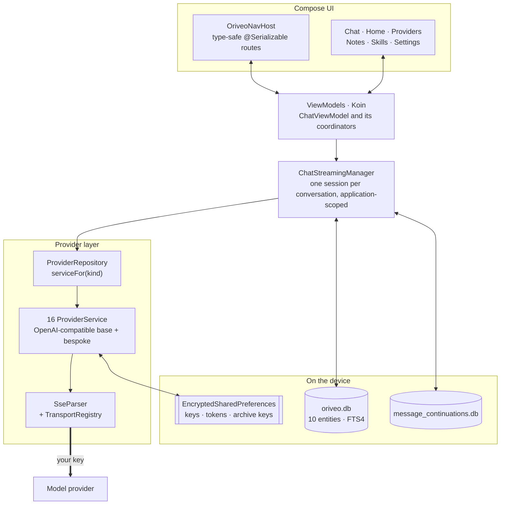

<div align="center">

# Oriveo for Android

**A native Jetpack Compose chat client for the AI models you already pay for.**

<a href="../LICENSE"></a>


<sub>

**English** ·
<a href="../readme_i18n/ar/android.md">العربية</a> ·
<a href="../readme_i18n/de/android.md">Deutsch</a> ·
<a href="../readme_i18n/es/android.md">Español</a> ·
<a href="../readme_i18n/fr/android.md">Français</a> ·
<a href="../readme_i18n/hi/android.md">हिन्दी</a> ·
<a href="../readme_i18n/id/android.md">Indonesia</a> ·
<a href="../readme_i18n/ja/android.md">日本語</a> ·
<a href="../readme_i18n/ko/android.md">한국어</a> ·
<a href="../readme_i18n/pt-BR/android.md">Português</a> ·
<a href="../readme_i18n/ru/android.md">Русский</a> ·
<a href="../readme_i18n/th/android.md">ไทย</a> ·
<a href="../readme_i18n/tr/android.md">Türkçe</a> ·
<a href="../readme_i18n/vi/android.md">Tiếng Việt</a> ·
<a href="../readme_i18n/zh-Hans/android.md">简体中文</a> ·
<a href="../readme_i18n/zh-Hant/android.md">繁體中文</a>

</sub>

</div>

---

The Oriveo Android client is a bring-your-own-key AI chat app. You add API keys you already own,
and the app talks to each provider directly from the phone. Conversations, notes, folders, and
skills are stored on the device in Room; API keys are encrypted with a key held in the Android
Keystore. There is no account and no sign-in.

It is part of [Oriveo Community Edition](../README.md) — three clients that share one definition of
how to talk to a model provider.

## Architecture



Three things in this diagram are deliberate design decisions rather than incidental structure.

**Streaming lives above the screen.** `ChatStreamingManager` keeps one `StreamingSession` per
conversation id in a `ConcurrentHashMap`, each running as its own `Job` on a single
application-scoped `CoroutineScope(SupervisorJob() + Dispatchers.IO)` — the supervisor is the point,
so one stream failing does not take the others down. Navigating away from a chat does not cancel the
answer, and `ChatRepository` flushes partial text to SQLite whenever `StreamingTokenBuffer` says
enough has accumulated (4,000 characters or 60 seconds), so killing the app mid-answer does not lose
what already arrived.

**Two databases, not one.** `oriveo.db` holds conversations, messages, attachments, notes,
folders, skills, and the model-catalog cache. `message_continuations.db` is a physically separate
file holding opaque provider continuation state, precisely so `backup_rules.xml` and
`data_extraction_rules.xml` can exclude it from cloud backup and device transfer — a continuation
token restored onto another device is meaningless at best.

**A catalog newer than the binary degrades, it does not break.** `TransportKind` is a closed enum
with a lenient deserializer: an unknown transport string decodes to `null`, `TransportRegistry`
returns no strategy, and the model is filtered out of the picker. The alternative — a strict enum —
would fail the whole catalog parse and take every other model down with it.

## What a model is allowed to do

The client never guesses a model's capabilities from its name. It reads a capability runtime from
the catalog: recipes describing, for a given provider, transport, and capability, exactly which
JSON pointers to write into the request. `ProviderRecipeRequestCompiler` validates the recipe
against the provider, capability, and transport before compiling it into an owned body delta, and
rejects with a named reason (`recipe_not_found`, `transport_mismatch`, `model_route_must_not_patch_body`)
rather than silently producing a request nobody reviewed.

Coming back, `CapabilityEvidenceFacade` ranks what is actually known about a capability by source —
`operator_override` > `server_typed` > `server_profile` > `model_facts` > `relay_verification` >
`relay_declaration` > `legacy_metadata`. Only the stream parser may mark a capability *observed*;
intent, recipes, an HTTP 200, and a tool declaration explicitly do not count. The per-message
result is persisted, so the UI can distinguish *requested* from *confirmed*.

Overrides resolve last-write-wins across seven scopes, in priority order: `single_send` >
`conversation_connection_model` > `skill_agent` > `connection_model` > `connection` >
`provider_recipe` > `provider_default`.

## Storage and secrets

| What | Where |
|---|---|
| Conversations, messages, attachments, notes, folders, skills | Room, `oriveo.db` |
| Full-text search over notes | FTS4 virtual table |
| Model catalog cache | a single row in `oriveo.db`, read back in chunks |
| Provider continuation state | `message_continuations.db`, excluded from backup |
| Provider API keys | `EncryptedSharedPreferences`, AES-256-GCM, Keystore-held master key |
| Subscription OAuth tokens | a second, separate encrypted preferences file |
| Backup archive keys | a third |
| Attachment blobs | files on disk, referenced by id |

The three encrypted preference files are separated by lifetime and blast radius rather than merged
for convenience. Each has a recovery path: a corrupted file (`AEADBadTagException`,
`VERIFICATION_FAILED`) is detected, deleted, and recreated instead of crashing the app on every
launch.

All three, and the continuation database, are excluded from Android cloud backup and device
transfer. That is a consequence of binding them to the Keystore rather than an oversight — the
ciphertext would be undecryptable on the new device anyway. **After moving to a new phone you
re-enter your API keys and sign in to any provider subscription again**; conversations and notes
come across normally.

An archive you export yourself is a zip holding `data.json` plus the attachment files. The password
you choose protects **only the provider API keys** inside it: they are encrypted with
PBKDF2-HMAC-SHA256 at 600,000 iterations and AES-GCM and stored as one field of `data.json`.
Conversations, messages, notes, folders, skills, preferences and attachments are written as plain
JSON and plain files either way, so treat an archive as readable by anyone who has the file. Export
without keys if you only want your history.

## Reaching a model server on your own network

The manifest sets `android:usesCleartextTraffic="true"`, deliberately: local model servers —
llama.cpp, Ollama, LM Studio, vLLM — speak plain HTTP on your own machine or LAN, and generally have
no certificate.

The real boundary is in code, not in the manifest, because it has to be. `RelayEndpointPolicy`
resolves the host, requires **every** resolved address to be private (loopback, RFC 1918, link-local,
unique-local, and the CGNAT range in VPN mode), rejects a host that resolves to a mix of public and
private addresses, pins the resolved address set against DNS rebinding, and re-verifies it at send
time. It refuses any cleartext request carrying credential material. Redirects are not followed at
all on the discovery and local-engine clients, with that address pin as the backstop.

An Android network security config cannot express that set: it matches on hostname only, has no
syntax for address ranges, and the addresses here come from the user's own network at runtime.
A config would also be strictly weaker, since it never sees the address a name resolved to.

## The model catalog

The app reads model capabilities and prices from a public catalog so a model released today works
without an app update. It is a plain HTTPS `GET` with no credentials and no identifier attached,
and chat requests never go near it. Only two endpoints are requested:

```
GET {base}/api/metadata?view=lean
GET {base}/api/metadata/model-facts
```

The base URL is a build-time property, defaulting to `https://api.oriveoai.com`:

```bash
./gradlew :app:assembleDebug -PORIVEO_METADATA_BASE_URL=https://your.host
```

Responses are ETag-revalidated and cached in `oriveo.db`, so once a fetch has succeeded the app
keeps working from the cached copy when the catalog is later unreachable.

> [!IMPORTANT]
> Building with an empty value (`-PORIVEO_METADATA_BASE_URL=`) disables catalog fetching entirely,
> and there is **no snapshot bundled in the APK**. On a fresh install of such a build:
>
> - none of the 15 built-in providers gets a model list, and the app does not ask the provider for
>   one — the catalog is the only source;
> - the provider detail screen shows an "Unable to load official models" banner, but adding the key
>   still reports success and the model picker is simply empty;
> - **OpenAI becomes unusable**, because manual model entry is blocked for that provider;
> - Relay endpoints and local model servers still work fully, and are the only intact path.
>
> If you want an offline build, serve the catalog yourself and point the build at it rather than
> emptying the value.

## Project layout

```
android/
  app/src/main/java/ai/oriveo/community/
    core/
      provider/    every provider service, transports, relay, capability recipes
      data/        Room entities, DAOs, repositories, backup, catalog client
      model/       domain models and the capability/preference resolvers
      attachments/ routing, budgets, per-format text extraction
      security/    SecureKeyStore, BackupCrypto, external-URL policy
      streaming/   ChatStreamingManager
      navigation/  AppRoute, OriveoNavHost
    feature/       one package per screen
    ui/            shared components, Markdown + LaTeX renderer, theme
    di/            Koin modules
  benchmark/       macrobenchmark suite (cold start, model picker)
```

## Building

Requirements: **JDK 21** and the Android SDK. The build uses AGP 9.3, Gradle 9.5 and
Kotlin 2.3, so Android Studio has to be a release that can sync AGP 9.3; from the command line only
the JDK and SDK are needed.

```bash
./gradlew :app:assembleDebug
./gradlew :app:testDebugUnitTest
```

The build targets `minSdk 26`, `targetSdk 36`, `compileSdk 37`. `local.properties` (your SDK path)
is generated by Android Studio and is not committed. Release signing is described in
[SIGNING.md](SIGNING.md).

> [!NOTE]
> The Gradle daemon runs on a Java 21 toolchain (`gradle/gradle-daemon-jvm.properties`), and the
> match is on 21 exactly, not "21 or newer". With any other JDK installed, Gradle downloads a JDK 21
> for itself on the first build, which needs network access; installing JDK 21 yourself avoids it.
> If you have set `org.gradle.java.installations.auto-download=false`, that download cannot happen
> and the build fails with `Toolchain auto-provisioning is not enabled.` — that is the one case
> where JDK 17 alone is genuinely not enough. Compilation targets Java 17 either way.

Unit-test parallelism is derived from the machine's CPU count and physical memory rather than
hard-coded, so the suite behaves on both a laptop and a large workstation.

## Dependencies

| Library | Version | Used for |
|---|---|---|
| Jetpack Compose BOM | 2026.08.00 | UI, Material 3 |
| Room | 2.8.4 | SQLite, DAOs, FTS4 |
| Koin | 4.2.2 | dependency injection |
| Ktor client (OkHttp engine) | 3.5.2 | provider HTTP and SSE |
| kotlinx.serialization | 1.11.0 | JSON |
| navigation-compose | 2.9.6 | type-safe routes |
| androidx.security-crypto | 1.1.0 | `EncryptedSharedPreferences` |
| haze | 1.7.3 | background blur |
| PDFBox-Android, jsoup | 2.0.27.0, 1.23.2 | attachment text extraction |
| jlatexmath-android | 0.2.0 | LaTeX rendering |

Exact versions are pinned in [`gradle/libs.versions.toml`](gradle/libs.versions.toml).

## Testing

```bash
./gradlew :app:testDebugUnitTest
```

Roughly 3,000 unit tests across 318 files, using JUnit 4, MockK, Robolectric,
`kotlinx-coroutines-test` and Ktor's mock engine. Coverage is heaviest where mistakes are most
expensive: request shape per provider, SSE parsing, transport selection, relay probing and security
modes, capability recipe execution, catalog caching and contract-version handling, Room persistence,
and backup round-trips.

> [!IMPORTANT]
> Around 38 suites load contract fixtures by resolving `../../shared` from the Gradle module
> directory, so **the tests only pass in a full checkout** — copying `android/` out on its own will
> not work.

There are also three instrumented tests — a local-engine release matrix, a cleartext-socket test,
and a keystore isolation test. They are not self-contained: the local-engine ones need
instrumentation arguments naming a real running model server on your network, so
`connectedAndroidTest` does not pass out of the box. The unit suite is the gate for a pull request.

The `:benchmark` module holds macrobenchmarks for cold start and the model picker. It is a separate
Gradle module using `com.android.test` with self-instrumentation, and it drives a dedicated
`benchmark` build type of `:app`.

Both databases are at `version = 1` with no migrations yet; schemas are exported to `app/schemas/`
and committed, which is where the first migration's `2.json` will land.

## Localization

Sixteen languages: `values/` (English, the source) plus fifteen `values-*` directories, about 1,300
strings each, with every locale holding an identical key set. In-app language switching goes
through `AppLanguageManager` and `android:localeConfig`. Language splits are disabled in the bundle
so a single artifact carries every translation.

## Contributing

See [CONTRIBUTING.md](../CONTRIBUTING.md). The working language of the project is English: source,
comments, tests and commit messages. UI strings are translated — add a new string to `values/`
first and leave the other locales to follow. Run the unit tests before opening a pull request.

## License

[AGPL-3.0-or-later](../LICENSE).
