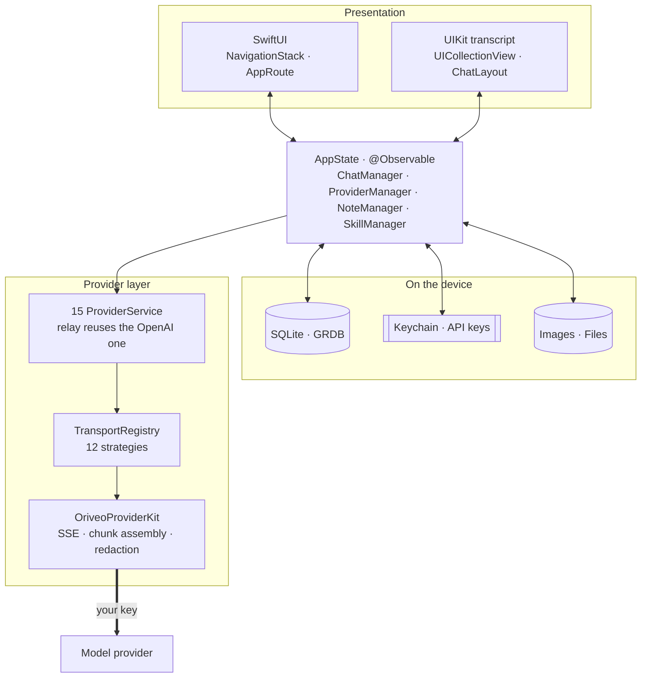

<div align="center">

# Oriveo for iOS

**A native SwiftUI chat client for the AI models you already pay for.**

<a href="../LICENSE"></a>


<sub>

**English** ·
<a href="../readme_i18n/ar/ios.md">العربية</a> ·
<a href="../readme_i18n/de/ios.md">Deutsch</a> ·
<a href="../readme_i18n/es/ios.md">Español</a> ·
<a href="../readme_i18n/fr/ios.md">Français</a> ·
<a href="../readme_i18n/hi/ios.md">हिन्दी</a> ·
<a href="../readme_i18n/id/ios.md">Indonesia</a> ·
<a href="../readme_i18n/ja/ios.md">日本語</a> ·
<a href="../readme_i18n/ko/ios.md">한국어</a> ·
<a href="../readme_i18n/pt-BR/ios.md">Português</a> ·
<a href="../readme_i18n/ru/ios.md">Русский</a> ·
<a href="../readme_i18n/th/ios.md">ไทย</a> ·
<a href="../readme_i18n/tr/ios.md">Türkçe</a> ·
<a href="../readme_i18n/vi/ios.md">Tiếng Việt</a> ·
<a href="../readme_i18n/zh-Hans/ios.md">简体中文</a> ·
<a href="../readme_i18n/zh-Hant/ios.md">繁體中文</a>

</sub>

</div>

---

The Oriveo iOS client is a bring-your-own-key AI chat app. You add API keys you already own, and
the app calls each provider directly from the phone. Conversations, notes, folders, skills, and
attachments are stored on the device in SQLite; API keys go to the iOS Keychain. There is no
account and no sign-in.

It is part of [Oriveo Community Edition](../README.md) — three clients that share one definition of
how to talk to a model provider.

## Architecture



Three things about this diagram are worth stating plainly.

**The transcript is UIKit, the rest is SwiftUI.** `ChatView` embeds a
`ChatListViewControllerRepresentable` around a `UICollectionView` driven by
[ChatLayout](https://github.com/ekazaev/ChatLayout). Everything else — navigation, settings,
provider setup, notes, skills — is SwiftUI. The split exists because a token-rate streaming
transcript needs cell-level control over measurement and reuse that SwiftUI's diffing does not give.
[`Features/Chat/ARCHITECTURE.md`](Oriveo/Oriveo/Features/Chat/ARCHITECTURE.md) documents the
boundary.

**Three separate paths update that transcript**, deliberately:

| Path | Carries | Why |
|---|---|---|
| `@Observable AppState` | structural changes — a message appears, a conversation switches | SwiftUI-native, cheap for low-frequency events |
| GRDB `ValueObservation` | durable state read back from SQLite | one source of truth after a write, survives a relaunch |
| Combine `PassthroughSubject` per conversation | streaming text and reasoning deltas | bypasses SwiftUI diffing entirely at token rate |

**Provider support is four independent axes, not one enum.** `ProviderKind` (16 cases) is *who the
user configured*. `ProviderServiceProtocol` is *the call surface*. `TransportKind` (12 cases) is
*which wire protocol is actually spoken* — and it is resolved **per model, from the catalog**, so
two models behind the same key can disagree. `RelayKind` covers user-supplied endpoints. Keeping
them separate is what lets a new model work without a new build.

### How one message is sent


`BaseAPIService.encodeChatBody` is the single point where a request body becomes bytes. Every
capability recipe, generation parameter, and custom field has to pass through it, which is what
makes the wire format testable in one place instead of fifteen.

## What a model is allowed to do

The client never guesses a model's capabilities from its name. It reads a **capability runtime** —
a set of recipes describing, for a given provider, transport, and capability, exactly which JSON
pointers to write into the request. Those recipes live in
[`shared/capabilityrecipe`](../shared/capabilityrecipe/) and are applied by
`CapabilityRecipeRequestCompiler`.

On the way back, `CapabilityExecutionRuntime` records what actually happened. Only a selected
production stream parser may promote a capability to *observed*. An HTTP 200, a non-empty answer,
and a tool declaration in the request are explicitly **not** evidence. The terminal state is stored
per message, so the UI can tell you a control was requested but never confirmed rather than
silently implying it worked.

## Storage

```
Application Support/Oriveo/
  active-uid                     # storage partition, "guest" by default
  users/<uid>/
    oriveo.sqlite                # conversations, messages, notes, catalog cache
    Images/  Files/              # attachment blobs, referenced by id
    session-snapshot.json        # preferences, provider list (never API keys)
```

- **SQLite through GRDB** with WAL, foreign keys on, and a `DatabaseMigrator` covering every schema
  change. Full-text search over messages and notes uses FTS5 with a trigram tokenizer.
- **API keys live in the Keychain**, keyed by provider and partition, and are blanked out of the
  session snapshot before it is written.
- **Attachment blobs are files on disk**, not rows, so a large PDF never bloats the database.

## The one network call the app makes for itself

On cold start the app issues two unauthenticated, ETag-conditional `GET` requests to
`https://api.oriveoai.com` — `/api/metadata?view=lean` and `/api/metadata/model-facts`. They fetch
the public model catalog: which models exist, what each supports, how its reasoning controls are
named, and what it costs. No key, no conversation, and no identifier is attached, and the response
is cached in SQLite so the app works from the cached copy when the catalog is unreachable.

This is the only request the app makes on its own behalf. Everything else goes to a provider you
configured, with your key.

To point a **Debug** build at your own catalog host, set `ORIVEO_METADATA_BASE_URL` — either as a
scheme environment variable or as a key in `ios/Oriveo/Config/Info.plist`. Unlike the Android and
web clients, a Release build ignores it and always uses the published catalog; changing that means
editing `BackendURLResolver`.

## Project layout

```
ios/Oriveo/
  Oriveo.xcodeproj/
  Oriveo/
    Core/
      Providers/       15 provider services, transports, capability runtime, catalog client
      State/           AppState and the managers it owns
      Database/        GRDB pool, schema, migrator, stores, observations
      Models/          domain types
      Attachments/     import limits, budgets, per-format text extraction
      Tools/           tool-call loop and per-protocol adapters
    Features/
      Chat/            transcript, composer, model controls, export
      Providers/       setup, detail, relay, local engines, subscription sign-in
      Home/ Notes/ Skills/ Settings/ Backup/ Onboarding/
    Shared/Components/ shared views
    DesignSystem/      theme, colour, haptics
  OriveoTests/
```

## Build and run

You need a Mac with **Xcode 26** and a device on **iOS 18 or later**. A free Apple Developer
account is enough; the app uses no paid capabilities and ships an empty entitlements file.

1. Open `ios/Oriveo/Oriveo.xcodeproj`
2. Select the `Oriveo` scheme
3. Under **Signing & Capabilities**, choose your own Team
4. If Xcode cannot register `ai.oriveo.community`, change the bundle identifier to one your team owns
5. Connect your iPhone, enable Developer Mode, trust the computer, and Run

To build for the Simulator instead, pick any iPhone simulator and Run. Package dependencies resolve
from the committed `Package.resolved`.

The project file uses `objectVersion = 77` with file-system synchronized groups, so an older Xcode
may refuse to open it. Update Xcode rather than editing the project format.

> [!NOTE]
> The app target compiles in Swift 5 language mode with `SWIFT_APPROACHABLE_CONCURRENCY` and
> `SWIFT_DEFAULT_ACTOR_ISOLATION = MainActor`. The local `OriveoProviderKit` package declares
> `swift-tools-version: 6.1` and builds in Swift 6 language mode.

## Dependencies

| Package | Version | Used for |
|---|---|---|
| [GRDB.swift](https://github.com/groue/GRDB.swift) | 7.11.1 | SQLite access, migrations, `ValueObservation` |
| [ChatLayout](https://github.com/ekazaev/ChatLayout) | 2.4.3 | the transcript's collection-view layout |
| [swift-markdown-ui](https://github.com/gonzalezreal/swift-markdown-ui) | 2.4.1 | Markdown rendering |
| [SwiftMath](https://github.com/mgriebling/SwiftMath) | 1.7.3 | LaTeX rendering |
| [ZIPFoundation](https://github.com/weichsel/ZIPFoundation) | 0.9.20 | backup archives, Office/EPUB/ODF extraction |
| `OriveoProviderKit` | local | the provider wire kernel, in [`shared/`](../shared/README.md) |

## Testing

Run the `Oriveo` scheme's test action (⌘U) in Xcode, or from the repository root:

```bash
xcodebuild test -project ios/Oriveo/Oriveo.xcodeproj -scheme Oriveo \
  -destination 'platform=iOS Simulator,name=iPhone 17'
```

Substitute a simulator you actually have — `xcrun simctl list devices available` lists them.

> [!IMPORTANT]
> The test target reads contract fixtures from `shared/` by walking up from `#filePath` until it
> finds that directory. Around 29 suites depend on it, so **the tests only pass in a full checkout**
> — copying `ios/` out on its own will not work.

The suite is large: roughly 2,900 tests across 273 files, mostly [Swift
Testing](https://github.com/swiftlang/swift-testing). It covers request shape per provider,
recorded upstream SSE replay, relay and local-engine policy, transcript measurement and streaming
behaviour, storage, and backup round-trips.

`shared/OriveoProviderKit` has its own suite:

```bash
cd shared/OriveoProviderKit && swift test
```

## Localization

Sixteen languages, stored as Xcode String Catalogs (`.xcstrings`) — ten catalogs, about 1,900 keys,
English as the source. Strings are resolved through `L10n.tr(_:table:)` against an `.lproj` bundle
chosen from the user's in-app language setting, so switching language takes effect without
relaunching. Right-to-left layout for Arabic is handled explicitly.

## Contributing

See [CONTRIBUTING.md](../CONTRIBUTING.md). Add a test with a behaviour change; for a provider
protocol fix, prefer a recorded fixture under `shared/test-fixtures` over a hand-written mock, and
say which provider and model you tested against.

## License

[AGPL-3.0-or-later](../LICENSE).
