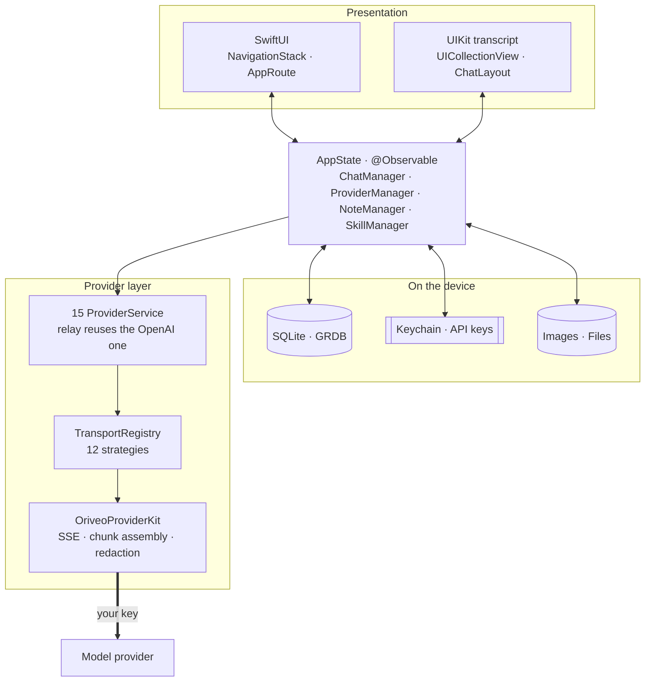
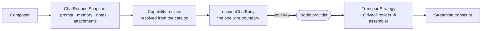

<div align="center">

# Oriveo for iOS

**A native SwiftUI chat client for the AI models you already pay for.**

<a href="../LICENSE"></a>


<sub>

**English** ·
<a href="../readme_i18n/ar/ios.md">العربية</a> ·
<a href="../readme_i18n/de/ios.md">Deutsch</a> ·
<a href="../readme_i18n/es/ios.md">Español</a> ·
<a href="../readme_i18n/fr/ios.md">Français</a> ·
<a href="../readme_i18n/hi/ios.md">हिन्दी</a> ·
<a href="../readme_i18n/id/ios.md">Indonesia</a> ·
<a href="../readme_i18n/ja/ios.md">日本語</a> ·
<a href="../readme_i18n/ko/ios.md">한국어</a> ·
<a href="../readme_i18n/pt-BR/ios.md">Português</a> ·
<a href="../readme_i18n/ru/ios.md">Русский</a> ·
<a href="../readme_i18n/th/ios.md">ไทย</a> ·
<a href="../readme_i18n/tr/ios.md">Türkçe</a> ·
<a href="../readme_i18n/vi/ios.md">Tiếng Việt</a> ·
<a href="../readme_i18n/zh-Hans/ios.md">简体中文</a> ·
<a href="../readme_i18n/zh-Hant/ios.md">繁體中文</a>

</sub>

</div>

---

The Oriveo iOS client is a bring-your-own-key AI chat app. You add API keys you already own, and
the app calls each provider directly from the phone. Conversations, messages, notes and note
folders live in an on-device SQLite database; attachment blobs are files beside it; skills,
preferences, the provider list and conversation folders are on-device JSON. API keys go to the iOS
Keychain.

There is no Oriveo account: nothing is uploaded, and there is nothing to sign in to. Two providers
do offer signing in with a subscription you already have instead of pasting a key — ChatGPT and
Grok — and that sign-in goes to OpenAI and xAI, not to us.

It is part of [Oriveo Community Edition](../README.md) — three clients that share one definition of
how to talk to a model provider.

## Architecture



Three things about this diagram are worth stating plainly.

**The transcript is UIKit, the rest is SwiftUI.** `ChatView` embeds a
`ChatListViewControllerRepresentable` around a `UICollectionView` driven by
[ChatLayout](https://github.com/ekazaev/ChatLayout). Everything else — navigation, settings,
provider setup, notes, skills — is SwiftUI. The split exists because a token-rate streaming
transcript needs cell-level control over measurement and reuse that SwiftUI's diffing does not give.
[`Features/Chat/ARCHITECTURE.md`](Oriveo/Oriveo/Features/Chat/ARCHITECTURE.md) documents the
boundary.

**Three separate paths update that transcript**, deliberately:

| Path | Carries | Why |
|---|---|---|
| `@Observable AppState` | structural changes — a message appears, a conversation switches | SwiftUI-native, cheap for low-frequency events |
| GRDB `ValueObservation` | durable state read back from SQLite | one source of truth after a write, survives a relaunch |
| Combine `PassthroughSubject` per conversation | streaming text and reasoning deltas | bypasses SwiftUI diffing entirely at token rate |

**Provider support is four independent axes, not one enum.** `ProviderKind` (16 cases) is *who the
user configured*. `ProviderServiceProtocol` is *the call surface*. `TransportKind` (12 cases) is
*which wire protocol is actually spoken* — and it is resolved **per model, from the catalog**, so
two models behind the same key can disagree. `RelayKind` covers user-supplied endpoints. Keeping
them separate is what lets a new model work without a new build.

### How one message is sent



`BaseAPIService.encodeChatBody` is the last stop before an OpenAI-compatible request becomes
bytes — twelve of the sixteen providers go through it, so a capability recipe, generation parameter
or custom field is testable in one place rather than twelve. OpenAI, Anthropic and Gemini speak
their own shapes and serialize in their own services; each of those points is covered by its own
request-shape suite.

## What a model is allowed to do

The client never guesses a model's capabilities from its name. It reads a **capability runtime** —
a set of recipes describing, for a given provider, transport, and capability, exactly which JSON
pointers to write into the request. Those recipes live in
[`shared/capabilityrecipe`](../shared/capabilityrecipe/) and are applied by
`CapabilityRecipeRequestCompiler`.

On the way back, `CapabilityExecutionRuntime` records what actually happened. Only a selected
production stream parser may promote a capability to *observed*. An HTTP 200, a non-empty answer,
and a tool declaration in the request are explicitly **not** evidence. The terminal state is stored
per message, so the UI can tell you a control was requested but never confirmed rather than
silently implying it worked.

## Storage

```
Application Support/Oriveo/
  active-uid                     # storage partition, "guest" by default
  users/<uid>/
    oriveo.sqlite                # conversations, messages, notes, catalog cache
    Images/  Files/              # attachment blobs, referenced by id
    session-snapshot.json        # preferences, provider list, folders, last used model
```

- **SQLite through GRDB** with WAL, foreign keys on, and a `DatabaseMigrator` covering every schema
  change. Full-text search over messages and notes uses FTS5 with a trigram tokenizer.
- **API keys live in the Keychain**, keyed by provider and partition, and are blanked out of the
  session snapshot before it is written. Skills are stored separately as JSON in `UserDefaults`.
- **Attachment blobs are files on disk**, not rows, so a large PDF never bloats the database.

A backup is a `.oriveo` ZIP holding `data.json` plus the image files. The optional password does not
encrypt the archive: it encrypts only the provider API keys inside it (AES-GCM, with a key derived
by PBKDF2-HMAC-SHA256 over 600,000 iterations). Conversations, notes, skills and preferences are
plain JSON in the archive either way, so treat a backup file as readable by anyone who has it.

## The requests the app makes for itself

On cold start the app issues one unauthenticated, ETag-conditional `GET` to
`https://api.oriveoai.com/api/metadata?view=lean`. It fetches the public model catalog: which models
exist, what each supports, how its reasoning controls are named, and what it costs. No key, no
conversation and no identifier is attached, and the response is cached in SQLite so the app works
from the cached copy when the catalog is unreachable. A second endpoint,
`/api/metadata/model-facts`, is read only after you sign in with a ChatGPT or Grok subscription, to
learn what that subscription's models can do.

These are the only requests the app makes on its own behalf. Everything else goes to a provider you
configured, with your key.

Pointing the catalog at your own host is a **Debug-build convenience**, resolved in
`Oriveo/Core/Providers/BackendURLResolver.swift` in this order:

1. the `ORIVEO_METADATA_BASE_URL` environment variable, set in the scheme's Run action; then
2. an `ORIVEO_METADATA_BASE_URL` string in `ios/Oriveo/Config/Info.plist` — the key is already
   there and empty, so filling it in is enough; then
3. `https://api.oriveoai.com`.

Two things to know. A Release build ignores both and always uses the published catalog; changing
that means editing `BackendURLResolver`. And when the test bundle is running, or with `CI=true`, an
override pointing at a private address (localhost, `10/8`, `192.168/16`, `172.16/12`, `.local`,
link-local IPv6) is ignored, so a leftover local host cannot make the suite depend on whichever
machine you are sitting at.

## Project layout

```
ios/Oriveo/
  Config/Info.plist    the app's Info.plist; GENERATE_INFOPLIST_FILE is off
  Oriveo.xcodeproj/
  Oriveo/
    Core/
      Providers/       15 provider services, transports, capability runtime, catalog client
      State/           AppState and the managers it owns
      Database/        GRDB pool, schema, migrator, stores, observations
      Models/          domain types
      Attachments/     import limits, budgets, per-format text extraction
      Tools/           tool-call loop and per-protocol adapters
      Cache/ Localization/ Observability/ Reachability/ Routing/ Usage/
    Features/
      App/             root view and tab shell
      Chat/            transcript, composer, model controls, cross-check, export
      Providers/       setup, detail, relay, local engines, subscription sign-in
      Home/ Notes/ Skills/ Settings/ Backup/ Onboarding/
    Shared/Components/ shared views
    DesignSystem/      theme, colour, haptics
    Preview/           sample data for SwiftUI previews
    *.xcstrings        ten string catalogs
    Assets.xcassets · PrivacyInfo.xcprivacy · Oriveo.entitlements
  OriveoTests/
```

## Build and run

You need **Xcode 26**, and to run on hardware a device on **iOS 18 or later**. A free Apple
Developer account is enough: the entitlements file is empty and the app uses no paid capability —
no push, no iCloud, no app groups, no associated domains.

Xcode 16.3 is the floor the project format and Swift tools version actually impose, but the target
sets `SWIFT_APPROACHABLE_CONCURRENCY` and `SWIFT_DEFAULT_ACTOR_ISOLATION = MainActor`, which older
Xcode versions ignore without saying so. Silently changing actor isolation is a poor way to find
that out, so build with Xcode 26.

1. Open `ios/Oriveo/Oriveo.xcodeproj`
2. Select the `Oriveo` scheme
3. Under **Signing & Capabilities**, choose your own Team
4. If Xcode cannot register `ai.oriveo.community`, change the bundle identifier to one your team owns
5. Connect your iPhone, enable Developer Mode, trust the computer, and Run

To build for the Simulator instead, pick any iPhone simulator and Run. Package dependencies resolve
from the committed `Package.resolved`.

**On an Apple silicon Mac** the iPhone build also runs natively: choose the **My Mac (Designed for
iPad)** destination. Mac Catalyst is deliberately off (`SUPPORTS_MACCATALYST = NO`), so this is the
iOS app under the iPad compatibility runtime rather than a Mac app — device-only paths such as
camera capture behave the way they do on a Mac.

The project file uses `objectVersion = 77` with file-system synchronized groups, so an older Xcode
may refuse to open it. Update Xcode rather than editing the project format.

> [!NOTE]
> The app target compiles in Swift 5 language mode with `SWIFT_APPROACHABLE_CONCURRENCY` and
> `SWIFT_DEFAULT_ACTOR_ISOLATION = MainActor`. The local `OriveoProviderKit` package declares
> `swift-tools-version: 6.1` and builds in Swift 6 language mode.

## Dependencies

| Package | Version | Used for |
|---|---|---|
| [GRDB.swift](https://github.com/groue/GRDB.swift) | 7.11.1 | SQLite access, migrations, `ValueObservation` |
| [ChatLayout](https://github.com/ekazaev/ChatLayout) | 2.4.3 | the transcript's collection-view layout |
| [swift-markdown-ui](https://github.com/gonzalezreal/swift-markdown-ui) | 2.4.1 | Markdown rendering |
| [SwiftMath](https://github.com/mgriebling/SwiftMath) | 1.7.3 | LaTeX rendering |
| [ZIPFoundation](https://github.com/weichsel/ZIPFoundation) | 0.9.20 | backup archives, Office/EPUB/ODF extraction |
| `OriveoProviderKit` | local | the provider wire kernel, in [`shared/`](../shared/README.md) |

`Package.resolved` also pins the two transitive dependencies swift-markdown-ui brings in:
[NetworkImage](https://github.com/gonzalezreal/NetworkImage) 6.0.1 and
[swift-cmark](https://github.com/swiftlang/swift-cmark) 0.8.0. Every direct dependency is MIT
licensed and swift-cmark is BSD-2-Clause, all compatible with AGPL-3.0-or-later.

## Testing

Run the `Oriveo` scheme's test action (⌘U) in Xcode, or from the repository root:

```bash
xcodebuild test -project ios/Oriveo/Oriveo.xcodeproj -scheme Oriveo \
  -destination 'platform=iOS Simulator,name=iPhone 16'
```

Substitute a simulator you actually have; `xcodebuild -showdestinations` with the same project and
scheme lists everything this checkout can build for.

> [!IMPORTANT]
> The test target reads contract fixtures from `shared/` by walking up from `#filePath` until it
> finds that directory, so **the tests only pass in a full checkout** — copying `ios/` out on its
> own will not work.

The suite is large: about 2,900 [Swift Testing](https://github.com/swiftlang/swift-testing) cases
plus 76 XCTest ones, across 274 files. It covers request shape per provider, recorded upstream SSE
replay, relay and local-engine policy, transcript measurement and streaming behaviour, storage, and
backup round-trips.

`shared/OriveoProviderKit` has its own suite:

```bash
cd shared/OriveoProviderKit && swift test
```

## Localization

Sixteen languages, stored as Xcode String Catalogs (`.xcstrings`) — ten catalogs, about 1,340 keys,
English as the source. Every key is translated into all sixteen, apart from the few marked
`shouldTranslate: false`: the product name, punctuation, format skeletons and protocol values that
would be wrong to localize. Strings are resolved through `L10n.tr(_:table:)` against an `.lproj`
bundle chosen from the user's in-app language setting, so switching language takes effect without
relaunching. Right-to-left layout for Arabic is handled explicitly.

## Contributing

See [CONTRIBUTING.md](../CONTRIBUTING.md). Add a test with a behaviour change; for a provider
protocol fix, prefer a recorded fixture under `shared/test-fixtures` over a hand-written mock, and
say which provider and model you tested against.

## License

[AGPL-3.0-or-later](../LICENSE).
