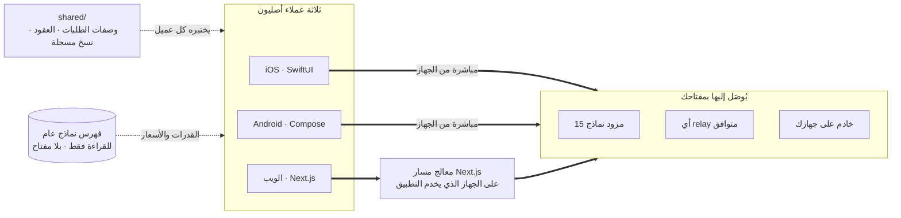

<div align="center">


# Oriveo Community Edition

**كل النماذج، تطبيق واحد.**

عميل محادثة ذكاء اصطناعي مفتوح المصدر يعمل بمفتاحك الخاص، لنظامي iOS وAndroid وللويب،
مع عميل macOS أصلي قيد التطوير.
بلا حساب، بلا اشتراك، وبلا خدمة تابعة لنا في مسار الطلب.

<a href="../../LICENSE"></a>
<a href="ios.md"></a>
<a href="android.md"></a>
<a href="web.md"></a>
<a href="macos.md"></a>


**احصل على Oriveo:**
<a href="https://oriveoai.com"><b>oriveoai.com</b></a> &nbsp;·&nbsp;
<a href="https://apps.apple.com/app/oriveo/id6775370458">App Store</a> &nbsp;·&nbsp;
<a href="https://play.google.com/store/apps/details?id=com.kenny.oriveo">Google Play</a> &nbsp;·&nbsp;
<a href="https://app.oriveoai.com">تطبيق الويب</a>

<a href="#البدء">البناء من المصدر</a> &nbsp;·&nbsp;
<a href="#البنية">البنية</a> &nbsp;·&nbsp;
<a href="#نسخة-المجتمع-و-oriveo">الإصدارات</a> &nbsp;·&nbsp;
<a href="#الأسئلة-الشائعة">الأسئلة الشائعة</a> &nbsp;·&nbsp;
<a href="../../CONTRIBUTING.md">المساهمة</a>

<sub>

<a href="../../README.md">English</a> ·
**العربية** ·
<a href="../de/README.md">Deutsch</a> ·
<a href="../es/README.md">Español</a> ·
<a href="../fr/README.md">Français</a> ·
<a href="../hi/README.md">हिन्दी</a> ·
<a href="../id/README.md">Indonesia</a> ·
<a href="../ja/README.md">日本語</a> ·
<a href="../ko/README.md">한국어</a> ·
<a href="../pt-BR/README.md">Português</a> ·
<a href="../ru/README.md">Русский</a> ·
<a href="../th/README.md">ไทย</a> ·
<a href="../tr/README.md">Türkçe</a> ·
<a href="../vi/README.md">Tiếng Việt</a> ·
<a href="../zh-Hans/README.md">简体中文</a> ·
<a href="../zh-Hant/README.md">繁體中文</a>

</sub>

</div>

---

## ما هو Oriveo

Oriveo Community Edition هو عميل محادثة ذكاء اصطناعي مفتوح المصدر يعمل بمبدأ أحضر مفتاحك الخاص
(BYOK) لنظامي iOS وAndroid وللويب، مع عميل macOS أصلي قيد التطوير. وهو موجّه لمن يفضّل أن يدفع
لمزود النماذج مباشرة بدل أن يدفع اشتراكا لما يقف أمامه: أنت تزوّد التطبيق بمفاتيح API التي تملكها
أصلا، وهو يتحدث بها إلى المزود. وهذا يجعله بديلا محليا أولا ومتعدد النماذج لخطة ChatGPT أو Claude
مستضافة — بلا حساب Oriveo، وبلا اشتراك، ولا شيء يرفع إلينا تقارير، وعميل ويب يمكنك استضافته بنفسك.

يتحدث التطبيق مع **15 مزود نماذج** بشكل أصلي — OpenAI وAnthropic وGoogle Gemini وOpenRouter
وDeepSeek وGrok وMistral وGroq وTogether AI وFireworks AI وMiniMax وZ.ai وQwen وKimi (Moonshot)
وSiliconFlow — إضافة إلى **أي نقطة نهاية متوافقة مع OpenAI أو Anthropic أو Gemini** توجّهه إليها،
بما في ذلك llama.cpp أو Ollama أو LM Studio أو vLLM العاملة على جهازك أنت.

| | |
|---|---|
| **المزودون** | 15 مدمجا، إضافة إلى نقاط relay مخصصة وخوادم نماذج محلية |
| **العملاء** | iOS (SwiftUI) · Android (Jetpack Compose) · الويب (Next.js) · macOS قيد التطوير |
| **لغات الواجهة** | 16 |
| **الحساب المطلوب** | لا شيء |
| **النداءات التي يجريها لحسابه هو** | شيء واحد، في طلبين: فهرس نماذج للقراءة فقط، لا يحمل مفتاحا ولا أي معرّف نرفقه نحن |
| **الرخصة** | AGPL-3.0-or-later |

## لماذا يوجد

لا يجوز لأحد أن يضع عدّادا على النموذج الذي تدفع ثمنه، أو يسجّل ما تفعله به، أو يضيف هامشا إلى سعره.

- **مفاتيحك، وفاتورتك.** أنت تدفع السعر المعلن للمزود. لا هامش ربح، ولا عدّاد، ولا إعادة بيع.
- **محلي افتراضيا.** المحادثات والملاحظات والمجلدات والمهارات والمرفقات تبقى على الجهاز. صدّرها
  إلى ملف متى شئت؛ لا توجد نسخة سحابية قد تفقد الوصول إليها.
- **سلوك واحد، ثلاثة عملاء.** طريقة تشكيل الطلب لمزود ونقل وقدرة معيّنة مكتوبة مرة واحدة في
  [`shared/`](shared.md)، والعملاء الثلاثة يختبرون أنفسهم على نفس ملفات JSON المرجعية. الخصوصية
  التي تعيش في تلك البيانات تُصلَح مرة واحدة؛ أما التي تعيش في محلّل فتلتقطها ثلاث مجموعات اختبار
  في الوقت نفسه.
- **الشيء الوحيد الذي يجلبه.** يقرأ التطبيق فهرس نماذج عاما حتى يعمل نموذج صدر اليوم دون تحديث
  التطبيق. وطلباه كلاهما للقراءة فقط ولا يحملان مفتاحا ولا أي معرّف نرفقه نحن، ويمكن توجيه عميلي
  الويب وAndroid إلى مضيف خاص بك.

## المزايا

- **المحادثة** — بث مباشر، كتل استدلال، استشهادات، مرفقات (صور وفيديو، وPDF، وOffice
  (docx وxlsx وpptx)، وOpenDocument، وEPUB، وRTF، وHTML، وأي ملف نصي عادي أو ملف كود)، اقتباس جزء
  محدد، إعادة المحاولة، إعادة التوليد، والمتابعة بعد إجابة انقطعت
- **المزودون** — 15 مدمجا، لكل منها مفتاحك أنت؛ مع تجاوزات للنموذج ومعاملات التوليد لكل مزود،
  واختيار نقطة نهاية إقليمية حيث يوفّر المزود واحدة
- **Relay** — أي نقطة نهاية متوافقة مع OpenAI أو Anthropic أو Gemini، بما فيها واحدة على شبكتك المحلية
- **خوادم النماذج المحلية** — llama.cpp وOllama وLM Studio وvLLM وOpen WebUI؛ ويعثر عليها عميلا iOS
  وAndroid على الشبكة المحلية عبر mDNS
- **تسجيل الدخول بالاشتراك** — استخدم اشتراك ChatGPT أو Grok الذي تملكه بدل مفتاح API، عبر مسار
  تخويل الأجهزة الخاص بكل مزود
- **المهارات** — موجّهات نظام قابلة لإعادة الاستخدام، لكل منها نموذجها وإعداد الاستدلال الخاص بها
  ومستنداتها المرجعية
- **الملاحظات والمجلدات** — احفظ ردا كملاحظة، ونظّم المحادثات، وابحث في الاثنين
- **المقارنة المتقاطعة** — سلّم إجابة إلى نموذج ثان ليراجعها واحتفظ بالاثنتين معا
- **التكلفة** — الإنفاق لكل رسالة ولكل مزود، محسوبا على الجهاز مما أبلغت عنه كل استجابة فعليا،
  بما في ذلك مستويي قراءة التخزين المؤقت والكتابة إليه
- **توليد الصور** — حيثما يدعمه المزود
- **النسخ الاحتياطي** — صدّر كل شيء إلى ملف؛ ومفاتيح المزودين فيه، إن اخترت تضمينها، تُشفَّر بكلمة
  مرور تختارها أنت
- **16 لغة للواجهة**، بما في ذلك تخطيط كامل من اليمين إلى اليسار للعربية

## نسخة المجتمع و Oriveo

هذا المستودع هو **Oriveo Community Edition**، مرخّص بموجب
[AGPL-3.0-or-later](../../LICENSE). أما التطبيقات على App Store وGoogle Play وتطبيق الويب
المستضاف فهي **Oriveo** — منتج احتكاري منفصل مبني على العملاء أنفسهم، مع طبقة حساب فوقه.

| | نسخة المجتمع | Oriveo |
|---|---|---|
| المصدر | هذا المستودع، AGPL-3.0-or-later | احتكاري |
| المحادثة بمفاتيح المزود الخاصة بك | نعم | نعم |
| Relay وخوادم النماذج المحلية | نعم | نعم |
| الملاحظات والمجلدات والمهارات والمرفقات | نعم | نعم |
| تتبع التكلفة على الجهاز | نعم | نعم |
| الحساب | لا يوجد | حساب Oriveo |
| التخزين | على الجهاز؛ تصدير واستعادة يدويان | محلي أولا، مع مزامنة سحابية عبر الأجهزة |
| رؤى الاستخدام وتنبيهات الميزانية | — | نعم |
| نماذج تدفع Oriveo ثمنها | — | نعم |
| التحليلات وتقارير الأعطال | لا شيء. حزمة الويب تحمل Sentry، وهو صامت إلى أن تضبط DSN خاصا بك | نعم |

تستخدم بُنى نسخة المجتمع بادئة المعرّف `ai.oriveo.community`، فيمكن لواحدة منها أن تقيم على الجهاز
نفسه مع نسخة المتجر دون أن يتشاركا سلسلة مفاتيح أو أي بيانات محلية. وما تقبله هذه النسخة وما لا
تقبله مكتوب في [COMMUNITY.md](../../COMMUNITY.md).

**Oriveo، المنتج الكامل:**
[iPhone وiPad](https://apps.apple.com/app/oriveo/id6775370458) &nbsp;·&nbsp;
[Android](https://play.google.com/store/apps/details?id=com.kenny.oriveo) &nbsp;·&nbsp;
[الويب](https://app.oriveoai.com) &nbsp;·&nbsp;
[oriveoai.com](https://oriveoai.com)

## المزودون

يُوصَل إلى كل مزود أدناه بمفتاح تنشئه أنت بنفسك. ويمكن الوصول إلى اثنين منهما بتسجيل الدخول
باشتراك تملكه أصلا بدلا من مفتاح: OpenAI باشتراك ChatGPT، وGrok.

| المزود | من أين تحصل على مفتاح |
|---|---|
| OpenAI | [platform.openai.com](https://platform.openai.com/api-keys) |
| Anthropic | [platform.claude.com](https://platform.claude.com/settings/keys) |
| Google Gemini | [aistudio.google.com](https://aistudio.google.com/apikey) |
| OpenRouter | [openrouter.ai](https://openrouter.ai/keys) |
| DeepSeek | [platform.deepseek.com](https://platform.deepseek.com/api_keys) |
| Grok | [console.x.ai](https://console.x.ai/) |
| Mistral | [console.mistral.ai](https://console.mistral.ai/api-keys) |
| Groq | [console.groq.com](https://console.groq.com/keys) |
| Together AI | [api.together.xyz](https://api.together.xyz/settings/api-keys) |
| Fireworks AI | [fireworks.ai](https://fireworks.ai/api-keys) |
| MiniMax | [platform.minimax.io](https://platform.minimax.io/docs/guides/quickstart-preparation) |
| Z.ai | [open.bigmodel.cn](https://open.bigmodel.cn/usercenter/apikeys) |
| Qwen | [bailian.console.alibabacloud.com](https://bailian.console.alibabacloud.com/?apiKey=1#/api-key) |
| Kimi (Moonshot) | [platform.kimi.ai](https://platform.kimi.ai/console/api-keys) |
| SiliconFlow | [cloud.siliconflow.cn](https://cloud.siliconflow.cn/account/ak) |
| **Relay** | أي نقطة نهاية متوافقة مع OpenAI أو Anthropic أو Gemini، بما فيها واحدة على جهازك أنت |

## البنية

ثلاثة عملاء أصليون، وتعريف واحد لكيفية التحدث إلى مزود نماذج.



يملك كل عميل واجهته وتخزينه وتنقّله الخاص، ويلتقي بالعقود المشتركة عند وصلة واحدة فقط: الطبقة التي
تحوّل *هذا النموذج، وهذه القدرة* إلى طلب HTTP.

عدم التناظر الوحيد الجدير بالمعرفة هو عميل الويب. معظم واجهات المزودين لا ترسل ترويسات CORS، فلا
يستطيع المتصفح مناداتها مباشرة؛ لذلك تمر تلك الطلبات عبر معالج مسار Next.js يعمل على أي جهاز يخدم
التطبيق — جهازك أنت حين تشغّله محليا. أما النقاط القليلة التي تسمح فعلا بالمتصفح (نقطة Kimi في
الصين، ونقاط الرصيد لدى بضعة مزودين) ونقاط relay على شبكتك الخاصة فتُنادى مباشرة. وعميلا iOS
وAndroid لا قيد عليهما ويذهبان دائما إلى المزود مباشرة.

**بنية كل عميل:**

| | التقنيات | README |
|---|---|---|
| **iOS** | SwiftUI مع سجل محادثة بـ UIKit، وGRDB | [ios.md](ios.md) |
| **Android** | Jetpack Compose وRoom وKoin وKtor/OkHttp | [android.md](android.md) |
| **الويب** | Next.js App Router وReact وZustand وTypeScript | [web.md](web.md) |
| **macOS** | قيد التطوير، ويصل في الأشهر القادمة | [macos.md](macos.md) |
| **المشترك** | العقود والنسخ المسجلة ونواة الاتصال بلغة Swift | [shared.md](shared.md) |

## البدء

لا توجد هنا ثنائيات جاهزة — لا APK ولا `.ipa` ولا إصدارات منشورة. نسخة المجتمع مصدر تبنيه أنت
بنفسك، وتطبيقات المتجر هي المنتج الآخر. وعميل الويب هو أقصر طريق إلى تطبيق يعمل.

<details open>
<summary><b>الويب</b> — أسرع طريقة للتجربة</summary>

<br>

يتطلب Node 22.22 أو أحدث (انظر [`web/.nvmrc`](../../web/.nvmrc)).

```bash
cd web
npm install
npm run dev:app        # http://localhost:3001
```

تطلب منك الشاشة الأولى مفتاح API لمزود. ولا شيء آخر مطلوب.
مزيد من الأوامر والإعدادات: [web.md](web.md).

</details>

<details>
<summary><b>iOS</b> — بناؤه وتشغيله على iPhone الخاص بك</summary>

<br>

يتطلب جهاز Mac مع Xcode 26 وجهازا يعمل بنظام iOS 18 أو أحدث. يكفي حساب Apple Developer مجاني —
فالتطبيق لا يستخدم أي قدرات مدفوعة.

1. افتح `ios/Oriveo/Oriveo.xcodeproj`
2. اختر مخطط `Oriveo`
3. من Signing &amp; Capabilities اختر فريقك أنت
4. شغّل

الشرح الكامل، بما في ذلك ما تفعله إن رفض Xcode فتح المشروع: [ios.md](ios.md).

</details>

<details>
<summary><b>Android</b> — بناء ملف APK</summary>

<br>

يتطلب JDK 21 وAndroid SDK. يستخدم البناء AGP 9.3 وGradle 9.5 وKotlin 2.3، لذا يجب أن يكون
Android Studio بإصدار قادر على مزامنتها؛ أما من سطر الأوامر فيكفي JDK وSDK.

```bash
cd android
./gradlew :app:assembleDebug
```

تقديم فهرس النماذج من مضيفك الخاص: [android.md](android.md).

</details>

## الخصوصية

- **مفاتيح المزودين** تذهب إلى سلسلة مفاتيح iOS، وعلى Android إلى `EncryptedSharedPreferences`
  تحت مفتاح محفوظ في Android Keystore. لا يملك المتصفح وسيلة مكافئة، فتستقر على الويب دون تشفير في
  IndexedDB — وهو النموذج الذي تتبعه عموما عملاء BYOK داخل المتصفح. وللحصول على أقوى ضمان استخدم
  عميل iOS أو Android.
- **المحادثات والملاحظات والمجلدات والمهارات والمرفقات** تُخزَّن على الجهاز. لا يُرفَع أي شيء إلى أي مكان.
- **لا حساب، ولا تحليلات.** لا يوجد ما تسجّل الدخول إليه، ولا شيء يعدّ ما تفعله. وتتضمن حزمة الويب
  Sentry للإبلاغ عن الأخطاء؛ وهو يبقى صامتا إلى أن تضبط `NEXT_PUBLIC_SENTRY_DSN` على مشروع خاص بك،
  وإن فعلت فهو مهيّأ لتسجيل إعادة تشغيل الجلسات إلى جانب آثار المكدّس. أما عميلا iOS وAndroid فلا
  يحتويان أي حزمة إبلاغ على الإطلاق.
- **على iOS وAndroid تذهب طلبات المحادثة من الجهاز إلى المزود مباشرة.** أما على الويب فيمر معظمها
  عبر خادم Next.js الذي يخدم التطبيق، لأن معظم واجهات المزودين لا تسمح بالمناداة المباشرة من
  المتصفح؛ وذلك الخادم لا يحفظ مفاتيح ولا رسائل، وهو جهازك أنت حين تشغّل التطبيق محليا.
- **طلبان من عندنا:** فهرس نماذج للقراءة فقط، يُقرأ في نداءين — أحدهما لكيفية مخاطبة كل نموذج،
  والآخر للحقائق عن النماذج فرادى، وهو ما لا يقرؤه iOS إلا بعد تسجيل الدخول باشتراك — حتى يعمل
  نموذج صدر اليوم دون بناء جديد. ولا يحمل أي منهما
  مفتاحا ولا محادثة ولا أي معرّف نرفقه نحن. ويمكن توجيه عميل الويب (`NEXT_PUBLIC_BACKEND_URL`)
  وبناء Android (`-PORIVEO_METADATA_BASE_URL`) إلى مضيف خاص بك؛ أما على iOS فذلك التجاوز مجرد
  تسهيل في بُنى Debug.

## الأسئلة الشائعة

<details>
<summary><b>ماذا تعني BYOK؟</b></summary>

<br>

أحضر مفتاحك الخاص. تنشئ مفتاح API في لوحة تحكم المزود نفسه — OpenAI أو Anthropic أو Google وغيرها —
ثم تلصقه في Oriveo. ويحاسبك ذلك المزود على الطلبات بسعره المعلن. Oriveo هو العميل فقط؛ ليس بائعا
وسيطا ولا يأخذ أي نسبة.

</details>

<details>
<summary><b>هل هو مجاني؟</b></summary>

<br>

العميل مجاني. فهو مفتوح المصدر بموجب AGPL-3.0-or-later، ولا شيء تشترك فيه، ولا جزء منه محجوب خلف
دفع. وما تدفعه هو السعر المعلن لمزود النماذج نفسه مقابل الطلبات التي تجريها، يحاسبك عليه هو، على
الحساب الذي يتبع له المفتاح. ولا ترى Oriveo تلك الفاتورة أبدا.

</details>

<details>
<summary><b>هل تمر محادثاتي عبر خادم تابع لـ Oriveo؟</b></summary>

<br>

لا. على iOS وAndroid ينادي العميل نقطة نهاية المزود مباشرة. وعلى الويب تمر معظم الطلبات عبر خادم
Next.js الذي يخدم التطبيق — أي جهازك أنت حين تشغّله محليا — لأن معظم واجهات المزودين ترفض المناداة
المباشرة من المتصفح؛ أما القليلة التي تسمح بها فتُنادى مباشرة. ولا يمر أي من المسارين بخادم تشغّله
Oriveo. والشيء الوحيد الذي تجلبه Oriveo لحسابها هو فهرس النماذج العام، في طلبين للقراءة فقط لا
يحملان مفتاحا ولا محادثة ولا أي معرّف نرفقه نحن.

</details>

<details>
<summary><b>هل يمكنني استخدام نموذج يعمل على جهازي؟</b></summary>

<br>

نعم. أضف اتصال Relay يشير إلى أي خادم متوافق مع OpenAI أو Anthropic أو Gemini — llama.cpp أو Ollama
أو LM Studio أو vLLM أو Open WebUI أو أي شيء آخر يتحدث أحد تلك البروتوكولات. ويستطيع عميلا iOS
وAndroid اكتشاف خادم كهذا على الشبكة المحلية عبر mDNS؛ أما عميل الويب فيقترح العنوان المعتاد لكل
محرّك ويسبره. اتصال HTTP المحلي لا يستخدم أي بيانات اعتماد ولا يغادر شبكتك.

</details>

<details>
<summary><b>هل يمكنني تشغيل المنظومة كلها بنفسي؟</b></summary>

<br>

نعم. عميل الويب تطبيق Next.js تبنيه وتخدمه من جهازك أنت؛ وهو الجزء الوحيد في المشروع الذي له جانب
خادم أصلا، ولا يخزّن مفاتيح ولا رسائل. وجّهه إلى خادم نماذج على عتادك الخاص فلا يغادر أي طلب شبكتك.
ويمكن استضافة فهرس النماذج بنفسك أيضا: أعطِ بناء الويب `NEXT_PUBLIC_BACKEND_URL` خاصا بك، أو أعطِ
بناء Android قيمة `-PORIVEO_METADATA_BASE_URL`، فلا يخرج أي شيء في التطبيق عن شبكتك على الإطلاق.

</details>

<details>
<summary><b>ما الفرق بين هذا والتطبيق الموجود على App Store؟</b></summary>

<br>

تطبيقات المتجر هي Oriveo، وهو منتج احتكاري يضيف حسابا ومزامنة سحابية عبر الأجهزة ورؤى استخدام
ونماذج تدفع Oriveo ثمنها. أما نسخة المجتمع فهي العملاء الثلاثة أنفسهم دون أي من ذلك: بلا حساب، وبلا
خدمة مزامنة، وبلا فوترة، ولا شيء يرفع إلينا تقارير. انظر
[نسخة المجتمع و Oriveo](#نسخة-المجتمع-و-oriveo) للمقارنة الكاملة.

</details>

<details>
<summary><b>هل يوجد عميل macOS؟</b></summary>

<br>

هناك عميل macOS أصلي قيد التطوير وسيُطلَق في الأشهر القادمة؛ والمجلد `macos/` هو المكان الذي سيحل
فيه. وإلى أن يحين ذلك، يعمل عميل الويب جيدا كتطبيق سطح مكتب في أي متصفح، وتعمل بنية iOS على جهاز
Mac بمعالج Apple silicon مباشرة من Xcode. وحزمة Swift التي تتحدث إلى المزودين تعلن macOS 15 أصلا
منصة مدعومة، فطبقة الاتصال التي يحتاجها عميل Mac مكتوبة وتحت الاختبار اليوم. انظر
[macos.md](macos.md).

</details>

<details>
<summary><b>بأي اللغات تتوفر الواجهة؟</b></summary>

<br>

ست عشرة لغة: العربية والألمانية والإنجليزية والإسبانية والفرنسية والهندية والإندونيسية واليابانية
والكورية والبرتغالية البرازيلية والروسية والتايلاندية والتركية والفيتنامية والصينية المبسطة
والصينية التقليدية. وتحصل العربية على تخطيط كامل من اليمين إلى اليسار.

</details>

## هيكل المستودع

```
ios/           iOS client (SwiftUI)
android/       Android client (Jetpack Compose)
web/           Web client (Next.js)
macos/         macOS client — in development, arriving in the coming months
shared/        Cross-client contracts, recorded fixtures, and the Swift wire kernel
readme_i18n/   These READMEs in fifteen more languages
docs/assets/   Images used by the READMEs
```

## المساهمة

تقارير العلل وطلبات السحب مرحّب بها. يشرح [CONTRIBUTING.md](../../CONTRIBUTING.md) كيفية بناء كل
عميل وكيف يبدو طلب السحب الجيد؛ ويصف [COMMUNITY.md](../../COMMUNITY.md) الغرض من هذه النسخة،
والأنواع القليلة من التغييرات التي لن تُقبل مهما كانت جودة كتابتها.

وجدت مشكلة أمنية؟ من فضلك لا تفتح مسألة علنية — يشرح [SECURITY.md](../../SECURITY.md) كيف تبلّغ عنها
سرا، وما الذي يعتبره هذا المشروع ثغرة وما لا يعتبره. ويُتوقع من كل مشارك الالتزام بـ
[ميثاق السلوك](../../CODE_OF_CONDUCT.md).

## الترخيص

[AGPL-3.0-or-later](../../LICENSE). وتُقبل المساهمات بموجب الرخصة نفسها.

أسماء المزودين وشعاراتهم ملك لأصحابها، وهي ترد هنا للتعريف بالخدمات التي يمكن توجيه هذا العميل
إليها فقط. وهي غير مشمولة برخصة هذا المستودع، ووجودها هنا ليس تزكية من أي جهة. أما الخطوط
والمكتبات التي يضمّها العملاء، والشروط التي تأتي بموجبها، فمذكورة في
[THIRD-PARTY-NOTICES.md](../../THIRD-PARTY-NOTICES.md).
