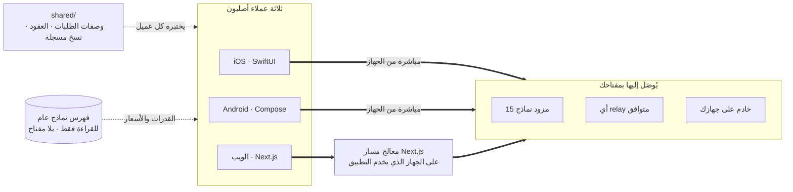

<div align="center">


# Oriveo

**كل النماذج، تطبيق واحد.**

عميل محادثة ذكاء اصطناعي مفتوح المصدر يعمل بمفتاحك الخاص، لنظامي iOS وAndroid وللويب.
بلا حساب، بلا اشتراك، وبلا خادم تابع لنا بينك وبين النموذج.

<a href="../../LICENSE"></a>
<a href="ios.md"></a>
<a href="android.md"></a>
<a href="web.md"></a>


<a href="https://oriveoai.com">الموقع</a> &nbsp;·&nbsp;
<a href="#البدء">البدء</a> &nbsp;·&nbsp;
<a href="#البنية">البنية</a> &nbsp;·&nbsp;
<a href="#نسخة-المجتمع-و-oriveo">الإصدارات</a> &nbsp;·&nbsp;
<a href="#الأسئلة-الشائعة">الأسئلة الشائعة</a> &nbsp;·&nbsp;
<a href="../../CONTRIBUTING.md">المساهمة</a>

<sub>

<a href="../../README.md">English</a> ·
**العربية** ·
<a href="../de/README.md">Deutsch</a> ·
<a href="../es/README.md">Español</a> ·
<a href="../fr/README.md">Français</a> ·
<a href="../hi/README.md">हिन्दी</a> ·
<a href="../id/README.md">Indonesia</a> ·
<a href="../ja/README.md">日本語</a> ·
<a href="../ko/README.md">한국어</a> ·
<a href="../pt-BR/README.md">Português</a> ·
<a href="../ru/README.md">Русский</a> ·
<a href="../th/README.md">ไทย</a> ·
<a href="../tr/README.md">Türkçe</a> ·
<a href="../vi/README.md">Tiếng Việt</a> ·
<a href="../zh-Hans/README.md">简体中文</a> ·
<a href="../zh-Hant/README.md">繁體中文</a>

</sub>

</div>

---

## ما هو Oriveo

Oriveo Community Edition هو عميل محادثة ذكاء اصطناعي يعمل بمبدأ أحضر مفتاحك الخاص (BYOK)
لنظامي iOS وAndroid وللويب. أنت تزوّد التطبيق بمفاتيح API التي تملكها أصلا، وهو يتحدث بها إلى
المزود. لا يوجد حساب Oriveo، ولا اشتراك، ولا أي تتبع تحليلي.

يتحدث التطبيق مع **15 مزود نماذج** بشكل أصلي — OpenAI وAnthropic وGoogle Gemini وOpenRouter
وDeepSeek وGrok وMistral وGroq وTogether AI وFireworks AI وMiniMax وZ.ai وQwen وKimi
وSiliconFlow — إضافة إلى **أي نقطة نهاية متوافقة مع OpenAI أو Anthropic أو Gemini** توجّهه إليها،
بما في ذلك llama.cpp أو Ollama أو LM Studio أو vLLM العاملة على جهازك أنت.

| | |
|---|---|
| **المزودون** | 15 مدمجا، إضافة إلى نقاط relay مخصصة وخوادم نماذج محلية |
| **العملاء** | iOS (SwiftUI) · Android (Jetpack Compose) · الويب (Next.js) |
| **لغات الواجهة** | 16 |
| **الحساب المطلوب** | لا شيء |
| **النداءات التي يجريها لحسابه هو** | نداء واحد: فهرس نماذج للقراءة فقط، بلا مفتاح وبلا معرّف مرفق |
| **الرخصة** | AGPL-3.0-or-later |

## لماذا يوجد

لا يجوز لعميل محادثة أن يقف بينك وبين النموذج الذي تدفع ثمنه.

- **مفاتيحك، وفاتورتك.** أنت تدفع السعر المعلن للمزود. لا هامش ربح، ولا عدّاد، ولا إعادة بيع.
- **محلي افتراضيا.** المحادثات والملاحظات والمجلدات والمهارات والمرفقات تبقى على الجهاز. صدّرها
  إلى ملف متى شئت؛ لا توجد نسخة سحابية قد تفقد الوصول إليها.
- **سلوك واحد، ثلاثة عملاء.** طريقة تشكيل الطلب لمزود ونقل وقدرة معيّنة معرّفة مرة واحدة في
  [`shared/`](shared.md)، والعملاء الثلاثة يختبرون أنفسهم على نفس ملفات JSON المرجعية. خصوصية
  مزود ما تُصلَح مرة واحدة، لا ثلاث مرات.
- **صريح بشأن الاتصال الوحيد الذي يقوم به.** يجلب التطبيق فهرس نماذج عاما حتى يعمل نموذج صدر
  اليوم دون تحديث التطبيق. الفهرس للقراءة فقط، ولا يحمل مفتاحا ولا معرّفا، ويمكنك توجيهه إلى
  مضيفك الخاص.

## المزايا

- **المحادثة** — بث مباشر، كتل استدلال، استشهادات، مرفقات (صور وPDF وOffice وEPUB وHTML ونص عادي)،
  اقتباس جزء محدد، إعادة المحاولة، إعادة التوليد، والمتابعة بعد إجابة انقطعت
- **المزودون** — 15 مدمجا، لكل منها مفتاحك أنت؛ مع تجاوزات لنقطة النهاية والنموذج والمعاملات لكل مزود
- **Relay** — أي نقطة نهاية متوافقة مع OpenAI أو Anthropic أو Gemini، بما فيها واحدة على شبكتك المحلية
- **خوادم النماذج المحلية** — llama.cpp وOllama وLM Studio وvLLM، مع اكتشافها على الشبكة المحلية
- **تسجيل الدخول بالاشتراك** — استخدم اشتراك Codex أو Grok الذي تملكه بدل مفتاح API
- **المهارات** — موجّهات نظام قابلة لإعادة الاستخدام، لكل منها نموذجها ومعاملاتها ومستنداتها المرجعية
- **الملاحظات والمجلدات** — احفظ ردا كملاحظة، ونظّم المحادثات، وابحث في النص الكامل
- **المقارنة المتقاطعة** — أعد طرح السؤال نفسه على نموذج ثان واحتفظ بالإجابتين جنبا إلى جنب
- **التكلفة** — الإنفاق لكل رسالة ولكل مزود، محسوبا على الجهاز مما أبلغت عنه كل استجابة فعليا،
  بما في ذلك مستويات خصم التخزين المؤقت
- **توليد الصور** — حيثما يدعمه المزود
- **النسخ الاحتياطي** — صدّر كل شيء إلى ملف، مشفَّرا اختياريا بكلمة مرور تختارها
- **16 لغة للواجهة**، بما في ذلك تخطيط كامل من اليمين إلى اليسار للعربية

## نسخة المجتمع و Oriveo

هذا المستودع هو **Oriveo Community Edition**، مرخّص بموجب
[AGPL-3.0-or-later](../../LICENSE). أما التطبيقات على App Store وGoogle Play وتطبيق الويب
المستضاف فهي **Oriveo** — منتج احتكاري منفصل مبني على العملاء أنفسهم، مع طبقة حساب فوقه.

| | نسخة المجتمع | Oriveo |
|---|---|---|
| المصدر | هذا المستودع، AGPL-3.0-or-later | احتكاري |
| المحادثة بمفاتيح المزود الخاصة بك | نعم | نعم |
| Relay وخوادم النماذج المحلية | نعم | نعم |
| الملاحظات والمجلدات والمهارات والمرفقات | نعم، بلا حدود | نعم |
| تتبع التكلفة على الجهاز | نعم | نعم |
| الحساب | لا يوجد | حساب Oriveo |
| التخزين | على الجهاز؛ تصدير واستعادة يدويان | محلي أولا، مع مزامنة سحابية عبر الأجهزة |
| رؤى الاستخدام وتنبيهات الميزانية | — | نعم |
| نماذج تدفع Oriveo ثمنها | — | نعم |
| التحليلات وتقارير الأعطال | لا يوجد | نعم |

تستخدم بُنى نسخة المجتمع بادئة المعرّف `ai.oriveo.community`، فيمكن لواحدة منها أن تجاور نسخة
المتجر دون أن يتشاركا سلسلة مفاتيح أو تدفق تحديثات أو بيانات محلية. وما تقبله هذه النسخة وما لا
تقبله مكتوب في [COMMUNITY.md](../../COMMUNITY.md).

**Oriveo، المنتج الكامل:**
[iPhone وiPad](https://apps.apple.com/app/oriveo/id6775370458) &nbsp;·&nbsp;
[Android](https://play.google.com/store/apps/details?id=com.kenny.oriveo) &nbsp;·&nbsp;
[الويب](https://app.oriveoai.com) &nbsp;·&nbsp;
[oriveoai.com](https://oriveoai.com)

## المزودون

يُوصَل إلى كل مزود أدناه بمفتاح تنشئه أنت بنفسك.

| المزود | من أين تحصل على مفتاح |
|---|---|
| OpenAI | [platform.openai.com](https://platform.openai.com/api-keys) |
| Anthropic | [console.anthropic.com](https://console.anthropic.com/settings/keys) |
| Google Gemini | [aistudio.google.com](https://aistudio.google.com/apikey) |
| OpenRouter | [openrouter.ai](https://openrouter.ai/keys) |
| DeepSeek | [platform.deepseek.com](https://platform.deepseek.com/api_keys) |
| Grok | [console.x.ai](https://console.x.ai/) |
| Mistral | [console.mistral.ai](https://console.mistral.ai/api-keys) |
| Groq | [console.groq.com](https://console.groq.com/keys) |
| Together AI | [api.together.xyz](https://api.together.xyz/settings/api-keys) |
| Fireworks AI | [fireworks.ai](https://fireworks.ai/api-keys) |
| MiniMax | [platform.minimax.io](https://platform.minimax.io/docs/guides/quickstart-preparation) |
| Z.ai | [open.bigmodel.cn](https://open.bigmodel.cn/usercenter/apikeys) |
| Qwen | [bailian.console.alibabacloud.com](https://bailian.console.alibabacloud.com/?apiKey=1#/api-key) |
| Kimi | [platform.kimi.ai](https://platform.kimi.ai/console/api-keys) |
| SiliconFlow | [cloud.siliconflow.cn](https://cloud.siliconflow.cn/account/ak) |
| **Relay** | أي نقطة نهاية متوافقة مع OpenAI أو Anthropic أو Gemini، بما فيها واحدة على جهازك أنت |

## البنية

ثلاثة عملاء أصليون، وتعريف واحد لكيفية التحدث إلى مزود نماذج.



يملك كل عميل واجهته وتخزينه وتنقّله الخاص، ويلتقي بالعقود المشتركة عند وصلة واحدة فقط: الطبقة التي
تحوّل *هذا النموذج، وهذه القدرة* إلى طلب HTTP.

عدم التناظر الوحيد الجدير بالمعرفة هو عميل الويب. واجهات المزودين لا ترسل ترويسات CORS، فلا يستطيع
المتصفح مناداتها مباشرة؛ لذلك تمر الطلبات إلى المزودين الرسميين الخمسة عشر عبر معالج مسار Next.js
يعمل على أي جهاز يخدم التطبيق — جهازك أنت حين تشغّله محليا. أما عميلا iOS وAndroid فلا قيد عليهما
ويذهبان إلى المزود مباشرة. كما تُنادى نقاط relay على شبكتك الخاصة مباشرة من المتصفح.

**بنية كل عميل:**

| | التقنيات | README |
|---|---|---|
| **iOS** | SwiftUI مع سجل محادثة بـ UIKit، وGRDB | [ios.md](ios.md) |
| **Android** | Jetpack Compose وRoom وKoin وKtor/OkHttp | [android.md](android.md) |
| **الويب** | Next.js App Router وReact وZustand وTypeScript | [web.md](web.md) |
| **المشترك** | العقود والنسخ المسجلة ونواة الاتصال بلغة Swift | [shared.md](shared.md) |

## البدء

<details open>
<summary><b>الويب</b> — أسرع طريقة للتجربة</summary>

<br>

يتطلب Node 22 (انظر [`web/.nvmrc`](../../web/.nvmrc)).

```bash
cd web
npm install
npm run dev:app        # http://localhost:3001
```

تطلب منك الشاشة الأولى مفتاح API لمزود. ولا شيء آخر مطلوب.
مزيد من الأوامر والإعدادات: [web.md](web.md).

</details>

<details>
<summary><b>iOS</b> — بناؤه وتشغيله على iPhone الخاص بك</summary>

<br>

يتطلب جهاز Mac مع Xcode 26 وجهازا يعمل بنظام iOS 18 أو أحدث. يكفي حساب Apple Developer مجاني —
فالتطبيق لا يستخدم أي قدرات مدفوعة.

1. افتح `ios/Oriveo/Oriveo.xcodeproj`
2. اختر مخطط `Oriveo`
3. من Signing &amp; Capabilities اختر فريقك أنت
4. شغّل

الشرح الكامل، بما في ذلك ما تفعله إن رفض Xcode فتح المشروع: [ios.md](ios.md).

</details>

<details>
<summary><b>Android</b> — بناء ملف APK</summary>

<br>

يتطلب JDK 17 أو أحدث وAndroid SDK. يستخدم البناء AGP 9.3 وGradle 9.5 وKotlin 2.3، لذا يجب أن يكون
Android Studio بإصدار قادر على مزامنتها؛ أما من سطر الأوامر فيكفي JDK وSDK.

```bash
cd android
./gradlew :app:assembleDebug
```

تقديم فهرس النماذج من مضيفك الخاص: [android.md](android.md).

</details>

## الخصوصية

- **مفاتيح المزودين** تُخزَّن بالوسيلة الخاصة بكل منصة — سلسلة مفاتيح iOS، أو Android Keystore
  (`EncryptedSharedPreferences`)، أو IndexedDB في المتصفح — وتُستخدم فقط للوصول إلى المزود الذي
  تخصّه. على الويب تُخزَّن دون تشفير، وهو النموذج الذي تتبعه عموما عملاء BYOK داخل المتصفح؛ وللحصول
  على أقوى ضمان استخدم عميل iOS أو Android.
- **المحادثات والملاحظات والمجلدات والمهارات والمرفقات** تُخزَّن على الجهاز. لا يُرفَع أي شيء إلى أي مكان.
- **لا حساب، ولا تحليلات، ولا تقارير أعطال.** لا يوجد ما تسجّل الدخول إليه، ولا شيء يتصل بالخارج خلسة.
- **على iOS وAndroid تذهب طلبات المحادثة من الجهاز إلى المزود مباشرة.** أما على الويب فتمر عبر خادم
  Next.js الذي يخدم التطبيق، لأن واجهات المزودين لا تسمح بالمناداة المباشرة من المتصفح؛ وذلك الخادم
  لا يحفظ مفاتيح ولا رسائل، وهو جهازك أنت حين تشغّل التطبيق محليا.
- **طلب واحد من عندنا:** فهرس نماذج للقراءة فقط، يُجلَب بلا مفتاح وبلا محادثة وبلا أي معرّف، حتى يعمل
  نموذج صدر اليوم دون بناء جديد. وجّهه إلى مضيفك الخاص إن فضّلت تقديمه بنفسك.

## الأسئلة الشائعة

<details>
<summary><b>ماذا تعني BYOK؟</b></summary>

<br>

أحضر مفتاحك الخاص. تنشئ مفتاح API في لوحة تحكم المزود نفسه — OpenAI أو Anthropic أو Google وغيرها —
ثم تلصقه في Oriveo. ويحاسبك ذلك المزود على الطلبات بسعره المعلن. Oriveo هو العميل فقط؛ ليس بائعا
وسيطا ولا يأخذ أي نسبة.

</details>

<details>
<summary><b>هل تمر محادثاتي عبر خادم تابع لـ Oriveo؟</b></summary>

<br>

لا. على iOS وAndroid ينادي العميل نقطة نهاية المزود مباشرة. وعلى الويب يمر الطلب عبر خادم Next.js
الذي يخدم التطبيق — أي جهازك أنت حين تشغّله محليا — لأن المتصفحات لا تستطيع مناداة واجهات المزودين
مباشرة. ولا يمر أي من المسارين بخادم تشغّله Oriveo. الطلب الوحيد الذي ترسله Oriveo لحسابها هو جلب
فهرس النماذج العام للقراءة فقط، وهو لا يحمل مفتاحا ولا محادثة ولا أي معرّف.

</details>

<details>
<summary><b>هل يمكنني استخدام نموذج يعمل على جهازي؟</b></summary>

<br>

نعم. أضف اتصال Relay يشير إلى أي خادم متوافق مع OpenAI أو Anthropic أو Gemini — llama.cpp أو Ollama
أو LM Studio أو vLLM أو أي شيء آخر يتحدث أحد تلك البروتوكولات. كما يستطيع عميلا Android والويب
اكتشاف خادم كهذا على الشبكة المحلية. اتصال HTTP المحلي لا يستخدم أي بيانات اعتماد ولا يغادر شبكتك.

</details>

<details>
<summary><b>ما الفرق بين هذا والتطبيق الموجود على App Store؟</b></summary>

<br>

تطبيقات المتجر هي Oriveo، وهو منتج احتكاري يضيف حسابا ومزامنة سحابية عبر الأجهزة ورؤى استخدام
ونماذج تدفع Oriveo ثمنها. أما نسخة المجتمع فهي العملاء الثلاثة أنفسهم دون أي من ذلك: بلا حساب، وبلا
خدمة مزامنة، وبلا فوترة، وبلا تحليلات. انظر
[نسخة المجتمع و Oriveo](#نسخة-المجتمع-و-oriveo) للمقارنة الكاملة.

</details>

<details>
<summary><b>هل يوجد عميل macOS؟</b></summary>

<br>

ليس في هذا المستودع. وإلى أن يوجد، يعمل عميل الويب جيدا كتطبيق سطح مكتب في أي متصفح، كما تعمل بنية
iOS على أجهزة Mac بمعالجات Apple silicon.

</details>

<details>
<summary><b>بأي اللغات تتوفر الواجهة؟</b></summary>

<br>

ست عشرة لغة: العربية والألمانية والإنجليزية والإسبانية والفرنسية والهندية والإندونيسية واليابانية
والكورية والبرتغالية البرازيلية والروسية والتايلاندية والتركية والفيتنامية والصينية المبسطة
والصينية التقليدية. وتحصل العربية على تخطيط كامل من اليمين إلى اليسار.

</details>

## هيكل المستودع

```
ios/       iOS client (SwiftUI)
android/   Android client (Jetpack Compose)
web/       Web client (Next.js)
macos/     Reserved for a macOS client
shared/    Cross-client contracts, recorded fixtures, and the Swift wire kernel
```

## المساهمة

تقارير العلل وطلبات السحب مرحّب بها. يشرح [CONTRIBUTING.md](../../CONTRIBUTING.md) كيفية بناء كل
عميل وكيف يبدو طلب السحب الجيد؛ ويصف [COMMUNITY.md](../../COMMUNITY.md) الغرض من هذه النسخة،
والأنواع القليلة من التغييرات التي لن تُقبل مهما كانت جودة كتابتها.

وجدت مشكلة أمنية؟ من فضلك لا تفتح مسألة علنية — يشرح [SECURITY.md](../../SECURITY.md) كيف تبلّغ عنها
سرا، وما الذي يعتبره هذا المشروع ثغرة وما لا يعتبره. ويُتوقع من كل مشارك الالتزام بـ
[ميثاق السلوك](../../CODE_OF_CONDUCT.md).

## الترخيص

[AGPL-3.0-or-later](../../LICENSE). وتُقبل المساهمات بموجب الرخصة نفسها.
