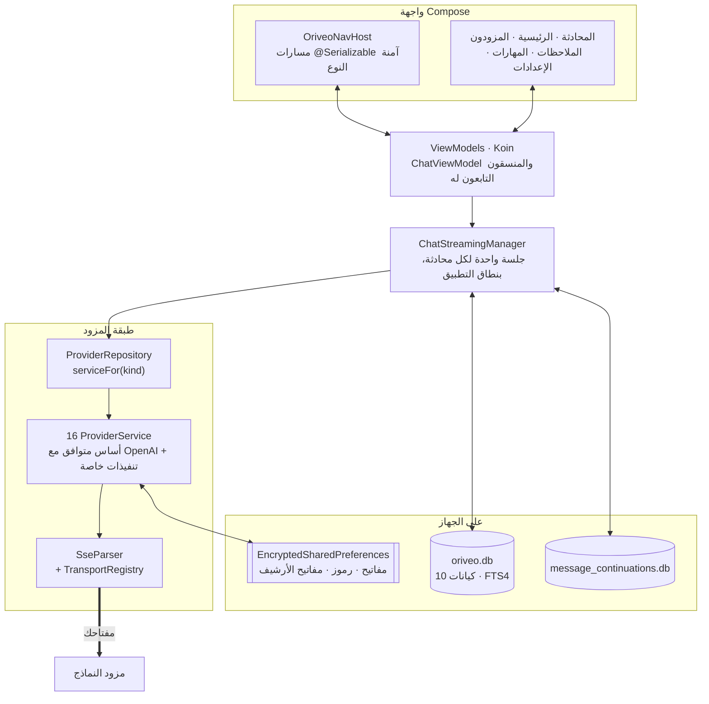

<div align="center">

# Oriveo لنظام Android

**عميل محادثة أصلي مبني على Jetpack Compose لنماذج الذكاء الاصطناعي التي تدفع ثمنها أصلا.**

<a href="../../LICENSE"></a>


<sub>

<a href="../../android/README.md">English</a> ·
**العربية** ·
<a href="../de/android.md">Deutsch</a> ·
<a href="../es/android.md">Español</a> ·
<a href="../fr/android.md">Français</a> ·
<a href="../hi/android.md">हिन्दी</a> ·
<a href="../id/android.md">Indonesia</a> ·
<a href="../ja/android.md">日本語</a> ·
<a href="../ko/android.md">한국어</a> ·
<a href="../pt-BR/android.md">Português</a> ·
<a href="../ru/android.md">Русский</a> ·
<a href="../th/android.md">ไทย</a> ·
<a href="../tr/android.md">Türkçe</a> ·
<a href="../vi/android.md">Tiếng Việt</a> ·
<a href="../zh-Hans/android.md">简体中文</a> ·
<a href="../zh-Hant/android.md">繁體中文</a>

</sub>

</div>

---

عميل Oriveo لنظام Android هو تطبيق محادثة ذكاء اصطناعي يعمل بمفتاحك الخاص. تضيف مفاتيح API التي
تملكها أصلا، ويتحدث التطبيق مع كل مزود مباشرة من الهاتف. تُخزَّن المحادثات والملاحظات والمجلدات
والمهارات على الجهاز في Room؛ أما مفاتيح API فتُشفَّر بمفتاح محفوظ في Android Keystore. لا يوجد
حساب ولا تسجيل دخول.

وهو جزء من [Oriveo Community Edition](README.md) — ثلاثة عملاء يتشاركون تعريفا واحدا لكيفية
التحدث إلى مزود نماذج.

## البنية



ثلاثة أمور في هذا المخطط قرارات تصميم مقصودة لا بنية عارضة.

**البث يعيش فوق الشاشة.** يحتفظ `ChatStreamingManager` بجلسة `StreamingSession` واحدة لكل معرّف
محادثة داخل `ConcurrentHashMap`، ولكل منها `CoroutineScope(SupervisorJob() + Dispatchers.IO)`
خاص بها بنطاق التطبيق. فالخروج من شاشة المحادثة لا يلغي الإجابة، و`StreamingTokenBuffer` يفرغ
النص الجزئي دوريا إلى SQLite، فإغلاق التطبيق في منتصف الإجابة لا يفقد ما وصل بالفعل.

**قاعدتا بيانات، لا واحدة.** يحمل `oriveo.db` المحادثات والرسائل والمرفقات والملاحظات والمجلدات
والمهارات وذاكرة فهرس النماذج. أما `message_continuations.db` فملف منفصل فيزيائيا يحمل حالة
المتابعة المبهمة الخاصة بالمزود، وذلك بالضبط كي يستطيع `backup_rules.xml` و
`data_extraction_rules.xml` استثناءه من النسخ الاحتياطي السحابي ونقل الجهاز — فرمز متابعة يُستعاد
على جهاز آخر لا معنى له في أحسن الأحوال.

**فهرس أحدث من الملف التنفيذي يتدهور، ولا ينكسر.** `TransportKind` تعداد مغلق مع محلل متسامح: أي
سلسلة نقل غير معروفة تُفك إلى `null`، فلا يعيد `TransportRegistry` أي استراتيجية، ويُستبعد النموذج
من قائمة الاختيار. أما البديل — تعداد صارم — فكان سيفشل تحليل الفهرس كله ويُسقط معه كل نموذج آخر.

## ما المسموح لنموذج أن يفعله

لا يخمّن العميل قدرات نموذج من اسمه أبدا. بل يقرأ زمن تشغيل للقدرات من الفهرس: وصفات تصف، لمزود
ونقل وقدرة معينة، أي مؤشرات JSON بالضبط تُكتب في الطلب. ويتحقق `ProviderRecipeRequestCompiler` من
مطابقة الوصفة للمزود والقدرة والنقل قبل ترجمتها إلى فرق جسم مملوك، ويرفض بسبب مسمّى
(`recipe_not_found` أو `transport_mismatch` أو `model_route_must_not_patch_body`) بدل أن ينتج
بصمت طلبا لم يراجعه أحد.

وفي طريق العودة يرتّب `CapabilityEvidenceFacade` ما هو معروف فعلا عن قدرة ما بحسب المصدر —
`operator_override` > `server_typed` > `server_profile` > `model_facts` > `relay_verification` >
`relay_declaration` > `legacy_metadata`. ولا يجوز إلا لمحلل البث أن يضع علامة *مرصودة* على قدرة؛
أما النية والوصفات واستجابة HTTP 200 والتصريح بأداة فلا تُحتسب صراحة. وتُحفظ النتيجة لكل رسالة،
فتستطيع الواجهة التمييز بين *مطلوب* و*مؤكد*.

وتُحلّ التجاوزات بمبدأ آخر كتابة تفوز عبر سبعة نطاقات، بترتيب الأولوية: `single_send` >
`conversation_connection_model` > `skill_agent` > `connection_model` > `connection` >
`provider_recipe` > `provider_default`.

## التخزين والأسرار

| ماذا | أين |
|---|---|
| المحادثات والرسائل والمرفقات والملاحظات والمجلدات والمهارات | Room، `oriveo.db` |
| البحث في النص الكامل عبر الملاحظات | جدول FTS4 افتراضي |
| ذاكرة فهرس النماذج | صف واحد في `oriveo.db`، يُقرأ على دفعات |
| حالة متابعة المزود | `message_continuations.db`، مستثناة من النسخ الاحتياطي |
| مفاتيح API للمزودين | `EncryptedSharedPreferences`، AES-256-GCM، مفتاح رئيسي محفوظ في Keystore |
| رموز OAuth للاشتراكات | ملف تفضيلات مشفّر ثانٍ منفصل |
| مفاتيح أرشيف النسخ الاحتياطي | ملف ثالث |
| كتل المرفقات | ملفات على القرص، يُشار إليها بالمعرّف |

فُصلت ملفات التفضيلات المشفّرة الثلاثة بحسب العمر ونطاق الضرر لا دُمجت للتسهيل. ولكل منها مسار
تعافٍ: الملف التالف (`AEADBadTagException` أو `VERIFICATION_FAILED`) يُكتشف ويُحذف ويُعاد إنشاؤه
بدل أن ينهار التطبيق عند كل إقلاع.

والثلاثة جميعا، وكذلك قاعدة بيانات المتابعة، مستثناة من النسخ الاحتياطي السحابي في Android ومن نقل
الجهاز. وهذه نتيجة لربطها بـ Keystore لا سهوٌ — فالنص المشفّر لن يكون قابلا لفك التشفير على الجهاز
الجديد على أي حال. **بعد الانتقال إلى هاتف جديد ستعيد إدخال مفاتيح API وتسجيل الدخول من جديد إلى
أي اشتراك مزود**؛ أما المحادثات والملاحظات فتنتقل معك بشكل طبيعي.

أما أرشيفات النسخ الاحتياطي التي تصدّرها أنت فمشفّرة على حدة، بـ PBKDF2-HMAC-SHA256 على 600,000
دورة وAES-GCM، بكلمة مرور تختارها.

## الوصول إلى خادم نماذج على شبكتك أنت

يضبط ملف البيان `android:usesCleartextTraffic="true"` عن قصد: فخوادم النماذج المحلية — llama.cpp
وOllama وLM Studio وvLLM — تتحدث HTTP عاديا على جهازك أو شبكتك المحلية، وعادة بلا شهادة.

أما الحد الحقيقي فهو في الكود لا في البيان، ولا بد أن يكون كذلك. يحل `RelayEndpointPolicy` اسم
المضيف، ويشترط أن يكون **كل** عنوان محلول عنوانا خاصا (loopback وRFC 1918 وlink-local
وunique-local ونطاق CGNAT في وضع VPN)، ويرفض مضيفا يُحلّ إلى خليط من العناوين العامة والخاصة،
ويثبّت مجموعة العناوين المحلولة ضد إعادة ربط DNS ويعيد التحقق منها عند الإرسال، ويرفض أي طلب
بنص صريح يحمل بيانات اعتماد، ويحجب أي إعادة توجيه عبر أصل مختلف أو تغيّر المخطط.

ولا يستطيع ملف إعداد أمان الشبكة في Android التعبير عن تلك المجموعة: فهو يطابق على اسم المضيف فقط،
ولا صيغة لديه لنطاقات العناوين، والعناوين هنا تأتي من شبكة المستخدم نفسه في زمن التشغيل. كما أن
ملف الإعداد سيكون أضعف قطعا، لأنه لا يرى قط العنوان الذي حُلّ إليه الاسم.

## فهرس النماذج

يقرأ التطبيق قدرات النماذج وأسعارها من فهرس عام حتى يعمل نموذج صدر اليوم دون تحديث التطبيق. وهو
طلب `GET` عادي عبر HTTPS بلا بيانات اعتماد وبلا أي معرّف مرفق، ولا تقترب منه طلبات المحادثة أبدا.
ولا يُطلب سوى نقطتَي نهاية:

```
GET {base}/api/metadata?view=lean
GET {base}/api/metadata/model-facts
```

وعنوان الأساس خاصية تُحدَّد وقت البناء، وقيمتها الافتراضية `https://api.oriveoai.com`:

```bash
./gradlew :app:assembleDebug -PORIVEO_METADATA_BASE_URL=https://your.host
```

تُعاد التحقق من الاستجابات بـ ETag وتُخزَّن في `oriveo.db`، فبمجرد نجاح جلب واحد يظل التطبيق يعمل
من النسخة المخزّنة حين يتعذّر الوصول إلى الفهرس لاحقا.

> [!IMPORTANT]
> البناء بقيمة فارغة (`-PORIVEO_METADATA_BASE_URL=`) يعطّل جلب الفهرس تماما، و**لا توجد لقطة مضمّنة
> داخل ملف APK**. وعند تثبيت جديد لبناء كهذا:
>
> - لا يحصل أي من المزودين الخمسة عشر المدمجين على قائمة نماذج، ولا يسأل التطبيق المزود عن واحدة —
>   فالفهرس هو المصدر الوحيد؛
> - والفشل **صامت**. فإضافة مفتاح تُبلغ عن النجاح كالمعتاد، وقائمة اختيار النماذج تكون فارغة بلا تفسير؛
> - و**يصبح OpenAI غير قابل للاستخدام**، لأن الإدخال اليدوي للنماذج محجوب لدى ذلك المزود؛
> - أما نقاط Relay وخوادم النماذج المحلية فتظل تعمل بالكامل، وهي المسار السليم الوحيد.
>
> إن أردت بناء يعمل دون اتصال، قدّم الفهرس بنفسك ووجّه البناء إليه بدل تفريغ القيمة.

## هيكل المشروع

```
android/
  app/src/main/java/ai/oriveo/community/
    core/
      provider/    every provider service, transports, relay, capability recipes
      data/        Room entities, DAOs, repositories, backup, catalog client
      model/       domain models and the capability/preference resolvers
      attachments/ routing, budgets, per-format text extraction
      security/    SecureKeyStore, BackupCrypto, external-URL policy
      streaming/   ChatStreamingManager
      navigation/  AppRoute, OriveoNavHost
    feature/       one package per screen
    ui/            shared components, Markdown + LaTeX renderer, theme
    di/            Koin modules
  benchmark/       macrobenchmark suite (cold start, model picker)
```

## البناء

المتطلبات: **JDK 17 أو أحدث** وAndroid SDK. يستخدم البناء AGP 9.3 وGradle 9.5 وKotlin 2.3، لذا يجب
أن يكون Android Studio بإصدار قادر على مزامنة AGP 9.3؛ أما من سطر الأوامر فيكفي JDK وSDK.

```bash
./gradlew :app:assembleDebug
./gradlew :app:testDebugUnitTest
```

يستهدف البناء `minSdk 26` و`targetSdk 36` و`compileSdk 37`. وملف `local.properties` (مسار SDK
لديك) يولّده Android Studio ولا يُودَع في المستودع. أما توقيع الإصدار فموصوف في
[SIGNING.md](../../android/SIGNING.md).

> [!NOTE]
> يعمل خادم Gradle الخفي على سلسلة أدوات Java 21 (`gradle/gradle-daemon-jvm.properties`)،
> والمطابقة على 21 بالضبط لا على «21 أو أحدث». فمع أي إصدار JDK آخر مثبّت، ينزّل Gradle لنفسه
> JDK 21 عند أول بناء، وهو ما يتطلب اتصالا بالشبكة؛ وتثبيت JDK 21 بنفسك يتفادى ذلك. وإن كنت قد
> ضبطت `org.gradle.java.installations.auto-download=false` فلن يحدث ذلك التنزيل وسيفشل البناء
> برسالة `Toolchain auto-provisioning is not enabled.` — وهذه هي الحالة الوحيدة التي لا يكفي فيها
> JDK 17 وحده حقا. أما الترجمة فتستهدف Java 17 في الحالتين.

ويُشتق توازي اختبارات الوحدة من عدد أنوية المعالج والذاكرة الفيزيائية للجهاز بدل أن يكون رقما
مكتوبا يدويا، فتتصرف المجموعة تصرفا سليما على حاسوب محمول وعلى محطة عمل كبيرة على السواء.

## الاعتماديات

| المكتبة | الإصدار | تُستخدم لـ |
|---|---|---|
| Jetpack Compose BOM | 2026.08.00 | الواجهة وMaterial 3 |
| Room | 2.8.4 | SQLite وDAOs وFTS4 |
| Koin | 4.2.2 | حقن الاعتماديات |
| Ktor client (محرك OkHttp) | 3.5.2 | طلبات HTTP وSSE للمزودين |
| kotlinx.serialization | 1.11.0 | JSON |
| navigation-compose | 2.9.6 | مسارات آمنة النوع |
| androidx.security-crypto | 1.1.0 | `EncryptedSharedPreferences` |
| haze | 1.7.3 | تمويه الخلفية |
| PDFBox-Android وjsoup | 2.0.27.0 و1.23.2 | استخراج نص المرفقات |
| jlatexmath-android | 0.2.0 | عرض LaTeX |

الإصدارات الدقيقة مثبّتة في [`gradle/libs.versions.toml`](../../android/gradle/libs.versions.toml).

## الاختبارات

```bash
./gradlew :app:testDebugUnitTest
```

نحو 3,000 اختبار وحدة موزعة على 319 ملفا، باستخدام JUnit 4 وMockK وTurbine
و`kotlinx-coroutines-test` ومحرك المحاكاة في Ktor. والتغطية أكثف حيث تكون الأخطاء أغلى ثمنا: شكل
الطلب لكل مزود، وتحليل SSE، واختيار النقل، وفحص relay وأوضاع الأمان، وتنفيذ وصفات القدرات، وتخزين
الفهرس ومعالجة إصدار العقد، والحفظ في Room، ودورات النسخ الاحتياطي الكاملة.

> [!IMPORTANT]
> تحمّل نحو 38 مجموعة اختبار نسخ العقود المرجعية من `shared/` بالصعود من مجلد العمل، لذا **لا تنجح
> الاختبارات إلا في نسخة كاملة من المستودع** — نسخ مجلد `android/` وحده لن ينفع.

كما توجد ثلاثة اختبارات مُجهَّزة على الجهاز — مصفوفة إصدارات للمحركات المحلية، واختبار مقبس بنص
صريح، واختبار عزل Keystore. وهي ليست مكتفية ذاتيا: فاختبارات المحركات المحلية تحتاج وسائط تجهيز
تسمّي خادم نماذج حقيقيا يعمل على شبكتك، لذا لا ينجح `connectedAndroidTest` جاهزا. ومجموعة اختبارات
الوحدة هي بوابة طلب السحب.

ويحتوي مجلد `:benchmark` على قياسات أداء كبرى للبدء البارد ولقائمة اختيار النماذج. وهو وحدة Gradle
منفصلة تستخدم `com.android.test` مع التجهيز الذاتي، ويقود نوع بناء `benchmark` مخصصا من `:app`.

وكلتا قاعدتَي البيانات عند `version = 1` بلا ترحيلات حتى الآن؛ وتُصدَّر المخططات إلى `app/schemas/`
وتُودَع في المستودع، وهناك سيحطّ ملف `2.json` الخاص بأول ترحيل.

## الترجمة والتوطين

ست عشرة لغة: مجلد `values/` (الإنجليزية، وهي المصدر) إضافة إلى خمسة عشر مجلد `values-*`، بنحو
1,700 نص لكل منها، وكل لغة تحمل مجموعة المفاتيح نفسها بالضبط. ويمر تبديل اللغة داخل التطبيق عبر
`AppLanguageManager` و`android:localeConfig`. وتقسيم اللغات معطّل في الحزمة، فيحمل أثر واحد كل
الترجمات.

## المساهمة

انظر [CONTRIBUTING.md](../../CONTRIBUTING.md). لغة العمل في المشروع هي الإنجليزية: المصدر
والتعليقات والاختبارات ورسائل الإيداع. أما نصوص الواجهة فتُترجم — أضف النص الجديد إلى `values/`
أولا واترك بقية اللغات تتبع. وشغّل اختبارات الوحدة قبل فتح طلب سحب.

## الترخيص

[AGPL-3.0-or-later](../../LICENSE).
