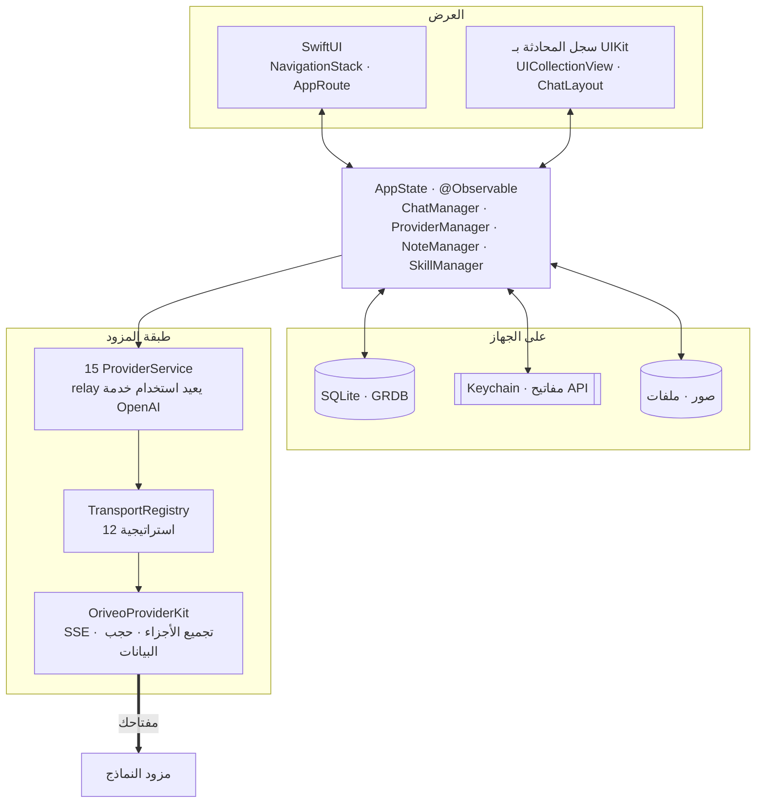

<div align="center">

# Oriveo لنظام iOS

**عميل محادثة أصلي مبني على SwiftUI لنماذج الذكاء الاصطناعي التي تدفع ثمنها أصلا.**

<a href="../../LICENSE"></a>


<sub>

<a href="../../ios/README.md">English</a> ·
**العربية** ·
<a href="../de/ios.md">Deutsch</a> ·
<a href="../es/ios.md">Español</a> ·
<a href="../fr/ios.md">Français</a> ·
<a href="../hi/ios.md">हिन्दी</a> ·
<a href="../id/ios.md">Indonesia</a> ·
<a href="../ja/ios.md">日本語</a> ·
<a href="../ko/ios.md">한국어</a> ·
<a href="../pt-BR/ios.md">Português</a> ·
<a href="../ru/ios.md">Русский</a> ·
<a href="../th/ios.md">ไทย</a> ·
<a href="../tr/ios.md">Türkçe</a> ·
<a href="../vi/ios.md">Tiếng Việt</a> ·
<a href="../zh-Hans/ios.md">简体中文</a> ·
<a href="../zh-Hant/ios.md">繁體中文</a>

</sub>

</div>

---

عميل Oriveo لنظام iOS هو تطبيق محادثة ذكاء اصطناعي يعمل بمفتاحك الخاص. تضيف مفاتيح API التي
تملكها أصلا، ويتصل التطبيق بكل مزود مباشرة من الهاتف. تعيش المحادثات والرسائل والملاحظات ومجلدات
الملاحظات في قاعدة بيانات SQLite على الجهاز؛ وكتل المرفقات ملفات إلى جانبها؛ أما المهارات
والتفضيلات وقائمة المزودين ومجلدات المحادثات فهي JSON على الجهاز. ومفاتيح API تذهب إلى Keychain
في iOS.

ولا يوجد حساب Oriveo: لا شيء يُرفَع، ولا شيء تسجّل الدخول إليه. غير أن مزودين اثنين يوفّران تسجيل
الدخول باشتراك تملكه أصلا بدل لصق مفتاح — هما ChatGPT وGrok — وذلك التسجيل يذهب إلى OpenAI وxAI،
لا إلينا.

وهو جزء من [Oriveo Community Edition](README.md) — ثلاثة عملاء يتشاركون تعريفا واحدا لكيفية
التحدث إلى مزود نماذج.

## البنية



ثلاثة أمور في هذا المخطط تستحق التصريح بها بوضوح.

**سجل المحادثة مبني على UIKit، وما عداه SwiftUI.** يضمّن `ChatView` عنصر
`ChatListViewControllerRepresentable` حول `UICollectionView` يقوده
[ChatLayout](https://github.com/ekazaev/ChatLayout). وكل ما عدا ذلك — التنقل والإعدادات وإعداد
المزودين والملاحظات والمهارات — مكتوب بـ SwiftUI. سبب الفصل أن سجل محادثة يتدفق بسرعة الرموز
يحتاج تحكما على مستوى الخلية في القياس وإعادة الاستخدام لا توفره مقارنة الفروق في SwiftUI.
ويوثّق [`Features/Chat/ARCHITECTURE.md`](../../ios/Oriveo/Oriveo/Features/Chat/ARCHITECTURE.md)
هذا الحد.

**ثلاثة مسارات منفصلة تحدّث ذلك السجل**، عن قصد:

| المسار | ينقل | لماذا |
|---|---|---|
| `@Observable AppState` | التغييرات البنيوية — ظهور رسالة، تبديل محادثة | أصلي في SwiftUI، ورخيص للأحداث منخفضة التواتر |
| `ValueObservation` في GRDB | الحالة الدائمة المقروءة من SQLite | مصدر واحد للحقيقة بعد كل كتابة، ويصمد بعد إعادة التشغيل |
| `PassthroughSubject` من Combine لكل محادثة | النص المتدفق وفروق الاستدلال | يتجاوز مقارنة الفروق في SwiftUI تماما بسرعة الرموز |

**دعم المزودين أربعة محاور مستقلة، لا تعداد واحد.** `ProviderKind` (16 حالة: المزودون الخمسة عشر
إضافة إلى relay) هو *من الذي أعدّه المستخدم*. و`ProviderServiceProtocol` هو *سطح النداء*.
و`TransportKind` (12 حالة) هو *بروتوكول الاتصال الذي يُستخدم فعلا* — ويُحدَّد **لكل نموذج، من
الفهرس**، فقد يختلف نموذجان خلف المفتاح نفسه. أما `RelayKind` فيغطي نقاط النهاية التي يوفّرها
المستخدم. وفصلها هكذا هو ما يجعل نموذجا جديدا يعمل دون بناء جديد.

### كيف تُرسَل رسالة واحدة


`BaseAPIService.encodeChatBody` هي المحطة الأخيرة قبل أن يتحول طلب متوافق مع OpenAI إلى بايتات —
فاثنتا عشرة حالة من ست عشرة تمر بها، وبذلك تكون وصفة القدرة أو معامل التوليد أو الحقل المخصص قابلا
للاختبار في مكان واحد بدل اثني عشر. أما OpenAI وAnthropic وGemini فتتحدث أشكالها الخاصة وتُسلسِل في
خدماتها الخاصة؛ وكل نقطة من تلك النقاط تغطيها مجموعة اختبار خاصة بشكل الطلب.

## ما المسموح لنموذج أن يفعله

لا يخمّن العميل قدرات نموذج من اسمه أبدا. بل يقرأ **زمن تشغيل للقدرات** — مجموعة وصفات تصف، لمزود
ونقل وقدرة معينة، أي مؤشرات JSON بالضبط تُكتب في الطلب. وتوجد تلك الوصفات في
[`shared/capabilityrecipe`](../../shared/capabilityrecipe/) ويطبّقها `CapabilityRecipeRequestCompiler`.

وفي طريق العودة يسجّل `CapabilityExecutionRuntime` ما حدث فعلا. ولا يجوز إلا لمحلل بث إنتاجي مختار
أن يرفع قدرة إلى حالة *مرصودة*. أما استجابة HTTP 200 أو إجابة غير فارغة أو تصريح بأداة في الطلب
فليست دليلا صراحة. وتُخزَّن الحالة النهائية لكل رسالة، فتستطيع الواجهة أن تخبرك بأن عنصر تحكم
طُلب ولم يُؤكَّد قط بدل أن توحي ضمنا بأنه نجح.

## التخزين

```
Application Support/Oriveo/
  active-uid                     # storage partition, "guest" by default
  users/<uid>/
    oriveo.sqlite                # conversations, messages, notes and folders, catalog cache
    Images/  Files/              # attachment blobs, referenced by id
    session-snapshot.json        # preferences, provider list, folders, last used model
```

- **SQLite عبر GRDB** مع WAL والمفاتيح الأجنبية مفعّلة و`DatabaseMigrator` يغطي كل تغيير في
  المخطط. ويستخدم البحث في النص الكامل عبر الرسائل والملاحظات FTS5 مع مقسّم ثلاثيات.
- **مفاتيح API تعيش في Keychain**، مفهرسة بالمزود والقسم، وتُمحى من لقطة الجلسة قبل كتابتها.
  وتُخزَّن المهارات على حدة كـ JSON في `UserDefaults`.
- **كتل المرفقات ملفات على القرص**، لا صفوف، فلا يضخّم ملف PDF كبير قاعدة البيانات.

والنسخة الاحتياطية ملف ZIP بامتداد `.oriveo` يحمل `data.json` مع ملفات الصور. وكلمة المرور
الاختيارية لا تشفّر الأرشيف: هي تشفّر مفاتيح API للمزودين داخله فقط (بخوارزمية AES-GCM، بمفتاح
مشتق عبر PBKDF2-HMAC-SHA256 على 600,000 تكرار). أما المحادثات والملاحظات والمهارات والتفضيلات فتبقى
في الأرشيف بصيغة JSON صريحة في كل الأحوال، فتعامَل مع ملف النسخة الاحتياطية على أنه مقروء لكل من
يحصل عليه.

## فهرس النماذج

عند البدء البارد يرسل التطبيق طلب `GET` واحدا غير موثّق ومشروطا بـ ETag إلى
`https://api.oriveoai.com/api/metadata?view=lean`. وهو يجلب فهرس النماذج العام: أي النماذج موجودة،
وما الذي يدعمه كل منها، وكيف تُسمّى عناصر التحكم في الاستدلال لديه، وكم يكلّف. لا يُرفَق أي مفتاح ولا
محادثة ولا معرّف، وتُخزَّن الاستجابة مؤقتا في SQLite فيعمل التطبيق من النسخة المخزّنة حين يتعذّر
الوصول إلى الفهرس. وثمة نقطة نهاية ثانية، `/api/metadata/model-facts`، لا تُقرأ إلا بعد أن تسجّل
الدخول باشتراك ChatGPT أو Grok، لمعرفة ما تستطيعه نماذج ذلك الاشتراك.

هذان هما الطلبان الوحيدان اللذان يجريهما التطبيق لحسابه هو. وكل ما عداهما يذهب إلى مزود أعددته أنت،
بمفتاحك.

وتوجيه الفهرس إلى مضيفك الخاص **تسهيل في بُنى Debug**، يُحلّ في
`Oriveo/Core/Providers/BackendURLResolver.swift` بهذا الترتيب:

1. متغيّر البيئة `ORIVEO_METADATA_BASE_URL`، المضبوط في إجراء Run في المخطط؛ ثم
2. سلسلة نصية باسم `ORIVEO_METADATA_BASE_URL` في `ios/Oriveo/Config/Info.plist` — المفتاح موجود هناك
   أصلا وفارغ، فيكفي ملؤه؛ ثم
3. `https://api.oriveoai.com`.

وأمران ينبغي معرفتهما. بناء Release يتجاهل الاثنين ويستخدم دائما الفهرس المنشور؛ وتغيير ذلك يعني
تعديل `BackendURLResolver`. وحين تكون حزمة الاختبار قيد التشغيل، أو مع `CI=true`، يُتجاهَل أي تجاوز
يشير إلى عنوان خاص (localhost أو `10/8` أو `192.168/16` أو `172.16/12` أو `.local` أو IPv6 محلي
الرابط)، حتى لا يجعل مضيف محلي منسي المجموعة معتمدة على الجهاز الذي تجلس إليه.

## هيكل المشروع

```
ios/Oriveo/
  Config/Info.plist    the app's Info.plist; GENERATE_INFOPLIST_FILE is off
  Oriveo.xcodeproj/
  Oriveo/
    Core/
      Providers/       15 provider services, transports, capability runtime, catalog client
      State/           AppState and the managers it owns
      Database/        GRDB pool, schema, migrator, stores, observations
      Models/          domain types
      Attachments/     import limits, budgets, per-format text extraction
      Tools/           tool-call loop and per-protocol adapters
      Cache/ Localization/ Observability/ Reachability/ Routing/ Usage/
    Features/
      App/             root view and tab shell
      Chat/            transcript, composer, model controls, cross-check, export
      Providers/       setup, detail, relay, local engines, subscription sign-in
      Home/ Notes/ Skills/ Settings/ Backup/ Onboarding/
    Shared/Components/ shared views
    DesignSystem/      theme, colour, haptics
    Preview/           sample data for SwiftUI previews
    *.xcstrings        ten string catalogs
    Assets.xcassets · PrivacyInfo.xcprivacy · Oriveo.entitlements
  OriveoTests/
```

## البناء والتشغيل

تحتاج **Xcode 26**، وللتشغيل على عتاد حقيقي جهازا يعمل بنظام **iOS 18 أو أحدث**. ويكفي حساب
Apple Developer مجاني: فملف الاستحقاقات فارغ والتطبيق لا يستخدم أي قدرة مدفوعة — لا إشعارات دفع،
ولا iCloud، ولا مجموعات تطبيقات، ولا نطاقات مرتبطة.

وXcode 16.3 هو الحد الأدنى الذي تفرضه صيغة المشروع وإصدار أدوات Swift فعلا، لكن الهدف يضبط
`SWIFT_APPROACHABLE_CONCURRENCY` و`SWIFT_DEFAULT_ACTOR_ISOLATION = MainActor`، وهما ما تتجاهله
إصدارات Xcode الأقدم دون أن تقول ذلك. وتغيّر عزل المُمثِّلات في صمت طريقة سيئة لمعرفة ذلك، فابنِ
باستخدام Xcode 26.

1. افتح `ios/Oriveo/Oriveo.xcodeproj`
2. اختر مخطط `Oriveo`
3. من **Signing & Capabilities** اختر فريقك أنت
4. إن تعذّر على Xcode تسجيل `ai.oriveo.community`، غيّر معرّف الحزمة إلى معرّف يملكه فريقك
5. وصّل هاتف iPhone، وفعّل Developer Mode، وامنح الثقة للحاسوب، ثم شغّل

وللبناء على المحاكي بدلا من ذلك، اختر أي محاكي iPhone وشغّل. وتُحلّ اعتماديات الحزم من ملف
`Package.resolved` المودَع في المستودع.

**وعلى جهاز Mac بمعالج Apple silicon** يعمل بناء iPhone أصليا أيضا: اختر الهدف **My Mac (Designed
for iPad)**. وMac Catalyst غير مُفعَّل — فالمشروع لا يختاره أبدا ويبقى `TARGETED_DEVICE_FAMILY` عند
`1,2` — فهذا تطبيق iOS يعمل تحت زمن تشغيل توافق iPad لا تطبيق Mac، والمسارات الخاصة بالجهاز وحده،
مثل التقاط الكاميرا، تتصرف كما تتصرف على جهاز Mac.

يستخدم ملف المشروع `objectVersion = 77` مع مجموعات متزامنة مع نظام الملفات، لذا قد يرفض إصدار
أقدم من Xcode فتحه. حدّث Xcode بدل تعديل صيغة المشروع.

> [!NOTE]
> يُترجَم هدف التطبيق في وضع لغة Swift 5؛ أما حزمة `OriveoProviderKit` المحلية فتعلن
> `swift-tools-version: 6.1` وتُبنى في وضع لغة Swift 6.

## الاعتماديات

| الحزمة | الإصدار | تُستخدم لـ |
|---|---|---|
| [GRDB.swift](https://github.com/groue/GRDB.swift) | 7.11.1 | الوصول إلى SQLite والترحيلات و`ValueObservation` |
| [ChatLayout](https://github.com/ekazaev/ChatLayout) | 2.4.3 | تخطيط عرض المجموعة لسجل المحادثة |
| [swift-markdown-ui](https://github.com/gonzalezreal/swift-markdown-ui) | 2.4.1 | عرض Markdown |
| [SwiftMath](https://github.com/mgriebling/SwiftMath) | 1.7.3 | عرض LaTeX |
| [ZIPFoundation](https://github.com/weichsel/ZIPFoundation) | 0.9.20 | أرشيفات النسخ الاحتياطي واستخراج Office/EPUB/ODF |
| `OriveoProviderKit` | محلية | نواة الاتصال بالمزودين، في [`shared/`](shared.md) |

ويثبّت `Package.resolved` أيضا الاعتماديتين غير المباشرتين التي يجلبهما swift-markdown-ui:
[NetworkImage](https://github.com/gonzalezreal/NetworkImage) 6.0.1 و
[swift-cmark](https://github.com/swiftlang/swift-cmark) 0.8.0. وكل اعتمادية مباشرة مرخّصة بموجب MIT،
وswift-cmark بموجب BSD-2-Clause، وكلها متوافقة مع AGPL-3.0-or-later.

## الاختبارات

شغّل إجراء الاختبار في مخطط `Oriveo` (⌘U) من Xcode، أو من جذر المستودع:

```bash
xcodebuild test -project ios/Oriveo/Oriveo.xcodeproj -scheme Oriveo \
  -destination 'platform=iOS Simulator,name=iPhone 16'
```

استبدل بمحاكٍ تملكه فعلا؛ ويسرد `xcodebuild -showdestinations` مع المشروع والمخطط نفسيهما كل ما
تستطيع هذه النسخة من المستودع البناء له.

> [!IMPORTANT]
> يقرأ هدف الاختبار نسخ العقود المرجعية من `shared/` بالصعود من `#filePath` حتى يجد ذلك المجلد،
> لذا **لا تنجح الاختبارات إلا في نسخة كاملة من المستودع** — نسخ مجلد `ios/` وحده لن ينفع.

المجموعة كبيرة: نحو 2,900 حالة بـ [Swift
Testing](https://github.com/swiftlang/swift-testing) إضافة إلى 76 حالة بـ XCTest، موزعة على 275 ملفا.
وتغطي شكل الطلب لكل مزود، وإعادة تشغيل بث SSE
مسجّل من المصدر، وسياسة relay والمحركات المحلية، وقياس سجل المحادثة وسلوك البث، والتخزين، ودورات
النسخ الاحتياطي الكاملة.

ولحزمة `shared/OriveoProviderKit` مجموعتها الخاصة:

```bash
cd shared/OriveoProviderKit && swift test
```

## الترجمة والتوطين

ست عشرة لغة، مخزّنة كفهارس نصوص Xcode (`.xcstrings`) — عشرة فهارس، ونحو 1,340 مفتاحا، والإنجليزية
هي المصدر. وكل مفتاح مترجَم إلى اللغات الست عشرة كلها، إلا القليل الموسوم بـ
`shouldTranslate: false`: اسم المنتج، وعلامات الترقيم، وهياكل التنسيق، وقيم البروتوكول التي يكون
توطينها خطأ. وتُحلّ النصوص عبر `L10n.tr(_:table:)` مقابل حزمة `.lproj` تُختار من إعداد اللغة داخل
التطبيق، فيسري تبديل اللغة دون إعادة تشغيل. أما التخطيط من اليمين إلى اليسار للعربية فمعالج صراحة.

## المساهمة

انظر [CONTRIBUTING.md](../../CONTRIBUTING.md). أضف اختبارا مع أي تغيير في السلوك؛ ولإصلاح في
بروتوكول مزود، فضّل نسخة مسجّلة تحت `shared/test-fixtures` على محاكاة مكتوبة يدويا، واذكر أي مزود
وأي نموذج اختبرت عليه.

## الترخيص

[AGPL-3.0-or-later](../../LICENSE).
