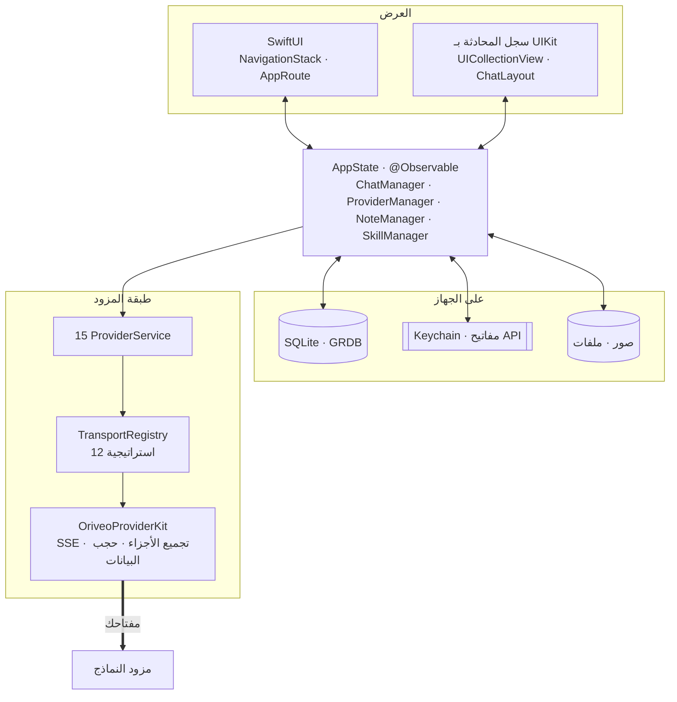

<div align="center">

# Oriveo لنظام iOS

**عميل محادثة أصلي مبني على SwiftUI لنماذج الذكاء الاصطناعي التي تدفع ثمنها أصلا.**

<a href="../../LICENSE"></a>


<sub>

<a href="../../ios/README.md">English</a> ·
**العربية** ·
<a href="../de/ios.md">Deutsch</a> ·
<a href="../es/ios.md">Español</a> ·
<a href="../fr/ios.md">Français</a> ·
<a href="../hi/ios.md">हिन्दी</a> ·
<a href="../id/ios.md">Indonesia</a> ·
<a href="../ja/ios.md">日本語</a> ·
<a href="../ko/ios.md">한국어</a> ·
<a href="../pt-BR/ios.md">Português</a> ·
<a href="../ru/ios.md">Русский</a> ·
<a href="../th/ios.md">ไทย</a> ·
<a href="../tr/ios.md">Türkçe</a> ·
<a href="../vi/ios.md">Tiếng Việt</a> ·
<a href="../zh-Hans/ios.md">简体中文</a> ·
<a href="../zh-Hant/ios.md">繁體中文</a>

</sub>

</div>

---

عميل Oriveo لنظام iOS هو تطبيق محادثة ذكاء اصطناعي يعمل بمفتاحك الخاص. تضيف مفاتيح API التي
تملكها أصلا، ويتصل التطبيق بكل مزود مباشرة من الهاتف. تُخزَّن المحادثات والملاحظات والمجلدات
والمهارات والمرفقات على الجهاز في SQLite؛ أما مفاتيح API فتذهب إلى Keychain في iOS. لا يوجد حساب
ولا تسجيل دخول.

وهو جزء من [Oriveo Community Edition](README.md) — ثلاثة عملاء يتشاركون تعريفا واحدا لكيفية
التحدث إلى مزود نماذج.

## البنية



ثلاثة أمور في هذا المخطط تستحق التصريح بها بوضوح.

**سجل المحادثة مبني على UIKit، وما عداه SwiftUI.** يضمّن `ChatView` عنصر
`ChatListViewControllerRepresentable` حول `UICollectionView` يقوده
[ChatLayout](https://github.com/ekazaev/ChatLayout). وكل ما عدا ذلك — التنقل والإعدادات وإعداد
المزودين والملاحظات والمهارات — مكتوب بـ SwiftUI. سبب الفصل أن سجل محادثة يتدفق بسرعة الرموز
يحتاج تحكما على مستوى الخلية في القياس وإعادة الاستخدام لا توفره مقارنة الفروق في SwiftUI.
ويوثّق [`Features/Chat/ARCHITECTURE.md`](../../ios/Oriveo/Oriveo/Features/Chat/ARCHITECTURE.md)
هذا الحد.

**ثلاثة مسارات منفصلة تحدّث ذلك السجل**، عن قصد:

| المسار | ينقل | لماذا |
|---|---|---|
| `@Observable AppState` | التغييرات البنيوية — ظهور رسالة، تبديل محادثة | أصلي في SwiftUI، ورخيص للأحداث منخفضة التواتر |
| `ValueObservation` في GRDB | الحالة الدائمة المقروءة من SQLite | مصدر واحد للحقيقة بعد كل كتابة، ويصمد بعد إعادة التشغيل |
| `PassthroughSubject` من Combine لكل محادثة | النص المتدفق وفروق الاستدلال | يتجاوز مقارنة الفروق في SwiftUI تماما بسرعة الرموز |

**دعم المزودين أربعة محاور مستقلة، لا تعداد واحد.** `ProviderKind` (16 حالة) هو *من الذي أعدّه
المستخدم*. و`ProviderServiceProtocol` هو *سطح النداء*. و`TransportKind` (12 حالة) هو *بروتوكول
الاتصال الذي يُستخدم فعلا* — ويُحدَّد **لكل نموذج، من الفهرس**، فقد يختلف نموذجان خلف المفتاح
نفسه. أما `RelayKind` فيغطي نقاط النهاية التي يوفّرها المستخدم. وفصلها هكذا هو ما يجعل نموذجا
جديدا يعمل دون بناء جديد.

### كيف تُرسَل رسالة واحدة


`BaseAPIService.encodeChatBody` هي النقطة الوحيدة التي يتحول فيها جسم الطلب إلى بايتات. وكل وصفة
قدرة ومعامل توليد وحقل مخصص لا بد أن يمر بها، وهذا ما يجعل صيغة الاتصال قابلة للاختبار في مكان
واحد بدل خمسة عشر.

## ما المسموح لنموذج أن يفعله

لا يخمّن العميل قدرات نموذج من اسمه أبدا. بل يقرأ **زمن تشغيل للقدرات** — مجموعة وصفات تصف، لمزود
ونقل وقدرة معينة، أي مؤشرات JSON بالضبط تُكتب في الطلب. وتوجد تلك الوصفات في
[`shared/capabilityrecipe`](shared.md) ويطبّقها `CapabilityRecipeRequestCompiler`.

وفي طريق العودة يسجّل `CapabilityExecutionRuntime` ما حدث فعلا. ولا يجوز إلا لمحلل بث إنتاجي مختار
أن يرفع قدرة إلى حالة *مرصودة*. أما استجابة HTTP 200 أو إجابة غير فارغة أو تصريح بأداة في الطلب
فليست دليلا صراحة. وتُخزَّن الحالة النهائية لكل رسالة، فتستطيع الواجهة أن تخبرك بأن عنصر تحكم
طُلب ولم يُؤكَّد قط بدل أن توحي ضمنا بأنه نجح.

## التخزين

```
Application Support/Oriveo/
  active-uid                     # storage partition, "guest" by default
  users/<uid>/
    oriveo.sqlite                # conversations, messages, notes, catalog cache
    Images/  Files/              # attachment blobs, referenced by id
    session-snapshot.json        # preferences, provider list (never API keys)
```

- **SQLite عبر GRDB** مع WAL والمفاتيح الأجنبية مفعّلة و`DatabaseMigrator` يغطي كل تغيير في
  المخطط. ويستخدم البحث في النص الكامل عبر الرسائل والملاحظات FTS5 مع مقسّم ثلاثيات.
- **مفاتيح API تعيش في Keychain**، مفهرسة بالمزود والقسم، وتُمحى من لقطة الجلسة قبل كتابتها.
- **كتل المرفقات ملفات على القرص**، لا صفوف، فلا يضخّم ملف PDF كبير قاعدة البيانات.

## الاتصال الشبكي الوحيد الذي يجريه التطبيق لحسابه

عند البدء البارد يرسل التطبيق طلبَي `GET` غير موثّقين ومشروطين بـ ETag إلى
`https://api.oriveoai.com` — هما `/api/metadata?view=lean` و`/api/metadata/model-facts`. وهما يجلبان
فهرس النماذج العام: أي النماذج موجودة، وما الذي يدعمه كل منها، وكيف تُسمّى عناصر التحكم في
الاستدلال لديه، وكم يكلّف. لا يُرفَق أي مفتاح ولا محادثة ولا معرّف، وتُخزَّن الاستجابة مؤقتا في
SQLite فيعمل التطبيق من النسخة المخزّنة حين يتعذّر الوصول إلى الفهرس.

هذا هو الطلب الوحيد الذي يجريه التطبيق لحسابه هو. وكل ما عداه يذهب إلى مزود أعددته أنت، بمفتاحك.

## هيكل المشروع

```
ios/Oriveo/
  Oriveo.xcodeproj/
  Oriveo/
    Core/
      Providers/       15 provider services, transports, capability runtime, catalog client
      State/           AppState and the managers it owns
      Database/        GRDB pool, schema, migrator, stores, observations
      Models/          domain types
      Attachments/     import limits, budgets, per-format text extraction
      Tools/           tool-call loop and per-protocol adapters
    Features/
      Chat/            transcript, composer, model controls, export
      Providers/       setup, detail, relay, local engines, subscription sign-in
      Home/ Notes/ Skills/ Settings/ Backup/ Onboarding/
    Shared/Components/ shared views
    DesignSystem/      theme, colour, haptics
  OriveoTests/
```

## البناء والتشغيل

تحتاج جهاز Mac مع **Xcode 26** وجهازا يعمل بنظام **iOS 18 أو أحدث**. ويكفي حساب Apple Developer
مجاني؛ فالتطبيق لا يستخدم أي قدرات مدفوعة ويشحن ملف استحقاقات فارغا.

1. افتح `ios/Oriveo/Oriveo.xcodeproj`
2. اختر مخطط `Oriveo`
3. من **Signing & Capabilities** اختر فريقك أنت
4. إن تعذّر على Xcode تسجيل `ai.oriveo.community`، غيّر معرّف الحزمة إلى معرّف يملكه فريقك
5. وصّل هاتف iPhone، وفعّل Developer Mode، وامنح الثقة للحاسوب، ثم شغّل

وللبناء على المحاكي بدلا من ذلك، اختر أي محاكي iPhone وشغّل. وتُحلّ اعتماديات الحزم من ملف
`Package.resolved` المودَع في المستودع.

يستخدم ملف المشروع `objectVersion = 77` مع مجموعات متزامنة مع نظام الملفات، لذا قد يرفض إصدار
أقدم من Xcode فتحه. حدّث Xcode بدل تعديل صيغة المشروع.

> [!NOTE]
> يُترجَم هدف التطبيق في وضع لغة Swift 5 مع `SWIFT_APPROACHABLE_CONCURRENCY` و
> `SWIFT_DEFAULT_ACTOR_ISOLATION = MainActor`. أما حزمة `OriveoProviderKit` المحلية فتعلن
> `swift-tools-version: 6.1` وتُبنى في وضع لغة Swift 6.

## الاعتماديات

| الحزمة | الإصدار | تُستخدم لـ |
|---|---|---|
| [GRDB.swift](https://github.com/groue/GRDB.swift) | 7.11.1 | الوصول إلى SQLite والترحيلات و`ValueObservation` |
| [ChatLayout](https://github.com/ekazaev/ChatLayout) | 2.4.3 | تخطيط عرض المجموعة لسجل المحادثة |
| [swift-markdown-ui](https://github.com/gonzalezreal/swift-markdown-ui) | 2.4.1 | عرض Markdown |
| [SwiftMath](https://github.com/mgriebling/SwiftMath) | 1.7.3 | عرض LaTeX |
| [ZIPFoundation](https://github.com/weichsel/ZIPFoundation) | 0.9.20 | أرشيفات النسخ الاحتياطي واستخراج Office/EPUB/ODF |
| `OriveoProviderKit` | محلية | نواة الاتصال بالمزودين، مشتركة مع macOS |

## الاختبارات

شغّل مخطط `OriveoTests` من Xcode، أو من جذر المستودع:

```bash
xcodebuild test -project ios/Oriveo/Oriveo.xcodeproj -scheme Oriveo \
  -destination 'platform=iOS Simulator,name=iPhone 17'
```

استبدل بمحاكٍ تملكه فعلا — يسردها الأمر `xcrun simctl list devices available`.

> [!IMPORTANT]
> يقرأ هدف الاختبار نسخ العقود المرجعية من `shared/` بالصعود من `#filePath` حتى يجد ذلك المجلد.
> ويعتمد عليه نحو 29 مجموعة اختبار، لذا **لا تنجح الاختبارات إلا في نسخة كاملة من المستودع** —
> نسخ مجلد `ios/` وحده لن ينفع.

المجموعة كبيرة: نحو 2,900 اختبار موزعة على 273 ملفا، معظمها بـ [Swift
Testing](https://github.com/swiftlang/swift-testing). وتغطي شكل الطلب لكل مزود، وإعادة تشغيل بث SSE
مسجّل من المصدر، وسياسة relay والمحركات المحلية، وقياس سجل المحادثة وسلوك البث، والتخزين، ودورات
النسخ الاحتياطي الكاملة.

ولحزمة `shared/OriveoProviderKit` مجموعتها الخاصة:

```bash
cd shared/OriveoProviderKit && swift test
```

## الترجمة والتوطين

ست عشرة لغة، مخزّنة كفهارس نصوص Xcode (`.xcstrings`) — عشرة فهارس، ونحو 1,900 مفتاح، والإنجليزية
هي المصدر. وتُحلّ النصوص عبر `L10n.tr(_:table:)` مقابل حزمة `.lproj` تُختار من إعداد اللغة داخل
التطبيق، فيسري تبديل اللغة دون إعادة تشغيل. أما التخطيط من اليمين إلى اليسار للعربية فمعالج صراحة.

## المساهمة

انظر [CONTRIBUTING.md](../../CONTRIBUTING.md). أضف اختبارا مع أي تغيير في السلوك؛ ولإصلاح في
بروتوكول مزود، فضّل نسخة مسجّلة تحت `shared/test-fixtures` على محاكاة مكتوبة يدويا، واذكر أي مزود
وأي نموذج اختبرت عليه.

## الترخيص

[AGPL-3.0-or-later](../../LICENSE).
