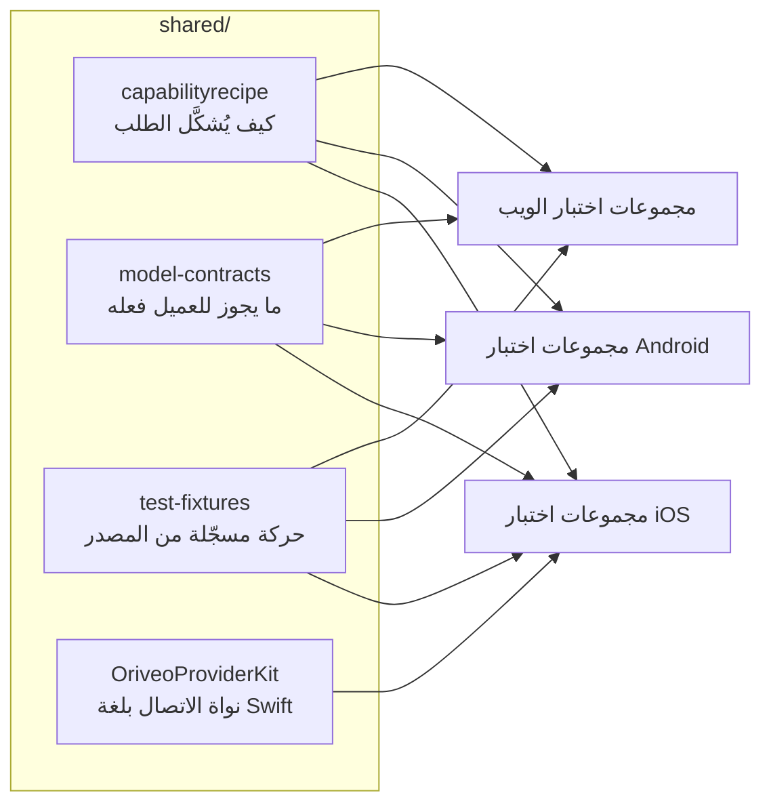

<div align="center">

# العقود المشتركة

**تعريف واحد لكيفية التحدث إلى مزود نماذج، يختبره العملاء الثلاثة جميعا.**

<a href="../../LICENSE"></a>


<sub>

<a href="../../shared/README.md">English</a> ·
**العربية** ·
<a href="../de/shared.md">Deutsch</a> ·
<a href="../es/shared.md">Español</a> ·
<a href="../fr/shared.md">Français</a> ·
<a href="../hi/shared.md">हिन्दी</a> ·
<a href="../id/shared.md">Indonesia</a> ·
<a href="../ja/shared.md">日本語</a> ·
<a href="../ko/shared.md">한국어</a> ·
<a href="../pt-BR/shared.md">Português</a> ·
<a href="../ru/shared.md">Русский</a> ·
<a href="../th/shared.md">ไทย</a> ·
<a href="../tr/shared.md">Türkçe</a> ·
<a href="../vi/shared.md">Tiếng Việt</a> ·
<a href="../zh-Hans/shared.md">简体中文</a> ·
<a href="../zh-Hant/shared.md">繁體中文</a>

</sub>

</div>

---

ثلاثة عملاء ينفّذ كل منهم «نادِ المزود» على حدة سينحرفون عن بعضهم. سينحرفون بهدوء، في اتجاه أيّهم
اختبره أحدهم آخر مرة، وسيظهر الانحراف على شكل علة تتكرر على منصة واحدة دون البقية.

ومجلد `shared/` هو الجواب على ذلك: يُكتب السلوك مرة واحدة كبيانات، وتختبر مجموعة اختبارات كل عميل
نفسها على الملفات ذاتها. فالخصوصية التي تعيش في تلك البيانات تُصلَح مرة واحدة. أما التي تعيش في
محلّل فتلتقطها ثلاث مجموعات اختبار في الوقت نفسه، بدل أن تُشحن على منصتين وتكسر الثالثة.



## capabilityrecipe

سجل الوصفات. لمزود ونقل وقدرة معينة — البحث على الويب، ومستوى جهد الاستدلال، وتوليد الصور — يقول
بالضبط أي مؤشرات JSON تُكتب في الطلب الصادر، وكيف تُقرأ الإجابة عائدة.

وهذا ما يجعل نموذجا صدر اليوم يعمل دون تحديث العميل، وهو سبب ألا يخمّن أي عميل قدرة من اسم نموذج.
يحمل `capability_runtime.v1.json` الوصفات نفسها؛ بينما يعرّف `capability_result_definitions.v1.json`
و`capability_custom_controls.v2.json` كيف تُفسَّر النتائج وعناصر التحكم التي يراها المستخدم.

وتعلن كل وصفة قيمة `executionKind` — `request_overlay` أو `server_tool` أو `client_tool_loop` أو
`endpoint_route` أو `model_route` — ويتحقق مترجم كل عميل من مطابقة الوصفة للمزود والقدرة والنقل
قبل تطبيقها، ويرفض بسبب مسمّى بدل إرسال طلب لم يراجعه أحد.

## model-contracts

نسخ JSON مرجعية تثبّت السلوك عبر العملاء: كيف يجب أن يبدو الطلب لمزود وقدرة معينة، وكيف تُحلّ
معاملات التوليد وكيف تتراكب التجاوزات، وأي حالات قدرة يجوز للعميل عرضها، وكيف يُستهلك فهرس
النماذج وأدلته.

وتحمّل اختبارات كل عميل هذه الملفات مباشرة، فأي تغيير هنا هو تغيير في العملاء الثلاثة دفعة واحدة.

## test-fixtures

بيانات اختبار ذهبية: حركة نداء أدوات مسجّلة من المصدر، وسيناريوهات توجيه relay واكتشافه، ولقطات
لحقائق النماذج وأدلة القدرات، وسيناريوهات المحركات المحلية.

وملفات `.sse` الموجودة تحت `recorded/` هي **حركة حقيقية ملتقطة من المصدر**، تُترك كما هي بايتا
ببايت؛ أما البقية فنسخ مرجعية مكتوبة يدويا تثبّت مسار تحليل بعينه. والفرق مهم: فالمحاكاة المكتوبة
يدويا تشفّر ما اعتقدتَ أن المزود يفعله، بينما يشفّر التسجيل ما فعله فعلا، بما في ذلك ذلك الجزء
المشوّه الذي أرسله يوم الثلاثاء. وحين يحتاج إصلاح في بروتوكول مزود إلى اختبار، فضّل تسجيلا.

## OriveoProviderKit

حزمة Swift تحمل نواة بروتوكول الاتصال بالمزودين: تجميع أسطر SSE، وتحليل الأجزاء المتوافقة مع
OpenAI، وترميز أسماء الأدوات، وحجب بيانات الاعتماد، وتصنيف أخطاء المصدر، وتحليل وسوم التفكير،
واستخراج مسارات JSON أثناء البث، وملفات خصوصيات كل مورّد.

ونطاقها مرسوم بضيق مقصود. **داخله:** معرفة الاتصال المعتمدة على Foundation وحدها. **خارجه:**
نماذج التطبيق والواجهة وقاعدة البيانات والقياس والتوطين. ويحتفظ كل عميل من عملاء Apple بربط رقيق
حولها، فيكون لسلوك الاتصال تنفيذ واحد بالضبط.

```bash
cd shared/OriveoProviderKit && swift build && swift test
```

- المنصات: iOS 18+ وmacOS 15+ · `swift-tools-version: 6.1`
- يحمل `ProviderWireProfile` ما تبقى من خصوصيات كل مورّد مما لا يزال يحتاجه مجمّع واحد متوافق مع
  OpenAI — أين يصل نص الاستدلال، وأين تعيش أعداد الرموز المخزّنة مؤقتا، وهل تتضمن رموز الموجّه
  إصابات التخزين المؤقت أصلا. وهو يصف *كيف تصل البايتات*، لا *ما يستطيع نموذج فعله*؛ فتلك مهمة
  الوصفات.

## العمل على هذه الملفات

أي تغيير هنا تغيير في كل عميل. شغّل مجموعات اختبار العقود لكل عميل يقرأ الملف الذي مسسته، لا
المجموعة التي تصادف أنك تعمل فيها فقط:

من جذر المستودع:

```bash
(cd web && npm run test:run)
(cd shared/OriveoProviderKit && swift test)
# plus the iOS and Android suites — see their READMEs
```

وتحدّد مجموعات اختبار iOS موقع هذا المجلد بالصعود من ملف الاختبار حتى تجد `shared/`؛ أما مجموعات
Android فتحلّ المسار `../../shared` انطلاقا من مجلد وحدة Gradle، ومجموعات الويب تحلّه نسبة إلى
مساحة العمل. ولذلك تتطلب جميعها نسخة كاملة من المستودع.

## الترخيص

[AGPL-3.0-or-later](../../LICENSE).
