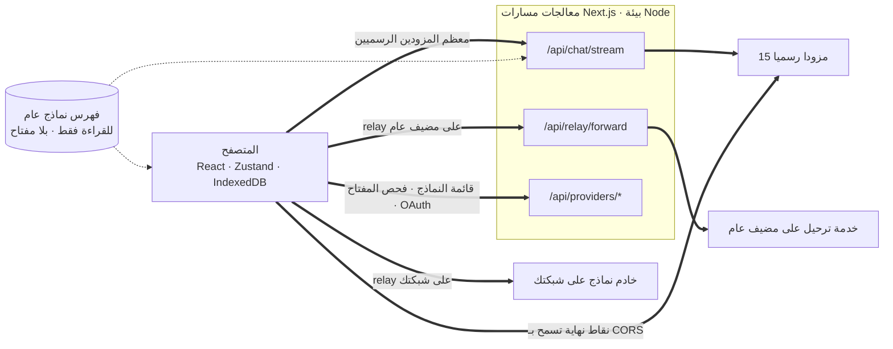
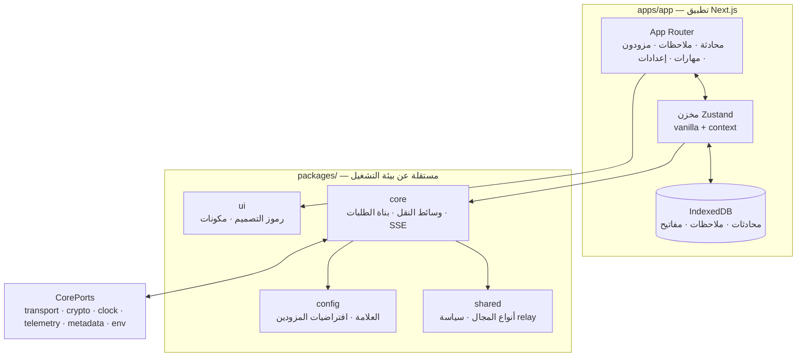

<div align="center">

# Oriveo للويب

**عميل محادثة مبني على Next.js لنماذج الذكاء الاصطناعي التي تدفع ثمنها أصلا.**

<a href="../../LICENSE"></a>


<sub>

<a href="../../web/README.md">English</a> ·
**العربية** ·
<a href="../de/web.md">Deutsch</a> ·
<a href="../es/web.md">Español</a> ·
<a href="../fr/web.md">Français</a> ·
<a href="../hi/web.md">हिन्दी</a> ·
<a href="../id/web.md">Indonesia</a> ·
<a href="../ja/web.md">日本語</a> ·
<a href="../ko/web.md">한국어</a> ·
<a href="../pt-BR/web.md">Português</a> ·
<a href="../ru/web.md">Русский</a> ·
<a href="../th/web.md">ไทย</a> ·
<a href="../tr/web.md">Türkçe</a> ·
<a href="../vi/web.md">Tiếng Việt</a> ·
<a href="../zh-Hans/web.md">简体中文</a> ·
<a href="../zh-Hant/web.md">繁體中文</a>

</sub>

</div>

---

عميل Oriveo للويب هو تطبيق محادثة ذكاء اصطناعي يعمل بمفتاحك الخاص ومبني على Next.js. تعيش
المحادثات والملاحظات والمجلدات والمهارات ومفاتيح المزودين في تخزين المتصفح نفسه. لا يوجد حساب
ولا تسجيل دخول.

وهو جزء من [Oriveo Community Edition](README.md) — ثلاثة عملاء يتشاركون تعريفا واحدا لكيفية
التحدث إلى مزود نماذج.

## البدء السريع

يتطلب Node 22.22.2 أو إصدار 22.x أحدث (انظر [`.nvmrc`](../../web/.nvmrc))؛ وحقل `engines` هو
`^22.22.2`، لذا فإن Node 23+ غير مدعوم. ويأتي npm معه؛ ولا حاجة إلى أي مدير حزم آخر.

```bash
npm install
npm run dev:app     # http://localhost:3001
```

تطلب منك الشاشة الأولى مفتاح API لمزود. ولا شيء آخر مطلوب لبدء المحادثة.

## كيف ينتقل الطلب فعلا

هذا هو الجزء الجدير بالقراءة قبل أي شيء آخر، لأن عميل الويب هو المكان الوحيد الذي **لا** يذهب فيه
الطلب عادة من العميل إلى المزود مباشرة.



**لماذا يوجد هذا الالتفاف.** معظم واجهات المزودين لا ترسل ترويسات CORS، فلا يستطيع المتصفح مناداة
`api.openai.com` وأمثاله مباشرة — إذ يفشل طلب الفحص المسبق. وكل عميل BYOK داخل المتصفح مضطر لحل
هذه المسألة بطريقة ما؛ وهذا العميل يمرر الطلب عبر معالجات مسارات Next.js تعمل في بيئة Node. فحين
تشغّل `npm run dev:app` تكون تلك المعالجات على جهازك أنت. وحين تنشر التطبيق في مكان ما، تكون على
الجهاز الذي نشرته عليه.

والمعالج ليس واحدا: فبث المحادثة، وموجّه خدمة الترحيل (Relay)، وتوليد الصور، وقائمة النماذج، والتحقق من المفتاح،
وتبادلا تسجيل الدخول بالجهاز لدى Grok وChatGPT تبلغ في مجموعها اثني عشر ملف مسار. والتحقق من المفتاح
مهم هنا — فهو يرسل المفتاح إلى خادمك أنت، الذي يسبر به المزود.

أما بضع نقاط نهاية *فتسمح* فعلا بالمتصفح، وتُنادى مباشرة بلا خادم في المنتصف: نقطة Kimi في الصين
(`api.moonshot.cn`) للمحادثة، ونقاط الرصيد لدى OpenRouter وSiliconFlow وDeepSeek وKimi.

**ما يفعله المعالج وما لا يفعله.** يتحقق من شكل الطلب ويحدّ من حجمه، ويطبّق حدا للمعدل لكل عنوان
IP على حركة المحادثة وrelay، ويرفض العناوين التي تُحلّ إلى عناوين خاصة أو link-local، ويبني الجسم
الخاص بالمزود، ويبث الاستجابة عائدة. ولا توجد قاعدة بيانات، ولا كتابة على نظام الملفات، ولا تسجيل
لأجسام الطلبات في أي موضع تحت `app/api` — فمفتاحك ورسائلك تُمرَّر ثم تُنسى. ولأن المسار عملية واحدة
يتشاركها كل الزوار، يثبّت اختبار مخصص (`server-never-learns.test.ts`) أنه لا يخزّن قط معاملا رُفض
لمستخدم ثم يطبّقه على طلب شخص آخر.

أما موجّه relay فيثبّت إضافة إلى ذلك DNS على العنوان الذي حلّه، ويحدّ من حجم الاستجابة، ويضع سقفا
لكل مهلة، ويقصر إعادة التوجيه على الأصل نفسه، ويرفض تمرير ترويسات hop-by-hop.

**النقاط المحلية تتخطاه تماما.** فأي relay على عنوان خاص أو باسم `.local` أو على `localhost` أو
مضبوط في وضع HTTP المحلي أو VPN الخاص يُجلَب **من المتصفح مباشرة**، مع `credentials: 'omit'` و
`targetAddressSpace: 'local'`. فحركة شبكتك المحلية لا تغادر شبكتك، ولا تمر بخادم التطبيق أيضا.

## البنية



تحمل `packages/core` كل بايت من معرفة بروتوكولات المزودين، وتُبقى عمدا خالية من كائنات المتصفح
العامة — إذ يمنع eslint استخدام `window` و`document` و`fetch` و`crypto` و`localStorage`
و`sessionStorage` و`indexedDB` داخلها وداخل `packages/ipc-contract`. وكل ما تحتاجه من البيئة يصلها
عبر `CorePorts`. وهذا ما يتيح للكود نفسه أن يعمل في متصفح، وفي معالج مسار Node، وفي اختبار بلا DOM.

ودعم المزودين محوران مستقلان. يختار `providerKind` **باني الطلب** (كيف يبدو الجسم لدى هذا
المورّد). ويختار `model.transport` **استراتيجية نقل** (أي بروتوكول اتصال يُستخدم) من بين اثنتي
عشرة، ويُحدَّد لكل نموذج من الفهرس لا لكل مزود — فقد يختلف نموذجان خلف المفتاح نفسه. وتنفّذ كل
استراتيجية ثلاث دوال بالضبط: `buildRequestBody` و`parseStreamChunk` و`parseError`.

## مساحات العمل

```
apps/app/               the Next.js application
packages/core/          provider protocols: transports, request builders, SSE parsing
packages/shared/        domain types, relay policy, helpers
packages/ui/            design tokens and shared components
packages/config/        brand and provider defaults
packages/ipc-contract/  typed channel contract for a desktop shell
```

التنسيق مبني على CSS Modules فوق ورقة واحدة من الخصائص المخصصة في `packages/ui` — ولا يوجد إطار
عمل قائم على أصناف مساعدة. و`packages/ipc-contract` هو الواجهة المُنمَّطة التي يحتفظ بها تطبيق
الويب لمضيف سطح مكتب: قنوات مسمّاة لبث المحادثة، ونداءات المزودين، وتمرير خدمة الترحيل، وتخزين
المفاتيح، ويمكن لقشرة أصلية أن ترتبط بها عبر كشف `window.oriveo`. ولا تُشحن قشرة سطح مكتب في هذا
المستودع، لذا تكون `IS_DESKTOP` بقيمة false في بناء الويب ويبقى كل فرع خلفها بلا استخدام.

وهناك وصلة أخرى من النوع نفسه. يعلن `apps/app/lib/core/sync-port.ts` الواجهة التي سينفّذها أي خادم
مزامنة،
وكل موضع نداء يصل إليها عبر التسلسل الاختياري. ولا شيء يثبّت خادما كهذا، فيُرجع `getSyncAdapter()`
القيمة `null` وتبقى IndexedDB النسخة الوحيدة من بياناتك — وهذا بالضبط ما يعنيه عمليا «بلا حساب وبلا
تسجيل دخول».

## التخزين

كل شيء مقسّم بحسب القسم، مفهرس بمعرّف نشط قيمته الافتراضية `guest`.

| ماذا | أين |
|---|---|
| المحادثات والرسائل والمجلدات والملاحظات والمزودون | IndexedDB باسم `oriveo--{id}`، 8 مخازن كائنات |
| لقطة فهرس النماذج (نحو 3 ميغابايت) وحقائق النماذج | مخزن كتل في IndexedDB، عمدا لا في localStorage |
| التفضيلات وجداول التحكم بالنماذج | `localStorage`، مع `safeLocalStorage` يغلّف المسارات التي رُصد أنها ترمي استثناء |
| الصور المولّدة والمرفقة | قاعدة بيانات IndexedDB منفصلة |

تفصيلان جاءا من عطل حقيقي لا من ذوق. تعيش لقطة الفهرس في IndexedDB لأنها بحجم نحو 3 ميغابايت كانت
تلتهم معظم حصة 5 ميغابايت المخصصة لـ localStorage لأصل المتصفح. وكل وصول إلى localStorage يمر عبر
`safeLocalStorage`، لأن *دالة الجلب* الخاصة بـ `window.localStorage` نفسها ترمي `SecurityError`
حين يكون المتصفح مضبوطا على حجب بيانات المواقع — فقراءة مجردة تُسقط الصفحة قبل أن تعمل كتلة `try`
لديك أصلا.

> [!IMPORTANT]
> على الويب تُخزَّن مفاتيح المزودين في IndexedDB **دون تشفير** — وهو النموذج الذي تتبعه عموما
> عملاء BYOK داخل المتصفح، لأن المتصفح لا يملك مكانا أفضل لوضعها. وللحصول على أقوى ضمان استخدم
> عميل iOS أو Android، حيث تشفّرها سلسلة مفاتيح النظام أو مخزن مفاتيحه. أما أرشيفات النسخ
> الاحتياطي فأمر آخر: فهي مشفّرة بـ AES-256-GCM وPBKDF2-SHA-256 على 600,000 دورة حين تختار كلمة مرور.

## فهرس النماذج

النماذج التي يقدمها كل مزود، وما يدعمه كل نموذج، تأتي من فهرس للقراءة فقط يُجلب عند الإقلاع. ولا
يُطلب سوى نقطتَي نهاية بالضبط، كلتاهما `GET` وكلتاهما مشروطة بـ ETag، ولا تحمل أي منهما مفتاح API
ولا محادثة ولا أي معرّف مستخدم:

```
GET {backend}/api/metadata?view=lean
GET {backend}/api/metadata/model-facts
```

والخادم الخلفي الافتراضي هو `https://api.oriveoai.com`. وجّه `NEXT_PUBLIC_BACKEND_URL` إلى مضيفك
الخاص لتقديمه بنفسك. وتُخزَّن الاستجابة مؤقتا 24 ساعة في IndexedDB ويُعاد التحقق منها بـ
`If-None-Match`؛ وحين يتعذّر الوصول إلى الفهرس يظل التطبيق يعمل من نسخته المخزّنة.

## الأوامر

شغّل هذه الأوامر من هذا المجلد.

| الأمر | ماذا يفعل |
|---|---|
| `npm run dev:app` | خادم التطوير على المنفذ 3001 |
| `npm run build:app` | بناء الإنتاج |
| `npm run typecheck` | `tsc --noEmit` عبر كل مساحات العمل |
| `npm run test:run` | vitest، تمريرة واحدة |
| `npm run test` | vitest في وضع المراقبة، مراقب واحد لكل مساحة عمل — والأفضل تشغيله داخل مساحة عمل واحدة |
| `npm run lint` | eslint على `apps/` و`packages/` |

ويقدّم الأمر `npm start --workspace @oriveo/app` بناء جاهزا على المنفذ 3001.

ولتشغيل ملف اختبار واحد، شغّله من مساحة العمل التي يملكه، لأن عدة مجموعات تحلّ ملفاتها المرجعية
نسبة إلى مجلد العمل:

```bash
cd apps/app && npx vitest run lib/core/chat/__tests__/stream-options.test.ts
```

## الإعدادات

كل شيء اختياري. انسخ [`.env.example`](../../web/.env.example) إلى `.env.local` واضبط ما تحتاجه
فقط؛ وكل متغير يقرأه الكود مدرَج وموضَّح هناك.

### الإبلاغ عن الأخطاء

يضمّ التطبيق حزمة Sentry SDK. وهي **خاملة بلا DSN** — فغياب `NEXT_PUBLIC_SENTRY_DSN` يعني بلا ناقل،
وبلا أحداث، وبلا إرسال أي شيء إلى أي مكان، وهذا هو الوضع الافتراضي لبناء من هذا المستودع. وإن ضبطت
واحدا حصلت على الإبلاغ عن الأخطاء وتتبّع أداء بنسبة 10% وإعادة تشغيل للجلسات بنسبة 1%، مع خطافات
تجرّد مفاتيح المزودين ونقاط النهاية ومحتوى الرسائل قبل أن يغادر أي حدث المتصفح. وهي هنا كي تستطيع
أي عملية نشر تريد الإبلاغ عن الأخطاء أن تحصل عليه، لا لأن هذا البناء يتصل بالخارج.

## الاستضافة الذاتية

لا يوجد Dockerfile ولا سكربت نشر؛ فالتطبيق خادم Next.js عادي.

```bash
npm ci
npm run build:app
npm start --workspace @oriveo/app     # 127.0.0.1:3001
```

وثمة ثلاثة أمور تستحق المعرفة قبل وضعه خلف وسيط عكسي.

يرتبط `npm start` بالعنوان `127.0.0.1`، فيجب أن يعمل الوسيط على المضيف نفسه، أو أن يُغيَّر عنوان
الارتباط.

اضبط `NEXT_PUBLIC_APP_URL` على الأصل الذي تخدم منه فعلا. فالروابط المعيارية وخريطة الموقع وصورة
المعاينة الاجتماعية تُحلّ كلها بالنسبة إليه، وقيمته الافتراضية هي منفذ التطوير.

اضبط `TRUSTED_PROXY_HOP_COUNT` على عدد الوسطاء أمام التطبيق. فمحدّد معدل المحادثة يقرأ عنوان العميل
بعد ذلك العدد من الخطوات من *يمين* `X-Forwarded-For` — لا من اليسار أبدا، فاليسار يتحكم به العميل
ويمكنه تلفيقه. والقيمة الافتراضية 1 صحيحة لوسيط واحد؛ وإن تركتها منخفضة خلف وسيطين تشارك كل الزوار
دلوا واحدا لتحديد المعدل، لأن العنوان المقروء هو عنوان وسيطك الداخلي أنت.

ويرسل التطبيق أصلا ترويسات HSTS و`X-Content-Type-Options` و`X-Frame-Options` و`Referrer-Policy`
و`Permissions-Policy` و`Cross-Origin-Opener-Policy` من `next.config.ts`، فلا يحتاج الوسيط إلى
إضافتها. أما إنهاء TLS وحدود حجم الطلب فهما من عمل الوسيط.

وأمر أخير يستحق قرارا واعيا: كل من يستطيع الوصول إلى عملية النشر يستطيع استخدام معالجات مساراتها
لمناداة مزود بمفتاح يقدّمه هو. ولا تحمل هذه المعالجات مفاتيح خاصة بها ولا تخزّن شيئا، لكنها مسار
HTTP صادر، فعملية نشر يمكن الوصول إليها علنا موضعها خلف ضوابط الوصول نفسها التي تمنحها لأي أداة
داخلية أخرى.

## الاعتماديات

| الحزمة | الإصدار | تُستخدم لـ |
|---|---|---|
| [Next.js](https://nextjs.org) | 16.3.3 | App Router والمعالجات والبناء |
| [React](https://react.dev) | 19.2.8 | الواجهة |
| [vitest](https://vitest.dev) | 4.1.11 | مشغّل الاختبارات |
| [zustand](https://zustand.docs.pmnd.rs) | 5.0.15 | حالة العميل |
| [next-intl](https://next-intl.dev) | 4.14.1 | الترجمة والتوطين |
| [@sentry/nextjs](https://docs.sentry.io/platforms/javascript/guides/nextjs/) | 10.72.0 | الإبلاغ عن الأخطاء، وخامل بلا DSN |

الإصدارات الدقيقة لكل اعتمادية مثبّتة في `package-lock.json`.

## الاختبارات

نحو 5,600 اختبار موزعة على 460 ملفا، على vitest. والتغطية أثقل حيث يكون الخطأ أغلى ثمنا: شكل الطلب
لكل مزود، وسلوك النقل لكل بروتوكول اتصال، وتحليل SSE وأجزاء الوسيط، وتحليل الاستخدام والتكلفة،
وتصنيف الأخطاء، وفحص relay وأوضاع الأمان، وحارس SSRF، وتنفيذ وصفات القدرات، وتخزين الفهرس وإبطاله
عند تغيّر إصدار العقد، والحفظ في IndexedDB، وتقسيم التخزين، ودورات النسخ الاحتياطي الكاملة،
ومعالجات المسارات نفسها.

> [!IMPORTANT]
> تحلّ أكثر من ثلاثين مجموعة اختبار نسخ العقود المرجعية تحت `shared/` نسبة إلى مجلد العمل، لذا **لا
> تنجح الاختبارات إلا في نسخة كاملة من المستودع، ومن مساحة العمل التي تملكها** — نسخ مجلد `web/`
> وحده لن ينفع.

## الترجمة والتوطين

ست عشرة لغة في `apps/app/messages`، بنحو 1,800 مفتاح لكل منها، والإنجليزية هي المصدر. ويمشي اختبار
على المجلد ويفشل إن اختلفت مجموعة مفاتيح أي لغة عن الإنجليزية، فإضافة ملف لغة تسجّلها تلقائيا.
وتحصل العربية على تخطيط كامل من اليمين إلى اليسار. أما اختيار اللغة فيتبع معامل `?locale=` الصريح،
ثم ملف تعريف الارتباط، ثم `Accept-Language`.

## المساهمة

انظر [CONTRIBUTING.md](../../CONTRIBUTING.md). حزمة `packages/core` مبنية حول النقل أولا: فإضافة
مزود عادة ما تكون باني طلب ومحوّل استجابة، لا عميلا جديدا. ولإصلاح في بروتوكول مزود، فضّل نسخة
مسجّلة تحت `shared/test-fixtures` على محاكاة مكتوبة يدويا.

## الترخيص

[AGPL-3.0-or-later](../../LICENSE).
