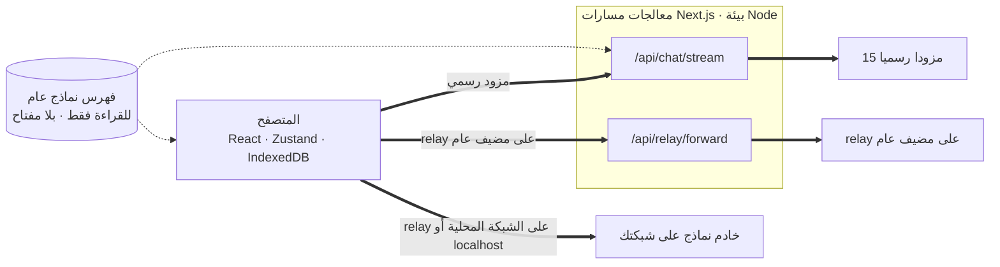
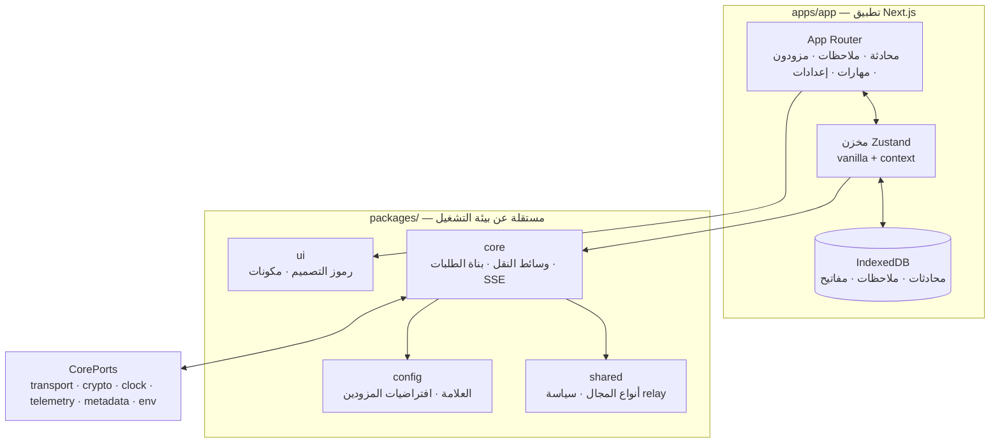

<div align="center">

# Oriveo للويب

**عميل محادثة مبني على Next.js لنماذج الذكاء الاصطناعي التي تدفع ثمنها أصلا.**

<a href="../../LICENSE"></a>


<sub>

<a href="../../web/README.md">English</a> ·
**العربية** ·
<a href="../de/web.md">Deutsch</a> ·
<a href="../es/web.md">Español</a> ·
<a href="../fr/web.md">Français</a> ·
<a href="../hi/web.md">हिन्दी</a> ·
<a href="../id/web.md">Indonesia</a> ·
<a href="../ja/web.md">日本語</a> ·
<a href="../ko/web.md">한국어</a> ·
<a href="../pt-BR/web.md">Português</a> ·
<a href="../ru/web.md">Русский</a> ·
<a href="../th/web.md">ไทย</a> ·
<a href="../tr/web.md">Türkçe</a> ·
<a href="../vi/web.md">Tiếng Việt</a> ·
<a href="../zh-Hans/web.md">简体中文</a> ·
<a href="../zh-Hant/web.md">繁體中文</a>

</sub>

</div>

---

عميل Oriveo للويب هو تطبيق محادثة ذكاء اصطناعي يعمل بمفتاحك الخاص ومبني على Next.js. تعيش
المحادثات والملاحظات والمجلدات والمهارات ومفاتيح المزودين في تخزين المتصفح نفسه. لا يوجد حساب
ولا تسجيل دخول.

وهو جزء من [Oriveo Community Edition](README.md) — ثلاثة عملاء يتشاركون تعريفا واحدا لكيفية
التحدث إلى مزود نماذج.

## البدء السريع

يتطلب Node 22 (انظر [`.nvmrc`](../../web/.nvmrc)). ويأتي npm معه؛ ولا حاجة إلى أي مدير حزم آخر.

```bash
npm install
npm run dev:app     # http://localhost:3001
```

تطلب منك الشاشة الأولى مفتاح API لمزود. ولا شيء آخر مطلوب لبدء المحادثة.

## كيف ينتقل الطلب فعلا

هذا هو الجزء الجدير بالقراءة قبل أي شيء آخر، لأن عميل الويب هو المكان الوحيد الذي **لا** يذهب فيه
الطلب من العميل إلى المزود مباشرة.



**لماذا يوجد هذا الالتفاف.** واجهات المزودين لا ترسل ترويسات CORS، فلا يستطيع المتصفح مناداة
`api.openai.com` وأمثاله مباشرة — إذ يفشل طلب الفحص المسبق. وكل عميل BYOK داخل المتصفح مضطر لحل
هذه المسألة بطريقة ما؛ وهذا العميل يمرر الطلب عبر معالج مسار Next.js يعمل في بيئة Node. فحين
تشغّل `npm run dev:app` يكون ذلك المعالج على جهازك أنت. وحين تنشر التطبيق في مكان ما، يكون على
الجهاز الذي نشرته عليه.

**ما يفعله المعالج وما لا يفعله.** يتحقق من شكل الطلب ويحدّ من حجمه، ويطبّق حدا للمعدل لكل عنوان
IP، ويرفض العناوين التي تُحلّ إلى عناوين خاصة أو link-local، ويبني الجسم الخاص بالمزود، ويبث
الاستجابة عائدة. وهو لا يحفظ مفتاحك ولا رسائلك ولا أي شيء مشتق منها — ويثبّت اختبار مخصص
(`server-never-learns.test.ts`) هذا السلوك. أما موجّه relay فيثبّت إضافة إلى ذلك DNS على العنوان
الذي حلّه، ويحدّ من حجم الاستجابة، ويضع سقفا لكل مهلة، ويقصر إعادة التوجيه على الأصل نفسه، ويرفض
تمرير ترويسات hop-by-hop.

**النقاط المحلية تتخطاه تماما.** فأي relay على عنوان خاص أو باسم `.local` أو على `localhost` أو
مضبوط في وضع HTTP المحلي أو VPN الخاص يُجلَب **من المتصفح مباشرة**، مع `credentials: 'omit'` و
`targetAddressSpace: 'local'`. فحركة شبكتك المحلية لا تغادر شبكتك، ولا تمر بخادم التطبيق أيضا.

## البنية



تحمل `packages/core` كل بايت من معرفة بروتوكولات المزودين، وتُبقى عمدا خالية من كائنات المتصفح
العامة — إذ يمنع eslint استخدام `window` و`document` و`fetch` و`crypto` و`localStorage` و
`indexedDB` داخلها. وكل ما تحتاجه من البيئة يصلها عبر `CorePorts`. وهذا ما يتيح للكود نفسه أن
يعمل في متصفح، وفي معالج مسار Node، وفي اختبار بلا DOM.

ودعم المزودين محوران مستقلان. يختار `providerKind` **باني الطلب** (كيف يبدو الجسم لدى هذا
المورّد). ويختار `model.transport` **استراتيجية نقل** (أي بروتوكول اتصال يُستخدم) من بين اثنتي
عشرة، ويُحدَّد لكل نموذج من الفهرس لا لكل مزود — فقد يختلف نموذجان خلف المفتاح نفسه. وتنفّذ كل
استراتيجية ثلاث دوال بالضبط: `buildRequestBody` و`parseStreamChunk` و`parseError`.

## مساحات العمل

```
apps/app/               the Next.js application
packages/core/          provider protocols: transports, request builders, SSE parsing
packages/shared/        domain types, relay policy, helpers
packages/ui/            design tokens and shared components
packages/config/        brand and provider defaults
packages/ipc-contract/  typed channel contract for a desktop shell
```

التنسيق مبني على CSS Modules فوق ورقة واحدة من الخصائص المخصصة في `packages/ui` — ولا يوجد إطار
عمل قائم على أصناف مساعدة. ويصف `packages/ipc-contract` سطح القناة الذي سترتبط به قشرة سطح مكتب؛
ولا تُشحن قشرة كهذه في هذا المستودع، لذا فهو في بناء الويب يساهم بأنواع وفروع لا تُسلك أبدا.

## التخزين

كل شيء مقسّم بحسب القسم، مفهرس بمعرّف نشط قيمته الافتراضية `guest`.

| ماذا | أين |
|---|---|
| المحادثات والرسائل والمجلدات والملاحظات والمزودون | IndexedDB باسم `oriveo--{id}`، 8 مخازن كائنات |
| لقطة فهرس النماذج (نحو 3 ميغابايت) وحقائق النماذج | مخزن كتل في IndexedDB، عمدا لا في localStorage |
| التفضيلات وجداول التحكم بالنماذج | `localStorage`، ودائما عبر غلاف لا يرمي استثناء أبدا |
| الصور المولّدة والمرفقة | قاعدة بيانات IndexedDB منفصلة |

تفصيلان جاءا من عطل حقيقي لا من ذوق. تعيش لقطة الفهرس في IndexedDB لأنها بحجم نحو 3 ميغابايت كانت
تلتهم معظم حصة 5 ميغابايت المخصصة لـ localStorage لأصل المتصفح. وكل وصول إلى localStorage يمر عبر
`safeLocalStorage`، لأن *دالة الجلب* الخاصة بـ `window.localStorage` نفسها ترمي `SecurityError`
حين يكون المتصفح مضبوطا على حجب بيانات المواقع — فقراءة مجردة تُسقط الصفحة قبل أن تعمل كتلة `try`
لديك أصلا.

> [!IMPORTANT]
> على الويب تُخزَّن مفاتيح المزودين في IndexedDB **دون تشفير** — وهو النموذج الذي تتبعه عموما
> عملاء BYOK داخل المتصفح، لأن المتصفح لا يملك مكانا أفضل لوضعها. وللحصول على أقوى ضمان استخدم
> عميل iOS أو Android، حيث تشفّرها سلسلة مفاتيح النظام أو مخزن مفاتيحه. أما أرشيفات النسخ
> الاحتياطي فأمر آخر: فهي مشفّرة بـ AES-256-GCM وPBKDF2-SHA-256 على 600,000 دورة حين تختار كلمة مرور.

## فهرس النماذج

النماذج التي يقدمها كل مزود، وما يدعمه كل نموذج، تأتي من فهرس للقراءة فقط يُجلب عند الإقلاع. ولا
يُطلب سوى نقطتَي نهاية بالضبط، كلتاهما `GET` وكلتاهما مشروطة بـ ETag، ولا تحمل أي منهما مفتاح API
ولا محادثة ولا أي معرّف مستخدم:

```
GET {backend}/api/metadata?view=lean
GET {backend}/api/metadata/model-facts
```

والخادم الخلفي الافتراضي هو `https://api.oriveoai.com`. وجّه `NEXT_PUBLIC_BACKEND_URL` إلى مضيفك
الخاص لتقديمه بنفسك. وتُخزَّن الاستجابة مؤقتا 24 ساعة في IndexedDB ويُعاد التحقق منها بـ
`If-None-Match`؛ وحين يتعذّر الوصول إلى الفهرس يظل التطبيق يعمل من نسخته المخزّنة.

## الأوامر

شغّل هذه الأوامر من هذا المجلد.

| الأمر | ماذا يفعل |
|---|---|
| `npm run dev:app` | خادم التطوير على المنفذ 3001 |
| `npm run build:app` | بناء الإنتاج |
| `npm run typecheck` | `tsc --noEmit` عبر كل مساحات العمل |
| `npm run test:run` | vitest، تمريرة واحدة |
| `npm run test` | vitest في وضع المراقبة |
| `npm run lint` | eslint على `apps/` و`packages/` |

ولتشغيل ملف اختبار واحد، شغّله من مساحة العمل التي يملكه، لأن عدة مجموعات تحلّ ملفاتها المرجعية
نسبة إلى مجلد العمل:

```bash
cd apps/app && npx vitest run lib/core/chat/stream-options.test.ts
```

## الإعدادات

كل شيء اختياري. انسخ [`.env.example`](../../web/.env.example) إلى `.env.local` واضبط ما تحتاجه
فقط؛ وكل مفتاح موثّق هناك.

## الاختبارات

نحو 4,600 اختبار موزعة على 461 ملفا، على vitest. والتغطية أثقل حيث يكون الخطأ أغلى ثمنا: شكل الطلب
لكل مزود، وسلوك النقل لكل بروتوكول اتصال، وتحليل SSE وأجزاء الوسيط، وتحليل الاستخدام والتكلفة،
وتصنيف الأخطاء، وفحص relay وأوضاع الأمان، وحارس SSRF، وتنفيذ وصفات القدرات، وتخزين الفهرس وإبطاله
عند تغيّر إصدار العقد، والحفظ في IndexedDB، وتقسيم التخزين، ودورات النسخ الاحتياطي الكاملة،
ومعالجات المسارات نفسها.

> [!IMPORTANT]
> تحمّل نحو 24 مجموعة اختبار نسخ العقود المرجعية من `../shared`، لذا **لا تنجح الاختبارات إلا في
> نسخة كاملة من المستودع** — نسخ مجلد `web/` وحده لن ينفع.

## الترجمة والتوطين

ست عشرة لغة في `apps/app/messages`، بنحو 1,800 مفتاح لكل منها، والإنجليزية هي المصدر. ويمشي اختبار
على المجلد ويفشل إن اختلفت مجموعة مفاتيح أي لغة عن الإنجليزية، فإضافة ملف لغة تسجّلها تلقائيا.
وتحصل العربية على تخطيط كامل من اليمين إلى اليسار. أما اختيار اللغة فيتبع معامل `?locale=` الصريح،
ثم ملف تعريف الارتباط، ثم `Accept-Language`.

## المساهمة

انظر [CONTRIBUTING.md](../../CONTRIBUTING.md). حزمة `packages/core` مبنية حول النقل أولا: فإضافة
مزود عادة ما تكون باني طلب ومحوّل استجابة، لا عميلا جديدا. ولإصلاح في بروتوكول مزود، فضّل نسخة
مسجّلة تحت `shared/test-fixtures` على محاكاة مكتوبة يدويا.

## الترخيص

[AGPL-3.0-or-later](../../LICENSE).
