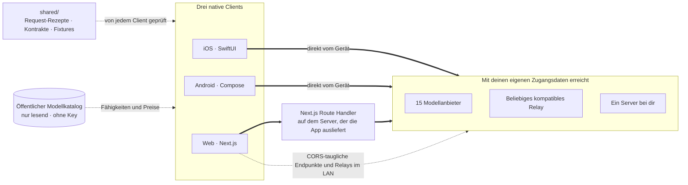

<div align="center">


# Oriveo Community Edition

**Jedes Modell, eine App.**

Open-Source-KI-Chat mit deinem eigenen Key, für iOS, Android und das Web,
dazu ein nativer macOS-Client in Entwicklung.
Kein Konto, kein Abo und kein Dienst von uns auf dem Weg der Chat-Anfrage.

<a href="../../LICENSE"></a>
<a href="ios.md"></a>
<a href="android.md"></a>
<a href="web.md"></a>
<a href="macos.md"></a>
<a href="https://github.com/oriveo/oriveo/releases/latest"></a>
<a href="https://github.com/oriveo/oriveo/stargazers"></a>

**Oriveo holen:**
<a href="https://oriveoai.com"><b>oriveoai.com</b></a> &nbsp;·&nbsp;
<a href="https://apps.apple.com/app/oriveo/id6775370458">App Store</a> &nbsp;·&nbsp;
<a href="https://play.google.com/store/apps/details?id=com.kenny.oriveo">Google Play</a> &nbsp;·&nbsp;
<a href="https://app.oriveoai.com">Web-App</a>

<sub>Die Store-Builds sind <b>Oriveo</b>, die kommerzielle Edition. Dieses Repository ist die <a href="#community-edition-und-oriveo">Community Edition</a>, aus dem Quelltext gebaut.</sub>

<a href="#loslegen">Aus dem Quelltext bauen</a> &nbsp;·&nbsp;
<a href="#architektur">Architektur</a> &nbsp;·&nbsp;
<a href="#community-edition-und-oriveo">Editionen</a> &nbsp;·&nbsp;
<a href="#faq">FAQ</a> &nbsp;·&nbsp;
<a href="../../CONTRIBUTING.md">Mitwirken</a>

<sub>

<a href="../../README.md">English</a> ·
<a href="../ar/README.md">العربية</a> ·
**Deutsch** ·
<a href="../es/README.md">Español</a> ·
<a href="../fr/README.md">Français</a> ·
<a href="../hi/README.md">हिन्दी</a> ·
<a href="../id/README.md">Indonesia</a> ·
<a href="../ja/README.md">日本語</a> ·
<a href="../ko/README.md">한국어</a> ·
<a href="../pt-BR/README.md">Português</a> ·
<a href="../ru/README.md">Русский</a> ·
<a href="../th/README.md">ไทย</a> ·
<a href="../tr/README.md">Türkçe</a> ·
<a href="../vi/README.md">Tiếng Việt</a> ·
<a href="../zh-Hans/README.md">简体中文</a> ·
<a href="../zh-Hant/README.md">繁體中文</a>

</sub>

&nbsp;
&nbsp;


<sub>Jeder Anbieter, den du nutzt, und was er bisher gekostet hat · ein zweites Modell prüft das erste · eine Antwort, als Notiz behalten</sub>

</div>

---

## Was Oriveo ist

Oriveo Community Edition ist ein quelloffener (open-source) Mehrmodell-KI-Chat-Client (multi-model
AI chat client), der mit deinem eigenen Key arbeitet (bring-your-own-key, BYOK), für iOS, Android
und das Web; ein nativer macOS-Client ist in Entwicklung. Er ist eine local-first Alternative zu
einem gehosteten ChatGPT- oder Claude-Abo, für Leute, die einen Modellanbieter lieber direkt
bezahlen als ein Abo für das, was davor sitzt. Du hinterlegst API-Keys, die dir ohnehin schon
gehören, der Client spricht damit mit dem Anbieter, und den Web-Client kannst du selbst hosten
(self-host) – kein Oriveo-Konto, und nichts, was etwas an uns zurückmeldet.

Er spricht **15 Modellanbieter** nativ – OpenAI, Anthropic, Google Gemini, OpenRouter, DeepSeek,
Grok, Mistral, Groq, Together AI, Fireworks AI, MiniMax, Z.ai, Qwen, Kimi (Moonshot) und
SiliconFlow – dazu **jeden OpenAI-, Anthropic- oder Gemini-kompatiblen Endpunkt**, auf den du ihn
zeigen lässt, auch llama.cpp, Ollama, LM Studio oder vLLM auf deinem eigenen Rechner. Ein
LLM-Client (LLM client), ein Satz Unterhaltungen, egal welches Modell antwortet.

<table>
<tr>
<td width="33%" valign="top"><b>15 Anbieter</b><br>Dazu Relay-Endpunkte und lokale Modellserver.</td>
<td width="33%" valign="top"><b>Standardmäßig lokal</b><br>Unterhaltungen, Notizen, Ordner, Fähigkeiten und Anhänge bleiben auf dem Gerät.</td>
<td width="33%" valign="top"><b>Ein Verhalten, drei Clients</b><br>Eine Spezifikation in <code>shared/</code>, drei Test-Suites prüfen sie.</td>
</tr><tr>
<td valign="top"><b>Kein Konto</b><br>Nichts meldet etwas an uns zurück.</td>
<td valign="top"><b>Selbst hosten</b><br>Der Web-Client läuft auf deinem Rechner.</td>
<td valign="top"><b>16 Sprachen</b><br>Vollständiges Rechts-nach-links-Layout für Arabisch.</td>
</tr></table>

## Warum es das gibt

Niemand soll das Modell, für das du bezahlst, messen, protokollieren oder mit einem Aufschlag
belegen können.

- **Deine Keys, deine Rechnung.** Du zahlst den Listenpreis des Anbieters. Nichts wird
  aufgeschlagen, gemessen oder weiterverkauft.
- **Standardmäßig lokal.** Unterhaltungen, Notizen, Ordner, Fähigkeiten und Anhänge liegen auf dem Gerät.
  Exportiere sie jederzeit in eine Datei; es gibt keine Kopie in der Cloud, deren Zugang du
  verlieren könntest.
- **Ein Verhalten, drei Clients.** Wie ein Request für einen bestimmten Anbieter, einen Transport
  und eine Funktion aussieht, steht einmal in [`shared/`](shared.md), und alle drei Clients prüfen
  gegen dieselben JSON-Fixtures. Eine Eigenheit, die in diesen Daten steckt, wird einmal behoben;
  eine, die in einem Parser steckt, fällt drei Test-Suites gleichzeitig auf.
- **Das Einzige, was er abruft.** Ein öffentlicher, nur lesender Modellkatalog, damit ein heute
  veröffentlichtes Modell ohne App-Update funktioniert – ohne Key, ohne von uns angehängte Kennung
  und auf einen eigenen Host richtbar.

## Funktionen

- **Chat** – Streaming, Reasoning-Blöcke, Quellenangaben, Anhänge (Bilder und Video, PDF, Office
  (docx, xlsx, pptx), OpenDocument, EPUB, RTF, HTML und jede reine Text- oder Quelldatei),
  Auswahl zitieren, Wiederholen, Neu generieren, nach einer abgebrochenen Antwort fortsetzen
- **Anbieter** – 15 eingebaut, jeder mit deinem eigenen Key; Modell und Generierungsparameter pro
  Anbieter überschreibbar, dazu die Wahl eines regionalen Endpunkts, wo der Anbieter einen anbietet
- **Relay-Dienst (Relay)** – jeder OpenAI-, Anthropic- oder Gemini-kompatible Endpunkt, dazu die
  native API von llama.cpp, auch einer in deinem LAN
- **Lokale Modellserver** – llama.cpp, Ollama, LM Studio, vLLM, Open WebUI; iOS und Android finden
  sie im lokalen Netz per mDNS, wo die Engine sich ankündigt, sonst durch Abklopfen der üblichen Ports
- **Anmeldung per Abo** – nutze ein ChatGPT- oder Grok-Abo, das du schon hast, statt eines API-Keys,
  über den Device-Authorization-Flow des jeweiligen Anbieters
- **Fähigkeiten** – wiederverwendbare System-Prompts mit eigenem Modell, eigener
  Reasoning-Einstellung und eigenen Referenzdokumenten
- **Notizen und Ordner** – eine Antwort als Notiz sichern, Unterhaltungen ordnen, in beidem suchen
- **Mit anderem Modell prüfen** – eine Antwort einem zweiten Modell zur Prüfung geben und beide
  zusammen behalten
- **Kosten** – Ausgaben pro Nachricht und pro Anbieter, auf dem Gerät berechnet aus dem, was jede
  Antwort tatsächlich gemeldet hat, inklusive der Stufen für Cache-Lesen und Cache-Schreiben
- **Bildgenerierung** – wo der Anbieter sie unterstützt
- **Backup** – alles in eine Datei exportieren; die Anbieter-Keys darin werden, wenn du sie
  mitnehmen willst, mit einem Passwort deiner Wahl verschlüsselt
- **16 Oberflächensprachen**, inklusive vollständigem Rechts-nach-links-Layout für Arabisch

## Community Edition und Oriveo

Dieses Repository ist die **Oriveo Community Edition**, lizenziert unter
[AGPL-3.0-or-later](../../LICENSE). Die Apps im App Store, bei Google Play und die gehostete Web-App
sind **Oriveo** – ein separates proprietäres Produkt, das eine Kontoschicht hinzufügt.

| | Community Edition | Oriveo |
|---|---|---|
| Quelltext | Dieses Repository, AGPL-3.0-or-later | Proprietär |
| Chat mit deinen eigenen Anbieter-Keys | Ja | Ja |
| Relay-Dienst und lokale Modellserver | Ja | Ja |
| Notizen, Ordner, Fähigkeiten, Anhänge | Ja | Ja |
| Kostenerfassung auf dem Gerät | Ja | Ja |
| Konto | Keines | Oriveo-Konto |
| Speicherung | Auf dem Gerät; Export und Wiederherstellung von Hand | Local-first, dazu geräteübergreifende Cloud-Sync |
| Nutzungsauswertung und Budget-Warnungen | – | Ja |
| Modelle, die Oriveo bezahlt | – | Ja |
| Analytics und Crash-Reporting | Keine. Das Sentry im Web-Bundle bleibt ohne eine eigene DSN stumm | Ja |

Builds der Community Edition verwenden das Identifier-Präfix `ai.oriveo.community`, sodass einer auf
demselben Gerät neben einem Store-Build stehen kann, ohne dass sich beide einen Keychain oder
irgendwelche lokalen Daten teilen. Was diese Edition annimmt und was nicht, steht in
[COMMUNITY.md](../../COMMUNITY.md).

**Oriveo, das vollständige Produkt:** [iPhone und iPad](https://apps.apple.com/app/oriveo/id6775370458) ·
[Android](https://play.google.com/store/apps/details?id=com.kenny.oriveo) · [Web](https://app.oriveoai.com) · [oriveoai.com](https://oriveoai.com)

## Anbieter

Jeden Anbieter unten erreichst du mit einem Key, den du dir selbst anlegst. Zwei von ihnen
erreichst du statt mit einem Key auch, indem du dich mit einem Abo anmeldest, das du schon hast:
OpenAI mit einem ChatGPT-Abo und Grok.

| Anbieter | Wo es den Key gibt |
|---|---|
| OpenAI | [platform.openai.com](https://platform.openai.com/api-keys) |
| Anthropic | [platform.claude.com](https://platform.claude.com/settings/keys) |
| Google Gemini | [aistudio.google.com](https://aistudio.google.com/apikey) |
| OpenRouter | [openrouter.ai](https://openrouter.ai/keys) |
| DeepSeek | [platform.deepseek.com](https://platform.deepseek.com/api_keys) |
| Grok | [console.x.ai](https://console.x.ai/) |
| Mistral | [console.mistral.ai](https://console.mistral.ai/api-keys) |
| Groq | [console.groq.com](https://console.groq.com/keys) |
| Together AI | [api.together.xyz](https://api.together.xyz/settings/api-keys) |
| Fireworks AI | [fireworks.ai](https://fireworks.ai/api-keys) |
| MiniMax | [platform.minimax.io](https://platform.minimax.io/docs/guides/quickstart-preparation) |
| Z.ai | [open.bigmodel.cn](https://open.bigmodel.cn/usercenter/apikeys) |
| Qwen | [bailian.console.alibabacloud.com](https://bailian.console.alibabacloud.com/?apiKey=1#/api-key) |
| Kimi (Moonshot) | [platform.kimi.ai](https://platform.kimi.ai/console/api-keys) |
| SiliconFlow | [cloud.siliconflow.cn](https://cloud.siliconflow.cn/account/ak) |
| **Relay-Dienst** | Jeder OpenAI-, Anthropic- oder Gemini-kompatible Endpunkt, dazu die native API von llama.cpp, auch einer auf deinem eigenen Rechner |

## Architektur

Drei native Clients, eine Definition davon, wie man mit einem Modellanbieter spricht.



Jeder Client hat seine eigene UI, seinen eigenen Speicher und seine eigene Navigation und trifft die
gemeinsamen Kontrakte an genau einer Nahtstelle: der Schicht, die *dieses Modell, diese Funktion*
in einen HTTP-Request verwandelt.

Die eine Asymmetrie, die man kennen sollte, ist der Web-Client. Die meisten Anbieter-APIs senden
keine CORS-Header, ein Browser kann sie also nicht direkt aufrufen. Diese Requests laufen über einen
Next.js Route Handler auf dem Rechner, der die App ausliefert – deinem eigenen, wenn du sie lokal
betreibst. Die wenigen Endpunkte, die einen Browser doch zulassen (Kimis China-Endpunkt und die
Guthaben-Endpunkte von OpenRouter, SiliconFlow, DeepSeek und Kimi), und Relays in deinem eigenen
Netz werden direkt aufgerufen. Der iOS- und der Android-Client haben diese Einschränkung nicht und
gehen immer direkt zum Anbieter.

**Die Architektur der einzelnen Clients:**

| | Stack | README |
|---|---|---|
| **iOS** | SwiftUI mit UIKit-Verlauf, GRDB | [ios.md](ios.md) |
| **Android** | Jetpack Compose, Room, Koin, Ktor/OkHttp | [android.md](android.md) |
| **Web** | Next.js App Router, React, Zustand, TypeScript | [web.md](web.md) |
| **macOS** | In Entwicklung, kommt in den nächsten Monaten | [macos.md](macos.md) |
| **Shared** | Kontrakte, aufgezeichnete Fixtures und der Swift-Wire-Kernel | [shared.md](shared.md) |

## Loslegen

Fertige Binaries gibt es hier nicht – kein APK, keine `.ipa`. Die Community Edition ist Quelltext,
den du selbst baust. Am schnellsten kommst du über den Web-Client zu einer laufenden App.

<details open>
<summary><b>Web</b> – der schnellste Weg, es auszuprobieren</summary>

<br>

Braucht Node 22.22.2 oder ein neueres 22.x (siehe [`web/.nvmrc`](../../web/.nvmrc)); Node 23+ wird nicht unterstützt.

```bash
cd web
npm install
npm run dev:app        # http://localhost:3001
```

Der erste Bildschirm fragt nach einem Anbieter-API-Key. Mehr ist nicht nötig.
Weitere Befehle und Konfiguration: [web.md](web.md).

</details>

<details>
<summary><b>iOS</b> – auf deinem eigenen iPhone bauen und starten</summary>

<br>

Braucht einen Mac mit Xcode 26 und ein Gerät mit iOS 18 oder neuer. Ein kostenloser
Apple-Developer-Account genügt – die App nutzt keine kostenpflichtigen Capabilities.

1. Öffne `ios/Oriveo/Oriveo.xcodeproj`
2. Wähle das Schema `Oriveo`
3. Wähle unter Signing &amp; Capabilities dein eigenes Team
4. Wenn Xcode `ai.oriveo.community` nicht registrieren kann, ändere den Bundle Identifier auf einen, der deinem Team gehört
5. Starte

Die vollständige Anleitung, auch für den Fall, dass Xcode das Projekt nicht öffnen will:
[ios.md](ios.md).

</details>

<details>
<summary><b>Android</b> – das APK bauen</summary>

<br>

Braucht JDK 21 und das Android SDK. Der Build nutzt AGP 9.3, Gradle 9.5 und Kotlin 2.3,
Android Studio muss also eine Version sein, die das synchronisieren kann. Auf der Kommandozeile
reichen JDK und SDK.

```bash
cd android
./gradlew :app:assembleDebug
```

Den Modellkatalog von deinem eigenen Host ausliefern: [android.md](android.md).

</details>

## Datenschutz

- **Anbieter-Keys** landen im iOS Keychain und unter Android in `EncryptedSharedPreferences`, unter
  einem Schlüssel, der im Android Keystore liegt. Ein Browser hat dafür keine Entsprechung, also
  liegen sie im Web unverschlüsselt in IndexedDB – so wie bei Browser-BYOK-Clients allgemein üblich.
  Für die stärkste Garantie nimm den iOS- oder Android-Client.
- **Unterhaltungen, Notizen, Ordner, Fähigkeiten und Anhänge** liegen auf dem Gerät. Nichts wird
  irgendwohin hochgeladen.
- **Kein Konto, und keine Analytics.** Es gibt nichts, wo man sich anmelden müsste, und nichts
  zählt mit, was du tust. Das Web-Bundle enthält Sentry für Fehlerberichte. Es bleibt stumm, bis du
  `NEXT_PUBLIC_SENTRY_DSN` auf ein eigenes Projekt setzt, und wenn du das tust, ist es so
  konfiguriert, dass es neben Stacktraces auch Session Replays aufzeichnet. Der iOS- und der
  Android-Client enthalten überhaupt kein Reporting-SDK.
- **Auf iOS und Android gehen Chat-Requests direkt vom Gerät zum Anbieter.** Im Web laufen die
  meisten über den Next.js-Server, der die App ausliefert, weil die meisten Anbieter-APIs einen
  direkten Browser-Aufruf nicht zulassen. Dieser Server speichert weder Keys noch Nachrichten, und
  wenn du die App lokal betreibst, ist er dein eigener Rechner.
- **Zwei Requests, die die App von sich aus macht:** ein nur lesender Modellkatalog, gelesen in zwei
  Aufrufen. Der eine deckt ab, wie jedes Modell angesprochen werden will, der andere die Fakten zu
  einzelnen Modellen, den iOS erst nach einer Anmeldung per Abo liest. Zusammen sorgen sie dafür,
  dass ein heute veröffentlichtes Modell ohne neuen Build funktioniert. Keiner von beiden trägt
  einen Key, eine Unterhaltung oder eine von uns angehängte Kennung. Der Host sieht den
  Standard-User-Agent der Plattform, und das Einzige, was der Client zurückschickt, ist das `ETag`
  des Katalogs selbst, als `If-None-Match`. Den Web-Client (`NEXT_PUBLIC_BACKEND_URL`) und den
  Android-Build (`-PORIVEO_METADATA_BASE_URL`) kannst du auf einen eigenen Host richten; auf iOS ist
  dieses Override nur eine Bequemlichkeit für Debug-Builds.

## FAQ

<details>
<summary><b>Ist Oriveo ein BYOK-Client für OpenAI, Claude, Gemini und OpenRouter?</b></summary>

<br>

Bring your own key – bring deinen eigenen Key mit. Du legst in der Konsole eines Anbieters einen
API-Key an – OpenAI, Anthropic, Google und so weiter – und fügst ihn in Oriveo ein. Die Requests
rechnet dieser Anbieter zu seinem Listenpreis ab. Oriveo ist der Client; es ist kein Wiederverkäufer
und behält nichts ein.

</details>

<details>
<summary><b>Ist Oriveo eine kostenlose, quelloffene ChatGPT-Alternative?</b></summary>

<br>

Der Client ist es: Open Source, nichts zu abonnieren, und kein Teil von ihm hinter einer Zahlung
zurückgehalten. Was du bezahlst, ist der Listenpreis des Modellanbieters für die Requests, die du
machst, abgerechnet von ihm auf dem Konto, zu dem der Key gehört. Oriveo sieht diese Rechnung nie.

</details>

<details>
<summary><b>Laufen meine Unterhaltungen über einen Oriveo-Server?</b></summary>

<br>

Nein. iOS und Android rufen den Anbieter direkt auf. Im Web gehen die meisten Requests über den
Next.js-Server, der die App ausliefert – dein eigener Rechner, wenn du sie lokal betreibst –, weil
die meisten Anbieter-APIs einen Browser-Aufruf verweigern. Kein von uns betriebener Server sitzt im
Chat-Pfad. Siehe [Datenschutz](#datenschutz).

</details>

<details>
<summary><b>Funktioniert es mit Ollama, LM Studio oder llama.cpp?</b></summary>

<br>

Ja. Lege eine Relay-Verbindung an, die auf einen beliebigen OpenAI-, Anthropic- oder
Gemini-kompatiblen Server zeigt – llama.cpp, Ollama, LM Studio, vLLM, Open WebUI oder was sonst
eines dieser Protokolle spricht. Der iOS- und der Android-Client finden einen solchen Server im
lokalen Netz per mDNS, wo die Engine sich ankündigt, und sonst durch Abklopfen der üblichen Ports;
der Web-Client schlägt die übliche Adresse der jeweiligen Engine vor. Lokales HTTP benutzt keine
Zugangsdaten und verlässt dein Netz nie.

</details>

<details>
<summary><b>Kann ich Oriveo selbst hosten?</b></summary>

<br>

Ja. Der Web-Client ist der einzige Teil des Projekts, der überhaupt eine Serverseite hat, und er
speichert weder Keys noch Nachrichten. Richte ihn auf einen Modellserver auf deiner eigenen
Hardware, hoste den Katalog selbst mit `NEXT_PUBLIC_BACKEND_URL` (Web) oder
`-PORIVEO_METADATA_BASE_URL` (Android), und nichts greift über dein Netz hinaus. Auf iOS gibt es
dieses Override nur in Debug-Builds. Siehe [Datenschutz](#datenschutz).

</details>

<details>
<summary><b>Worin unterscheidet sich die Community Edition von der Oriveo-App im App Store?</b></summary>

<br>

Die Store-Apps sind Oriveo, ein proprietäres Produkt, das ein Konto, geräteübergreifende
Cloud-Synchronisierung, Nutzungsauswertung und von Oriveo bezahlte Modelle hinzufügt. Die Community
Edition hat nichts davon. Der vollständige Vergleich steht unter
[Community Edition und Oriveo](#community-edition-und-oriveo).

</details>

<details>
<summary><b>Gibt es eine macOS-App?</b></summary>

<br>

Ein nativer macOS-Client ist in Entwicklung und kommt in den nächsten Monaten; [`macos/`](macos.md)
ist der Ort, an dem er landen wird. Bis dahin macht sich der Web-Client in jedem Browser gut als
Desktop-App, und der iOS-Build läuft direkt aus Xcode auf einem Mac mit Apple Silicon. Das
Swift-Paket, das mit den Anbietern spricht, führt macOS 15 bereits, die Wire-Schicht, die ein
Mac-Client braucht, ist also heute unter Test.

</details>

<details>
<summary><b>In welchen Sprachen gibt es die Oberfläche?</b></summary>

<br>

In sechzehn: Arabisch, Deutsch, Englisch, Spanisch, Französisch, Hindi, Indonesisch, Japanisch,
Koreanisch, brasilianisches Portugiesisch, Russisch, Thai, Türkisch, Vietnamesisch, vereinfachtes
Chinesisch und traditionelles Chinesisch. Arabisch bekommt ein vollständiges
Rechts-nach-links-Layout.

</details>

## Aufbau des Repositorys

```
ios/           iOS-Client (SwiftUI)
android/       Android-Client (Jetpack Compose)
web/           Web-Client (Next.js)
macos/         macOS-Client – in Entwicklung, kommt in den nächsten Monaten
shared/        Client-übergreifende Kontrakte, aufgezeichnete Fixtures, Swift-Wire-Kernel
readme_i18n/   Diese READMEs in fünfzehn weiteren Sprachen
docs/assets/   Bilder, die die READMEs verwenden
llms.txt       Ein maschinenlesbarer Index dieser Dokumentation
.github/       Vorlagen für Issues und Pull Requests
```

## Mitwirken

Fehlermeldungen und Pull Requests sind willkommen. [CONTRIBUTING.md](../../CONTRIBUTING.md)
beschreibt, wie man jeden Client baut und wie ein guter Pull Request aussieht.
[COMMUNITY.md](../../COMMUNITY.md) beschreibt, wofür diese Edition da ist und welche wenigen Arten
von Änderung nicht angenommen werden, egal wie gut sie geschrieben sind.

Ein Sicherheitsproblem gefunden? Bitte mach dafür kein öffentliches Issue auf –
[SECURITY.md](../../SECURITY.md) erklärt, wie du es privat meldest und was dieses Projekt als
Schwachstelle behandelt und was nicht. Von allen Beteiligten wird erwartet, dass sie sich an den
[Verhaltenskodex](../../CODE_OF_CONDUCT.md) halten.

## Lizenz

[AGPL-3.0-or-later](../../LICENSE). Beiträge werden unter derselben Lizenz angenommen.

Anbieternamen und -logos gehören ihren jeweiligen Eigentümern und erscheinen hier nur, um die
Dienste zu benennen, auf die dieser Client gerichtet werden kann. Sie sind von der Lizenz dieses
Repositorys nicht gedeckt, und dass sie hier auftauchen, ist von niemandem eine Empfehlung. Die
Fonts und Bibliotheken, die die Clients mitbringen, und die Bedingungen, unter denen sie stehen,
sind in [THIRD-PARTY-NOTICES.md](../../THIRD-PARTY-NOTICES.md) aufgeführt.
