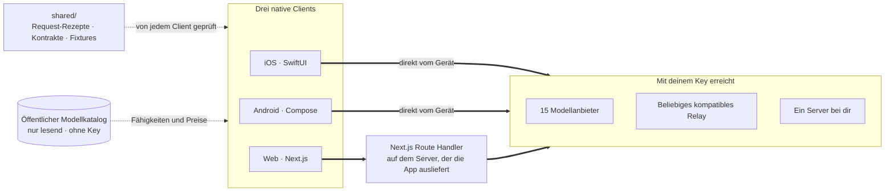

<div align="center">


# Oriveo

**Jedes Modell, eine App.**

Open-Source-KI-Chat mit deinem eigenen Key, für iOS, Android und das Web.
Kein Konto, kein Abo, kein Server von uns zwischen dir und dem Modell.

<a href="../../LICENSE"></a>
<a href="ios.md"></a>
<a href="android.md"></a>
<a href="web.md"></a>


<a href="https://oriveoai.com">Website</a> &nbsp;·&nbsp;
<a href="#loslegen">Loslegen</a> &nbsp;·&nbsp;
<a href="#architektur">Architektur</a> &nbsp;·&nbsp;
<a href="#community-edition-und-oriveo">Editionen</a> &nbsp;·&nbsp;
<a href="#faq">FAQ</a> &nbsp;·&nbsp;
<a href="../../CONTRIBUTING.md">Mitwirken</a>

<sub>

<a href="../../README.md">English</a> ·
<a href="../ar/README.md">العربية</a> ·
**Deutsch** ·
<a href="../es/README.md">Español</a> ·
<a href="../fr/README.md">Français</a> ·
<a href="../hi/README.md">हिन्दी</a> ·
<a href="../id/README.md">Indonesia</a> ·
<a href="../ja/README.md">日本語</a> ·
<a href="../ko/README.md">한국어</a> ·
<a href="../pt-BR/README.md">Português</a> ·
<a href="../ru/README.md">Русский</a> ·
<a href="../th/README.md">ไทย</a> ·
<a href="../tr/README.md">Türkçe</a> ·
<a href="../vi/README.md">Tiếng Việt</a> ·
<a href="../zh-Hans/README.md">简体中文</a> ·
<a href="../zh-Hant/README.md">繁體中文</a>

</sub>

</div>

---

## Was Oriveo ist

Oriveo Community Edition ist ein KI-Chat-Client für iOS, Android und das Web, der mit deinem
eigenen Key arbeitet (BYOK). Du hinterlegst API-Keys, die dir ohnehin schon gehören, und der Client
spricht damit direkt mit dem Anbieter. Es gibt kein Oriveo-Konto, kein Abo und keine Analytics.

Er spricht **15 Modellanbieter** nativ – OpenAI, Anthropic, Google Gemini, OpenRouter, DeepSeek,
Grok, Mistral, Groq, Together AI, Fireworks AI, MiniMax, Z.ai, Qwen, Kimi und SiliconFlow – dazu
**jeden OpenAI-, Anthropic- oder Gemini-kompatiblen Endpunkt**, auf den du ihn zeigen lässt, auch
llama.cpp, Ollama, LM Studio oder vLLM auf deinem eigenen Rechner.

| | |
|---|---|
| **Anbieter** | 15 eingebaut, dazu eigene Relay-Endpunkte und lokale Modellserver |
| **Clients** | iOS (SwiftUI) · Android (Jetpack Compose) · Web (Next.js) |
| **Oberflächensprachen** | 16 |
| **Konto nötig** | Keines |
| **Aufrufe auf eigene Rechnung** | Einer: ein nur lesbarer Modellkatalog, ohne Key und ohne Kennung |
| **Lizenz** | AGPL-3.0-or-later |

## Warum es das gibt

Ein Chat-Client hat nicht zwischen dir und dem Modell zu stehen, für das du bezahlst.

- **Deine Keys, deine Rechnung.** Du zahlst den Listenpreis des Anbieters. Nichts wird
  aufgeschlagen, abgerechnet oder weiterverkauft.
- **Standardmäßig lokal.** Unterhaltungen, Notizen, Ordner, Skills und Anhänge liegen auf dem Gerät.
  Exportiere sie jederzeit in eine Datei; es gibt keine Kopie in der Cloud, deren Zugang du
  verlieren könntest.
- **Ein Verhalten, drei Clients.** Wie ein Request für einen bestimmten Anbieter, einen Transport
  und eine Fähigkeit aussieht, steht einmal in [`shared/`](shared.md), und alle drei Clients prüfen
  gegen dieselben JSON-Fixtures. Eine Anbieter-Eigenheit wird einmal behoben, nicht dreimal.
- **Ehrlich beim einen Aufruf, den er macht.** Die App holt sich einen öffentlichen Modellkatalog,
  damit ein heute veröffentlichtes Modell ohne App-Update funktioniert. Der Aufruf ist nur lesend,
  trägt weder Key noch Kennung, und du kannst ihn auf deinen eigenen Host richten.

## Funktionen

- **Chat** – Streaming, Reasoning-Blöcke, Quellenangaben, Anhänge (Bilder, PDF, Office, EPUB, HTML,
  reiner Text), Auswahl zitieren, Wiederholen, Neu generieren, nach einer abgebrochenen Antwort
  fortsetzen
- **Anbieter** – 15 eingebaut, jeder mit deinem eigenen Key; Endpunkt, Modell und Parameter pro
  Anbieter überschreibbar
- **Relay** – jeder OpenAI-, Anthropic- oder Gemini-kompatible Endpunkt, auch einer in deinem LAN
- **Lokale Modellserver** – llama.cpp, Ollama, LM Studio, vLLM, samt Erkennung im lokalen Netz
- **Anmeldung per Abo** – nutze ein Codex- oder Grok-Abo, das du schon hast, statt eines API-Keys
- **Skills** – wiederverwendbare System-Prompts mit eigenem Modell, eigenen Parametern und eigenen
  Referenzdokumenten
- **Notizen und Ordner** – eine Antwort als Notiz sichern, Unterhaltungen ordnen, Volltextsuche
- **Cross-Check** – dieselbe Frage einem zweiten Modell stellen und beide Antworten nebeneinander
  behalten
- **Kosten** – Ausgaben pro Nachricht und pro Anbieter, auf dem Gerät berechnet aus dem, was jede
  Antwort tatsächlich gemeldet hat, inklusive Cache-Rabattstufen
- **Bildgenerierung** – wo der Anbieter sie unterstützt
- **Backup** – alles in eine Datei exportieren, auf Wunsch mit einem Passwort deiner Wahl
  verschlüsselt
- **16 Oberflächensprachen**, inklusive vollständigem Rechts-nach-links-Layout für Arabisch

## Community Edition und Oriveo

Dieses Repository ist die **Oriveo Community Edition**, lizenziert unter
[AGPL-3.0-or-later](../../LICENSE). Die Apps im App Store, bei Google Play und die gehostete Web-App
sind **Oriveo** – ein separates proprietäres Produkt, gebaut aus denselben Clients, mit einer
Kontoschicht darüber.

| | Community Edition | Oriveo |
|---|---|---|
| Quelltext | Dieses Repository, AGPL-3.0-or-later | Proprietär |
| Chat mit deinen eigenen Anbieter-Keys | Ja | Ja |
| Relay und lokale Modellserver | Ja | Ja |
| Notizen, Ordner, Skills, Anhänge | Ja, unbegrenzt | Ja |
| Kostenerfassung auf dem Gerät | Ja | Ja |
| Konto | Keines | Oriveo-Konto |
| Speicherung | Auf dem Gerät; Export und Wiederherstellung von Hand | Local-first, dazu geräteübergreifende Cloud-Sync |
| Nutzungsauswertung und Budget-Warnungen | – | Ja |
| Modelle, die Oriveo bezahlt | – | Ja |
| Analytics und Crash-Reporting | Keine | Ja |

Builds der Community Edition verwenden das Identifier-Präfix `ai.oriveo.community`, sodass einer
neben einem Store-Build stehen kann, ohne dass sich beide einen Keychain, einen Update-Feed oder
lokale Daten teilen. Was diese Edition annimmt und was nicht, steht in
[COMMUNITY.md](../../COMMUNITY.md).

**Oriveo, das vollständige Produkt:**
[iPhone und iPad](https://apps.apple.com/app/oriveo/id6775370458) &nbsp;·&nbsp;
[Android](https://play.google.com/store/apps/details?id=com.kenny.oriveo) &nbsp;·&nbsp;
[Web](https://app.oriveoai.com) &nbsp;·&nbsp;
[oriveoai.com](https://oriveoai.com)

## Anbieter

Jeden Anbieter unten erreichst du mit einem Key, den du dir selbst anlegst.

| Anbieter | Wo es den Key gibt |
|---|---|
| OpenAI | [platform.openai.com](https://platform.openai.com/api-keys) |
| Anthropic | [console.anthropic.com](https://console.anthropic.com/settings/keys) |
| Google Gemini | [aistudio.google.com](https://aistudio.google.com/apikey) |
| OpenRouter | [openrouter.ai](https://openrouter.ai/keys) |
| DeepSeek | [platform.deepseek.com](https://platform.deepseek.com/api_keys) |
| Grok | [console.x.ai](https://console.x.ai/) |
| Mistral | [console.mistral.ai](https://console.mistral.ai/api-keys) |
| Groq | [console.groq.com](https://console.groq.com/keys) |
| Together AI | [api.together.xyz](https://api.together.xyz/settings/api-keys) |
| Fireworks AI | [fireworks.ai](https://fireworks.ai/api-keys) |
| MiniMax | [platform.minimax.io](https://platform.minimax.io/docs/guides/quickstart-preparation) |
| Z.ai | [open.bigmodel.cn](https://open.bigmodel.cn/usercenter/apikeys) |
| Qwen | [bailian.console.alibabacloud.com](https://bailian.console.alibabacloud.com/?apiKey=1#/api-key) |
| Kimi | [platform.kimi.ai](https://platform.kimi.ai/console/api-keys) |
| SiliconFlow | [cloud.siliconflow.cn](https://cloud.siliconflow.cn/account/ak) |
| **Relay** | Jeder OpenAI-, Anthropic- oder Gemini-kompatible Endpunkt, auch einer auf deinem eigenen Rechner |

## Architektur

Drei native Clients, eine Definition davon, wie man mit einem Modellanbieter spricht.



Jeder Client hat seine eigene UI, seinen eigenen Speicher und seine eigene Navigation und trifft die
gemeinsamen Kontrakte an genau einer Nahtstelle: der Schicht, die *dieses Modell, diese Fähigkeit*
in einen HTTP-Request verwandelt.

Die eine Asymmetrie, die man kennen sollte, ist der Web-Client. Anbieter-APIs senden keine
CORS-Header, ein Browser kann sie also nicht direkt aufrufen; Requests an die 15 offiziellen
Anbieter laufen deshalb über einen Next.js Route Handler auf dem Rechner, der die App ausliefert –
deinem eigenen, wenn du sie lokal betreibst. Der iOS- und der Android-Client haben diese
Einschränkung nicht und gehen direkt zum Anbieter. Relay-Endpunkte in deinem eigenen Netz ruft auch
der Browser direkt auf.

**Die Architektur der einzelnen Clients:**

| | Stack | README |
|---|---|---|
| **iOS** | SwiftUI mit UIKit-Verlauf, GRDB | [ios.md](ios.md) |
| **Android** | Jetpack Compose, Room, Koin, Ktor/OkHttp | [android.md](android.md) |
| **Web** | Next.js App Router, React, Zustand, TypeScript | [web.md](web.md) |
| **Shared** | Kontrakte, aufgezeichnete Fixtures und der Swift-Wire-Kernel | [shared.md](shared.md) |

## Loslegen

<details open>
<summary><b>Web</b> – der schnellste Weg, es auszuprobieren</summary>

<br>

Braucht Node 22 (siehe [`web/.nvmrc`](../../web/.nvmrc)).

```bash
cd web
npm install
npm run dev:app        # http://localhost:3001
```

Der erste Bildschirm fragt nach einem Anbieter-API-Key. Mehr ist nicht nötig.
Weitere Befehle und Konfiguration: [web.md](web.md).

</details>

<details>
<summary><b>iOS</b> – auf deinem eigenen iPhone bauen und starten</summary>

<br>

Braucht einen Mac mit Xcode 26 und ein Gerät mit iOS 18 oder neuer. Ein kostenloser
Apple-Developer-Account genügt – die App nutzt keine kostenpflichtigen Capabilities.

1. Öffne `ios/Oriveo/Oriveo.xcodeproj`
2. Wähle das Schema `Oriveo`
3. Wähle unter Signing &amp; Capabilities dein eigenes Team
4. Starte

Die vollständige Anleitung, auch für den Fall, dass Xcode das Projekt nicht öffnen will:
[ios.md](ios.md).

</details>

<details>
<summary><b>Android</b> – das APK bauen</summary>

<br>

Braucht JDK 17 oder neuer und das Android SDK. Der Build nutzt AGP 9.3, Gradle 9.5 und Kotlin 2.3,
Android Studio muss also eine Version sein, die das synchronisieren kann; auf der Kommandozeile
reichen JDK und SDK.

```bash
cd android
./gradlew :app:assembleDebug
```

Den Modellkatalog von deinem eigenen Host ausliefern: [android.md](android.md).

</details>

## Datenschutz

- **Anbieter-Keys** werden von der jeweiligen Plattform verwahrt – iOS Keychain, Android Keystore
  (`EncryptedSharedPreferences`) oder IndexedDB des Browsers – und nur benutzt, um den Anbieter zu
  erreichen, zu dem sie gehören. Im Web liegen sie unverschlüsselt, so wie bei Browser-BYOK-Clients
  allgemein üblich; für die stärkste Garantie nimm den iOS- oder Android-Client.
- **Unterhaltungen, Notizen, Ordner, Skills und Anhänge** liegen auf dem Gerät. Nichts wird
  irgendwohin hochgeladen.
- **Kein Konto, keine Analytics, kein Crash-Reporting.** Es gibt nichts, wo man sich anmelden
  müsste, und nichts, was nach Hause funkt.
- **Auf iOS und Android gehen Chat-Requests direkt vom Gerät zum Anbieter.** Im Web laufen sie über
  den Next.js-Server, der die App ausliefert, weil Anbieter-APIs direkte Browser-Aufrufe nicht
  zulassen; dieser Server speichert weder Keys noch Nachrichten, und wenn du die App lokal
  betreibst, ist er dein eigener Rechner.
- **Ein einziger Request auf eigene Rechnung:** ein nur lesbarer Modellkatalog, abgerufen ohne Key,
  ohne Unterhaltung und ohne Kennung, damit ein heute veröffentlichtes Modell ohne neuen Build
  funktioniert. Richte ihn auf deinen eigenen Host, wenn du ihn lieber selbst ausliefern willst.

## FAQ

<details>
<summary><b>Was heißt BYOK?</b></summary>

<br>

Bring your own key – bring deinen eigenen Key mit. Du legst in der Konsole eines Anbieters einen
API-Key an – OpenAI, Anthropic, Google und so weiter – und fügst ihn in Oriveo ein. Die Requests
rechnet dieser Anbieter zu seinem Listenpreis ab. Oriveo ist der Client; es ist kein Wiederverkäufer
und behält nichts ein.

</details>

<details>
<summary><b>Laufen meine Unterhaltungen über einen Oriveo-Server?</b></summary>

<br>

Nein. Auf iOS und Android ruft der Client den Anbieter-Endpunkt direkt auf. Im Web geht der Request
über den Next.js-Server, der die App ausliefert – dein eigener Rechner, wenn du sie lokal betreibst,
weil Browser Anbieter-APIs nicht direkt aufrufen können. An keinem der beiden Wege ist ein von
Oriveo betriebener Server beteiligt. Der einzige Request, den Oriveo auf eigene Rechnung stellt, ist
ein nur lesender Abruf des öffentlichen Modellkatalogs, der weder Key noch Unterhaltung noch Kennung
mitträgt.

</details>

<details>
<summary><b>Kann ich ein Modell nutzen, das auf meinem eigenen Rechner läuft?</b></summary>

<br>

Ja. Lege eine Relay-Verbindung an, die auf einen beliebigen OpenAI-, Anthropic- oder
Gemini-kompatiblen Server zeigt – llama.cpp, Ollama, LM Studio, vLLM oder was sonst eines dieser
Protokolle spricht. Der Android- und der Web-Client können einen solchen Server auch im lokalen Netz
finden. Lokales HTTP benutzt keine Zugangsdaten und verlässt dein Netz nie.

</details>

<details>
<summary><b>Worin unterscheidet sich das von der App im App Store?</b></summary>

<br>

Die Store-Apps sind Oriveo, ein proprietäres Produkt, das ein Konto, geräteübergreifende
Cloud-Synchronisierung, Nutzungsauswertung und von Oriveo bezahlte Modelle hinzufügt. Die Community
Edition sind dieselben drei Clients ohne all das: kein Konto, kein Sync-Dienst, keine Abrechnung,
keine Analytics. Der vollständige Vergleich steht unter
[Community Edition und Oriveo](#community-edition-und-oriveo).

</details>

<details>
<summary><b>Gibt es einen macOS-Client?</b></summary>

<br>

In diesem Repository nicht. Bis dahin macht sich der Web-Client in jedem Browser gut als
Desktop-App, und der iOS-Build läuft auf Macs mit Apple Silicon.

</details>

<details>
<summary><b>In welchen Sprachen gibt es die Oberfläche?</b></summary>

<br>

In sechzehn: Arabisch, Deutsch, Englisch, Spanisch, Französisch, Hindi, Indonesisch, Japanisch,
Koreanisch, brasilianisches Portugiesisch, Russisch, Thai, Türkisch, Vietnamesisch, vereinfachtes
Chinesisch und traditionelles Chinesisch. Arabisch bekommt ein vollständiges
Rechts-nach-links-Layout.

</details>

## Aufbau des Repositorys

```
ios/       iOS client (SwiftUI)
android/   Android client (Jetpack Compose)
web/       Web client (Next.js)
macos/     Reserved for a macOS client
shared/    Cross-client contracts, recorded fixtures, and the Swift wire kernel
```

## Mitwirken

Fehlermeldungen und Pull Requests sind willkommen. [CONTRIBUTING.md](../../CONTRIBUTING.md)
beschreibt, wie man jeden Client baut und wie ein guter Pull Request aussieht;
[COMMUNITY.md](../../COMMUNITY.md) beschreibt, wofür diese Edition da ist und welche wenigen Arten
von Änderung nicht angenommen werden, egal wie gut sie geschrieben sind.

Ein Sicherheitsproblem gefunden? Bitte mach dafür kein öffentliches Issue auf –
[SECURITY.md](../../SECURITY.md) erklärt, wie du es privat meldest und was dieses Projekt als
Schwachstelle behandelt und was nicht. Von allen Beteiligten wird erwartet, dass sie sich an den
[Verhaltenskodex](../../CODE_OF_CONDUCT.md) halten.

## Lizenz

[AGPL-3.0-or-later](../../LICENSE). Beiträge werden unter derselben Lizenz angenommen.
