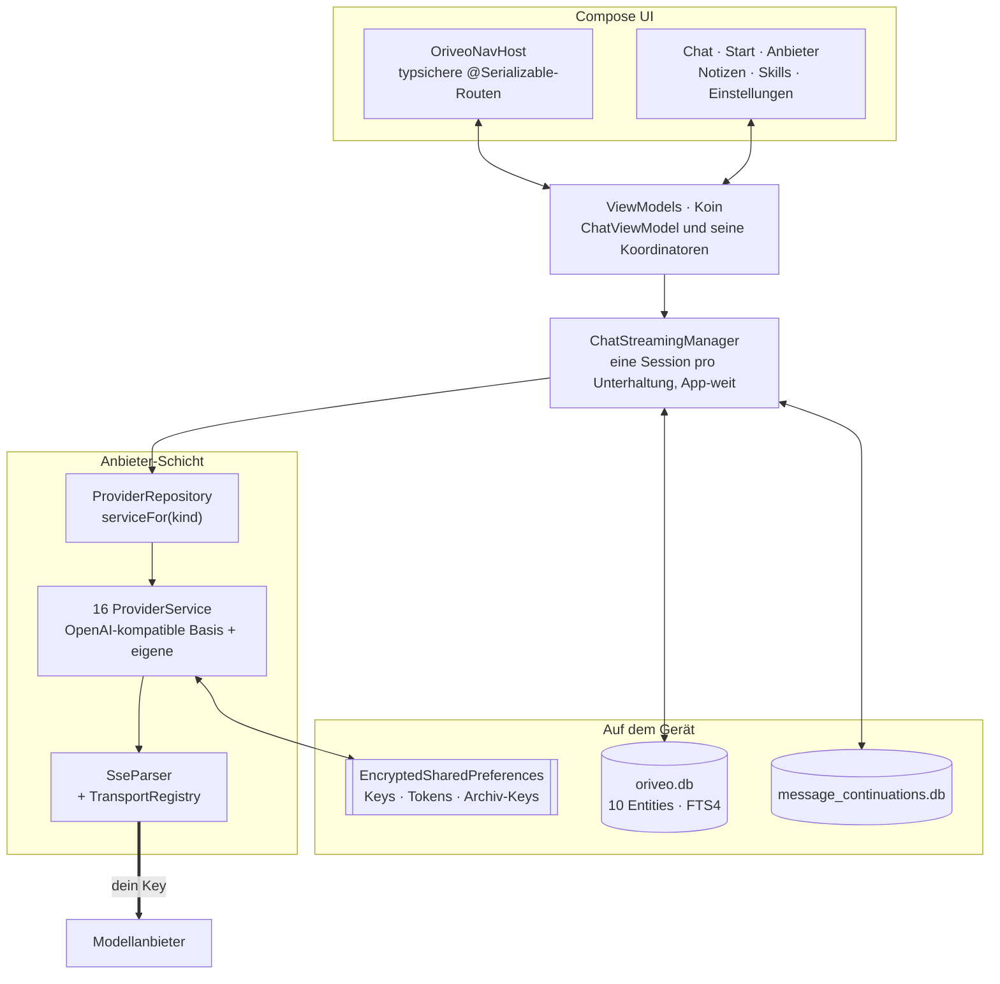

<div align="center">

# Oriveo für Android

**Ein nativer Jetpack-Compose-Chat-Client für die KI-Modelle, für die du ohnehin schon zahlst.**

<a href="../../LICENSE"></a>


<sub>

<a href="../../android/README.md">English</a> ·
<a href="../ar/android.md">العربية</a> ·
**Deutsch** ·
<a href="../es/android.md">Español</a> ·
<a href="../fr/android.md">Français</a> ·
<a href="../hi/android.md">हिन्दी</a> ·
<a href="../id/android.md">Indonesia</a> ·
<a href="../ja/android.md">日本語</a> ·
<a href="../ko/android.md">한국어</a> ·
<a href="../pt-BR/android.md">Português</a> ·
<a href="../ru/android.md">Русский</a> ·
<a href="../th/android.md">ไทย</a> ·
<a href="../tr/android.md">Türkçe</a> ·
<a href="../vi/android.md">Tiếng Việt</a> ·
<a href="../zh-Hans/android.md">简体中文</a> ·
<a href="../zh-Hant/android.md">繁體中文</a>

</sub>

</div>

---

Der Oriveo-Android-Client ist eine KI-Chat-App, die mit deinem eigenen Key arbeitet. Du hinterlegst
API-Keys, die dir schon gehören, und die App spricht mit jedem Anbieter direkt vom Telefon aus.
Unterhaltungen, Notizen, Ordner und Skills liegen in Room auf dem Gerät; API-Keys werden mit einem
Schlüssel verschlüsselt, der im Android Keystore liegt. Es gibt kein Konto und keine Anmeldung.

Er ist Teil der [Oriveo Community Edition](README.md) – drei Clients, die sich eine Definition
davon teilen, wie man mit einem Modellanbieter spricht.

## Architektur



Drei Dinge in diesem Diagramm sind bewusste Designentscheidungen, keine zufällige Struktur.

**Streaming lebt oberhalb des Bildschirms.** `ChatStreamingManager` hält pro Unterhaltungs-ID eine
`StreamingSession` in einer `ConcurrentHashMap`, jede mit ihrem eigenen, an die Anwendung gebundenen
`CoroutineScope(SupervisorJob() + Dispatchers.IO)`. Wenn du aus einem Chat herausnavigierst, bricht
die Antwort nicht ab, und `StreamingTokenBuffer` schreibt Teiltext regelmäßig nach SQLite – die App
mitten in einer Antwort zu beenden verliert also nicht, was schon angekommen ist.

**Zwei Datenbanken, nicht eine.** `oriveo.db` hält Unterhaltungen, Nachrichten, Anhänge, Notizen,
Ordner, Skills und den Cache des Modellkatalogs. `message_continuations.db` ist eine physisch
getrennte Datei mit undurchsichtigem Continuation-State des Anbieters, und zwar genau deshalb, damit
`backup_rules.xml` und `data_extraction_rules.xml` sie vom Cloud-Backup und von der Geräteübernahme
ausschließen können – ein Continuation-Token, das auf einem anderen Gerät wiederhergestellt wird,
ist bestenfalls bedeutungslos.

**Ein Katalog, der neuer ist als das Binary, degradiert – er bricht nicht.** `TransportKind` ist ein
geschlossenes Enum mit nachsichtigem Deserializer: ein unbekannter Transport-String wird zu `null`,
`TransportRegistry` liefert keine Strategie, und das Modell fällt aus der Auswahl heraus. Die
Alternative – ein striktes Enum – würde das Parsen des gesamten Katalogs scheitern lassen und jedes
andere Modell mit sich reißen.

## Was ein Modell darf

Der Client rät die Fähigkeiten eines Modells nie aus seinem Namen. Er liest eine Capability Runtime
aus dem Katalog: Rezepte, die für einen bestimmten Anbieter, Transport und eine Fähigkeit genau
beschreiben, welche JSON-Pointer in den Request geschrieben werden.
`ProviderRecipeRequestCompiler` prüft das Rezept gegen Anbieter, Fähigkeit und Transport, bevor er
es zu einem eigenen Body-Delta kompiliert, und lehnt mit einem benannten Grund ab
(`recipe_not_found`, `transport_mismatch`, `model_route_must_not_patch_body`), statt stillschweigend
einen Request zu erzeugen, den niemand geprüft hat.

Auf dem Rückweg ordnet `CapabilityEvidenceFacade` nach Quelle, was über eine Fähigkeit tatsächlich
bekannt ist – `operator_override` > `server_typed` > `server_profile` > `model_facts` >
`relay_verification` > `relay_declaration` > `legacy_metadata`. Nur der Stream-Parser darf eine
Fähigkeit als *observed* markieren; Absicht, Rezepte, ein HTTP 200 und eine Tool-Deklaration zählen
ausdrücklich nicht. Das Ergebnis wird pro Nachricht gespeichert, damit die UI *angefragt* von
*bestätigt* unterscheiden kann.

Overrides werden nach Last-Write-Wins über sieben Geltungsbereiche aufgelöst, in dieser Reihenfolge:
`single_send` > `conversation_connection_model` > `skill_agent` > `connection_model` > `connection` >
`provider_recipe` > `provider_default`.

## Speicherung und Geheimnisse

| Was | Wo |
|---|---|
| Unterhaltungen, Nachrichten, Anhänge, Notizen, Ordner, Skills | Room, `oriveo.db` |
| Volltextsuche über Notizen | virtuelle FTS4-Tabelle |
| Cache des Modellkatalogs | eine einzelne Zeile in `oriveo.db`, in Blöcken zurückgelesen |
| Continuation-State des Anbieters | `message_continuations.db`, vom Backup ausgeschlossen |
| Anbieter-API-Keys | `EncryptedSharedPreferences`, AES-256-GCM, Master-Key im Keystore |
| OAuth-Tokens von Abos | eine zweite, separate verschlüsselte Preferences-Datei |
| Schlüssel für Backup-Archive | eine dritte |
| Anhang-Blobs | Dateien auf der Platte, über die id referenziert |

Die drei verschlüsselten Preferences-Dateien sind nach Lebensdauer und Schadensradius getrennt und
nicht der Bequemlichkeit halber zusammengelegt. Jede hat einen Wiederherstellungspfad: eine
beschädigte Datei (`AEADBadTagException`, `VERIFICATION_FAILED`) wird erkannt, gelöscht und neu
angelegt, statt die App bei jedem Start abstürzen zu lassen.

Alle drei und die Continuation-Datenbank sind vom Android-Cloud-Backup und von der Geräteübernahme
ausgeschlossen. Das ist eine Folge daraus, sie an den Keystore zu binden, kein Versehen – der
Ciphertext wäre auf dem neuen Gerät ohnehin nicht entschlüsselbar. **Nach dem Umzug auf ein neues
Telefon trägst du deine API-Keys erneut ein und meldest dich bei Anbieter-Abos neu an**;
Unterhaltungen und Notizen kommen normal mit.

Backup-Archive, die du selbst exportierst, werden separat verschlüsselt, mit PBKDF2-HMAC-SHA256 bei
600.000 Iterationen und AES-GCM, mit einem Passwort deiner Wahl.

## Einen Modellserver im eigenen Netz erreichen

Das Manifest setzt `android:usesCleartextTraffic="true"`, und zwar bewusst: lokale Modellserver –
llama.cpp, Ollama, LM Studio, vLLM – sprechen einfaches HTTP auf deinem eigenen Rechner oder im LAN
und haben in der Regel kein Zertifikat.

Die eigentliche Grenze liegt im Code, nicht im Manifest, weil sie dort liegen muss.
`RelayEndpointPolicy` löst den Host auf, verlangt, dass **jede** aufgelöste Adresse privat ist
(Loopback, RFC 1918, Link-Local, Unique-Local und im VPN-Modus der CGNAT-Bereich), weist einen Host
ab, der zu einer Mischung aus öffentlichen und privaten Adressen auflöst, fixiert die aufgelöste
Adressmenge gegen DNS-Rebinding und prüft sie beim Senden erneut, verweigert jeden
Klartext-Request, der Anmeldematerial trägt, und blockiert Weiterleitungen über Origin- oder
Schema-Grenzen hinweg.

Eine Android Network Security Config kann diese Menge nicht ausdrücken: sie greift nur auf
Hostnamen, hat keine Syntax für Adressbereiche, und die Adressen hier stammen zur Laufzeit aus dem
Netz des Nutzers. Eine Config wäre außerdem strikt schwächer, weil sie nie sieht, zu welcher Adresse
ein Name aufgelöst wurde.

## Der Modellkatalog

Die App liest Modellfähigkeiten und Preise aus einem öffentlichen Katalog, damit ein heute
veröffentlichtes Modell ohne App-Update funktioniert. Es ist ein schlichtes HTTPS-`GET` ohne
Zugangsdaten und ohne Kennung, und Chat-Requests kommen ihm nie nahe. Nur zwei Endpunkte werden
abgerufen:

```
GET {base}/api/metadata?view=lean
GET {base}/api/metadata/model-facts
```

Die Basis-URL ist eine Build-Property mit `https://api.oriveoai.com` als Standard:

```bash
./gradlew :app:assembleDebug -PORIVEO_METADATA_BASE_URL=https://your.host
```

Antworten werden per ETag revalidiert und in `oriveo.db` zwischengespeichert; sobald ein Abruf
einmal geklappt hat, arbeitet die App aus der Kopie weiter, wenn der Katalog später nicht erreichbar
ist.

> [!IMPORTANT]
> Ein Build mit leerem Wert (`-PORIVEO_METADATA_BASE_URL=`) schaltet das Laden des Katalogs komplett
> ab, und **im APK ist kein Snapshot enthalten**. Bei einer Neuinstallation eines solchen Builds:
>
> - bekommt keiner der 15 eingebauten Anbieter eine Modellliste, und die App fragt den Anbieter auch
>   nicht danach – der Katalog ist die einzige Quelle;
> - der Fehlschlag ist **stumm**. Einen Key hinzuzufügen meldet weiter Erfolg, und die Modellauswahl
>   ist einfach leer, ohne Erklärung;
> - **OpenAI wird unbrauchbar**, weil das manuelle Eintragen von Modellen für diesen Anbieter
>   gesperrt ist;
> - Relay-Endpunkte und lokale Modellserver funktionieren weiterhin vollständig und sind der einzige
>   intakte Weg.
>
> Willst du einen Offline-Build, liefere den Katalog selbst aus und richte den Build darauf, statt
> den Wert zu leeren.

## Projektaufbau

```
android/
  app/src/main/java/ai/oriveo/community/
    core/
      provider/    every provider service, transports, relay, capability recipes
      data/        Room entities, DAOs, repositories, backup, catalog client
      model/       domain models and the capability/preference resolvers
      attachments/ routing, budgets, per-format text extraction
      security/    SecureKeyStore, BackupCrypto, external-URL policy
      streaming/   ChatStreamingManager
      navigation/  AppRoute, OriveoNavHost
    feature/       one package per screen
    ui/            shared components, Markdown + LaTeX renderer, theme
    di/            Koin modules
  benchmark/       macrobenchmark suite (cold start, model picker)
```

## Bauen

Voraussetzungen: **JDK 17 oder neuer** und das Android SDK. Der Build nutzt AGP 9.3, Gradle 9.5 und
Kotlin 2.3, Android Studio muss also eine Version sein, die AGP 9.3 synchronisieren kann; auf der
Kommandozeile reichen JDK und SDK.

```bash
./gradlew :app:assembleDebug
./gradlew :app:testDebugUnitTest
```

Der Build zielt auf `minSdk 26`, `targetSdk 36`, `compileSdk 37`. `local.properties` (dein SDK-Pfad)
erzeugt Android Studio, und die Datei wird nicht eingecheckt. Das Signieren von Releases beschreibt
[SIGNING.md](../../android/SIGNING.md).

> [!NOTE]
> Der Gradle-Daemon läuft auf einer Java-21-Toolchain (`gradle/gradle-daemon-jvm.properties`), und
> der Abgleich erfolgt auf genau 21, nicht auf „21 oder neuer“. Mit irgendeinem anderen
> installierten JDK lädt Gradle sich beim ersten Build selbst ein JDK 21 herunter, wofür es
> Netzzugang braucht; installierst du JDK 21 selbst, entfällt das. Hast du
> `org.gradle.java.installations.auto-download=false` gesetzt, kann dieser Download nicht
> stattfinden und der Build scheitert mit `Toolchain auto-provisioning is not enabled.` – das ist der
> eine Fall, in dem JDK 17 allein wirklich nicht reicht. Kompiliert wird so oder so gegen Java 17.

Die Parallelität der Unit-Tests wird aus CPU-Anzahl und physischem Speicher der Maschine abgeleitet
statt fest verdrahtet, damit sich die Suite auf einem Laptop genauso benimmt wie auf einer großen
Workstation.

## Abhängigkeiten

| Bibliothek | Version | Wofür |
|---|---|---|
| Jetpack Compose BOM | 2026.08.00 | UI, Material 3 |
| Room | 2.8.4 | SQLite, DAOs, FTS4 |
| Koin | 4.2.2 | Dependency Injection |
| Ktor client (OkHttp engine) | 3.5.2 | HTTP und SSE zum Anbieter |
| kotlinx.serialization | 1.11.0 | JSON |
| navigation-compose | 2.9.6 | typsichere Routen |
| androidx.security-crypto | 1.1.0 | `EncryptedSharedPreferences` |
| haze | 1.7.3 | Hintergrund-Blur |
| PDFBox-Android, jsoup | 2.0.27.0, 1.23.2 | Textextraktion aus Anhängen |
| jlatexmath-android | 0.2.0 | LaTeX-Rendering |

Die genauen Versionen sind in [`gradle/libs.versions.toml`](../../android/gradle/libs.versions.toml)
festgenagelt.

## Tests

```bash
./gradlew :app:testDebugUnitTest
```

Rund 3.000 Unit-Tests über 319 Dateien, mit JUnit 4, MockK, Turbine, `kotlinx-coroutines-test` und
Ktors Mock-Engine. Die Abdeckung ist dort am dichtesten, wo Fehler am teuersten sind: Request-Form
pro Anbieter, SSE-Parsing, Transportauswahl, Relay-Probing und Sicherheitsmodi, Ausführung von
Capability-Rezepten, Katalog-Caching und Umgang mit Kontraktversionen, Room-Persistenz und
Backup-Rundläufe.

> [!IMPORTANT]
> Rund 38 Suites laden Kontrakt-Fixtures aus `shared/`, indem sie vom Arbeitsverzeichnis aus nach
> oben laufen, **die Tests laufen also nur in einem vollständigen Checkout durch** – `android/`
> allein herauszukopieren funktioniert nicht.

Dazu kommen drei instrumentierte Tests – eine Release-Matrix für lokale Engines, ein
Cleartext-Socket-Test und ein Test zur Keystore-Isolation. Sie sind nicht in sich abgeschlossen: die
Local-Engine-Tests brauchen Instrumentierungsargumente, die einen echten laufenden Modellserver in
deinem Netz benennen, `connectedAndroidTest` läuft also nicht out of the box durch. Das Tor für
einen Pull Request ist die Unit-Suite.

Das Modul `:benchmark` enthält Macrobenchmarks für Kaltstart und Modellauswahl. Es ist ein eigenes
Gradle-Modul mit `com.android.test` und Selbstinstrumentierung und treibt einen eigenen
`benchmark`-Build-Type von `:app`.

Beide Datenbanken stehen auf `version = 1` und haben noch keine Migrationen; die Schemata werden nach
`app/schemas/` exportiert und eingecheckt, und dort landet auch die `2.json` der ersten Migration.

## Lokalisierung

Sechzehn Sprachen: `values/` (Englisch, die Quelle) plus fünfzehn `values-*`-Verzeichnisse, je rund
1.700 Strings, wobei jede Locale denselben Schlüsselsatz hält. Der Sprachwechsel in der App läuft
über `AppLanguageManager` und `android:localeConfig`. Language-Splits sind im Bundle deaktiviert,
sodass ein einziges Artefakt alle Übersetzungen trägt.

## Mitwirken

Siehe [CONTRIBUTING.md](../../CONTRIBUTING.md). Die Arbeitssprache des Projekts ist Englisch:
Quelltext, Kommentare, Tests und Commit-Messages. UI-Strings werden übersetzt – füge einen neuen
String zuerst in `values/` ein und überlass den anderen Locales, nachzuziehen. Lass die Unit-Tests
laufen, bevor du einen Pull Request aufmachst.

## Lizenz

[AGPL-3.0-or-later](../../LICENSE).
