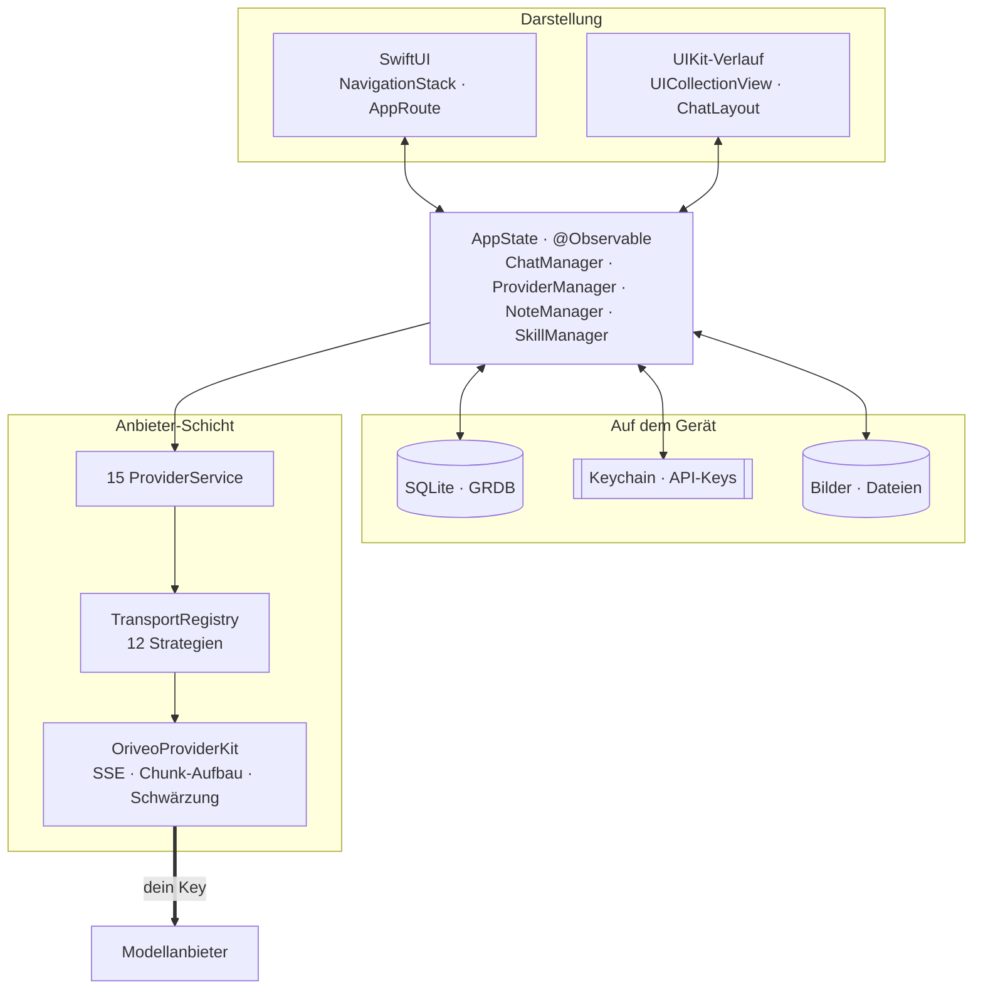
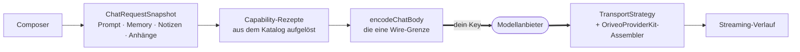

<div align="center">

# Oriveo für iOS

**Ein nativer SwiftUI-Chat-Client für die KI-Modelle, für die du ohnehin schon zahlst.**

<a href="../../LICENSE"></a>


<sub>

<a href="../../ios/README.md">English</a> ·
<a href="../ar/ios.md">العربية</a> ·
**Deutsch** ·
<a href="../es/ios.md">Español</a> ·
<a href="../fr/ios.md">Français</a> ·
<a href="../hi/ios.md">हिन्दी</a> ·
<a href="../id/ios.md">Indonesia</a> ·
<a href="../ja/ios.md">日本語</a> ·
<a href="../ko/ios.md">한국어</a> ·
<a href="../pt-BR/ios.md">Português</a> ·
<a href="../ru/ios.md">Русский</a> ·
<a href="../th/ios.md">ไทย</a> ·
<a href="../tr/ios.md">Türkçe</a> ·
<a href="../vi/ios.md">Tiếng Việt</a> ·
<a href="../zh-Hans/ios.md">简体中文</a> ·
<a href="../zh-Hant/ios.md">繁體中文</a>

</sub>

</div>

---

Der Oriveo-iOS-Client ist eine KI-Chat-App, die mit deinem eigenen Key arbeitet. Du hinterlegst
API-Keys, die dir schon gehören, und die App ruft jeden Anbieter direkt vom Telefon aus auf.
Unterhaltungen, Notizen, Ordner, Skills und Anhänge liegen in SQLite auf dem Gerät; API-Keys gehen
in die iOS Keychain. Es gibt kein Konto und keine Anmeldung.

Er ist Teil der [Oriveo Community Edition](README.md) – drei Clients, die sich eine Definition
davon teilen, wie man mit einem Modellanbieter spricht.

## Architektur



Drei Dinge an diesem Diagramm gehören klar gesagt.

**Der Verlauf ist UIKit, alles andere ist SwiftUI.** `ChatView` bettet ein
`ChatListViewControllerRepresentable` um eine `UICollectionView` ein, angetrieben von
[ChatLayout](https://github.com/ekazaev/ChatLayout). Alles andere – Navigation, Einstellungen,
Anbieter-Einrichtung, Notizen, Skills – ist SwiftUI. Die Trennung gibt es, weil ein Verlauf, der im
Token-Takt streamt, Kontrolle über Vermessung und Wiederverwendung auf Zellebene braucht, die
SwiftUIs Diffing nicht hergibt.
[`Features/Chat/ARCHITECTURE.md`](../../ios/Oriveo/Oriveo/Features/Chat/ARCHITECTURE.md)
dokumentiert die Grenze.

**Drei getrennte Pfade aktualisieren diesen Verlauf**, und das mit Absicht:

| Pfad | Trägt | Warum |
|---|---|---|
| `@Observable AppState` | strukturelle Änderungen – eine Nachricht erscheint, eine Unterhaltung wechselt | SwiftUI-nativ, günstig bei seltenen Ereignissen |
| GRDB `ValueObservation` | dauerhafter Zustand, aus SQLite zurückgelesen | eine Quelle der Wahrheit nach einem Schreibvorgang, übersteht einen Neustart |
| Combine `PassthroughSubject` pro Unterhaltung | Text- und Reasoning-Deltas im Stream | umgeht SwiftUIs Diffing im Token-Takt komplett |

**Anbieter-Unterstützung besteht aus vier unabhängigen Achsen, nicht aus einem Enum.**
`ProviderKind` (16 Fälle) ist *wen der Nutzer eingerichtet hat*. `ProviderServiceProtocol` ist *die
Aufruffläche*. `TransportKind` (12 Fälle) ist *welches Wire-Protokoll tatsächlich gesprochen wird* –
und das wird **pro Modell aus dem Katalog** aufgelöst, zwei Modelle hinter demselben Key können sich
also unterscheiden. `RelayKind` deckt selbst hinterlegte Endpunkte ab. Genau diese Trennung sorgt
dafür, dass ein neues Modell ohne neuen Build funktioniert.

### Wie eine Nachricht verschickt wird



`BaseAPIService.encodeChatBody` ist der einzige Punkt, an dem ein Request-Body zu Bytes wird. Jedes
Capability-Rezept, jeder Generierungsparameter und jedes eigene Feld muss da hindurch, und genau das
macht das Wire-Format an einer Stelle testbar statt an fünfzehn.

## Was ein Modell darf

Der Client rät die Fähigkeiten eines Modells nie aus seinem Namen. Er liest eine **Capability
Runtime** – eine Menge Rezepte, die für einen bestimmten Anbieter, Transport und eine Fähigkeit
genau beschreiben, welche JSON-Pointer in den Request geschrieben werden. Diese Rezepte liegen in
[`shared/capabilityrecipe`](shared.md) und werden von `CapabilityRecipeRequestCompiler` angewendet.

Auf dem Rückweg hält `CapabilityExecutionRuntime` fest, was tatsächlich passiert ist. Nur ein
ausgewählter produktiver Stream-Parser darf eine Fähigkeit auf *observed* heben. Ein HTTP 200, eine
nicht leere Antwort und eine Tool-Deklaration im Request sind ausdrücklich **kein** Beleg. Der
Endzustand wird pro Nachricht gespeichert, damit die UI dir sagen kann, dass eine Steuerung
angefragt, aber nie bestätigt wurde, statt stillschweigend zu suggerieren, sie habe funktioniert.

## Speicherung

```
Application Support/Oriveo/
  active-uid                     # storage partition, "guest" by default
  users/<uid>/
    oriveo.sqlite                # conversations, messages, notes, catalog cache
    Images/  Files/              # attachment blobs, referenced by id
    session-snapshot.json        # preferences, provider list (never API keys)
```

- **SQLite über GRDB** mit WAL, aktivierten Fremdschlüsseln und einem `DatabaseMigrator`, der jede
  Schema-Änderung abdeckt. Die Volltextsuche über Nachrichten und Notizen nutzt FTS5 mit einem
  Trigramm-Tokenizer.
- **API-Keys liegen in der Keychain**, geschlüsselt nach Anbieter und Partition, und werden aus dem
  Session-Snapshot geleert, bevor er geschrieben wird.
- **Anhang-Blobs sind Dateien auf der Platte**, keine Zeilen, damit ein großes PDF die Datenbank nie
  aufbläht.

## Der eine Netzwerkaufruf, den die App für sich selbst macht

Beim Kaltstart setzt die App zwei nicht authentifizierte, ETag-konditionale `GET`-Requests an
`https://api.oriveoai.com` ab – `/api/metadata?view=lean` und `/api/metadata/model-facts`. Sie holen
den öffentlichen Modellkatalog: welche Modelle es gibt, was jedes davon unterstützt, wie seine
Reasoning-Steuerungen heißen und was es kostet. Weder Key noch Unterhaltung noch Kennung hängen
daran, und die Antwort wird in SQLite zwischengespeichert, sodass die App aus der Kopie
weiterarbeitet, wenn der Katalog nicht erreichbar ist.

Das ist der einzige Request, den die App auf eigene Rechnung stellt. Alles andere geht an einen
Anbieter, den du eingerichtet hast, mit deinem Key.

## Projektaufbau

```
ios/Oriveo/
  Oriveo.xcodeproj/
  Oriveo/
    Core/
      Providers/       15 provider services, transports, capability runtime, catalog client
      State/           AppState and the managers it owns
      Database/        GRDB pool, schema, migrator, stores, observations
      Models/          domain types
      Attachments/     import limits, budgets, per-format text extraction
      Tools/           tool-call loop and per-protocol adapters
    Features/
      Chat/            transcript, composer, model controls, export
      Providers/       setup, detail, relay, local engines, subscription sign-in
      Home/ Notes/ Skills/ Settings/ Backup/ Onboarding/
    Shared/Components/ shared views
    DesignSystem/      theme, colour, haptics
  OriveoTests/
```

## Bauen und starten

Du brauchst einen Mac mit **Xcode 26** und ein Gerät mit **iOS 18 oder neuer**. Ein kostenloser
Apple-Developer-Account genügt; die App nutzt keine kostenpflichtigen Capabilities und liefert eine
leere Entitlements-Datei aus.

1. Öffne `ios/Oriveo/Oriveo.xcodeproj`
2. Wähle das Schema `Oriveo`
3. Wähle unter **Signing & Capabilities** dein eigenes Team
4. Kann Xcode `ai.oriveo.community` nicht registrieren, ändere den Bundle Identifier auf einen, der
   deinem Team gehört
5. Schließe dein iPhone an, aktiviere den Entwicklermodus, vertraue dem Rechner und starte

Für den Simulator wählst du stattdessen einen beliebigen iPhone-Simulator und startest.
Paketabhängigkeiten werden aus der eingecheckten `Package.resolved` aufgelöst.

Die Projektdatei nutzt `objectVersion = 77` mit dateisystemsynchronisierten Gruppen, ein älteres
Xcode kann sich also weigern, sie zu öffnen. Aktualisiere Xcode, statt am Projektformat zu
schrauben.

> [!NOTE]
> Das App-Target kompiliert im Swift-5-Sprachmodus mit `SWIFT_APPROACHABLE_CONCURRENCY` und
> `SWIFT_DEFAULT_ACTOR_ISOLATION = MainActor`. Das lokale Paket `OriveoProviderKit` deklariert
> `swift-tools-version: 6.1` und baut im Swift-6-Sprachmodus.

## Abhängigkeiten

| Paket | Version | Wofür |
|---|---|---|
| [GRDB.swift](https://github.com/groue/GRDB.swift) | 7.11.1 | SQLite-Zugriff, Migrationen, `ValueObservation` |
| [ChatLayout](https://github.com/ekazaev/ChatLayout) | 2.4.3 | das Collection-View-Layout des Verlaufs |
| [swift-markdown-ui](https://github.com/gonzalezreal/swift-markdown-ui) | 2.4.1 | Markdown-Rendering |
| [SwiftMath](https://github.com/mgriebling/SwiftMath) | 1.7.3 | LaTeX-Rendering |
| [ZIPFoundation](https://github.com/weichsel/ZIPFoundation) | 0.9.20 | Backup-Archive, Office-/EPUB-/ODF-Extraktion |
| `OriveoProviderKit` | lokal | der Provider-Wire-Kernel, geteilt mit macOS |

## Tests

Starte das Schema `OriveoTests` aus Xcode heraus, oder aus dem Wurzelverzeichnis des Repositorys:

```bash
xcodebuild test -project ios/Oriveo/Oriveo.xcodeproj -scheme Oriveo \
  -destination 'platform=iOS Simulator,name=iPhone 17'
```

Setz einen Simulator ein, den du tatsächlich hast – `xcrun simctl list devices available` listet sie
auf.

> [!IMPORTANT]
> Das Test-Target liest Kontrakt-Fixtures aus `shared/`, indem es von `#filePath` aus nach oben
> läuft, bis es dieses Verzeichnis findet. Rund 29 Suites hängen daran, **die Tests laufen also nur
> in einem vollständigen Checkout durch** – `ios/` allein herauszukopieren funktioniert nicht.

Die Suite ist groß: rund 2.900 Tests über 273 Dateien, überwiegend [Swift
Testing](https://github.com/swiftlang/swift-testing). Sie deckt die Request-Form pro Anbieter,
aufgezeichnetes Upstream-SSE-Replay, Relay- und Local-Engine-Policy, Vermessung und
Streaming-Verhalten des Verlaufs, Speicherung und Backup-Rundläufe ab.

`shared/OriveoProviderKit` hat eine eigene Suite:

```bash
cd shared/OriveoProviderKit && swift test
```

## Lokalisierung

Sechzehn Sprachen, abgelegt als Xcode String Catalogs (`.xcstrings`) – zehn Kataloge, rund 1.900
Keys, Englisch als Quelle. Strings werden über `L10n.tr(_:table:)` gegen ein `.lproj`-Bundle
aufgelöst, das aus der In-App-Spracheinstellung gewählt wird, ein Sprachwechsel wirkt also ohne
Neustart. Rechts-nach-links-Layout für Arabisch wird ausdrücklich behandelt.

## Mitwirken

Siehe [CONTRIBUTING.md](../../CONTRIBUTING.md). Leg zu einer Verhaltensänderung einen Test dazu; bei
einer Korrektur am Anbieter-Protokoll nimm lieber ein aufgezeichnetes Fixture unter
`shared/test-fixtures` als einen handgeschriebenen Mock, und schreib dazu, gegen welchen Anbieter
und welches Modell du getestet hast.

## Lizenz

[AGPL-3.0-or-later](../../LICENSE).
