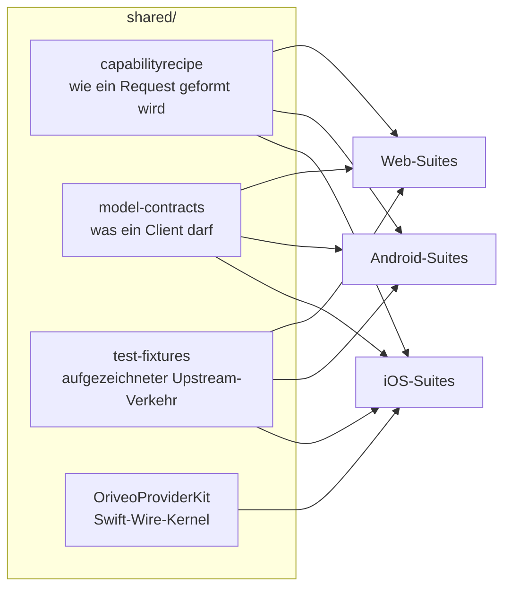

<div align="center">

# Gemeinsame Kontrakte

**Eine Definition davon, wie man mit einem Modellanbieter spricht, geprüft von allen drei Clients.**

<a href="../../LICENSE"></a>


<sub>

<a href="../../shared/README.md">English</a> ·
<a href="../ar/shared.md">العربية</a> ·
**Deutsch** ·
<a href="../es/shared.md">Español</a> ·
<a href="../fr/shared.md">Français</a> ·
<a href="../hi/shared.md">हिन्दी</a> ·
<a href="../id/shared.md">Indonesia</a> ·
<a href="../ja/shared.md">日本語</a> ·
<a href="../ko/shared.md">한국어</a> ·
<a href="../pt-BR/shared.md">Português</a> ·
<a href="../ru/shared.md">Русский</a> ·
<a href="../th/shared.md">ไทย</a> ·
<a href="../tr/shared.md">Türkçe</a> ·
<a href="../vi/shared.md">Tiếng Việt</a> ·
<a href="../zh-Hans/shared.md">简体中文</a> ·
<a href="../zh-Hant/shared.md">繁體中文</a>

</sub>

</div>

---

Drei Clients, die „ruf den Anbieter auf“ jeweils unabhängig implementieren, driften auseinander. Sie
driften leise, in die Richtung dessen, den zuletzt jemand getestet hat, und die Drift taucht dann als
Bug auf, der sich auf einer Plattform reproduzieren lässt und auf den anderen nicht.

`shared/` ist die Antwort darauf: Das Verhalten wird einmal als Daten festgeschrieben, und die
Test-Suite jedes Clients prüft gegen dieselben Dateien. Eine Eigenheit, die in diesen Daten steckt,
wird einmal behoben. Eine Eigenheit, die in einem Parser steckt, fällt drei Suites gleichzeitig auf,
statt auf zwei Plattformen auszuliefern und die dritte kaputtzumachen.



## capabilityrecipe

Die Rezept-Registry. Für einen bestimmten Anbieter, Transport und eine bestimmte Fähigkeit –
Websuche, Reasoning-Aufwand, Bildgenerierung – sagt sie genau, welche JSON-Pointer in den
ausgehenden Request geschrieben werden und wie die Antwort zurückzulesen ist.

Das ist es, was ein heute veröffentlichtes Modell ohne Client-Update funktionieren lässt, und
deshalb rät kein Client eine Fähigkeit aus einem Modellnamen. `capability_runtime.v1.json` trägt die
Rezepte selbst; `capability_result_definitions.v1.json` und `capability_custom_controls.v2.json`
legen fest, wie Ergebnisse und Bedienelemente für Nutzer interpretiert werden.

Jedes Rezept deklariert eine `executionKind` – `request_overlay`, `server_tool`,
`client_tool_loop`, `endpoint_route`, `model_route`, `external_connector`, `unavailable` – und der
Compiler jedes Clients prüft, dass das Rezept zu Anbieter, Fähigkeit und Transport passt, bevor er es
anwendet, und lehnt mit einem benannten Grund ab, statt einen Request zu senden, den niemand geprüft
hat. Die Liste ist eine geschlossene Menge: ein Rezept, das etwas anderes nennt, wird abgelehnt und
nicht erraten.

## model-contracts

JSON-Fixtures, die client-übergreifendes Verhalten festnageln: wie ein Request für einen bestimmten
Anbieter und eine bestimmte Fähigkeit aussehen muss, wie Generierungsparameter aufgelöst werden und
wie Overrides sich schichten, welche Fähigkeitszustände ein Client zeigen darf und wie der
Modellkatalog samt seiner Belege konsumiert wird.

Die Tests jedes Clients laden diese direkt, eine Änderung hier ist also eine Änderung an allen drei
Clients auf einmal.

## test-fixtures

Golden-Testdaten: aufgezeichneter Upstream-Verkehr von Tool-Calls, Relay-Routing,
Formularvalidierung, Klassifikation lokaler Adressen, Szenarien für den Katalog und für portable
Konfiguration, Snapshots von Model Facts und Capability-Belegen sowie Szenarien für lokale Engines.

Die `.sse`-Dateien unter `recorded/` sind **echt mitgeschnittener Upstream-Verkehr**, Byte für Byte
so gehalten, wie er angekommen ist – nur die Response-Header wurden entfernt, und die Bodies haben
nie einen Key getragen. Die übrigen sind handgeschriebene Fixtures, die einen bestimmten Parse-Pfad
festnageln. Der Unterschied zählt: Ein handgeschriebener Mock kodiert, was du geglaubt hast, was der
Anbieter tut, eine Aufzeichnung dagegen kodiert, was er tatsächlich getan hat, inklusive des kaputten
Chunks, den er an jenem Dienstag geschickt hat. Wenn eine Korrektur am Anbieter-Protokoll einen Test
braucht, nimm lieber eine Aufzeichnung.

Der `$comment` eines Fixtures, oder das `expected.json`-Manifest daneben, sagt, was die Einträge
ringsum festnageln. Lies das, bevor du einen Fall hinzufügst.

## OriveoProviderKit

Ein Swift-Paket mit dem Kern des Anbieter-Wire-Protokolls: SSE-Zeilenaufbau, OpenAI-kompatibles
Chunk-Parsing, ereignisbasierter Aufbau für die Protokolle Responses / Anthropic Messages / Gemini,
transportneutraler Request-Bau, Kompilierung der Rezepte samt ihrer Ausführungs-Guards, Kodierung von
Tool-Namen, Schwärzung von Zugangsdaten, Klassifikation von Upstream-Fehlern, Parsen von
Thinking-Tags, Extraktion von JSON-Pfaden im Stream, eine explizite `URLSession`-Redirect-Policy und
Quirk-Profile pro Anbieter.

Sein Zuschnitt ist bewusst eng. **Drin:** reines Foundation-Wire-Wissen. **Draußen:** App-Modelle,
UI, Datenbank, Telemetrie, Lokalisierung. Das Paket hängt von nichts außer der Standardbibliothek und
Foundation ab, und jeder Apple-Client hält eine dünne Bindung darum, damit Wire-Verhalten genau eine
Implementierung hat.

Es implementiert den gesamten Request- und Streaming-Pfad für Apple-Plattformen. Die iOS-App bindet
derzeit eine Teilmenge davon ein – die Stream-Assembler, die Wire-Profile, den Codec für Tool-Namen
und die Fehlerklassifizierer – und behält ihre eigenen Request Builder; der macOS-Client in
Entwicklung ist der zweite Konsument, und deshalb liegen der Rezept-Compiler und der
transportneutrale Request Builder hier und nicht in einer einzelnen App. Die Suite unten deckt die
Teile ab, die jeder Konsument teilt: SSE-Aufteilung, OpenAI-kompatibler Aufbau, den Codec für
Tool-Namen und die Redirect-Policy.

```bash
cd shared/OriveoProviderKit && swift build && swift test
```

- Plattformen: iOS 18+, macOS 15+ · `swift-tools-version: 6.1`
- `ProviderWireProfile` trägt die restlichen Eigenheiten pro Anbieter, die ein einzelner
  OpenAI-kompatibler Assembler weiterhin braucht – wo Reasoning-Text ankommt, wo die Zähler für
  gecachte Tokens stehen, ob Prompt-Tokens Cache-Treffer schon enthalten. Es beschreibt, *wie Bytes
  ankommen*, nie, *was ein Modell kann*; das ist die Aufgabe der Rezepte.

## Arbeiten an diesen Dateien

Eine Änderung hier ist eine Änderung an jedem Client. Lass die Kontrakt-Suites jedes Clients laufen,
der die Datei liest, die du angefasst hast, nicht nur die des Clients, in dem du gerade arbeitest:

Aus dem Wurzelverzeichnis des Repositorys:

```bash
(cd web && npm run test:run)
(cd shared/OriveoProviderKit && swift test)
# plus the iOS and Android suites — see their READMEs
```

Die iOS-Suites finden dieses Verzeichnis, indem sie von der Testdatei aus nach oben laufen, bis sie
`shared/` sehen; die Android-Suites lösen `../../shared` relativ zum Gradle-Modul auf, und die
Web-Suites lösen es relativ zum Workspace auf. Alle brauchen deshalb ein vollständiges Checkout des
Repositorys.

## Lizenz

[AGPL-3.0-or-later](../../LICENSE).
