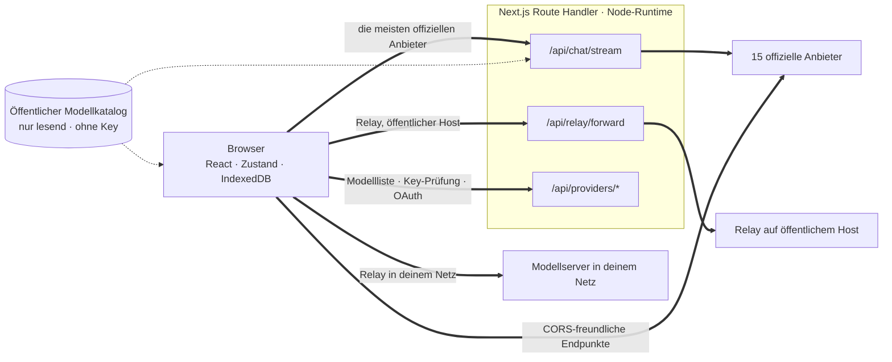
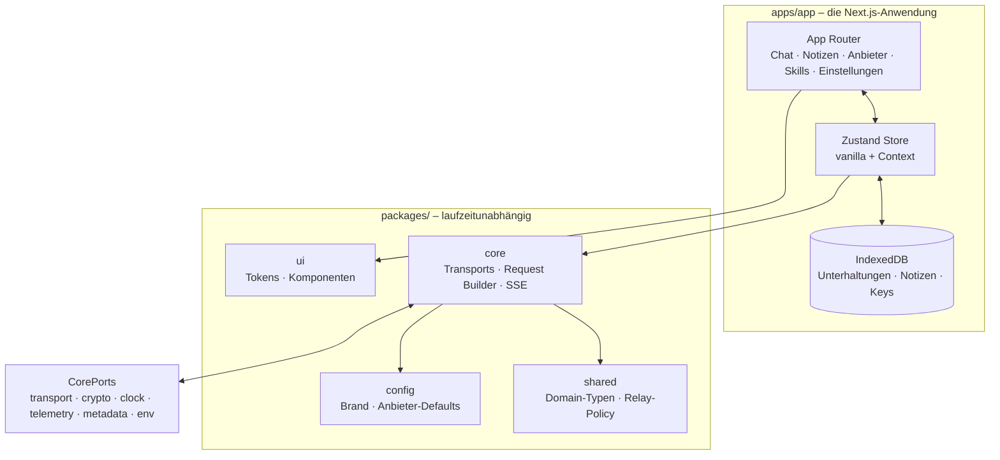

<div align="center">

# Oriveo fürs Web

**Ein Next.js-Chat-Client für die KI-Modelle, für die du ohnehin schon zahlst.**

<a href="../../LICENSE"></a>


<sub>

<a href="../../web/README.md">English</a> ·
<a href="../ar/web.md">العربية</a> ·
**Deutsch** ·
<a href="../es/web.md">Español</a> ·
<a href="../fr/web.md">Français</a> ·
<a href="../hi/web.md">हिन्दी</a> ·
<a href="../id/web.md">Indonesia</a> ·
<a href="../ja/web.md">日本語</a> ·
<a href="../ko/web.md">한국어</a> ·
<a href="../pt-BR/web.md">Português</a> ·
<a href="../ru/web.md">Русский</a> ·
<a href="../th/web.md">ไทย</a> ·
<a href="../tr/web.md">Türkçe</a> ·
<a href="../vi/web.md">Tiếng Việt</a> ·
<a href="../zh-Hans/web.md">简体中文</a> ·
<a href="../zh-Hant/web.md">繁體中文</a>

</sub>

</div>

---

Der Oriveo-Web-Client ist eine KI-Chat-App mit deinem eigenen Key, gebaut mit Next.js.
Unterhaltungen, Notizen, Ordner, Skills und deine Anbieter-Keys liegen im Speicher des Browsers
selbst. Es gibt kein Konto und keine Anmeldung.

Er ist Teil der [Oriveo Community Edition](README.md) – drei Clients, die sich eine Definition
davon teilen, wie man mit einem Modellanbieter spricht.

## Schnellstart

Braucht Node 22 (siehe [`.nvmrc`](../../web/.nvmrc)). npm kommt mit; ein anderer Paketmanager wird
nicht gebraucht.

```bash
npm install
npm run dev:app     # http://localhost:3001
```

Der erste Bildschirm fragt nach einem Anbieter-API-Key. Mehr braucht es nicht, um loszuchatten.

## Wie ein Request tatsächlich läuft

Das ist der Teil, den man vor allem anderen lesen sollte, denn der Web-Client ist die eine Stelle,
an der ein Request in der Regel **nicht** direkt vom Client zum Anbieter geht.



**Warum es den Umweg gibt.** Die meisten Anbieter-APIs senden keine CORS-Header, ein Browser kann
`api.openai.com` und Konsorten also nicht direkt aufrufen – der Preflight scheitert. Jeder
Browser-BYOK-Client muss das irgendwie lösen; dieser leitet über Next.js Route Handler in der
Node-Runtime weiter. Wenn du `npm run dev:app` startest, laufen diese Handler auf deinem eigenen
Rechner. Wenn du die App irgendwo deployst, laufen sie auf der Maschine, auf die du deployt hast.

Es ist nicht nur ein Handler: Chat-Streaming, der Relay-Forwarder, Bildgenerierung, die Modellliste,
die Key-Prüfung sowie die Device-Login-Austausche für Grok und Codex kommen zusammen auf zwölf
Route-Dateien. Die Key-Prüfung ist hier wichtig – sie schickt den Key an deinen eigenen Server, der
damit beim Anbieter anklopft.

Ein paar Endpunkte *erlauben* einen Browser, und die werden ohne Server dazwischen direkt aufgerufen:
Kimis China-Endpunkt (`api.moonshot.cn`) für Chat und die Guthaben-Endpunkte von OpenRouter,
SiliconFlow, DeepSeek und Kimi.

**Was der Handler tut und was nicht.** Er prüft die Form des Requests und begrenzt seine Größe,
wendet auf Chat- und Relay-Verkehr ein Rate-Limit pro IP an, weist URLs ab, die auf private oder
Link-Local-Adressen auflösen, baut den anbieterspezifischen Body und streamt die Antwort zurück.
Unter `app/api` gibt es keine Datenbank, keinen Schreibzugriff aufs Dateisystem und kein Logging von
Request-Bodies – dein Key und deine Nachrichten werden weitergereicht und vergessen. Weil die Route
ein Prozess ist, den sich alle Besucher teilen, nagelt ein eigener Test
(`server-never-learns.test.ts`) fest, dass sie nie einen abgelehnten Parameter des einen Nutzers
zwischenspeichert und auf den Request eines anderen anwendet.

Der Relay-Forwarder fixiert zusätzlich DNS auf die aufgelöste Adresse, begrenzt die Antwort, deckelt
jeden Timeout, beschränkt Weiterleitungen auf dieselbe Origin und weigert sich, Hop-by-Hop-Header
durchzureichen.

**Lokale Endpunkte überspringen ihn komplett.** Ein Relay auf einer privaten Adresse, einem
`.local`-Namen, `localhost` oder eines, das im Local-HTTP- oder Private-VPN-Modus konfiguriert ist,
wird **direkt vom Browser** geholt, mit `credentials: 'omit'` und `targetAddressSpace: 'local'`. Dein
LAN-Verkehr verlässt dein Netz nicht, und er läuft auch nicht über den Server der App.

## Architektur



`packages/core` hält jedes Byte Wissen über Anbieter-Protokolle und wird bewusst frei von
Browser-Globals gehalten – eslint verbietet dort und in `packages/ipc-contract` `window`,
`document`, `fetch`, `crypto`, `localStorage`, `sessionStorage` und `indexedDB`. Alles, was es aus
der Umgebung braucht, kommt über `CorePorts`. Genau das lässt denselben Code im Browser, in einem
Node Route Handler und in einem Test ohne DOM laufen.

Anbieter-Unterstützung besteht aus zwei unabhängigen Achsen. `providerKind` wählt einen **Request
Builder** (wie der Body für diesen Anbieter aussieht). `model.transport` wählt eine
**Transport-Strategie** (welches Wire-Protokoll gesprochen wird) aus zwölf, und das wird pro Modell
aus dem Katalog aufgelöst, nicht pro Anbieter – zwei Modelle hinter demselben Key können sich also
unterscheiden. Eine Strategie implementiert genau drei Methoden: `buildRequestBody`,
`parseStreamChunk`, `parseError`.

## Workspaces

```
apps/app/               the Next.js application
packages/core/          provider protocols: transports, request builders, SSE parsing
packages/shared/        domain types, relay policy, helpers
packages/ui/            design tokens and shared components
packages/config/        brand and provider defaults
packages/ipc-contract/  typed channel contract for a desktop shell
```

Gestylt wird mit CSS Modules über einem einzigen Token-Sheet aus Custom Properties in `packages/ui` –
ein Utility-Class-Framework gibt es nicht. `packages/ipc-contract` beschreibt die Kanalfläche, an die
sich eine Desktop-Shell binden würde; eine solche Shell liegt diesem Repository nicht bei, im
Web-Build steuert das Paket also Typen und Zweige bei, die nie genommen werden.

## Speicherung

Alles ist pro Partition, geschlüsselt über eine aktive id, die standardmäßig `guest` ist.

| Was | Wo |
|---|---|
| Unterhaltungen, Nachrichten, Ordner, Notizen, Anbieter | IndexedDB `oriveo--{id}`, 8 Object Stores |
| Snapshot des Modellkatalogs (~3 MB) und Model Facts | IndexedDB-Blob-Store, bewusst nicht localStorage |
| Einstellungen und Modellsteuerungs-Tabellen | `localStorage`, wobei `safeLocalStorage` die Pfade umhüllt, die nachweislich geworfen haben |
| Generierte und angehängte Bilder | eine separate IndexedDB-Datenbank |

Zwei Details, die aus echten Ausfällen stammen und nicht aus Geschmack. Der Katalog-Snapshot liegt in
IndexedDB, weil er mit rund 3 MB den größten Teil der 5 MB localStorage-Quote einer Browser-Origin
aufgefressen hat. Und jeder localStorage-Zugriff läuft über `safeLocalStorage`, weil schon der
*Getter* `window.localStorage` selbst einen `SecurityError` wirft, wenn ein Browser so eingestellt
ist, dass er Site-Daten blockiert – ein nacktes Lesen lässt die Seite abstürzen, bevor dein
`try`-Block überhaupt läuft.

> [!IMPORTANT]
> Im Web liegen Anbieter-Keys **unverschlüsselt** in IndexedDB – so wie bei
> browserbasierten BYOK-Clients allgemein üblich, weil ein Browser keinen besseren Ort dafür hat. Für
> die stärkste Garantie nimm den iOS- oder Android-Client, wo der System-Keychain bzw. -Keystore sie
> verschlüsselt. Backup-Archive sind eine andere Sache: die werden mit AES-256-GCM und
> PBKDF2-SHA-256 bei 600.000 Iterationen verschlüsselt, wenn du ein Passwort wählst.

## Der Modellkatalog

Welche Modelle jeder Anbieter anbietet und was jedes davon unterstützt, kommt aus einem nur lesbaren
Katalog, der beim Start geholt wird. Genau zwei Endpunkte werden abgerufen, beide per `GET`, beide
ETag-konditional, keiner trägt einen API-Key, eine Unterhaltung oder irgendeine Nutzerkennung:

```
GET {backend}/api/metadata?view=lean
GET {backend}/api/metadata/model-facts
```

Standard-Backend ist `https://api.oriveoai.com`. Richte `NEXT_PUBLIC_BACKEND_URL` auf deinen eigenen
Host, um ihn selbst auszuliefern. Die Antwort wird 24 Stunden in IndexedDB gecacht und mit
`If-None-Match` revalidiert; ist der Katalog nicht erreichbar, arbeitet die App aus ihrer Kopie
weiter.

## Befehle

Führe diese aus diesem Verzeichnis aus.

| Befehl | Was er tut |
|---|---|
| `npm run dev:app` | Entwicklungsserver auf Port 3001 |
| `npm run build:app` | Produktions-Build |
| `npm run typecheck` | `tsc --noEmit` über alle Workspaces |
| `npm run test:run` | vitest, ein Durchlauf |
| `npm run test` | vitest im Watch-Modus |
| `npm run lint` | eslint über `apps/` und `packages/` |

Eine einzelne Testdatei startest du aus dem Workspace, dem sie gehört, weil mehrere Suites ihre
Fixtures relativ zum Arbeitsverzeichnis auflösen:

```bash
cd apps/app && npx vitest run lib/core/chat/__tests__/stream-options.test.ts
```

## Konfiguration

Alles ist optional. Kopiere [`.env.example`](../../web/.env.example) nach `.env.local` und setze nur,
was du brauchst; jeder Key ist dort dokumentiert. Ein paar Variablen, die der Code liest, stehen
nicht in dieser Datei: `BACKEND_URL` (ein rein serverseitiger Zwilling von
`NEXT_PUBLIC_BACKEND_URL`), `NEXT_PUBLIC_LIBRARY_ENABLED`, `ORIVEO_DESKTOP` und `NEXT_DIST_DIR`.

### Fehlerberichte

Die App bündelt das Sentry-SDK. Ohne DSN ist es **wirkungslos** – kein `NEXT_PUBLIC_SENTRY_DSN`
bedeutet keinen Transport, keine Events, nichts, was irgendwohin geht, und genau das ist die
Voreinstellung für einen Build aus diesem Repository. Setzt du eine, bekommst du Fehlerberichte,
10 % Performance-Tracing und 1 % Session Replay, mit Hooks, die Anbieter-Keys, Endpunkte und
Nachrichteninhalte entfernen, bevor ein Event den Browser verlässt. Das steht hier, damit ein
Deployment, das Fehlerberichte will, sie haben kann – nicht weil dieser Build nach Hause funkt.

## Tests

Rund 4.600 Tests über 461 Dateien, auf vitest. Am dichtesten ist die Abdeckung dort, wo ein Fehler am
teuersten ist: Request-Form pro Anbieter, Transportverhalten pro Wire-Protokoll, SSE- und
Proxy-Chunk-Parsing, Parsen von Verbrauch und Kosten, Fehlerklassifikation, Relay-Probing und
Sicherheitsmodi, der SSRF-Schutz, Ausführung von Capability-Rezepten, Katalog-Caching und
Invalidierung nach Kontraktversion, IndexedDB-Persistenz, Partitionierung des Speichers,
Backup-Rundläufe und die Route Handler selbst.

> [!IMPORTANT]
> Rund 24 Suites laden Kontrakt-Fixtures aus `../shared`, **die Tests laufen also nur in einem
> vollständigen Checkout durch** – `web/` allein herauszukopieren funktioniert nicht.

## Lokalisierung

Sechzehn Locales in `apps/app/messages`, je rund 1.800 Keys, Englisch als Quelle. Ein Test läuft das
Verzeichnis ab und schlägt fehl, wenn der Schlüsselsatz einer Locale von dem englischen abweicht;
eine Locale-Datei hinzuzufügen nimmt sie damit automatisch auf. Arabisch bekommt ein vollständiges
Rechts-nach-links-Layout. Die Locale-Wahl folgt einem expliziten `?locale=`-Parameter, dann einem
Cookie, dann `Accept-Language`.

## Mitwirken

Siehe [CONTRIBUTING.md](../../CONTRIBUTING.md). `packages/core` ist transport-first: einen Anbieter
hinzuzufügen heißt meist einen Request Builder und einen Response-Adapter, keinen neuen Client. Bei
einer Korrektur am Anbieter-Protokoll nimm lieber ein aufgezeichnetes Fixture unter
`shared/test-fixtures` als einen handgeschriebenen Mock.

## Lizenz

[AGPL-3.0-or-later](../../LICENSE).
