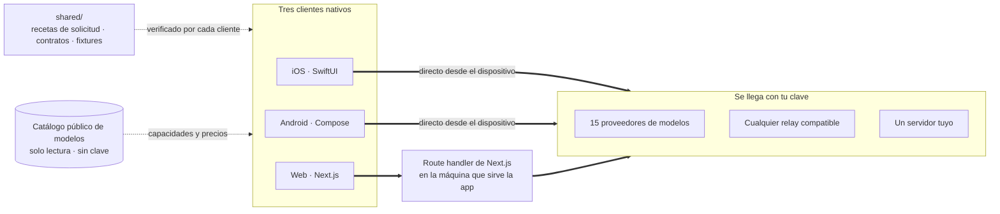

<div align="center">


# Oriveo Community Edition

**Todos los modelos, una sola app.**

Chat de IA de código abierto con tus propias claves, para iOS, Android y la web,
con un cliente nativo de macOS en desarrollo.
Sin cuenta, sin suscripción y sin ningún servicio nuestro en la ruta de las solicitudes.

<a href="../../LICENSE"></a>
<a href="ios.md"></a>
<a href="android.md"></a>
<a href="web.md"></a>
<a href="macos.md"></a>


**Consigue Oriveo:**
<a href="https://oriveoai.com"><b>oriveoai.com</b></a> &nbsp;·&nbsp;
<a href="https://apps.apple.com/app/oriveo/id6775370458">App Store</a> &nbsp;·&nbsp;
<a href="https://play.google.com/store/apps/details?id=com.kenny.oriveo">Google Play</a> &nbsp;·&nbsp;
<a href="https://app.oriveoai.com">App web</a>

<a href="#empezar">Compilar desde el código fuente</a> &nbsp;·&nbsp;
<a href="#arquitectura">Arquitectura</a> &nbsp;·&nbsp;
<a href="#community-edition-y-oriveo">Ediciones</a> &nbsp;·&nbsp;
<a href="#preguntas-frecuentes">Preguntas frecuentes</a> &nbsp;·&nbsp;
<a href="../../CONTRIBUTING.md">Contribuir</a>

<sub>

<a href="../../README.md">English</a> ·
<a href="../ar/README.md">العربية</a> ·
<a href="../de/README.md">Deutsch</a> ·
**Español** ·
<a href="../fr/README.md">Français</a> ·
<a href="../hi/README.md">हिन्दी</a> ·
<a href="../id/README.md">Indonesia</a> ·
<a href="../ja/README.md">日本語</a> ·
<a href="../ko/README.md">한국어</a> ·
<a href="../pt-BR/README.md">Português</a> ·
<a href="../ru/README.md">Русский</a> ·
<a href="../th/README.md">ไทย</a> ·
<a href="../tr/README.md">Türkçe</a> ·
<a href="../vi/README.md">Tiếng Việt</a> ·
<a href="../zh-Hans/README.md">简体中文</a> ·
<a href="../zh-Hant/README.md">繁體中文</a>

</sub>

</div>

---

## Qué es Oriveo

Oriveo Community Edition es un cliente de chat de IA de código abierto para iOS, Android y la web
que funciona con tus propias claves (BYOK), con un cliente nativo de macOS en desarrollo. Es para
quienes prefieren pagarle directamente a un proveedor de modelos antes que pagar una suscripción a lo
que se pone delante: tú aportas claves de API que ya tienes, y el cliente habla con el proveedor
usándolas. Eso lo convierte en una alternativa local primero y multimodelo a un plan alojado de
ChatGPT o de Claude: sin cuenta de Oriveo, sin suscripción, sin nada que nos informe de vuelta y con
un cliente web que puedes alojar tú.

Habla de forma nativa con **15 proveedores de modelos** —OpenAI, Anthropic, Google Gemini,
OpenRouter, DeepSeek, Grok, Mistral, Groq, Together AI, Fireworks AI, MiniMax, Z.ai, Qwen,
Kimi (Moonshot) y SiliconFlow— y además con **cualquier endpoint compatible con OpenAI, Anthropic o
Gemini** al que lo apuntes, incluidos llama.cpp, Ollama, LM Studio o vLLM corriendo en tu propia
máquina.

| | |
|---|---|
| **Proveedores** | 15 integrados, más endpoints Relay propios y servidores de modelos locales |
| **Clientes** | iOS (SwiftUI) · Android (Jetpack Compose) · Web (Next.js) · macOS en desarrollo |
| **Idiomas de interfaz** | 16 |
| **Cuenta requerida** | Ninguna |
| **Llamadas que hace por cuenta propia** | Una sola cosa, en dos solicitudes: un catálogo de modelos de solo lectura, que no lleva clave ni ningún identificador que le pongamos |
| **Licencia** | AGPL-3.0-or-later |

## Por qué existe

Nadie debería poder medir, registrar ni encarecer el modelo que estás pagando.

- **Tus claves, tu factura.** Pagas el precio de lista del proveedor. Nada lleva recargo, ni se mide,
  ni se revende.
- **Local por defecto.** Conversaciones, notas, carpetas, Skills y adjuntos viven en el dispositivo.
  Expórtalos a un archivo cuando quieras; no hay ninguna copia en la nube a la que puedas perder el
  acceso.
- **Un solo comportamiento, tres clientes.** Cómo se arma una solicitud para un proveedor, un
  transporte y una capacidad dados se escribe una vez en [`shared/`](shared.md), y los tres clientes
  verifican contra los mismos fixtures JSON. Una rareza que vive en esos datos se arregla una vez;
  una que vive en un parser la atrapan tres suites de pruebas a la vez.
- **Lo único que descarga.** La app lee un catálogo público de modelos para que un modelo lanzado
  hoy funcione sin actualizar la app. Sus dos solicitudes son de solo lectura y no llevan clave ni
  ningún identificador que le pongamos, y los clientes web y de Android se pueden apuntar a un host
  tuyo.

## Funciones

- **Chat** — streaming, bloques de razonamiento, citas, adjuntos (imágenes y video, PDF, Office
  (docx, xlsx, pptx), OpenDocument, EPUB, RTF, HTML y cualquier archivo de texto plano o de código
  fuente), citar una selección, reintentar, regenerar, continuar tras una respuesta interrumpida
- **Proveedores** — 15 integrados, cada uno con tu propia clave; modelo y parámetros de generación
  redefinibles por proveedor, y elección de endpoint regional donde el proveedor ofrece uno
- **Relay** — cualquier endpoint compatible con OpenAI, Anthropic o Gemini, incluido uno en tu red
  local
- **Servidores de modelos locales** — llama.cpp, Ollama, LM Studio, vLLM, Open WebUI; los clientes de
  iOS y Android los encuentran en la red local por mDNS
- **Inicio de sesión por suscripción** — usa una suscripción de ChatGPT o Grok que ya tengas en lugar
  de una clave de API, mediante el flujo de autorización por dispositivo de cada proveedor
- **Skills** — prompts de sistema reutilizables con su propio modelo, su ajuste de razonamiento y sus
  documentos de referencia
- **Notas y carpetas** — guarda una respuesta como nota, organiza conversaciones, busca en ambas
- **Cross-check** — pásale una respuesta a un segundo modelo para que la revise y conserva las dos
  juntas
- **Costo** — gasto por mensaje y por proveedor, calculado en el dispositivo a partir de lo que cada
  respuesta reportó realmente, incluidos los niveles de lectura y de escritura de caché
- **Generación de imágenes** — donde el proveedor la admite
- **Copias de seguridad** — exporta todo a un archivo; las claves de proveedor que contenga, si
  eliges incluirlas, se cifran con una contraseña tuya
- **16 idiomas de interfaz**, con diseño completo de derecha a izquierda para el árabe

## Community Edition y Oriveo

Este repositorio es **Oriveo Community Edition**, bajo licencia
[AGPL-3.0-or-later](../../LICENSE). Las apps de la App Store, de Google Play y la app web alojada son
**Oriveo**: un producto propietario aparte, construido a partir de los mismos clientes, con una capa
de cuenta encima.

| | Community Edition | Oriveo |
|---|---|---|
| Código fuente | Este repositorio, AGPL-3.0-or-later | Propietario |
| Chat con tus propias claves de proveedor | Sí | Sí |
| Relay y servidores de modelos locales | Sí | Sí |
| Notas, carpetas, Skills, adjuntos | Sí | Sí |
| Seguimiento de costos en el dispositivo | Sí | Sí |
| Cuenta | Ninguna | Cuenta de Oriveo |
| Almacenamiento | En el dispositivo; exportación y restauración manuales | Local primero, más sincronización en la nube entre dispositivos |
| Análisis de uso y alertas de presupuesto | — | Sí |
| Modelos que paga Oriveo | — | Sí |
| Analítica y reportes de fallos | Ninguna. El bundle web lleva Sentry, mudo hasta que configures un DSN propio | Sí |

Las builds de Community Edition usan el prefijo de identificador `ai.oriveo.community`, así que una
puede estar en el mismo dispositivo que una build de la tienda sin que las dos compartan keychain ni
ningún dato local. Lo que esta edición acepta y lo que no está escrito en
[COMMUNITY.md](../../COMMUNITY.md).

**Oriveo, el producto completo:**
[iPhone y iPad](https://apps.apple.com/app/oriveo/id6775370458) &nbsp;·&nbsp;
[Android](https://play.google.com/store/apps/details?id=com.kenny.oriveo) &nbsp;·&nbsp;
[Web](https://app.oriveoai.com) &nbsp;·&nbsp;
[oriveoai.com](https://oriveoai.com)

## Proveedores

A cada proveedor de abajo se llega con una clave que creas tú. A dos de ellos también se puede
llegar iniciando sesión con una suscripción que ya tengas en lugar de una clave: a OpenAI con un plan
de ChatGPT, y a Grok.

| Proveedor | Dónde conseguir una clave |
|---|---|
| OpenAI | [platform.openai.com](https://platform.openai.com/api-keys) |
| Anthropic | [platform.claude.com](https://platform.claude.com/settings/keys) |
| Google Gemini | [aistudio.google.com](https://aistudio.google.com/apikey) |
| OpenRouter | [openrouter.ai](https://openrouter.ai/keys) |
| DeepSeek | [platform.deepseek.com](https://platform.deepseek.com/api_keys) |
| Grok | [console.x.ai](https://console.x.ai/) |
| Mistral | [console.mistral.ai](https://console.mistral.ai/api-keys) |
| Groq | [console.groq.com](https://console.groq.com/keys) |
| Together AI | [api.together.xyz](https://api.together.xyz/settings/api-keys) |
| Fireworks AI | [fireworks.ai](https://fireworks.ai/api-keys) |
| MiniMax | [platform.minimax.io](https://platform.minimax.io/docs/guides/quickstart-preparation) |
| Z.ai | [open.bigmodel.cn](https://open.bigmodel.cn/usercenter/apikeys) |
| Qwen | [bailian.console.alibabacloud.com](https://bailian.console.alibabacloud.com/?apiKey=1#/api-key) |
| Kimi (Moonshot) | [platform.kimi.ai](https://platform.kimi.ai/console/api-keys) |
| SiliconFlow | [cloud.siliconflow.cn](https://cloud.siliconflow.cn/account/ak) |
| **Relay** | Cualquier endpoint compatible con OpenAI, Anthropic o Gemini, incluido uno en tu propia máquina |

## Arquitectura

Tres clientes nativos, una sola definición de cómo hablar con un proveedor de modelos.



Cada cliente es dueño de su propia interfaz, su almacenamiento y su navegación, y se encuentra con
los contratos compartidos en exactamente una costura: la capa que convierte *este modelo, esta
capacidad* en una solicitud HTTP.

La única asimetría que vale la pena conocer es el cliente web. La mayoría de las API de los
proveedores no envían encabezados CORS, así que un navegador no puede llamarlas directamente; esas
solicitudes pasan por un route handler de Next.js que corre en la máquina que sirva la app, la tuya
cuando la ejecutas localmente. Los pocos endpoints que sí permiten un navegador (el endpoint chino
de Kimi, los endpoints de saldo de algunos proveedores) y los relays de tu propia red se llaman
directamente. Los clientes de iOS y Android no tienen esa restricción y siempre van directo al
proveedor.

**La arquitectura de cada cliente:**

| | Stack | README |
|---|---|---|
| **iOS** | SwiftUI con un hilo en UIKit, GRDB | [ios.md](ios.md) |
| **Android** | Jetpack Compose, Room, Koin, Ktor/OkHttp | [android.md](android.md) |
| **Web** | Next.js App Router, React, Zustand, TypeScript | [web.md](web.md) |
| **macOS** | En desarrollo, llega en los próximos meses | [macos.md](macos.md) |
| **Shared** | Contratos, fixtures grabados y el núcleo de protocolo en Swift | [shared.md](shared.md) |

## Empezar

Aquí no hay binarios precompilados: ni APK ni `.ipa`. Community Edition es código
fuente que compilas tú, y las apps de las tiendas son el otro producto. El cliente web es el camino
más corto para tener la app funcionando.

<details open>
<summary><b>Web</b> — la forma más rápida de probarlo</summary>

<br>

Requiere Node 22.22 o posterior (ver [`web/.nvmrc`](../../web/.nvmrc)).

```bash
cd web
npm install
npm run dev:app        # http://localhost:3001
```

La primera pantalla pide una clave de API de un proveedor. No hace falta nada más.
Más comandos y configuración: [web.md](web.md).

</details>

<details>
<summary><b>iOS</b> — compilar y ejecutar en tu propio iPhone</summary>

<br>

Requiere una Mac con Xcode 26 y un dispositivo con iOS 18 o posterior. Basta con una cuenta gratuita
de Apple Developer: la app no usa ninguna capability de pago.

1. Abre `ios/Oriveo/Oriveo.xcodeproj`
2. Selecciona el esquema `Oriveo`
3. En Signing &amp; Capabilities, elige tu propio Team
4. Ejecuta

Guía completa, incluido qué hacer si Xcode se niega a abrir el proyecto: [ios.md](ios.md).

</details>

<details>
<summary><b>Android</b> — compilar el APK</summary>

<br>

Requiere JDK 21 y el SDK de Android. La build usa AGP 9.3, Gradle 9.5 y Kotlin 2.3, así que Android
Studio tiene que ser una versión capaz de sincronizarlos; desde la línea de comandos solo hacen falta
el JDK y el SDK.

```bash
cd android
./gradlew :app:assembleDebug
```

Servir el catálogo de modelos desde tu propio host: [android.md](android.md).

</details>

## Privacidad

- **Las claves de proveedor** van al Keychain de iOS y, en Android, a `EncryptedSharedPreferences`
  bajo una clave guardada en el Keystore de Android. Un navegador no tiene un mecanismo equivalente,
  así que en la web quedan sin cifrar en IndexedDB, el mismo modelo que usan en general los clientes
  BYOK de navegador. Para la garantía más fuerte, usa el cliente de iOS o Android.
- **Conversaciones, notas, carpetas, Skills y adjuntos** se guardan en el dispositivo. No se sube
  nada a ninguna parte.
- **Sin cuenta y sin analítica.** No hay dónde iniciar sesión, y nada cuenta lo que haces. El
  bundle web incluye Sentry para reportar errores; se queda mudo hasta que apuntes
  `NEXT_PUBLIC_SENTRY_DSN` a un proyecto propio y, si lo haces, está configurado para capturar
  repeticiones de sesión además de trazas de pila. Los clientes de iOS y Android no contienen ningún
  SDK de reportes.
- **En iOS y Android, las solicitudes de chat van directo del dispositivo al proveedor.** En la web
  la mayoría pasa por el servidor Next.js que sirve la app, porque la mayoría de las API de los
  proveedores no permiten una llamada directa desde el navegador; ese servidor no persiste claves ni
  mensajes, y cuando ejecutas la app localmente es tu propia máquina.
- **Dos solicitudes propias:** un catálogo de modelos de solo lectura, leído en dos llamadas —una
  para cómo quiere que se le hable a cada modelo, otra para los datos de cada modelo concreto, que
  iOS lee solo después de iniciar sesión con una suscripción—, para que un modelo lanzado hoy
  funcione sin una build nueva. Ninguna de las dos lleva clave, ni
  conversación, ni ningún identificador que le pongamos. El cliente web
  (`NEXT_PUBLIC_BACKEND_URL`) y la build de Android (`-PORIVEO_METADATA_BASE_URL`) se pueden apuntar
  a un host tuyo; en iOS esa redefinición es solo una comodidad de las builds Debug.

## Preguntas frecuentes

<details>
<summary><b>¿Qué significa BYOK?</b></summary>

<br>

Bring your own key: trae tu propia clave. Creas una clave de API en la consola del propio proveedor
—OpenAI, Anthropic, Google, etc.— y la pegas en Oriveo. Ese proveedor factura las solicitudes a su
precio de lista. Oriveo es el cliente; no es un revendedor y no se lleva ninguna comisión.

</details>

<details>
<summary><b>¿Es gratis?</b></summary>

<br>

El cliente sí. Es de código abierto bajo AGPL-3.0-or-later, no hay nada a lo que suscribirse y
ninguna parte de él queda retenida detrás de un pago. Lo que pagas es el precio de lista del propio
proveedor de modelos por las solicitudes que haces, facturado por él, en la cuenta a la que pertenece
la clave. Oriveo nunca ve esa factura.

</details>

<details>
<summary><b>¿Mis conversaciones pasan por un servidor de Oriveo?</b></summary>

<br>

No. En iOS y Android el cliente llama al endpoint del proveedor directamente. En la web la mayoría
de las solicitudes pasa por el servidor Next.js que está sirviendo la app —tu propia máquina cuando
la ejecutas localmente—, porque la mayoría de las API de los proveedores rechazan una llamada
directa desde el navegador; las pocas que la admiten se llaman directamente. Ninguno de los dos
caminos involucra un servidor operado por Oriveo. Lo único que Oriveo descarga por cuenta propia es
el catálogo público de modelos, en dos solicitudes de solo lectura que no llevan clave, ni
conversación, ni ningún identificador que le pongamos.

</details>

<details>
<summary><b>¿Puedo usar un modelo que corre en mi propia máquina?</b></summary>

<br>

Sí. Agrega una conexión Relay que apunte a cualquier servidor compatible con OpenAI, Anthropic o
Gemini: llama.cpp, Ollama, LM Studio, vLLM, Open WebUI o cualquier otra cosa que hable uno de esos
protocolos. Los clientes de iOS y Android pueden descubrir uno en la red local por mDNS; el cliente
web sugiere la dirección habitual de cada motor y la sondea. El HTTP local no usa ninguna credencial
y nunca sale de tu red.

</details>

<details>
<summary><b>¿Puedo ejecutarlo todo yo?</b></summary>

<br>

Sí. El cliente web es una app Next.js que compilas y sirves desde tu propia máquina; es la única
parte del proyecto que tiene lado servidor, y no guarda ni claves ni mensajes. Apúntalo a un servidor
de modelos en tu propio hardware y ninguna solicitud saldrá de tu red. El catálogo de modelos también
se puede alojar por cuenta propia: dale a la build web un `NEXT_PUBLIC_BACKEND_URL` tuyo, o a la de
Android un `-PORIVEO_METADATA_BASE_URL`, y nada en la app saldrá de tu red.

</details>

<details>
<summary><b>¿En qué se diferencia de la app de la App Store?</b></summary>

<br>

Las apps de las tiendas son Oriveo, un producto propietario que agrega una cuenta, sincronización en
la nube entre dispositivos, análisis de uso y modelos que paga Oriveo. Community Edition son esos
mismos tres clientes sin nada de eso: sin cuenta, sin servicio de sincronización, sin facturación y
sin nada que nos informe de vuelta. Mira
[Community Edition y Oriveo](#community-edition-y-oriveo) para la comparación completa.

</details>

<details>
<summary><b>¿Hay un cliente para macOS?</b></summary>

<br>

Hay un cliente nativo de macOS en desarrollo y se publicará en los próximos meses; `macos/` es
donde va a aterrizar. Hasta entonces, el cliente web funciona bien como app de escritorio en
cualquier navegador, y la build de iOS se ejecuta en un Mac con Apple Silicon directamente desde
Xcode. El paquete de Swift que habla con los proveedores ya declara macOS 15 como plataforma
compatible, así que la capa de protocolo que necesita un cliente de Mac está escrita y bajo prueba
hoy. Mira [macos.md](macos.md).

</details>

<details>
<summary><b>¿En qué idiomas está disponible la interfaz?</b></summary>

<br>

En dieciséis: árabe, alemán, inglés, español, francés, hindi, indonesio, japonés, coreano, portugués
de Brasil, ruso, tailandés, turco, vietnamita, chino simplificado y chino tradicional. El árabe tiene
un diseño completo de derecha a izquierda.

</details>

## Estructura del repositorio

```
ios/           iOS client (SwiftUI)
android/       Android client (Jetpack Compose)
web/           Web client (Next.js)
macos/         macOS client — in development, arriving in the coming months
shared/        Cross-client contracts, recorded fixtures, and the Swift wire kernel
readme_i18n/   These READMEs in fifteen more languages
docs/assets/   Images used by the READMEs
```

## Contribuir

Los reportes de errores y los pull requests son bienvenidos.
[CONTRIBUTING.md](../../CONTRIBUTING.md) explica cómo compilar cada cliente y cómo es un buen pull
request; [COMMUNITY.md](../../COMMUNITY.md) describe para qué sirve esta edición y los pocos tipos de
cambio que no se aceptarán por bien escritos que estén.

¿Encontraste un problema de seguridad? Por favor no abras un issue público:
[SECURITY.md](../../SECURITY.md) explica cómo reportarlo en privado, y qué considera este proyecto
una vulnerabilidad y qué no. Se espera que todas las personas que participan sigan el
[código de conducta](../../CODE_OF_CONDUCT.md).

## Licencia

[AGPL-3.0-or-later](../../LICENSE). Las contribuciones se aceptan bajo la misma licencia.

Los nombres y logotipos de los proveedores pertenecen a sus respectivos dueños y aparecen aquí solo
para identificar los servicios a los que se puede apuntar este cliente. No están cubiertos por la
licencia de este repositorio, y su presencia no es un respaldo por parte de nadie. Las tipografías y
bibliotecas que incluyen los clientes, y las condiciones bajo las que vienen, están listadas en
[THIRD-PARTY-NOTICES.md](../../THIRD-PARTY-NOTICES.md).
