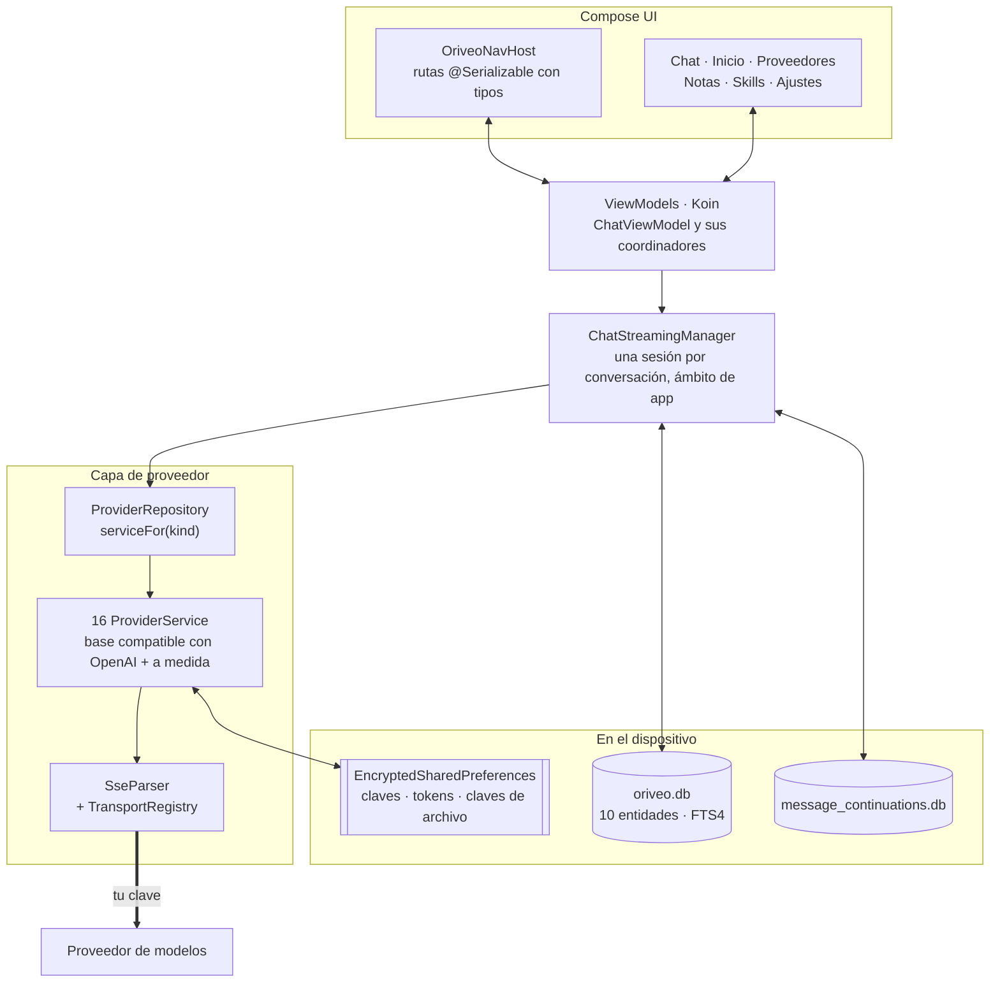

<div align="center">

# Oriveo para Android

**Un cliente de chat nativo en Jetpack Compose para los modelos de IA que ya pagas.**

<a href="../../LICENSE"></a>


<sub>

<a href="../../android/README.md">English</a> ·
<a href="../ar/android.md">العربية</a> ·
<a href="../de/android.md">Deutsch</a> ·
**Español** ·
<a href="../fr/android.md">Français</a> ·
<a href="../hi/android.md">हिन्दी</a> ·
<a href="../id/android.md">Indonesia</a> ·
<a href="../ja/android.md">日本語</a> ·
<a href="../ko/android.md">한국어</a> ·
<a href="../pt-BR/android.md">Português</a> ·
<a href="../ru/android.md">Русский</a> ·
<a href="../th/android.md">ไทย</a> ·
<a href="../tr/android.md">Türkçe</a> ·
<a href="../vi/android.md">Tiếng Việt</a> ·
<a href="../zh-Hans/android.md">简体中文</a> ·
<a href="../zh-Hant/android.md">繁體中文</a>

</sub>

</div>

---

El cliente de Android de Oriveo es una app de chat de IA que funciona con tus propias claves. Agregas
claves de API que ya tienes, y la app habla con cada proveedor directamente desde el teléfono.
Conversaciones, notas, carpetas y Skills se guardan en el dispositivo en Room; las claves de API se
cifran con una clave que custodia el Keystore de Android. No hay cuenta ni inicio de sesión.

Forma parte de [Oriveo Community Edition](README.md): tres clientes que comparten una sola definición
de cómo hablar con un proveedor de modelos.

## Arquitectura



Tres cosas de este diagrama son decisiones de diseño deliberadas, no estructura accidental.

**El streaming vive por encima de la pantalla.** `ChatStreamingManager` mantiene una
`StreamingSession` por id de conversación en un `ConcurrentHashMap`, cada una corriendo como su
propio `Job` sobre un único `CoroutineScope(SupervisorJob() + Dispatchers.IO)` con ámbito de
aplicación: el supervisor es justo el punto, así que si un stream falla no se lleva por delante a los
demás. Salir de un chat no cancela la respuesta, y `ChatRepository` vuelca el texto parcial a SQLite
en cuanto `StreamingTokenBuffer` dice que se acumuló lo suficiente (4.000 caracteres o 60 segundos),
así que matar la app a mitad de una respuesta no pierde lo que ya llegó.

**Dos bases de datos, no una.** `oriveo.db` guarda conversaciones, mensajes, adjuntos, notas,
carpetas, Skills y la caché del catálogo de modelos. `message_continuations.db` es un archivo
físicamente separado que guarda el estado de continuación opaco del proveedor, precisamente para que
`backup_rules.xml` y `data_extraction_rules.xml` puedan excluirlo de la copia de seguridad en la nube
y de la transferencia entre dispositivos: un token de continuación restaurado en otro dispositivo es,
en el mejor de los casos, inútil.

**Un catálogo más nuevo que el binario se degrada, no se rompe.** `TransportKind` es un enum cerrado
con un deserializador tolerante: una cadena de transporte desconocida se decodifica como `null`,
`TransportRegistry` no devuelve ninguna estrategia y el modelo queda fuera del selector. La
alternativa —un enum estricto— haría fallar el parseo del catálogo entero y se llevaría por delante a
todos los demás modelos.

## Qué puede hacer un modelo

El cliente nunca adivina las capacidades de un modelo a partir de su nombre. Lee un runtime de
capacidades desde el catálogo: recetas que describen, para un proveedor, un transporte y una
capacidad dados, exactamente qué punteros JSON escribir en la solicitud.
`ProviderRecipeRequestCompiler` valida la receta contra el proveedor, la capacidad y el transporte
antes de compilarla en un delta de cuerpo propio, y la rechaza con un motivo con nombre
(`recipe_not_found`, `transport_mismatch`, `model_route_must_not_patch_body`) en lugar de producir en
silencio una solicitud que nadie revisó.

De vuelta, `CapabilityEvidenceFacade` ordena por fuente lo que realmente se sabe de una capacidad:
`operator_override` > `server_typed` > `server_profile` > `model_facts` > `relay_verification` >
`relay_declaration` > `legacy_metadata`. Solo el analizador de flujo puede marcar una capacidad como
*observed*; la intención, las recetas, un HTTP 200 y una declaración de herramienta explícitamente no
cuentan. El resultado se persiste por mensaje, así que la interfaz puede distinguir *solicitado* de
*confirmado*.

Las redefiniciones se resuelven por última-escritura-gana a lo largo de siete ámbitos, en este orden
de prioridad: `single_send` > `conversation_connection_model` > `skill_agent` > `connection_model` >
`connection` > `provider_recipe` > `provider_default`.

## Almacenamiento y secretos

| Qué | Dónde |
|---|---|
| Conversaciones, mensajes, adjuntos, notas, carpetas, Skills | Room, `oriveo.db` |
| Búsqueda de texto completo sobre las notas | tabla virtual FTS4 |
| Caché del catálogo de modelos | una sola fila en `oriveo.db`, releída por partes |
| Estado de continuación del proveedor | `message_continuations.db`, excluido de la copia de seguridad |
| Claves de API de los proveedores | `EncryptedSharedPreferences`, AES-256-GCM, clave maestra en el Keystore |
| Tokens OAuth de suscripción | un segundo archivo de preferencias cifrado, aparte |
| Claves de los archivos de copia de seguridad | un tercero |
| Blobs de los adjuntos | archivos en disco, referenciados por id |

Los tres archivos de preferencias cifrados están separados por vida útil y radio de daño, no
fusionados por comodidad. Cada uno tiene una ruta de recuperación: un archivo corrupto
(`AEADBadTagException`, `VERIFICATION_FAILED`) se detecta, se borra y se vuelve a crear en vez de
hacer que la app falle en cada arranque.

Los tres, junto con la base de datos de continuaciones, quedan excluidos de la copia de seguridad en
la nube de Android y de la transferencia entre dispositivos. Eso es consecuencia de atarlos al
Keystore, no un descuido: el texto cifrado sería indescifrable en el dispositivo nuevo de todos
modos. **Después de cambiar de teléfono vuelves a introducir tus claves de API y a iniciar sesión en
cualquier suscripción de proveedor**; las conversaciones y las notas pasan con normalidad.

Un archivo que exportas tú es un zip que contiene `data.json` más los archivos de los adjuntos. La
contraseña que eliges protege **solo las claves de API de proveedor** que hay dentro: se cifran con
PBKDF2-HMAC-SHA256 a 600.000 iteraciones y AES-GCM y se guardan como un campo de `data.json`. Las
conversaciones, los mensajes, las notas, las carpetas, los Skills, las preferencias y los adjuntos se
escriben como JSON en claro y archivos en claro en cualquier caso, así que trata un archivo como
legible por cualquiera que lo tenga. Exporta sin claves si solo quieres tu historial.

## Llegar a un servidor de modelos en tu propia red

El manifiesto pone `android:usesCleartextTraffic="true"`, a propósito: los servidores de modelos
locales —llama.cpp, Ollama, LM Studio, vLLM— hablan HTTP en claro en tu propia máquina o en tu red
local, y por lo general no tienen certificado.

La frontera de verdad está en el código, no en el manifiesto, porque tiene que estar ahí.
`RelayEndpointPolicy` resuelve el host, exige que **todas** las direcciones resueltas sean privadas
(loopback, RFC 1918, link-local, unique-local y el rango CGNAT en modo VPN), rechaza un host que
resuelve a una mezcla de direcciones públicas y privadas, fija el conjunto de direcciones resuelto
contra el DNS rebinding y lo vuelve a verificar al momento de enviar. Rechaza cualquier solicitud en
claro que lleve material de credenciales. Los clientes de descubrimiento y de motor local no siguen
ninguna redirección, con esa fijación de direcciones como red de seguridad.

Una network security config de Android no puede expresar ese conjunto: solo distingue por nombre de
host, no tiene sintaxis para rangos de direcciones, y las direcciones aquí vienen de la red del
propio usuario en tiempo de ejecución. Una config sería además estrictamente más débil, ya que nunca
ve la dirección a la que se resolvió un nombre.

## El catálogo de modelos

La app lee las capacidades y los precios de los modelos de un catálogo público para que un modelo
lanzado hoy funcione sin actualizar la app. Es un simple `GET` HTTPS sin credenciales ni
identificador adjunto, y las solicitudes de chat nunca se acercan a él. Solo se piden dos endpoints:

```
GET {base}/api/metadata?view=lean
GET {base}/api/metadata/model-facts
```

La URL base es una propiedad de compilación, con `https://api.oriveoai.com` por defecto:

```bash
./gradlew :app:assembleDebug -PORIVEO_METADATA_BASE_URL=https://your.host
```

Las respuestas se revalidan por ETag y se guardan en caché en `oriveo.db`, así que una vez que una
descarga tuvo éxito la app sigue funcionando desde la copia en caché cuando el catálogo deja de estar
accesible.

> [!IMPORTANT]
> Compilar con un valor vacío (`-PORIVEO_METADATA_BASE_URL=`) desactiva por completo la descarga del
> catálogo, y **no hay ningún snapshot incluido en el APK**. En una instalación nueva de una build
> así:
>
> - ninguno de los 15 proveedores integrados obtiene una lista de modelos, y la app tampoco se la
>   pide al proveedor: el catálogo es la única fuente;
> - la pantalla de detalle del proveedor muestra un aviso de «No se pudieron cargar los modelos
>   oficiales», pero agregar la clave sigue reportando éxito y el selector de modelos simplemente
>   queda vacío;
> - **OpenAI queda inutilizable**, porque la entrada manual de modelos está bloqueada para ese
>   proveedor;
> - los endpoints Relay y los servidores de modelos locales siguen funcionando por completo, y son la
>   única vía intacta.
>
> Si quieres una build sin conexión, sirve el catálogo tú mismo y apunta la build ahí en lugar de
> vaciar el valor.

## Estructura del proyecto

```
android/
  app/src/main/java/ai/oriveo/community/
    core/
      provider/    every provider service, transports, relay, capability recipes
      data/        Room entities, DAOs, repositories, backup, catalog client
      model/       domain models and the capability/preference resolvers
      attachments/ routing, budgets, per-format text extraction
      security/    SecureKeyStore, BackupCrypto, external-URL policy
      streaming/   ChatStreamingManager
      navigation/  AppRoute, OriveoNavHost
    feature/       one package per screen
    ui/            shared components, Markdown + LaTeX renderer, theme
    di/            Koin modules
  benchmark/       macrobenchmark suite (cold start, model picker)
```

## Compilación

Requisitos: **JDK 21** y el SDK de Android. La build usa AGP 9.3, Gradle 9.5 y Kotlin
2.3, así que Android Studio tiene que ser una versión capaz de sincronizar AGP 9.3; desde la línea de
comandos solo hacen falta el JDK y el SDK.

```bash
./gradlew :app:assembleDebug
./gradlew :app:testDebugUnitTest
```

La build apunta a `minSdk 26`, `targetSdk 36`, `compileSdk 37`. `local.properties` (la ruta de tu
SDK) la genera Android Studio y no se versiona. La firma de release se describe en
[SIGNING.md](../../android/SIGNING.md).

> [!NOTE]
> El daemon de Gradle corre sobre una toolchain de Java 21 (`gradle/gradle-daemon-jvm.properties`), y
> la coincidencia es con 21 exactamente, no con «21 o posterior». Con cualquier otro JDK instalado,
> Gradle se descarga un JDK 21 para sí mismo en la primera build, lo cual requiere acceso a la red;
> instalar el JDK 21 tú evita esa descarga. Si pusiste
> `org.gradle.java.installations.auto-download=false`, esa descarga no puede ocurrir y la build falla
> con `Toolchain auto-provisioning is not enabled.`: ese es el único caso en que el JDK 17 por sí
> solo realmente no alcanza. La compilación apunta a Java 17 en cualquier caso.

El paralelismo de las pruebas unitarias se deriva del número de CPU y de la memoria física de la
máquina en vez de estar fijo en el código, para que la suite se comporte tanto en una laptop como en
una estación de trabajo grande.

## Dependencias

| Biblioteca | Versión | Para qué sirve |
|---|---|---|
| Jetpack Compose BOM | 2026.08.00 | interfaz, Material 3 |
| Room | 2.8.4 | SQLite, DAOs, FTS4 |
| Koin | 4.2.2 | inyección de dependencias |
| Ktor client (motor OkHttp) | 3.5.2 | HTTP y SSE hacia los proveedores |
| kotlinx.serialization | 1.11.0 | JSON |
| navigation-compose | 2.9.6 | rutas con tipos |
| androidx.security-crypto | 1.1.0 | `EncryptedSharedPreferences` |
| haze | 1.7.3 | desenfoque de fondo |
| PDFBox-Android, jsoup | 2.0.27.0, 1.23.2 | extracción de texto de los adjuntos |
| jlatexmath-android | 0.2.0 | renderizado de LaTeX |

Las versiones exactas están fijadas en
[`gradle/libs.versions.toml`](../../android/gradle/libs.versions.toml).

## Pruebas

```bash
./gradlew :app:testDebugUnitTest
```

Unas 3.000 pruebas unitarias repartidas en 318 archivos, con JUnit 4, MockK, Robolectric,
`kotlinx-coroutines-test` y el mock engine de Ktor. La cobertura es más densa donde los errores salen
más caros: forma de la solicitud por proveedor, parseo de SSE, selección de transporte, sondeo de
relay y modos de seguridad, ejecución de recetas de capacidad, caché del catálogo y manejo de
versiones de contrato, persistencia con Room y ciclos completos de copia de seguridad.

> [!IMPORTANT]
> Unas 38 suites cargan fixtures de contrato resolviendo `../../shared` desde el directorio del
> módulo de Gradle, así que **las pruebas solo pasan en un checkout completo**: copiar `android/` por
> su cuenta no funcionará.

También hay tres pruebas instrumentadas: una matriz de release de motores locales, una prueba de
socket en claro y una prueba de aislamiento del Keystore. No son autónomas: las de motores locales
necesitan argumentos de instrumentación que nombren un servidor de modelos real en ejecución en tu
red, así que `connectedAndroidTest` no pasa tal cual. La puerta de entrada para un pull request es la
suite unitaria.

El módulo `:benchmark` contiene los macrobenchmarks de arranque en frío y del selector de modelos. Es
un módulo Gradle aparte que usa `com.android.test` con autoinstrumentación, y maneja un build type
`benchmark` dedicado de `:app`.

Ambas bases de datos están en `version = 1` y todavía no tienen migraciones; los esquemas se exportan
a `app/schemas/` y se versionan, que es donde aterrizará el `2.json` de la primera migración.

## Localización

Dieciséis idiomas: `values/` (inglés, la fuente) más quince directorios `values-*`, con unas 1.300
cadenas cada uno y un conjunto de claves idéntico en todas las configuraciones regionales. El cambio
de idioma dentro de la app pasa por `AppLanguageManager` y `android:localeConfig`. Los splits por
idioma están desactivados en el bundle, así que un solo artefacto lleva todas las traducciones.

## Contribuir

Mira [CONTRIBUTING.md](../../CONTRIBUTING.md). El idioma de trabajo del proyecto es el inglés:
código, comentarios, pruebas y mensajes de commit. Las cadenas de la interfaz sí se traducen: agrega
una cadena nueva a `values/` primero y deja que las demás configuraciones regionales la sigan.
Ejecuta las pruebas unitarias antes de abrir un pull request.

## Licencia

[AGPL-3.0-or-later](../../LICENSE).
