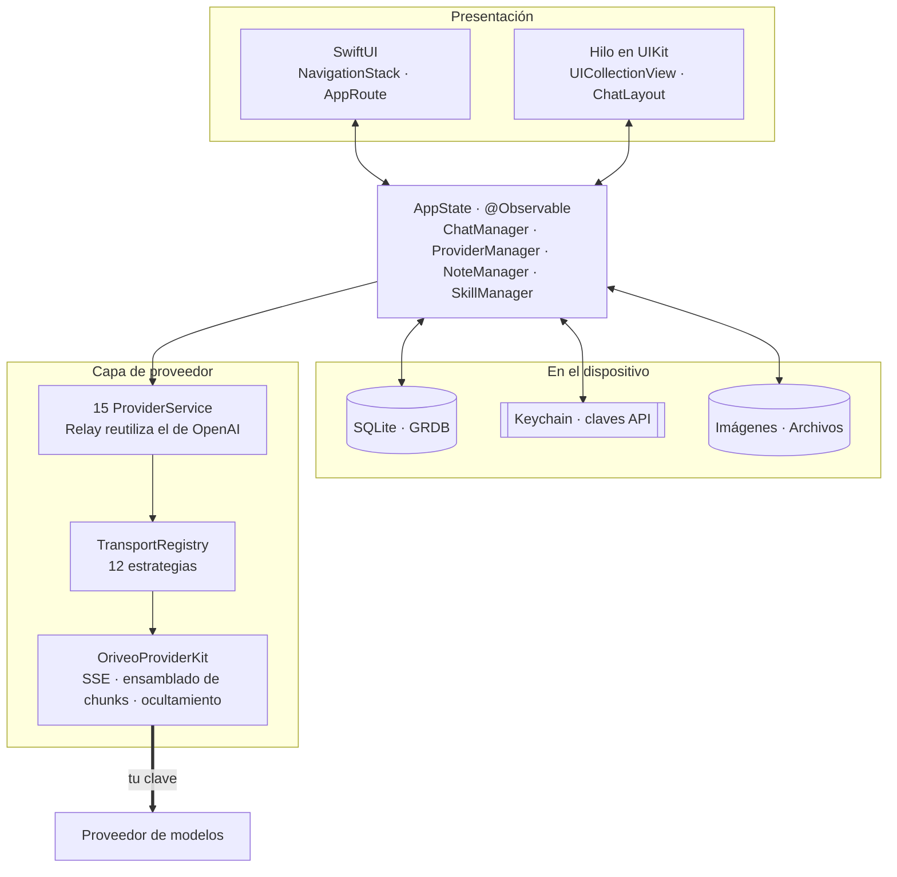
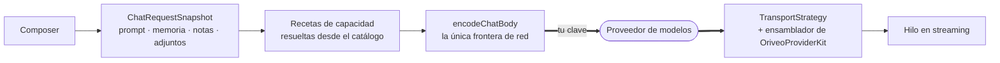

<div align="center">

# Oriveo para iOS

**Un cliente de chat nativo en SwiftUI para los modelos de IA que ya pagas.**

<a href="../../LICENSE"></a>


<sub>

<a href="../../ios/README.md">English</a> ·
<a href="../ar/ios.md">العربية</a> ·
<a href="../de/ios.md">Deutsch</a> ·
**Español** ·
<a href="../fr/ios.md">Français</a> ·
<a href="../hi/ios.md">हिन्दी</a> ·
<a href="../id/ios.md">Indonesia</a> ·
<a href="../ja/ios.md">日本語</a> ·
<a href="../ko/ios.md">한국어</a> ·
<a href="../pt-BR/ios.md">Português</a> ·
<a href="../ru/ios.md">Русский</a> ·
<a href="../th/ios.md">ไทย</a> ·
<a href="../tr/ios.md">Türkçe</a> ·
<a href="../vi/ios.md">Tiếng Việt</a> ·
<a href="../zh-Hans/ios.md">简体中文</a> ·
<a href="../zh-Hant/ios.md">繁體中文</a>

</sub>

</div>

---

El cliente de iOS de Oriveo es una app de chat de IA que funciona con tus propias claves. Agregas
claves de API que ya tienes, y la app llama a cada proveedor directamente desde el teléfono.
Conversaciones, notas, carpetas, Skills y adjuntos se guardan en el dispositivo en SQLite; las claves
de API van al Keychain de iOS. No hay cuenta ni inicio de sesión.

Forma parte de [Oriveo Community Edition](README.md): tres clientes que comparten una sola definición
de cómo hablar con un proveedor de modelos.

## Arquitectura



Hay tres cosas de este diagrama que conviene decir sin rodeos.

**El hilo de la conversación es UIKit, el resto es SwiftUI.** `ChatView` incrusta un
`ChatListViewControllerRepresentable` alrededor de una `UICollectionView` impulsada por
[ChatLayout](https://github.com/ekazaev/ChatLayout). Todo lo demás —navegación, ajustes,
configuración de proveedores, notas, Skills— es SwiftUI. La división existe porque un hilo que
transmite al ritmo de los tokens necesita control a nivel de celda sobre la medición y la
reutilización que el diffing de SwiftUI no da.
[`Features/Chat/ARCHITECTURE.md`](../../ios/Oriveo/Oriveo/Features/Chat/ARCHITECTURE.md) documenta
la frontera.

**Tres rutas independientes actualizan ese hilo**, a propósito:

| Ruta | Transporta | Por qué |
|---|---|---|
| `@Observable AppState` | cambios estructurales: aparece un mensaje, se cambia de conversación | nativo de SwiftUI, barato para eventos de baja frecuencia |
| GRDB `ValueObservation` | estado duradero releído desde SQLite | una sola fuente de verdad tras una escritura, sobrevive a un reinicio |
| Combine `PassthroughSubject` por conversación | deltas de texto y de razonamiento en streaming | evita por completo el diffing de SwiftUI al ritmo de los tokens |

**El soporte de proveedores son cuatro ejes independientes, no un solo enum.** `ProviderKind` (16
casos) es *lo que configuró el usuario*. `ProviderServiceProtocol` es *la superficie de llamada*.
`TransportKind` (12 casos) es *qué protocolo de red se habla realmente*, y se resuelve **por modelo,
desde el catálogo**, así que dos modelos detrás de la misma clave pueden no coincidir. `RelayKind`
cubre los endpoints que aporta el usuario. Mantenerlos separados es justo lo que permite que un
modelo nuevo funcione sin una build nueva.

### Cómo se envía un mensaje



`BaseAPIService.encodeChatBody` es el único punto donde el cuerpo de una solicitud se convierte en
bytes. Cada receta de capacidad, cada parámetro de generación y cada campo personalizado tiene que
pasar por ahí, y eso es lo que hace que el formato de red sea comprobable en un solo lugar en vez de
en quince.

## Qué puede hacer un modelo

El cliente nunca adivina las capacidades de un modelo a partir de su nombre. Lee un **runtime de
capacidades**: un conjunto de recetas que describen, para un proveedor, un transporte y una capacidad
dados, exactamente qué punteros JSON escribir en la solicitud. Esas recetas viven en
[`shared/capabilityrecipe`](../../shared/capabilityrecipe/) y las aplica
`CapabilityRecipeRequestCompiler`.

De vuelta, `CapabilityExecutionRuntime` registra lo que realmente pasó. Solo un analizador de flujo
de producción seleccionado puede promover una capacidad a *observed*. Un HTTP 200, una respuesta no
vacía y una declaración de herramienta en la solicitud explícitamente **no** son evidencia. El estado
final se guarda por mensaje, así que la interfaz puede decirte que un control se solicitó pero nunca
se confirmó, en vez de dar a entender en silencio que funcionó.

## Almacenamiento

```
Application Support/Oriveo/
  active-uid                     # storage partition, "guest" by default
  users/<uid>/
    oriveo.sqlite                # conversations, messages, notes, catalog cache
    Images/  Files/              # attachment blobs, referenced by id
    session-snapshot.json        # preferences, provider list (never API keys)
```

- **SQLite a través de GRDB** con WAL, claves foráneas activadas y un `DatabaseMigrator` que cubre
  cada cambio de esquema. La búsqueda de texto completo sobre mensajes y notas usa FTS5 con un
  tokenizador de trigramas.
- **Las claves de API viven en el Keychain**, indexadas por proveedor y partición, y se vacían del
  snapshot de sesión antes de escribirlo.
- **Los blobs de los adjuntos son archivos en disco**, no filas, así que un PDF grande nunca infla la
  base de datos.

## La única llamada de red que la app hace por sí misma

En el arranque en frío la app emite dos solicitudes `GET` sin autenticar y condicionales por ETag a
`https://api.oriveoai.com`: `/api/metadata?view=lean` y `/api/metadata/model-facts`. Traen el
catálogo público de modelos: qué modelos existen, qué admite cada uno, cómo se llaman sus controles
de razonamiento y cuánto cuesta. No lleva clave, ni conversación, ni identificador, y la respuesta se
guarda en caché en SQLite para que la app funcione desde la copia en caché cuando el catálogo no está
accesible.

Esta es la única solicitud que la app hace por cuenta propia. Todo lo demás va a un proveedor que
configuraste tú, con tu clave.

Para apuntar una build **Debug** a tu propio host de catálogo, define `ORIVEO_METADATA_BASE_URL`, ya
sea como variable de entorno del esquema o como clave en `ios/Oriveo/Config/Info.plist`. A diferencia
de los clientes de Android y web, una build Release lo ignora y siempre usa el catálogo publicado;
cambiar eso implica editar `BackendURLResolver`.

## Estructura del proyecto

```
ios/Oriveo/
  Oriveo.xcodeproj/
  Oriveo/
    Core/
      Providers/       15 provider services, transports, capability runtime, catalog client
      State/           AppState and the managers it owns
      Database/        GRDB pool, schema, migrator, stores, observations
      Models/          domain types
      Attachments/     import limits, budgets, per-format text extraction
      Tools/           tool-call loop and per-protocol adapters
    Features/
      Chat/            transcript, composer, model controls, export
      Providers/       setup, detail, relay, local engines, subscription sign-in
      Home/ Notes/ Skills/ Settings/ Backup/ Onboarding/
    Shared/Components/ shared views
    DesignSystem/      theme, colour, haptics
  OriveoTests/
```

## Compilar y ejecutar

Necesitas una Mac con **Xcode 26** y un dispositivo con **iOS 18 o posterior**. Basta con una cuenta
gratuita de Apple Developer; la app no usa ninguna capability de pago y publica un archivo de
entitlements vacío.

1. Abre `ios/Oriveo/Oriveo.xcodeproj`
2. Selecciona el esquema `Oriveo`
3. En **Signing & Capabilities**, elige tu propio Team
4. Si Xcode no puede registrar `ai.oriveo.community`, cambia el bundle identifier por uno que
   pertenezca a tu Team
5. Conecta tu iPhone, activa el modo de desarrollador, confía en la computadora y ejecuta

Para compilar para el simulador, elige cualquier simulador de iPhone y ejecuta. Las dependencias de
paquetes se resuelven desde el `Package.resolved` versionado.

El archivo del proyecto usa `objectVersion = 77` con grupos sincronizados con el sistema de archivos,
así que una versión antigua de Xcode puede negarse a abrirlo. Actualiza Xcode en vez de editar el
formato del proyecto.

> [!NOTE]
> El target de la app compila en modo de lenguaje Swift 5 con `SWIFT_APPROACHABLE_CONCURRENCY` y
> `SWIFT_DEFAULT_ACTOR_ISOLATION = MainActor`. El paquete local `OriveoProviderKit` declara
> `swift-tools-version: 6.1` y compila en modo de lenguaje Swift 6.

## Dependencias

| Paquete | Versión | Para qué sirve |
|---|---|---|
| [GRDB.swift](https://github.com/groue/GRDB.swift) | 7.11.1 | acceso a SQLite, migraciones, `ValueObservation` |
| [ChatLayout](https://github.com/ekazaev/ChatLayout) | 2.4.3 | el layout de collection view del hilo |
| [swift-markdown-ui](https://github.com/gonzalezreal/swift-markdown-ui) | 2.4.1 | renderizado de Markdown |
| [SwiftMath](https://github.com/mgriebling/SwiftMath) | 1.7.3 | renderizado de LaTeX |
| [ZIPFoundation](https://github.com/weichsel/ZIPFoundation) | 0.9.20 | archivos de copia de seguridad, extracción de Office/EPUB/ODF |
| `OriveoProviderKit` | local | el núcleo de protocolo de proveedores, en [`shared/`](shared.md) |

## Pruebas

Ejecuta la acción de pruebas del esquema `Oriveo` (⌘U) en Xcode, o desde la raíz del repositorio:

```bash
xcodebuild test -project ios/Oriveo/Oriveo.xcodeproj -scheme Oriveo \
  -destination 'platform=iOS Simulator,name=iPhone 17'
```

Sustituye por un simulador que realmente tengas: `xcrun simctl list devices available` los lista.

> [!IMPORTANT]
> El target de pruebas lee fixtures de contrato desde `shared/` subiendo desde `#filePath` hasta
> encontrar ese directorio. Unas 29 suites dependen de eso, así que **las pruebas solo pasan en un
> checkout completo**: copiar `ios/` por su cuenta no funcionará.

La suite es grande: unas 2.900 pruebas repartidas en 273 archivos, en su mayoría con [Swift
Testing](https://github.com/swiftlang/swift-testing). Cubre la forma de la solicitud por proveedor,
la reproducción de flujos SSE grabados del upstream, la política de relay y de motores locales, la
medición del hilo y su comportamiento en streaming, el almacenamiento y los ciclos completos de
copia de seguridad.

`shared/OriveoProviderKit` tiene su propia suite:

```bash
cd shared/OriveoProviderKit && swift test
```

## Localización

Dieciséis idiomas, guardados como String Catalogs de Xcode (`.xcstrings`): diez catálogos, unas 1.900
claves, con el inglés como fuente. Las cadenas se resuelven mediante `L10n.tr(_:table:)` contra un
bundle `.lproj` elegido según el ajuste de idioma dentro de la app, así que cambiar de idioma surte
efecto sin reiniciar. El diseño de derecha a izquierda para el árabe se maneja explícitamente.

## Contribuir

Mira [CONTRIBUTING.md](../../CONTRIBUTING.md). Agrega una prueba junto con cada cambio de
comportamiento; para una corrección de protocolo de proveedor, prefiere un fixture grabado en
`shared/test-fixtures` antes que un mock escrito a mano, y di contra qué proveedor y qué modelo
probaste.

## Licencia

[AGPL-3.0-or-later](../../LICENSE).
