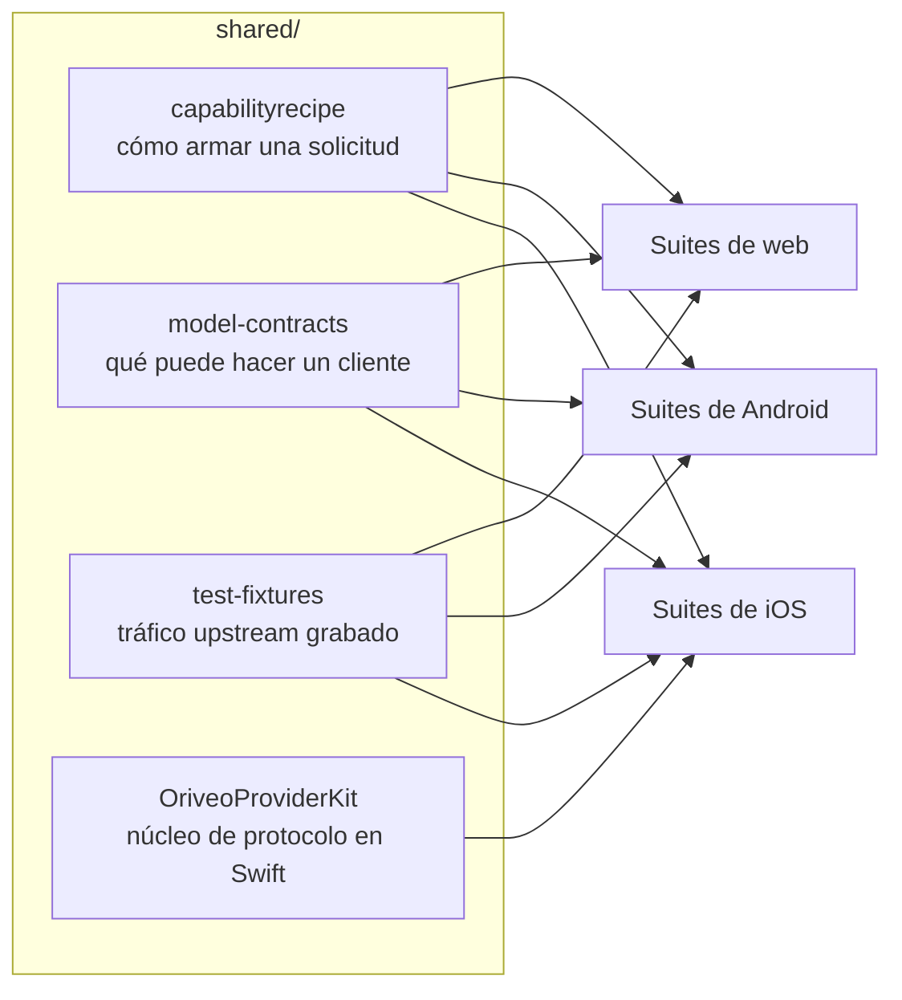

<div align="center">

# Contratos compartidos

**Una sola definición de cómo hablar con un proveedor de modelos, verificada por los tres clientes.**

<a href="../../LICENSE"></a>


<sub>

<a href="../../shared/README.md">English</a> ·
<a href="../ar/shared.md">العربية</a> ·
<a href="../de/shared.md">Deutsch</a> ·
**Español** ·
<a href="../fr/shared.md">Français</a> ·
<a href="../hi/shared.md">हिन्दी</a> ·
<a href="../id/shared.md">Indonesia</a> ·
<a href="../ja/shared.md">日本語</a> ·
<a href="../ko/shared.md">한국어</a> ·
<a href="../pt-BR/shared.md">Português</a> ·
<a href="../ru/shared.md">Русский</a> ·
<a href="../th/shared.md">ไทย</a> ·
<a href="../tr/shared.md">Türkçe</a> ·
<a href="../vi/shared.md">Tiếng Việt</a> ·
<a href="../zh-Hans/shared.md">简体中文</a> ·
<a href="../zh-Hant/shared.md">繁體中文</a>

</sub>

</div>

---

Tres clientes que implementan «llamar al proveedor» cada uno por su cuenta van a divergir. Van a
divergir en silencio, en la dirección de aquel que alguien probó de último, y la divergencia va a
salir a la luz como un error que se reproduce en una plataforma y no en las otras.

`shared/` es la respuesta a eso: el comportamiento se escribe una vez como datos, y la suite de
pruebas de cada cliente verifica contra los mismos archivos. Una rareza que vive en esos datos se
arregla una vez. Una rareza que vive en un parser la atrapan tres suites al mismo tiempo, en lugar de
salir a producción en dos plataformas y romper la tercera.



## capabilityrecipe

El registro de recetas. Para un proveedor, un transporte y una capacidad dados —búsqueda web,
esfuerzo de razonamiento, generación de imágenes— dice exactamente qué punteros JSON escribir en la
solicitud saliente, y cómo leer la respuesta de vuelta.

Esto es lo que hace que un modelo lanzado hoy funcione sin actualizar el cliente, y es la razón por
la que ningún cliente adivina una capacidad a partir del nombre de un modelo.
`capability_runtime.v1.json` lleva las recetas en sí;
`capability_result_definitions.v1.json` y `capability_custom_controls.v2.json` definen cómo se
interpretan los resultados y los controles visibles para el usuario.

Cada receta declara un `executionKind` —`request_overlay`, `server_tool`, `client_tool_loop`,
`endpoint_route`, `model_route`, `external_connector`, `unavailable`— y el compilador de cada cliente
valida que la receta coincida con el proveedor, la capacidad y el transporte antes de aplicarla,
rechazándola con un motivo con nombre en lugar de enviar una solicitud que nadie revisó. La lista es
un conjunto cerrado: una receta que nombre cualquier otra cosa se rechaza en lugar de adivinarse.

## model-contracts

Fixtures JSON que fijan el comportamiento común a todos los clientes: cómo debe verse una solicitud
para un proveedor y una capacidad dados, cómo se resuelven los parámetros de generación y cómo se
superponen las redefiniciones, qué estados de capacidad puede presentar un cliente, y cómo se
consumen el catálogo de modelos y su evidencia.

Las pruebas de cada cliente las cargan directamente, así que un cambio aquí es un cambio en los tres
clientes a la vez.

## test-fixtures

Datos de prueba de referencia: tráfico upstream grabado de llamadas a herramientas, enrutamiento de
relay, validación de formularios, clasificación de direcciones locales, escenarios de catálogo y de
configuración portable, snapshots de model facts y de evidencia de capacidades, y escenarios de
motores locales.

Los archivos `.sse` que están bajo `recorded/` son **tráfico upstream real capturado**, conservado
byte a byte tal como llegó: solo se quitaron las cabeceras de la respuesta, y los cuerpos nunca
llevaron una clave. El resto son fixtures escritos a mano que fijan una ruta de parseo concreta. La
distinción importa: un mock escrito a mano codifica lo que tú creías que hace el proveedor, mientras
que una grabación codifica lo que realmente hizo, incluido el chunk mal formado que envió aquel
martes. Cuando una corrección de protocolo de proveedor necesita una prueba, prefiere una grabación.

El `$comment` de un fixture, o el manifiesto `expected.json` que está a su lado, dice qué fijan las
entradas de alrededor. Lee eso antes de añadir un caso.

## OriveoProviderKit

Un paquete de Swift con el núcleo del protocolo de red de los proveedores: ensamblado de líneas SSE,
parseo de chunks compatibles con OpenAI, ensamblado basado en eventos para los protocolos Responses /
Anthropic Messages / Gemini, construcción de solicitudes neutral respecto al transporte, compilación
de recetas y sus guardas de ejecución, codificación de nombres de herramientas, ocultamiento de
credenciales, clasificación de errores del upstream, parseo de etiquetas de razonamiento, extracción
de rutas JSON en streaming, una política explícita de redirecciones de `URLSession` y perfiles de
rarezas por proveedor.

Su alcance está trazado deliberadamente estrecho. **Dentro:** conocimiento de red basado solo en
Foundation. **Fuera:** modelos de la app, interfaz, base de datos, telemetría, localización. El
paquete no depende de nada más allá de la biblioteca estándar y Foundation, y cada cliente de Apple
mantiene un enlace fino alrededor de él, para que el comportamiento de red tenga exactamente una
implementación.

Implementa toda la ruta de solicitud y streaming para las plataformas de Apple. La app de iOS enlaza
hoy un subconjunto de él —los ensambladores de streams, los perfiles de red, el códec de nombres de
herramientas y los clasificadores de errores— y mantiene sus propios constructores de solicitudes; el
cliente de macOS en desarrollo es el segundo consumidor, y por eso el compilador de recetas y el
constructor de solicitudes neutral respecto al transporte viven aquí y no dentro de una sola app. La
suite de abajo cubre las partes que comparte todo consumidor: división de SSE, ensamblado compatible
con OpenAI, el códec de nombres de herramientas y la política de redirecciones.

```bash
cd shared/OriveoProviderKit && swift build && swift test
```

- Plataformas: iOS 18+, macOS 15+ · `swift-tools-version: 6.1`
- `ProviderWireProfile` lleva las rarezas residuales de cada proveedor que un único ensamblador
  compatible con OpenAI todavía necesita: dónde llega el texto de razonamiento, dónde viven los
  contadores de tokens en caché, si los tokens del prompt ya incluyen los aciertos de caché. Describe
  *cómo llegan los bytes*, nunca *qué puede hacer un modelo*; de eso se encargan las recetas.

## Trabajar en estos archivos

Un cambio aquí es un cambio en todos los clientes. Ejecuta las suites de contrato de cada cliente que
lea el archivo que tocaste, no solo la del cliente en el que te toca trabajar:

Desde la raíz del repositorio:

```bash
(cd web && npm run test:run)
(cd shared/OriveoProviderKit && swift test)
# plus the iOS and Android suites — see their READMEs
```

Las suites de iOS localizan este directorio subiendo desde el archivo de prueba hasta ver `shared/`;
las de Android resuelven `../../shared` desde el módulo de Gradle; las de web lo resuelven relativo
al workspace. Todas ellas requieren, por lo tanto, un checkout completo del repositorio.

## Licencia

[AGPL-3.0-or-later](../../LICENSE).
