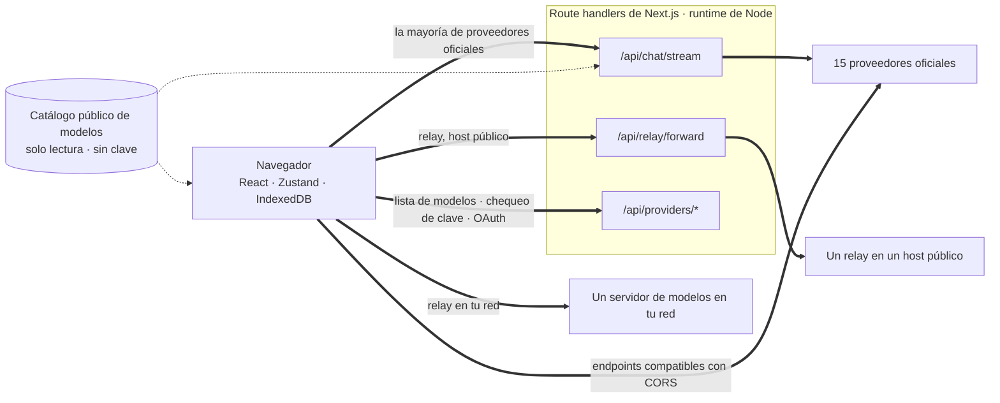
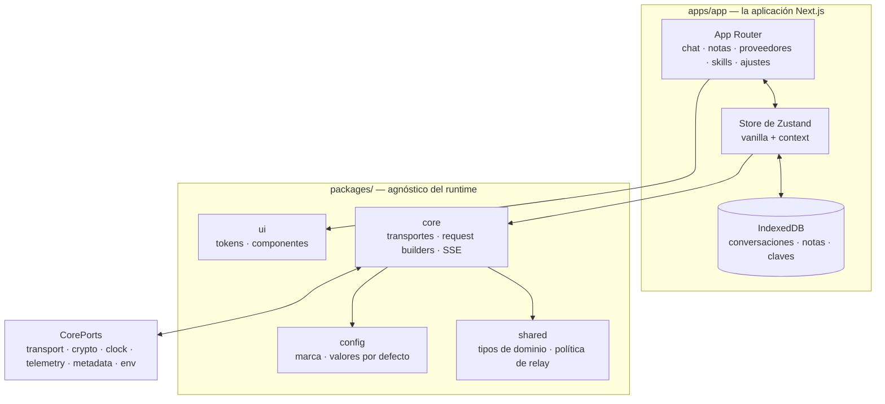

<div align="center">

# Oriveo para la web

**Un cliente de chat en Next.js para los modelos de IA que ya pagas.**

<a href="../../LICENSE"></a>


<sub>

<a href="../../web/README.md">English</a> ·
<a href="../ar/web.md">العربية</a> ·
<a href="../de/web.md">Deutsch</a> ·
**Español** ·
<a href="../fr/web.md">Français</a> ·
<a href="../hi/web.md">हिन्दी</a> ·
<a href="../id/web.md">Indonesia</a> ·
<a href="../ja/web.md">日本語</a> ·
<a href="../ko/web.md">한국어</a> ·
<a href="../pt-BR/web.md">Português</a> ·
<a href="../ru/web.md">Русский</a> ·
<a href="../th/web.md">ไทย</a> ·
<a href="../tr/web.md">Türkçe</a> ·
<a href="../vi/web.md">Tiếng Việt</a> ·
<a href="../zh-Hans/web.md">简体中文</a> ·
<a href="../zh-Hant/web.md">繁體中文</a>

</sub>

</div>

---

El cliente web de Oriveo es una app de chat de IA que funciona con tus propias claves, construida con
Next.js. Conversaciones, notas, carpetas, Skills y tus claves de proveedor viven en el propio
almacenamiento del navegador. No hay cuenta ni inicio de sesión.

Forma parte de [Oriveo Community Edition](README.md): tres clientes que comparten una sola definición
de cómo hablar con un proveedor de modelos.

## Inicio rápido

Requiere Node 22 (ver [`.nvmrc`](../../web/.nvmrc)). npm viene incluido; no hace falta ningún otro
gestor de paquetes.

```bash
npm install
npm run dev:app     # http://localhost:3001
```

La primera pantalla pide una clave de API de un proveedor. No hace falta nada más para empezar a
chatear.

## Cómo viaja realmente una solicitud

Esta es la parte que vale la pena leer antes que cualquier otra, porque el cliente web es el único
lugar donde una solicitud normalmente **no** va directo del cliente al proveedor.



**Por qué existe el rodeo.** La mayoría de las API de los proveedores no envían encabezados CORS, así
que un navegador no puede llamar a `api.openai.com` y compañía directamente: el preflight falla. Todo
cliente BYOK de navegador tiene que resolver esto de alguna manera; este lo reenvía a través de route
handlers de Next.js que corren en el runtime de Node. Cuando ejecutas `npm run dev:app`, esos
handlers están en tu propia máquina. Cuando despliegas la app en algún lado, están en la máquina
donde la desplegaste.

No es uno solo: el streaming de chat, el reenviador de relay, la generación de imágenes, la lista de
modelos, la validación de claves y los intercambios de device login de Grok y Codex suman doce
archivos de ruta en total. La validación de claves importa aquí: le manda la clave a tu propio
servidor, que sondea al proveedor con ella.

Unos pocos endpoints *sí* admiten un navegador, y esos se llaman directamente, sin ningún servidor en
medio: el endpoint chino de Kimi (`api.moonshot.cn`) para chat, y los endpoints de saldo de
OpenRouter, SiliconFlow, DeepSeek y Kimi.

**Qué hace y qué no hace el handler.** Valida la forma de la solicitud y limita su tamaño, aplica un
límite de tasa por IP al tráfico de chat y de relay, rechaza las URL que resuelven a direcciones
privadas o link-local, arma el cuerpo específico del proveedor y devuelve la respuesta en streaming.
No hay base de datos, ni escritura en el sistema de archivos, ni registro de cuerpos de solicitud en
ninguna parte bajo `app/api`: tu clave y tus mensajes se reenvían y se olvidan. Como la ruta es un
único proceso compartido por todos los visitantes, una prueba dedicada
(`server-never-learns.test.ts`) fija que nunca cachea el parámetro rechazado de un usuario para
aplicárselo a la solicitud de otro.

El reenviador de relay además fija el DNS a la dirección que resolvió, limita la respuesta, acota
cada timeout, restringe las redirecciones al mismo origen y se niega a dejar pasar encabezados
hop-by-hop.

**Los endpoints locales se lo saltan por completo.** Un relay en una dirección privada, un nombre
`.local`, `localhost`, o uno configurado en modo HTTP local o VPN privada se consulta **directamente
desde el navegador**, con `credentials: 'omit'` y `targetAddressSpace: 'local'`. Tu tráfico de red
local no sale de tu red, y tampoco pasa por el servidor de la app.

## Arquitectura



`packages/core` contiene cada byte de conocimiento sobre protocolos de proveedores y se mantiene
deliberadamente libre de globales del navegador: eslint prohíbe ahí dentro y en
`packages/ipc-contract` `window`, `document`, `fetch`, `crypto`, `localStorage`, `sessionStorage` e
`indexedDB`. Todo lo que necesita del entorno llega a través de `CorePorts`. Eso es lo que permite
que el mismo código corra en un navegador, en un route handler de Node y en una prueba sin DOM.

El soporte de proveedores son dos ejes independientes. `providerKind` elige un **request builder**
(cómo se ve el cuerpo para ese proveedor). `model.transport` elige una **estrategia de transporte**
(qué protocolo de red se habla) entre doce, y se resuelve por modelo desde el catálogo, no por
proveedor, así que dos modelos detrás de la misma clave pueden no coincidir. Una estrategia
implementa exactamente tres métodos: `buildRequestBody`, `parseStreamChunk`, `parseError`.

## Workspaces

```
apps/app/               the Next.js application
packages/core/          provider protocols: transports, request builders, SSE parsing
packages/shared/        domain types, relay policy, helpers
packages/ui/            design tokens and shared components
packages/config/        brand and provider defaults
packages/ipc-contract/  typed channel contract for a desktop shell
```

El estilo son CSS Modules sobre una única hoja de tokens en propiedades personalizadas en
`packages/ui`: no hay ningún framework de clases utilitarias. `packages/ipc-contract` describe la
superficie de canal a la que se enlazaría un shell de escritorio; en este repositorio no se publica
ningún shell así, de modo que en la build web ese paquete solo aporta tipos y ramas que nunca se
toman.

## Almacenamiento

Todo es por partición, indexado por un id activo que por defecto es `guest`.

| Qué | Dónde |
|---|---|
| Conversaciones, mensajes, carpetas, notas, proveedores | IndexedDB `oriveo--{id}`, 8 object stores |
| Snapshot del catálogo de modelos (~3 MB) y model facts | store de blobs de IndexedDB, deliberadamente no localStorage |
| Preferencias y tablas de controles de modelo | `localStorage`, con `safeLocalStorage` envolviendo las rutas en las que se vio que lanzaba |
| Imágenes generadas y adjuntas | una base de datos IndexedDB aparte |

Dos detalles que salieron de fallas reales y no del gusto. El snapshot del catálogo vive en IndexedDB
porque con sus ~3 MB se comía casi toda la cuota de 5 MB de localStorage de un origen del navegador.
Y cada acceso a localStorage pasa por `safeLocalStorage`, porque el *getter* `window.localStorage`
en sí lanza `SecurityError` cuando el navegador está configurado para bloquear datos de sitio: una
lectura sin más hace caer la página antes de que tu bloque `try` llegue siquiera a ejecutarse.

> [!IMPORTANT]
> En la web, las claves de proveedor se guardan en IndexedDB **sin cifrar**: el mismo modelo que usan
> en general los clientes BYOK basados en navegador, porque un navegador no tiene mejor sitio donde
> ponerlas. Para la garantía más fuerte, usa el cliente de iOS o Android, donde el keychain o el
> keystore del sistema las cifra. Los archivos de copia de seguridad son otra historia: esos se
> cifran con AES-256-GCM y PBKDF2-SHA-256 a 600.000 iteraciones cuando eliges una contraseña.

## El catálogo de modelos

Qué modelos ofrece cada proveedor, y qué admite cada uno, viene de un catálogo de solo lectura que se
descarga al arrancar. Se piden exactamente dos endpoints, ambos con `GET`, ambos condicionales por
ETag, y ninguno lleva clave de API, conversación ni identificador de usuario:

```
GET {backend}/api/metadata?view=lean
GET {backend}/api/metadata/model-facts
```

El backend por defecto es `https://api.oriveoai.com`. Apunta `NEXT_PUBLIC_BACKEND_URL` a tu propio
host para servirlo tú. La respuesta se guarda en caché 24 horas en IndexedDB y se revalida con
`If-None-Match`; cuando el catálogo no está accesible, la app sigue funcionando desde su copia en
caché.

## Comandos

Ejecútalos desde este directorio.

| Comando | Qué hace |
|---|---|
| `npm run dev:app` | servidor de desarrollo en el puerto 3001 |
| `npm run build:app` | build de producción |
| `npm run typecheck` | `tsc --noEmit` en todos los workspaces |
| `npm run test:run` | vitest, una pasada |
| `npm run test` | vitest en modo watch |
| `npm run lint` | eslint sobre `apps/` y `packages/` |

Para ejecutar un solo archivo de pruebas, hazlo desde el workspace al que pertenece, porque varias
suites resuelven sus fixtures relativas al directorio de trabajo:

```bash
cd apps/app && npx vitest run lib/core/chat/__tests__/stream-options.test.ts
```

## Configuración

Todo es opcional. Copia [`.env.example`](../../web/.env.example) a `.env.local` y define solo lo que
necesites; cada clave está documentada ahí. Hay algunas variables que el código lee y que no están
en ese archivo: `BACKEND_URL` (un gemelo solo del lado del servidor de `NEXT_PUBLIC_BACKEND_URL`),
`NEXT_PUBLIC_LIBRARY_ENABLED`, `ORIVEO_DESKTOP` y `NEXT_DIST_DIR`.

### Reporte de errores

La app incluye el SDK de Sentry. Es **inerte sin un DSN**: sin `NEXT_PUBLIC_SENTRY_DSN` no hay
transporte, no hay eventos, no se envía nada a ninguna parte, y ese es el valor por defecto de una
build hecha desde este repositorio. Si defines uno, obtienes reporte de errores, 10 % de trazas de
rendimiento y 1 % de session replay, con hooks que quitan las claves de proveedor, los endpoints y el
contenido de los mensajes antes de que un evento salga del navegador. Está aquí para que un
despliegue que quiera reporte de errores pueda tenerlo, no porque esta build llame a casa.

## Pruebas

Unas 4.600 pruebas repartidas en 461 archivos, sobre vitest. La cobertura más densa está donde un
error sale más caro: forma de la solicitud por proveedor, comportamiento del transporte por protocolo
de red, parseo de chunks de SSE y del proxy, parseo de uso y costos, clasificación de errores, sondeo
de relay y modos de seguridad, la protección contra SSRF, ejecución de recetas de capacidad, caché
del catálogo e invalidación por versión de contrato, persistencia en IndexedDB, particionado del
almacenamiento, ciclos completos de copia de seguridad y los propios route handlers.

> [!IMPORTANT]
> Unas 24 suites cargan fixtures de contrato desde `../shared`, así que **las pruebas solo pasan en
> un checkout completo**: copiar `web/` por su cuenta no funcionará.

## Localización

Dieciséis configuraciones regionales en `apps/app/messages`, con unas 1.800 claves cada una y el
inglés como fuente. Una prueba recorre el directorio y falla si el conjunto de claves de alguna
difiere del inglés, así que agregar un archivo de idioma lo inscribe automáticamente. El árabe tiene
un diseño completo de derecha a izquierda. La selección de idioma sigue un parámetro `?locale=`
explícito, luego una cookie, y luego `Accept-Language`.

## Contribuir

Mira [CONTRIBUTING.md](../../CONTRIBUTING.md). `packages/core` está pensado primero en el transporte:
agregar un proveedor suele ser un request builder y un adaptador de respuesta, no un cliente nuevo.
Para una corrección de protocolo de proveedor, prefiere un fixture grabado en `shared/test-fixtures`
antes que un mock escrito a mano.

## Licencia

[AGPL-3.0-or-later](../../LICENSE).
