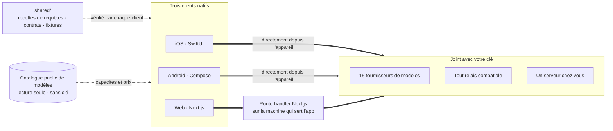

<div align="center">


# Oriveo

**Tous les modèles, une seule app.**

Chat IA open source avec vos propres clés, pour iOS, Android et le web.
Pas de compte, pas d'abonnement, et aucun service à nous sur le trajet des requêtes.

<a href="../../LICENSE"></a>
<a href="ios.md"></a>
<a href="android.md"></a>
<a href="web.md"></a>


<a href="https://oriveoai.com">Site web</a> &nbsp;·&nbsp;
<a href="#démarrer">Démarrer</a> &nbsp;·&nbsp;
<a href="#architecture">Architecture</a> &nbsp;·&nbsp;
<a href="#community-edition-et-oriveo">Éditions</a> &nbsp;·&nbsp;
<a href="#faq">FAQ</a> &nbsp;·&nbsp;
<a href="../../CONTRIBUTING.md">Contribuer</a>

<sub>

<a href="../../README.md">English</a> ·
<a href="../ar/README.md">العربية</a> ·
<a href="../de/README.md">Deutsch</a> ·
<a href="../es/README.md">Español</a> ·
**Français** ·
<a href="../hi/README.md">हिन्दी</a> ·
<a href="../id/README.md">Indonesia</a> ·
<a href="../ja/README.md">日本語</a> ·
<a href="../ko/README.md">한국어</a> ·
<a href="../pt-BR/README.md">Português</a> ·
<a href="../ru/README.md">Русский</a> ·
<a href="../th/README.md">ไทย</a> ·
<a href="../tr/README.md">Türkçe</a> ·
<a href="../vi/README.md">Tiếng Việt</a> ·
<a href="../zh-Hans/README.md">简体中文</a> ·
<a href="../zh-Hant/README.md">繁體中文</a>

</sub>

</div>

---

## Ce qu'est Oriveo

Oriveo Community Edition est un client de chat IA pour iOS, Android et le web, qui fonctionne avec
vos propres clés (BYOK). Vous fournissez des clés API que vous possédez déjà, et le client s'adresse
au fournisseur avec celles-ci. Il n'y a pas de compte Oriveo ni d'abonnement, et rien ne fait
remonter quoi que ce soit vers nous.

Il parle nativement à **15 fournisseurs de modèles** — OpenAI, Anthropic, Google Gemini, OpenRouter,
DeepSeek, Grok, Mistral, Groq, Together AI, Fireworks AI, MiniMax, Z.ai, Qwen, Kimi (Moonshot) et
SiliconFlow — ainsi qu'à **tout endpoint compatible OpenAI, Anthropic ou Gemini** que vous lui
indiquez, y compris llama.cpp, Ollama, LM Studio ou vLLM tournant sur votre propre machine.

| | |
|---|---|
| **Fournisseurs** | 15 intégrés, plus vos endpoints Relay et vos serveurs de modèles locaux |
| **Clients** | iOS (SwiftUI) · Android (Jetpack Compose) · Web (Next.js) |
| **Langues d'interface** | 16 |
| **Compte requis** | Aucun |
| **Appels qu'il passe pour lui-même** | Une seule chose, en deux requêtes : un catalogue de modèles en lecture seule, sans clé ni identifiant |
| **Licence** | AGPL-3.0-or-later |

## Pourquoi il existe

Personne ne devrait pouvoir comptabiliser, journaliser ni majorer le modèle que vous payez.

- **Vos clés, votre facture.** Vous payez le tarif public du fournisseur. Rien n'est majoré, compté
  ni revendu.
- **Local par défaut.** Conversations, notes, dossiers, Skills et pièces jointes vivent sur
  l'appareil. Exportez-les dans un fichier quand vous voulez ; il n'y a pas de copie dans le cloud
  dont vous pourriez perdre l'accès.
- **Un seul comportement, trois clients.** La forme d'une requête pour un fournisseur, un transport
  et une capacité donnés est écrite une fois dans [`shared/`](shared.md), et les trois clients
  vérifient contre les mêmes fixtures JSON. Une bizarrerie qui vit dans ces données se corrige une
  fois ; une qui vit dans un parseur se fait attraper par trois suites de tests à la fois.
- **Le seul appel qu'il passe.** L'app récupère un catalogue public de modèles pour qu'un modèle
  sorti aujourd'hui fonctionne sans mise à jour de l'app. Il est en lecture seule, ne transporte ni
  clé ni identifiant, et vous pouvez le pointer vers votre propre hôte.

## Fonctionnalités

- **Chat** — streaming, blocs de raisonnement, citations, pièces jointes (images, PDF, Office, EPUB,
  HTML, texte brut), citer une sélection, réessayer, régénérer, reprendre après une réponse
  interrompue
- **Fournisseurs** — 15 intégrés, chacun avec votre propre clé ; endpoint, modèle et paramètres
  redéfinissables par fournisseur
- **Relay** — tout endpoint compatible OpenAI, Anthropic ou Gemini, y compris sur votre réseau local
- **Serveurs de modèles locaux** — llama.cpp, Ollama, LM Studio, vLLM ; les clients iOS et Android
  les découvrent sur le réseau local via mDNS
- **Connexion par abonnement** — utilisez un abonnement Codex ou Grok que vous détenez déjà au lieu
  d'une clé API
- **Skills** — des prompts système réutilisables avec leur propre modèle, leurs paramètres et leurs
  documents de référence
- **Notes et dossiers** — capturer une réponse en note, organiser les conversations, recherche plein
  texte
- **Cross-check** — reposer la même question à un second modèle et garder les deux réponses côte à
  côte
- **Coût** — dépense par message et par fournisseur, calculée sur l'appareil à partir de ce que
  chaque réponse a réellement rapporté, paliers de remise sur cache compris
- **Génération d'images** — là où le fournisseur la prend en charge
- **Sauvegarde** — exportez tout dans un fichier, chiffré au besoin avec un mot de passe de votre
  choix
- **16 langues d'interface**, dont une mise en page entièrement droite-à-gauche pour l'arabe

## Community Edition et Oriveo

Ce dépôt est **Oriveo Community Edition**, sous licence [AGPL-3.0-or-later](../../LICENSE). Les apps
sur l'App Store, sur Google Play et l'app web hébergée sont **Oriveo** — un produit propriétaire
distinct, construit à partir des mêmes clients, avec une couche de compte par-dessus.

| | Community Edition | Oriveo |
|---|---|---|
| Source | Ce dépôt, AGPL-3.0-or-later | Propriétaire |
| Chat avec vos propres clés de fournisseur | Oui | Oui |
| Relay et serveurs de modèles locaux | Oui | Oui |
| Notes, dossiers, Skills, pièces jointes | Oui | Oui |
| Suivi des coûts sur l'appareil | Oui | Oui |
| Compte | Aucun | Compte Oriveo |
| Stockage | Sur l'appareil ; export et restauration manuels | Local d'abord, plus synchronisation cloud multi-appareils |
| Analyse d'usage et alertes de budget | — | Oui |
| Modèles payés par Oriveo | — | Oui |
| Analytique et rapports de crash | Désactivé par défaut — le bundle web embarque Sentry, muet sans DSN | Oui |

Les builds Community Edition utilisent le préfixe d'identifiant `ai.oriveo.community`, de sorte
qu'un build peut cohabiter avec un build du store sans partager de keychain ni de données locales.
Ce que cette édition accepte et refuse est écrit dans [COMMUNITY.md](../../COMMUNITY.md).

**Oriveo, le produit complet :**
[iPhone et iPad](https://apps.apple.com/app/oriveo/id6775370458) &nbsp;·&nbsp;
[Android](https://play.google.com/store/apps/details?id=com.kenny.oriveo) &nbsp;·&nbsp;
[Web](https://app.oriveoai.com) &nbsp;·&nbsp;
[oriveoai.com](https://oriveoai.com)

## Fournisseurs

Chaque fournisseur ci-dessous est joint avec une clé que vous créez vous-même.

| Fournisseur | Où obtenir une clé |
|---|---|
| OpenAI | [platform.openai.com](https://platform.openai.com/api-keys) |
| Anthropic | [console.anthropic.com](https://console.anthropic.com/settings/keys) |
| Google Gemini | [aistudio.google.com](https://aistudio.google.com/apikey) |
| OpenRouter | [openrouter.ai](https://openrouter.ai/keys) |
| DeepSeek | [platform.deepseek.com](https://platform.deepseek.com/api_keys) |
| Grok | [console.x.ai](https://console.x.ai/) |
| Mistral | [console.mistral.ai](https://console.mistral.ai/api-keys) |
| Groq | [console.groq.com](https://console.groq.com/keys) |
| Together AI | [api.together.xyz](https://api.together.xyz/settings/api-keys) |
| Fireworks AI | [fireworks.ai](https://fireworks.ai/api-keys) |
| MiniMax | [platform.minimax.io](https://platform.minimax.io/docs/guides/quickstart-preparation) |
| Z.ai | [open.bigmodel.cn](https://open.bigmodel.cn/usercenter/apikeys) |
| Qwen | [bailian.console.alibabacloud.com](https://bailian.console.alibabacloud.com/?apiKey=1#/api-key) |
| Kimi (Moonshot) | [platform.kimi.ai](https://platform.kimi.ai/console/api-keys) |
| SiliconFlow | [cloud.siliconflow.cn](https://cloud.siliconflow.cn/account/ak) |
| **Relay** | Tout endpoint compatible OpenAI, Anthropic ou Gemini, y compris sur votre propre machine |

## Architecture

Trois clients natifs, une seule définition de la façon de parler à un fournisseur de modèles.



Chaque client possède sa propre interface, son propre stockage et sa propre navigation, et rejoint
les contrats partagés en exactement une couture : la couche qui transforme *ce modèle, cette
capacité* en requête HTTP.

La seule asymétrie qui mérite d'être connue, c'est le client web. La plupart des API des
fournisseurs n'envoient pas d'en-têtes CORS, un navigateur ne peut donc pas les appeler
directement ; ces requêtes passent par un route handler Next.js tournant sur la machine qui sert
l'app — la vôtre, quand vous la lancez en local. Les rares endpoints qui autorisent bel et bien un
navigateur (l'endpoint chinois de Kimi, les endpoints de solde de quelques fournisseurs) et les
relais sur votre propre réseau sont appelés directement. Les clients iOS et Android n'ont pas cette
contrainte et vont toujours droit au fournisseur.

**L'architecture de chaque client :**

| | Stack | README |
|---|---|---|
| **iOS** | SwiftUI avec un fil UIKit, GRDB | [ios.md](ios.md) |
| **Android** | Jetpack Compose, Room, Koin, Ktor/OkHttp | [android.md](android.md) |
| **Web** | Next.js App Router, React, Zustand, TypeScript | [web.md](web.md) |
| **Shared** | Contrats, fixtures enregistrées et le noyau de protocole Swift | [shared.md](shared.md) |

## Démarrer

Il n'y a pas de binaires précompilés ici — pas d'APK, pas de `.ipa`, pas de releases. Community
Edition, ce sont des sources que vous compilez vous-même, et les apps du store sont l'autre produit.
Le client web est le chemin le plus court vers une app qui tourne.

<details open>
<summary><b>Web</b> — le moyen le plus rapide d'essayer</summary>

<br>

Nécessite Node 22 (voir [`web/.nvmrc`](../../web/.nvmrc)).

```bash
cd web
npm install
npm run dev:app        # http://localhost:3001
```

Le premier écran demande une clé API de fournisseur. Rien d'autre n'est requis.
Plus de commandes et de configuration : [web.md](web.md).

</details>

<details>
<summary><b>iOS</b> — compiler et lancer sur votre propre iPhone</summary>

<br>

Nécessite un Mac avec Xcode 26 et un appareil sous iOS 18 ou plus récent. Un compte Apple Developer
gratuit suffit — l'app n'utilise aucune capability payante.

1. Ouvrez `ios/Oriveo/Oriveo.xcodeproj`
2. Sélectionnez le schéma `Oriveo`
3. Sous Signing &amp; Capabilities, choisissez votre propre Team
4. Lancez

Marche à suivre complète, y compris que faire si Xcode refuse d'ouvrir le projet :
[ios.md](ios.md).

</details>

<details>
<summary><b>Android</b> — compiler l'APK</summary>

<br>

Nécessite JDK 21 et le SDK Android. Le build utilise AGP 9.3, Gradle 9.5 et Kotlin 2.3, Android
Studio doit donc être une version capable de les synchroniser ; en ligne de commande, seuls le JDK
et le SDK sont nécessaires.

```bash
cd android
./gradlew :app:assembleDebug
```

Servir le catalogue de modèles depuis votre propre hôte : [android.md](android.md).

</details>

## Confidentialité

- **Les clés de fournisseur** vont dans le Keychain iOS et, sur Android, dans
  `EncryptedSharedPreferences` sous une clé conservée dans le Keystore Android. Un navigateur n'a pas
  d'équivalent, alors sur le web elles restent non chiffrées dans IndexedDB — le modèle qu'emploient
  généralement les clients BYOK en navigateur. Pour la garantie la plus forte, utilisez le client iOS
  ou Android.
- **Conversations, notes, dossiers, Skills et pièces jointes** sont stockés sur l'appareil. Rien
  n'est téléversé nulle part.
- **Pas de compte, et rien qui fasse remonter quoi que ce soit vers nous.** Il n'y a rien où se
  connecter. Le bundle web embarque Sentry, qui reste muet tant que vous ne configurez pas votre
  propre DSN.
- **Sur iOS et Android, les requêtes de chat vont directement de l'appareil au fournisseur.** Sur le
  web la plupart passent par le serveur Next.js qui sert l'app, parce que la plupart des API de
  fournisseurs n'autorisent pas un appel direct depuis un navigateur ; ce serveur ne conserve ni
  clés ni messages, et lorsque vous lancez l'app en local, c'est votre propre machine.
- **Une seule requête à nous :** un catalogue de modèles en lecture seule, récupéré sans clé, sans
  conversation et sans identifiant, pour qu'un modèle sorti aujourd'hui fonctionne sans nouveau
  build. Pointez-le vers votre propre hôte si vous préférez le servir vous-même.

## FAQ

<details>
<summary><b>Que veut dire BYOK ?</b></summary>

<br>

Bring your own key, apportez votre propre clé. Vous créez une clé API dans la console du fournisseur
— OpenAI, Anthropic, Google, etc. — et vous la collez dans Oriveo. Les requêtes sont facturées par
ce fournisseur à son tarif public. Oriveo est le client ; ce n'est pas un revendeur et il ne prend
aucune commission.

</details>

<details>
<summary><b>Mes conversations passent-elles par un serveur Oriveo ?</b></summary>

<br>

Non. Sur iOS et Android, le client appelle l'endpoint du fournisseur directement. Sur le web, la
plupart des requêtes passent par le serveur Next.js qui sert l'app — votre propre machine quand vous
la lancez en local — parce que la plupart des API de fournisseurs refusent un appel direct depuis un
navigateur ; les rares qui l'autorisent sont appelées directement. Aucun de ces chemins n'implique
un serveur exploité par Oriveo. La seule requête qu'Oriveo passe pour son propre compte est une
récupération en lecture seule du catalogue public de modèles, qui ne transporte ni clé, ni
conversation, ni identifiant.

</details>

<details>
<summary><b>Puis-je utiliser un modèle qui tourne sur ma propre machine ?</b></summary>

<br>

Oui. Ajoutez une connexion Relay pointant vers n'importe quel serveur compatible OpenAI, Anthropic
ou Gemini — llama.cpp, Ollama, LM Studio, vLLM, ou tout autre chose parlant l'un de ces protocoles.
Les clients iOS et Android savent en découvrir un sur le réseau local via mDNS ; le client web
propose l'adresse par défaut de chaque moteur et la sonde. Le HTTP local n'utilise aucun identifiant
de connexion et ne quitte jamais votre réseau.

</details>

<details>
<summary><b>En quoi est-ce différent de l'app sur l'App Store ?</b></summary>

<br>

Les apps du store sont Oriveo, un produit propriétaire qui ajoute un compte, la synchronisation
cloud multi-appareils, l'analyse d'usage et des modèles qu'Oriveo paie. Community Edition, ce sont
les mêmes trois clients sans rien de tout cela : pas de compte, pas de service de synchronisation,
pas de facturation, et rien qui fasse remonter quoi que ce soit vers nous. Voir
[Community Edition et Oriveo](#community-edition-et-oriveo) pour la comparaison complète.

</details>

<details>
<summary><b>Existe-t-il un client macOS ?</b></summary>

<br>

Pas dans ce dépôt. En attendant, le client web fait très bien office d'app de bureau dans n'importe
quel navigateur, et le build iOS peut généralement être lancé sur un Mac Apple Silicon.

</details>

<details>
<summary><b>Dans quelles langues l'interface est-elle disponible ?</b></summary>

<br>

Seize : arabe, allemand, anglais, espagnol, français, hindi, indonésien, japonais, coréen,
portugais du Brésil, russe, thaï, turc, vietnamien, chinois simplifié et chinois traditionnel.
L'arabe bénéficie d'une mise en page entièrement droite-à-gauche.

</details>

## Structure du dépôt

```
ios/           iOS client (SwiftUI)
android/       Android client (Jetpack Compose)
web/           Web client (Next.js)
macos/         Reserved for a macOS client
shared/        Cross-client contracts, recorded fixtures, and the Swift wire kernel
readme_i18n/   These READMEs in fifteen more languages
docs/assets/   Images used by the READMEs
```

## Contribuer

Les rapports de bugs et les pull requests sont bienvenus.
[CONTRIBUTING.md](../../CONTRIBUTING.md) explique comment compiler chaque client et à quoi ressemble
une bonne pull request ; [COMMUNITY.md](../../COMMUNITY.md) décrit à quoi sert cette édition, et les
quelques types de changement qui ne seront pas acceptés, aussi bien écrits soient-ils.

Vous avez trouvé un problème de sécurité ? N'ouvrez pas d'issue publique —
[SECURITY.md](../../SECURITY.md) explique comment le signaler en privé, et ce que ce projet
considère ou non comme une vulnérabilité. Toute personne qui participe est tenue de respecter le
[code de conduite](../../CODE_OF_CONDUCT.md).

## Licence

[AGPL-3.0-or-later](../../LICENSE). Les contributions sont acceptées sous la même licence.
