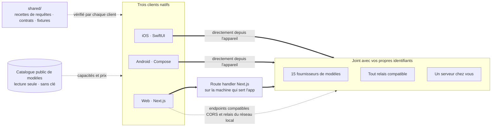

<div align="center">


# Oriveo Community Edition

**Tous les modèles, une seule app.**

Chat IA open source avec vos propres clés, pour iOS, Android et le web,
avec un client macOS natif en développement.
Pas de compte, pas d'abonnement, et aucun service à nous sur le trajet des requêtes de chat.

<a href="../../LICENSE"></a>
<a href="ios.md"></a>
<a href="android.md"></a>
<a href="web.md"></a>
<a href="macos.md"></a>
<a href="https://github.com/oriveo/oriveo/releases/latest"></a>
<a href="https://github.com/oriveo/oriveo/stargazers"></a>

**Obtenir Oriveo :**
<a href="https://oriveoai.com"><b>oriveoai.com</b></a> &nbsp;·&nbsp;
<a href="https://apps.apple.com/app/oriveo/id6775370458">App Store</a> &nbsp;·&nbsp;
<a href="https://play.google.com/store/apps/details?id=com.kenny.oriveo">Google Play</a> &nbsp;·&nbsp;
<a href="https://app.oriveoai.com">App web</a>

<sub>Les builds des stores sont <b>Oriveo</b>, l'édition commerciale. Ce dépôt, c'est la <a href="#community-edition-et-oriveo">Community Edition</a>, compilée depuis les sources.</sub>

<a href="#démarrer">Compiler depuis les sources</a> &nbsp;·&nbsp;
<a href="#architecture">Architecture</a> &nbsp;·&nbsp;
<a href="#community-edition-et-oriveo">Éditions</a> &nbsp;·&nbsp;
<a href="#faq">FAQ</a> &nbsp;·&nbsp;
<a href="../../CONTRIBUTING.md">Contribuer</a>

<sub>

<a href="../../README.md">English</a> ·
<a href="../ar/README.md">العربية</a> ·
<a href="../de/README.md">Deutsch</a> ·
<a href="../es/README.md">Español</a> ·
**Français** ·
<a href="../hi/README.md">हिन्दी</a> ·
<a href="../id/README.md">Indonesia</a> ·
<a href="../ja/README.md">日本語</a> ·
<a href="../ko/README.md">한국어</a> ·
<a href="../pt-BR/README.md">Português</a> ·
<a href="../ru/README.md">Русский</a> ·
<a href="../th/README.md">ไทย</a> ·
<a href="../tr/README.md">Türkçe</a> ·
<a href="../vi/README.md">Tiếng Việt</a> ·
<a href="../zh-Hans/README.md">简体中文</a> ·
<a href="../zh-Hant/README.md">繁體中文</a>

</sub>


</div>

---

## Ce qu'est Oriveo

Oriveo Community Edition est un client de chat IA (AI chat client) open source, multi-modèles
(multi-model), qui fonctionne avec vos propres clés (bring-your-own-key, BYOK), pour iOS, Android et
le web ; un client macOS natif est en développement. C'est une alternative local-first à un
abonnement hébergé ChatGPT ou Claude, pour les gens qui préfèrent payer un fournisseur de modèles
directement plutôt qu'un abonnement à ce qui se place devant. Vous fournissez des clés API que vous
possédez déjà, le client s'adresse au fournisseur avec celles-ci, et le client web est à vous, à
héberger vous-même (self-host) — pas de compte Oriveo, et rien qui fasse remonter quoi que ce soit
vers nous.

Il parle nativement à **15 fournisseurs de modèles** — OpenAI, Anthropic, Google Gemini, OpenRouter,
DeepSeek, Grok, Mistral, Groq, Together AI, Fireworks AI, MiniMax, Z.ai, Qwen, Kimi (Moonshot) et
SiliconFlow — ainsi qu'à **tout endpoint compatible OpenAI, Anthropic ou Gemini** que vous lui
indiquez, y compris llama.cpp, Ollama, LM Studio ou vLLM tournant sur votre propre machine. Un seul
client LLM (LLM client), un seul jeu de conversations, quel que soit le modèle qui répond.

<table>
<tr>
<td width="33%" valign="top"><b>15 fournisseurs</b><br>Plus les endpoints de relais et les serveurs de modèles locaux.</td>
<td width="33%" valign="top"><b>Local par défaut</b><br>Conversations, notes, dossiers, compétences et pièces jointes restent sur l'appareil.</td>
<td width="33%" valign="top"><b>Un comportement, trois clients</b><br>Une spécification dans <code>shared/</code>, trois suites la vérifient.</td>
</tr><tr>
<td valign="top"><b>Pas de compte</b><br>Rien ne fait remonter quoi que ce soit vers nous.</td>
<td valign="top"><b>Auto-hébergement</b><br>Le client web tourne sur votre machine.</td>
<td valign="top"><b>16 langues</b><br>Mise en page entièrement droite-à-gauche pour l'arabe.</td>
</tr></table>

## Pourquoi il existe

Personne ne devrait pouvoir comptabiliser, journaliser ni majorer le modèle que vous payez.

- **Vos clés, votre facture.** Vous payez le tarif public du fournisseur. Rien n'est majoré, compté
  ni revendu.
- **Local par défaut.** Conversations, notes, dossiers, compétences et pièces jointes vivent sur
  l'appareil. Exportez-les dans un fichier quand vous voulez ; il n'y a pas de copie dans le cloud
  dont vous pourriez perdre l'accès.
- **Un seul comportement, trois clients.** La forme d'une requête pour un fournisseur, un transport
  et une capacité donnés est écrite une fois dans [`shared/`](shared.md), et les trois clients
  vérifient contre les mêmes fixtures JSON. Une bizarrerie qui vit dans ces données se corrige une
  fois ; une qui vit dans un parseur se fait attraper par trois suites de tests à la fois.
- **La seule chose qu'il récupère.** Un catalogue public de modèles en lecture seule, pour qu'un
  modèle sorti aujourd'hui fonctionne sans mise à jour de l'app — sans clé, sans identifiant que nous
  y ajoutons, et pointable vers un hôte à vous.

## Fonctionnalités

- **Chat** — streaming, blocs de raisonnement, citations, pièces jointes (images et vidéo, PDF,
  Office (docx, xlsx, pptx), OpenDocument, EPUB, RTF, HTML, et tout fichier en texte brut ou en code
  source), citer une sélection, réessayer, régénérer, reprendre après une réponse interrompue
- **Fournisseurs** — 15 intégrés, chacun avec votre propre clé ; modèle et paramètres de génération
  redéfinissables par fournisseur, et le choix d'un endpoint régional là où le fournisseur en propose
  un
- **Service de relais (Relay)** — tout endpoint compatible OpenAI, Anthropic ou Gemini, plus l'API
  native de llama.cpp, y compris sur votre réseau local
- **Serveurs de modèles locaux** — llama.cpp, Ollama, LM Studio, vLLM, Open WebUI ; les clients iOS
  et Android les trouvent sur le réseau local via mDNS quand le moteur s'annonce, sinon en sondant
  les ports habituels
- **Connexion par abonnement** — utilisez un abonnement ChatGPT ou Grok que vous détenez déjà au lieu
  d'une clé API, via le flux d'autorisation par appareil propre à chaque fournisseur
- **Compétences** — des prompts système réutilisables avec leur propre modèle, leur réglage de
  raisonnement et leurs documents de référence
- **Notes et dossiers** — capturer une réponse en note, organiser les conversations, chercher dans les
  deux
- **Vérifier avec un autre modèle** — confier une réponse à un second modèle pour qu'il l'examine et
  garder les deux ensemble
- **Mémoire** — quelques faits sur vous, écrits une fois et repris dans chaque nouvelle conversation
- **Coût** — dépense par message et par fournisseur, calculée sur l'appareil à partir de ce que
  chaque réponse a réellement rapporté, paliers de lecture et d'écriture de cache compris
- **Génération d'images** — là où le fournisseur la prend en charge
- **Sauvegarde** — exportez tout dans un fichier ; les clés de fournisseur qu'il contient, si vous
  choisissez de les inclure, sont chiffrées avec un mot de passe à vous
- **16 langues d'interface**, dont une mise en page entièrement droite-à-gauche pour l'arabe

## Community Edition et Oriveo

Ce dépôt est **Oriveo Community Edition**, sous licence [AGPL-3.0-or-later](../../LICENSE). Les apps
sur l'App Store, sur Google Play et l'app web hébergée sont **Oriveo** — un produit propriétaire
distinct qui ajoute une couche de compte.

| | Community Edition | Oriveo |
|---|---|---|
| Source | Ce dépôt, AGPL-3.0-or-later | Propriétaire |
| Chat avec vos propres clés de fournisseur | Oui | Oui |
| Service de relais et serveurs de modèles locaux | Oui | Oui |
| Notes, dossiers, compétences, pièces jointes | Oui | Oui |
| Suivi des coûts sur l'appareil | Oui | Oui |
| Compte | Aucun | Compte Oriveo |
| Stockage | Sur l'appareil ; export et restauration manuels | Local d'abord, plus synchronisation cloud multi-appareils |
| Analyse d'usage et alertes de budget | — | Oui |
| Modèles payés par Oriveo | — | Oui |
| Analytique et rapports de crash | Aucune. Le Sentry du bundle web reste muet sans une DSN à vous | Oui |

Les builds Community Edition utilisent le préfixe d'identifiant `ai.oriveo.community`, de sorte
qu'un build peut se trouver sur le même appareil qu'un build du store sans que les deux partagent de
keychain ni aucune donnée locale. Ce que cette édition accepte et refuse est écrit dans
[COMMUNITY.md](../../COMMUNITY.md).

**Oriveo, le produit complet :** [iPhone et iPad](https://apps.apple.com/app/oriveo/id6775370458) ·
[Android](https://play.google.com/store/apps/details?id=com.kenny.oriveo) · [Web](https://app.oriveoai.com) · [oriveoai.com](https://oriveoai.com)

## Fournisseurs

Chaque fournisseur ci-dessous est joint avec une clé que vous créez vous-même. Deux d'entre eux
peuvent aussi être joints en vous connectant avec un abonnement que vous détenez déjà au lieu d'une
clé : OpenAI avec un abonnement ChatGPT, et Grok.

| Fournisseur | Où obtenir une clé |
|---|---|
| OpenAI | [platform.openai.com](https://platform.openai.com/api-keys) |
| Anthropic | [platform.claude.com](https://platform.claude.com/settings/keys) |
| Google Gemini | [aistudio.google.com](https://aistudio.google.com/apikey) |
| OpenRouter | [openrouter.ai](https://openrouter.ai/keys) |
| DeepSeek | [platform.deepseek.com](https://platform.deepseek.com/api_keys) |
| Grok | [console.x.ai](https://console.x.ai/) |
| Mistral | [console.mistral.ai](https://console.mistral.ai/api-keys) |
| Groq | [console.groq.com](https://console.groq.com/keys) |
| Together AI | [api.together.xyz](https://api.together.xyz/settings/api-keys) |
| Fireworks AI | [fireworks.ai](https://fireworks.ai/api-keys) |
| MiniMax | [platform.minimax.io](https://platform.minimax.io/docs/guides/quickstart-preparation) |
| Z.ai | [open.bigmodel.cn](https://open.bigmodel.cn/usercenter/apikeys) |
| Qwen | [bailian.console.alibabacloud.com](https://bailian.console.alibabacloud.com/?apiKey=1#/api-key) |
| Kimi (Moonshot) | [platform.kimi.ai](https://platform.kimi.ai/console/api-keys) |
| SiliconFlow | [cloud.siliconflow.cn](https://cloud.siliconflow.cn/account/ak) |
| **Service de relais** | Tout endpoint compatible OpenAI, Anthropic ou Gemini, plus l'API native de llama.cpp, y compris sur votre propre machine |

## Architecture

Trois clients natifs, une seule définition de la façon de parler à un fournisseur de modèles.



Chaque client possède sa propre interface, son propre stockage et sa propre navigation, et rejoint
les contrats partagés en exactement une couture : la couche qui transforme *ce modèle, cette
capacité* en requête HTTP.

La seule asymétrie qui mérite d'être connue, c'est le client web. La plupart des API des
fournisseurs n'envoient pas d'en-têtes CORS, un navigateur ne peut donc pas les appeler directement.
Ces requêtes passent par un route handler Next.js tournant sur la machine qui sert l'app — la vôtre,
quand vous la lancez en local. Les rares endpoints qui autorisent bel et bien un navigateur
(l'endpoint chinois de Kimi, et les endpoints de solde d'OpenRouter, SiliconFlow, DeepSeek et Kimi)
et les relais sur votre propre réseau sont appelés directement. Les clients iOS et Android n'ont pas
cette contrainte et vont toujours droit au fournisseur.

**L'architecture de chaque client :**

| | Stack | README |
|---|---|---|
| **iOS** | SwiftUI avec un fil UIKit, GRDB | [ios.md](ios.md) |
| **Android** | Jetpack Compose, Room, Koin, Ktor/OkHttp | [android.md](android.md) |
| **Web** | Next.js App Router, React, Zustand, TypeScript | [web.md](web.md) |
| **macOS** | En développement, arrive dans les prochains mois | [macos.md](macos.md) |
| **Shared** | Contrats, fixtures enregistrées et le noyau de protocole Swift | [shared.md](shared.md) |

## Démarrer

Il n'y a pas de binaires précompilés ici — pas d'APK, pas de `.ipa`. Community Edition, ce sont des
sources que vous compilez vous-même. Le client web est le chemin le plus court vers une app qui
tourne.

<details open>
<summary><b>Web</b> — le moyen le plus rapide d'essayer</summary>

<br>

Nécessite Node 22.22.2 ou une version 22.x ultérieure (voir [`web/.nvmrc`](../../web/.nvmrc)) ; Node 23+ n'est pas pris en charge.

```bash
cd web
npm install
npm run dev:app        # http://localhost:3001
```

Le premier écran demande une clé API de fournisseur. Rien d'autre n'est requis.
Plus de commandes et de configuration : [web.md](web.md).

</details>

<details>
<summary><b>iOS</b> — compiler et lancer sur votre propre iPhone</summary>

<br>

Nécessite un Mac avec Xcode 26 et un appareil sous iOS 18 ou plus récent. Un compte Apple Developer
gratuit suffit — l'app n'utilise aucune capability payante.

1. Ouvrez `ios/Oriveo/Oriveo.xcodeproj`
2. Sélectionnez le schéma `Oriveo`
3. Sous Signing &amp; Capabilities, choisissez votre propre Team
4. Si Xcode n'arrive pas à enregistrer `ai.oriveo.community`, remplacez l'identifiant de bundle par un que votre Team possède
5. Lancez

Marche à suivre complète, y compris que faire si Xcode refuse d'ouvrir le projet :
[ios.md](ios.md).

</details>

<details>
<summary><b>Android</b> — compiler l'APK</summary>

<br>

Nécessite JDK 21 et le SDK Android. Le build utilise AGP 9.3, Gradle 9.5 et Kotlin 2.3, Android
Studio doit donc être une version capable de les synchroniser. En ligne de commande, seuls le JDK
et le SDK sont nécessaires.

```bash
cd android
./gradlew :app:assembleDebug
```

Servir le catalogue de modèles depuis votre propre hôte : [android.md](android.md).

</details>

## Confidentialité

- **Les clés de fournisseur** vont dans le Keychain iOS et, sur Android, dans
  `EncryptedSharedPreferences` sous une clé conservée dans le Keystore Android. Un navigateur n'a pas
  d'équivalent, alors sur le web elles restent non chiffrées dans IndexedDB — le modèle qu'emploient
  généralement les clients BYOK en navigateur. Pour la garantie la plus forte, utilisez le client iOS
  ou Android.
- **Conversations, notes, dossiers, compétences et pièces jointes** sont stockés sur l'appareil. Rien
  n'est téléversé nulle part.
- **Pas de compte, et pas d'analytique.** Il n'y a rien où se connecter, et rien ne compte ce que
  vous faites. Le bundle web embarque Sentry pour les rapports d'erreur. Il reste muet jusqu'à ce
  que vous pointiez `NEXT_PUBLIC_SENTRY_DSN` vers un projet à vous, et si vous le faites, il est
  configuré pour capturer des rejeux de session en plus des traces d'exécution. Les clients iOS et
  Android ne contiennent aucun SDK de reporting.
- **Sur iOS et Android, les requêtes de chat vont directement de l'appareil au fournisseur.** Sur le
  web la plupart passent par le serveur Next.js qui sert l'app, parce que la plupart des API de
  fournisseurs n'autorisent pas un appel direct depuis un navigateur. Ce serveur ne conserve ni
  clés ni messages, et lorsque vous lancez l'app en local, c'est votre propre machine.
- **Deux requêtes que l'app fait d'elle-même :** un catalogue de modèles en lecture seule, lu en deux
  appels. L'un couvre la manière dont chaque modèle veut qu'on s'adresse à lui, l'autre les faits sur
  les modèles individuels, qu'iOS ne lit qu'après une connexion par abonnement. Ensemble, ils font
  qu'un modèle sorti aujourd'hui fonctionne sans nouveau build. Aucun des deux ne transporte de clé,
  de conversation ni d'identifiant que nous y ajoutons. L'hôte voit le User-Agent par défaut de la
  plateforme, et la seule chose que le client renvoie est l'`ETag` du catalogue lui-même, en
  `If-None-Match`. Le client web (`NEXT_PUBLIC_BACKEND_URL`) et le build Android
  (`-PORIVEO_METADATA_BASE_URL`) peuvent être pointés vers un hôte à vous ; sur iOS, cette
  redéfinition n'est qu'une commodité des builds Debug.

## FAQ

<details>
<summary><b>Oriveo est-il un client BYOK pour OpenAI, Claude, Gemini et OpenRouter ?</b></summary>

<br>

Bring your own key, apportez votre propre clé. Vous créez une clé API dans la console du fournisseur
— OpenAI, Anthropic, Google, etc. — et vous la collez dans Oriveo. Les requêtes sont facturées par
ce fournisseur à son tarif public. Oriveo est le client ; ce n'est pas un revendeur et il ne prend
aucune commission.

</details>

<details>
<summary><b>Oriveo est-il une alternative à ChatGPT gratuite et open source ?</b></summary>

<br>

Le client, oui : open source, rien à quoi s'abonner, et aucune partie de lui retenue derrière un
paiement. Ce que vous payez, c'est le tarif public du fournisseur de modèles pour les requêtes que
vous faites, facturé par lui sur le compte auquel la clé appartient. Oriveo ne voit jamais cette
facture.

</details>

<details>
<summary><b>Mes conversations passent-elles par un serveur Oriveo ?</b></summary>

<br>

Non. iOS et Android appellent le fournisseur directement. Sur le web, la plupart des requêtes
passent par le serveur Next.js qui sert l'app — votre propre machine quand vous la lancez en local —
parce que la plupart des API de fournisseurs refusent un appel depuis un navigateur. Aucun serveur
que nous exploitons ne se trouve sur le trajet du chat. Voir
[Confidentialité](#confidentialité).

</details>

<details>
<summary><b>Est-ce que ça marche avec Ollama, LM Studio ou llama.cpp ?</b></summary>

<br>

Oui. Ajoutez une connexion de relais pointant vers n'importe quel serveur compatible OpenAI,
Anthropic ou Gemini — llama.cpp, Ollama, LM Studio, vLLM, Open WebUI, ou tout autre chose parlant
l'un de ces protocoles. Les clients iOS et Android en trouvent un sur le réseau local via mDNS quand
le moteur s'annonce, et sinon en sondant les ports habituels ; le client web suggère l'adresse
habituelle de chaque moteur. Le HTTP local n'utilise aucun identifiant de connexion et ne quitte
jamais votre réseau.

</details>

<details>
<summary><b>Puis-je héberger Oriveo moi-même ?</b></summary>

<br>

Oui. Le client web est la seule partie du projet qui ait un côté serveur, et elle ne stocke ni clés
ni messages. Pointez-la vers un serveur de modèles sur votre propre matériel, hébergez vous-même le
catalogue avec `NEXT_PUBLIC_BACKEND_URL` (web) ou `-PORIVEO_METADATA_BASE_URL` (Android), et plus
rien ne sort de votre réseau. Sur iOS, cette redéfinition n'existe que dans les builds Debug. Voir
[Confidentialité](#confidentialité).

</details>

<details>
<summary><b>En quoi Community Edition diffère-t-elle de l'app Oriveo sur l'App Store ?</b></summary>

<br>

Les apps du store sont Oriveo, un produit propriétaire qui ajoute un compte, la synchronisation
cloud multi-appareils, l'analyse d'usage et des modèles qu'Oriveo paie. Community Edition n'a rien
de tout cela. Voir [Community Edition et Oriveo](#community-edition-et-oriveo) pour la comparaison
complète.

</details>

<details>
<summary><b>Existe-t-il une app macOS ?</b></summary>

<br>

Un client macOS natif est en développement et arrivera dans les prochains mois ; [`macos/`](macos.md)
est l'endroit où il atterrira. En attendant, le client web fait très bien office d'app de bureau dans
n'importe quel navigateur, et le build iOS tourne sur un Mac Apple Silicon directement depuis Xcode.
Le package Swift qui parle aux fournisseurs déclare déjà macOS 15 : la couche protocole dont un
client Mac a besoin est donc testée dès aujourd'hui.

</details>

<details>
<summary><b>Dans quelles langues l'interface est-elle disponible ?</b></summary>

<br>

Seize : arabe, allemand, anglais, espagnol, français, hindi, indonésien, japonais, coréen,
portugais du Brésil, russe, thaï, turc, vietnamien, chinois simplifié et chinois traditionnel.
L'arabe bénéficie d'une mise en page entièrement droite-à-gauche.

</details>

## Structure du dépôt

```
ios/           client iOS (SwiftUI)
android/       client Android (Jetpack Compose)
web/           client web (Next.js)
macos/         client macOS — en développement, arrive dans les prochains mois
shared/        contrats inter-clients, fixtures enregistrées, noyau de protocole Swift
readme_i18n/   ces READMEs en quinze autres langues
docs/assets/   images utilisées par les READMEs
llms.txt       un index lisible par machine de cette documentation
.github/       modèles d'issues et de pull requests
```

## Contribuer

Les rapports de bugs et les pull requests sont bienvenus.
[CONTRIBUTING.md](../../CONTRIBUTING.md) explique comment compiler chaque client et à quoi ressemble
une bonne pull request. [COMMUNITY.md](../../COMMUNITY.md) décrit à quoi sert cette édition, et les
quelques types de changement qui ne seront pas acceptés, aussi bien écrits soient-ils.

Vous avez trouvé un problème de sécurité ? N'ouvrez pas d'issue publique —
[SECURITY.md](../../SECURITY.md) explique comment le signaler en privé, et ce que ce projet
considère ou non comme une vulnérabilité. Toute personne qui participe est tenue de respecter le
[code de conduite](../../CODE_OF_CONDUCT.md).

## Licence

[AGPL-3.0-or-later](../../LICENSE). Les contributions sont acceptées sous la même licence.

Les noms et logos des fournisseurs appartiennent à leurs propriétaires respectifs et n'apparaissent
ici que pour identifier les services vers lesquels ce client peut être pointé. Ils ne sont pas
couverts par la licence de ce dépôt, et leur présence ne constitue une approbation de personne. Les
polices et bibliothèques que les clients embarquent, et les conditions sous lesquelles elles
viennent, sont listées dans [THIRD-PARTY-NOTICES.md](../../THIRD-PARTY-NOTICES.md).
