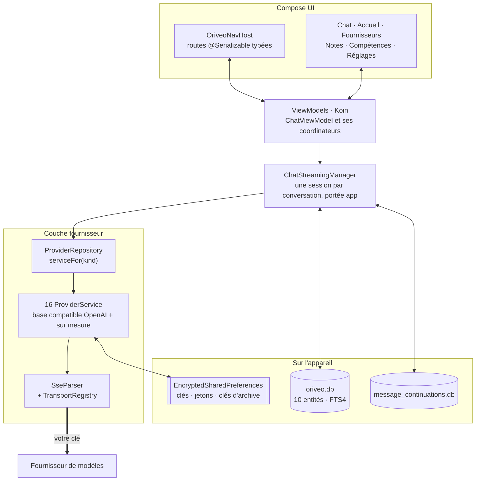

<div align="center">

# Oriveo pour Android

**Un client de chat Jetpack Compose natif pour les modèles d'IA que vous payez déjà.**

<a href="../../LICENSE"></a>


<sub>

<a href="../../android/README.md">English</a> ·
<a href="../ar/android.md">العربية</a> ·
<a href="../de/android.md">Deutsch</a> ·
<a href="../es/android.md">Español</a> ·
**Français** ·
<a href="../hi/android.md">हिन्दी</a> ·
<a href="../id/android.md">Indonesia</a> ·
<a href="../ja/android.md">日本語</a> ·
<a href="../ko/android.md">한국어</a> ·
<a href="../pt-BR/android.md">Português</a> ·
<a href="../ru/android.md">Русский</a> ·
<a href="../th/android.md">ไทย</a> ·
<a href="../tr/android.md">Türkçe</a> ·
<a href="../vi/android.md">Tiếng Việt</a> ·
<a href="../zh-Hans/android.md">简体中文</a> ·
<a href="../zh-Hant/android.md">繁體中文</a>

</sub>

</div>

---

Le client Android d'Oriveo est une app de chat IA qui fonctionne avec vos propres clés. Vous ajoutez
des clés API que vous possédez déjà, et l'app parle à chaque fournisseur directement depuis le
téléphone. Conversations, notes, dossiers et compétences sont stockés sur l'appareil dans Room ; les clés
API sont chiffrées avec une clé détenue par le Keystore Android. Il n'y a ni compte ni connexion.

Il fait partie d'[Oriveo Community Edition](README.md) — trois clients qui partagent une seule
définition de la façon de parler à un fournisseur de modèles.

## Architecture



Trois choses dans ce schéma sont des décisions de conception délibérées et non une structure
accidentelle.

**Le streaming vit au-dessus de l'écran.** `ChatStreamingManager` garde une `StreamingSession` par
identifiant de conversation dans une `ConcurrentHashMap`, chacune tournant comme son propre `Job` sur
un unique `CoroutineScope(SupervisorJob() + Dispatchers.IO)` à la portée de l'application — le
superviseur est exactement le point : l'échec d'un flux n'entraîne pas les autres. Quitter un chat
n'annule pas la réponse, et `ChatRepository` écrit le texte partiel dans SQLite dès que
`StreamingTokenBuffer` signale qu'il s'en est assez accumulé (4 000 caractères ou 60 secondes) ;
tuer l'app en pleine réponse ne perd donc pas ce qui est déjà arrivé.

**Deux bases de données, pas une.** `oriveo.db` contient les conversations, les messages, les pièces
jointes, les notes, les dossiers, les compétences et le cache du catalogue de modèles.
`message_continuations.db` est un fichier physiquement séparé qui contient l'état de continuation
opaque du fournisseur, précisément pour que `backup_rules.xml` et `data_extraction_rules.xml`
puissent l'exclure de la sauvegarde cloud et du transfert d'appareil — un jeton de continuation
restauré sur un autre appareil est au mieux dénué de sens.

**Un catalogue plus récent que le binaire se dégrade, il ne casse pas.** `TransportKind` est une
énumération fermée avec un désérialiseur indulgent : une chaîne de transport inconnue est décodée en
`null`, `TransportRegistry` ne renvoie aucune stratégie, et le modèle est filtré hors du sélecteur.
L'alternative — une énumération stricte — ferait échouer l'analyse de tout le catalogue et
entraînerait tous les autres modèles dans sa chute.

## Ce qu'un modèle a le droit de faire

Le client ne devine jamais les capacités d'un modèle d'après son nom. Il lit un runtime de capacités
depuis le catalogue : des recettes décrivant, pour un fournisseur, un transport et une capacité
donnés, exactement quels pointeurs JSON écrire dans la requête.
`ProviderRecipeRequestCompiler` valide la recette contre le fournisseur, la capacité et le transport
avant de la compiler en un delta de corps qui lui appartient, et rejette avec un motif nommé
(`recipe_not_found`, `transport_mismatch`, `model_route_must_not_patch_body`) plutôt que de produire
en silence une requête que personne n'a relue.

Au retour, `CapabilityEvidenceFacade` classe par source ce que l'on sait réellement d'une capacité —
`operator_override` > `server_typed` > `server_profile` > `model_facts` > `relay_verification` >
`relay_declaration` > `legacy_metadata`. Seul l'analyseur de flux peut marquer une capacité
*observed* ; l'intention, les recettes, un HTTP 200 et une déclaration d'outil ne comptent
explicitement pas. Le résultat est persisté par message, pour que l'interface puisse distinguer
*demandé* de *confirmé*.

Les redéfinitions sont résolues en dernier-écrit-gagne sur sept portées, par ordre de priorité :
`single_send` > `conversation_connection_model` > `skill_agent` > `connection_model` > `connection` >
`provider_recipe` > `provider_default`.

## Stockage et secrets

| Quoi | Où |
|---|---|
| Conversations, messages, pièces jointes, notes, dossiers, compétences | Room, `oriveo.db` |
| Recherche plein texte sur les notes | table virtuelle FTS4 |
| Cache du catalogue de modèles | une seule ligne dans `oriveo.db`, relue par morceaux |
| État de continuation du fournisseur | `message_continuations.db`, exclu de la sauvegarde |
| Clés API des fournisseurs | `EncryptedSharedPreferences`, AES-256-GCM, clé maîtresse détenue par le Keystore |
| Jetons OAuth d'abonnement | un deuxième fichier de préférences chiffré, distinct |
| Clés des archives de sauvegarde | un troisième |
| Blobs de pièces jointes | des fichiers sur disque, référencés par id |

Les trois fichiers de préférences chiffrés sont séparés selon leur durée de vie et leur rayon
d'impact plutôt que fusionnés par commodité. Chacun a un chemin de récupération : un fichier corrompu
(`AEADBadTagException`, `VERIFICATION_FAILED`) est détecté, supprimé et recréé au lieu de faire
planter l'app à chaque lancement.

Tous les trois, ainsi que la base de continuation, sont exclus de la sauvegarde cloud Android et du
transfert d'appareil. C'est une conséquence de leur liaison au Keystore, pas un oubli — le texte
chiffré serait de toute façon indéchiffrable sur le nouvel appareil. **Après un changement de
téléphone, vous ressaisissez vos clés API et vous vous reconnectez à tout abonnement fournisseur** ;
les conversations et les notes suivent normalement.

Une archive que vous exportez vous-même est un zip contenant `data.json` et les fichiers des pièces
jointes. Le mot de passe que vous choisissez protège **les seules clés API des fournisseurs** qui s'y
trouvent : elles sont chiffrées avec PBKDF2-HMAC-SHA256 à 600 000 itérations et AES-GCM et stockées
comme un champ de `data.json`. Conversations, messages, notes, dossiers, compétences, préférences et
pièces jointes sont écrits en JSON en clair et en fichiers en clair dans tous les cas ; traitez donc
une archive comme lisible par quiconque détient le fichier. Exportez sans les clés si vous ne voulez
que votre historique.

## Joindre un serveur de modèles sur votre propre réseau

Le manifeste positionne `android:usesCleartextTraffic="true"`, délibérément : les serveurs de
modèles locaux — llama.cpp, Ollama, LM Studio, vLLM — parlent HTTP en clair sur votre propre machine
ou votre réseau local, et n'ont généralement pas de certificat.

La vraie frontière est dans le code, pas dans le manifeste, parce qu'elle ne peut pas être ailleurs.
`RelayEndpointPolicy` résout l'hôte, exige que **chaque** adresse résolue soit privée (loopback, RFC
1918, link-local, unique-local, et la plage CGNAT en mode VPN), rejette un hôte qui résout vers un
mélange d'adresses publiques et privées, épingle l'ensemble d'adresses résolu contre le DNS
rebinding et le revérifie au moment de l'envoi. Elle refuse toute requête en clair transportant du
matériel d'authentification. Les clients de découverte et de moteur local ne suivent aucune
redirection, avec cet épinglage d'adresses comme filet de sécurité.

Une network security config Android ne peut pas exprimer cet ensemble : elle ne filtre que sur le
nom d'hôte, n'a aucune syntaxe pour les plages d'adresses, et les adresses en jeu ici viennent du
réseau de l'utilisateur à l'exécution. Une config serait en outre strictement plus faible, puisqu'elle
ne voit jamais l'adresse vers laquelle un nom a été résolu.

## Le catalogue de modèles

L'app lit les capacités et les prix des modèles dans un catalogue public pour qu'un modèle sorti
aujourd'hui fonctionne sans mise à jour de l'app. C'est un simple `GET` HTTPS sans identifiants de
connexion ni identifiant attaché, et les requêtes de chat ne s'en approchent jamais. Seuls deux
endpoints sont demandés :

```
GET {base}/api/metadata?view=lean
GET {base}/api/metadata/model-facts
```

L'URL de base est une propriété de build, dont la valeur par défaut est
`https://api.oriveoai.com` :

```bash
./gradlew :app:assembleDebug -PORIVEO_METADATA_BASE_URL=https://your.host
```

Les réponses sont revalidées par ETag et mises en cache dans `oriveo.db` ; une fois qu'une
récupération a réussi, l'app continue de fonctionner depuis la copie en cache si le catalogue
devient injoignable plus tard.

> [!IMPORTANT]
> Compiler avec une valeur vide (`-PORIVEO_METADATA_BASE_URL=`) désactive entièrement la
> récupération du catalogue, et **aucun instantané n'est embarqué dans l'APK**. Sur une installation
> neuve d'un tel build :
>
> - aucun des 15 fournisseurs intégrés n'obtient de liste de modèles, et l'app ne la demande pas au
>   fournisseur — le catalogue est la seule source ;
> - l'écran de détail du fournisseur affiche une bannière « Impossible de charger les modèles
>   officiels », mais ajouter la clé annonce toujours un succès et le sélecteur de modèles est
>   simplement vide ;
> - **OpenAI devient inutilisable**, parce que la saisie manuelle de modèles est bloquée pour ce
>   fournisseur ;
> - les endpoints Relay et les serveurs de modèles locaux fonctionnent toujours pleinement, et sont
>   le seul chemin intact.
>
> Si vous voulez un build hors ligne, servez le catalogue vous-même et pointez le build dessus
> plutôt que de vider la valeur.

## Structure du projet

```
android/
  app/src/main/java/ai/oriveo/community/
    core/
      provider/    every provider service, transports, relay, capability recipes
      data/        Room entities, DAOs, repositories, backup, catalog client
      model/       domain models and the capability/preference resolvers
      attachments/ routing, budgets, per-format text extraction
      security/    SecureKeyStore, BackupCrypto, external-URL policy
      streaming/   ChatStreamingManager
      navigation/  AppRoute, OriveoNavHost
    feature/       one package per screen
    ui/            shared components, Markdown + LaTeX renderer, theme
    di/            Koin modules
  benchmark/       macrobenchmark suite (cold start, model picker)
```

## Compilation

Prérequis : **JDK 21** et le SDK Android. Le build utilise AGP 9.3, Gradle 9.5 et
Kotlin 2.3, Android Studio doit donc être une version capable de synchroniser AGP 9.3 ; en ligne de
commande, seuls le JDK et le SDK sont nécessaires.

```bash
./gradlew :app:assembleDebug
./gradlew :app:testDebugUnitTest
```

Le build cible `minSdk 26`, `targetSdk 36`, `compileSdk 37`. `local.properties` (le chemin de votre
SDK) est généré par Android Studio et n'est pas versionné. La signature des releases est décrite dans
[SIGNING.md](../../android/SIGNING.md).

> [!NOTE]
> Le daemon Gradle tourne sur une toolchain Java 21 (`gradle/gradle-daemon-jvm.properties`), et la
> correspondance porte sur 21 exactement, pas sur « 21 ou plus récent ». Avec tout autre JDK
> installé, Gradle télécharge lui-même un JDK 21 au premier build, ce qui exige un accès réseau ;
> installer le JDK 21 vous-même l'évite. Si vous avez défini
> `org.gradle.java.installations.auto-download=false`, ce téléchargement ne peut pas avoir lieu et
> le build échoue avec `Toolchain auto-provisioning is not enabled.` — c'est le seul cas où le JDK
> 17 seul ne suffit véritablement pas. La compilation cible Java 17 dans les deux cas.

Le parallélisme des tests unitaires est dérivé du nombre de CPU et de la mémoire physique de la
machine plutôt que codé en dur, pour que la suite se comporte bien aussi bien sur un portable que
sur une grosse station de travail.

## Dépendances

| Bibliothèque | Version | Sert à |
|---|---|---|
| Jetpack Compose BOM | 2026.08.00 | interface, Material 3 |
| Room | 2.8.4 | SQLite, DAO, FTS4 |
| Koin | 4.2.2 | injection de dépendances |
| Ktor client (moteur OkHttp) | 3.5.2 | HTTP et SSE vers les fournisseurs |
| kotlinx.serialization | 1.11.0 | JSON |
| navigation-compose | 2.9.6 | routes typées |
| androidx.security-crypto | 1.1.0 | `EncryptedSharedPreferences` |
| haze | 1.7.3 | flou d'arrière-plan |
| PDFBox-Android, jsoup | 2.0.27.0, 1.23.2 | extraction de texte des pièces jointes |
| jlatexmath-android | 0.2.0 | rendu LaTeX |

Les versions exactes sont figées dans
[`gradle/libs.versions.toml`](../../android/gradle/libs.versions.toml).

## Tests

```bash
./gradlew :app:testDebugUnitTest
```

Environ 3 000 tests unitaires répartis sur 318 fichiers, avec JUnit 4, MockK, Robolectric,
`kotlinx-coroutines-test` et le mock engine de Ktor. La couverture est la plus dense là où les
erreurs coûtent le plus cher : forme des requêtes par fournisseur, analyse SSE, choix du transport,
sondage des relais et modes de sécurité, exécution des recettes de capacités, mise en cache du
catalogue et gestion des versions de contrat, persistance Room, et allers-retours de sauvegarde.

> [!IMPORTANT]
> Environ 38 suites chargent des fixtures de contrat en remontant depuis le répertoire de travail
> jusqu'à trouver `shared/`, donc **les tests ne passent que dans un checkout complet** — copier
> `android/` tout seul ne marchera pas.

Il y a aussi trois tests instrumentés — une matrice de release des moteurs locaux, un test de socket
en clair et un test d'isolation du Keystore. Ils ne sont pas autonomes : ceux des moteurs locaux ont
besoin d'arguments d'instrumentation désignant un vrai serveur de modèles en cours d'exécution sur
votre réseau, `connectedAndroidTest` ne passe donc pas tel quel. La porte d'entrée d'une pull request
est la suite unitaire.

Le module `:benchmark` contient les macrobenchmarks du démarrage à froid et du sélecteur de modèles.
C'est un module Gradle distinct qui utilise `com.android.test` avec auto-instrumentation, et il
pilote un type de build `benchmark` dédié de `:app`.

Les deux bases sont en `version = 1` et n'ont encore aucune migration ; les schémas sont exportés
vers `app/schemas/` et versionnés, et c'est là qu'atterrira le `2.json` de la première migration.

## Localisation

Seize langues : `values/` (l'anglais, la source) plus quinze répertoires de locale — à côté de
`values-night`, qui ne porte aucune chaîne —, environ 1 340 chaînes chacun, chaque locale détenant un
jeu de clés identique. Le changement de langue dans l'app
passe par `AppLanguageManager` et `android:localeConfig`. Les splits par langue sont désactivés dans
le bundle, si bien qu'un seul artefact porte toutes les traductions.

## Contribuer

Voir [CONTRIBUTING.md](../../CONTRIBUTING.md). La langue de travail du projet est l'anglais :
sources, commentaires, tests et messages de commit. Les chaînes d'interface sont traduites — ajoutez
une nouvelle chaîne dans `values/` d'abord et laissez les autres locales suivre. Lancez les tests
unitaires avant d'ouvrir une pull request.

## Licence

[AGPL-3.0-or-later](../../LICENSE).
