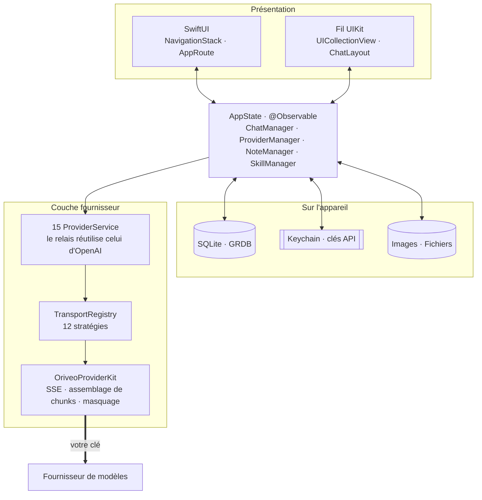
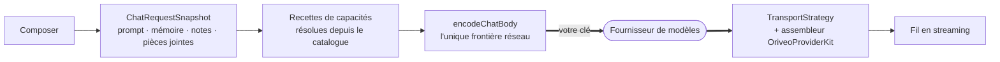

<div align="center">

# Oriveo pour iOS

**Un client de chat SwiftUI natif pour les modèles d'IA que vous payez déjà.**

<a href="../../LICENSE"></a>


<sub>

<a href="../../ios/README.md">English</a> ·
<a href="../ar/ios.md">العربية</a> ·
<a href="../de/ios.md">Deutsch</a> ·
<a href="../es/ios.md">Español</a> ·
**Français** ·
<a href="../hi/ios.md">हिन्दी</a> ·
<a href="../id/ios.md">Indonesia</a> ·
<a href="../ja/ios.md">日本語</a> ·
<a href="../ko/ios.md">한국어</a> ·
<a href="../pt-BR/ios.md">Português</a> ·
<a href="../ru/ios.md">Русский</a> ·
<a href="../th/ios.md">ไทย</a> ·
<a href="../tr/ios.md">Türkçe</a> ·
<a href="../vi/ios.md">Tiếng Việt</a> ·
<a href="../zh-Hans/ios.md">简体中文</a> ·
<a href="../zh-Hant/ios.md">繁體中文</a>

</sub>

</div>

---

Le client iOS d'Oriveo est une app de chat IA qui fonctionne avec vos propres clés. Vous ajoutez des
clés API que vous possédez déjà, et l'app appelle chaque fournisseur directement depuis le téléphone.
Conversations, messages, notes et dossiers de notes vivent dans une base SQLite sur l'appareil ; les
blobs de pièces jointes sont des fichiers à côté ; les compétences, les préférences, la liste des
fournisseurs et les dossiers de conversations sont du JSON sur l'appareil. Les clés API vont dans le
Keychain iOS.

Il n'y a pas de compte Oriveo : rien n'est téléversé, et il n'y a rien où se connecter. Deux
fournisseurs proposent bien de se connecter avec un abonnement que vous détenez déjà au lieu de coller
une clé — ChatGPT et Grok — et cette connexion va vers OpenAI et xAI, pas vers nous.

Il fait partie d'[Oriveo Community Edition](README.md) — trois clients qui partagent une seule
définition de la façon de parler à un fournisseur de modèles.

## Architecture



Trois choses méritent d'être dites clairement à propos de ce schéma.

**Le fil de conversation est en UIKit, le reste en SwiftUI.** `ChatView` encapsule un
`ChatListViewControllerRepresentable` autour d'une `UICollectionView` pilotée par
[ChatLayout](https://github.com/ekazaev/ChatLayout). Tout le reste — navigation, réglages,
configuration des fournisseurs, notes, compétences — est en SwiftUI. Cette séparation existe parce qu'un
fil qui streame au rythme des tokens exige, au niveau de la cellule, un contrôle sur la mesure et la
réutilisation que le diffing de SwiftUI ne donne pas.
[`Features/Chat/ARCHITECTURE.md`](../../ios/Oriveo/Oriveo/Features/Chat/ARCHITECTURE.md) documente
la frontière.

**Trois chemins distincts mettent ce fil à jour**, délibérément :

| Chemin | Transporte | Pourquoi |
|---|---|---|
| `@Observable AppState` | les changements structurels — un message apparaît, on change de conversation | natif SwiftUI, peu coûteux pour des événements peu fréquents |
| GRDB `ValueObservation` | l'état durable relu depuis SQLite | une seule source de vérité après une écriture, survit à un redémarrage |
| Combine `PassthroughSubject` par conversation | les deltas de texte et de raisonnement en streaming | contourne entièrement le diffing SwiftUI au rythme des tokens |

**La prise en charge des fournisseurs, ce sont quatre axes indépendants, pas une énumération.**
`ProviderKind` (16 cas : les quinze fournisseurs plus relay), c'est *ce que l'utilisateur a
configuré*. `ProviderServiceProtocol`, c'est
*la surface d'appel*. `TransportKind` (12 cas), c'est *le protocole réseau réellement parlé* — et il
est résolu **par modèle, depuis le catalogue**, deux modèles derrière la même clé peuvent donc
diverger. `RelayKind` couvre les endpoints fournis par l'utilisateur. C'est le fait de les garder
séparés qui permet à un nouveau modèle de fonctionner sans nouveau build.

### Comment un message est envoyé



`BaseAPIService.encodeChatBody` est le dernier arrêt avant qu'une requête compatible OpenAI ne
devienne des octets — douze des seize cas y passent, de sorte qu'une recette de capacité, un
paramètre de génération ou un champ personnalisé est testable à un seul endroit au lieu de douze.
OpenAI, Anthropic et Gemini parlent leurs propres formes et sérialisent dans leurs propres services ;
chacun de ces points est couvert par sa propre suite de forme de requête.

## Ce qu'un modèle a le droit de faire

Le client ne devine jamais les capacités d'un modèle d'après son nom. Il lit un **runtime de
capacités** — un ensemble de recettes décrivant, pour un fournisseur, un transport et une capacité
donnés, exactement quels pointeurs JSON écrire dans la requête. Ces recettes vivent dans
[`shared/capabilityrecipe`](../../shared/capabilityrecipe/) et sont appliquées par
`CapabilityRecipeRequestCompiler`.

Au retour, `CapabilityExecutionRuntime` enregistre ce qui s'est réellement passé. Seul un analyseur
de flux de production sélectionné peut promouvoir une capacité à l'état *observed*. Un HTTP 200, une
réponse non vide et une déclaration d'outil dans la requête ne sont explicitement **pas** des
preuves. L'état terminal est stocké par message, pour que l'interface puisse vous dire qu'un
contrôle a été demandé mais jamais confirmé, plutôt que de laisser croire en silence qu'il a
fonctionné.

## Stockage

```
Application Support/Oriveo/
  active-uid                     # storage partition, "guest" by default
  users/<uid>/
    oriveo.sqlite                # conversations, messages, notes and folders, catalog cache
    Images/  Files/              # attachment blobs, referenced by id
    session-snapshot.json        # preferences, provider list, folders, last used model
```

- **SQLite via GRDB** avec WAL, clés étrangères activées et un `DatabaseMigrator` couvrant chaque
  changement de schéma. La recherche plein texte sur les messages et les notes utilise FTS5 avec un
  tokenizer par trigrammes.
- **Les clés API vivent dans le Keychain**, indexées par fournisseur et par partition, et sont vidées
  de l'instantané de session avant son écriture. Les compétences sont stockées séparément en JSON dans
  `UserDefaults`.
- **Les blobs de pièces jointes sont des fichiers sur disque**, pas des lignes, de sorte qu'un gros
  PDF ne gonfle jamais la base.

Une sauvegarde est un ZIP `.oriveo` contenant `data.json` et les fichiers image. Le mot de passe
facultatif ne chiffre pas l'archive : il ne chiffre que les clés API des fournisseurs qui s'y trouvent
(AES-GCM, avec une clé dérivée par PBKDF2-HMAC-SHA256 sur 600 000 itérations). Les conversations, les
notes, les compétences et les préférences restent du JSON en clair dans l'archive dans tous les cas ;
traitez donc un fichier de sauvegarde comme lisible par quiconque le détient.

## Le catalogue de modèles

Au démarrage à froid, l'app émet une requête `GET` non authentifiée et conditionnelle par ETag vers
`https://api.oriveoai.com/api/metadata?view=lean`. Elle récupère le catalogue public de modèles :
quels modèles existent, ce que chacun prend en charge, comment ses contrôles de raisonnement sont
nommés et ce qu'il coûte. Aucune clé, aucune conversation et aucun identifiant n'y sont attachés, et
la réponse est mise en cache dans SQLite pour que l'app fonctionne depuis la copie en cache quand le
catalogue est injoignable. Un second endpoint, `/api/metadata/model-facts`, n'est lu qu'après que vous
vous êtes connecté avec un abonnement ChatGPT ou Grok, pour savoir ce que les modèles de cet
abonnement savent faire.

Ce sont les seules requêtes que l'app passe pour son propre compte. Tout le reste va vers un
fournisseur que vous avez configuré, avec votre clé.

Pointer le catalogue vers votre propre hôte est une **commodité des builds Debug**, résolue dans
`Oriveo/Core/Providers/BackendURLResolver.swift` dans cet ordre :

1. la variable d'environnement `ORIVEO_METADATA_BASE_URL`, définie dans l'action Run du schéma ; puis
2. une chaîne `ORIVEO_METADATA_BASE_URL` dans `ios/Oriveo/Config/Info.plist` — la clé y est déjà, et
   vide, donc la remplir suffit ; puis
3. `https://api.oriveoai.com`.

Deux choses à savoir. Un build Release ignore les deux et utilise toujours le catalogue publié ; le
changer demande de modifier `BackendURLResolver`. Et lorsque le bundle de test tourne, ou avec
`CI=true`, une redéfinition pointant vers une adresse privée (localhost, `10/8`, `192.168/16`,
`172.16/12`, `.local`, IPv6 lien-local) est ignorée, pour qu'un hôte local oublié ne puisse pas rendre
la suite dépendante de la machine devant laquelle vous êtes assis.

## Structure du projet

```
ios/Oriveo/
  Config/Info.plist    the app's Info.plist; GENERATE_INFOPLIST_FILE is off
  Oriveo.xcodeproj/
  Oriveo/
    Core/
      Providers/       15 provider services, transports, capability runtime, catalog client
      State/           AppState and the managers it owns
      Database/        GRDB pool, schema, migrator, stores, observations
      Models/          domain types
      Attachments/     import limits, budgets, per-format text extraction
      Tools/           tool-call loop and per-protocol adapters
      Cache/ Localization/ Observability/ Reachability/ Routing/ Usage/
    Features/
      App/             root view and tab shell
      Chat/            transcript, composer, model controls, cross-check, export
      Providers/       setup, detail, relay, local engines, subscription sign-in
      Home/ Notes/ Skills/ Settings/ Backup/ Onboarding/
    Shared/Components/ shared views
    DesignSystem/      theme, colour, haptics
    Preview/           sample data for SwiftUI previews
    *.xcstrings        ten string catalogs
    Assets.xcassets · PrivacyInfo.xcprivacy · Oriveo.entitlements
  OriveoTests/
```

## Compiler et lancer

Il vous faut **Xcode 26** et, pour lancer sur du matériel, un appareil sous **iOS 18 ou plus
récent**. Un compte Apple Developer gratuit suffit : le fichier d'entitlements est vide et l'app
n'utilise aucune capability payante — pas de push, pas d'iCloud, pas d'app groups, pas d'associated
domains.

Xcode 16.3 est le plancher que le format du projet et la version des Swift tools imposent réellement,
mais la cible définit `SWIFT_APPROACHABLE_CONCURRENCY` et
`SWIFT_DEFAULT_ACTOR_ISOLATION = MainActor`, que les versions plus anciennes de Xcode ignorent sans le
dire. Changer l'isolation d'acteur en silence est une mauvaise façon de l'apprendre : compilez donc
avec Xcode 26.

1. Ouvrez `ios/Oriveo/Oriveo.xcodeproj`
2. Sélectionnez le schéma `Oriveo`
3. Sous **Signing & Capabilities**, choisissez votre propre Team
4. Si Xcode ne peut pas enregistrer `ai.oriveo.community`, changez le bundle identifier pour un que
   votre Team possède
5. Branchez votre iPhone, activez le mode développeur, faites confiance à l'ordinateur, et lancez

Pour compiler vers le simulateur à la place, choisissez n'importe quel simulateur d'iPhone et
lancez. Les dépendances de paquets sont résolues depuis le `Package.resolved` versionné.

**Sur un Mac Apple Silicon**, le build iPhone tourne aussi nativement : choisissez la destination
**My Mac (Designed for iPad)**. Mac Catalyst n'est pas activé — le projet ne l'active jamais et
`TARGETED_DEVICE_FAMILY` reste `1,2` —, il s'agit donc de l'app iOS sous le runtime de compatibilité
iPad et non d'une app Mac, et les chemins réservés à l'appareil, comme la capture par la caméra, se
comportent comme ils se comportent sur un Mac.

Le fichier de projet utilise `objectVersion = 77` avec des groupes synchronisés au système de
fichiers ; un Xcode plus ancien peut donc refuser de l'ouvrir. Mettez Xcode à jour plutôt que de
modifier le format du projet.

> [!NOTE]
> La cible de l'app compile en mode langage Swift 5 ; le paquet local `OriveoProviderKit` déclare
> `swift-tools-version: 6.1` et compile en mode langage Swift 6.

## Dépendances

| Paquet | Version | Sert à |
|---|---|---|
| [GRDB.swift](https://github.com/groue/GRDB.swift) | 7.11.1 | accès SQLite, migrations, `ValueObservation` |
| [ChatLayout](https://github.com/ekazaev/ChatLayout) | 2.4.3 | la mise en page collection-view du fil |
| [swift-markdown-ui](https://github.com/gonzalezreal/swift-markdown-ui) | 2.4.1 | rendu Markdown |
| [SwiftMath](https://github.com/mgriebling/SwiftMath) | 1.7.3 | rendu LaTeX |
| [ZIPFoundation](https://github.com/weichsel/ZIPFoundation) | 0.9.20 | archives de sauvegarde, extraction Office/EPUB/ODF |
| `OriveoProviderKit` | local | le noyau de protocole fournisseur, dans [`shared/`](shared.md) |

`Package.resolved` épingle aussi les deux dépendances transitives qu'apporte swift-markdown-ui :
[NetworkImage](https://github.com/gonzalezreal/NetworkImage) 6.0.1 et
[swift-cmark](https://github.com/swiftlang/swift-cmark) 0.8.0. Toutes les dépendances directes sont
sous licence MIT et swift-cmark sous BSD-2-Clause, toutes compatibles avec AGPL-3.0-or-later.

## Tests

Lancez l'action de test du schéma `Oriveo` (⌘U) dans Xcode, ou depuis la racine du dépôt :

```bash
xcodebuild test -project ios/Oriveo/Oriveo.xcodeproj -scheme Oriveo \
  -destination 'platform=iOS Simulator,name=iPhone 16'
```

Remplacez par un simulateur que vous avez réellement ; `xcodebuild -showdestinations` avec le
même projet et le même schéma liste tout ce pour quoi ce checkout peut compiler.

> [!IMPORTANT]
> La cible de test lit les fixtures de contrat depuis `shared/` en remontant depuis `#filePath`
> jusqu'à trouver ce répertoire, donc **les tests ne passent que dans un checkout complet** — copier
> `ios/` tout seul ne marchera pas.

La suite est grosse : environ 2 900 cas [Swift
Testing](https://github.com/swiftlang/swift-testing) plus 76 cas XCTest, répartis sur 275 fichiers.
Elle couvre la forme des requêtes par fournisseur, le rejeu de flux SSE amont enregistrés, la
politique des relais et des moteurs locaux, la mesure du fil et son comportement en streaming, le
stockage et les allers-retours de sauvegarde.

`shared/OriveoProviderKit` a sa propre suite :

```bash
cd shared/OriveoProviderKit && swift test
```

## Localisation

Seize langues, stockées sous forme de String Catalogs Xcode (`.xcstrings`) — dix catalogues, environ
1 340 clés, l'anglais comme source. Chaque clé est traduite dans les seize langues, hormis les rares
marquées `shouldTranslate: false` : le nom du produit, la ponctuation, les squelettes de format et les
valeurs de protocole qu'il serait faux de localiser. Les chaînes sont résolues via
`L10n.tr(_:table:)` contre un bundle `.lproj` choisi d'après le réglage de langue interne à l'app, si
bien que changer de langue prend effet sans relancer. La mise en page droite-à-gauche pour l'arabe
est traitée explicitement.

## Contribuer

Voir [CONTRIBUTING.md](../../CONTRIBUTING.md). Ajoutez un test avec tout changement de comportement ;
pour une correction de protocole fournisseur, préférez une fixture enregistrée sous
`shared/test-fixtures` à un mock écrit à la main, et précisez contre quel fournisseur et quel modèle
vous avez testé.

## Licence

[AGPL-3.0-or-later](../../LICENSE).
