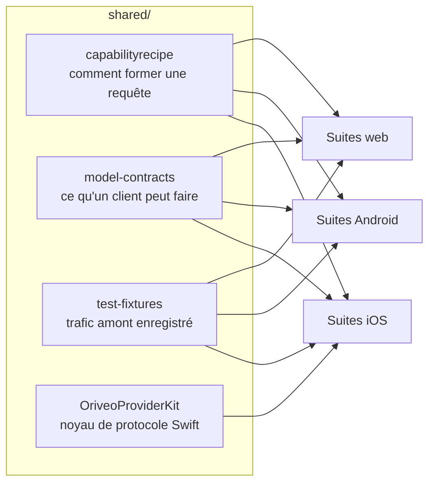

<div align="center">

# Contrats partagés

**Une seule définition de la façon de parler à un fournisseur de modèles, vérifiée par les trois clients.**

<a href="../../LICENSE"></a>


<sub>

<a href="../../shared/README.md">English</a> ·
<a href="../ar/shared.md">العربية</a> ·
<a href="../de/shared.md">Deutsch</a> ·
<a href="../es/shared.md">Español</a> ·
**Français** ·
<a href="../hi/shared.md">हिन्दी</a> ·
<a href="../id/shared.md">Indonesia</a> ·
<a href="../ja/shared.md">日本語</a> ·
<a href="../ko/shared.md">한국어</a> ·
<a href="../pt-BR/shared.md">Português</a> ·
<a href="../ru/shared.md">Русский</a> ·
<a href="../th/shared.md">ไทย</a> ·
<a href="../tr/shared.md">Türkçe</a> ·
<a href="../vi/shared.md">Tiếng Việt</a> ·
<a href="../zh-Hans/shared.md">简体中文</a> ·
<a href="../zh-Hant/shared.md">繁體中文</a>

</sub>

</div>

---

Trois clients qui implémentent chacun « appeler le fournisseur » de leur côté vont dériver. Ils
dériveront en silence, dans la direction de celui que quelqu'un a testé en dernier, et la dérive
ressortira sous la forme d'un bug qui se reproduit sur une plateforme et pas sur les autres.

`shared/` est la réponse à cela : le comportement est écrit une fois sous forme de données, et la
suite de tests de chaque client vérifie contre les mêmes fichiers. Une bizarrerie qui vit dans ces
données se corrige une fois. Une bizarrerie qui vit dans un parseur se fait attraper par trois suites
en même temps, au lieu de partir en production sur deux plateformes et de casser la troisième.



## capabilityrecipe

Le registre des recettes. Pour un fournisseur, un transport et une capacité donnés — recherche web,
effort de raisonnement, génération d'images — il dit exactement quels pointeurs JSON écrire dans la
requête sortante, et comment relire la réponse.

C'est ce qui fait qu'un modèle sorti aujourd'hui fonctionne sans mise à jour du client, et c'est
pourquoi aucun client ne devine une capacité d'après le nom d'un modèle.
`capability_runtime.v1.json` porte les recettes elles-mêmes ;
`capability_result_definitions.v1.json` et `capability_custom_controls.v2.json` définissent comment
les résultats et les contrôles visibles par l'utilisateur sont interprétés.

Chaque recette déclare un `executionKind` — `request_overlay`, `server_tool`, `client_tool_loop`,
`endpoint_route`, `model_route` — et le compilateur de chaque client vérifie que la recette
correspond au fournisseur, à la capacité et au transport avant de l'appliquer, en rejetant avec un
motif nommé plutôt qu'en envoyant une requête que personne n'a relue.

## model-contracts

Des fixtures JSON qui figent le comportement inter-clients : à quoi doit ressembler une requête pour
un fournisseur et une capacité donnés, comment les paramètres de génération se résolvent et comment
les redéfinitions se superposent, quels états de capacité un client peut présenter, et comment le
catalogue de modèles et ses preuves sont consommés.

Les tests de chaque client les chargent directement, donc un changement ici est un changement sur
les trois clients à la fois.

## test-fixtures

Des données de test de référence : trafic amont d'appels d'outils enregistré, scénarios de routage
et de découverte de relais, instantanés de model facts et de preuves de capacités, et scénarios de
moteurs locaux.

Les fichiers `.sse` situés sous `recorded/` sont du **vrai trafic amont capturé**, laissé intact
octet pour octet ; les autres sont des fixtures écrites à la main qui figent un chemin d'analyse
précis. La distinction compte : un mock écrit à la main encode ce que vous croyiez que le
fournisseur fait, alors qu'un enregistrement encode ce qu'il a réellement fait, y compris le chunk
malformé qu'il a envoyé ce mardi-là. Quand une correction de protocole fournisseur a besoin d'un
test, préférez un enregistrement.

## OriveoProviderKit

Un paquet Swift contenant le noyau du protocole réseau fournisseur : assemblage des lignes SSE,
analyse des chunks compatibles OpenAI, encodage des noms d'outils, masquage des identifiants de
connexion, classification des erreurs amont, analyse des balises de réflexion, extraction de chemins
JSON en streaming, et profils de bizarreries par fournisseur.

Son périmètre est délibérément serré. **Dedans :** de la connaissance réseau à base de Foundation
uniquement. **Dehors :** modèles de l'app, interface, base de données, télémétrie, localisation.
Chaque client Apple garde une fine liaison autour de lui, pour que le comportement réseau ait
exactement une implémentation.

```bash
cd shared/OriveoProviderKit && swift build && swift test
```

- Plateformes : iOS 18+, macOS 15+ · `swift-tools-version: 6.1`
- `ProviderWireProfile` porte les bizarreries résiduelles par éditeur dont un unique assembleur
  compatible OpenAI a encore besoin — où arrive le texte de raisonnement, où vivent les compteurs de
  tokens en cache, si les tokens de prompt incluent déjà les hits de cache. Il décrit *comment les
  octets arrivent*, jamais *ce qu'un modèle sait faire* ; ça, c'est le travail des recettes.

## Travailler sur ces fichiers

Un changement ici est un changement sur chaque client. Lancez les suites de contrat de chaque client
qui lit le fichier que vous avez touché, pas seulement celle du client dans lequel vous travaillez :

Depuis la racine du dépôt :

```bash
(cd web && npm run test:run)
(cd shared/OriveoProviderKit && swift test)
# plus the iOS and Android suites — see their READMEs
```

Les suites iOS localisent ce répertoire en remontant depuis le fichier de test jusqu'à voir
`shared/` ; les suites Android résolvent `../../shared` depuis le module Gradle ; les suites web
le résolvent relativement au workspace. Toutes exigent donc un checkout complet du dépôt.

## Licence

[AGPL-3.0-or-later](../../LICENSE).
