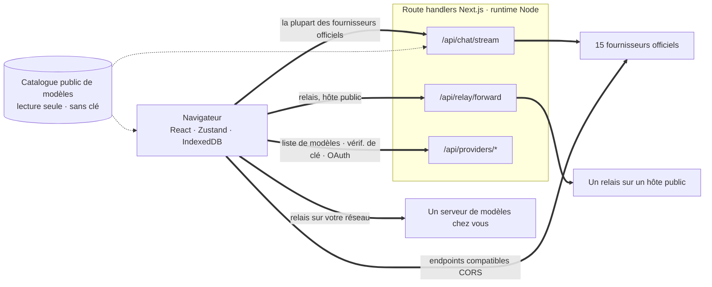
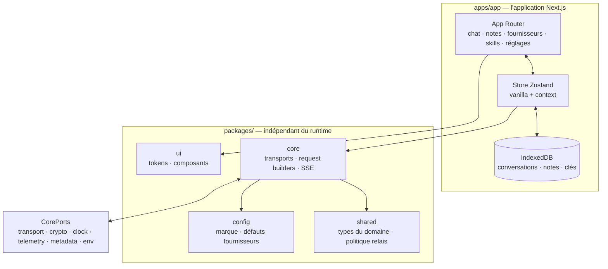

<div align="center">

# Oriveo pour le web

**Un client de chat Next.js pour les modèles d'IA que vous payez déjà.**

<a href="../../LICENSE"></a>


<sub>

<a href="../../web/README.md">English</a> ·
<a href="../ar/web.md">العربية</a> ·
<a href="../de/web.md">Deutsch</a> ·
<a href="../es/web.md">Español</a> ·
**Français** ·
<a href="../hi/web.md">हिन्दी</a> ·
<a href="../id/web.md">Indonesia</a> ·
<a href="../ja/web.md">日本語</a> ·
<a href="../ko/web.md">한국어</a> ·
<a href="../pt-BR/web.md">Português</a> ·
<a href="../ru/web.md">Русский</a> ·
<a href="../th/web.md">ไทย</a> ·
<a href="../tr/web.md">Türkçe</a> ·
<a href="../vi/web.md">Tiếng Việt</a> ·
<a href="../zh-Hans/web.md">简体中文</a> ·
<a href="../zh-Hant/web.md">繁體中文</a>

</sub>

</div>

---

Le client web d'Oriveo est une app de chat IA fonctionnant avec vos propres clés, construite avec
Next.js. Conversations, notes, dossiers, Skills et vos clés de fournisseur vivent dans le stockage
du navigateur lui-même. Il n'y a ni compte ni connexion.

Il fait partie d'[Oriveo Community Edition](README.md) — trois clients qui partagent une seule
définition de la façon de parler à un fournisseur de modèles.

## Démarrage rapide

Nécessite Node 22.22 ou plus récent (voir [`.nvmrc`](../../web/.nvmrc)). npm est fourni avec ; aucun autre gestionnaire
de paquets n'est nécessaire.

```bash
npm install
npm run dev:app     # http://localhost:3001
```

Le premier écran demande une clé API de fournisseur. Rien d'autre n'est requis pour commencer à
discuter.

## Comment une requête voyage réellement

C'est la partie qui mérite d'être lue avant tout le reste, parce que le client web est le seul
endroit où une requête ne va généralement **pas** directement du client au fournisseur.



**Pourquoi ce détour existe.** La plupart des API de fournisseurs n'envoient pas d'en-têtes CORS, un
navigateur ne peut donc pas appeler `api.openai.com` et consorts directement — le preflight échoue.
Tout client BYOK en navigateur doit résoudre ça d'une manière ou d'une autre ; celui-ci fait suivre
par des route handlers Next.js tournant dans le runtime Node. Quand vous lancez `npm run dev:app`,
ces handlers sont sur votre propre machine. Quand vous déployez l'app quelque part, ils sont sur la
machine où vous avez déployé.

Il y a plus d'un handler : le streaming de chat, le forwarder de relais, la génération d'images, la
liste de modèles, la validation de clé, et les échanges de device login de Grok et de ChatGPT font
douze fichiers de route au total. La validation de clé compte ici — elle envoie la clé à votre
propre serveur, qui s'en sert pour sonder le fournisseur.

Quelques endpoints *autorisent* bel et bien un navigateur, et ceux-là sont appelés directement, sans
serveur au milieu : l'endpoint chinois de Kimi (`api.moonshot.cn`) pour le chat, et les endpoints
de solde d'OpenRouter, SiliconFlow, DeepSeek et Kimi.

**Ce que le handler fait et ne fait pas.** Il valide la forme de la requête et plafonne sa taille,
applique une limitation de débit par IP au trafic de chat et de relais, refuse les URL qui résolvent
vers des adresses privées ou link-local, construit le corps propre au fournisseur et renvoie la
réponse en streaming. Il n'y a nulle part sous `app/api` de base de données, d'écriture sur le
système de fichiers ni de journalisation des corps de requête — votre clé et vos messages sont
transmis puis oubliés. Comme la route est un unique processus partagé par tous les visiteurs, un test
dédié (`server-never-learns.test.ts`) fige le fait qu'elle ne met jamais en cache le paramètre rejeté
d'un utilisateur pour l'appliquer à la requête d'un autre.

Le forwarder de relais épingle en plus le DNS sur l'adresse qu'il a résolue, plafonne la réponse,
borne chaque timeout, limite les redirections à la même origine et refuse de laisser passer les
en-têtes hop-by-hop.

**Les endpoints locaux le contournent entièrement.** Un relais sur une adresse privée, un nom
`.local`, `localhost`, ou configuré en mode HTTP local ou VPN privé est récupéré **directement depuis
le navigateur**, avec `credentials: 'omit'` et `targetAddressSpace: 'local'`. Votre trafic de réseau
local ne quitte pas votre réseau, et il ne passe pas non plus par le serveur de l'app.

## Architecture



`packages/core` détient chaque octet de connaissance des protocoles fournisseurs et est délibérément
tenu à l'écart des globales du navigateur — eslint y interdit, ainsi que dans
`packages/ipc-contract`, `window`, `document`, `fetch`, `crypto`, `localStorage`, `sessionStorage` et
`indexedDB`. Tout ce dont il a besoin de l'environnement arrive par `CorePorts`. C'est ce qui permet
au même code de tourner dans un navigateur, dans un route handler Node et dans un test sans DOM.

La prise en charge des fournisseurs repose sur deux axes indépendants. `providerKind` choisit un
**request builder** (à quoi ressemble le corps chez ce fournisseur). `model.transport` choisit une
**stratégie de transport** (quel protocole réseau est parlé) parmi douze, et elle est résolue par
modèle depuis le catalogue, pas par fournisseur — deux modèles derrière la même clé peuvent donc
diverger. Une stratégie implémente exactement trois méthodes : `buildRequestBody`,
`parseStreamChunk`, `parseError`.

## Workspaces

```
apps/app/               the Next.js application
packages/core/          provider protocols: transports, request builders, SSE parsing
packages/shared/        domain types, relay policy, helpers
packages/ui/            design tokens and shared components
packages/config/        brand and provider defaults
packages/ipc-contract/  typed channel contract for a desktop shell
```

Le style repose sur des CSS Modules par-dessus une unique feuille de tokens en propriétés
personnalisées dans `packages/ui` — il n'y a pas de framework de classes utilitaires.
`packages/ipc-contract` décrit la surface de canal à laquelle se lierait un shell de bureau ; aucun
shell de ce type n'est livré dans ce dépôt, donc sur le build web ce paquet n'apporte que des types
et des branches jamais empruntées.

Il y a une autre couture du même genre. `apps/app/lib/core/sync-port.ts` déclare l'interface qu'un
backend de synchronisation implémenterait, et chaque site d'appel l'atteint par chaînage optionnel. Rien n'en
installe, donc `getSyncAdapter()` renvoie `null` et IndexedDB reste la seule copie de vos données —
ce qui est exactement ce que « pas de compte, pas de connexion » veut dire en pratique.

## Stockage

Tout est par partition, indexé par un id actif qui vaut `guest` par défaut.

| Quoi | Où |
|---|---|
| Conversations, messages, dossiers, notes, fournisseurs | IndexedDB `oriveo--{id}`, 8 object stores |
| Instantané du catalogue de modèles (~3 Mo) et model facts | store de blobs IndexedDB, délibérément pas localStorage |
| Préférences et tables de contrôles de modèle | `localStorage`, avec `safeLocalStorage` autour des chemins qu'on a vus lever |
| Images générées et jointes | une base IndexedDB distincte |

Deux détails qui viennent de vraies pannes plutôt que du goût. L'instantané du catalogue vit dans
IndexedDB parce qu'à ~3 Mo il consommait l'essentiel du quota localStorage de 5 Mo d'une origine de
navigateur. Et chaque accès à localStorage passe par `safeLocalStorage`, parce que le *getter*
`window.localStorage` lui-même lève une `SecurityError` lorsqu'un navigateur est configuré pour
bloquer les données de site — une lecture nue fait planter la page avant même que votre bloc `try`
ne s'exécute.

> [!IMPORTANT]
> Sur le web, les clés de fournisseur sont stockées dans IndexedDB **non chiffrées** — le modèle
> qu'emploient généralement les clients BYOK en navigateur, parce qu'un navigateur n'a pas de
> meilleur endroit où les mettre. Pour la garantie la plus forte, utilisez le client iOS ou Android,
> où le keychain ou le keystore du système les chiffre. Les archives de sauvegarde sont une autre
> affaire : celles-là sont chiffrées avec AES-256-GCM et PBKDF2-SHA-256 à 600 000 itérations quand
> vous choisissez un mot de passe.

## Le catalogue de modèles

Quels modèles chaque fournisseur propose, et ce que chacun prend en charge, vient d'un catalogue en
lecture seule récupéré au démarrage. Exactement deux endpoints sont demandés, tous deux en `GET`,
tous deux conditionnels par ETag, aucun ne transportant de clé API, de conversation ni d'identifiant
utilisateur :

```
GET {backend}/api/metadata?view=lean
GET {backend}/api/metadata/model-facts
```

Le backend par défaut est `https://api.oriveoai.com`. Pointez `NEXT_PUBLIC_BACKEND_URL` vers votre
propre hôte pour le servir vous-même. La réponse est mise en cache 24 heures dans IndexedDB et
revalidée avec `If-None-Match` ; quand le catalogue est injoignable, l'app continue de fonctionner
depuis sa copie en cache.

## Commandes

Lancez-les depuis ce répertoire.

| Commande | Ce qu'elle fait |
|---|---|
| `npm run dev:app` | serveur de développement sur le port 3001 |
| `npm run build:app` | build de production |
| `npm run typecheck` | `tsc --noEmit` sur tous les workspaces |
| `npm run test:run` | vitest, une passe |
| `npm run test` | vitest en mode watch |
| `npm run lint` | eslint sur `apps/` et `packages/` |

`npm start --workspace @oriveo/app` sert un build terminé sur le port 3001.

Pour lancer un seul fichier de test, faites-le depuis le workspace auquel il appartient, car
plusieurs suites résolvent leurs fixtures relativement au répertoire de travail :

```bash
cd apps/app && npx vitest run lib/core/chat/__tests__/stream-options.test.ts
```

## Configuration

Tout est optionnel. Copiez [`.env.example`](../../web/.env.example) vers `.env.local` et ne
renseignez que ce dont vous avez besoin ; chaque variable que le code lit y est listée et
expliquée.

### Rapports d'erreurs

L'app embarque le SDK Sentry. Il est **inerte sans DSN** — pas de `NEXT_PUBLIC_SENTRY_DSN` signifie
pas de transport, pas d'événements, rien d'envoyé nulle part, et c'est le comportement par défaut
d'un build issu de ce dépôt. Renseignez-en un et vous obtenez les rapports d'erreurs, 10 % de
traçage de performance et 1 % de session replay, avec des hooks qui retirent les clés de
fournisseur, les endpoints et le contenu des messages avant qu'un événement ne quitte le navigateur.
C'est là pour qu'un déploiement qui veut des rapports d'erreurs puisse en avoir, pas parce que ce
build téléphone à la maison.

## Auto-hébergement

Il n'y a ni Dockerfile ni script de déploiement ; l'app est un serveur Next.js ordinaire.

```bash
npm ci
npm run build:app
npm start --workspace @oriveo/app     # 127.0.0.1:3001
```

Trois choses valent la peine d'être connues avant de la placer derrière un reverse proxy.

`npm start` écoute sur `127.0.0.1`, donc le proxy doit tourner sur la même machine, ou l'adresse
d'écoute doit être changée.

Renseignez `NEXT_PUBLIC_APP_URL` avec l'origine depuis laquelle vous servez réellement. Les liens
canoniques, le sitemap et l'image d'aperçu social se résolvent tous par rapport à elle, et sa valeur
par défaut est le port de développement.

Renseignez `TRUSTED_PROXY_HOP_COUNT` avec le nombre de proxies devant l'app. Le limiteur de débit du
chat lit l'adresse du client à ce nombre de sauts depuis la *droite* de `X-Forwarded-For` — jamais
depuis la gauche, que le client contrôle et peut falsifier. La valeur par défaut de 1 est correcte
pour un seul proxy ; laissez-la trop basse derrière deux et tous les visiteurs partagent un unique
seau de limitation, parce que l'adresse lue est celle de votre propre proxy interne.

L'app envoie déjà HSTS, `X-Content-Type-Options`, `X-Frame-Options`, `Referrer-Policy`,
`Permissions-Policy` et `Cross-Origin-Opener-Policy` depuis `next.config.ts`, un proxy n'a donc pas
besoin de les ajouter. La terminaison TLS et les limites de taille des requêtes sont le travail du
proxy.

Une dernière chose à décider en connaissance de cause : quiconque peut atteindre le déploiement peut
utiliser ses route handlers pour appeler un fournisseur avec une clé qu'il fournit lui-même. Les
handlers ne détiennent aucune clé à eux et ne stockent rien, mais ils sont un chemin HTTP sortant ;
un déploiement joignable publiquement a donc sa place derrière le même contrôle d'accès que vous
donneriez à n'importe quel autre outil interne.

## Tests

Environ 5 600 tests répartis sur 460 fichiers, avec vitest. La couverture est la plus dense là où une
erreur coûte le plus cher : forme des requêtes par fournisseur, comportement du transport par
protocole réseau, analyse des chunks SSE et proxy, analyse de l'usage et des coûts, classification
des erreurs, sondage des relais et modes de sécurité, la protection SSRF, exécution des recettes de
capacités, mise en cache du catalogue et invalidation par version de contrat, persistance IndexedDB,
partitionnement du stockage, allers-retours de sauvegarde, et les route handlers eux-mêmes.

> [!IMPORTANT]
> Plus de trente suites chargent des fixtures de contrat depuis `../shared`, donc **les tests ne
> passent que dans un checkout complet** — copier `web/` tout seul ne marchera pas.

## Localisation

Seize locales dans `apps/app/messages`, environ 1 800 clés chacune, l'anglais comme source. Un test
parcourt le répertoire et échoue si le jeu de clés d'une locale diffère de l'anglais ; ajouter un
fichier de locale l'inscrit donc automatiquement. L'arabe bénéficie d'une mise en page entièrement
droite-à-gauche. Le choix de la locale suit un paramètre `?locale=` explicite, puis un cookie, puis
`Accept-Language`.

## Contribuer

Voir [CONTRIBUTING.md](../../CONTRIBUTING.md). `packages/core` est orienté transport d'abord :
ajouter un fournisseur, c'est en général un request builder et un adaptateur de réponse, pas un
nouveau client. Pour une correction de protocole fournisseur, préférez une fixture enregistrée sous
`shared/test-fixtures` à un mock écrit à la main.

## Licence

[AGPL-3.0-or-later](../../LICENSE).
