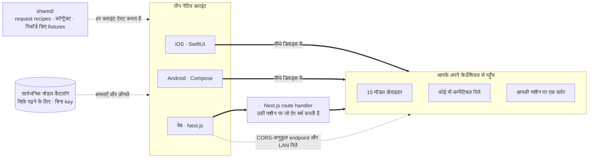

<div align="center">


# Oriveo Community Edition

**हर मॉडल, एक ऐप।**

iOS, Android और वेब के लिए ओपन-सोर्स, अपनी-खुद-की-key वाला AI चैट क्लाइंट,
और एक नेटिव macOS क्लाइंट बन रहा है।
न कोई अकाउंट, न सब्सक्रिप्शन, और चैट रिक्वेस्ट के रास्ते में हमारी अपनी कोई सर्विस नहीं।

<a href="../../LICENSE"></a>
<a href="ios.md"></a>
<a href="android.md"></a>
<a href="web.md"></a>
<a href="macos.md"></a>
<a href="https://github.com/oriveo/oriveo/releases/latest"></a>
<a href="https://github.com/oriveo/oriveo/stargazers"></a>

**Oriveo लें:**
<a href="https://oriveoai.com"><b>oriveoai.com</b></a> &nbsp;·&nbsp;
<a href="https://apps.apple.com/app/oriveo/id6775370458">App Store</a> &nbsp;·&nbsp;
<a href="https://play.google.com/store/apps/details?id=com.kenny.oriveo">Google Play</a> &nbsp;·&nbsp;
<a href="https://app.oriveoai.com">वेब ऐप</a>

<sub>स्टोर वाले बिल्ड <b>Oriveo</b> हैं, यानी व्यावसायिक संस्करण। यह रिपॉज़िटरी <a href="#community-edition-और-oriveo">Community Edition</a> है, जो सोर्स से बिल्ड होती है।</sub>

<a href="#शुरुआत-करें">सोर्स से बिल्ड करें</a> &nbsp;·&nbsp;
<a href="#आर्किटेक्चर">आर्किटेक्चर</a> &nbsp;·&nbsp;
<a href="#community-edition-और-oriveo">संस्करण</a> &nbsp;·&nbsp;
<a href="#अक्सर-पूछे-जाने-वाले-सवाल">सवाल-जवाब</a> &nbsp;·&nbsp;
<a href="../../CONTRIBUTING.md">योगदान</a>

<sub>

<a href="../../README.md">English</a> ·
<a href="../ar/README.md">العربية</a> ·
<a href="../de/README.md">Deutsch</a> ·
<a href="../es/README.md">Español</a> ·
<a href="../fr/README.md">Français</a> ·
**हिन्दी** ·
<a href="../id/README.md">Indonesia</a> ·
<a href="../ja/README.md">日本語</a> ·
<a href="../ko/README.md">한국어</a> ·
<a href="../pt-BR/README.md">Português</a> ·
<a href="../ru/README.md">Русский</a> ·
<a href="../th/README.md">ไทย</a> ·
<a href="../tr/README.md">Türkçe</a> ·
<a href="../vi/README.md">Tiếng Việt</a> ·
<a href="../zh-Hans/README.md">简体中文</a> ·
<a href="../zh-Hant/README.md">繁體中文</a>

</sub>


</div>

---

## Oriveo क्या है

Oriveo Community Edition, iOS, Android और वेब के लिए एक ओपन-सोर्स (open-source), मल्टी-मॉडल
(multi-model), bring-your-own-key (BYOK) AI चैट क्लाइंट (AI chat client) है, और एक नेटिव macOS
क्लाइंट बन रहा है। यह होस्टेड ChatGPT या Claude प्लान का एक लोकल-फ़र्स्ट विकल्प है, उन लोगों के लिए
जो मॉडल प्रोवाइडर को सीधे पैसे देना पसंद करते हैं, बजाय उसके आगे बैठी किसी चीज़ की सब्सक्रिप्शन भरने
के। आप अपनी पहले से मौजूद API key देते हैं, क्लाइंट उन्हीं से प्रोवाइडर से बात करता है, और वेब
क्लाइंट को आप ख़ुद होस्ट (self-host) कर सकते हैं — न Oriveo अकाउंट, और न कुछ हमें वापस रिपोर्ट करने
वाला।

यह **15 मॉडल प्रोवाइडर** से सीधे बात करता है — OpenAI, Anthropic, Google Gemini, OpenRouter,
DeepSeek, Grok, Mistral, Groq, Together AI, Fireworks AI, MiniMax, Z.ai, Qwen, Kimi (Moonshot) और
SiliconFlow — साथ ही **किसी भी OpenAI-, Anthropic- या Gemini-कम्पैटिबल endpoint** से, जिसे आप
इसमें जोड़ दें; इनमें आपकी अपनी मशीन पर चल रहे llama.cpp, Ollama, LM Studio या vLLM भी शामिल हैं।
एक ही LLM क्लाइंट (LLM client), बातचीत का एक ही संग्रह, जवाब चाहे कोई भी मॉडल दे।

<table>
<tr>
<td width="33%" valign="top"><b>15 प्रोवाइडर</b><br>साथ में रिले endpoint और लोकल मॉडल सर्वर।</td>
<td width="33%" valign="top"><b>डिफ़ॉल्ट रूप से लोकल</b><br>बातचीत, नोट्स, फ़ोल्डर, कौशल और अटैचमेंट डिवाइस पर ही रहते हैं।</td>
<td width="33%" valign="top"><b>एक व्यवहार, तीन क्लाइंट</b><br><code>shared/</code> में एक ही स्पेक, तीन सुइट उसे जाँचते हैं।</td>
</tr><tr>
<td valign="top"><b>कोई अकाउंट नहीं</b><br>कुछ भी हमें वापस रिपोर्ट नहीं करता।</td>
<td valign="top"><b>ख़ुद होस्ट करें</b><br>वेब क्लाइंट आपकी मशीन पर चलता है।</td>
<td valign="top"><b>16 भाषाएँ</b><br>अरबी के लिए पूरा right-to-left लेआउट।</td>
</tr></table>

## यह क्यों मौजूद है

जिस मॉडल का पैसा आप चुका रहे हैं, उस पर मीटर लगाने, उसे लॉग करने या उस पर मार्कअप लेने का हक़ किसी को
नहीं होना चाहिए।

- **आपकी key, आपका बिल।** आप प्रोवाइडर की लिस्ट प्राइस चुकाते हैं। न कोई मार्कअप, न मीटरिंग, न रीसेल।
- **डिफ़ॉल्ट रूप से लोकल।** बातचीत, नोट्स, फ़ोल्डर, कौशल और अटैचमेंट डिवाइस पर ही रहते हैं। जब चाहें
  इन्हें फ़ाइल में एक्सपोर्ट कर लें; ऐसी कोई क्लाउड कॉपी नहीं है जिस तक पहुँच छिन जाए।
- **एक व्यवहार, तीन क्लाइंट।** किसी प्रोवाइडर, transport और capability के लिए रिक्वेस्ट कैसी बनेगी, यह
  एक ही जगह [`shared/`](shared.md) में लिख दी गई है, और तीनों क्लाइंट उन्हीं JSON fixtures के विरुद्ध
  टेस्ट करते हैं। जो ख़ास आदत उसी डेटा में बैठी है, वह एक बार ठीक होती है; जो parser में बैठी है, उसे
  तीनों सुइट एक ही साथ पकड़ लेते हैं।
- **वह एक चीज़ जो यह लाता है।** एक सार्वजनिक, सिर्फ़ पढ़ने वाला मॉडल कैटलॉग, ताकि आज रिलीज़ हुआ मॉडल
  बिना ऐप अपडेट के काम करे — न key, न हमारा जोड़ा कोई पहचानकर्ता, और इसे अपने ही होस्ट पर मोड़ा जा
  सकता है।

## फ़ीचर

- **चैट** — streaming, reasoning ब्लॉक, citations, अटैचमेंट (इमेज और वीडियो, PDF, Office
  (docx, xlsx, pptx), OpenDocument, EPUB, RTF, HTML, और कोई भी सादा-टेक्स्ट या सोर्स फ़ाइल), चुने हुए
  हिस्से को कोट करना, retry, दोबारा जनरेट करना, बीच में रुके जवाब को आगे बढ़ाना
- **प्रोवाइडर** — 15 बिल्ट-इन, हर एक आपकी अपनी key के साथ; हर प्रोवाइडर के लिए मॉडल और जनरेशन
  पैरामीटर override, और जहाँ प्रोवाइडर देता है वहाँ क्षेत्रीय endpoint चुनने की सुविधा
- **रिले सेवा (Relay)** — कोई भी OpenAI-, Anthropic- या Gemini-कम्पैटिबल endpoint, साथ ही
  llama.cpp का अपना नेटिव API, आपके LAN वाला भी
- **लोकल मॉडल सर्वर** — llama.cpp, Ollama, LM Studio, vLLM, Open WebUI; iOS और Android इन्हें लोकल
  नेटवर्क पर तब mDNS से खोजते हैं जब इंजन ख़ुद को घोषित करता है, वरना आम पोर्ट टटोलकर
- **सब्सक्रिप्शन साइन-इन** — API key के बजाय अपना पहले से मौजूद ChatGPT या Grok सब्सक्रिप्शन इस्तेमाल
  करें, हर प्रोवाइडर के अपने device-authorization फ़्लो से
- **कौशल** — दोबारा इस्तेमाल होने वाले सिस्टम प्रॉम्प्ट, अपने मॉडल, reasoning सेटिंग और रेफ़रेंस
  दस्तावेज़ों के साथ
- **नोट्स और फ़ोल्डर** — किसी जवाब को नोट बना लें, बातचीत व्यवस्थित करें, दोनों में सर्च करें
- **दूसरे मॉडल से जाँचें** — किसी जवाब को दूसरे मॉडल के पास समीक्षा के लिए भेजें और दोनों को साथ रखें
- **याद** — अपने बारे में कुछ बातें, एक बार लिखें और वे हर नई बातचीत में साथ चलें
- **लागत** — हर मैसेज और हर प्रोवाइडर का ख़र्च, डिवाइस पर ही उसी डेटा से गिना जाता है जो हर response
  ने वाक़ई बताया, cache पढ़ने और cache लिखने के टियर सहित
- **इमेज जनरेशन** — जहाँ प्रोवाइडर इसे सपोर्ट करता है
- **बैकअप** — सब कुछ एक फ़ाइल में एक्सपोर्ट करें; उसमें मौजूद प्रोवाइडर key, अगर आप उन्हें शामिल करना
  चुनें, आपके अपने पासवर्ड से एन्क्रिप्ट होती हैं
- **16 इंटरफ़ेस भाषाएँ**, अरबी के लिए पूरा right-to-left लेआउट सहित

## Community Edition और Oriveo

यह रिपॉज़िटरी **Oriveo Community Edition** है, जिसका लाइसेंस
[AGPL-3.0-or-later](../../LICENSE) है। App Store, Google Play और होस्टेड वेब ऐप पर मौजूद ऐप
**Oriveo** हैं — एक अलग प्रोप्राइटरी प्रोडक्ट, जो एक अकाउंट लेयर जोड़ता है।

| | Community Edition | Oriveo |
|---|---|---|
| सोर्स | यह रिपॉज़िटरी, AGPL-3.0-or-later | प्रोप्राइटरी |
| अपनी प्रोवाइडर key से चैट | हाँ | हाँ |
| रिले सेवा और लोकल मॉडल सर्वर | हाँ | हाँ |
| नोट्स, फ़ोल्डर, कौशल, अटैचमेंट | हाँ | हाँ |
| डिवाइस पर लागत ट्रैकिंग | हाँ | हाँ |
| अकाउंट | नहीं | Oriveo अकाउंट |
| स्टोरेज | डिवाइस पर; मैन्युअल एक्सपोर्ट और रीस्टोर | लोकल-फ़र्स्ट, साथ में क्रॉस-डिवाइस क्लाउड sync |
| उपयोग की जानकारी और बजट अलर्ट | — | हाँ |
| वे मॉडल जिनका पैसा Oriveo चुकाता है | — | हाँ |
| Analytics और crash रिपोर्टिंग | कुछ भी नहीं। वेब बंडल का Sentry आपके अपने DSN के बिना ख़ामोश रहता है | हाँ |

Community Edition के बिल्ड `ai.oriveo.community` identifier prefix इस्तेमाल करते हैं, इसलिए एक बिल्ड
स्टोर वाले बिल्ड के साथ उसी डिवाइस पर रह सकता है और दोनों न keychain साझा करते हैं, न कोई लोकल डेटा।
यह संस्करण किन बदलावों को स्वीकार करेगा और किन्हें नहीं, यह [COMMUNITY.md](../../COMMUNITY.md) में
लिखा है।

**Oriveo, पूरा प्रोडक्ट:** [iPhone और iPad](https://apps.apple.com/app/oriveo/id6775370458) ·
[Android](https://play.google.com/store/apps/details?id=com.kenny.oriveo) · [वेब](https://app.oriveoai.com) · [oriveoai.com](https://oriveoai.com)

## प्रोवाइडर

नीचे दिए हर प्रोवाइडर तक उसी key से पहुँचा जाता है जो आप ख़ुद बनाते हैं। इनमें से दो तक key के बजाय
अपनी पहले से मौजूद सब्सक्रिप्शन से साइन-इन करके भी पहुँचा जा सकता है: OpenAI तक ChatGPT प्लान से,
और Grok तक।

| प्रोवाइडर | key कहाँ से लें |
|---|---|
| OpenAI | [platform.openai.com](https://platform.openai.com/api-keys) |
| Anthropic | [platform.claude.com](https://platform.claude.com/settings/keys) |
| Google Gemini | [aistudio.google.com](https://aistudio.google.com/apikey) |
| OpenRouter | [openrouter.ai](https://openrouter.ai/keys) |
| DeepSeek | [platform.deepseek.com](https://platform.deepseek.com/api_keys) |
| Grok | [console.x.ai](https://console.x.ai/) |
| Mistral | [console.mistral.ai](https://console.mistral.ai/api-keys) |
| Groq | [console.groq.com](https://console.groq.com/keys) |
| Together AI | [api.together.xyz](https://api.together.xyz/settings/api-keys) |
| Fireworks AI | [fireworks.ai](https://fireworks.ai/api-keys) |
| MiniMax | [platform.minimax.io](https://platform.minimax.io/docs/guides/quickstart-preparation) |
| Z.ai | [open.bigmodel.cn](https://open.bigmodel.cn/usercenter/apikeys) |
| Qwen | [bailian.console.alibabacloud.com](https://bailian.console.alibabacloud.com/?apiKey=1#/api-key) |
| Kimi (Moonshot) | [platform.kimi.ai](https://platform.kimi.ai/console/api-keys) |
| SiliconFlow | [cloud.siliconflow.cn](https://cloud.siliconflow.cn/account/ak) |
| **रिले सेवा** | कोई भी OpenAI-, Anthropic- या Gemini-कम्पैटिबल endpoint, साथ ही llama.cpp का अपना नेटिव API, आपकी अपनी मशीन वाला भी |

## आर्किटेक्चर

तीन नेटिव क्लाइंट, और मॉडल प्रोवाइडर से कैसे बात करनी है इसकी एक ही परिभाषा।



हर क्लाइंट का अपना UI, अपना स्टोरेज और अपना navigation है, और वह साझा कॉन्ट्रैक्ट से ठीक एक ही जगह
मिलता है: वह लेयर जो *इस मॉडल, इस capability* को एक HTTP रिक्वेस्ट में बदलती है।

जानने लायक इकलौती असमानता वेब क्लाइंट है। ज़्यादातर प्रोवाइडर API कोई CORS हेडर नहीं भेजते, इसलिए
ब्राउज़र उन्हें सीधे कॉल नहीं कर सकता। वे रिक्वेस्ट एक Next.js route handler से होकर जाती हैं जो उसी
मशीन पर चलता है जो ऐप सर्व कर रही है — यानी लोकल रूप से चलाने पर आपकी अपनी मशीन। जो गिने-चुने endpoint
ब्राउज़र को इजाज़त देते हैं (Kimi का चीन वाला endpoint, और OpenRouter, SiliconFlow, DeepSeek तथा Kimi
के बैलेंस endpoint) और आपके अपने नेटवर्क के रिले, उन्हें सीधे कॉल किया जाता है। iOS और Android क्लाइंट पर यह पाबंदी नहीं है और वे
हमेशा सीधे प्रोवाइडर तक जाते हैं।

**हर क्लाइंट का आर्किटेक्चर:**

| | स्टैक | README |
|---|---|---|
| **iOS** | SwiftUI, साथ में UIKit transcript, GRDB | [ios.md](ios.md) |
| **Android** | Jetpack Compose, Room, Koin, Ktor/OkHttp | [android.md](android.md) |
| **वेब** | Next.js App Router, React, Zustand, TypeScript | [web.md](web.md) |
| **macOS** | बन रहा है, अगले कुछ महीनों में आएगा | [macos.md](macos.md) |
| **Shared** | कॉन्ट्रैक्ट, रिकॉर्ड किए fixtures, और Swift wire kernel | [shared.md](shared.md) |

## शुरुआत करें

यहाँ पहले से बना कोई बाइनरी नहीं है — न APK, न `.ipa`। Community Edition वह सोर्स है
जिसे आप ख़ुद बिल्ड करते हैं। चलता हुआ ऐप पाने का सबसे छोटा रास्ता वेब क्लाइंट है।

<details open>
<summary><b>वेब</b> — आज़माने का सबसे तेज़ तरीक़ा</summary>

<br>

Node 22.22.2 या उससे नया 22.x चाहिए ([`web/.nvmrc`](../../web/.nvmrc) देखें); Node 23+ सपोर्टेड नहीं है।

```bash
cd web
npm install
npm run dev:app        # http://localhost:3001
```

पहली स्क्रीन एक प्रोवाइडर API key माँगती है। इसके अलावा और कुछ ज़रूरी नहीं।
और कमांड तथा कॉन्फ़िगरेशन: [web.md](web.md)।

</details>

<details>
<summary><b>iOS</b> — अपने iPhone पर बिल्ड करके चलाएँ</summary>

<br>

Xcode 26 वाला एक Mac और iOS 18 या उससे नया डिवाइस चाहिए। मुफ़्त Apple Developer अकाउंट काफ़ी है —
ऐप कोई पेड capability इस्तेमाल नहीं करता।

1. `ios/Oriveo/Oriveo.xcodeproj` खोलें
2. `Oriveo` scheme चुनें
3. Signing &amp; Capabilities में अपनी Team चुनें
4. अगर Xcode `ai.oriveo.community` रजिस्टर न कर पाए, तो bundle identifier बदलकर अपनी टीम का कोई identifier रखें
5. Run करें

पूरी प्रक्रिया, और Xcode प्रोजेक्ट खोलने से मना कर दे तो क्या करें: [ios.md](ios.md)।

</details>

<details>
<summary><b>Android</b> — APK बनाएँ</summary>

<br>

JDK 21 और Android SDK चाहिए। बिल्ड AGP 9.3, Gradle 9.5 और Kotlin 2.3 इस्तेमाल करता है,
इसलिए Android Studio का वही रिलीज़ चाहिए जो इन्हें sync कर सके। कमांड लाइन से सिर्फ़ JDK और SDK काफ़ी हैं।

```bash
cd android
./gradlew :app:assembleDebug
```

मॉडल कैटलॉग को अपने होस्ट से सर्व करना: [android.md](android.md)।

</details>

## प्राइवेसी

- **प्रोवाइडर key** iOS पर Keychain में जाती हैं, और Android पर `EncryptedSharedPreferences` में, एक
  ऐसी key के तहत जो Android Keystore में रखी रहती है। ब्राउज़र के पास इसके बराबर कोई सुविधा नहीं है,
  इसलिए वेब पर वे बिना एन्क्रिप्शन के IndexedDB में पड़ी रहती हैं — वही तरीक़ा जो ब्राउज़र आधारित BYOK
  क्लाइंट आम तौर पर अपनाते हैं। सबसे मज़बूत गारंटी के लिए iOS या Android क्लाइंट इस्तेमाल करें।
- **बातचीत, नोट्स, फ़ोल्डर, कौशल और अटैचमेंट** डिवाइस पर रखे जाते हैं। कुछ भी कहीं अपलोड नहीं होता।
- **न कोई अकाउंट, और न कोई analytics।** साइन-इन करने को कुछ है ही नहीं, और आप जो करते हैं उसे कुछ
  भी नहीं गिनता। वेब बंडल में एरर रिपोर्टिंग के लिए Sentry शामिल है। वह तब तक ख़ामोश रहता है जब तक
  आप `NEXT_PUBLIC_SENTRY_DSN` को अपने किसी प्रोजेक्ट पर सेट न कर दें, और अगर करते हैं तो वह
  stack trace के साथ-साथ session replay भी दर्ज करने के लिए कॉन्फ़िगर है। iOS और Android क्लाइंट में
  रिपोर्टिंग का कोई SDK ही नहीं है।
- **iOS और Android पर चैट रिक्वेस्ट सीधे डिवाइस से प्रोवाइडर तक जाती हैं।** वेब पर उनमें से ज़्यादातर उसी
  Next.js सर्वर से होकर जाती हैं जो ऐप सर्व करता है, क्योंकि ज़्यादातर प्रोवाइडर API ब्राउज़र से सीधी कॉल की
  इजाज़त नहीं देते। वह सर्वर न key सहेजता है न मैसेज, और लोकल रूप से चलाने पर वह आपकी अपनी मशीन ही है।
- **हमारी अपनी दो रिक्वेस्ट:** सिर्फ़ पढ़ने वाला मॉडल कैटलॉग, जो दो कॉल में पढ़ा जाता है। एक इसे
  कवर करती है कि हर मॉडल को कैसे संबोधित किया जाना चाहिए; दूसरी अलग-अलग मॉडल के तथ्यों को, जिसे iOS
  सब्सक्रिप्शन साइन-इन के बाद ही पढ़ता है। दोनों मिलकर यह सुनिश्चित करती हैं कि आज रिलीज़ हुआ मॉडल
  बिना नए बिल्ड के काम करे। इनमें से किसी में भी न key जाती है, न बातचीत, न हमारा जोड़ा कोई
  पहचानकर्ता। होस्ट को प्लैटफ़ॉर्म का डिफ़ॉल्ट User-Agent दिखता है, और क्लाइंट वापस सिर्फ़ कैटलॉग का
  अपना `ETag` भेजता है, `If-None-Match` के रूप में। वेब क्लाइंट
  (`NEXT_PUBLIC_BACKEND_URL`) और Android बिल्ड (`-PORIVEO_METADATA_BASE_URL`) को अपने ही होस्ट पर
  मोड़ा जा सकता है; iOS पर वह override सिर्फ़ Debug बिल्ड की सुविधा है।

## अक्सर पूछे जाने वाले सवाल

<details>
<summary><b>क्या Oriveo, OpenAI, Claude, Gemini और OpenRouter के लिए एक BYOK क्लाइंट है?</b></summary>

<br>

Bring your own key — अपनी खुद की key लाइए। आप प्रोवाइडर के अपने कंसोल में एक API key बनाते हैं —
OpenAI, Anthropic, Google वग़ैरह — और उसे Oriveo में पेस्ट कर देते हैं। रिक्वेस्ट का बिल वही प्रोवाइडर
अपनी लिस्ट प्राइस पर बनाता है। Oriveo सिर्फ़ क्लाइंट है; वह रीसेलर नहीं है और कोई कमीशन नहीं लेता।

</details>

<details>
<summary><b>क्या Oriveo एक मुफ़्त, ओपन-सोर्स ChatGPT विकल्प है?</b></summary>

<br>

क्लाइंट है: ओपन सोर्स, सब्सक्राइब करने को कुछ नहीं, और इसका कोई हिस्सा किसी भुगतान के पीछे रोका नहीं
गया है। आप जो चुकाते हैं वह है आपकी की गई रिक्वेस्ट के लिए मॉडल प्रोवाइडर की अपनी लिस्ट प्राइस,
जिसका बिल वही बनाता है, उसी अकाउंट पर जिससे key जुड़ी है। वह बिल Oriveo कभी नहीं देखता।

</details>

<details>
<summary><b>क्या मेरी बातचीत किसी Oriveo सर्वर से होकर जाती है?</b></summary>

<br>

नहीं। iOS और Android सीधे प्रोवाइडर को कॉल करते हैं। वेब पर ज़्यादातर रिक्वेस्ट उसी
Next.js सर्वर से होकर जाती हैं जो ऐप सर्व कर रहा है — लोकल रूप से चलाने पर आपकी अपनी मशीन — क्योंकि
ज़्यादातर प्रोवाइडर API ब्राउज़र से आई कॉल ठुकरा देते हैं। चैट के रास्ते में हमारा चलाया हुआ कोई सर्वर
नहीं आता। [प्राइवेसी](#प्राइवेसी) देखें।

</details>

<details>
<summary><b>क्या यह Ollama, LM Studio या llama.cpp के साथ काम करता है?</b></summary>

<br>

हाँ। किसी भी OpenAI-, Anthropic- या Gemini-कम्पैटिबल सर्वर की ओर इशारा करता हुआ एक रिले सेवा कनेक्शन
जोड़ दें — llama.cpp, Ollama, LM Studio, vLLM, Open WebUI, या उन प्रोटोकॉल में से कोई एक बोलने वाला
कुछ और भी। iOS और Android क्लाइंट ऐसा सर्वर लोकल नेटवर्क पर तब mDNS से खोजते हैं जब इंजन ख़ुद को
घोषित करता है, वरना आम पोर्ट टटोलकर; वेब क्लाइंट हर इंजन का आम पता सुझाता है। लोकल HTTP में कोई
credential इस्तेमाल नहीं होता और वह आपका नेटवर्क कभी नहीं छोड़ता।

</details>

<details>
<summary><b>क्या मैं Oriveo को ख़ुद होस्ट कर सकता हूँ?</b></summary>

<br>

हाँ। पूरे प्रोजेक्ट में सर्वर साइड सिर्फ़ वेब क्लाइंट का है, और यह न key सहेजता है न मैसेज। इसे अपने
ही हार्डवेयर पर चल रहे मॉडल सर्वर पर मोड़ दें, कैटलॉग को `NEXT_PUBLIC_BACKEND_URL` (वेब) या
`-PORIVEO_METADATA_BASE_URL` (Android) से ख़ुद होस्ट करें, और कुछ भी आपके नेटवर्क से बाहर नहीं
जाएगा। iOS पर वह override सिर्फ़ Debug बिल्ड में मौजूद है। [प्राइवेसी](#प्राइवेसी) देखें।

</details>

<details>
<summary><b>Community Edition, App Store वाले Oriveo ऐप से कैसे अलग है?</b></summary>

<br>

स्टोर वाले ऐप Oriveo हैं, एक प्रोप्राइटरी प्रोडक्ट जो अकाउंट, क्रॉस-डिवाइस क्लाउड sync, उपयोग की
जानकारी और वे मॉडल जोड़ता है जिनका पैसा Oriveo चुकाता है। Community Edition में इनमें से कुछ भी नहीं
है। पूरी तुलना के लिए
[Community Edition और Oriveo](#community-edition-और-oriveo) देखें।

</details>

<details>
<summary><b>क्या macOS ऐप है?</b></summary>

<br>

एक नेटिव macOS क्लाइंट बन रहा है और अगले कुछ महीनों में आएगा; [`macos/`](macos.md) वही जगह है जहाँ
वह आएगा। तब तक वेब क्लाइंट किसी भी ब्राउज़र में डेस्कटॉप ऐप की तरह अच्छा काम करता है, और iOS बिल्ड
Apple silicon वाले Mac पर सीधे Xcode से चलता है। प्रोवाइडर से बात करने वाला Swift पैकेज macOS 15
पहले ही घोषित करता है, इसलिए Mac क्लाइंट को जिस wire लेयर की ज़रूरत है वह आज टेस्ट के अंदर है।

</details>

<details>
<summary><b>इंटरफ़ेस किन भाषाओं में उपलब्ध है?</b></summary>

<br>

सोलह: अरबी, जर्मन, अंग्रेज़ी, स्पेनिश, फ़्रेंच, हिन्दी, इंडोनेशियाई, जापानी, कोरियाई, ब्राज़ीली
पुर्तगाली, रूसी, थाई, तुर्की, वियतनामी, सरलीकृत चीनी और पारंपरिक चीनी। अरबी को पूरा right-to-left
लेआउट मिलता है।

</details>

## रिपॉज़िटरी का ढाँचा

```
ios/           iOS क्लाइंट (SwiftUI)
android/       Android क्लाइंट (Jetpack Compose)
web/           वेब क्लाइंट (Next.js)
macos/         macOS क्लाइंट — बन रहा है, अगले कुछ महीनों में आएगा
shared/        क्लाइंट-भर के कॉन्ट्रैक्ट, रिकॉर्ड किए fixtures, और Swift wire kernel
readme_i18n/   ये README पंद्रह और भाषाओं में
docs/assets/   README में इस्तेमाल होने वाली इमेज
llms.txt       इस दस्तावेज़ी का मशीन-पठनीय सूचकांक
.github/       Issue और pull request टेम्पलेट
```

## योगदान

बग रिपोर्ट और pull request का स्वागत है। [CONTRIBUTING.md](../../CONTRIBUTING.md) बताता है कि हर
क्लाइंट कैसे बिल्ड करें और एक अच्छा pull request कैसा दिखता है।
[COMMUNITY.md](../../COMMUNITY.md) बताता है कि यह संस्करण किसलिए है, और वे कुछ क़िस्म के बदलाव कौन से
हैं जो कितने भी अच्छे लिखे हों, स्वीकार नहीं किए जाएँगे।

कोई सुरक्षा समस्या मिली? कृपया सार्वजनिक issue न खोलें — [SECURITY.md](../../SECURITY.md) बताता है कि
उसकी निजी तौर पर रिपोर्ट कैसे करें, और यह प्रोजेक्ट किसे vulnerability मानता है और किसे नहीं। हिस्सा
लेने वाले हर व्यक्ति से [आचार संहिता](../../CODE_OF_CONDUCT.md) का पालन अपेक्षित है।

## लाइसेंस

[AGPL-3.0-or-later](../../LICENSE)। योगदान इसी लाइसेंस के तहत स्वीकार किए जाते हैं।

प्रोवाइडर के नाम और लोगो उनके अपने मालिकों के हैं और यहाँ सिर्फ़ यह बताने के लिए दिखते हैं कि इस
क्लाइंट को किन सेवाओं की ओर मोड़ा जा सकता है। वे इस रिपॉज़िटरी के लाइसेंस के दायरे में नहीं आते, और
उनकी मौजूदगी किसी की ओर से कोई समर्थन नहीं है। क्लाइंट जो फ़ॉन्ट और लाइब्रेरी साथ रखते हैं, और वे जिन
शर्तों के तहत आते हैं, उनकी सूची [THIRD-PARTY-NOTICES.md](../../THIRD-PARTY-NOTICES.md) में है।
