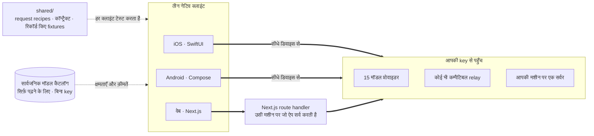

<div align="center">


# Oriveo

**हर मॉडल, एक ऐप।**

iOS, Android और वेब के लिए ओपन-सोर्स, अपनी-खुद-की-key वाला AI चैट क्लाइंट।
न कोई अकाउंट, न सब्सक्रिप्शन, और आपके तथा मॉडल के बीच हमारा कोई सर्वर नहीं।

<a href="../../LICENSE"></a>
<a href="ios.md"></a>
<a href="android.md"></a>
<a href="web.md"></a>


<a href="https://oriveoai.com">वेबसाइट</a> &nbsp;·&nbsp;
<a href="#शुरुआत-करें">शुरुआत करें</a> &nbsp;·&nbsp;
<a href="#आर्किटेक्चर">आर्किटेक्चर</a> &nbsp;·&nbsp;
<a href="#community-edition-और-oriveo">संस्करण</a> &nbsp;·&nbsp;
<a href="#अक्सर-पूछे-जाने-वाले-सवाल">सवाल-जवाब</a> &nbsp;·&nbsp;
<a href="../../CONTRIBUTING.md">योगदान</a>

<sub>

<a href="../../README.md">English</a> ·
<a href="../ar/README.md">العربية</a> ·
<a href="../de/README.md">Deutsch</a> ·
<a href="../es/README.md">Español</a> ·
<a href="../fr/README.md">Français</a> ·
**हिन्दी** ·
<a href="../id/README.md">Indonesia</a> ·
<a href="../ja/README.md">日本語</a> ·
<a href="../ko/README.md">한국어</a> ·
<a href="../pt-BR/README.md">Português</a> ·
<a href="../ru/README.md">Русский</a> ·
<a href="../th/README.md">ไทย</a> ·
<a href="../tr/README.md">Türkçe</a> ·
<a href="../vi/README.md">Tiếng Việt</a> ·
<a href="../zh-Hans/README.md">简体中文</a> ·
<a href="../zh-Hant/README.md">繁體中文</a>

</sub>

</div>

---

## Oriveo क्या है

Oriveo Community Edition, iOS, Android और वेब के लिए एक bring-your-own-key (BYOK) AI चैट
क्लाइंट है। आप अपनी पहले से मौजूद API key देते हैं, और क्लाइंट उन्हीं से प्रोवाइडर से बात करता है।
न कोई Oriveo अकाउंट है, न सब्सक्रिप्शन, और न ही कोई analytics।

यह **15 मॉडल प्रोवाइडर** से सीधे बात करता है — OpenAI, Anthropic, Google Gemini, OpenRouter,
DeepSeek, Grok, Mistral, Groq, Together AI, Fireworks AI, MiniMax, Z.ai, Qwen, Kimi और
SiliconFlow — साथ ही **किसी भी OpenAI-, Anthropic- या Gemini-कम्पैटिबल endpoint** से, जिसे आप
इसमें जोड़ दें; इनमें आपकी अपनी मशीन पर चल रहे llama.cpp, Ollama, LM Studio या vLLM भी शामिल हैं।

| | |
|---|---|
| **प्रोवाइडर** | 15 बिल्ट-इन, साथ में कस्टम relay endpoint और लोकल मॉडल सर्वर |
| **क्लाइंट** | iOS (SwiftUI) · Android (Jetpack Compose) · वेब (Next.js) |
| **इंटरफ़ेस भाषाएँ** | 16 |
| **अकाउंट ज़रूरी** | नहीं |
| **अपनी ओर से जो कॉल करता है** | एक: सिर्फ़ पढ़ने वाला मॉडल कैटलॉग, जिसमें न key जुड़ी है न कोई पहचानकर्ता |
| **लाइसेंस** | AGPL-3.0-or-later |

## यह क्यों मौजूद है

एक चैट क्लाइंट को आपके और उस मॉडल के बीच नहीं खड़ा होना चाहिए जिसका पैसा आप चुका रहे हैं।

- **आपकी key, आपका बिल।** आप प्रोवाइडर की लिस्ट प्राइस चुकाते हैं। न कोई मार्कअप, न मीटरिंग, न रीसेल।
- **डिफ़ॉल्ट रूप से लोकल।** बातचीत, नोट्स, फ़ोल्डर, skills और अटैचमेंट डिवाइस पर ही रहते हैं। जब चाहें
  इन्हें फ़ाइल में एक्सपोर्ट कर लें; ऐसी कोई क्लाउड कॉपी नहीं है जिस तक पहुँच छिन जाए।
- **एक व्यवहार, तीन क्लाइंट।** किसी प्रोवाइडर, transport और capability के लिए रिक्वेस्ट कैसी बनेगी, यह
  एक ही जगह [`shared/`](shared.md) में तय है, और तीनों क्लाइंट उन्हीं JSON fixtures के विरुद्ध टेस्ट
  करते हैं। किसी प्रोवाइडर की ख़ास आदत एक बार ठीक होती है, तीन बार नहीं।
- **जो एक कॉल करता है, उसके बारे में ईमानदार।** ऐप एक सार्वजनिक मॉडल कैटलॉग लाता है ताकि आज रिलीज़
  हुआ मॉडल बिना ऐप अपडेट के काम करे। यह सिर्फ़ पढ़ने के लिए है, इसमें न key जाती है न कोई पहचानकर्ता,
  और आप इसे अपने ही होस्ट पर मोड़ सकते हैं।

## फ़ीचर

- **चैट** — streaming, reasoning ब्लॉक, citations, अटैचमेंट (इमेज, PDF, Office, EPUB, HTML, सादा
  टेक्स्ट), चुने हुए हिस्से को कोट करना, retry, दोबारा जनरेट करना, बीच में रुके जवाब को आगे बढ़ाना
- **प्रोवाइडर** — 15 बिल्ट-इन, हर एक आपकी अपनी key के साथ; हर प्रोवाइडर के लिए endpoint, मॉडल और
  पैरामीटर override
- **Relay** — कोई भी OpenAI-, Anthropic- या Gemini-कम्पैटिबल endpoint, आपके LAN वाला भी
- **लोकल मॉडल सर्वर** — llama.cpp, Ollama, LM Studio, vLLM, लोकल नेटवर्क पर खोज के साथ
- **सब्सक्रिप्शन साइन-इन** — API key के बजाय अपना पहले से मौजूद Codex या Grok सब्सक्रिप्शन इस्तेमाल करें
- **Skills** — दोबारा इस्तेमाल होने वाले सिस्टम प्रॉम्प्ट, अपने मॉडल, पैरामीटर और रेफ़रेंस दस्तावेज़ों के साथ
- **नोट्स और फ़ोल्डर** — किसी जवाब को नोट बना लें, बातचीत व्यवस्थित करें, फ़ुल-टेक्स्ट सर्च करें
- **Cross-check** — वही सवाल दूसरे मॉडल से दोबारा पूछें और दोनों जवाब अगल-बगल रखें
- **लागत** — हर मैसेज और हर प्रोवाइडर का ख़र्च, डिवाइस पर ही उसी डेटा से गिना जाता है जो हर response
  ने वाक़ई बताया, cache-डिस्काउंट टियर सहित
- **इमेज जनरेशन** — जहाँ प्रोवाइडर इसे सपोर्ट करता है
- **बैकअप** — सब कुछ एक फ़ाइल में एक्सपोर्ट करें, चाहें तो अपने चुने पासवर्ड से एन्क्रिप्ट करके
- **16 इंटरफ़ेस भाषाएँ**, अरबी के लिए पूरा right-to-left लेआउट सहित

## Community Edition और Oriveo

यह रिपॉज़िटरी **Oriveo Community Edition** है, जिसका लाइसेंस
[AGPL-3.0-or-later](../../LICENSE) है। App Store, Google Play और होस्टेड वेब ऐप पर मौजूद ऐप
**Oriveo** हैं — उन्हीं क्लाइंट से बना एक अलग प्रोप्राइटरी प्रोडक्ट, जिसके ऊपर एक अकाउंट लेयर है।

| | Community Edition | Oriveo |
|---|---|---|
| सोर्स | यह रिपॉज़िटरी, AGPL-3.0-or-later | प्रोप्राइटरी |
| अपनी प्रोवाइडर key से चैट | हाँ | हाँ |
| Relay और लोकल मॉडल सर्वर | हाँ | हाँ |
| नोट्स, फ़ोल्डर, skills, अटैचमेंट | हाँ, बिना सीमा | हाँ |
| डिवाइस पर लागत ट्रैकिंग | हाँ | हाँ |
| अकाउंट | नहीं | Oriveo अकाउंट |
| स्टोरेज | डिवाइस पर; मैन्युअल एक्सपोर्ट और रीस्टोर | लोकल-फ़र्स्ट, साथ में क्रॉस-डिवाइस क्लाउड sync |
| उपयोग की जानकारी और बजट अलर्ट | — | हाँ |
| वे मॉडल जिनका पैसा Oriveo चुकाता है | — | हाँ |
| Analytics और crash रिपोर्टिंग | नहीं | हाँ |

Community Edition के बिल्ड `ai.oriveo.community` identifier prefix इस्तेमाल करते हैं, इसलिए एक बिल्ड
स्टोर वाले बिल्ड के साथ-साथ रह सकता है और दोनों न keychain साझा करते हैं, न अपडेट फ़ीड, न लोकल डेटा।
यह संस्करण किन बदलावों को स्वीकार करेगा और किन्हें नहीं, यह [COMMUNITY.md](../../COMMUNITY.md) में
लिखा है।

**Oriveo, पूरा प्रोडक्ट:**
[iPhone और iPad](https://apps.apple.com/app/oriveo/id6775370458) &nbsp;·&nbsp;
[Android](https://play.google.com/store/apps/details?id=com.kenny.oriveo) &nbsp;·&nbsp;
[वेब](https://app.oriveoai.com) &nbsp;·&nbsp;
[oriveoai.com](https://oriveoai.com)

## प्रोवाइडर

नीचे दिए हर प्रोवाइडर तक उसी key से पहुँचा जाता है जो आप ख़ुद बनाते हैं।

| प्रोवाइडर | key कहाँ से लें |
|---|---|
| OpenAI | [platform.openai.com](https://platform.openai.com/api-keys) |
| Anthropic | [console.anthropic.com](https://console.anthropic.com/settings/keys) |
| Google Gemini | [aistudio.google.com](https://aistudio.google.com/apikey) |
| OpenRouter | [openrouter.ai](https://openrouter.ai/keys) |
| DeepSeek | [platform.deepseek.com](https://platform.deepseek.com/api_keys) |
| Grok | [console.x.ai](https://console.x.ai/) |
| Mistral | [console.mistral.ai](https://console.mistral.ai/api-keys) |
| Groq | [console.groq.com](https://console.groq.com/keys) |
| Together AI | [api.together.xyz](https://api.together.xyz/settings/api-keys) |
| Fireworks AI | [fireworks.ai](https://fireworks.ai/api-keys) |
| MiniMax | [platform.minimax.io](https://platform.minimax.io/docs/guides/quickstart-preparation) |
| Z.ai | [open.bigmodel.cn](https://open.bigmodel.cn/usercenter/apikeys) |
| Qwen | [bailian.console.alibabacloud.com](https://bailian.console.alibabacloud.com/?apiKey=1#/api-key) |
| Kimi | [platform.kimi.ai](https://platform.kimi.ai/console/api-keys) |
| SiliconFlow | [cloud.siliconflow.cn](https://cloud.siliconflow.cn/account/ak) |
| **Relay** | कोई भी OpenAI-, Anthropic- या Gemini-कम्पैटिबल endpoint, आपकी अपनी मशीन वाला भी |

## आर्किटेक्चर

तीन नेटिव क्लाइंट, और मॉडल प्रोवाइडर से कैसे बात करनी है इसकी एक ही परिभाषा।



हर क्लाइंट का अपना UI, अपना स्टोरेज और अपना navigation है, और वह साझा कॉन्ट्रैक्ट से ठीक एक ही जगह
मिलता है: वह लेयर जो *इस मॉडल, इस capability* को एक HTTP रिक्वेस्ट में बदलती है।

जानने लायक इकलौती असमानता वेब क्लाइंट है। प्रोवाइडर API, CORS हेडर नहीं भेजते, इसलिए ब्राउज़र उन्हें
सीधे कॉल नहीं कर सकता; लिहाज़ा 15 आधिकारिक प्रोवाइडर तक जाने वाली रिक्वेस्ट एक Next.js route handler
से होकर जाती हैं जो उसी मशीन पर चलता है जो ऐप सर्व कर रही है — यानी लोकल रूप से चलाने पर आपकी अपनी
मशीन। iOS और Android क्लाइंट पर यह पाबंदी नहीं है और वे सीधे प्रोवाइडर तक जाते हैं। आपके अपने नेटवर्क
के relay endpoint भी ब्राउज़र से सीधे कॉल किए जाते हैं।

**हर क्लाइंट का आर्किटेक्चर:**

| | स्टैक | README |
|---|---|---|
| **iOS** | SwiftUI, साथ में UIKit transcript, GRDB | [ios.md](ios.md) |
| **Android** | Jetpack Compose, Room, Koin, Ktor/OkHttp | [android.md](android.md) |
| **वेब** | Next.js App Router, React, Zustand, TypeScript | [web.md](web.md) |
| **Shared** | कॉन्ट्रैक्ट, रिकॉर्ड किए fixtures, और Swift wire kernel | [shared.md](shared.md) |

## शुरुआत करें

<details open>
<summary><b>वेब</b> — आज़माने का सबसे तेज़ तरीक़ा</summary>

<br>

Node 22 चाहिए ([`web/.nvmrc`](../../web/.nvmrc) देखें)।

```bash
cd web
npm install
npm run dev:app        # http://localhost:3001
```

पहली स्क्रीन एक प्रोवाइडर API key माँगती है। इसके अलावा और कुछ ज़रूरी नहीं।
और कमांड तथा कॉन्फ़िगरेशन: [web.md](web.md)।

</details>

<details>
<summary><b>iOS</b> — अपने iPhone पर बिल्ड करके चलाएँ</summary>

<br>

Xcode 26 वाला एक Mac और iOS 18 या उससे नया डिवाइस चाहिए। मुफ़्त Apple Developer अकाउंट काफ़ी है —
ऐप कोई पेड capability इस्तेमाल नहीं करता।

1. `ios/Oriveo/Oriveo.xcodeproj` खोलें
2. `Oriveo` scheme चुनें
3. Signing &amp; Capabilities में अपनी Team चुनें
4. Run करें

पूरी प्रक्रिया, और Xcode प्रोजेक्ट खोलने से मना कर दे तो क्या करें: [ios.md](ios.md)।

</details>

<details>
<summary><b>Android</b> — APK बनाएँ</summary>

<br>

JDK 17 या उससे नया और Android SDK चाहिए। बिल्ड AGP 9.3, Gradle 9.5 और Kotlin 2.3 इस्तेमाल करता है,
इसलिए Android Studio का वही रिलीज़ चाहिए जो इन्हें sync कर सके; कमांड लाइन से सिर्फ़ JDK और SDK काफ़ी हैं।

```bash
cd android
./gradlew :app:assembleDebug
```

मॉडल कैटलॉग को अपने होस्ट से सर्व करना: [android.md](android.md)।

</details>

## प्राइवेसी

- **प्रोवाइडर key** को प्लैटफ़ॉर्म की अपनी सुविधा संभालती है — iOS Keychain, Android Keystore
  (`EncryptedSharedPreferences`), या ब्राउज़र का IndexedDB — और वे सिर्फ़ उसी प्रोवाइडर तक पहुँचने के
  लिए इस्तेमाल होती हैं जिसकी वे हैं। वेब पर वे बिना एन्क्रिप्शन के रखी जाती हैं, वही तरीक़ा जो ब्राउज़र
  आधारित BYOK क्लाइंट आम तौर पर अपनाते हैं; सबसे मज़बूत गारंटी के लिए iOS या Android क्लाइंट इस्तेमाल करें।
- **बातचीत, नोट्स, फ़ोल्डर, skills और अटैचमेंट** डिवाइस पर रखे जाते हैं। कुछ भी कहीं अपलोड नहीं होता।
- **न अकाउंट, न analytics, न crash रिपोर्टिंग।** न कोई साइन-इन है और न कुछ चुपचाप घर फ़ोन करता है।
- **iOS और Android पर चैट रिक्वेस्ट सीधे डिवाइस से प्रोवाइडर तक जाती हैं।** वेब पर वे उसी Next.js
  सर्वर से होकर जाती हैं जो ऐप सर्व करता है, क्योंकि प्रोवाइडर API ब्राउज़र से सीधी कॉल की इजाज़त नहीं देते;
  वह सर्वर न key सहेजता है न मैसेज, और लोकल रूप से चलाने पर वह आपकी अपनी मशीन ही है।
- **हमारी अपनी एक रिक्वेस्ट:** सिर्फ़ पढ़ने वाला मॉडल कैटलॉग, जो बिना key, बिना बातचीत और बिना किसी
  पहचानकर्ता के लाया जाता है, ताकि आज रिलीज़ हुआ मॉडल बिना नए बिल्ड के काम करे। ख़ुद सर्व करना चाहें तो
  इसे अपने होस्ट पर मोड़ दें।

## अक्सर पूछे जाने वाले सवाल

<details>
<summary><b>BYOK का मतलब क्या है?</b></summary>

<br>

Bring your own key — अपनी खुद की key लाइए। आप प्रोवाइडर के अपने कंसोल में एक API key बनाते हैं —
OpenAI, Anthropic, Google वग़ैरह — और उसे Oriveo में पेस्ट कर देते हैं। रिक्वेस्ट का बिल वही प्रोवाइडर
अपनी लिस्ट प्राइस पर बनाता है। Oriveo सिर्फ़ क्लाइंट है; वह रीसेलर नहीं है और कोई कमीशन नहीं लेता।

</details>

<details>
<summary><b>क्या मेरी बातचीत किसी Oriveo सर्वर से होकर जाती है?</b></summary>

<br>

नहीं। iOS और Android पर क्लाइंट सीधे प्रोवाइडर endpoint को कॉल करता है। वेब पर रिक्वेस्ट उसी Next.js
सर्वर से होकर जाती है जो ऐप सर्व कर रहा है — लोकल रूप से चलाने पर आपकी अपनी मशीन — क्योंकि ब्राउज़र
प्रोवाइडर API को सीधे कॉल नहीं कर सकते। इनमें से किसी भी रास्ते में Oriveo का चलाया हुआ सर्वर नहीं आता।
Oriveo अपनी ओर से जो एकमात्र रिक्वेस्ट करता है वह सार्वजनिक मॉडल कैटलॉग का read-only fetch है, जिसमें
न key जाती है, न बातचीत, न कोई पहचानकर्ता।

</details>

<details>
<summary><b>क्या मैं अपनी मशीन पर चल रहा मॉडल इस्तेमाल कर सकता हूँ?</b></summary>

<br>

हाँ। किसी भी OpenAI-, Anthropic- या Gemini-कम्पैटिबल सर्वर की ओर इशारा करता हुआ एक Relay कनेक्शन
जोड़ दें — llama.cpp, Ollama, LM Studio, vLLM, या उन प्रोटोकॉल में से कोई एक बोलने वाला कुछ और भी।
Android और वेब क्लाइंट ऐसे सर्वर को लोकल नेटवर्क पर ख़ुद खोज भी सकते हैं। लोकल HTTP में कोई credential
इस्तेमाल नहीं होता और वह आपका नेटवर्क कभी नहीं छोड़ता।

</details>

<details>
<summary><b>यह App Store वाले ऐप से कैसे अलग है?</b></summary>

<br>

स्टोर वाले ऐप Oriveo हैं, एक प्रोप्राइटरी प्रोडक्ट जो अकाउंट, क्रॉस-डिवाइस क्लाउड sync, उपयोग की
जानकारी और वे मॉडल जोड़ता है जिनका पैसा Oriveo चुकाता है। Community Edition वही तीन क्लाइंट हैं, इनमें
से कुछ भी नहीं: न अकाउंट, न sync सर्विस, न बिलिंग, न analytics। पूरी तुलना के लिए
[Community Edition और Oriveo](#community-edition-और-oriveo) देखें।

</details>

<details>
<summary><b>क्या macOS क्लाइंट है?</b></summary>

<br>

इस रिपॉज़िटरी में नहीं। तब तक वेब क्लाइंट किसी भी ब्राउज़र में डेस्कटॉप ऐप की तरह अच्छा काम करता है, और
iOS बिल्ड Apple silicon वाले Mac पर चलता है।

</details>

<details>
<summary><b>इंटरफ़ेस किन भाषाओं में उपलब्ध है?</b></summary>

<br>

सोलह: अरबी, जर्मन, अंग्रेज़ी, स्पेनिश, फ़्रेंच, हिन्दी, इंडोनेशियाई, जापानी, कोरियाई, ब्राज़ीली
पुर्तगाली, रूसी, थाई, तुर्की, वियतनामी, सरलीकृत चीनी और पारंपरिक चीनी। अरबी को पूरा right-to-left
लेआउट मिलता है।

</details>

## रिपॉज़िटरी का ढाँचा

```
ios/       iOS client (SwiftUI)
android/   Android client (Jetpack Compose)
web/       Web client (Next.js)
macos/     Reserved for a macOS client
shared/    Cross-client contracts, recorded fixtures, and the Swift wire kernel
```

## योगदान

बग रिपोर्ट और pull request का स्वागत है। [CONTRIBUTING.md](../../CONTRIBUTING.md) बताता है कि हर
क्लाइंट कैसे बिल्ड करें और एक अच्छा pull request कैसा दिखता है;
[COMMUNITY.md](../../COMMUNITY.md) बताता है कि यह संस्करण किसलिए है, और वे कुछ क़िस्म के बदलाव कौन से
हैं जो कितने भी अच्छे लिखे हों, स्वीकार नहीं किए जाएँगे।

कोई सुरक्षा समस्या मिली? कृपया सार्वजनिक issue न खोलें — [SECURITY.md](../../SECURITY.md) बताता है कि
उसकी निजी तौर पर रिपोर्ट कैसे करें, और यह प्रोजेक्ट किसे vulnerability मानता है और किसे नहीं। हिस्सा
लेने वाले हर व्यक्ति से [आचार संहिता](../../CODE_OF_CONDUCT.md) का पालन अपेक्षित है।

## लाइसेंस

[AGPL-3.0-or-later](../../LICENSE)। योगदान इसी लाइसेंस के तहत स्वीकार किए जाते हैं।
