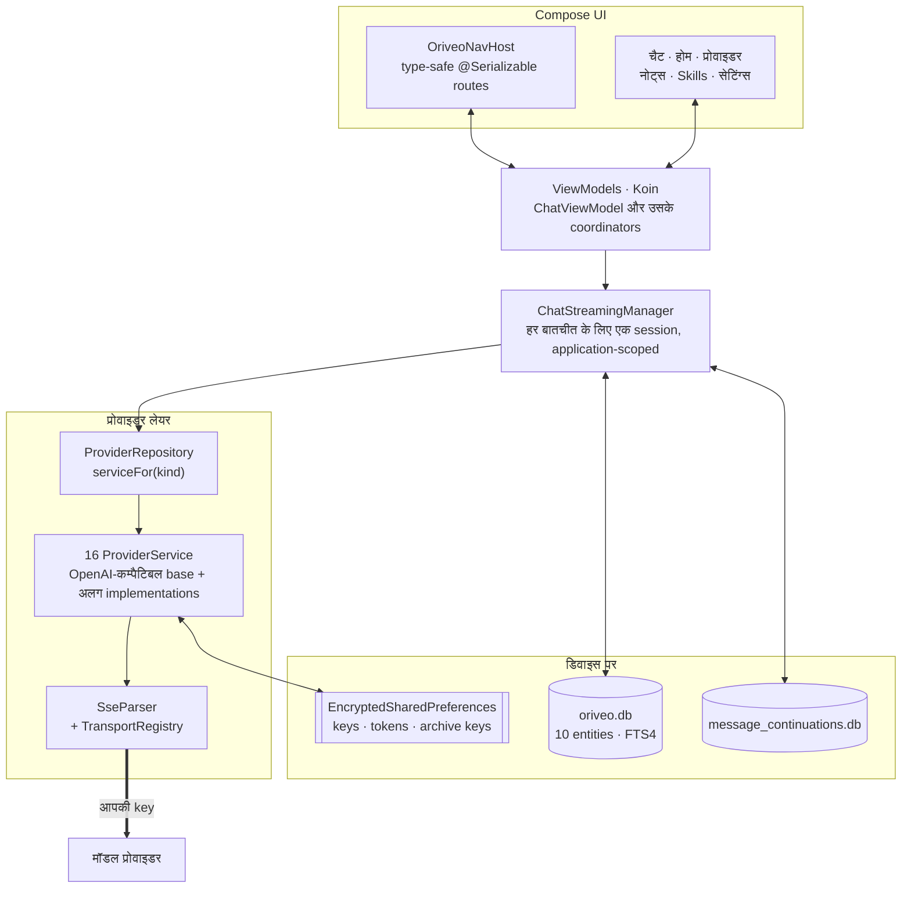

<div align="center">

# Android के लिए Oriveo

**उन AI मॉडलों के लिए एक नेटिव Jetpack Compose चैट क्लाइंट जिनका पैसा आप पहले से चुका रहे हैं।**

<a href="../../LICENSE"></a>


<sub>

<a href="../../android/README.md">English</a> ·
<a href="../ar/android.md">العربية</a> ·
<a href="../de/android.md">Deutsch</a> ·
<a href="../es/android.md">Español</a> ·
<a href="../fr/android.md">Français</a> ·
**हिन्दी** ·
<a href="../id/android.md">Indonesia</a> ·
<a href="../ja/android.md">日本語</a> ·
<a href="../ko/android.md">한국어</a> ·
<a href="../pt-BR/android.md">Português</a> ·
<a href="../ru/android.md">Русский</a> ·
<a href="../th/android.md">ไทย</a> ·
<a href="../tr/android.md">Türkçe</a> ·
<a href="../vi/android.md">Tiếng Việt</a> ·
<a href="../zh-Hans/android.md">简体中文</a> ·
<a href="../zh-Hant/android.md">繁體中文</a>

</sub>

</div>

---

Oriveo का Android क्लाइंट एक bring-your-own-key AI चैट ऐप है। आप अपनी पहले से मौजूद API key जोड़ते
हैं, और ऐप हर प्रोवाइडर से सीधे फ़ोन से बात करता है। बातचीत, नोट्स, फ़ोल्डर और skills डिवाइस पर Room
में रखे जाते हैं; API key को Android Keystore में रखी एक key से एन्क्रिप्ट किया जाता है। न कोई अकाउंट
है, न साइन-इन।

यह [Oriveo Community Edition](README.md) का हिस्सा है — तीन क्लाइंट, जिनके पास मॉडल प्रोवाइडर से
बात करने की एक ही साझा परिभाषा है।

## आर्किटेक्चर



इस डायग्राम की तीन बातें सोच-समझकर लिए गए डिज़ाइन फ़ैसले हैं, इत्तेफ़ाक़न बना ढाँचा नहीं।

**Streaming स्क्रीन के ऊपर रहती है।** `ChatStreamingManager` हर conversation id के लिए एक
`StreamingSession` को `ConcurrentHashMap` में रखता है, और हर एक अपने `Job` के रूप में एक ही
application-scoped `CoroutineScope(SupervisorJob() + Dispatchers.IO)` पर चलता है — supervisor ही यहाँ
असल बात है, ताकि एक stream के गिरने से बाक़ी साथ में न गिरें। चैट से हटकर कहीं और जाने से जवाब रद्द नहीं
होता, और जब भी `StreamingTokenBuffer` कहता है कि इतना जमा हो चुका है (4,000 वर्ण या 60 सेकंड),
`ChatRepository` अधूरा टेक्स्ट SQLite में flush कर देता है, इसलिए जवाब के बीच में ऐप बंद कर देने से जो
आ चुका है वह नहीं खोता।

**दो डेटाबेस, एक नहीं।** `oriveo.db` में बातचीत, मैसेज, अटैचमेंट, नोट्स, फ़ोल्डर, skills और मॉडल-कैटलॉग
cache रहते हैं। `message_continuations.db` भौतिक रूप से अलग फ़ाइल है जिसमें प्रोवाइडर की अपारदर्शी
continuation state रहती है — ठीक इसीलिए, ताकि `backup_rules.xml` और `data_extraction_rules.xml` इसे
क्लाउड बैकअप और डिवाइस ट्रांसफ़र से बाहर रख सकें; दूसरे डिवाइस पर restore हुआ continuation token
अच्छे-से-अच्छे हाल में भी बेमानी है।

**बाइनरी से नया कैटलॉग घटकर काम करता है, टूटता नहीं।** `TransportKind` एक बंद enum है जिसका
deserializer उदार है: कोई अनजान transport string `null` में decode होती है, `TransportRegistry` कोई
strategy नहीं लौटाता, और वह मॉडल picker से छाँट दिया जाता है। दूसरा विकल्प — सख़्त enum — पूरे कैटलॉग
का parse ही फ़ेल कर देता और साथ में बाक़ी हर मॉडल को भी ले डूबता।

## एक मॉडल क्या कर सकता है

क्लाइंट कभी किसी मॉडल की क्षमताएँ उसके नाम से नहीं भाँपता। वह कैटलॉग से एक capability runtime पढ़ता है:
recipes जो बताती हैं कि किसी दिए गए प्रोवाइडर, transport और capability के लिए रिक्वेस्ट में ठीक कौन-से
JSON pointer लिखने हैं। `ProviderRecipeRequestCompiler` recipe को owned body delta में compile करने से
पहले उसे प्रोवाइडर, capability और transport के विरुद्ध जाँचता है, और नामज़द वजह
(`recipe_not_found`, `transport_mismatch`, `model_route_must_not_patch_body`) के साथ अस्वीकार करता है,
बजाय इसके कि चुपचाप ऐसी रिक्वेस्ट बना दे जिसे किसी ने देखा ही न हो।

वापसी में `CapabilityEvidenceFacade` किसी capability के बारे में जो वाक़ई जाना जाता है उसे स्रोत के
हिसाब से क्रम देता है — `operator_override` > `server_typed` > `server_profile` > `model_facts` >
`relay_verification` > `relay_declaration` > `legacy_metadata`। किसी capability को *observed* सिर्फ़
stream parser ही चिह्नित कर सकता है; इरादा, recipes, HTTP 200 और tool declaration स्पष्ट रूप से नहीं
गिने जाते। हर मैसेज का नतीजा सहेजा जाता है, ताकि UI *requested* और *confirmed* में फ़र्क़ कर सके।

Override सात scope में last-write-wins के हिसाब से तय होते हैं, प्राथमिकता के क्रम में: `single_send` >
`conversation_connection_model` > `skill_agent` > `connection_model` > `connection` >
`provider_recipe` > `provider_default`।

## स्टोरेज और secrets

| क्या | कहाँ |
|---|---|
| बातचीत, मैसेज, अटैचमेंट, नोट्स, फ़ोल्डर, skills | Room, `oriveo.db` |
| नोट्स पर फ़ुल-टेक्स्ट सर्च | FTS4 virtual table |
| मॉडल कैटलॉग cache | `oriveo.db` में एक ही row, टुकड़ों में वापस पढ़ी जाती है |
| प्रोवाइडर continuation state | `message_continuations.db`, बैकअप से बाहर |
| प्रोवाइडर API key | `EncryptedSharedPreferences`, AES-256-GCM, Keystore में रखी master key |
| सब्सक्रिप्शन OAuth token | एक दूसरी, अलग encrypted preferences फ़ाइल |
| बैकअप आर्काइव key | एक तीसरी |
| अटैचमेंट blob | डिस्क पर फ़ाइलें, id से संदर्भित |

तीनों encrypted preference फ़ाइलें सुविधा के लिए मिलाई नहीं गईं, बल्कि जीवनकाल और blast radius के
हिसाब से अलग रखी गई हैं। हर एक का एक recovery रास्ता है: ख़राब फ़ाइल (`AEADBadTagException`,
`VERIFICATION_FAILED`) पहचानी जाती है, मिटाई जाती है और दोबारा बनाई जाती है, बजाय इसके कि हर बार ऐप
शुरू होते ही crash हो।

ये तीनों, और continuation डेटाबेस, Android के क्लाउड बैकअप और डिवाइस ट्रांसफ़र से बाहर हैं। यह इन्हें
Keystore से बाँधने का नतीजा है, कोई चूक नहीं — ciphertext वैसे भी नए डिवाइस पर decrypt नहीं हो पाता।
**नए फ़ोन पर जाने के बाद आप अपनी API key दोबारा डालते हैं और किसी भी प्रोवाइडर सब्सक्रिप्शन में फिर से
साइन इन करते हैं**; बातचीत और नोट्स सामान्य रूप से साथ चले आते हैं।

आप ख़ुद जो बैकअप आर्काइव एक्सपोर्ट करते हैं वे अलग से एन्क्रिप्ट होते हैं — 600,000 iterations पर
PBKDF2-HMAC-SHA256 और AES-GCM से, आपके चुने पासवर्ड के साथ।

## अपने ही नेटवर्क पर चल रहे मॉडल सर्वर तक पहुँचना

Manifest जानबूझकर `android:usesCleartextTraffic="true"` सेट करता है: लोकल मॉडल सर्वर — llama.cpp,
Ollama, LM Studio, vLLM — आपकी अपनी मशीन या LAN पर सादा HTTP बोलते हैं, और आम तौर पर उनके पास कोई
सर्टिफ़िकेट नहीं होता।

असली सीमा manifest में नहीं, कोड में है, और होनी भी वहीं चाहिए। `RelayEndpointPolicy` होस्ट को resolve
करता है, माँग करता है कि **हर** resolve हुआ पता प्राइवेट हो (loopback, RFC 1918, link-local,
unique-local, और VPN मोड में CGNAT रेंज), ऐसे होस्ट को अस्वीकार करता है जो सार्वजनिक और प्राइवेट पतों
के मिश्रण में resolve होता हो, DNS rebinding के ख़िलाफ़ resolve हुए पतों के सेट को pin करता है, और भेजते
समय उसे दोबारा जाँचता है। credential लेकर चलने वाली किसी भी cleartext रिक्वेस्ट से वह इनकार करता है।
discovery और local-engine क्लाइंट पर redirect बिल्कुल भी फ़ॉलो नहीं किए जाते, और पते वाला वही pin इसका
आख़िरी सहारा है।

Android की network security config उस पूरे सेट को व्यक्त नहीं कर सकती: वह सिर्फ़ hostname पर मैच करती
है, पता-रेंज के लिए उसके पास कोई syntax नहीं है, और यहाँ के पते runtime पर उपयोगकर्ता के अपने नेटवर्क से
आते हैं। ऐसी config सख़्ती से कमज़ोर भी होती, क्योंकि वह यह कभी देखती ही नहीं कि नाम किस पते पर resolve
हुआ।

## मॉडल कैटलॉग

ऐप मॉडल की क्षमताएँ और क़ीमतें एक सार्वजनिक कैटलॉग से पढ़ता है, ताकि आज रिलीज़ हुआ मॉडल बिना ऐप अपडेट
के काम करे। यह एक सादा HTTPS `GET` है जिसमें न कोई credential है न कोई पहचानकर्ता, और चैट रिक्वेस्ट कभी
इसके पास नहीं जातीं। सिर्फ़ दो endpoint माँगे जाते हैं:

```
GET {base}/api/metadata?view=lean
GET {base}/api/metadata/model-facts
```

Base URL एक build-time property है, जिसका डिफ़ॉल्ट `https://api.oriveoai.com` है:

```bash
./gradlew :app:assembleDebug -PORIVEO_METADATA_BASE_URL=https://your.host
```

Response ETag से revalidate होते हैं और `oriveo.db` में cache होते हैं, इसलिए एक बार fetch सफल हो जाने
के बाद कैटलॉग तक बाद में न पहुँच पाने पर भी ऐप cache की कॉपी से काम करता रहता है।

> [!IMPORTANT]
> ख़ाली value (`-PORIVEO_METADATA_BASE_URL=`) के साथ बिल्ड करने पर कैटलॉग fetch पूरी तरह बंद हो जाता है,
> और **APK में कोई snapshot बंडल नहीं होता**। ऐसे बिल्ड की fresh install पर:
>
> - 15 में से किसी भी बिल्ट-इन प्रोवाइडर को मॉडल सूची नहीं मिलती, और ऐप प्रोवाइडर से वह माँगता भी नहीं —
>   कैटलॉग ही इकलौता स्रोत है;
> - प्रोवाइडर detail स्क्रीन "आधिकारिक मॉडल लोड नहीं हो सके" बैनर दिखाती है, लेकिन key जोड़ने पर
>   सफलता ही दिखती है और मॉडल picker बस ख़ाली रहता है;
> - **OpenAI इस्तेमाल के लायक़ नहीं रह जाता**, क्योंकि उस प्रोवाइडर के लिए मैन्युअल मॉडल एंट्री बंद है;
> - Relay endpoint और लोकल मॉडल सर्वर पूरी तरह काम करते रहते हैं, और वही इकलौता सही-सलामत रास्ता हैं।
>
> ऑफ़लाइन बिल्ड चाहिए तो value ख़ाली करने के बजाय कैटलॉग ख़ुद सर्व करें और बिल्ड को उसकी ओर मोड़ें।

## प्रोजेक्ट का ढाँचा

```
android/
  app/src/main/java/ai/oriveo/community/
    core/
      provider/    every provider service, transports, relay, capability recipes
      data/        Room entities, DAOs, repositories, backup, catalog client
      model/       domain models and the capability/preference resolvers
      attachments/ routing, budgets, per-format text extraction
      security/    SecureKeyStore, BackupCrypto, external-URL policy
      streaming/   ChatStreamingManager
      navigation/  AppRoute, OriveoNavHost
    feature/       one package per screen
    ui/            shared components, Markdown + LaTeX renderer, theme
    di/            Koin modules
  benchmark/       macrobenchmark suite (cold start, model picker)
```

## बिल्डिंग

ज़रूरतें: **JDK 21** और Android SDK। बिल्ड AGP 9.3, Gradle 9.5 और Kotlin 2.3 इस्तेमाल करता
है, इसलिए Android Studio का वही रिलीज़ चाहिए जो AGP 9.3 को sync कर सके; कमांड लाइन से सिर्फ़ JDK और
SDK काफ़ी हैं।

```bash
./gradlew :app:assembleDebug
./gradlew :app:testDebugUnitTest
```

बिल्ड `minSdk 26`, `targetSdk 36`, `compileSdk 37` को target करता है। `local.properties` (आपका SDK
path) Android Studio बनाता है और वह कमिट नहीं होती। रिलीज़ signing
[SIGNING.md](../../android/SIGNING.md) में बताई गई है।

> [!NOTE]
> Gradle daemon एक Java 21 toolchain (`gradle/gradle-daemon-jvm.properties`) पर चलता है, और मिलान
> ठीक 21 से होता है, "21 या उससे नया" से नहीं। कोई और JDK इंस्टॉल हो तो Gradle पहली बिल्ड पर अपने लिए
> JDK 21 डाउनलोड करता है, जिसके लिए नेटवर्क चाहिए; ख़ुद JDK 21 इंस्टॉल कर लेने से यह टल जाता है।
> अगर आपने `org.gradle.java.installations.auto-download=false` सेट कर रखा है तो वह डाउनलोड हो ही नहीं
> सकता और बिल्ड `Toolchain auto-provisioning is not enabled.` के साथ फ़ेल हो जाती है — यही इकलौता
> मामला है जहाँ अकेला JDK 17 वाक़ई काफ़ी नहीं। कंपाइलेशन दोनों ही हाल में Java 17 को target करता है।

Unit-test की parallelism हार्ड-कोड करने के बजाय मशीन की CPU संख्या और physical memory से निकाली जाती
है, ताकि suite लैपटॉप और बड़ी workstation दोनों पर ठीक बर्ताव करे।

## Dependencies

| लाइब्रेरी | वर्ज़न | किसके लिए |
|---|---|---|
| Jetpack Compose BOM | 2026.08.00 | UI, Material 3 |
| Room | 2.8.4 | SQLite, DAOs, FTS4 |
| Koin | 4.2.2 | dependency injection |
| Ktor client (OkHttp engine) | 3.5.2 | प्रोवाइडर HTTP और SSE |
| kotlinx.serialization | 1.11.0 | JSON |
| navigation-compose | 2.9.6 | type-safe routes |
| androidx.security-crypto | 1.1.0 | `EncryptedSharedPreferences` |
| haze | 1.7.3 | बैकग्राउंड blur |
| PDFBox-Android, jsoup | 2.0.27.0, 1.23.2 | अटैचमेंट से टेक्स्ट एक्सट्रैक्शन |
| jlatexmath-android | 0.2.0 | LaTeX रेंडरिंग |

सटीक वर्ज़न [`gradle/libs.versions.toml`](../../android/gradle/libs.versions.toml) में pin किए गए हैं।

## टेस्टिंग

```bash
./gradlew :app:testDebugUnitTest
```

319 फ़ाइलों में क़रीब 3,000 unit टेस्ट, जो JUnit 4, MockK, Turbine, `kotlinx-coroutines-test` और Ktor
के mock engine का इस्तेमाल करते हैं। कवरेज वहाँ सबसे घनी है जहाँ ग़लतियाँ सबसे महँगी पड़ती हैं: हर
प्रोवाइडर के लिए request shape, SSE parsing, transport चुनाव, relay probing और security modes,
capability recipe execution, कैटलॉग caching और contract-version handling, Room persistence, और बैकअप
के round-trip।

> [!IMPORTANT]
> क़रीब 38 suites, Gradle मॉड्यूल डायरेक्टरी से `../../shared` resolve करके contract fixtures लोड करती
> हैं, इसलिए **टेस्ट सिर्फ़ पूरे checkout में ही पास होते हैं** — अकेले `android/` को कॉपी करके ले जाना
> काम नहीं करेगा।

तीन instrumented टेस्ट भी हैं — एक local-engine रिलीज़ मैट्रिक्स, एक cleartext-socket टेस्ट, और एक
keystore isolation टेस्ट। ये आत्मनिर्भर नहीं हैं: local-engine वाले टेस्ट को ऐसे instrumentation
arguments चाहिए जो आपके नेटवर्क पर सचमुच चल रहे किसी मॉडल सर्वर का नाम दें, इसलिए
`connectedAndroidTest` सीधे-सीधे पास नहीं होता। Pull request के लिए गेट unit suite ही है।

`:benchmark` मॉड्यूल में cold start और मॉडल picker के macrobenchmark हैं। यह `com.android.test` और
self-instrumentation इस्तेमाल करने वाला एक अलग Gradle मॉड्यूल है, और यह `:app` के एक समर्पित
`benchmark` build type को चलाता है।

दोनों डेटाबेस अभी `version = 1` पर हैं और कोई migration नहीं है; schema `app/schemas/` में export होकर
कमिट किए जाते हैं, और वहीं पहले migration की `2.json` आकर बैठेगी।

## स्थानीयकरण

सोलह भाषाएँ: `values/` (अंग्रेज़ी, स्रोत) और पंद्रह `values-*` डायरेक्टरी, हर एक में क़रीब 1,700
strings, और हर locale में बिल्कुल एक जैसा key सेट। ऐप के भीतर भाषा बदलना `AppLanguageManager` और
`android:localeConfig` से होकर जाता है। बंडल में language splits बंद हैं, ताकि एक ही artifact हर
अनुवाद अपने साथ ले जाए।

## योगदान

[CONTRIBUTING.md](../../CONTRIBUTING.md) देखें। प्रोजेक्ट की कामकाजी भाषा अंग्रेज़ी है: सोर्स, कमेंट,
टेस्ट और commit message। UI strings का अनुवाद होता है — नई string पहले `values/` में जोड़ें और बाक़ी
locale को बाद में आने दें। Pull request खोलने से पहले unit टेस्ट चलाएँ।

## लाइसेंस

[AGPL-3.0-or-later](../../LICENSE)।
