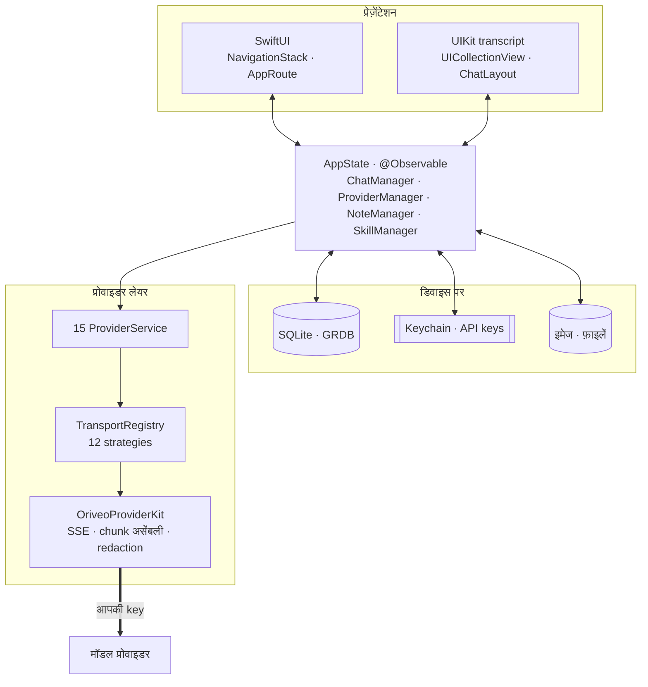
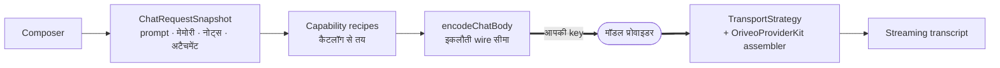

<div align="center">

# iOS के लिए Oriveo

**उन AI मॉडलों के लिए एक नेटिव SwiftUI चैट क्लाइंट जिनका पैसा आप पहले से चुका रहे हैं।**

<a href="../../LICENSE"></a>


<sub>

<a href="../../ios/README.md">English</a> ·
<a href="../ar/ios.md">العربية</a> ·
<a href="../de/ios.md">Deutsch</a> ·
<a href="../es/ios.md">Español</a> ·
<a href="../fr/ios.md">Français</a> ·
**हिन्दी** ·
<a href="../id/ios.md">Indonesia</a> ·
<a href="../ja/ios.md">日本語</a> ·
<a href="../ko/ios.md">한국어</a> ·
<a href="../pt-BR/ios.md">Português</a> ·
<a href="../ru/ios.md">Русский</a> ·
<a href="../th/ios.md">ไทย</a> ·
<a href="../tr/ios.md">Türkçe</a> ·
<a href="../vi/ios.md">Tiếng Việt</a> ·
<a href="../zh-Hans/ios.md">简体中文</a> ·
<a href="../zh-Hant/ios.md">繁體中文</a>

</sub>

</div>

---

Oriveo का iOS क्लाइंट एक bring-your-own-key AI चैट ऐप है। आप अपनी पहले से मौजूद API key जोड़ते हैं,
और ऐप हर प्रोवाइडर को सीधे फ़ोन से कॉल करता है। बातचीत, नोट्स, फ़ोल्डर, skills और अटैचमेंट डिवाइस पर
SQLite में रखे जाते हैं; API key iOS Keychain में जाती हैं। न कोई अकाउंट है, न साइन-इन।

यह [Oriveo Community Edition](README.md) का हिस्सा है — तीन क्लाइंट, जिनके पास मॉडल प्रोवाइडर से
बात करने की एक ही साझा परिभाषा है।

## आर्किटेक्चर



इस डायग्राम की तीन बातें साफ़-साफ़ कह देना ज़रूरी है।

**Transcript UIKit का है, बाक़ी सब SwiftUI।** `ChatView` एक `ChatListViewControllerRepresentable`
को embed करता है, जो [ChatLayout](https://github.com/ekazaev/ChatLayout) से चलने वाले
`UICollectionView` के इर्द-गिर्द बना है। बाक़ी सब कुछ — navigation, settings, प्रोवाइडर सेटअप, नोट्स,
skills — SwiftUI है। यह बँटवारा इसलिए है कि token की रफ़्तार से streaming करने वाले transcript को
measurement और reuse पर cell-स्तर का नियंत्रण चाहिए, जो SwiftUI की diffing नहीं देती।
[`Features/Chat/ARCHITECTURE.md`](../../ios/Oriveo/Oriveo/Features/Chat/ARCHITECTURE.md) इस सीमा को
दर्ज करता है।

**उस transcript को तीन अलग-अलग रास्ते अपडेट करते हैं**, जानबूझकर:

| रास्ता | क्या ले जाता है | क्यों |
|---|---|---|
| `@Observable AppState` | ढाँचागत बदलाव — कोई मैसेज आना, बातचीत बदलना | SwiftUI-नेटिव, कम आवृत्ति वाली घटनाओं के लिए सस्ता |
| GRDB `ValueObservation` | SQLite से वापस पढ़ी गई टिकाऊ स्थिति | लिखने के बाद सत्य का एक ही स्रोत, relaunch के बाद भी बना रहता है |
| हर बातचीत के लिए Combine `PassthroughSubject` | streaming टेक्स्ट और reasoning delta | token की रफ़्तार पर SwiftUI diffing को पूरी तरह बायपास करता है |

**प्रोवाइडर सपोर्ट चार स्वतंत्र अक्ष हैं, एक enum नहीं।** `ProviderKind` (16 केस) बताता है *उपयोगकर्ता
ने किसे कॉन्फ़िगर किया*। `ProviderServiceProtocol` है *कॉल सरफ़ेस*। `TransportKind` (12 केस) है *असल
में कौन-सा wire protocol बोला जाता है* — और यह **हर मॉडल के लिए, कैटलॉग से** तय होता है, इसलिए एक ही
key के पीछे दो मॉडल अलग-अलग हो सकते हैं। `RelayKind` उपयोगकर्ता के दिए endpoint संभालता है। इन्हें अलग
रखना ही वह बात है जिससे नया मॉडल बिना नए बिल्ड के काम कर जाता है।

### एक मैसेज कैसे भेजा जाता है



`BaseAPIService.encodeChatBody` वह इकलौती जगह है जहाँ request body बाइट्स में बदलती है। हर capability
recipe, generation पैरामीटर और कस्टम फ़ील्ड को इसी से गुज़रना पड़ता है, और यही वजह है कि wire format
पंद्रह जगह नहीं, एक ही जगह टेस्ट किया जा सकता है।

## एक मॉडल क्या कर सकता है

क्लाइंट कभी किसी मॉडल की क्षमताएँ उसके नाम से नहीं भाँपता। वह एक **capability runtime** पढ़ता है —
recipes का एक सेट जो बताता है कि किसी दिए गए प्रोवाइडर, transport और capability के लिए रिक्वेस्ट में
ठीक कौन-से JSON pointer लिखने हैं। वे recipes [`shared/capabilityrecipe`](shared.md) में रहते हैं और
`CapabilityRecipeRequestCompiler` उन्हें लागू करता है।

वापसी में `CapabilityExecutionRuntime` दर्ज करता है कि असल में हुआ क्या। किसी capability को *observed*
तक सिर्फ़ एक चुना हुआ प्रोडक्शन stream parser ही पहुँचा सकता है। HTTP 200, ख़ाली न होने वाला जवाब, और
रिक्वेस्ट में tool declaration — ये स्पष्ट रूप से **सबूत नहीं** हैं। अंतिम स्थिति हर मैसेज के लिए सहेजी
जाती है, ताकि UI आपको बता सके कि कोई कंट्रोल माँगा तो गया था पर कभी पुष्ट नहीं हुआ, न कि चुपचाप यह
जताए कि वह काम कर गया।

## स्टोरेज

```
Application Support/Oriveo/
  active-uid                     # storage partition, "guest" by default
  users/<uid>/
    oriveo.sqlite                # conversations, messages, notes, catalog cache
    Images/  Files/              # attachment blobs, referenced by id
    session-snapshot.json        # preferences, provider list (never API keys)
```

- **GRDB के ज़रिए SQLite**, WAL के साथ, foreign key चालू, और हर schema बदलाव को कवर करता एक
  `DatabaseMigrator`। मैसेज और नोट्स पर फ़ुल-टेक्स्ट सर्च FTS5 और trigram tokenizer से होती है।
- **API key Keychain में रहती हैं**, प्रोवाइडर और partition से keyed, और session snapshot लिखे जाने से
  पहले उसमें से मिटा दी जाती हैं।
- **अटैचमेंट blob डिस्क पर फ़ाइलें हैं**, rows नहीं, इसलिए कोई बड़ी PDF डेटाबेस को कभी फुलाती नहीं।

## ऐप अपनी ओर से जो एकमात्र नेटवर्क कॉल करता है

Cold start पर ऐप `https://api.oriveoai.com` को दो unauthenticated, ETag-conditional `GET` रिक्वेस्ट
भेजता है — `/api/metadata?view=lean` और `/api/metadata/model-facts`। ये सार्वजनिक मॉडल कैटलॉग लाती हैं:
कौन-से मॉडल मौजूद हैं, हर एक क्या सपोर्ट करता है, उसके reasoning कंट्रोल के नाम क्या हैं, और उसकी क़ीमत
क्या है। इनमें न key जुड़ती है, न बातचीत, न कोई पहचानकर्ता, और response SQLite में cache हो जाता है
ताकि कैटलॉग तक न पहुँच पाने पर ऐप cache की कॉपी से काम करता रहे।

ऐप अपनी ओर से बस यही एक रिक्वेस्ट करता है। बाक़ी सब कुछ आपके कॉन्फ़िगर किए प्रोवाइडर तक, आपकी key के
साथ जाता है।

## प्रोजेक्ट का ढाँचा

```
ios/Oriveo/
  Oriveo.xcodeproj/
  Oriveo/
    Core/
      Providers/       15 provider services, transports, capability runtime, catalog client
      State/           AppState and the managers it owns
      Database/        GRDB pool, schema, migrator, stores, observations
      Models/          domain types
      Attachments/     import limits, budgets, per-format text extraction
      Tools/           tool-call loop and per-protocol adapters
    Features/
      Chat/            transcript, composer, model controls, export
      Providers/       setup, detail, relay, local engines, subscription sign-in
      Home/ Notes/ Skills/ Settings/ Backup/ Onboarding/
    Shared/Components/ shared views
    DesignSystem/      theme, colour, haptics
  OriveoTests/
```

## बिल्ड और रन

आपको **Xcode 26** वाला एक Mac और **iOS 18 या उससे नया** डिवाइस चाहिए। मुफ़्त Apple Developer अकाउंट
काफ़ी है; ऐप कोई पेड capability इस्तेमाल नहीं करता और ख़ाली entitlements फ़ाइल के साथ ship होता है।

1. `ios/Oriveo/Oriveo.xcodeproj` खोलें
2. `Oriveo` scheme चुनें
3. **Signing & Capabilities** में अपनी Team चुनें
4. अगर Xcode `ai.oriveo.community` रजिस्टर न कर पाए, तो bundle identifier बदलकर वह रखें जो आपकी team
   के पास है
5. अपना iPhone जोड़ें, Developer Mode चालू करें, कंप्यूटर को trust करें, और Run करें

इसके बजाय Simulator के लिए बिल्ड करना हो तो कोई भी iPhone simulator चुनकर Run करें। Package
dependencies कमिट की गई `Package.resolved` से resolve होती हैं।

प्रोजेक्ट फ़ाइल `objectVersion = 77` और file-system synchronized groups इस्तेमाल करती है, इसलिए पुराना
Xcode इसे खोलने से मना कर सकता है। प्रोजेक्ट फ़ॉर्मैट बदलने के बजाय Xcode अपडेट करें।

> [!NOTE]
> ऐप target, `SWIFT_APPROACHABLE_CONCURRENCY` और `SWIFT_DEFAULT_ACTOR_ISOLATION = MainActor` के साथ
> Swift 5 language mode में कंपाइल होता है। लोकल `OriveoProviderKit` package
> `swift-tools-version: 6.1` घोषित करता है और Swift 6 language mode में बिल्ड होता है।

## Dependencies

| Package | वर्ज़न | किसके लिए |
|---|---|---|
| [GRDB.swift](https://github.com/groue/GRDB.swift) | 7.11.1 | SQLite access, migrations, `ValueObservation` |
| [ChatLayout](https://github.com/ekazaev/ChatLayout) | 2.4.3 | transcript का collection-view लेआउट |
| [swift-markdown-ui](https://github.com/gonzalezreal/swift-markdown-ui) | 2.4.1 | Markdown रेंडरिंग |
| [SwiftMath](https://github.com/mgriebling/SwiftMath) | 1.7.3 | LaTeX रेंडरिंग |
| [ZIPFoundation](https://github.com/weichsel/ZIPFoundation) | 0.9.20 | बैकअप आर्काइव, Office/EPUB/ODF एक्सट्रैक्शन |
| `OriveoProviderKit` | लोकल | प्रोवाइडर wire kernel, macOS के साथ साझा |

## टेस्टिंग

Xcode से `OriveoTests` scheme चलाएँ, या रिपॉज़िटरी की जड़ से:

```bash
xcodebuild test -project ios/Oriveo/Oriveo.xcodeproj -scheme Oriveo \
  -destination 'platform=iOS Simulator,name=iPhone 17'
```

वहाँ अपने पास वाक़ई मौजूद कोई simulator डालें — `xcrun simctl list devices available` उन्हें सूचीबद्ध करता है।

> [!IMPORTANT]
> Test target, `shared/` से contract fixtures पढ़ता है और इसके लिए `#filePath` से ऊपर चढ़ते हुए वह
> डायरेक्टरी खोजता है। क़रीब 29 suites इस पर निर्भर हैं, इसलिए **टेस्ट सिर्फ़ पूरे checkout में ही पास
> होते हैं** — अकेले `ios/` को कॉपी करके ले जाना काम नहीं करेगा।

Suite बड़ी है: 273 फ़ाइलों में क़रीब 2,900 टेस्ट, ज़्यादातर [Swift
Testing](https://github.com/swiftlang/swift-testing) पर। इसमें हर प्रोवाइडर के लिए request shape,
रिकॉर्ड किए गए upstream SSE का replay, relay और local-engine policy, transcript measurement और
streaming व्यवहार, स्टोरेज, और बैकअप के round-trip शामिल हैं।

`shared/OriveoProviderKit` की अपनी suite है:

```bash
cd shared/OriveoProviderKit && swift test
```

## स्थानीयकरण

सोलह भाषाएँ, Xcode String Catalogs (`.xcstrings`) के रूप में रखी गई हैं — दस catalog, क़रीब 1,900 key,
और अंग्रेज़ी स्रोत भाषा। Strings, उपयोगकर्ता की in-app भाषा सेटिंग से चुने गए `.lproj` bundle के विरुद्ध
`L10n.tr(_:table:)` से resolve होती हैं, इसलिए भाषा बदलने के लिए ऐप दोबारा शुरू करने की ज़रूरत नहीं।
अरबी के लिए right-to-left लेआउट स्पष्ट रूप से संभाला गया है।

## योगदान

[CONTRIBUTING.md](../../CONTRIBUTING.md) देखें। व्यवहार बदलने पर एक टेस्ट भी जोड़ें; प्रोवाइडर
प्रोटोकॉल के फ़िक्स के लिए हाथ से लिखे mock के बजाय `shared/test-fixtures` के नीचे रिकॉर्ड किया गया
fixture पसंद करें, और बताएँ कि आपने किस प्रोवाइडर और किस मॉडल पर टेस्ट किया।

## लाइसेंस

[AGPL-3.0-or-later](../../LICENSE)।
