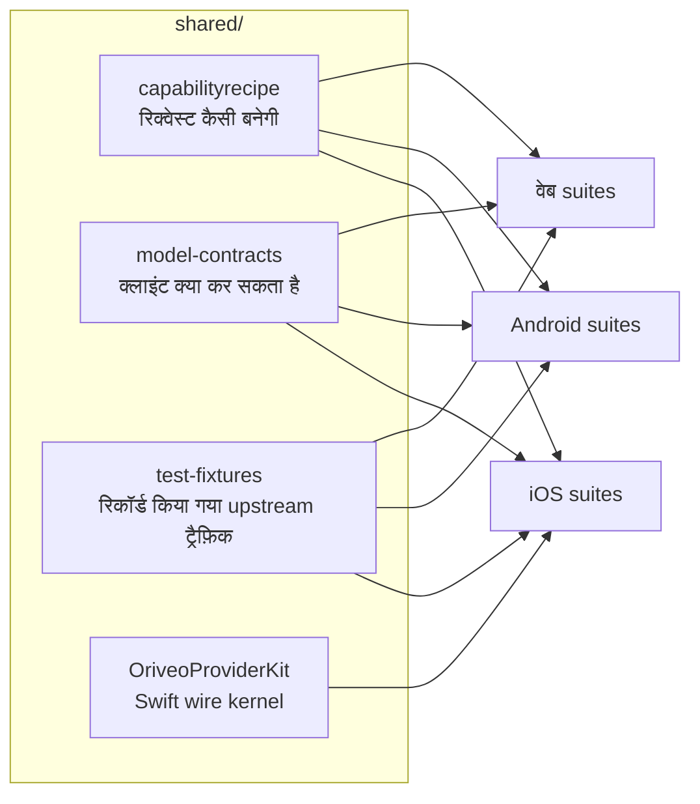

<div align="center">

# साझा कॉन्ट्रैक्ट

**मॉडल प्रोवाइडर से कैसे बात करनी है, इसकी एक ही परिभाषा — जिसे तीनों क्लाइंट टेस्ट करते हैं।**

<a href="../../LICENSE"></a>


<sub>

<a href="../../shared/README.md">English</a> ·
<a href="../ar/shared.md">العربية</a> ·
<a href="../de/shared.md">Deutsch</a> ·
<a href="../es/shared.md">Español</a> ·
<a href="../fr/shared.md">Français</a> ·
**हिन्दी** ·
<a href="../id/shared.md">Indonesia</a> ·
<a href="../ja/shared.md">日本語</a> ·
<a href="../ko/shared.md">한국어</a> ·
<a href="../pt-BR/shared.md">Português</a> ·
<a href="../ru/shared.md">Русский</a> ·
<a href="../th/shared.md">ไทย</a> ·
<a href="../tr/shared.md">Türkçe</a> ·
<a href="../vi/shared.md">Tiếng Việt</a> ·
<a href="../zh-Hans/shared.md">简体中文</a> ·
<a href="../zh-Hant/shared.md">繁體中文</a>

</sub>

</div>

---

तीन क्लाइंट अगर "प्रोवाइडर को कॉल करो" को अलग-अलग लागू करें तो वे एक-दूसरे से बहक जाएँगे। और चुपचाप
बहकेंगे — उसी दिशा में जिसे किसी ने आख़िरी बार टेस्ट किया था — और यह बहकाव आख़िर में ऐसे बग के रूप में
सामने आएगा जो एक प्लैटफ़ॉर्म पर दोहराया जा सके और बाक़ी पर नहीं।

`shared/` इसी का जवाब है: व्यवहार एक ही बार डेटा के रूप में लिख दिया जाता है, और हर क्लाइंट की टेस्ट
suite उन्हीं फ़ाइलों के विरुद्ध जाँच करती है। किसी प्रोवाइडर की ख़ास आदत एक बार ठीक होती है। और कोई
कॉन्ट्रैक्ट बदलने पर तीनों suites एक साथ फ़ेल होती हैं, बजाय इसके कि वह दो प्लैटफ़ॉर्म पर ship हो जाए
और तीसरे को तोड़ दे।



## capabilityrecipe

Recipe रजिस्ट्री। किसी दिए गए प्रोवाइडर, transport और capability के लिए — वेब सर्च, reasoning effort,
इमेज जनरेशन — यह ठीक-ठीक बताती है कि जाने वाली रिक्वेस्ट में कौन-से JSON pointer लिखने हैं, और जवाब को
वापस कैसे पढ़ना है।

यही वह चीज़ है जिससे आज रिलीज़ हुआ मॉडल बिना क्लाइंट अपडेट के काम करता है, और यही वजह है कि कोई भी
क्लाइंट मॉडल के नाम से capability नहीं भाँपता। `capability_runtime.v1.json` में recipes ख़ुद रहती हैं;
`capability_result_definitions.v1.json` और `capability_custom_controls.v2.json` तय करती हैं कि नतीजों
और उपयोगकर्ता को दिखने वाले कंट्रोल की व्याख्या कैसे हो।

हर recipe एक `executionKind` घोषित करती है — `request_overlay`, `server_tool`, `client_tool_loop`,
`endpoint_route`, `model_route` — और हर क्लाइंट का compiler recipe लागू करने से पहले जाँचता है कि वह
प्रोवाइडर, capability और transport से मेल खाती है, और न मिलने पर नामज़द वजह के साथ अस्वीकार कर देता है,
बजाय ऐसी रिक्वेस्ट भेजने के जिसे किसी ने देखा ही न हो।

## model-contracts

JSON fixtures जो क्लाइंट-दर-क्लाइंट व्यवहार को बाँधती हैं: किसी प्रोवाइडर और capability के लिए
रिक्वेस्ट कैसी दिखनी चाहिए, generation पैरामीटर कैसे तय होते हैं और override किस क्रम में परत दर परत
चढ़ते हैं, कोई क्लाइंट किन capability states को दिखा सकता है, और मॉडल कैटलॉग तथा उसके evidence का
उपभोग कैसे होता है।

हर क्लाइंट के टेस्ट इन्हें सीधे लोड करते हैं, इसलिए यहाँ हुआ बदलाव एक ही बार में तीनों क्लाइंट का
बदलाव है।

## test-fixtures

Golden टेस्ट डेटा: रिकॉर्ड किया गया upstream tool-call ट्रैफ़िक, relay routing और discovery के
परिदृश्य, model-facts और capability-evidence के snapshot, और local-engine परिदृश्य।

`.sse` फ़ाइलें **असली, कैप्चर किया गया upstream ट्रैफ़िक** हैं और उन्हें बाइट-दर-बाइट अछूता छोड़ा गया
है। हाथ से लिखा mock वह encode करता है जो आपको लगता था कि प्रोवाइडर करता है; रिकॉर्ड की गई stream वह
encode करती है जो उसने वाक़ई किया — उस मंगलवार को भेजा गया वह टूटा-फूटा chunk भी शामिल। जब प्रोवाइडर
प्रोटोकॉल के किसी फ़िक्स को टेस्ट चाहिए, तो एक रिकॉर्डिंग mock से ज़्यादा क़ीमती है।

## OriveoProviderKit

एक Swift package जिसमें प्रोवाइडर wire-protocol का kernel है: SSE लाइन असेंबली, OpenAI-कम्पैटिबल chunk
parsing, tool-name encoding, credential redaction, upstream error classification, thinking-tag parsing,
streaming JSON path extraction, और हर vendor की ख़ास आदतों वाली profiles।

इसका दायरा जानबूझकर तंग खींचा गया है। **भीतर:** सिर्फ़ Foundation पर टिकी wire जानकारी। **बाहर:** ऐप
मॉडल, UI, डेटाबेस, telemetry, स्थानीयकरण। Apple का हर क्लाइंट इसके इर्द-गिर्द एक पतली binding रखता है,
ताकि wire व्यवहार का ठीक एक ही implementation रहे।

```bash
cd shared/OriveoProviderKit && swift build && swift test
```

- प्लैटफ़ॉर्म: iOS 18+, macOS 15+ · `swift-tools-version: 6.1`
- `ProviderWireProfile` उन बची-खुची vendor-विशिष्ट आदतों को संभालता है जो एक ही OpenAI-कम्पैटिबल
  assembler को अब भी चाहिए — reasoning टेक्स्ट कहाँ आता है, cached-token की गिनती कहाँ रहती है, और
  prompt token में cache hit पहले से शामिल हैं या नहीं। यह बताता है कि *बाइट्स कैसे आती हैं*, कभी यह
  नहीं कि *कोई मॉडल क्या कर सकता है*; वह काम recipes का है।

## इन फ़ाइलों पर काम करना

यहाँ हुआ बदलाव हर क्लाइंट का बदलाव है। जिस फ़ाइल को आपने छुआ है उसे पढ़ने वाले हर क्लाइंट की contract
suites चलाएँ, सिर्फ़ उसी की नहीं जिसमें आप इस वक़्त काम कर रहे हैं:

```bash
cd web && npm run test:run
cd shared/OriveoProviderKit && swift test
# plus the iOS and Android suites — see their READMEs
```

iOS और Android दोनों की suites इस डायरेक्टरी को टेस्ट फ़ाइल से ऊपर चढ़ते हुए `shared/` खोजकर पाती हैं,
और वेब suites इसे workspace के सापेक्ष resolve करती हैं। इसलिए इन सबको रिपॉज़िटरी का पूरा checkout
चाहिए।

## लाइसेंस

[AGPL-3.0-or-later](../../LICENSE)।
