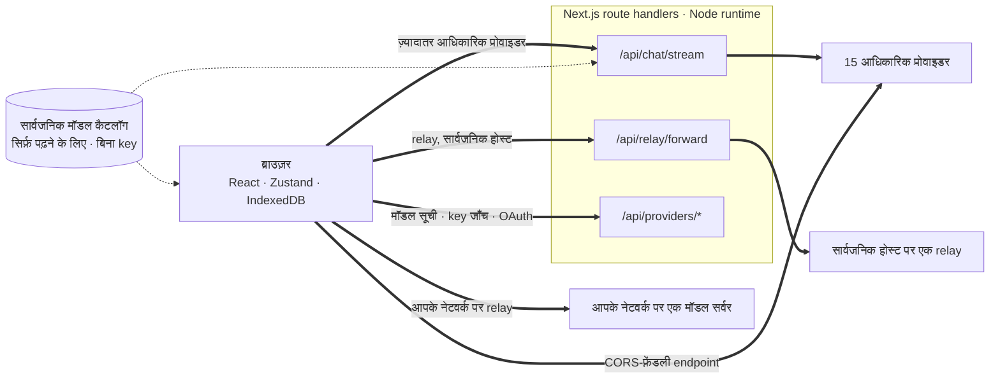
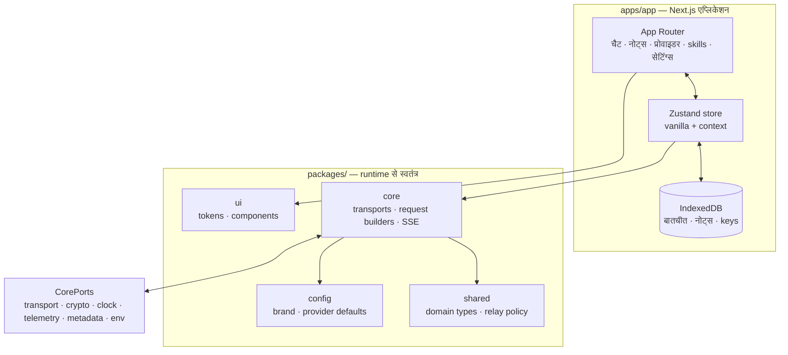

<div align="center">

# वेब के लिए Oriveo

**उन AI मॉडलों के लिए एक Next.js चैट क्लाइंट जिनका पैसा आप पहले से चुका रहे हैं।**

<a href="../../LICENSE"></a>


<sub>

<a href="../../web/README.md">English</a> ·
<a href="../ar/web.md">العربية</a> ·
<a href="../de/web.md">Deutsch</a> ·
<a href="../es/web.md">Español</a> ·
<a href="../fr/web.md">Français</a> ·
**हिन्दी** ·
<a href="../id/web.md">Indonesia</a> ·
<a href="../ja/web.md">日本語</a> ·
<a href="../ko/web.md">한국어</a> ·
<a href="../pt-BR/web.md">Português</a> ·
<a href="../ru/web.md">Русский</a> ·
<a href="../th/web.md">ไทย</a> ·
<a href="../tr/web.md">Türkçe</a> ·
<a href="../vi/web.md">Tiếng Việt</a> ·
<a href="../zh-Hans/web.md">简体中文</a> ·
<a href="../zh-Hant/web.md">繁體中文</a>

</sub>

</div>

---

Oriveo का वेब क्लाइंट Next.js से बना एक bring-your-own-key AI चैट ऐप है। बातचीत, नोट्स, फ़ोल्डर,
skills और आपकी प्रोवाइडर key ब्राउज़र के अपने स्टोरेज में रहती हैं। न कोई अकाउंट है, न साइन-इन।

यह [Oriveo Community Edition](README.md) का हिस्सा है — तीन क्लाइंट, जिनके पास मॉडल प्रोवाइडर से
बात करने की एक ही साझा परिभाषा है।

## जल्दी शुरू करें

Node 22.22 या उससे नया चाहिए ([`.nvmrc`](../../web/.nvmrc) देखें)। npm उसी के साथ आता है; और किसी package manager
की ज़रूरत नहीं।

```bash
npm install
npm run dev:app     # http://localhost:3001
```

पहली स्क्रीन एक प्रोवाइडर API key माँगती है। चैट शुरू करने के लिए इसके अलावा और कुछ ज़रूरी नहीं।

## एक रिक्वेस्ट असल में किस रास्ते जाती है

बाक़ी सब से पहले पढ़ने लायक़ हिस्सा यही है, क्योंकि वेब क्लाइंट इकलौती ऐसी जगह है जहाँ कोई रिक्वेस्ट
आम तौर पर क्लाइंट से प्रोवाइडर तक सीधे **नहीं** जाती।



**यह चक्कर क्यों है।** ज़्यादातर प्रोवाइडर API कोई CORS हेडर नहीं भेजते, इसलिए ब्राउज़र
`api.openai.com` और उस जैसों को सीधे कॉल नहीं कर सकता — preflight ही फ़ेल हो जाता है। हर
ब्राउज़र-आधारित BYOK क्लाइंट को यह समस्या किसी न किसी तरह हल करनी पड़ती है; यह वाला Node runtime में
चलते Next.js route handlers से आगे भेजता है। जब आप `npm run dev:app` चलाते हैं, वे handler आपकी अपनी
मशीन पर होते हैं। जब आप ऐप कहीं deploy करते हैं, वे उसी मशीन पर होते हैं जहाँ आपने deploy किया।

handler एक नहीं है: चैट streaming, relay forwarder, इमेज जनरेशन, मॉडल सूची, key वैलिडेशन, और Grok
तथा ChatGPT के device-login exchange — ये सब मिलकर कुल बारह route फ़ाइलें बनती हैं। key वैलिडेशन यहाँ
मायने रखता है — वह key आपके अपने सर्वर पर पोस्ट करता है, और वही सर्वर उससे प्रोवाइडर को जाँचता है।

कुछ endpoint ब्राउज़र को *इजाज़त देते ही हैं*, और उन्हें बीच में किसी सर्वर के बिना सीधे कॉल किया जाता
है: चैट के लिए Kimi का चीन वाला endpoint (`api.moonshot.cn`), और OpenRouter, SiliconFlow, DeepSeek
तथा Kimi के बैलेंस endpoint।

**Handler क्या करता है और क्या नहीं।** वह रिक्वेस्ट का shape जाँचता है और उसका आकार सीमित करता है, चैट
और relay ट्रैफ़िक पर प्रति-IP rate limit लगाता है, ऐसे URL अस्वीकार करता है जो प्राइवेट या link-local
पतों पर resolve होते हैं, प्रोवाइडर-विशिष्ट body बनाता है, और response वापस stream करता है। `app/api`
के नीचे कहीं भी न कोई डेटाबेस है, न फ़ाइल-सिस्टम पर कोई लिखाई, न रिक्वेस्ट body की कोई लॉगिंग — आपकी key
और आपके मैसेज आगे भेजकर भुला दिए जाते हैं। चूँकि यह route हर विज़िटर के लिए एक ही process है, इसलिए एक
समर्पित टेस्ट (`server-never-learns.test.ts`) यह pin करता है कि वह किसी एक उपयोगकर्ता का अस्वीकार हुआ
पैरामीटर cache करके किसी और की रिक्वेस्ट पर लागू न कर दे।

Relay forwarder इसके अलावा DNS को उसी पते पर pin करता है जिस पर उसने resolve किया, response पर सीमा
लगाता है, हर timeout को बाँधता है, redirect को उसी origin तक सीमित रखता है, और hop-by-hop हेडर आगे
नहीं जाने देता।

**लोकल endpoint इसे पूरी तरह छोड़ देते हैं।** किसी प्राइवेट पते पर, `.local` नाम पर, `localhost` पर,
या local-HTTP या private-VPN मोड में कॉन्फ़िगर किया गया relay **सीधे ब्राउज़र से** fetch किया जाता है,
`credentials: 'omit'` और `targetAddressSpace: 'local'` के साथ। आपका LAN ट्रैफ़िक आपका नेटवर्क नहीं
छोड़ता, और ऐप के सर्वर से भी होकर नहीं जाता।

## आर्किटेक्चर



`packages/core` में प्रोवाइडर-प्रोटोकॉल की हर बात रहती है, और इसे जानबूझकर ब्राउज़र globals से मुक्त
रखा गया है — eslint इसके भीतर और `packages/ipc-contract` में `window`, `document`, `fetch`, `crypto`,
`localStorage`, `sessionStorage` और `indexedDB` पर रोक लगाता है। पर्यावरण से जो कुछ भी उसे चाहिए वह
`CorePorts` के रास्ते आता है। इसी वजह से एक ही कोड ब्राउज़र में, Node route handler में, और बिना DOM
वाले टेस्ट में चल सकता है।

प्रोवाइडर सपोर्ट दो स्वतंत्र अक्ष हैं। `providerKind` एक **request builder** चुनता है (इस vendor के
लिए body कैसी दिखती है)। `model.transport` बारह में से एक **transport strategy** चुनता है (कौन-सा wire
protocol बोला जाता है), और यह प्रोवाइडर के हिसाब से नहीं, कैटलॉग से हर मॉडल के हिसाब से तय होता है —
इसलिए एक ही key के पीछे दो मॉडल अलग-अलग हो सकते हैं। हर strategy ठीक तीन मेथड लागू करती है:
`buildRequestBody`, `parseStreamChunk`, `parseError`।

## Workspaces

```
apps/app/               the Next.js application
packages/core/          provider protocols: transports, request builders, SSE parsing
packages/shared/        domain types, relay policy, helpers
packages/ui/            design tokens and shared components
packages/config/        brand and provider defaults
packages/ipc-contract/  typed channel contract for a desktop shell
```

स्टाइलिंग `packages/ui` की एक ही custom-property token शीट के ऊपर CSS Modules से होती है — कोई
utility-class फ़्रेमवर्क नहीं है। `packages/ipc-contract` उस channel सरफ़ेस का वर्णन करता है जिससे एक
desktop shell बँधेगा; इस रिपॉज़िटरी में ऐसा कोई shell नहीं आता, इसलिए वेब बिल्ड में यह सिर्फ़ types और
ऐसी branches देता है जिन पर कभी अमल नहीं होता।

इसी तरह की एक और सीवन है। `apps/app/lib/core/sync-port.ts` उस interface की घोषणा करता है जिसे कोई
synchronisation backend लागू करेगा, और हर call site उस तक optional chaining से पहुँचता है। ऐसा कोई
backend लगाया नहीं गया है, इसलिए `getSyncAdapter()` `null` लौटाता है और IndexedDB आपके डेटा की एकमात्र
कॉपी बनी रहती है — व्यवहार में “न कोई अकाउंट, न साइन-इन” का ठीक यही मतलब है।

## स्टोरेज

सब कुछ per-partition है, और एक active id से keyed है जिसका डिफ़ॉल्ट `guest` है।

| क्या | कहाँ |
|---|---|
| बातचीत, मैसेज, फ़ोल्डर, नोट्स, प्रोवाइडर | IndexedDB `oriveo--{id}`, 8 object stores |
| मॉडल कैटलॉग snapshot (~3 MB) और model facts | IndexedDB blob store, जानबूझकर localStorage नहीं |
| प्राथमिकताएँ और model-control टेबल | `localStorage`, जिन रास्तों पर throw होते देखा गया उन्हें `safeLocalStorage` लपेटता है |
| जनरेट की गई और अटैच की गई इमेज | एक अलग IndexedDB डेटाबेस |

दो बातें पसंद से नहीं, असली टूट-फूट से आई हैं। कैटलॉग snapshot IndexedDB में इसलिए रहता है कि ~3 MB
पर वह किसी ब्राउज़र origin के 5 MB localStorage कोटे का ज़्यादातर हिस्सा खा जाता था। और localStorage
की हर पहुँच `safeLocalStorage` से होकर जाती है, क्योंकि जब ब्राउज़र site data ब्लॉक करने पर सेट हो, तो
ख़ुद `window.localStorage` का *getter* ही `SecurityError` throw करता है — यानी सीधी पढ़ाई आपके `try`
ब्लॉक के चलने से पहले ही पेज गिरा देती है।

> [!IMPORTANT]
> वेब पर प्रोवाइडर key IndexedDB में **बिना एन्क्रिप्शन** के रखी जाती हैं — वही तरीक़ा जो ब्राउज़र
> आधारित BYOK क्लाइंट आम तौर पर अपनाते हैं, क्योंकि ब्राउज़र के पास इन्हें रखने की इससे बेहतर जगह नहीं
> है। सबसे मज़बूत गारंटी के लिए iOS या Android क्लाइंट इस्तेमाल करें, जहाँ सिस्टम keychain या keystore
> उन्हें एन्क्रिप्ट करता है। बैकअप आर्काइव अलग मामला है: पासवर्ड चुनने पर वे AES-256-GCM और 600,000
> iterations वाले PBKDF2-SHA-256 से एन्क्रिप्ट होते हैं।

## मॉडल कैटलॉग

कौन-सा प्रोवाइडर कौन-से मॉडल देता है और हर मॉडल क्या सपोर्ट करता है, यह startup पर लाए जाने वाले एक
read-only कैटलॉग से आता है। ठीक दो endpoint माँगे जाते हैं, दोनों `GET`, दोनों ETag-conditional, और
दोनों में न कोई API key जाती है, न बातचीत, न कोई उपयोगकर्ता पहचानकर्ता:

```
GET {backend}/api/metadata?view=lean
GET {backend}/api/metadata/model-facts
```

डिफ़ॉल्ट backend `https://api.oriveoai.com` है। ख़ुद सर्व करना हो तो `NEXT_PUBLIC_BACKEND_URL` को अपने
होस्ट की ओर मोड़ दें। Response 24 घंटे तक IndexedDB में cache होता है और `If-None-Match` से revalidate
किया जाता है; कैटलॉग तक न पहुँच पाने पर ऐप अपनी cache कॉपी से काम करता रहता है।

## कमांड

इन्हें इसी डायरेक्टरी से चलाएँ।

| कमांड | क्या करता है |
|---|---|
| `npm run dev:app` | पोर्ट 3001 पर development सर्वर |
| `npm run build:app` | production बिल्ड |
| `npm run typecheck` | हर workspace पर `tsc --noEmit` |
| `npm run test:run` | vitest, एक pass |
| `npm run test` | vitest, watch मोड में |
| `npm run lint` | `apps/` और `packages/` पर eslint |

`npm start --workspace @oriveo/app` बने हुए बिल्ड को पोर्ट 3001 पर सर्व करता है।

किसी एक टेस्ट फ़ाइल को चलाना हो तो उसे उसी workspace से चलाएँ जिसकी वह है, क्योंकि कई suites अपने
fixtures working directory के सापेक्ष resolve करती हैं:

```bash
cd apps/app && npx vitest run lib/core/chat/__tests__/stream-options.test.ts
```

## कॉन्फ़िगरेशन

सब कुछ वैकल्पिक है। [`.env.example`](../../web/.env.example) को `.env.local` में कॉपी करें और सिर्फ़
वही सेट करें जो आपको चाहिए; कोड जो भी variable पढ़ता है, वह सब वहीं सूचीबद्ध और समझाया हुआ है।

### एरर रिपोर्टिंग

ऐप Sentry SDK बंडल करता है। DSN के बिना वह **निष्क्रिय** है — `NEXT_PUBLIC_SENTRY_DSN` न हो तो न कोई
transport बनता है, न कोई event, कुछ भी कहीं नहीं भेजा जाता, और इस रिपॉज़िटरी से बने बिल्ड के लिए यही
डिफ़ॉल्ट है। एक DSN सेट कर दें तो एरर रिपोर्टिंग, 10% परफ़ॉर्मेंस ट्रेसिंग और 1% session replay मिलते
हैं, साथ में ऐसे hooks जो कोई event ब्राउज़र छोड़ने से पहले प्रोवाइडर key, endpoint और मैसेज की सामग्री
हटा देते हैं। यह इसलिए यहाँ है कि जो deployment एरर रिपोर्टिंग चाहता है उसे वह मिल सके, इसलिए नहीं कि
यह बिल्ड घर फ़ोन करता है।

## ख़ुद होस्ट करना

कोई Dockerfile नहीं है और कोई deploy स्क्रिप्ट नहीं; ऐप एक आम Next.js सर्वर है।

```bash
npm ci
npm run build:app
npm start --workspace @oriveo/app     # 127.0.0.1:3001
```

इसे किसी reverse proxy के पीछे रखने से पहले तीन बातें जान लेना ठीक रहेगा।

`npm start` `127.0.0.1` पर bind होता है, इसलिए proxy को उसी होस्ट पर चलना होगा, या bind पता बदलना
होगा।

`NEXT_PUBLIC_APP_URL` को उस origin पर सेट करें जहाँ से आप वाक़ई सर्व करते हैं। canonical लिंक, sitemap
और social preview इमेज सब उसी के सापेक्ष तय होते हैं, और उसका डिफ़ॉल्ट development पोर्ट है।

`TRUSTED_PROXY_HOP_COUNT` को ऐप के आगे लगे proxy की संख्या पर सेट करें। चैट का rate limiter क्लाइंट का
पता `X-Forwarded-For` के *दाएँ* छोर से उतने hop गिनकर पढ़ता है — बाएँ से कभी नहीं, क्योंकि बायाँ छोर
क्लाइंट के नियंत्रण में है और गढ़ा जा सकता है। एक ही proxy के लिए डिफ़ॉल्ट 1 सही है; दो के पीछे इसे कम
छोड़ दें तो हर विज़िटर एक ही rate-limit bucket साझा करने लगता है, क्योंकि जो पता पढ़ा जाता है वह आपके
ही भीतरी proxy का होता है।

ऐप HSTS, `X-Content-Type-Options`, `X-Frame-Options`, `Referrer-Policy`, `Permissions-Policy` और
`Cross-Origin-Opener-Policy` पहले से ही `next.config.ts` से भेजता है, इसलिए proxy को उन्हें जोड़ने की
ज़रूरत नहीं। TLS termination और रिक्वेस्ट के आकार की सीमाएँ proxy का काम हैं।

एक आख़िरी बात, जिसे सोच-समझकर तय करना चाहिए: जो कोई भी इस deployment तक पहुँच सकता है, वह इसके route
handlers से अपनी दी हुई key के साथ किसी प्रोवाइडर को कॉल कर सकता है। इन handlers के पास अपनी कोई key
नहीं होती और वे कुछ सहेजते नहीं, लेकिन वे बाहर जाने वाला एक HTTP रास्ता हैं; इसलिए सार्वजनिक रूप से
पहुँच योग्य deployment को उसी access control के पीछे रखना चाहिए जो आप किसी भी अन्य आंतरिक टूल को देंगे।

## टेस्टिंग

460 फ़ाइलों में क़रीब 5,600 टेस्ट, vitest पर। कवरेज वहाँ सबसे भारी है जहाँ ग़लती सबसे महँगी पड़ती है:
हर प्रोवाइडर के लिए request shape, हर wire protocol के लिए transport व्यवहार, SSE और proxy chunk
parsing, usage और cost parsing, error classification, relay probing और security modes, SSRF guard,
capability recipe execution, कैटलॉग caching और contract-version invalidation, IndexedDB persistence,
storage partitioning, बैकअप के round-trip, और ख़ुद route handlers।

> [!IMPORTANT]
> तीस से ज़्यादा suites, `../shared` से contract fixtures लोड करती हैं, इसलिए **टेस्ट सिर्फ़ पूरे
> checkout में ही पास होते हैं** — अकेले `web/` को कॉपी करके ले जाना काम नहीं करेगा।

## स्थानीयकरण

`apps/app/messages` में सोलह locale, हर एक में क़रीब 1,800 key, और अंग्रेज़ी स्रोत भाषा। एक टेस्ट
डायरेक्टरी पर चलता है और फ़ेल हो जाता है अगर किसी locale का key सेट अंग्रेज़ी से अलग हो, इसलिए locale
फ़ाइल जोड़ते ही वह अपने आप शामिल हो जाती है। अरबी को पूरा right-to-left लेआउट मिलता है। Locale का चुनाव
पहले स्पष्ट `?locale=` पैरामीटर, फिर cookie, फिर `Accept-Language` के हिसाब से होता है।

## योगदान

[CONTRIBUTING.md](../../CONTRIBUTING.md) देखें। `packages/core` transport-first है: प्रोवाइडर जोड़ना
आम तौर पर एक request builder और एक response adapter का काम है, नया क्लाइंट लिखने का नहीं। प्रोवाइडर
प्रोटोकॉल के फ़िक्स के लिए हाथ से लिखे mock के बजाय `shared/test-fixtures` के नीचे रिकॉर्ड किया गया
fixture पसंद करें।

## लाइसेंस

[AGPL-3.0-or-later](../../LICENSE)।
