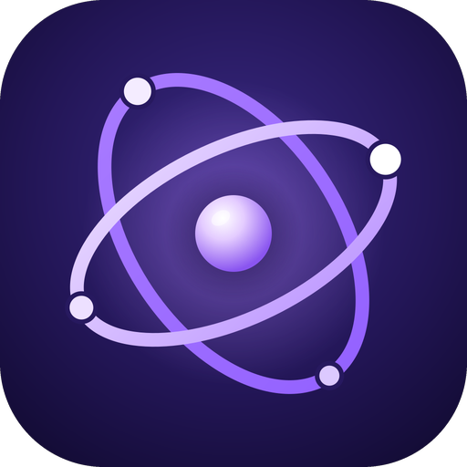
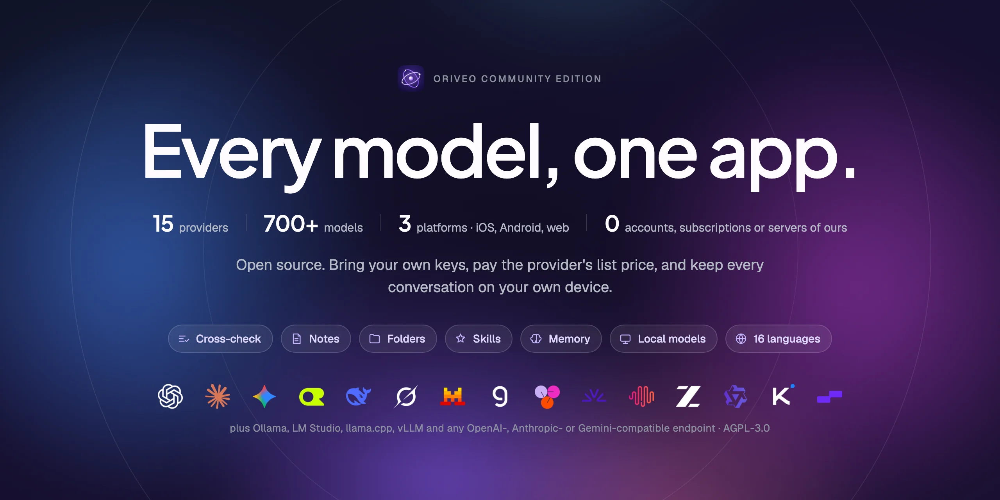
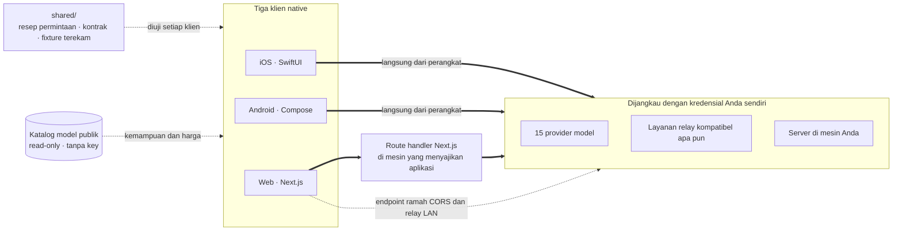

<div align="center">



# Oriveo Community Edition

**Semua model, satu aplikasi.**

Klien chat AI open source berbasis bring-your-own-key untuk iOS, Android, dan web,
dengan klien macOS native yang sedang dikembangkan.
Tanpa akun, tanpa langganan, dan tanpa layanan kami di jalur permintaan chat.

<a href="../../LICENSE"></a>
<a href="ios.md"></a>
<a href="android.md"></a>
<a href="web.md"></a>
<a href="macos.md"></a>
<a href="https://github.com/oriveo/oriveo/releases/latest"></a>
<a href="https://github.com/oriveo/oriveo/stargazers"></a>

**Dapatkan Oriveo:**
<a href="https://oriveoai.com"><b>oriveoai.com</b></a> &nbsp;·&nbsp;
<a href="https://apps.apple.com/app/oriveo/id6775370458">App Store</a> &nbsp;·&nbsp;
<a href="https://play.google.com/store/apps/details?id=com.kenny.oriveo">Google Play</a> &nbsp;·&nbsp;
<a href="https://app.oriveoai.com">Aplikasi web</a>

<sub>Build di toko aplikasi adalah <b>Oriveo</b>, edisi komersial. Repositori ini adalah <a href="#community-edition-dan-oriveo">Community Edition</a>, yang dibangun dari kode sumber.</sub>

<a href="#mulai">Bangun dari sumber</a> &nbsp;·&nbsp;
<a href="#arsitektur">Arsitektur</a> &nbsp;·&nbsp;
<a href="#community-edition-dan-oriveo">Edisi</a> &nbsp;·&nbsp;
<a href="#faq">FAQ</a> &nbsp;·&nbsp;
<a href="../../CONTRIBUTING.md">Kontribusi</a>

<sub>

<a href="../../README.md">English</a> ·
<a href="../ar/README.md">العربية</a> ·
<a href="../de/README.md">Deutsch</a> ·
<a href="../es/README.md">Español</a> ·
<a href="../fr/README.md">Français</a> ·
<a href="../hi/README.md">हिन्दी</a> ·
**Indonesia** ·
<a href="../ja/README.md">日本語</a> ·
<a href="../ko/README.md">한국어</a> ·
<a href="../pt-BR/README.md">Português</a> ·
<a href="../ru/README.md">Русский</a> ·
<a href="../th/README.md">ไทย</a> ·
<a href="../tr/README.md">Türkçe</a> ·
<a href="../vi/README.md">Tiếng Việt</a> ·
<a href="../zh-Hans/README.md">简体中文</a> ·
<a href="../zh-Hant/README.md">繁體中文</a>

</sub>



</div>

---

## Apa itu Oriveo

Oriveo Community Edition adalah klien chat AI (AI chat client) open source, multi-model, berbasis
bring-your-own-key (BYOK) untuk iOS, Android, dan web, dengan klien macOS native yang sedang
dikembangkan. Ini adalah alternatif local-first bagi paket ChatGPT atau Claude terhosting, untuk
orang yang lebih suka membayar langsung ke provider model daripada membayar langganan ke apa pun
yang berdiri di depannya. Anda menyediakan API key yang sudah Anda miliki, klien memakainya untuk
berbicara dengan provider, dan klien webnya bisa Anda hosting sendiri (self-host) — tanpa akun
Oriveo, dan tanpa apa pun yang melapor balik ke kami.

Aplikasi ini berbicara secara native dengan **15 provider model** — OpenAI, Anthropic, Google
Gemini, OpenRouter, DeepSeek, Grok, Mistral, Groq, Together AI, Fireworks AI, MiniMax, Z.ai, Qwen,
Kimi (Moonshot), dan SiliconFlow — ditambah **endpoint apa pun yang kompatibel dengan OpenAI,
Anthropic, atau Gemini** yang Anda arahkan, termasuk llama.cpp, Ollama, LM Studio, atau vLLM yang
berjalan di mesin Anda sendiri. Satu klien LLM (LLM client), satu kumpulan percakapan, model mana
pun yang menjawab.

<table>
<tr>
<td width="33%" valign="top"><b>15 provider</b><br>Plus endpoint relay dan server model lokal.</td>
<td width="33%" valign="top"><b>Lokal secara bawaan</b><br>Percakapan, catatan, folder, keterampilan, dan lampiran tetap di perangkat.</td>
<td width="33%" valign="top"><b>Satu perilaku, tiga klien</b><br>Satu spesifikasi di <code>shared/</code>, tiga suite mengujinya.</td>
</tr><tr>
<td valign="top"><b>Tanpa akun</b><br>Tidak ada yang melapor balik ke kami.</td>
<td valign="top"><b>Hosting sendiri</b><br>Klien web berjalan di mesin Anda.</td>
<td valign="top"><b>16 bahasa</b><br>Tata letak right-to-left penuh untuk bahasa Arab.</td>
</tr></table>

## Mengapa ini ada

Tidak seorang pun seharusnya bisa melakukan metering, mencatat, atau mengambil markup atas model
yang Anda bayar.

- **Key Anda, tagihan Anda.** Anda membayar harga resmi provider. Tidak ada markup, tidak ada
  metering, tidak ada penjualan ulang.
- **Lokal secara bawaan.** Percakapan, catatan, folder, keterampilan, dan lampiran tersimpan di
  perangkat. Ekspor ke berkas kapan pun Anda mau; tidak ada salinan cloud yang bisa hilang aksesnya.
- **Satu perilaku, tiga klien.** Bagaimana sebuah permintaan dibentuk untuk provider, transport, dan
  capability tertentu dituliskan sekali di [`shared/`](shared.md), dan ketiga klien menguji diri
  terhadap fixture JSON yang sama. Keanehan yang hidup di dalam data itu diperbaiki sekali; keanehan
  yang hidup di dalam sebuah parser tertangkap oleh tiga suite sekaligus.
- **Satu hal yang diambilnya.** Sebuah katalog model publik yang read-only, supaya model yang rilis
  hari ini langsung bisa dipakai tanpa pembaruan aplikasi — tanpa key, tanpa identifier yang kami
  lampirkan, dan bisa diarahkan ke host Anda sendiri.

## Fitur

- **Chat** — streaming, blok reasoning, sitasi, lampiran (gambar dan video, PDF, Office (docx, xlsx,
  pptx), OpenDocument, EPUB, RTF, HTML, serta berkas teks biasa atau berkas kode apa pun),
  mengutip bagian terpilih, retry, regenerate, melanjutkan jawaban yang terputus
- **Provider** — 15 bawaan, masing-masing dengan key Anda sendiri; override model dan parameter
  generasi per provider, serta pilihan endpoint regional bila provider menyediakannya
- **Layanan relay (Relay)** — endpoint apa pun yang kompatibel dengan OpenAI, Anthropic, atau
  Gemini, plus API native llama.cpp, termasuk yang ada di LAN Anda
- **Server model lokal** — llama.cpp, Ollama, LM Studio, vLLM, Open WebUI; iOS dan Android
  menemukannya di jaringan lokal lewat mDNS bila engine-nya mengumumkan diri, kalau tidak dengan
  memindai port yang biasa dipakai
- **Masuk dengan langganan** — pakai langganan ChatGPT atau Grok yang sudah Anda miliki, bukan API
  key, lewat alur device authorization milik masing-masing provider
- **Keterampilan** — system prompt yang bisa dipakai ulang, dengan model, setelan reasoning, dan
  dokumen referensinya sendiri
- **Catatan dan folder** — simpan sebuah balasan sebagai catatan, rapikan percakapan, cari di keduanya
- **Periksa dengan model lain** — serahkan sebuah jawaban ke model kedua untuk ditinjau dan simpan
  keduanya bersama
- **Ingatan** — beberapa fakta tentang dirimu, ditulis sekali dan dibawa ke setiap percakapan baru
- **Biaya** — pengeluaran per pesan dan per provider, dihitung di perangkat dari apa yang benar-benar
  dilaporkan setiap response, termasuk tingkat cache read dan cache write
- **Pembuatan gambar** — di mana provider mendukungnya
- **Cadangan** — ekspor semuanya ke satu berkas; key provider di dalamnya, kalau Anda memilih untuk
  menyertakannya, dienkripsi dengan kata sandi milik Anda
- **16 bahasa antarmuka**, termasuk tata letak right-to-left penuh untuk bahasa Arab

## Community Edition dan Oriveo

Repositori ini adalah **Oriveo Community Edition**, dilisensikan di bawah
[AGPL-3.0-or-later](../../LICENSE). Aplikasi di App Store, Google Play, dan aplikasi web terhosting
adalah **Oriveo** — produk proprietary terpisah yang menambahkan lapisan akun.

| | Community Edition | Oriveo |
|---|---|---|
| Sumber | Repositori ini, AGPL-3.0-or-later | Proprietary |
| Chat dengan key provider Anda sendiri | Ya | Ya |
| Layanan relay dan server model lokal | Ya | Ya |
| Catatan, folder, keterampilan, lampiran | Ya | Ya |
| Pelacakan biaya di perangkat | Ya | Ya |
| Akun | Tidak ada | Akun Oriveo |
| Penyimpanan | Di perangkat; ekspor dan pulihkan manual | Local-first, plus sinkronisasi cloud lintas perangkat |
| Wawasan pemakaian dan peringatan anggaran | — | Ya |
| Model yang dibayari Oriveo | — | Ya |
| Analytics dan pelaporan crash | Tidak ada. Sentry di bundel web tetap diam tanpa DSN milik Anda sendiri | Ya |

Build Community Edition memakai awalan identifier `ai.oriveo.community`, sehingga satu build bisa
berada di perangkat yang sama dengan build dari toko tanpa keduanya berbagi keychain atau data lokal
apa pun. Apa yang akan dan tidak akan diterima edisi ini tertulis di
[COMMUNITY.md](../../COMMUNITY.md).

**Oriveo, produk lengkapnya:** [iPhone dan iPad](https://apps.apple.com/app/oriveo/id6775370458) ·
[Android](https://play.google.com/store/apps/details?id=com.kenny.oriveo) · [Web](https://app.oriveoai.com) · [oriveoai.com](https://oriveoai.com)

## Provider

Setiap provider di bawah ini dijangkau dengan key yang Anda buat sendiri. Dua di antaranya juga bisa
dijangkau dengan masuk memakai langganan yang sudah Anda miliki, bukan dengan key: OpenAI dengan
paket ChatGPT, dan Grok.

| Provider | Tempat mengambil key |
|---|---|
| OpenAI | [platform.openai.com](https://platform.openai.com/api-keys) |
| Anthropic | [platform.claude.com](https://platform.claude.com/settings/keys) |
| Google Gemini | [aistudio.google.com](https://aistudio.google.com/apikey) |
| OpenRouter | [openrouter.ai](https://openrouter.ai/keys) |
| DeepSeek | [platform.deepseek.com](https://platform.deepseek.com/api_keys) |
| Grok | [console.x.ai](https://console.x.ai/) |
| Mistral | [console.mistral.ai](https://console.mistral.ai/api-keys) |
| Groq | [console.groq.com](https://console.groq.com/keys) |
| Together AI | [api.together.xyz](https://api.together.xyz/settings/api-keys) |
| Fireworks AI | [fireworks.ai](https://fireworks.ai/api-keys) |
| MiniMax | [platform.minimax.io](https://platform.minimax.io/docs/guides/quickstart-preparation) |
| Z.ai | [open.bigmodel.cn](https://open.bigmodel.cn/usercenter/apikeys) |
| Qwen | [bailian.console.alibabacloud.com](https://bailian.console.alibabacloud.com/?apiKey=1#/api-key) |
| Kimi (Moonshot) | [platform.kimi.ai](https://platform.kimi.ai/console/api-keys) |
| SiliconFlow | [cloud.siliconflow.cn](https://cloud.siliconflow.cn/account/ak) |
| **Layanan relay** | Endpoint apa pun yang kompatibel dengan OpenAI, Anthropic, atau Gemini, plus API native llama.cpp, termasuk yang ada di mesin Anda sendiri |

## Arsitektur

Tiga klien native, satu definisi tentang cara berbicara dengan provider model.



Setiap klien punya UI, penyimpanan, dan navigasinya sendiri, dan bertemu kontrak bersama di tepat
satu titik sambung: lapisan yang mengubah *model ini, capability ini* menjadi sebuah permintaan HTTP.

Satu-satunya ketidaksimetrisan yang perlu Anda tahu ada pada klien web. Sebagian besar API provider
tidak mengirim header CORS, jadi browser tidak bisa memanggilnya langsung. Permintaan itu melewati
sebuah route handler Next.js yang berjalan di mesin mana pun yang menyajikan aplikasi — mesin Anda
sendiri, saat Anda menjalankannya secara lokal. Segelintir endpoint yang memang mengizinkan browser
(endpoint Tiongkok milik Kimi, dan endpoint saldo OpenRouter, SiliconFlow, DeepSeek, serta Kimi) dan
relay di jaringan Anda sendiri dipanggil langsung. Klien iOS dan Android tidak punya batasan seperti
itu dan selalu langsung menuju provider.

**Arsitektur masing-masing klien:**

| | Stack | README |
|---|---|---|
| **iOS** | SwiftUI dengan transkrip UIKit, GRDB | [ios.md](ios.md) |
| **Android** | Jetpack Compose, Room, Koin, Ktor/OkHttp | [android.md](android.md) |
| **Web** | Next.js App Router, React, Zustand, TypeScript | [web.md](web.md) |
| **macOS** | Sedang dikembangkan, hadir dalam beberapa bulan ke depan | [macos.md](macos.md) |
| **Shared** | Kontrak, fixture terekam, dan wire kernel Swift | [shared.md](shared.md) |

## Mulai

Tidak ada biner siap pakai di sini — tidak ada APK, tidak ada `.ipa`. Community Edition adalah kode
sumber yang Anda build sendiri. Klien web adalah jalur terpendek menuju aplikasi yang berjalan.

<details open>
<summary><b>Web</b> — cara tercepat mencobanya</summary>

<br>

Membutuhkan Node 22.22.2 atau 22.x yang lebih baru (lihat [`web/.nvmrc`](../../web/.nvmrc)); Node 23+ tidak didukung.

```bash
cd web
npm install
npm run dev:app        # http://localhost:3001
```

Layar pertama meminta sebuah API key provider. Selain itu tidak ada yang wajib.
Perintah dan konfigurasi lainnya: [web.md](web.md).

</details>

<details>
<summary><b>iOS</b> — build dan jalankan di iPhone Anda sendiri</summary>

<br>

Membutuhkan Mac dengan Xcode 26 dan perangkat dengan iOS 18 atau lebih baru. Akun Apple Developer
gratis sudah cukup — aplikasi ini tidak memakai capability berbayar apa pun.

1. Buka `ios/Oriveo/Oriveo.xcodeproj`
2. Pilih scheme `Oriveo`
3. Di Signing &amp; Capabilities, pilih Team Anda sendiri
4. Kalau Xcode tidak bisa mendaftarkan `ai.oriveo.community`, ganti bundle identifier ke identifier milik tim Anda
5. Jalankan

Panduan lengkap, termasuk apa yang harus dilakukan jika Xcode menolak membuka proyeknya:
[ios.md](ios.md).

</details>

<details>
<summary><b>Android</b> — build APK-nya</summary>

<br>

Membutuhkan JDK 21 dan Android SDK. Build memakai AGP 9.3, Gradle 9.5, dan Kotlin 2.3, jadi Android
Studio harus versi rilis yang bisa menyinkronkannya. Dari command line hanya JDK dan SDK yang
dibutuhkan.

```bash
cd android
./gradlew :app:assembleDebug
```

Menyajikan katalog model dari host Anda sendiri: [android.md](android.md).

</details>

## Privasi

- **Key provider** masuk ke iOS Keychain, dan di Android ke `EncryptedSharedPreferences` di bawah
  sebuah key yang dipegang Android Keystore. Browser tidak punya fasilitas yang setara, jadi di web
  key tersimpan tanpa enkripsi di IndexedDB — model yang sama yang umumnya dipakai klien BYOK
  berbasis browser. Untuk jaminan terkuat, gunakan klien iOS atau Android.
- **Percakapan, catatan, folder, keterampilan, dan lampiran** disimpan di perangkat. Tidak ada yang
  diunggah ke mana pun.
- **Tanpa akun, dan tanpa analytics.** Tidak ada yang perlu dimasuki, dan tidak ada yang menghitung
  apa yang Anda lakukan. Bundel web menyertakan Sentry untuk pelaporan error. Ia tetap diam sampai
  Anda menyetel `NEXT_PUBLIC_SENTRY_DSN` ke proyek Anda sendiri, dan kalau Anda melakukannya, ia
  dikonfigurasi untuk merekam session replay selain stack trace. Klien iOS dan Android tidak
  mengandung SDK pelaporan apa pun.
- **Di iOS dan Android, permintaan chat langsung dari perangkat ke provider.** Di web sebagian besar
  permintaan melewati server Next.js yang menyajikan aplikasi, karena sebagian besar API provider
  tidak mengizinkan panggilan langsung dari browser. Server itu tidak menyimpan key maupun pesan, dan
  saat Anda menjalankan aplikasi secara lokal, server itu adalah mesin Anda sendiri.
- **Dua permintaan milik kami sendiri:** katalog model read-only, dibaca dalam dua panggilan. Satu
  mencakup bagaimana setiap model ingin dialamatkan; satunya lagi fakta tentang masing-masing model,
  yang di iOS baru dibaca setelah Anda masuk dengan langganan. Berkat keduanya, model yang rilis hari
  ini bisa dipakai tanpa build baru. Tidak satu pun membawa key, percakapan, maupun identifier yang
  kami lampirkan. Host hanya melihat User-Agent bawaan platform, dan satu-satunya hal yang dikirim
  balik klien adalah `ETag` milik katalog itu sendiri, sebagai `If-None-Match`. Klien web
  (`NEXT_PUBLIC_BACKEND_URL`) dan build Android (`-PORIVEO_METADATA_BASE_URL`) bisa diarahkan ke host
  Anda sendiri; di iOS override itu hanya kemudahan untuk build Debug.

## FAQ

<details>
<summary><b>Apakah Oriveo klien BYOK untuk OpenAI, Claude, Gemini, dan OpenRouter?</b></summary>

<br>

Bring your own key — bawa key Anda sendiri. Anda membuat API key di konsol milik provider — OpenAI,
Anthropic, Google, dan seterusnya — lalu menempelkannya ke Oriveo. Permintaan ditagih oleh provider
tersebut dengan harga resminya. Oriveo hanyalah kliennya; ia bukan reseller dan tidak mengambil
potongan.

</details>

<details>
<summary><b>Apakah Oriveo alternatif ChatGPT yang gratis dan open source?</b></summary>

<br>

Kliennya iya: open source, tidak ada langganan apa pun, dan tidak ada bagiannya yang ditahan di balik
pembayaran. Yang Anda bayar adalah harga resmi provider model untuk permintaan yang Anda buat,
ditagih oleh mereka, pada akun tempat key itu berada. Oriveo tidak pernah melihat tagihan itu.

</details>

<details>
<summary><b>Apakah percakapan saya melewati server Oriveo?</b></summary>

<br>

Tidak. iOS dan Android memanggil provider secara langsung. Di web sebagian besar permintaan melewati
server Next.js yang menyajikan aplikasi — mesin Anda sendiri saat Anda menjalankannya secara lokal —
karena sebagian besar API provider menolak panggilan dari browser. Tidak ada server yang kami
operasikan di jalur chat. Lihat [Privasi](#privasi).

</details>

<details>
<summary><b>Apakah bisa dipakai dengan Ollama, LM Studio, atau llama.cpp?</b></summary>

<br>

Bisa. Tambahkan koneksi layanan relay yang mengarah ke server mana pun yang kompatibel dengan OpenAI,
Anthropic, atau Gemini — llama.cpp, Ollama, LM Studio, vLLM, Open WebUI, atau apa pun yang berbicara
salah satu protokol tersebut. Klien iOS dan Android menemukannya di jaringan lokal lewat mDNS bila
engine-nya mengumumkan diri, dan dengan memindai port yang biasa dipakai kalau tidak; klien web
menyarankan alamat yang biasa dipakai tiap engine. HTTP lokal tidak memakai kredensial apa pun dan
tidak pernah keluar dari jaringan Anda.

</details>

<details>
<summary><b>Bisakah saya meng-hosting Oriveo sendiri?</b></summary>

<br>

Bisa. Klien web adalah satu-satunya bagian proyek ini yang punya sisi server, dan ia tidak menyimpan
key maupun pesan. Arahkan ke server model di perangkat keras Anda sendiri, hosting katalognya sendiri
dengan `NEXT_PUBLIC_BACKEND_URL` (web) atau `-PORIVEO_METADATA_BASE_URL` (Android), dan tidak ada apa
pun yang menjangkau ke luar jaringan Anda. Di iOS override itu hanya ada di build Debug. Lihat
[Privasi](#privasi).

</details>

<details>
<summary><b>Apa bedanya Community Edition dengan aplikasi Oriveo di App Store?</b></summary>

<br>

Aplikasi di toko adalah Oriveo, produk proprietary yang menambahkan akun, sinkronisasi cloud lintas
perangkat, wawasan pemakaian, dan model yang dibayari Oriveo. Community Edition tidak memiliki semua
itu. Lihat [Community Edition dan Oriveo](#community-edition-dan-oriveo) untuk perbandingan
lengkapnya.

</details>

<details>
<summary><b>Apakah ada aplikasi macOS?</b></summary>

<br>

Klien macOS native sedang dikembangkan dan akan hadir dalam beberapa bulan ke depan;
[`macos/`](macos.md) adalah tempatnya nanti. Sampai saat itu klien web bekerja dengan baik sebagai
aplikasi desktop di browser mana pun, dan build iOS berjalan di Mac dengan Apple silicon langsung
dari Xcode. Paket Swift yang berbicara dengan para provider sudah mendeklarasikan macOS 15, jadi
lapisan wire yang dibutuhkan sebuah klien Mac sudah diuji hari ini.

</details>

<details>
<summary><b>Antarmukanya tersedia dalam bahasa apa saja?</b></summary>

<br>

Enam belas: Arab, Jerman, Inggris, Spanyol, Prancis, Hindi, Indonesia, Jepang, Korea, Portugis
Brasil, Rusia, Thai, Turki, Vietnam, Mandarin Sederhana, dan Mandarin Tradisional. Bahasa Arab
mendapat tata letak right-to-left penuh.

</details>

## Struktur repositori

```
ios/           Klien iOS (SwiftUI)
android/       Klien Android (Jetpack Compose)
web/           Klien web (Next.js)
macos/         Klien macOS — sedang dikembangkan, hadir beberapa bulan lagi
shared/        Kontrak lintas klien, fixture terekam, dan wire kernel Swift
readme_i18n/   README ini dalam lima belas bahasa lain
docs/assets/   Gambar yang dipakai README
llms.txt       Indeks dokumentasi ini yang bisa dibaca mesin
.github/       Templat issue dan pull request
```

## Kontribusi

Laporan bug dan pull request sangat diterima. [CONTRIBUTING.md](../../CONTRIBUTING.md) menjelaskan
cara mem-build setiap klien dan seperti apa pull request yang baik.
[COMMUNITY.md](../../COMMUNITY.md) menjelaskan untuk apa edisi ini ada, dan beberapa jenis perubahan
yang tidak akan diterima sebaik apa pun penulisannya.

Menemukan masalah keamanan? Mohon jangan membuka issue publik — [SECURITY.md](../../SECURITY.md)
menjelaskan cara melaporkannya secara privat, dan apa yang diperlakukan proyek ini sebagai kerentanan
dan apa yang tidak. Semua yang ikut serta diharapkan mengikuti
[kode etik](../../CODE_OF_CONDUCT.md).

## Lisensi

[AGPL-3.0-or-later](../../LICENSE). Kontribusi diterima di bawah lisensi yang sama.

Nama dan logo provider adalah milik pemiliknya masing-masing dan muncul di sini hanya untuk
mengidentifikasi layanan yang bisa dituju klien ini. Keduanya tidak tercakup oleh lisensi repositori
ini, dan keberadaannya bukan bentuk dukungan dari siapa pun. Font dan library yang dibundel klien,
beserta ketentuan yang menyertainya, terdaftar di
[THIRD-PARTY-NOTICES.md](../../THIRD-PARTY-NOTICES.md).
