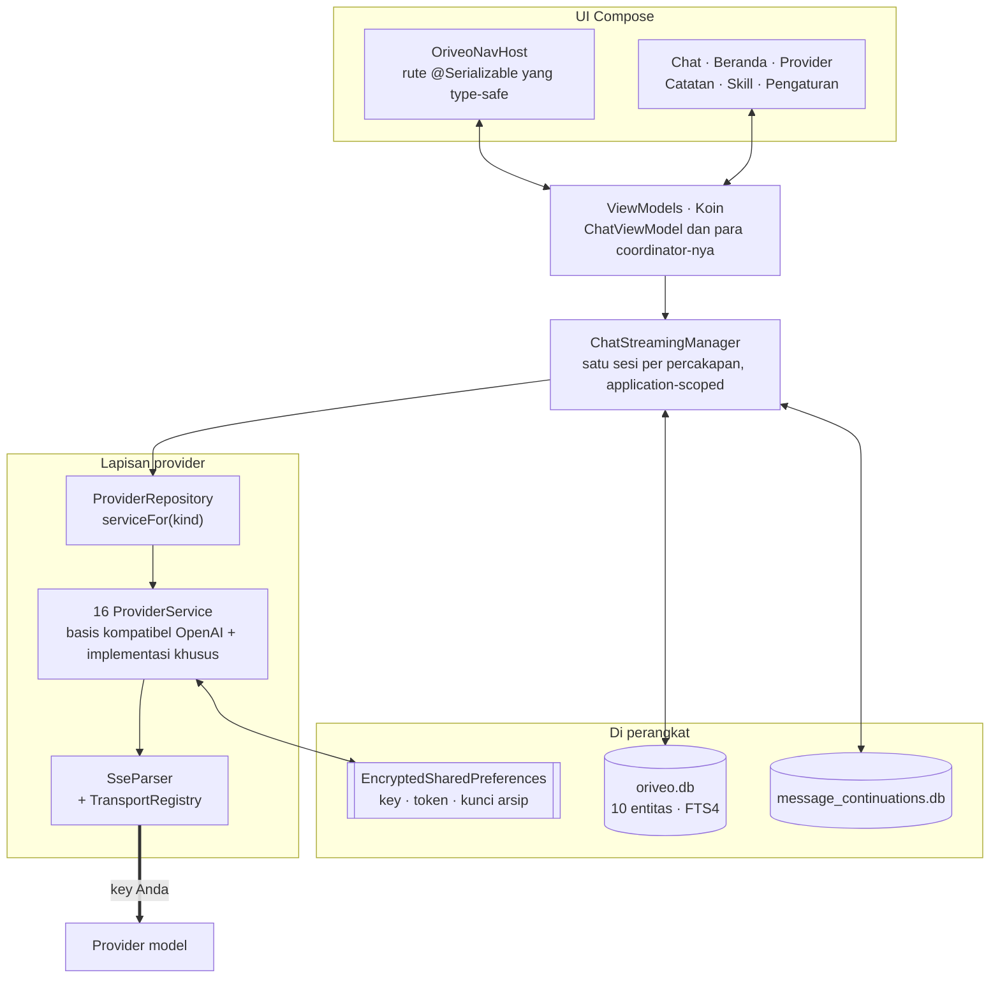

<div align="center">

# Oriveo untuk Android

**Klien chat Jetpack Compose native untuk model AI yang sudah Anda bayar.**

<a href="../../LICENSE"></a>


<sub>

<a href="../../android/README.md">English</a> ·
<a href="../ar/android.md">العربية</a> ·
<a href="../de/android.md">Deutsch</a> ·
<a href="../es/android.md">Español</a> ·
<a href="../fr/android.md">Français</a> ·
<a href="../hi/android.md">हिन्दी</a> ·
**Indonesia** ·
<a href="../ja/android.md">日本語</a> ·
<a href="../ko/android.md">한국어</a> ·
<a href="../pt-BR/android.md">Português</a> ·
<a href="../ru/android.md">Русский</a> ·
<a href="../th/android.md">ไทย</a> ·
<a href="../tr/android.md">Türkçe</a> ·
<a href="../vi/android.md">Tiếng Việt</a> ·
<a href="../zh-Hans/android.md">简体中文</a> ·
<a href="../zh-Hant/android.md">繁體中文</a>

</sub>

</div>

---

Klien Android Oriveo adalah aplikasi chat AI bring-your-own-key. Anda menambahkan API key yang sudah
Anda miliki, dan aplikasi berbicara dengan setiap provider langsung dari ponsel. Percakapan,
catatan, folder, dan skill disimpan di perangkat dalam Room; API key dienkripsi dengan kunci yang
disimpan di Android Keystore. Tidak ada akun dan tidak ada proses masuk.

Ini bagian dari [Oriveo Community Edition](README.md) — tiga klien yang berbagi satu definisi
tentang cara berbicara dengan provider model.

## Arsitektur



Tiga hal dalam diagram ini adalah keputusan desain yang disengaja, bukan struktur yang kebetulan
terbentuk.

**Streaming hidup di atas layar.** `ChatStreamingManager` menyimpan satu `StreamingSession` per id
percakapan di dalam `ConcurrentHashMap`, masing-masing dengan
`CoroutineScope(SupervisorJob() + Dispatchers.IO)` sendiri yang application-scoped. Berpindah keluar
dari sebuah chat tidak membatalkan jawaban, dan `StreamingTokenBuffer` secara berkala membuang teks
parsial ke SQLite, jadi menutup paksa aplikasi di tengah jawaban tidak menghilangkan apa yang sudah
tiba.

**Dua basis data, bukan satu.** `oriveo.db` menampung percakapan, pesan, lampiran, catatan, folder,
skill, dan cache katalog model. `message_continuations.db` adalah berkas yang terpisah secara fisik
dan berisi state kelanjutan milik provider yang bersifat opaque — justru supaya `backup_rules.xml`
dan `data_extraction_rules.xml` bisa mengeluarkannya dari cadangan cloud dan transfer perangkat;
token kelanjutan yang dipulihkan ke perangkat lain paling banter tidak bermakna.

**Katalog yang lebih baru daripada binari akan menurun, bukan patah.** `TransportKind` adalah enum
tertutup dengan deserializer yang longgar: string transport yang tidak dikenal ter-decode menjadi
`null`, `TransportRegistry` tidak mengembalikan strategi apa pun, dan model itu disaring keluar dari
pemilih model. Alternatifnya — enum yang ketat — akan menggagalkan parse seluruh katalog dan
menjatuhkan semua model lain bersamanya.

## Apa yang boleh dilakukan sebuah model

Klien tidak pernah menebak kemampuan sebuah model dari namanya. Ia membaca sebuah capability runtime
dari katalog: resep yang menjelaskan, untuk provider, transport, dan capability tertentu, persis
JSON pointer mana yang harus ditulis ke dalam permintaan. `ProviderRecipeRequestCompiler` memvalidasi
resep terhadap provider, capability, dan transport sebelum mengompilasinya menjadi delta body milik
sendiri, dan menolak dengan alasan bernama (`recipe_not_found`, `transport_mismatch`,
`model_route_must_not_patch_body`) alih-alih diam-diam menghasilkan permintaan yang tidak pernah
ditinjau siapa pun.

Dalam perjalanan pulang, `CapabilityEvidenceFacade` memeringkat apa yang benar-benar diketahui
tentang sebuah capability berdasarkan sumbernya — `operator_override` > `server_typed` >
`server_profile` > `model_facts` > `relay_verification` > `relay_declaration` > `legacy_metadata`.
Hanya parser stream yang boleh menandai sebuah capability sebagai *observed*; niat, resep, HTTP 200,
dan deklarasi tool secara eksplisit tidak dihitung. Hasil per pesan disimpan permanen, sehingga UI
bisa membedakan *requested* dari *confirmed*.

Override diselesaikan dengan aturan last-write-wins lintas tujuh cakupan, menurut prioritas:
`single_send` > `conversation_connection_model` > `skill_agent` > `connection_model` > `connection` >
`provider_recipe` > `provider_default`.

## Penyimpanan dan rahasia

| Apa | Di mana |
|---|---|
| Percakapan, pesan, lampiran, catatan, folder, skill | Room, `oriveo.db` |
| Pencarian teks penuh atas catatan | Tabel virtual FTS4 |
| Cache katalog model | satu baris di `oriveo.db`, dibaca kembali per potongan |
| State kelanjutan provider | `message_continuations.db`, dikecualikan dari cadangan |
| API key provider | `EncryptedSharedPreferences`, AES-256-GCM, master key di Keystore |
| Token OAuth langganan | berkas preferensi terenkripsi kedua yang terpisah |
| Kunci arsip cadangan | berkas ketiga |
| Blob lampiran | berkas di disk, dirujuk lewat id |

Ketiga berkas preferensi terenkripsi dipisahkan berdasarkan masa hidup dan luas dampaknya, bukan
digabung demi kepraktisan. Masing-masing punya jalur pemulihan: berkas yang rusak
(`AEADBadTagException`, `VERIFICATION_FAILED`) dideteksi, dihapus, dan dibuat ulang alih-alih
membuat aplikasi crash setiap kali dijalankan.

Ketiganya, dan basis data kelanjutan, dikecualikan dari cadangan cloud Android dan transfer
perangkat. Itu konsekuensi dari mengikatnya ke Keystore, bukan kelalaian — ciphertext-nya toh tidak
akan bisa didekripsi di perangkat baru. **Setelah pindah ke ponsel baru Anda memasukkan lagi API key
Anda dan masuk lagi ke langganan provider mana pun**; percakapan dan catatan ikut berpindah seperti
biasa.

Arsip cadangan yang Anda ekspor sendiri dienkripsi terpisah, dengan PBKDF2-HMAC-SHA256 pada 600.000
iterasi dan AES-GCM, memakai kata sandi pilihan Anda.

## Menjangkau server model di jaringan Anda sendiri

Manifest menyetel `android:usesCleartextTraffic="true"` dengan sengaja: server model lokal —
llama.cpp, Ollama, LM Studio, vLLM — berbicara HTTP polos di mesin Anda sendiri atau di LAN, dan
umumnya tidak punya sertifikat.

Batas yang sesungguhnya ada di kode, bukan di manifest, dan memang harus begitu.
`RelayEndpointPolicy` me-resolve host, mensyaratkan **setiap** alamat hasil resolusi bersifat privat
(loopback, RFC 1918, link-local, unique-local, dan rentang CGNAT dalam mode VPN), menolak host yang
me-resolve ke campuran alamat publik dan privat, mem-pin himpunan alamat hasil resolusi terhadap DNS
rebinding lalu memverifikasinya ulang saat pengiriman, menolak permintaan cleartext apa pun yang
membawa materi kredensial, serta memblokir redirect lintas origin atau yang mengubah skema.

Network security config Android tidak bisa mengungkapkan himpunan aturan itu: ia hanya mencocokkan
hostname, tidak punya sintaks untuk rentang alamat, dan alamat di sini datang dari jaringan pengguna
sendiri saat runtime. Sebuah config juga akan lebih lemah secara mutlak, karena ia tidak pernah
melihat alamat hasil resolusi sebuah nama.

## Katalog model

Aplikasi membaca kemampuan dan harga model dari katalog publik supaya model yang rilis hari ini bisa
dipakai tanpa pembaruan aplikasi. Itu sebuah `GET` HTTPS biasa tanpa kredensial dan tanpa identifier
apa pun, dan permintaan chat tidak pernah mendekatinya. Hanya dua endpoint yang diminta:

```
GET {base}/api/metadata?view=lean
GET {base}/api/metadata/model-facts
```

URL basis adalah properti build-time, dengan nilai bawaan `https://api.oriveoai.com`:

```bash
./gradlew :app:assembleDebug -PORIVEO_METADATA_BASE_URL=https://your.host
```

Response direvalidasi dengan ETag dan di-cache di `oriveo.db`, jadi begitu satu pengambilan berhasil,
aplikasi tetap bekerja dari salinan cache ketika katalog kelak tidak terjangkau.

> [!IMPORTANT]
> Mem-build dengan nilai kosong (`-PORIVEO_METADATA_BASE_URL=`) mematikan pengambilan katalog
> sepenuhnya, dan **tidak ada snapshot yang dibundel di dalam APK**. Pada instalasi baru dari build
> semacam itu:
>
> - tidak satu pun dari 15 provider bawaan mendapat daftar model, dan aplikasi tidak meminta daftar
>   itu ke provider — katalog adalah satu-satunya sumber;
> - kegagalannya **senyap**. Menambahkan key tetap dilaporkan berhasil, dan pemilih model sekadar
>   kosong tanpa penjelasan apa pun;
> - **OpenAI menjadi tidak bisa dipakai**, karena entri model manual diblokir untuk provider itu;
> - endpoint Relay dan server model lokal tetap berfungsi penuh, dan itulah satu-satunya jalur yang
>   masih utuh.
>
> Kalau Anda ingin build yang offline, sajikan katalognya sendiri dan arahkan build ke sana, jangan
> mengosongkan nilainya.

## Struktur proyek

```
android/
  app/src/main/java/ai/oriveo/community/
    core/
      provider/    every provider service, transports, relay, capability recipes
      data/        Room entities, DAOs, repositories, backup, catalog client
      model/       domain models and the capability/preference resolvers
      attachments/ routing, budgets, per-format text extraction
      security/    SecureKeyStore, BackupCrypto, external-URL policy
      streaming/   ChatStreamingManager
      navigation/  AppRoute, OriveoNavHost
    feature/       one package per screen
    ui/            shared components, Markdown + LaTeX renderer, theme
    di/            Koin modules
  benchmark/       macrobenchmark suite (cold start, model picker)
```

## Membangun

Persyaratan: **JDK 17 atau lebih baru** dan Android SDK. Build memakai AGP 9.3, Gradle 9.5, dan
Kotlin 2.3, jadi Android Studio harus versi rilis yang bisa menyinkronkan AGP 9.3; dari command line
hanya JDK dan SDK yang dibutuhkan.

```bash
./gradlew :app:assembleDebug
./gradlew :app:testDebugUnitTest
```

Build menargetkan `minSdk 26`, `targetSdk 36`, `compileSdk 37`. `local.properties` (path SDK Anda)
dihasilkan Android Studio dan tidak di-commit. Penandatanganan rilis dijelaskan di
[SIGNING.md](../../android/SIGNING.md).

> [!NOTE]
> Daemon Gradle berjalan pada toolchain Java 21 (`gradle/gradle-daemon-jvm.properties`), dan
> pencocokannya tepat pada 21, bukan "21 atau lebih baru". Dengan JDK lain yang terpasang, Gradle
> mengunduh sendiri JDK 21 pada build pertama, dan itu butuh akses jaringan; memasang JDK 21 sendiri
> menghindarinya. Jika Anda menyetel `org.gradle.java.installations.auto-download=false`, unduhan itu
> tidak bisa terjadi dan build gagal dengan `Toolchain auto-provisioning is not enabled.` — itulah
> satu-satunya kasus di mana JDK 17 saja benar-benar tidak cukup. Kompilasi tetap menargetkan Java 17
> dalam kedua kasus.

Paralelisme unit test diturunkan dari jumlah CPU dan memori fisik mesin, bukan ditulis mati, jadi
suite-nya berperilaku wajar baik di laptop maupun di workstation besar.

## Dependensi

| Library | Versi | Dipakai untuk |
|---|---|---|
| Jetpack Compose BOM | 2026.08.00 | UI, Material 3 |
| Room | 2.8.4 | SQLite, DAO, FTS4 |
| Koin | 4.2.2 | dependency injection |
| Ktor client (engine OkHttp) | 3.5.2 | HTTP dan SSE provider |
| kotlinx.serialization | 1.11.0 | JSON |
| navigation-compose | 2.9.6 | rute type-safe |
| androidx.security-crypto | 1.1.0 | `EncryptedSharedPreferences` |
| haze | 1.7.3 | blur latar |
| PDFBox-Android, jsoup | 2.0.27.0, 1.23.2 | ekstraksi teks lampiran |
| jlatexmath-android | 0.2.0 | rendering LaTeX |

Versi persisnya di-pin di [`gradle/libs.versions.toml`](../../android/gradle/libs.versions.toml).

## Pengujian

```bash
./gradlew :app:testDebugUnitTest
```

Sekitar 3.000 unit test di 319 berkas, memakai JUnit 4, MockK, Turbine,
`kotlinx-coroutines-test`, dan mock engine milik Ktor. Cakupan paling tebal di tempat kesalahan
paling mahal: bentuk permintaan per provider, parsing SSE, pemilihan transport, probing relay dan
mode keamanan, eksekusi resep capability, caching katalog dan penanganan versi kontrak, persistensi
Room, serta round-trip cadangan.

> [!IMPORTANT]
> Sekitar 38 suite memuat fixture kontrak dari `shared/` dengan menelusuri ke atas dari direktori
> kerja, jadi **pengujian hanya lolos pada checkout penuh** — menyalin `android/` sendirian tidak
> akan berhasil.

Ada juga tiga instrumented test — sebuah matriks rilis local engine, sebuah pengujian socket
cleartext, dan sebuah pengujian isolasi keystore. Ketiganya tidak berdiri sendiri: yang local engine
membutuhkan argumen instrumentasi yang menyebutkan server model sungguhan yang sedang berjalan di
jaringan Anda, jadi `connectedAndroidTest` tidak lolos begitu saja. Gerbang untuk sebuah pull
request adalah unit suite.

Modul `:benchmark` berisi macrobenchmark untuk cold start dan pemilih model. Ia adalah modul Gradle
terpisah yang memakai `com.android.test` dengan self-instrumentation, dan menjalankan build type
`benchmark` khusus dari `:app`.

Kedua basis data masih di `version = 1` dan belum punya migrasi; skemanya diekspor ke `app/schemas/`
dan di-commit, dan di sanalah `2.json` dari migrasi pertama nanti akan mendarat.

## Pelokalan

Enam belas bahasa: `values/` (bahasa Inggris, sumbernya) plus lima belas direktori `values-*`,
masing-masing sekitar 1.700 string, dengan setiap locale memuat himpunan key yang identik.
Pergantian bahasa di dalam aplikasi melewati `AppLanguageManager` dan `android:localeConfig`.
Language split dimatikan pada bundle sehingga satu artefak membawa semua terjemahan.

## Kontribusi

Lihat [CONTRIBUTING.md](../../CONTRIBUTING.md). Bahasa kerja proyek ini adalah bahasa Inggris:
sumber, komentar, pengujian, dan pesan commit. String UI diterjemahkan — tambahkan string baru ke
`values/` lebih dulu dan biarkan locale lain menyusul. Jalankan unit test sebelum membuka pull
request.

## Lisensi

[AGPL-3.0-or-later](../../LICENSE).
