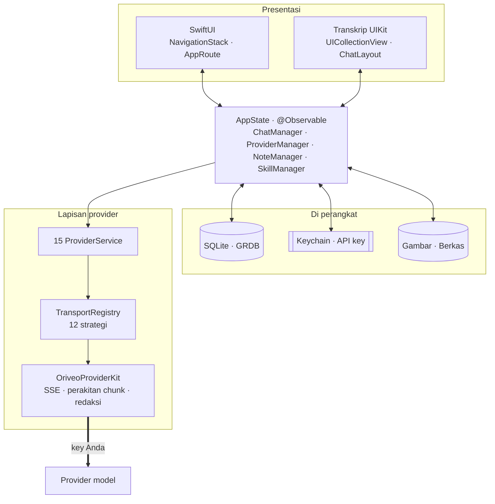
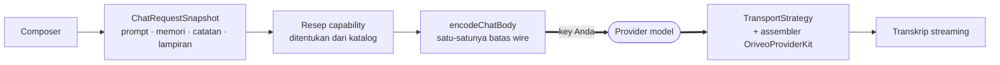

<div align="center">

# Oriveo untuk iOS

**Klien chat SwiftUI native untuk model AI yang sudah Anda bayar.**

<a href="../../LICENSE"></a>


<sub>

<a href="../../ios/README.md">English</a> ·
<a href="../ar/ios.md">العربية</a> ·
<a href="../de/ios.md">Deutsch</a> ·
<a href="../es/ios.md">Español</a> ·
<a href="../fr/ios.md">Français</a> ·
<a href="../hi/ios.md">हिन्दी</a> ·
**Indonesia** ·
<a href="../ja/ios.md">日本語</a> ·
<a href="../ko/ios.md">한국어</a> ·
<a href="../pt-BR/ios.md">Português</a> ·
<a href="../ru/ios.md">Русский</a> ·
<a href="../th/ios.md">ไทย</a> ·
<a href="../tr/ios.md">Türkçe</a> ·
<a href="../vi/ios.md">Tiếng Việt</a> ·
<a href="../zh-Hans/ios.md">简体中文</a> ·
<a href="../zh-Hant/ios.md">繁體中文</a>

</sub>

</div>

---

Klien iOS Oriveo adalah aplikasi chat AI bring-your-own-key. Anda menambahkan API key yang sudah
Anda miliki, dan aplikasi memanggil setiap provider langsung dari ponsel. Percakapan, catatan,
folder, skill, dan lampiran disimpan di perangkat dalam SQLite; API key masuk ke iOS Keychain. Tidak
ada akun dan tidak ada proses masuk.

Ini bagian dari [Oriveo Community Edition](README.md) — tiga klien yang berbagi satu definisi
tentang cara berbicara dengan provider model.

## Arsitektur



Tiga hal dari diagram ini perlu dikatakan terus terang.

**Transkripnya UIKit, sisanya SwiftUI.** `ChatView` menyematkan sebuah
`ChatListViewControllerRepresentable` di sekitar `UICollectionView` yang digerakkan oleh
[ChatLayout](https://github.com/ekazaev/ChatLayout). Segala yang lain — navigasi, pengaturan,
penyiapan provider, catatan, skill — adalah SwiftUI. Pembagian ini ada karena transkrip yang
streaming pada laju token butuh kontrol tingkat sel atas pengukuran dan penggunaan ulang, sesuatu
yang tidak diberikan diffing SwiftUI.
[`Features/Chat/ARCHITECTURE.md`](../../ios/Oriveo/Oriveo/Features/Chat/ARCHITECTURE.md)
mendokumentasikan batas itu.

**Tiga jalur terpisah memperbarui transkrip tersebut**, dengan sengaja:

| Jalur | Membawa | Alasan |
|---|---|---|
| `@Observable AppState` | perubahan struktural — sebuah pesan muncul, percakapan berpindah | native SwiftUI, murah untuk peristiwa berfrekuensi rendah |
| GRDB `ValueObservation` | state permanen yang dibaca ulang dari SQLite | satu sumber kebenaran setelah penulisan, bertahan setelah aplikasi dibuka ulang |
| Combine `PassthroughSubject` per percakapan | teks streaming dan delta reasoning | melewati diffing SwiftUI sepenuhnya pada laju token |

**Dukungan provider adalah empat sumbu independen, bukan satu enum.** `ProviderKind` (16 kasus)
adalah *siapa yang dikonfigurasi pengguna*. `ProviderServiceProtocol` adalah *permukaan
pemanggilan*. `TransportKind` (12 kasus) adalah *wire protocol mana yang sebenarnya dipakai* — dan
itu ditentukan **per model, dari katalog**, sehingga dua model di balik key yang sama bisa berbeda.
`RelayKind` mencakup endpoint yang disediakan pengguna. Memisahkan keempatnya itulah yang membuat
model baru bisa dipakai tanpa build baru.

### Bagaimana satu pesan dikirim



`BaseAPIService.encodeChatBody` adalah satu-satunya titik di mana request body menjadi byte. Setiap
resep capability, parameter generation, dan field kustom harus melewatinya, dan itulah yang membuat
format wire bisa diuji di satu tempat, bukan lima belas.

## Apa yang boleh dilakukan sebuah model

Klien tidak pernah menebak kemampuan sebuah model dari namanya. Ia membaca sebuah **capability
runtime** — sekumpulan resep yang menjelaskan, untuk provider, transport, dan capability tertentu,
persis JSON pointer mana yang harus ditulis ke dalam permintaan. Resep-resep itu ada di
[`shared/capabilityrecipe`](shared.md) dan diterapkan oleh `CapabilityRecipeRequestCompiler`.

Dalam perjalanan pulang, `CapabilityExecutionRuntime` mencatat apa yang sebenarnya terjadi. Hanya
parser stream produksi terpilih yang boleh menaikkan sebuah capability menjadi *observed*. HTTP 200,
jawaban yang tidak kosong, dan deklarasi tool di dalam permintaan secara eksplisit **bukan** bukti.
State akhirnya disimpan per pesan, sehingga UI bisa memberi tahu Anda bahwa sebuah kontrol diminta
tapi tidak pernah dikonfirmasi, alih-alih diam-diam menyiratkan bahwa itu berhasil.

## Penyimpanan

```
Application Support/Oriveo/
  active-uid                     # storage partition, "guest" by default
  users/<uid>/
    oriveo.sqlite                # conversations, messages, notes, catalog cache
    Images/  Files/              # attachment blobs, referenced by id
    session-snapshot.json        # preferences, provider list (never API keys)
```

- **SQLite lewat GRDB** dengan WAL, foreign key aktif, dan sebuah `DatabaseMigrator` yang mencakup
  setiap perubahan skema. Pencarian teks penuh atas pesan dan catatan memakai FTS5 dengan tokenizer
  trigram.
- **API key tinggal di Keychain**, di-key berdasarkan provider dan partisi, dan dikosongkan dari
  session snapshot sebelum snapshot itu ditulis.
- **Blob lampiran adalah berkas di disk**, bukan baris tabel, jadi PDF besar tidak pernah
  menggelembungkan basis data.

## Satu-satunya panggilan jaringan yang dibuat aplikasi untuk dirinya sendiri

Saat cold start aplikasi mengirim dua permintaan `GET` tanpa autentikasi dan ber-ETag-conditional ke
`https://api.oriveoai.com` — `/api/metadata?view=lean` dan `/api/metadata/model-facts`. Keduanya
mengambil katalog model publik: model apa saja yang ada, apa yang didukung masing-masing, bagaimana
kontrol reasoning-nya dinamai, dan berapa biayanya. Tidak ada key, percakapan, maupun identifier
yang dilampirkan, dan response di-cache di SQLite sehingga aplikasi tetap bekerja dari salinan cache
ketika katalog tidak terjangkau.

Ini satu-satunya permintaan yang dibuat aplikasi atas namanya sendiri. Semua yang lain menuju
provider yang Anda konfigurasi, dengan key Anda.

## Struktur proyek

```
ios/Oriveo/
  Oriveo.xcodeproj/
  Oriveo/
    Core/
      Providers/       15 provider services, transports, capability runtime, catalog client
      State/           AppState and the managers it owns
      Database/        GRDB pool, schema, migrator, stores, observations
      Models/          domain types
      Attachments/     import limits, budgets, per-format text extraction
      Tools/           tool-call loop and per-protocol adapters
    Features/
      Chat/            transcript, composer, model controls, export
      Providers/       setup, detail, relay, local engines, subscription sign-in
      Home/ Notes/ Skills/ Settings/ Backup/ Onboarding/
    Shared/Components/ shared views
    DesignSystem/      theme, colour, haptics
  OriveoTests/
```

## Build dan jalankan

Anda butuh Mac dengan **Xcode 26** dan perangkat dengan **iOS 18 atau lebih baru**. Akun Apple
Developer gratis sudah cukup; aplikasi ini tidak memakai capability berbayar dan mengirimkan berkas
entitlements yang kosong.

1. Buka `ios/Oriveo/Oriveo.xcodeproj`
2. Pilih scheme `Oriveo`
3. Di **Signing & Capabilities**, pilih Team Anda sendiri
4. Jika Xcode tidak bisa mendaftarkan `ai.oriveo.community`, ganti bundle identifier dengan yang
   dimiliki tim Anda
5. Sambungkan iPhone Anda, aktifkan Developer Mode, percayai komputernya, lalu Run

Untuk mem-build ke Simulator, pilih simulator iPhone mana pun lalu Run. Dependensi package
di-resolve dari `Package.resolved` yang sudah di-commit.

Berkas proyek memakai `objectVersion = 77` dengan grup yang tersinkron dengan sistem berkas, jadi
Xcode versi lama mungkin menolak membukanya. Perbarui Xcode, jangan mengedit format proyeknya.

> [!NOTE]
> Target aplikasi dikompilasi dalam mode bahasa Swift 5 dengan `SWIFT_APPROACHABLE_CONCURRENCY` dan
> `SWIFT_DEFAULT_ACTOR_ISOLATION = MainActor`. Package `OriveoProviderKit` lokal mendeklarasikan
> `swift-tools-version: 6.1` dan di-build dalam mode bahasa Swift 6.

## Dependensi

| Package | Versi | Dipakai untuk |
|---|---|---|
| [GRDB.swift](https://github.com/groue/GRDB.swift) | 7.11.1 | akses SQLite, migrasi, `ValueObservation` |
| [ChatLayout](https://github.com/ekazaev/ChatLayout) | 2.4.3 | tata letak collection view untuk transkrip |
| [swift-markdown-ui](https://github.com/gonzalezreal/swift-markdown-ui) | 2.4.1 | rendering Markdown |
| [SwiftMath](https://github.com/mgriebling/SwiftMath) | 1.7.3 | rendering LaTeX |
| [ZIPFoundation](https://github.com/weichsel/ZIPFoundation) | 0.9.20 | arsip cadangan, ekstraksi Office/EPUB/ODF |
| `OriveoProviderKit` | lokal | wire kernel provider, dipakai bersama macOS |

## Pengujian

Jalankan scheme `OriveoTests` dari Xcode, atau dari akar repositori:

```bash
xcodebuild test -project ios/Oriveo/Oriveo.xcodeproj -scheme Oriveo \
  -destination 'platform=iOS Simulator,name=iPhone 17'
```

Ganti dengan simulator yang benar-benar Anda punya — `xcrun simctl list devices available`
menampilkan daftarnya.

> [!IMPORTANT]
> Target pengujian membaca fixture kontrak dari `shared/` dengan menelusuri ke atas dari `#filePath`
> sampai menemukan direktori tersebut. Sekitar 29 suite bergantung padanya, jadi **pengujian hanya
> lolos pada checkout penuh** — menyalin `ios/` sendirian tidak akan berhasil.

Suite-nya besar: sekitar 2.900 pengujian di 273 berkas, sebagian besar dengan [Swift
Testing](https://github.com/swiftlang/swift-testing). Cakupannya meliputi bentuk permintaan per
provider, pemutaran ulang SSE upstream yang terekam, kebijakan relay dan local engine, pengukuran
transkrip dan perilaku streaming, penyimpanan, serta round-trip cadangan.

`shared/OriveoProviderKit` punya suite-nya sendiri:

```bash
cd shared/OriveoProviderKit && swift test
```

## Pelokalan

Enam belas bahasa, disimpan sebagai Xcode String Catalog (`.xcstrings`) — sepuluh katalog, sekitar
1.900 key, dengan bahasa Inggris sebagai sumber. String di-resolve lewat `L10n.tr(_:table:)`
terhadap bundle `.lproj` yang dipilih dari pengaturan bahasa di dalam aplikasi, jadi pergantian
bahasa langsung berlaku tanpa membuka ulang aplikasi. Tata letak right-to-left untuk bahasa Arab
ditangani secara eksplisit.

## Kontribusi

Lihat [CONTRIBUTING.md](../../CONTRIBUTING.md). Tambahkan pengujian bersama perubahan perilaku;
untuk perbaikan protokol provider, lebih baik pakai fixture terekam di bawah `shared/test-fixtures`
daripada mock yang ditulis tangan, dan sebutkan provider serta model apa yang Anda pakai untuk
menguji.

## Lisensi

[AGPL-3.0-or-later](../../LICENSE).
