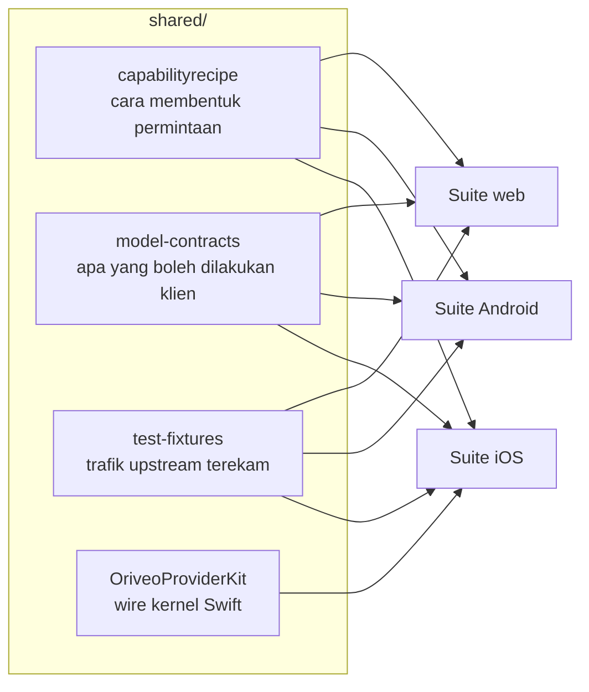

<div align="center">

# Kontrak bersama

**Satu definisi tentang cara berbicara dengan provider model, diuji oleh ketiga klien.**

<a href="../../LICENSE"></a>


<sub>

<a href="../../shared/README.md">English</a> ·
<a href="../ar/shared.md">العربية</a> ·
<a href="../de/shared.md">Deutsch</a> ·
<a href="../es/shared.md">Español</a> ·
<a href="../fr/shared.md">Français</a> ·
<a href="../hi/shared.md">हिन्दी</a> ·
**Indonesia** ·
<a href="../ja/shared.md">日本語</a> ·
<a href="../ko/shared.md">한국어</a> ·
<a href="../pt-BR/shared.md">Português</a> ·
<a href="../ru/shared.md">Русский</a> ·
<a href="../th/shared.md">ไทย</a> ·
<a href="../tr/shared.md">Türkçe</a> ·
<a href="../vi/shared.md">Tiếng Việt</a> ·
<a href="../zh-Hans/shared.md">简体中文</a> ·
<a href="../zh-Hant/shared.md">繁體中文</a>

</sub>

</div>

---

Tiga klien yang masing-masing mengimplementasikan "panggil provider" secara terpisah pasti akan
menyimpang. Mereka akan menyimpang diam-diam, ke arah mana pun yang terakhir kali diuji seseorang,
dan penyimpangan itu akan muncul sebagai bug yang bisa direproduksi di satu platform tapi tidak di
platform lain.

`shared/` adalah jawaban atas itu: perilakunya ditulis sekali sebagai data, dan suite pengujian
setiap klien menguji diri terhadap berkas yang sama. Keanehan yang hidup di dalam data itu
diperbaiki sekali. Keanehan yang hidup di dalam sebuah parser tertangkap oleh tiga suite pada saat
yang sama, alih-alih lolos di dua platform dan merusak yang ketiga.



## capabilityrecipe

Registri resep. Untuk provider, transport, dan capability tertentu — pencarian web, reasoning
effort, pembuatan gambar — ia menyebutkan persis JSON pointer mana yang harus ditulis ke dalam
permintaan yang keluar, dan bagaimana membaca jawabannya kembali.

Inilah yang membuat model yang rilis hari ini bisa dipakai tanpa pembaruan klien, dan inilah
alasannya tidak ada klien yang menebak sebuah capability dari nama model.
`capability_runtime.v1.json` membawa resep-resepnya sendiri;
`capability_result_definitions.v1.json` dan `capability_custom_controls.v2.json` mendefinisikan
bagaimana hasil dan kontrol yang dilihat pengguna ditafsirkan.

Setiap resep mendeklarasikan sebuah `executionKind` — `request_overlay`, `server_tool`,
`client_tool_loop`, `endpoint_route`, `model_route`, `external_connector`, `unavailable` — dan
compiler di setiap klien memvalidasi bahwa resep itu cocok dengan provider, capability, dan transport
sebelum menerapkannya, lalu menolak dengan alasan bernama alih-alih mengirim permintaan yang tidak
pernah ditinjau siapa pun. Daftarnya adalah himpunan tertutup: resep yang menyebut apa pun selain itu
ditolak, bukan ditebak.

## model-contracts

Fixture JSON yang mengunci perilaku lintas klien: seperti apa sebuah permintaan harus terlihat untuk
provider dan capability tertentu, bagaimana parameter generation diselesaikan dan bagaimana override
bertumpuk, state capability mana yang boleh ditampilkan sebuah klien, dan bagaimana katalog model
serta buktinya dikonsumsi.

Pengujian setiap klien memuat berkas-berkas ini secara langsung, jadi perubahan di sini adalah
perubahan pada ketiga klien sekaligus.

## test-fixtures

Data pengujian golden: trafik tool-call upstream yang terekam, routing relay, validasi formulir,
klasifikasi alamat lokal, skenario katalog dan portable config, snapshot model-facts dan
capability-evidence, serta skenario local engine.

Berkas `.sse` di bawah `recorded/` adalah **trafik upstream sungguhan yang direkam**, disimpan byte
demi byte sebagaimana ia tiba — hanya header response yang dibuang, dan body-nya tidak pernah membawa
key. Sisanya adalah fixture yang ditulis tangan untuk mengunci sebuah jalur parse tertentu. Bedanya
penting: mock yang ditulis tangan meng-encode apa yang Anda yakini dilakukan provider, sedangkan
rekaman meng-encode apa yang benar-benar ia lakukan, termasuk chunk cacat yang ia kirim pada Selasa
itu. Ketika sebuah perbaikan protokol provider butuh pengujian, utamakan rekaman.

`$comment` sebuah fixture, atau manifes `expected.json` di sebelahnya, menyebutkan apa yang dikunci
oleh entri-entri di sekitarnya. Bacalah itu sebelum menambahkan kasus baru.

## OriveoProviderKit

Sebuah package Swift yang memuat kernel wire protocol provider: perakitan baris SSE, parsing chunk
yang kompatibel dengan OpenAI, perakitan berbasis event untuk protokol Responses / Anthropic Messages
/ Gemini, penyusunan permintaan yang netral terhadap transport, kompilasi resep beserta penjaga
eksekusinya, encoding nama tool, redaksi kredensial, klasifikasi error upstream, parsing thinking tag,
ekstraksi path JSON saat streaming, kebijakan redirect `URLSession` yang eksplisit, dan profil
keanehan per vendor.

Cakupannya digambar sengaja sempit. **Masuk:** pengetahuan wire yang hanya bergantung pada
Foundation. **Keluar:** model aplikasi, UI, basis data, telemetri, pelokalan. Package ini tidak
bergantung pada apa pun di luar standard library dan Foundation, dan setiap klien Apple menyimpan
binding tipis di sekitarnya sehingga perilaku wire punya tepat satu implementasi.

Ia mengimplementasikan seluruh jalur permintaan-dan-streaming untuk platform Apple. Aplikasi iOS saat
ini menautkan sebagiannya — stream assembler, profil wire, codec nama tool, dan pengklasifikasi error
— dan tetap memakai request builder-nya sendiri; klien macOS yang sedang dikembangkan adalah konsumen
kedua, dan itulah alasan compiler resep serta request builder yang netral terhadap transport tinggal
di sini alih-alih di dalam satu aplikasi. Suite di bawah ini mencakup bagian yang dipakai bersama
oleh setiap konsumen: pemisahan SSE, perakitan kompatibel OpenAI, codec nama tool, dan kebijakan
redirect.

```bash
cd shared/OriveoProviderKit && swift build && swift test
```

- Platform: iOS 18+, macOS 15+ · `swift-tools-version: 6.1`
- `ProviderWireProfile` membawa sisa keanehan per vendor yang masih dibutuhkan satu assembler
  kompatibel OpenAI — di mana teks reasoning tiba, di mana hitungan cached token berada, apakah
  prompt token sudah termasuk cache hit. Ia menjelaskan *bagaimana byte tiba*, bukan *apa yang bisa
  dilakukan sebuah model*; yang terakhir itu tugas resep.

## Bekerja pada berkas-berkas ini

Perubahan di sini adalah perubahan pada setiap klien. Jalankan suite kontrak dari setiap klien yang
membaca berkas yang Anda sentuh, bukan hanya klien yang kebetulan sedang Anda kerjakan:

Dari akar repositori:

```bash
(cd web && npm run test:run)
(cd shared/OriveoProviderKit && swift test)
# plus the iOS and Android suites — see their READMEs
```

Suite iOS menemukan direktori ini dengan menelusuri ke atas dari berkas pengujian sampai menemukan
`shared/`; suite Android me-resolve `../../shared` dari modul Gradle; suite web me-resolve-nya
relatif terhadap workspace. Karena itu semuanya membutuhkan checkout penuh dari repositori.

## Lisensi

[AGPL-3.0-or-later](../../LICENSE).
