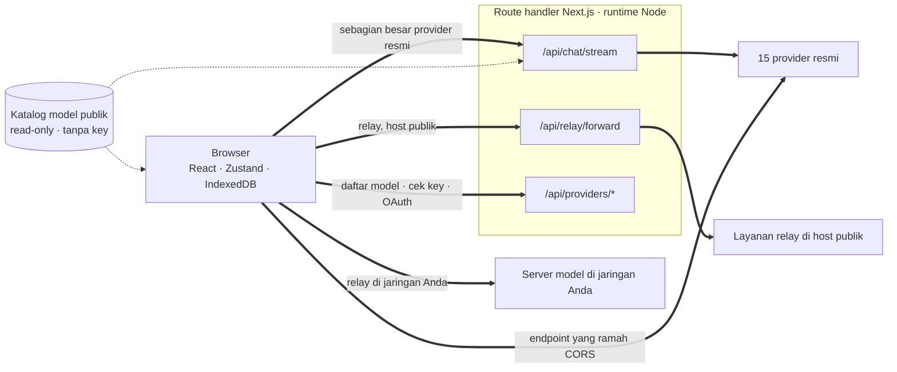
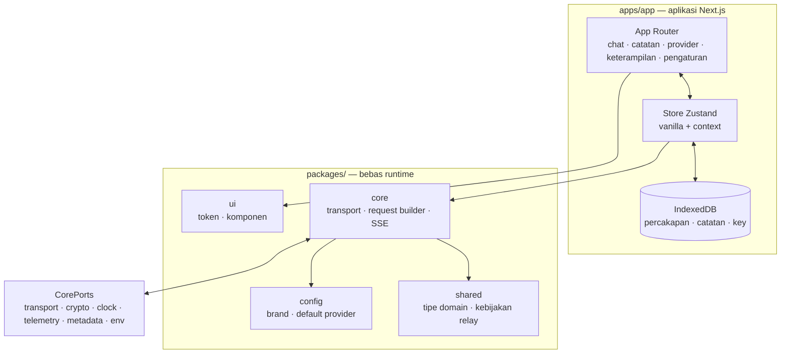

<div align="center">

# Oriveo untuk Web

**Klien chat Next.js untuk model AI yang sudah Anda bayar.**

<a href="../../LICENSE"></a>


<sub>

<a href="../../web/README.md">English</a> ·
<a href="../ar/web.md">العربية</a> ·
<a href="../de/web.md">Deutsch</a> ·
<a href="../es/web.md">Español</a> ·
<a href="../fr/web.md">Français</a> ·
<a href="../hi/web.md">हिन्दी</a> ·
**Indonesia** ·
<a href="../ja/web.md">日本語</a> ·
<a href="../ko/web.md">한국어</a> ·
<a href="../pt-BR/web.md">Português</a> ·
<a href="../ru/web.md">Русский</a> ·
<a href="../th/web.md">ไทย</a> ·
<a href="../tr/web.md">Türkçe</a> ·
<a href="../vi/web.md">Tiếng Việt</a> ·
<a href="../zh-Hans/web.md">简体中文</a> ·
<a href="../zh-Hant/web.md">繁體中文</a>

</sub>

</div>

---

Klien web Oriveo adalah aplikasi chat AI bring-your-own-key yang dibangun dengan Next.js.
Percakapan, catatan, folder, keterampilan, dan key provider Anda tinggal di penyimpanan milik browser
sendiri. Tidak ada akun dan tidak ada proses masuk.

Ini bagian dari [Oriveo Community Edition](README.md) — tiga klien yang berbagi satu definisi
tentang cara berbicara dengan provider model.

## Mulai cepat

Membutuhkan Node 22.22.2 atau 22.x yang lebih baru (lihat [`.nvmrc`](../../web/.nvmrc)); field
`engines` berisi `^22.22.2`, jadi Node 23+ tidak didukung. npm sudah ikut di dalamnya; tidak perlu
package manager lain.

```bash
npm install
npm run dev:app     # http://localhost:3001
```

Layar pertama meminta sebuah API key provider. Tidak ada syarat lain untuk mulai mengobrol.

## Bagaimana sebuah permintaan benar-benar berjalan

Inilah bagian yang layak dibaca sebelum yang lain, karena klien web adalah satu-satunya tempat di
mana sebuah permintaan biasanya **tidak** langsung dari klien ke provider.



**Mengapa jalan memutar ini ada.** Sebagian besar API provider tidak mengirim header CORS, jadi
browser tidak bisa memanggil `api.openai.com` dan kawan-kawannya secara langsung — preflight-nya
gagal. Setiap klien BYOK berbasis browser harus menyelesaikan ini dengan cara tertentu; yang ini
meneruskannya lewat route handler Next.js yang berjalan di runtime Node. Saat Anda menjalankan
`npm run dev:app`, handler-handler itu ada di mesin Anda sendiri. Saat Anda men-deploy aplikasinya
ke suatu tempat, mereka ada di mesin tujuan deploy Anda.

Handler-nya bukan cuma satu: streaming chat, penerus relay, pembuatan gambar, daftar model, validasi
key, serta pertukaran device-login Grok dan ChatGPT seluruhnya berjumlah dua belas berkas route.
Validasi key penting di sini — ia mengirimkan key ke server Anda sendiri, yang lalu melakukan
probing ke provider dengan key itu.

Segelintir endpoint memang *mengizinkan* browser, dan yang seperti itu dipanggil langsung tanpa
server di tengahnya: endpoint Tiongkok milik Kimi (`api.moonshot.cn`) untuk chat, dan endpoint saldo
OpenRouter, SiliconFlow, DeepSeek, dan Kimi.

**Apa yang dilakukan dan tidak dilakukan handler itu.** Ia memvalidasi bentuk permintaan dan
membatasi ukurannya, menerapkan rate limit per IP pada trafik chat dan relay, menolak URL yang
me-resolve ke alamat privat atau link-local, membangun body khusus provider, dan mengalirkan
response kembali. Tidak ada basis data, tidak ada penulisan ke filesystem, dan tidak ada pencatatan
body permintaan di mana pun di bawah `app/api` — key Anda dan pesan Anda diteruskan lalu dilupakan.
Karena route-nya adalah satu proses yang dipakai bersama oleh setiap pengunjung, sebuah pengujian
khusus (`server-never-learns.test.ts`) mengunci bahwa ia tidak pernah menyimpan parameter yang
ditolak milik satu pengguna lalu menerapkannya pada permintaan orang lain.

Penerus relay tambahan juga mem-pin DNS ke alamat yang sudah ia resolve, membatasi ukuran response,
membatasi setiap timeout, membatasi redirect ke origin yang sama, dan menolak meneruskan header
hop-by-hop.

**Endpoint lokal melewatinya sama sekali.** Sebuah relay pada alamat privat, nama `.local`,
`localhost`, atau yang dikonfigurasi dalam mode local-HTTP atau private-VPN diambil **langsung dari
browser**, dengan `credentials: 'omit'` dan `targetAddressSpace: 'local'`. Trafik LAN Anda tidak
keluar dari jaringan Anda, dan juga tidak melewati server aplikasi.

## Arsitektur



`packages/core` menyimpan setiap byte pengetahuan tentang protokol provider dan dengan sengaja
dijaga bebas dari global milik browser — eslint melarang `window`, `document`, `fetch`, `crypto`,
`localStorage`, `sessionStorage`, dan `indexedDB` di dalamnya.
Apa pun yang ia butuhkan dari lingkungannya datang lewat `CorePorts`. Itulah yang membuat kode yang
sama bisa berjalan di browser, di route handler Node, dan di pengujian tanpa DOM.

Dukungan provider adalah dua sumbu independen. `providerKind` memilih sebuah **request builder**
(seperti apa bentuk body untuk vendor ini). `model.transport` memilih sebuah **strategi transport**
(wire protocol mana yang dipakai) dari dua belas pilihan, dan itu ditentukan per model dari katalog,
bukan per provider — sehingga dua model di balik key yang sama bisa berbeda. Sebuah strategi
mengimplementasikan tepat tiga metode: `buildRequestBody`, `parseStreamChunk`, `parseError`.

## Workspace

```
apps/app/               the Next.js application
packages/core/          provider protocols: transports, request builders, SSE parsing
packages/shared/        domain types, relay policy, helpers
packages/ui/            design tokens and shared components
packages/config/        brand and provider defaults
```

Styling memakai CSS Modules di atas satu lembar token custom property di `packages/ui` — tidak ada
framework berbasis utility class.


Ada satu jahitan lagi yang sejenis. `apps/app/lib/core/sync-port.ts` mendeklarasikan antarmuka yang
akan diimplementasikan oleh sebuah backend sinkronisasi, dan setiap tempat pemanggilan mencapainya
lewat optional chaining. Tidak ada yang memasang backend semacam itu, jadi `getSyncAdapter()`
mengembalikan `null` dan IndexedDB tetap menjadi satu-satunya salinan data Anda — dan itu tepatnya
arti dari "tanpa akun, tanpa masuk" dalam praktik.

## Penyimpanan

Semuanya per partisi, di-key oleh sebuah id aktif yang bernilai bawaan `guest`.

| Apa | Di mana |
|---|---|
| Percakapan, pesan, folder, catatan, provider | IndexedDB `oriveo--{id}`, 8 object store |
| Snapshot katalog model (~3 MB) dan model facts | Blob store IndexedDB, sengaja bukan localStorage |
| Preferensi dan tabel model control | `localStorage`, dengan `safeLocalStorage` membungkus jalur-jalur yang pernah kedapatan melempar error |
| Gambar yang dihasilkan dan yang dilampirkan | Basis data IndexedDB terpisah |

Dua detail yang lahir dari kerusakan nyata, bukan dari selera. Snapshot katalog tinggal di IndexedDB
karena pada ~3 MB ia menghabiskan sebagian besar kuota localStorage 5 MB milik sebuah origin
browser. Dan setiap akses localStorage melewati `safeLocalStorage`, karena *getter*
`window.localStorage` itu sendiri melempar `SecurityError` ketika browser disetel memblokir data
situs — pembacaan telanjang menjatuhkan halaman sebelum blok `try` Anda sempat berjalan.

> [!IMPORTANT]
> Di web, key provider disimpan di IndexedDB **tanpa enkripsi** — model yang sama yang umumnya
> dipakai klien BYOK berbasis browser, karena browser tidak punya tempat yang lebih baik untuk
> menaruhnya. Untuk jaminan terkuat, gunakan klien iOS atau Android, di mana keychain atau keystore
> sistem mengenkripsinya. Arsip cadangan itu perkara lain: arsip dienkripsi dengan AES-256-GCM dan
> PBKDF2-SHA-256 pada 600.000 iterasi ketika Anda memilih kata sandi.

## Katalog model

Model apa saja yang ditawarkan setiap provider, dan apa yang didukung masing-masing, berasal dari
katalog read-only yang diambil saat startup. Tepat dua endpoint yang diminta, keduanya `GET`,
keduanya ETag-conditional, dan tidak satu pun membawa API key, percakapan, atau identifier pengguna:

```
GET {backend}/api/metadata?view=lean
GET {backend}/api/metadata/model-facts
```

Backend bawaannya adalah `https://api.oriveoai.com`. Arahkan `NEXT_PUBLIC_BACKEND_URL` ke host Anda
sendiri untuk menyajikannya sendiri. Response di-cache selama 24 jam di IndexedDB dan direvalidasi
dengan `If-None-Match`; ketika katalog tidak terjangkau aplikasi tetap bekerja dari salinan
cache-nya.

## Perintah

Jalankan perintah berikut dari direktori ini.

| Perintah | Fungsinya |
|---|---|
| `npm run dev:app` | server pengembangan di port 3001 |
| `npm run build:app` | build produksi |
| `npm run typecheck` | `tsc --noEmit` di seluruh workspace |
| `npm run test:run` | vitest, satu kali jalan |
| `npm run test` | vitest dalam mode watch, satu watcher per workspace — lebih baik jalankan di dalam satu workspace |
| `npm run lint` | eslint atas `apps/` dan `packages/` |

`npm start --workspace @oriveo/app` menyajikan build yang sudah selesai di port 3001.

Untuk menjalankan satu berkas pengujian, lakukan dari workspace pemiliknya, karena beberapa suite
me-resolve fixture-nya relatif terhadap direktori kerja:

```bash
cd apps/app && npx vitest run lib/core/chat/__tests__/stream-options.test.ts
```

## Konfigurasi

Semuanya opsional. Salin [`.env.example`](../../web/.env.example) menjadi `.env.local` dan setel
hanya apa yang Anda butuhkan; setiap variabel yang dibaca kode terdaftar dan dijelaskan di sana.

### Pelaporan error

Aplikasi membundel SDK Sentry. Ia **tidak aktif tanpa DSN** — tanpa `NEXT_PUBLIC_SENTRY_DSN` berarti
tidak ada transport, tidak ada event, tidak ada apa pun yang terkirim ke mana pun, dan itulah
kondisi bawaan untuk build dari repositori ini. Setel satu DSN dan Anda mendapat pelaporan error,
performance tracing 10%, serta session replay 1%, dengan hook yang membuang key provider, endpoint,
dan isi pesan sebelum sebuah event meninggalkan browser. Ini ada supaya sebuah deployment yang
memang menginginkan pelaporan error bisa memilikinya, bukan karena build ini menelepon pulang.

## Hosting sendiri

Tidak ada Dockerfile dan tidak ada skrip deploy; aplikasi ini adalah server Next.js biasa.

```bash
npm ci
npm run build:app
npm start --workspace @oriveo/app     # 127.0.0.1:3001
```

Ada tiga hal yang perlu diketahui sebelum menaruhnya di belakang reverse proxy.

`npm start` mengikat ke `127.0.0.1`, jadi proxy harus berjalan di host yang sama, atau alamat bind-nya
harus diubah.

Setel `NEXT_PUBLIC_APP_URL` ke origin tempat Anda benar-benar menyajikannya. Tautan canonical,
sitemap, dan gambar pratinjau untuk media sosial semuanya di-resolve terhadapnya, dan nilai
bawaannya adalah port pengembangan.

Setel `TRUSTED_PROXY_HOP_COUNT` ke jumlah proxy yang berada di depan aplikasi. Rate limiter chat
membaca alamat klien sebanyak hop itu dari *kanan* `X-Forwarded-For` — jangan pernah dari kiri, yang
dikendalikan klien dan bisa dipalsukan. Nilai bawaan 1 benar untuk satu proxy; kalau dibiarkan
terlalu rendah di belakang dua proxy, semua pengunjung berbagi satu bucket rate limit, karena alamat
yang terbaca adalah alamat proxy dalam Anda sendiri.

Aplikasi sudah mengirim HSTS, `X-Content-Type-Options`, `X-Frame-Options`, `Referrer-Policy`,
`Permissions-Policy`, dan `Cross-Origin-Opener-Policy` dari `next.config.ts`, jadi proxy tidak perlu
menambahkannya. Terminasi TLS dan batas ukuran permintaan adalah tugas proxy.

Satu hal terakhir yang sebaiknya diputuskan secara sadar: siapa pun yang bisa menjangkau deployment
itu bisa memakai route handler-nya untuk memanggil provider dengan key yang ia sediakan sendiri.
Handler tidak memegang key milik sendiri dan tidak menyimpan apa pun, tapi mereka adalah jalur HTTP
keluar, jadi deployment yang bisa dijangkau publik sebaiknya berada di belakang kontrol akses yang
sama seperti yang Anda berikan ke perkakas internal lain.

## Dependensi

| Paket | Versi | Dipakai untuk |
|---|---|---|
| [Next.js](https://nextjs.org) | 16.3.3 | App Router, route handler, build |
| [React](https://react.dev) | 19.2.8 | UI |
| [vitest](https://vitest.dev) | 4.1.11 | test runner |
| [zustand](https://zustand.docs.pmnd.rs) | 5.0.15 | state di sisi klien |
| [next-intl](https://next-intl.dev) | 4.14.1 | pelokalan |
| [@sentry/nextjs](https://docs.sentry.io/platforms/javascript/guides/nextjs/) | 10.72.0 | pelaporan error, tidak aktif tanpa DSN |

Versi persis setiap dependensi dipatok di `package-lock.json`.

## Pengujian

Sekitar 5.600 pengujian di 460 berkas, dengan vitest. Cakupan paling tebal ada di tempat kesalahan
paling mahal: bentuk permintaan per provider, perilaku transport per wire protocol, parsing chunk
SSE dan proxy, parsing usage dan biaya, klasifikasi error, probing relay dan mode keamanan, penjaga
SSRF, eksekusi resep capability, caching katalog dan invalidasi versi kontrak, persistensi
IndexedDB, partisi penyimpanan, round-trip cadangan, dan route handler itu sendiri.

> [!IMPORTANT]
> Lebih dari tiga puluh suite me-resolve fixture kontrak di bawah `shared/` relatif terhadap direktori
> kerja, jadi **pengujian hanya lolos pada checkout penuh**, dijalankan dari workspace pemiliknya —
> menyalin `web/` sendirian tidak akan berhasil.

## Pelokalan

Enam belas locale di `apps/app/messages`, masing-masing sekitar 1.800 key, dengan bahasa Inggris
sebagai sumber. Sebuah pengujian menelusuri direktori itu dan gagal jika himpunan key suatu locale
berbeda dari bahasa Inggris, jadi menambahkan berkas locale otomatis mendaftarkannya. Bahasa Arab
mendapat tata letak right-to-left penuh. Pemilihan locale mengikuti parameter `?locale=` yang
eksplisit, lalu cookie, lalu `Accept-Language`.

## Kontribusi

Lihat [CONTRIBUTING.md](../../CONTRIBUTING.md). `packages/core` bersifat transport-first: menambah
provider biasanya berarti satu request builder dan satu response adapter, bukan klien baru. Untuk
perbaikan protokol provider, lebih baik pakai fixture terekam di bawah `shared/test-fixtures`
daripada mock yang ditulis tangan.

## Lisensi

[AGPL-3.0-or-later](../../LICENSE).
