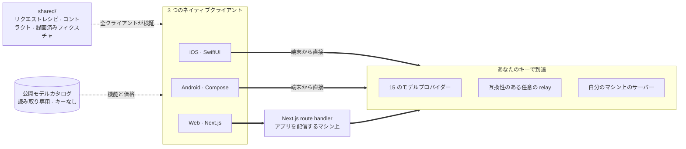

<div align="center">


# Oriveo

**すべてのモデルを、ひとつのアプリで。**

iOS・Android・Web 向けの、オープンソースな BYOK（自分の API キーを使う）AI チャットです。
アカウントもサブスクリプションも不要で、リクエストの経路に私たちのサービスは入りません。

<a href="../../LICENSE"></a>
<a href="ios.md"></a>
<a href="android.md"></a>
<a href="web.md"></a>


<a href="https://oriveoai.com">ウェブサイト</a> &nbsp;·&nbsp;
<a href="#はじめかた">はじめかた</a> &nbsp;·&nbsp;
<a href="#アーキテクチャ">アーキテクチャ</a> &nbsp;·&nbsp;
<a href="#community-edition-と-oriveo">エディション</a> &nbsp;·&nbsp;
<a href="#よくある質問">よくある質問</a> &nbsp;·&nbsp;
<a href="../../CONTRIBUTING.md">コントリビュート</a>

<sub>

<a href="../../README.md">English</a> ·
<a href="../ar/README.md">العربية</a> ·
<a href="../de/README.md">Deutsch</a> ·
<a href="../es/README.md">Español</a> ·
<a href="../fr/README.md">Français</a> ·
<a href="../hi/README.md">हिन्दी</a> ·
<a href="../id/README.md">Indonesia</a> ·
**日本語** ·
<a href="../ko/README.md">한국어</a> ·
<a href="../pt-BR/README.md">Português</a> ·
<a href="../ru/README.md">Русский</a> ·
<a href="../th/README.md">ไทย</a> ·
<a href="../tr/README.md">Türkçe</a> ·
<a href="../vi/README.md">Tiếng Việt</a> ·
<a href="../zh-Hans/README.md">简体中文</a> ·
<a href="../zh-Hant/README.md">繁體中文</a>

</sub>

</div>

---

## Oriveo とは

Oriveo Community Edition は、iOS・Android・Web 向けの BYOK（bring-your-own-key）AI チャット
クライアントです。すでにお持ちの API キーを登録すると、クライアントがそのキーでプロバイダーと直接
やり取りします。Oriveo のアカウントもサブスクリプションもなく、こちらへ何かを報告してくるものも
ありません。

**15 のモデルプロバイダー**（OpenAI、Anthropic、Google Gemini、OpenRouter、DeepSeek、Grok、
Mistral、Groq、Together AI、Fireworks AI、MiniMax、Z.ai、Qwen、Kimi（Moonshot）、SiliconFlow）に
ネイティブ対応しており、さらに **OpenAI・Anthropic・Gemini のいずれかと互換のエンドポイント**であれば
何でも指定できます。手元のマシンで動かしている llama.cpp、Ollama、LM Studio、vLLM も含みます。

| | |
|---|---|
| **プロバイダー** | 15 種類を内蔵、加えてカスタム relay エンドポイントとローカルのモデルサーバー |
| **クライアント** | iOS（SwiftUI）· Android（Jetpack Compose）· Web（Next.js） |
| **UI 言語** | 16 |
| **アカウントの要否** | 不要 |
| **自分自身のために行う通信** | 1 種類だけ、リクエスト 2 本。読み取り専用のモデルカタログ取得で、キーも識別子も付きません |
| **ライセンス** | AGPL-3.0-or-later |

## なぜ作ったのか

あなたがお金を払っているモデルを、誰かが計測したり、記録したり、上乗せしたりできてよいはずが
ありません。

- **あなたのキー、あなたの請求。** 支払うのはプロバイダーの定価です。上乗せも、二重計測も、再販も
  ありません。
- **既定でローカル。** 会話、ノート、フォルダ、Skills、添付ファイルは端末上に保存されます。いつでも
  ファイルに書き出せますし、アクセスを失うようなクラウド上のコピーは存在しません。
- **ひとつの挙動を、3 つのクライアントで。** あるプロバイダー・トランスポート・機能に対してリクエスト
  をどう組み立てるかは [`shared/`](shared.md) に一度だけ書き下され、3 つのクライアントすべてが同じ
  JSON フィクスチャに対してアサーションします。そのデータの中にある癖なら修正は 1 回で済み、パーサー
  の中にある癖なら 3 つのテストスイートが同時に捕まえます。
- **アプリが行うたった 1 本のリクエスト。** 今日リリースされたモデルがアプリの更新なしで使えるよう、
  アプリは公開のモデルカタログを取得します。これは読み取り専用で、キーも識別子も付いておらず、
  自分のホストに向けることもできます。

## 機能

- **チャット** — ストリーミング、推論ブロック、引用、添付ファイル（画像、PDF、Office、EPUB、HTML、
  プレーンテキスト）、選択範囲の引用、リトライ、再生成、回答が中断された後の続きの生成
- **プロバイダー** — 15 種類を内蔵し、それぞれ自分のキーを使用。プロバイダーごとにエンドポイント・
  モデル・パラメーターを上書き可能
- **Relay** — OpenAI・Anthropic・Gemini 互換のエンドポイントなら何でも。LAN 内のものも含みます
- **ローカルのモデルサーバー** — llama.cpp、Ollama、LM Studio、vLLM。iOS と Android は mDNS で
  ローカルネットワーク上のものを見つけます
- **サブスクリプションでのサインイン** — API キーの代わりに、すでに契約している Codex や Grok の
  サブスクリプションを利用
- **Skills** — 専用のモデル・パラメーター・参考ドキュメントを持たせられる、再利用可能なシステム
  プロンプト
- **ノートとフォルダ** — 返答をノートとして保存、会話の整理、全文検索
- **クロスチェック** — 同じ質問を 2 つ目のモデルにも投げ、両方の回答を並べて残す
- **コスト** — メッセージごと・プロバイダーごとの支出を、各レスポンスが実際に報告した内容から端末上で
  計算。キャッシュ割引の階層も考慮します
- **画像生成** — プロバイダーが対応している場合
- **バックアップ** — すべてをファイルに書き出し。任意で自分が決めたパスワードによる暗号化も可能
- **16 の UI 言語**。アラビア語には完全な右から左のレイアウトを用意

## Community Edition と Oriveo

このリポジトリは **Oriveo Community Edition** で、[AGPL-3.0-or-later](../../LICENSE) の下で提供
されます。App Store と Google Play のアプリ、およびホスティングされた Web アプリは **Oriveo** です。
こちらは同じクライアントから作られ、その上にアカウント層を載せた別のプロプライエタリ製品です。

| | Community Edition | Oriveo |
|---|---|---|
| ソース | このリポジトリ、AGPL-3.0-or-later | プロプライエタリ |
| 自分のプロバイダーキーでのチャット | あり | あり |
| Relay とローカルのモデルサーバー | あり | あり |
| ノート、フォルダ、Skills、添付ファイル | あり | あり |
| 端末上でのコスト集計 | あり | あり |
| アカウント | なし | Oriveo アカウント |
| ストレージ | 端末上。書き出しと復元は手動 | ローカルファースト、加えて端末間のクラウド同期 |
| 利用状況の分析と予算アラート | — | あり |
| Oriveo が費用を負担するモデル | — | あり |
| アナリティクスとクラッシュレポート | 既定でオフ — Web のバンドルには Sentry が含まれますが、DSN がなければ何も送りません | あり |

Community Edition のビルドは識別子のプレフィックスに `ai.oriveo.community` を使うため、ストア版と
並べてインストールしても、キーチェーンやローカルデータを共有することはありません。このエディション
が受け入れるもの・受け入れないものは [COMMUNITY.md](../../COMMUNITY.md) に書かれています。

**製品版の Oriveo:**
[iPhone と iPad](https://apps.apple.com/app/oriveo/id6775370458) &nbsp;·&nbsp;
[Android](https://play.google.com/store/apps/details?id=com.kenny.oriveo) &nbsp;·&nbsp;
[Web](https://app.oriveoai.com) &nbsp;·&nbsp;
[oriveoai.com](https://oriveoai.com)

## プロバイダー

以下のプロバイダーはすべて、自分で発行したキーで利用します。

| プロバイダー | キーの取得先 |
|---|---|
| OpenAI | [platform.openai.com](https://platform.openai.com/api-keys) |
| Anthropic | [console.anthropic.com](https://console.anthropic.com/settings/keys) |
| Google Gemini | [aistudio.google.com](https://aistudio.google.com/apikey) |
| OpenRouter | [openrouter.ai](https://openrouter.ai/keys) |
| DeepSeek | [platform.deepseek.com](https://platform.deepseek.com/api_keys) |
| Grok | [console.x.ai](https://console.x.ai/) |
| Mistral | [console.mistral.ai](https://console.mistral.ai/api-keys) |
| Groq | [console.groq.com](https://console.groq.com/keys) |
| Together AI | [api.together.xyz](https://api.together.xyz/settings/api-keys) |
| Fireworks AI | [fireworks.ai](https://fireworks.ai/api-keys) |
| MiniMax | [platform.minimax.io](https://platform.minimax.io/docs/guides/quickstart-preparation) |
| Z.ai | [open.bigmodel.cn](https://open.bigmodel.cn/usercenter/apikeys) |
| Qwen | [bailian.console.alibabacloud.com](https://bailian.console.alibabacloud.com/?apiKey=1#/api-key) |
| Kimi (Moonshot) | [platform.kimi.ai](https://platform.kimi.ai/console/api-keys) |
| SiliconFlow | [cloud.siliconflow.cn](https://cloud.siliconflow.cn/account/ak) |
| **Relay** | OpenAI・Anthropic・Gemini 互換のエンドポイントなら何でも。自分のマシン上のものも含みます |

## アーキテクチャ

3 つのネイティブクライアントと、モデルプロバイダーとの話し方に関するひとつの定義。



各クライアントは自前の UI・ストレージ・ナビゲーションを持ち、共有コントラクトと接するのはただ 1 か所
だけです。すなわち、*このモデルの、この機能*を HTTP リクエストに変換する層です。

知っておく価値のある非対称性は Web クライアントにひとつだけあります。ほとんどのプロバイダーの API は
CORS ヘッダーを返さないため、ブラウザから直接呼び出せません。そうしたリクエストは、アプリを配信して
いるマシン上で動く Next.js の route handler を経由します。ローカルで動かしているなら、それはあなた
自身のマシンです。ブラウザからの呼び出しを許可している少数のエンドポイント（Kimi の中国向け
エンドポイント、いくつかのプロバイダーの残高エンドポイント）と、自分のネットワーク上の relay は直接
呼び出されます。iOS と Android のクライアントにはこの制約がなく、常にプロバイダーへ直接つなぎます。

**各クライアントのアーキテクチャ:**

| | スタック | README |
|---|---|---|
| **iOS** | SwiftUI と UIKit のメッセージ一覧、GRDB | [ios.md](ios.md) |
| **Android** | Jetpack Compose、Room、Koin、Ktor/OkHttp | [android.md](android.md) |
| **Web** | Next.js App Router、React、Zustand、TypeScript | [web.md](web.md) |
| **Shared** | コントラクト、録画済みフィクスチャ、Swift 製の通信カーネル | [shared.md](shared.md) |

## はじめかた

ここにビルド済みのバイナリはありません。APK も `.ipa` も、リリースもありません。Community Edition は
自分でビルドするソースであり、ストアのアプリはもう一方の製品です。動くアプリに最短でたどり着けるのは
Web クライアントです。

<details open>
<summary><b>Web</b> — いちばん手早く試せる方法</summary>

<br>

Node 22 が必要です（[`web/.nvmrc`](../../web/.nvmrc) を参照）。

```bash
cd web
npm install
npm run dev:app        # http://localhost:3001
```

最初の画面でプロバイダーの API キーを尋ねられます。それ以外に必要なものはありません。
コマンドと設定の詳細は [web.md](web.md) にあります。

</details>

<details>
<summary><b>iOS</b> — 自分の iPhone でビルドして実行する</summary>

<br>

Xcode 26 が入った Mac と、iOS 18 以降の実機が必要です。無料の Apple Developer アカウントで十分です
— このアプリは有料の capability を一切使いません。

1. `ios/Oriveo/Oriveo.xcodeproj` を開く
2. `Oriveo` スキームを選ぶ
3. Signing &amp; Capabilities で自分の Team を選ぶ
4. 実行する

Xcode がプロジェクトを開けない場合の対処も含む詳しい手順は [ios.md](ios.md) にあります。

</details>

<details>
<summary><b>Android</b> — APK をビルドする</summary>

<br>

JDK 21 と Android SDK が必要です。ビルドには AGP 9.3、Gradle 9.5、Kotlin 2.3 を使うため、
Android Studio はこれらを同期できるリリースである必要があります。コマンドラインからなら JDK と SDK
だけで足ります。

```bash
cd android
./gradlew :app:assembleDebug
```

モデルカタログを自分のホストから配信する方法は [android.md](android.md) にあります。

</details>

## プライバシー

- **プロバイダーのキー**は、iOS では Keychain に、Android では Android Keystore が保持する鍵で
  保護された `EncryptedSharedPreferences` に保存されます。ブラウザには相当する仕組みがないため、
  Web では暗号化されないまま IndexedDB に置かれます。これはブラウザベースの BYOK クライアントが
  一般に採る方式です。最も強い保証が欲しい場合は iOS か Android のクライアントをお使いください。
- **会話、ノート、フォルダ、Skills、添付ファイル**は端末上に保存されます。どこにもアップロードされ
  ません。
- **アカウントなし、こちらへ報告してくるものもなし。** サインインする対象はありません。Web の
  バンドルには Sentry が含まれますが、自分で DSN を設定しない限り何も送りません。
- **iOS と Android では、チャットのリクエストは端末からプロバイダーへ直接送られます。** Web では、
  ほとんどのプロバイダーの API がブラウザからの直接呼び出しを許可していないため、その大半はアプリを
  配信している Next.js サーバーを経由します。そのサーバーはキーもメッセージも保存しませんし、
  ローカルで動かしているならそれはあなた自身のマシンです。
- **私たち自身のリクエストは 1 本だけ:** 読み取り専用のモデルカタログの取得です。キーも、会話も、
  識別子も付きません。おかげで今日リリースされたモデルが新しいビルドなしで使えます。自分で配信したい
  場合は、自分のホストに向けてください。

## よくある質問

<details>
<summary><b>BYOK とは何ですか？</b></summary>

<br>

Bring your own key、つまり「自分のキーを持ち込む」ことです。OpenAI、Anthropic、Google などの
プロバイダーのコンソールで API キーを発行し、それを Oriveo に貼り付けます。リクエストはそのプロバイ
ダーから定価で請求されます。Oriveo はクライアントであって、再販業者ではなく、手数料も取りません。

</details>

<details>
<summary><b>会話は Oriveo のサーバーを経由しますか？</b></summary>

<br>

しません。iOS と Android では、クライアントがプロバイダーのエンドポイントを直接呼び出します。Web で
は、ほとんどのプロバイダーの API がブラウザからの直接呼び出しを拒むため、リクエストの大半はアプリを
配信している Next.js サーバーを経由します。ローカルで動かしていれば、それはあなた自身のマシンです。
呼び出しを許可している少数のエンドポイントは直接呼び出されます。どちらの経路にも Oriveo が運用する
サーバーは関与しません。Oriveo 自身が行う唯一のリクエストは、公開モデルカタログの読み取り専用の
取得で、キーも会話も識別子も含みません。

</details>

<details>
<summary><b>自分のマシンで動かしているモデルは使えますか？</b></summary>

<br>

使えます。OpenAI・Anthropic・Gemini 互換のサーバー（llama.cpp、Ollama、LM Studio、vLLM、あるいは
それらのプロトコルを話すものなら何でも）を指す Relay 接続を追加してください。iOS と Android の
クライアントは、そうしたサーバーを mDNS でローカルネットワーク上から検出できます。Web クライアントは
各エンジンの既定のアドレスを提示し、そこに疎通確認を行います。ローカルの HTTP は認証情報を一切使わず、
あなたのネットワークから出ることもありません。

</details>

<details>
<summary><b>App Store のアプリとは何が違いますか？</b></summary>

<br>

ストアのアプリは Oriveo で、アカウント、端末間のクラウド同期、利用状況の分析、そして Oriveo が費用を
負担するモデルを備えたプロプライエタリ製品です。Community Edition は同じ 3 つのクライアントから
それらを取り除いたもので、アカウントも、同期サービスも、課金も、こちらへ報告してくるものもありません。
詳しい比較は [Community Edition と Oriveo](#community-edition-と-oriveo) をご覧ください。

</details>

<details>
<summary><b>macOS 版クライアントはありますか？</b></summary>

<br>

このリポジトリにはありません。当面は、Web クライアントがどのブラウザでもデスクトップアプリとして
十分に使えますし、iOS 版のビルドもたいていは Apple シリコンの Mac で動かせます。

</details>

<details>
<summary><b>UI はどの言語に対応していますか？</b></summary>

<br>

16 言語です。アラビア語、ドイツ語、英語、スペイン語、フランス語、ヒンディー語、インドネシア語、
日本語、韓国語、ブラジルポルトガル語、ロシア語、タイ語、トルコ語、ベトナム語、簡体字中国語、
繁体字中国語。アラビア語には完全な右から左のレイアウトが用意されています。

</details>

## リポジトリ構成

```
ios/           iOS client (SwiftUI)
android/       Android client (Jetpack Compose)
web/           Web client (Next.js)
macos/         Reserved for a macOS client
shared/        Cross-client contracts, recorded fixtures, and the Swift wire kernel
readme_i18n/   These READMEs in fifteen more languages
docs/assets/   Images used by the READMEs
```

## コントリビュート

バグ報告と Pull Request を歓迎します。[CONTRIBUTING.md](../../CONTRIBUTING.md) には各クライアントの
ビルド方法と、良い Pull Request がどういうものかが書かれています。[COMMUNITY.md](../../COMMUNITY.md)
には、このエディションが何のためにあるのか、そしてどれだけよく書かれていても受け入れられない数少ない
種類の変更について書かれています。

セキュリティ上の問題を見つけましたか？公開の issue は立てないでください。非公開で報告する方法と、
このプロジェクトが何を脆弱性として扱い何を扱わないかは [SECURITY.md](../../SECURITY.md) に書かれて
います。参加するすべての人に[行動規範](../../CODE_OF_CONDUCT.md)の遵守をお願いしています。

## ライセンス

[AGPL-3.0-or-later](../../LICENSE)。コントリビュートも同じライセンスの下で受け入れます。
