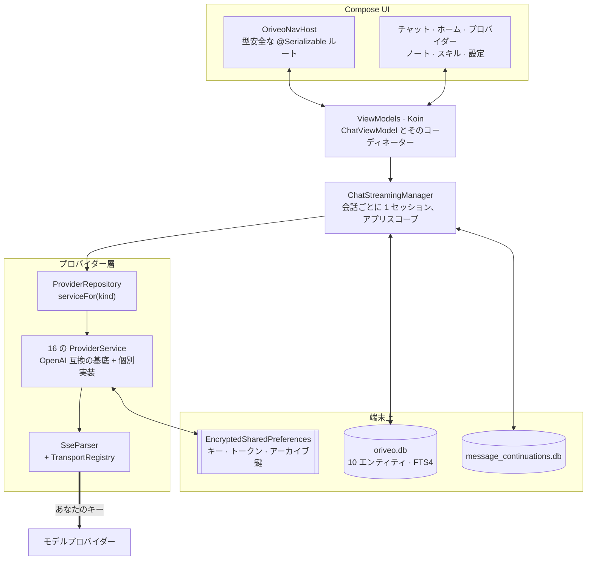

<div align="center">

# Oriveo for Android

**すでにお金を払っている AI モデルのための、ネイティブな Jetpack Compose チャットクライアント。**

<a href="../../LICENSE"></a>


<sub>

<a href="../../android/README.md">English</a> ·
<a href="../ar/android.md">العربية</a> ·
<a href="../de/android.md">Deutsch</a> ·
<a href="../es/android.md">Español</a> ·
<a href="../fr/android.md">Français</a> ·
<a href="../hi/android.md">हिन्दी</a> ·
<a href="../id/android.md">Indonesia</a> ·
**日本語** ·
<a href="../ko/android.md">한국어</a> ·
<a href="../pt-BR/android.md">Português</a> ·
<a href="../ru/android.md">Русский</a> ·
<a href="../th/android.md">ไทย</a> ·
<a href="../tr/android.md">Türkçe</a> ·
<a href="../vi/android.md">Tiếng Việt</a> ·
<a href="../zh-Hans/android.md">简体中文</a> ·
<a href="../zh-Hant/android.md">繁體中文</a>

</sub>

</div>

---

Oriveo の Android クライアントは BYOK の AI チャットアプリです。すでにお持ちの API キーを登録すると、
アプリが各プロバイダーと端末から直接やり取りします。会話、ノート、フォルダ、スキル は Room で端末上に
保存され、API キーは Android Keystore が保持する鍵で暗号化されます。アカウントもサインインも
ありません。

これは [Oriveo Community Edition](README.md) の一部です。3 つのクライアントが、モデルプロバイダーとの
話し方に関するひとつの定義を共有しています。

## アーキテクチャ



この図の中には、たまたまそうなった構造ではなく、意図的な設計判断が 3 つあります。

**ストリーミングは画面の上位に置かれています。** `ChatStreamingManager` は `ConcurrentHashMap` の中に
会話 ID ごとの `StreamingSession` を 1 つずつ保持し、それぞれをアプリスコープの単一の
`CoroutineScope(SupervisorJob() + Dispatchers.IO)` の上で個別の `Job` として走らせます。肝心なのは
この supervisor で、1 本のストリームが失敗しても他を巻き添えにしません。チャットから離れても回答は
キャンセルされませんし、`StreamingTokenBuffer` が十分に溜まったと判断するたび（4,000 文字または
60 秒）に `ChatRepository` が途中のテキストを SQLite へ書き出すので、回答の途中でアプリを終了させても、
すでに届いた分が失われることはありません。

**データベースは 1 つではなく 2 つです。** `oriveo.db` には会話、メッセージ、添付ファイル、ノート、
フォルダ、スキル、モデルカタログのキャッシュが入ります。`message_continuations.db` は物理的に別の
ファイルで、プロバイダー側の不透明な継続状態を保持します。これは `backup_rules.xml` と
`data_extraction_rules.xml` がクラウドバックアップと端末間の転送からそれを除外できるようにするため
です。別の端末に復元された継続トークンは、よくても無意味だからです。

**バイナリより新しいカタログは、壊れるのではなく劣化します。** `TransportKind` は寛容な
デシリアライザーを持つ閉じた enum です。未知のトランスポート文字列は `null` にデコードされ、
`TransportRegistry` は戦略を返さず、そのモデルはピッカーから除外されます。もう一方の選択肢である
厳格な enum なら、カタログ全体のパースが失敗し、他のすべてのモデルまで道連れになっていたはずです。

## モデルに何が許されるか

クライアントは、モデルの機能をその名前から推測することを一切しません。カタログから機能ランタイムを
読み込みます。これは、あるプロバイダー・トランスポート・機能の組み合わせに対して、リクエストのどの
JSON ポインタに何を書き込むかを記述したレシピです。`ProviderRecipeRequestCompiler` は、レシピが
プロバイダー・機能・トランスポートと整合しているかを検証してから、自前のボディ差分へコンパイルします。
整合しない場合は名前の付いた理由（`recipe_not_found`、`transport_mismatch`、
`model_route_must_not_patch_body`）で拒否し、誰もレビューしていないリクエストを黙って作り出すような
ことはしません。

戻り側では、`CapabilityEvidenceFacade` がある機能について実際に分かっていることを情報源で順位付け
します。`operator_override` > `server_typed` > `server_profile` > `model_facts` >
`relay_verification` > `relay_declaration` > `legacy_metadata` の順です。機能を*観測済み*と印を付けら
れるのはストリームパーサーだけで、意図、レシピ、HTTP 200、ツール宣言はいずれも明示的に数に入りません。
結果はメッセージ単位で保存されるため、UI は*要求済み*と*確認済み*を区別できます。

上書きは 7 つのスコープにまたがって後勝ちで解決されます。優先順位は `single_send` >
`conversation_connection_model` > `skill_agent` > `connection_model` > `connection` >
`provider_recipe` > `provider_default` です。

## ストレージと機密情報

| 対象 | 保存先 |
|---|---|
| 会話、メッセージ、添付ファイル、ノート、フォルダ、スキル | Room、`oriveo.db` |
| ノートの全文検索 | FTS4 の仮想テーブル |
| モデルカタログのキャッシュ | `oriveo.db` の 1 行。分割して読み戻します |
| プロバイダーの継続状態 | `message_continuations.db`。バックアップから除外 |
| プロバイダーの API キー | `EncryptedSharedPreferences`、AES-256-GCM、マスター鍵は Keystore が保持 |
| サブスクリプションの OAuth トークン | 2 つ目の、別の暗号化 preferences ファイル |
| バックアップアーカイブの鍵 | 3 つ目 |
| 添付ファイルの実体 | ディスク上のファイル。ID で参照 |

3 つの暗号化 preferences ファイルは、便宜のためにまとめるのではなく、寿命と影響範囲で分けています。
それぞれに復旧経路があり、壊れたファイル（`AEADBadTagException`、`VERIFICATION_FAILED`）は検出して
削除し、作り直します。起動のたびにアプリがクラッシュすることはありません。

この 3 つと継続用データベースは、Android のクラウドバックアップと端末間の転送から除外されています。
これは見落としではなく、Keystore に紐づけたことの帰結です。どのみち暗号文は新しい端末では復号でき
ません。**新しい端末に移ったら、API キーを入れ直し、プロバイダーのサブスクリプションにもサインイン
し直すことになります**。会話とノートは通常どおり引き継がれます。

自分で書き出すアーカイブは、`data.json` と添付ファイルを収めた zip です。あなたが決めたパスワードが
守るのは、その中の**プロバイダーの API キーだけ**です。キーは PBKDF2-HMAC-SHA256 の 600,000 回反復と
AES-GCM で暗号化され、`data.json` の 1 フィールドとして保存されます。会話、メッセージ、ノート、
フォルダ、スキル、環境設定、添付ファイルは、どちらの場合も素の JSON と素のファイルとして書き出され
ます。ですからアーカイブは、そのファイルを持っている人なら誰でも読めるものとして扱ってください。
履歴だけが欲しいのであれば、キーを含めずに書き出してください。

## 自分のネットワーク上のモデルサーバーに接続する

マニフェストで `android:usesCleartextTraffic="true"` を設定しているのは意図的です。ローカルの
モデルサーバー（llama.cpp、Ollama、LM Studio、vLLM）は、自分のマシンや LAN の上で平文 HTTP を話し、
たいてい証明書を持っていないからです。

本当の境界はマニフェストではなくコードにあり、そうでなければなりません。`RelayEndpointPolicy` は
ホストを解決し、解決されたアドレスが**すべて**プライベートであることを要求します（ループバック、
RFC 1918、リンクローカル、ユニークローカル、そして VPN モードでは CGNAT の範囲）。パブリックと
プライベートのアドレスが混在するホストは拒否し、DNS リバインディングに備えて解決済みアドレスの集合を
固定して送信時にも再検証します。認証情報を含む平文リクエストは一切拒否します。ディスカバリーと
ローカルエンジンのクライアントではリダイレクトをまったく追跡せず、そのアドレス固定が最後の砦です。

Android のネットワークセキュリティ設定ではこの集合を表現できません。ホスト名でしかマッチできず、
アドレス範囲を書く構文もなく、ここで扱うアドレスは実行時にユーザー自身のネットワークから来るもの
だからです。さらに、名前が解決された先のアドレスを見られない以上、その設定は厳密により弱いものに
なります。

## モデルカタログ

今日リリースされたモデルがアプリの更新なしで使えるよう、アプリはモデルの機能と価格を公開カタログから
読み取ります。これは認証情報も識別子も付かない素の HTTPS `GET` であり、チャットのリクエストがそこへ
近づくことはありません。要求するエンドポイントは 2 つだけです。

```
GET {base}/api/metadata?view=lean
GET {base}/api/metadata/model-facts
```

ベース URL はビルド時のプロパティで、既定値は `https://api.oriveoai.com` です。

```bash
./gradlew :app:assembleDebug -PORIVEO_METADATA_BASE_URL=https://your.host
```

レスポンスは ETag で再検証され `oriveo.db` にキャッシュされるため、一度取得に成功していれば、その後
カタログに到達できなくなってもキャッシュされたコピーで動作し続けます。

> [!IMPORTANT]
> 空の値（`-PORIVEO_METADATA_BASE_URL=`）でビルドすると、カタログの取得は完全に無効になり、
> **APK にスナップショットは同梱されません**。そのビルドを新規インストールすると:
>
> - 内蔵の 15 プロバイダーはどれもモデル一覧を得られず、アプリがプロバイダーに一覧を問い合わせる
>   こともありません。カタログが唯一の供給元です。
> - プロバイダーの詳細画面には「公式モデルを読み込めません」というバナーが出ますが、キーを
>   追加しても成功と表示され、モデルピッカーはただ空になります。
> - **OpenAI は使えなくなります**。そのプロバイダーではモデルの手入力が禁止されているためです。
> - リレーサービス（Relay）のエンドポイントとローカルのモデルサーバーは完全に動作し、唯一無傷の経路になります。
>
> オフラインのビルドが欲しい場合は、値を空にするのではなく、カタログを自分で配信してビルドをそこに
> 向けてください。

## プロジェクト構成

```
android/
  app/src/main/java/ai/oriveo/community/
    core/
      provider/    every provider service, transports, relay, capability recipes
      data/        Room entities, DAOs, repositories, backup, catalog client
      model/       domain models and the capability/preference resolvers
      attachments/ routing, budgets, per-format text extraction
      security/    SecureKeyStore, BackupCrypto, external-URL policy
      streaming/   ChatStreamingManager
      navigation/  AppRoute, OriveoNavHost
    feature/       one package per screen
    ui/            shared components, Markdown + LaTeX renderer, theme
    di/            Koin modules
  benchmark/       macrobenchmark suite (cold start, model picker)
```

## ビルド

必要なもの: **JDK 21** と Android SDK。ビルドには AGP 9.3、Gradle 9.5、Kotlin 2.3 を使うため、
Android Studio は AGP 9.3 を同期できるリリースである必要があります。コマンドラインからなら JDK と
SDK だけで足ります。

```bash
./gradlew :app:assembleDebug
./gradlew :app:testDebugUnitTest
```

ビルドのターゲットは `minSdk 26`、`targetSdk 36`、`compileSdk 37` です。`local.properties`（SDK の
パス）は Android Studio が生成するもので、コミットされません。リリース署名については
[SIGNING.md](../../android/SIGNING.md) を参照してください。

> [!NOTE]
> Gradle デーモンは Java 21 のツールチェーンで動きます（`gradle/gradle-daemon-jvm.properties`）。
> 一致条件はちょうど 21 であって、「21 以降」ではありません。それ以外の JDK が入っている場合、
> Gradle は初回ビルド時に自分用の JDK 21 をダウンロードするため、ネットワークアクセスが必要です。
> 自分で JDK 21 を入れておけば避けられます。`org.gradle.java.installations.auto-download=false` を
> 設定していると、そのダウンロードが行われず、ビルドは
> `Toolchain auto-provisioning is not enabled.` で失敗します。JDK 17 だけでは本当に足りない唯一の
> ケースがこれです。いずれの場合もコンパイルのターゲットは Java 17 です。

ユニットテストの並列度はハードコードではなく、マシンの CPU 数と物理メモリから導出されます。そのため
ノート PC でも大きなワークステーションでも、スイートは妥当に振る舞います。

## 依存関係

| ライブラリ | バージョン | 用途 |
|---|---|---|
| Jetpack Compose BOM | 2026.08.00 | UI、Material 3 |
| Room | 2.8.4 | SQLite、DAO、FTS4 |
| Koin | 4.2.2 | 依存性注入 |
| Ktor client（OkHttp エンジン） | 3.5.2 | プロバイダーへの HTTP と SSE |
| kotlinx.serialization | 1.11.0 | JSON |
| navigation-compose | 2.9.6 | 型安全なルート |
| androidx.security-crypto | 1.1.0 | `EncryptedSharedPreferences` |
| haze | 1.7.3 | 背景のぼかし |
| PDFBox-Android、jsoup | 2.0.27.0、1.23.2 | 添付ファイルからのテキスト抽出 |
| jlatexmath-android | 0.2.0 | LaTeX のレンダリング |

正確なバージョンは [`gradle/libs.versions.toml`](../../android/gradle/libs.versions.toml) に固定されて
います。

## テスト

```bash
./gradlew :app:testDebugUnitTest
```

318 ファイルにおよそ 3,000 のユニットテストがあり、JUnit 4、MockK、Robolectric、
`kotlinx-coroutines-test`、Ktor のモックエンジンを使っています。カバレッジが最も厚いのは、間違いの
代償が最も大きいところです。プロバイダーごとのリクエストの形、SSE のパース、トランスポートの選択、
リレーサービスのプローブとセキュリティモード、機能レシピの実行、カタログのキャッシュとコントラクトバージョン
の扱い、Room の永続化、バックアップの往復です。

> [!IMPORTANT]
> およそ 38 のスイートが、作業ディレクトリから上へたどって `shared/` を見つけ、そこからコントラクト
> のフィクスチャを読み込みます。そのため**テストが通るのはリポジトリ全体をチェックアウトしたとき
> だけ**です。`android/` だけをコピーしても動きません。

インストルメンテーションテストも 3 つあります。ローカルエンジンのリリースマトリクス、平文ソケットの
テスト、キーストア分離のテストです。これらは自己完結していません。ローカルエンジンのものは、自分の
ネットワークで実際に動いているモデルサーバーを指定するインストルメンテーション引数を必要とするため、
`connectedAndroidTest` はそのままでは通りません。Pull Request のゲートはユニットテストのスイートです。

`:benchmark` モジュールには、コールドスタートとモデルピッカーのマクロベンチマークがあります。これは
`com.android.test` を使い自己インストルメンテーションを行う独立した Gradle モジュールで、`:app` 専用
の `benchmark` ビルドタイプを駆動します。

どちらのデータベースも `version = 1` のままで、マイグレーションはまだありません。スキーマは
`app/schemas/` に書き出してコミットしてあり、最初のマイグレーションの `2.json` もそこに置かれます。

## ローカライズ

16 言語です。`values/`（英語、ソース）に加えて 15 個のロケールディレクトリがあり、さらに文字列を
持たない `values-night` があります。それぞれおよそ 1,340 の文字列を持ち、すべてのロケールが同一の
キー集合を保持しています。アプリ内での言語切り替えは
`AppLanguageManager` と `android:localeConfig` を通ります。バンドルでは言語別の分割を無効にしている
ため、単一の成果物がすべての翻訳を含みます。

## コントリビュート

[CONTRIBUTING.md](../../CONTRIBUTING.md) をご覧ください。プロジェクトの作業言語は英語です。ソース、
コメント、テスト、コミットメッセージはすべて英語で書きます。UI の文字列は翻訳の対象です。まず新しい
文字列を `values/` に追加し、他のロケールは後から追随させてください。Pull Request を出す前に
ユニットテストを実行してください。

## ライセンス

[AGPL-3.0-or-later](../../LICENSE)。
