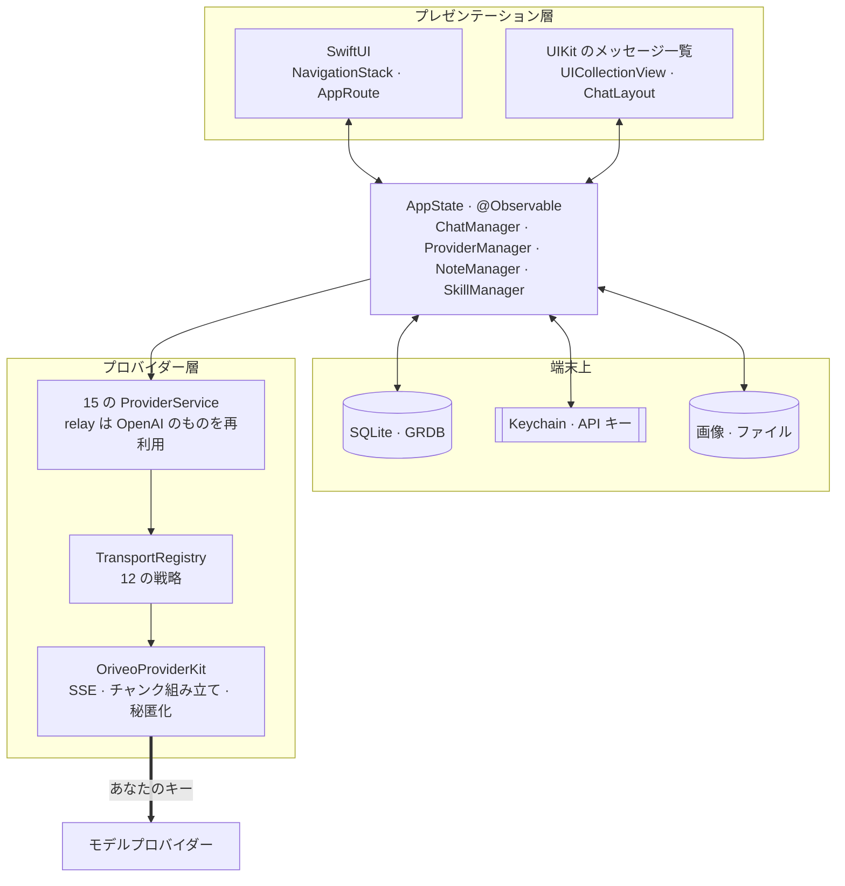
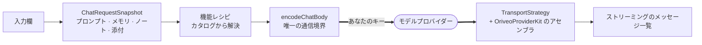

<div align="center">

# Oriveo for iOS

**すでにお金を払っている AI モデルのための、ネイティブな SwiftUI チャットクライアント。**

<a href="../../LICENSE"></a>


<sub>

<a href="../../ios/README.md">English</a> ·
<a href="../ar/ios.md">العربية</a> ·
<a href="../de/ios.md">Deutsch</a> ·
<a href="../es/ios.md">Español</a> ·
<a href="../fr/ios.md">Français</a> ·
<a href="../hi/ios.md">हिन्दी</a> ·
<a href="../id/ios.md">Indonesia</a> ·
**日本語** ·
<a href="../ko/ios.md">한국어</a> ·
<a href="../pt-BR/ios.md">Português</a> ·
<a href="../ru/ios.md">Русский</a> ·
<a href="../th/ios.md">ไทย</a> ·
<a href="../tr/ios.md">Türkçe</a> ·
<a href="../vi/ios.md">Tiếng Việt</a> ·
<a href="../zh-Hans/ios.md">简体中文</a> ·
<a href="../zh-Hant/ios.md">繁體中文</a>

</sub>

</div>

---

Oriveo の iOS クライアントは BYOK の AI チャットアプリです。すでにお持ちの API キーを登録すると、
アプリが各プロバイダーを端末から直接呼び出します。会話、メッセージ、ノート、ノートのフォルダは端末上の
SQLite データベースに、添付ファイルの実体はその隣のファイルとして置かれ、Skills、環境設定、
プロバイダー一覧、会話のフォルダは端末上の JSON です。API キーは iOS の Keychain に入ります。

Oriveo のアカウントはありません。どこにもアップロードされず、サインインする対象もありません。ただし
2 つのプロバイダーは、キーを貼り付ける代わりに、すでに契約しているサブスクリプションでのサインインを
提供しています。ChatGPT と Grok です。そのサインインの相手は OpenAI と xAI で、私たちではありません。

これは [Oriveo Community Edition](README.md) の一部です。3 つのクライアントが、モデルプロバイダーとの
話し方に関するひとつの定義を共有しています。

## アーキテクチャ



この図については、はっきり述べておくべきことが 3 つあります。

**メッセージ一覧は UIKit で、それ以外は SwiftUI です。** `ChatView` は `UICollectionView` を
[ChatLayout](https://github.com/ekazaev/ChatLayout) で駆動する
`ChatListViewControllerRepresentable` を埋め込んでいます。それ以外のすべて — ナビゲーション、設定、
プロバイダーの設定、ノート、Skills — は SwiftUI です。分けているのは、トークン速度で流れてくる
メッセージ一覧には、測定と再利用をセル単位で制御する必要があり、SwiftUI の差分計算ではそれが得られ
ないからです。この境界は
[`Features/Chat/ARCHITECTURE.md`](../../ios/Oriveo/Oriveo/Features/Chat/ARCHITECTURE.md)
に記載しています。

**そのメッセージ一覧は、3 つの独立した経路から更新されます。** これは意図的な設計です。

| 経路 | 何を運ぶか | 理由 |
|---|---|---|
| `@Observable AppState` | 構造の変化 — メッセージが現れる、会話が切り替わる | SwiftUI ネイティブで、低頻度のイベントには安価 |
| GRDB の `ValueObservation` | SQLite から読み戻される永続状態 | 書き込み後の真実がひとつになり、再起動しても残る |
| 会話ごとの Combine `PassthroughSubject` | ストリーミングのテキストと推論の差分 | トークン速度では SwiftUI の差分計算を完全に迂回する |

**プロバイダー対応は 1 つの enum ではなく、4 本の独立した軸です。** `ProviderKind`（16 ケース。
15 のプロバイダーと relay）は
*ユーザーが何を設定したか*。`ProviderServiceProtocol` は*呼び出し面*。`TransportKind`（12 ケース）は
*実際にどの通信プロトコルを話すか*で、これは**モデル単位でカタログから解決されます**。したがって同じ
キーの背後にある 2 つのモデルが食い違っていても構いません。`RelayKind` はユーザーが指定した
エンドポイントを扱います。これらを分けていることこそが、新しいモデルを新しいビルドなしで動かせる
理由です。

### 1 通のメッセージが送られるまで



`BaseAPIService.encodeChatBody` は、OpenAI 互換のリクエストがバイト列になる直前の最後の関門です。
16 種類のうち 12 がここを通るので、機能レシピ、生成パラメーター、カスタムフィールドは
12 か所ではなく 1 か所でテストできます。OpenAI、Anthropic、Gemini はそれぞれ独自の形を話し、独自の
サービスでシリアライズします。それらの地点は、いずれも専用のリクエスト形状テストスイートがカバーして
います。

## モデルに何が許されるか

クライアントは、モデルの機能をその名前から推測することを一切しません。読み取るのは**機能ランタイム**
です。これは、あるプロバイダー・トランスポート・機能の組み合わせに対して、リクエストのどの JSON
ポインタに何を書き込むかを正確に記述したレシピの集まりです。レシピは
[`shared/capabilityrecipe`](../../shared/capabilityrecipe/) にあり、
`CapabilityRecipeRequestCompiler` が適用します。

戻り側では、`CapabilityExecutionRuntime` が実際に何が起きたかを記録します。機能を*観測済み*へ昇格
できるのは、選ばれた本番のストリームパーサーだけです。HTTP 200、空でない回答、リクエスト内のツール
宣言は、いずれも明示的に**根拠とは見なしません**。最終状態はメッセージごとに保存されるため、UI は
「要求はされたが確認はされていない」と伝えられます。動いたかのように黙って示唆することはありません。

## ストレージ

```
Application Support/Oriveo/
  active-uid                     # storage partition, "guest" by default
  users/<uid>/
    oriveo.sqlite                # conversations, messages, notes and folders, catalog cache
    Images/  Files/              # attachment blobs, referenced by id
    session-snapshot.json        # preferences, provider list, folders, last used model
```

- **GRDB 経由の SQLite**。WAL と外部キーを有効にし、すべてのスキーマ変更を `DatabaseMigrator` で
  カバーしています。メッセージとノートの全文検索には、trigram トークナイザーを使った FTS5 を利用
  します。
- **API キーは Keychain に置かれ**、プロバイダーとパーティションをキーとして管理されます。セッション
  スナップショットに書き出す前に、そこからは消去されます。Skills はこれとは別に、`UserDefaults` の
  JSON として保存されます。
- **添付ファイルの実体はディスク上のファイル**であり、レコードではありません。大きな PDF が
  データベースを膨らませることはありません。

バックアップは、`data.json` と画像ファイルを収めた `.oriveo` という ZIP です。任意のパスワードは
アーカイブ自体を暗号化しません。暗号化されるのは、その中にあるプロバイダーの API キーだけです
（AES-GCM、鍵は PBKDF2-HMAC-SHA256 を 600,000 回反復して導出）。会話、ノート、Skills、環境設定は
どちらの場合もアーカイブ内では素の JSON です。バックアップファイルは、それを持っている人なら誰でも
読めるものとして扱ってください。

## アプリが自分自身のために行うリクエスト

コールドスタート時、アプリは `https://api.oriveoai.com/api/metadata?view=lean` に対して認証なし・
ETag 条件付きの `GET` を 1 本発行します。これは公開のモデルカタログを取得します。どのモデルが存在し、
それぞれが何に対応し、推論コントロールがどう名付けられていて、いくらかかるかという情報です。キーも、
会話も、識別子も付きません。レスポンスは SQLite にキャッシュされるため、カタログに到達できないときも
キャッシュされたコピーで動作します。2 つ目のエンドポイント `/api/metadata/model-facts` は、ChatGPT や
Grok のサブスクリプションでサインインした後にだけ、そのサブスクリプションのモデルに何ができるかを
知るために読みます。

アプリが自分自身のために行うリクエストはこれだけです。それ以外はすべて、あなたが設定した
プロバイダーへ、あなたのキーで送られます。

カタログを自分のホストへ向けるのは **Debug ビルド向けの便宜的な機能**で、
`Oriveo/Core/Providers/BackendURLResolver.swift` が次の順で解決します。

1. スキームの Run アクションで設定した環境変数 `ORIVEO_METADATA_BASE_URL`。次に
2. `ios/Oriveo/Config/Info.plist` の `ORIVEO_METADATA_BASE_URL` という文字列。キーはすでにあって空
   なので、値を埋めるだけで足ります。次に
3. `https://api.oriveoai.com`。

知っておくべきことが 2 つあります。Release ビルドはどちらも無視して常に公開カタログを使います。
そこを変えるには `BackendURLResolver` を編集する必要があります。もうひとつ、テストバンドルの実行中や
`CI=true` のときは、プライベートアドレス（localhost、`10/8`、`192.168/16`、`172.16/12`、`.local`、
リンクローカル IPv6）を指す上書きは無視されます。残しっぱなしのローカルホストのせいで、テストスイート
がたまたま今使っているマシンに依存してしまうことがないようにするためです。

## プロジェクト構成

```
ios/Oriveo/
  Config/Info.plist    the app's Info.plist; GENERATE_INFOPLIST_FILE is off
  Oriveo.xcodeproj/
  Oriveo/
    Core/
      Providers/       15 provider services, transports, capability runtime, catalog client
      State/           AppState and the managers it owns
      Database/        GRDB pool, schema, migrator, stores, observations
      Models/          domain types
      Attachments/     import limits, budgets, per-format text extraction
      Tools/           tool-call loop and per-protocol adapters
      Cache/ Localization/ Observability/ Reachability/ Routing/ Usage/
    Features/
      App/             root view and tab shell
      Chat/            transcript, composer, model controls, cross-check, export
      Providers/       setup, detail, relay, local engines, subscription sign-in
      Home/ Notes/ Skills/ Settings/ Backup/ Onboarding/
    Shared/Components/ shared views
    DesignSystem/      theme, colour, haptics
    Preview/           sample data for SwiftUI previews
    *.xcstrings        ten string catalogs
    Assets.xcassets · PrivacyInfo.xcprivacy · Oriveo.entitlements
  OriveoTests/
```

## ビルドと実行

**Xcode 26** が必要で、実機で動かすなら **iOS 18 以降**の端末が必要です。無料の Apple Developer
アカウントで十分です。entitlements ファイルは空で、このアプリは有料の capability を一切使いません。
プッシュも iCloud も App Group も Associated Domains もありません。

プロジェクトのフォーマットと Swift tools のバージョンが実際に課している下限は Xcode 16.3 ですが、
ターゲットは `SWIFT_APPROACHABLE_CONCURRENCY` と `SWIFT_DEFAULT_ACTOR_ISOLATION = MainActor` を
設定しており、古い Xcode はこれらを黙って無視します。actor isolation が黙って変わるのは気づき方として
最悪なので、ビルドは Xcode 26 で行ってください。

1. `ios/Oriveo/Oriveo.xcodeproj` を開く
2. `Oriveo` スキームを選ぶ
3. **Signing & Capabilities** で自分の Team を選ぶ
4. Xcode が `ai.oriveo.community` を登録できない場合は、bundle identifier を自分のチームが所有する
   ものに変更する
5. iPhone を接続し、デベロッパモードを有効にし、このコンピュータを信頼して、実行する

代わりにシミュレータ向けにビルドするなら、任意の iPhone シミュレータを選んで実行してください。
パッケージ依存はコミット済みの `Package.resolved` から解決されます。

**Apple シリコンの Mac では**、iPhone 向けのビルドがそのままネイティブに動きます。**My Mac
(Designed for iPad)** の destination を選んでください。Mac Catalyst は意図的にオフです
（`SUPPORTS_MACCATALYST = NO`）。つまりこれは Mac アプリではなく、iPad 互換ランタイム上で動く iOS
アプリであり、カメラ撮影のような実機だけの経路は Mac 上での挙動になります。

プロジェクトファイルは `objectVersion = 77` とファイルシステム同期グループを使っているため、古い
Xcode では開けないことがあります。プロジェクトのフォーマットを編集するのではなく、Xcode を更新して
ください。

> [!NOTE]
> アプリターゲットは Swift 5 言語モードでコンパイルされます。ローカルの `OriveoProviderKit`
> パッケージは `swift-tools-version: 6.1` を宣言し、Swift 6 言語モードでビルドされます。

## 依存関係

| パッケージ | バージョン | 用途 |
|---|---|---|
| [GRDB.swift](https://github.com/groue/GRDB.swift) | 7.11.1 | SQLite アクセス、マイグレーション、`ValueObservation` |
| [ChatLayout](https://github.com/ekazaev/ChatLayout) | 2.4.3 | メッセージ一覧のコレクションビューのレイアウト |
| [swift-markdown-ui](https://github.com/gonzalezreal/swift-markdown-ui) | 2.4.1 | Markdown のレンダリング |
| [SwiftMath](https://github.com/mgriebling/SwiftMath) | 1.7.3 | LaTeX のレンダリング |
| [ZIPFoundation](https://github.com/weichsel/ZIPFoundation) | 0.9.20 | バックアップアーカイブ、Office/EPUB/ODF の抽出 |
| `OriveoProviderKit` | ローカル | プロバイダー通信カーネル。[`shared/`](shared.md) にある |

`Package.resolved` は、swift-markdown-ui が連れてくる 2 つの推移的依存も固定しています。
[NetworkImage](https://github.com/gonzalezreal/NetworkImage) 6.0.1 と
[swift-cmark](https://github.com/swiftlang/swift-cmark) 0.8.0 です。直接依存はすべて MIT ライセンス、
swift-cmark は BSD-2-Clause で、いずれも AGPL-3.0-or-later と両立します。

## テスト

Xcode で `Oriveo` スキームのテストアクション（⌘U）を実行するか、リポジトリのルートで次を実行します。

```bash
xcodebuild test -project ios/Oriveo/Oriveo.xcodeproj -scheme Oriveo \
  -destination 'platform=iOS Simulator,name=iPhone 16'
```

実際に手元にあるシミュレータに置き換えてください。同じ project と scheme を指定した
`xcodebuild -showdestinations` が、このチェックアウトがビルドできる対象をすべて一覧します。

> [!IMPORTANT]
> テストターゲットは `#filePath` から上へたどって `shared/` ディレクトリを見つけ、そこからコントラクト
> のフィクスチャを読み込みます。そのため、**テストが通るのはリポジトリ全体をチェックアウトしたとき
> だけ**です。`ios/` だけをコピーしても動きません。

スイートは大規模です。[Swift Testing](https://github.com/swiftlang/swift-testing) のケースが
およそ 2,900、加えて XCTest のケースが 76 あり、274 ファイルに分かれています。プロバイダーごとの
リクエストの形、録画した上流 SSE のリプレイ、relay とローカルエンジンのポリシー、メッセージ一覧の
測定とストリーミング挙動、ストレージ、バックアップの往復をカバーしています。

`shared/OriveoProviderKit` には独自のスイートがあります。

```bash
cd shared/OriveoProviderKit && swift test
```

## ローカライズ

16 言語を Xcode の String Catalog（`.xcstrings`）として保持しています。カタログは 10 個、キーはおよそ
1,340、英語がソースです。`shouldTranslate: false` が付いたごく一部を除き、すべてのキーが 16 言語に
翻訳されています。除外されるのは、製品名、句読点、フォーマットのスケルトン、そしてローカライズしたら
間違いになるプロトコル値です。文字列は、アプリ内の言語設定から選ばれた `.lproj` バンドルに対して
`L10n.tr(_:table:)` 経由で解決されるため、言語の切り替えは再起動なしで反映されます。アラビア語の
右から左のレイアウトは明示的に処理しています。

## コントリビュート

[CONTRIBUTING.md](../../CONTRIBUTING.md) をご覧ください。挙動を変える場合はテストを追加してください。
プロバイダーのプロトコル修正では、手書きのモックより `shared/test-fixtures` 配下の録画済みフィクスチャ
を優先し、どのプロバイダーのどのモデルで検証したかを書き添えてください。

## ライセンス

[AGPL-3.0-or-later](../../LICENSE)。
