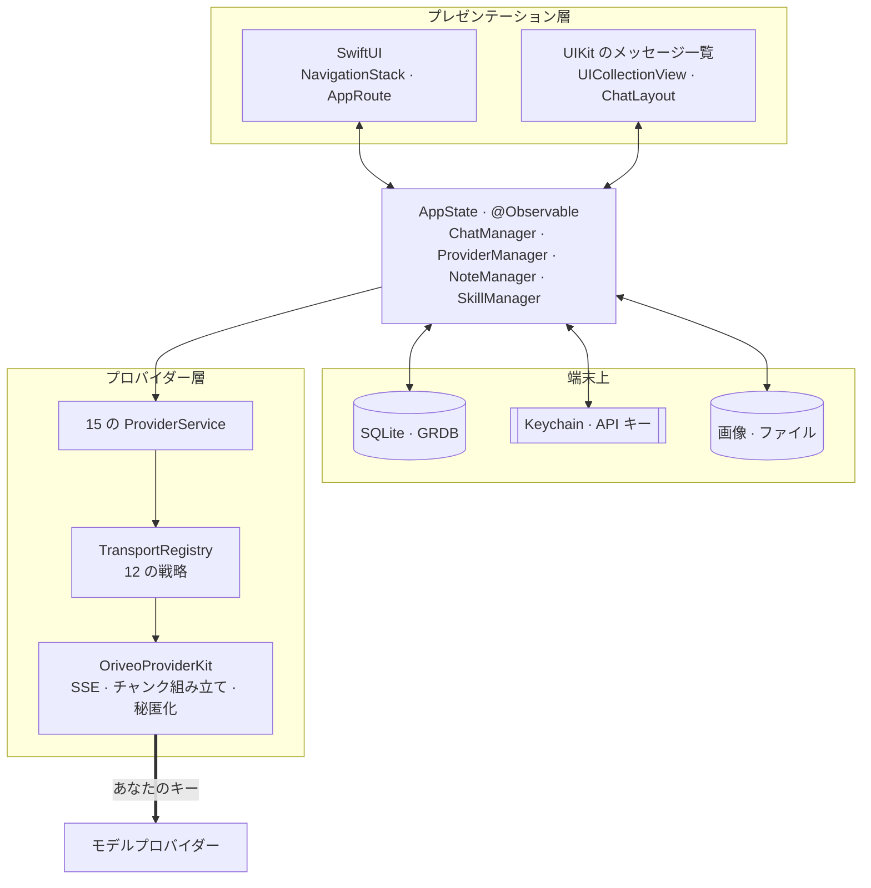

<div align="center">

# Oriveo for iOS

**すでにお金を払っている AI モデルのための、ネイティブな SwiftUI チャットクライアント。**

<a href="../../LICENSE"></a>


<sub>

<a href="../../ios/README.md">English</a> ·
<a href="../ar/ios.md">العربية</a> ·
<a href="../de/ios.md">Deutsch</a> ·
<a href="../es/ios.md">Español</a> ·
<a href="../fr/ios.md">Français</a> ·
<a href="../hi/ios.md">हिन्दी</a> ·
<a href="../id/ios.md">Indonesia</a> ·
**日本語** ·
<a href="../ko/ios.md">한국어</a> ·
<a href="../pt-BR/ios.md">Português</a> ·
<a href="../ru/ios.md">Русский</a> ·
<a href="../th/ios.md">ไทย</a> ·
<a href="../tr/ios.md">Türkçe</a> ·
<a href="../vi/ios.md">Tiếng Việt</a> ·
<a href="../zh-Hans/ios.md">简体中文</a> ·
<a href="../zh-Hant/ios.md">繁體中文</a>

</sub>

</div>

---

Oriveo の iOS クライアントは BYOK の AI チャットアプリです。すでにお持ちの API キーを登録すると、
アプリが各プロバイダーを端末から直接呼び出します。会話、ノート、フォルダ、Skills、添付ファイルは
SQLite として端末上に保存され、API キーは iOS の Keychain に入ります。アカウントもサインインも
ありません。

これは [Oriveo Community Edition](README.md) の一部です。3 つのクライアントが、モデルプロバイダーとの
話し方に関するひとつの定義を共有しています。

## アーキテクチャ



この図については、はっきり述べておくべきことが 3 つあります。

**メッセージ一覧は UIKit で、それ以外は SwiftUI です。** `ChatView` は `UICollectionView` を
[ChatLayout](https://github.com/ekazaev/ChatLayout) で駆動する
`ChatListViewControllerRepresentable` を埋め込んでいます。それ以外のすべて — ナビゲーション、設定、
プロバイダーの設定、ノート、Skills — は SwiftUI です。分けているのは、トークン速度で流れてくる
メッセージ一覧には、測定と再利用をセル単位で制御する必要があり、SwiftUI の差分計算ではそれが得られ
ないからです。この境界は
[`Features/Chat/ARCHITECTURE.md`](../../ios/Oriveo/Oriveo/Features/Chat/ARCHITECTURE.md)
に記載しています。

**そのメッセージ一覧は、3 つの独立した経路から更新されます。** これは意図的な設計です。

| 経路 | 何を運ぶか | 理由 |
|---|---|---|
| `@Observable AppState` | 構造の変化 — メッセージが現れる、会話が切り替わる | SwiftUI ネイティブで、低頻度のイベントには安価 |
| GRDB の `ValueObservation` | SQLite から読み戻される永続状態 | 書き込み後の真実がひとつになり、再起動しても残る |
| 会話ごとの Combine `PassthroughSubject` | ストリーミングのテキストと推論の差分 | トークン速度では SwiftUI の差分計算を完全に迂回する |

**プロバイダー対応は 1 つの enum ではなく、4 本の独立した軸です。** `ProviderKind`（16 ケース）は
*ユーザーが何を設定したか*。`ProviderServiceProtocol` は*呼び出し面*。`TransportKind`（12 ケース）は
*実際にどの通信プロトコルを話すか*で、これは**モデル単位でカタログから解決されます**。したがって同じ
キーの背後にある 2 つのモデルが食い違っていても構いません。`RelayKind` はユーザーが指定した
エンドポイントを扱います。これらを分けていることこそが、新しいモデルを新しいビルドなしで動かせる
理由です。

### 1 通のメッセージが送られるまで


`BaseAPIService.encodeChatBody` は、リクエストボディがバイト列になる唯一の地点です。あらゆる機能
レシピ、生成パラメーター、カスタムフィールドがここを通る必要があり、それによって通信フォーマットを
15 か所ではなく 1 か所でテストできるようになっています。

## モデルに何が許されるか

クライアントは、モデルの機能をその名前から推測することを一切しません。読み取るのは**機能ランタイム**
です。これは、あるプロバイダー・トランスポート・機能の組み合わせに対して、リクエストのどの JSON
ポインタに何を書き込むかを正確に記述したレシピの集まりです。レシピは
[`shared/capabilityrecipe`](shared.md) にあり、`CapabilityRecipeRequestCompiler` が適用します。

戻り側では、`CapabilityExecutionRuntime` が実際に何が起きたかを記録します。機能を*観測済み*へ昇格
できるのは、選ばれた本番のストリームパーサーだけです。HTTP 200、空でない回答、リクエスト内のツール
宣言は、いずれも明示的に**根拠とは見なしません**。最終状態はメッセージごとに保存されるため、UI は
「要求はされたが確認はされていない」と伝えられます。動いたかのように黙って示唆することはありません。

## ストレージ

```
Application Support/Oriveo/
  active-uid                     # storage partition, "guest" by default
  users/<uid>/
    oriveo.sqlite                # conversations, messages, notes, catalog cache
    Images/  Files/              # attachment blobs, referenced by id
    session-snapshot.json        # preferences, provider list (never API keys)
```

- **GRDB 経由の SQLite**。WAL と外部キーを有効にし、すべてのスキーマ変更を `DatabaseMigrator` で
  カバーしています。メッセージとノートの全文検索には、trigram トークナイザーを使った FTS5 を利用
  します。
- **API キーは Keychain に置かれ**、プロバイダーとパーティションをキーとして管理されます。セッション
  スナップショットに書き出す前に、そこからは消去されます。
- **添付ファイルの実体はディスク上のファイル**であり、レコードではありません。大きな PDF が
  データベースを膨らませることはありません。

## アプリが自分自身のために行う唯一のネットワーク呼び出し

コールドスタート時、アプリは `https://api.oriveoai.com` に対して認証なし・ETag 条件付きの `GET` を
2 本発行します。`/api/metadata?view=lean` と `/api/metadata/model-facts` です。これらは公開の
モデルカタログを取得します。どのモデルが存在し、それぞれが何に対応し、推論コントロールがどう名付け
られていて、いくらかかるかという情報です。キーも、会話も、識別子も付きません。レスポンスは SQLite に
キャッシュされるため、カタログに到達できないときもキャッシュされたコピーで動作します。

これがアプリ自身のために行う唯一のリクエストです。それ以外はすべて、あなたが設定したプロバイダーへ、
あなたのキーで送られます。

## プロジェクト構成

```
ios/Oriveo/
  Oriveo.xcodeproj/
  Oriveo/
    Core/
      Providers/       15 provider services, transports, capability runtime, catalog client
      State/           AppState and the managers it owns
      Database/        GRDB pool, schema, migrator, stores, observations
      Models/          domain types
      Attachments/     import limits, budgets, per-format text extraction
      Tools/           tool-call loop and per-protocol adapters
    Features/
      Chat/            transcript, composer, model controls, export
      Providers/       setup, detail, relay, local engines, subscription sign-in
      Home/ Notes/ Skills/ Settings/ Backup/ Onboarding/
    Shared/Components/ shared views
    DesignSystem/      theme, colour, haptics
  OriveoTests/
```

## ビルドと実行

**Xcode 26** が入った Mac と、**iOS 18 以降**の実機が必要です。無料の Apple Developer アカウントで
十分です。このアプリは有料の capability を使わず、entitlements ファイルも空のまま同梱しています。

1. `ios/Oriveo/Oriveo.xcodeproj` を開く
2. `Oriveo` スキームを選ぶ
3. **Signing & Capabilities** で自分の Team を選ぶ
4. Xcode が `ai.oriveo.community` を登録できない場合は、bundle identifier を自分のチームが所有する
   ものに変更する
5. iPhone を接続し、デベロッパモードを有効にし、このコンピュータを信頼して、実行する

代わりにシミュレータ向けにビルドするなら、任意の iPhone シミュレータを選んで実行してください。
パッケージ依存はコミット済みの `Package.resolved` から解決されます。

プロジェクトファイルは `objectVersion = 77` とファイルシステム同期グループを使っているため、古い
Xcode では開けないことがあります。プロジェクトのフォーマットを編集するのではなく、Xcode を更新して
ください。

> [!NOTE]
> アプリターゲットは Swift 5 言語モードでコンパイルされ、`SWIFT_APPROACHABLE_CONCURRENCY` と
> `SWIFT_DEFAULT_ACTOR_ISOLATION = MainActor` が有効です。ローカルの `OriveoProviderKit` パッケージ
> は `swift-tools-version: 6.1` を宣言し、Swift 6 言語モードでビルドされます。

## 依存関係

| パッケージ | バージョン | 用途 |
|---|---|---|
| [GRDB.swift](https://github.com/groue/GRDB.swift) | 7.11.1 | SQLite アクセス、マイグレーション、`ValueObservation` |
| [ChatLayout](https://github.com/ekazaev/ChatLayout) | 2.4.3 | メッセージ一覧のコレクションビューのレイアウト |
| [swift-markdown-ui](https://github.com/gonzalezreal/swift-markdown-ui) | 2.4.1 | Markdown のレンダリング |
| [SwiftMath](https://github.com/mgriebling/SwiftMath) | 1.7.3 | LaTeX のレンダリング |
| [ZIPFoundation](https://github.com/weichsel/ZIPFoundation) | 0.9.20 | バックアップアーカイブ、Office/EPUB/ODF の抽出 |
| `OriveoProviderKit` | ローカル | プロバイダー通信カーネル。macOS と共有 |

## テスト

Xcode から `OriveoTests` スキームを実行するか、リポジトリのルートで次を実行します。

```bash
xcodebuild test -project ios/Oriveo/Oriveo.xcodeproj -scheme Oriveo \
  -destination 'platform=iOS Simulator,name=iPhone 17'
```

実際に手元にあるシミュレータに置き換えてください。`xcrun simctl list devices available` で一覧できます。

> [!IMPORTANT]
> テストターゲットは `#filePath` から上へたどって `shared/` ディレクトリを見つけ、そこからコントラクト
> のフィクスチャを読み込みます。およそ 29 のスイートがこれに依存しているため、**テストが通るのは
> リポジトリ全体をチェックアウトしたときだけ**です。`ios/` だけをコピーしても動きません。

スイートは大規模です。273 ファイルにおよそ 2,900 のテストがあり、その大半は
[Swift Testing](https://github.com/swiftlang/swift-testing) で書かれています。プロバイダーごとの
リクエストの形、録画した上流 SSE のリプレイ、relay とローカルエンジンのポリシー、メッセージ一覧の
測定とストリーミング挙動、ストレージ、バックアップの往復をカバーしています。

`shared/OriveoProviderKit` には独自のスイートがあります。

```bash
cd shared/OriveoProviderKit && swift test
```

## ローカライズ

16 言語を Xcode の String Catalog（`.xcstrings`）として保持しています。カタログは 10 個、キーはおよそ
1,900、英語がソースです。文字列は、アプリ内の言語設定から選ばれた `.lproj` バンドルに対して
`L10n.tr(_:table:)` 経由で解決されるため、言語の切り替えは再起動なしで反映されます。アラビア語の
右から左のレイアウトは明示的に処理しています。

## コントリビュート

[CONTRIBUTING.md](../../CONTRIBUTING.md) をご覧ください。挙動を変える場合はテストを追加してください。
プロバイダーのプロトコル修正では、手書きのモックより `shared/test-fixtures` 配下の録画済みフィクスチャ
を優先し、どのプロバイダーのどのモデルで検証したかを書き添えてください。

## ライセンス

[AGPL-3.0-or-later](../../LICENSE)。
