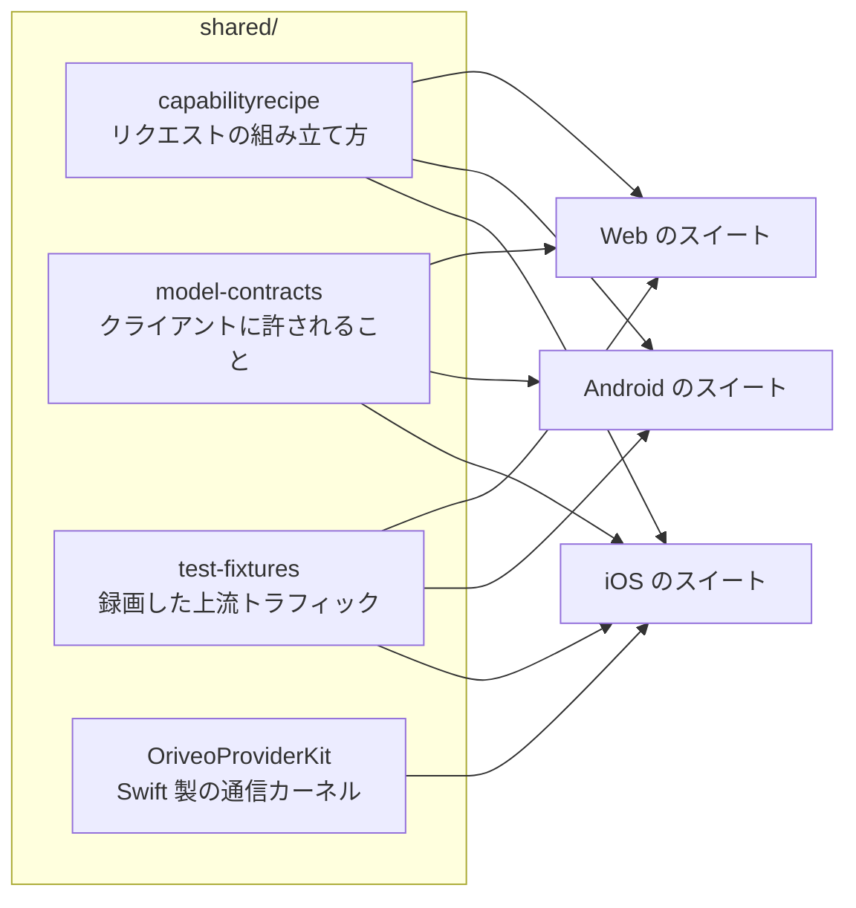

<div align="center">

# 共有コントラクト

**モデルプロバイダーとの話し方に関するひとつの定義。3 つのクライアントすべてが、これに対して
アサーションします。**

<a href="../../LICENSE"></a>


<sub>

<a href="../../shared/README.md">English</a> ·
<a href="../ar/shared.md">العربية</a> ·
<a href="../de/shared.md">Deutsch</a> ·
<a href="../es/shared.md">Español</a> ·
<a href="../fr/shared.md">Français</a> ·
<a href="../hi/shared.md">हिन्दी</a> ·
<a href="../id/shared.md">Indonesia</a> ·
**日本語** ·
<a href="../ko/shared.md">한국어</a> ·
<a href="../pt-BR/shared.md">Português</a> ·
<a href="../ru/shared.md">Русский</a> ·
<a href="../th/shared.md">ไทย</a> ·
<a href="../tr/shared.md">Türkçe</a> ·
<a href="../vi/shared.md">Tiếng Việt</a> ·
<a href="../zh-Hans/shared.md">简体中文</a> ·
<a href="../zh-Hant/shared.md">繁體中文</a>

</sub>

</div>

---

「プロバイダーを呼び出す」を 3 つのクライアントがそれぞれ独立に実装すれば、必ず食い違っていきます。
しかも静かに、直近に誰かが試した実装の方向へ食い違い、その差は「あるプラットフォームでだけ再現する
バグ」として表に出てきます。

`shared/` はそれに対する答えです。挙動はデータとして一度だけ書き下され、各クライアントのテストスイート
が同じファイルに対してアサーションします。そのデータの中にある癖なら修正は 1 回で済みます。パーサーの
中にある癖なら、2 つのプラットフォームで出荷されて 3 つ目が壊れる代わりに、3 つのスイートが同時に
捕まえます。



## capabilityrecipe

レシピのレジストリです。あるプロバイダー・トランスポート・機能（ウェブ検索、推論の強度、画像生成）の
組み合わせに対して、送出するリクエストのどの JSON ポインタに何を書き込むか、そして答えをどう読み戻す
かを正確に定めます。

今日リリースされたモデルがクライアントの更新なしで動くのはこれのおかげであり、どのクライアントも
モデル名から機能を推測しないのもこれが理由です。レシピそのものは `capability_runtime.v1.json` が
持ち、`capability_result_definitions.v1.json` と `capability_custom_controls.v2.json` が結果と
ユーザー向けコントロールの解釈方法を定義します。

各レシピは `executionKind`（`request_overlay`、`server_tool`、`client_tool_loop`、`endpoint_route`、
`model_route`、`external_connector`、`unavailable`）を宣言します。各クライアントのコンパイラは、適用の
前にそのレシピがプロバイダー・機能・トランスポートと整合しているかを検証し、整合しない場合は名前の
付いた理由で拒否します。誰もレビューしていないリクエストを送ることはありません。この一覧は閉じた
集合です。それ以外を名乗るレシピは、推測されるのではなく拒否されます。

## model-contracts

クライアント間の挙動を固定する JSON フィクスチャです。あるプロバイダーと機能に対してリクエストが
どういう形でなければならないか、生成パラメーターがどう解決され上書きがどう重なるか、クライアントが
提示してよい機能の状態はどれか、そしてモデルカタログとその根拠がどう消費されるかを定めます。

各クライアントのテストはこれらを直接読み込むため、ここでの変更は 3 つのクライアントすべてに同時に
効く変更になります。

## test-fixtures

ゴールデンテストデータです。録画した上流のツール呼び出しトラフィック、リレーサービス（Relay）の
ルーティング、
フォームの検証、ローカルアドレスの分類、カタログとポータブル設定のシナリオ、model-facts と機能の
根拠のスナップショット、ローカルエンジンのシナリオが入っています。

`provider-toolcall/recorded/` 以下の `.sse` ファイルは**実際に捕捉した上流のトラフィック**であり、
届いたときのまま 1 バイトも変えずに残してあります。落としたのはレスポンスヘッダーだけで、本文にキーが
載っていたことは一度もありません。`provider-toolcall/` の直下にある `.sse` ファイルは、特定のパース
経路を固定するための手書きのフィクスチャです。この区別は重要です。手書きのモックが符号化しているのは「プロバイダーはこう振る舞うはずだ」というあなたの
思い込みですが、録画したストリームが符号化しているのは、それが実際にやったこと、あの火曜日に送って
きた壊れたチャンクまで含めた事実だからです。プロバイダーのプロトコル修正にテストが要るときは、録画を
優先してください。

フィクスチャの `$comment`、または隣にある `expected.json` のマニフェストに、その周りのエントリが何を
固定しているのかが書かれています。ケースを追加する前にそれを読んでください。

## OriveoProviderKit

プロバイダーの通信プロトコルのカーネルを収めた Swift パッケージです。SSE の行の組み立て、
OpenAI 互換のチャンクのパース、Responses / Anthropic Messages / Gemini の各プロトコル向けの
イベントベースの組み立て、トランスポートに依存しないリクエスト構築、レシピのコンパイルとその実行
ガード、ツール名のエンコード、認証情報の秘匿化、上流エラーの分類、thinking タグのパース、
ストリーミング中の JSON パス抽出、明示的な `URLSession` のリダイレクト方針、そしてプロバイダーごとの
癖のプロファイルが含まれます。

その範囲は意図的に狭く引かれています。**含むもの:** Foundation だけに依存する通信の知識。
**含まないもの:** アプリのモデル、UI、データベース、テレメトリー、ローカライズ。このパッケージは
標準ライブラリと Foundation の外側に何も依存せず、各 Apple クライアントはこれを薄くラップして使い、
通信の挙動の実装がちょうど 1 つになるようにしています。

このパッケージは Apple プラットフォーム向けのリクエストとストリーミングの経路をすべて実装しています。
iOS アプリが今リンクしているのはその一部（ストリームアセンブラ、通信プロファイル、ツール名のコーデック、
エラー分類器）で、リクエストビルダーは自前のものを使っています。開発中の macOS クライアントが 2 番目の
利用者であり、だからこそレシピコンパイラとトランスポートに依存しないリクエストビルダーは、ひとつの
アプリの中ではなくここに置かれています。下のスイートは、どの利用者にも共通する部分を対象にします。
SSE の分割、OpenAI 互換の組み立て、ツール名のコーデック、そしてリダイレクト方針です。

```bash
cd shared/OriveoProviderKit && swift build && swift test
```

- プラットフォーム: iOS 18+、macOS 15+ · `swift-tools-version: 6.1`
- `ProviderWireProfile` は、ひとつの OpenAI 互換アセンブラでもなお必要になる、ベンダーごとの残りの癖を
  保持します。推論テキストがどこに届くか、キャッシュされたトークン数がどこにあるか、プロンプト
  トークンにキャッシュヒットが既に含まれているか、といったものです。これが記述するのは*バイトがどう
  届くか*であって、*モデルに何ができるか*ではありません。後者はレシピの仕事です。

## これらのファイルを触るとき

ここでの変更は、すべてのクライアントへの変更です。今たまたま作業しているクライアントだけでなく、
触ったファイルを読むすべてのクライアントのコントラクトスイートを実行してください。

リポジトリのルートから:

```bash
(cd web && npm run test:run)
(cd shared/OriveoProviderKit && swift test)
# plus the iOS and Android suites — see their READMEs
```

iOS のスイートはテストファイルから上へたどって `shared/` を見つけることでこのディレクトリを特定し、
Android のスイートも同じように作業ディレクトリから上へたどり、Web のスイートはワークスペースからの
相対で解決します。したがっていずれも、リポジトリ全体のチェックアウトを必要とします。

Pull Request を開く前に [CONTRIBUTING.md](../../CONTRIBUTING.md) を読んでください。

## ライセンス

[AGPL-3.0-or-later](../../LICENSE)。
