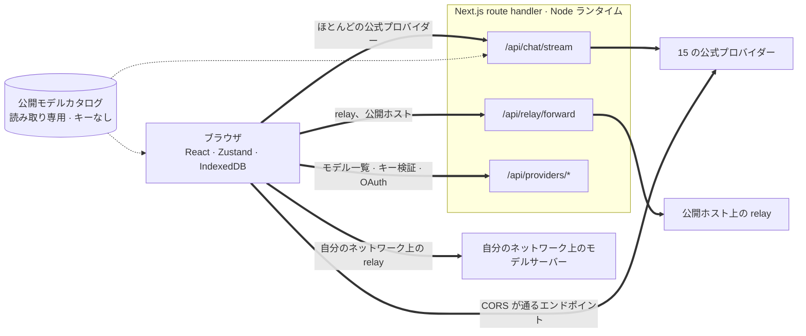
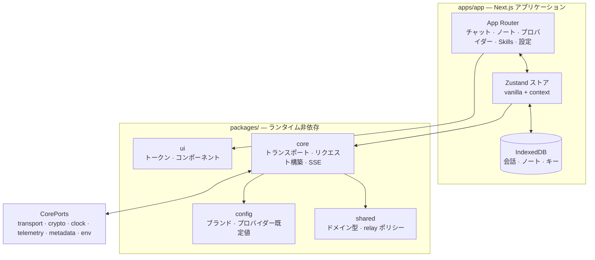

<div align="center">

# Oriveo for Web

**すでにお金を払っている AI モデルのための、Next.js 製チャットクライアント。**

<a href="../../LICENSE"></a>


<sub>

<a href="../../web/README.md">English</a> ·
<a href="../ar/web.md">العربية</a> ·
<a href="../de/web.md">Deutsch</a> ·
<a href="../es/web.md">Español</a> ·
<a href="../fr/web.md">Français</a> ·
<a href="../hi/web.md">हिन्दी</a> ·
<a href="../id/web.md">Indonesia</a> ·
**日本語** ·
<a href="../ko/web.md">한국어</a> ·
<a href="../pt-BR/web.md">Português</a> ·
<a href="../ru/web.md">Русский</a> ·
<a href="../th/web.md">ไทย</a> ·
<a href="../tr/web.md">Türkçe</a> ·
<a href="../vi/web.md">Tiếng Việt</a> ·
<a href="../zh-Hans/web.md">简体中文</a> ·
<a href="../zh-Hant/web.md">繁體中文</a>

</sub>

</div>

---

Oriveo の Web クライアントは、Next.js で作られた BYOK の AI チャットアプリです。会話、ノート、
フォルダ、Skills、そしてプロバイダーのキーは、ブラウザ自身のストレージに置かれます。アカウントも
サインインもありません。

これは [Oriveo Community Edition](README.md) の一部です。3 つのクライアントが、モデルプロバイダーとの
話し方に関するひとつの定義を共有しています。

## クイックスタート

Node 22 が必要です（[`.nvmrc`](../../web/.nvmrc) を参照）。npm は同梱されているので、他のパッケージ
マネージャーは要りません。

```bash
npm install
npm run dev:app     # http://localhost:3001
```

最初の画面でプロバイダーの API キーを尋ねられます。チャットを始めるのに他に必要なものはありません。

## リクエストが実際にたどる経路

ここは何よりも先に読む価値があります。Web クライアントは、リクエストがクライアントからプロバイダーへ
直接**行かない**ことが多い唯一の場所だからです。



**なぜ回り道が必要なのか。** ほとんどのプロバイダーの API は CORS ヘッダーを返さないため、ブラウザ
から `api.openai.com` などを直接呼び出せません。プリフライトで失敗します。ブラウザ上の BYOK
クライアントはどれも何らかの形でこれを解決する必要があり、このアプリは Node ランタイムで動く
Next.js の route handler に転送する方式を採っています。`npm run dev:app` を実行しているときは、
それらの handler はあなた自身のマシンにあります。どこかにデプロイしたなら、デプロイ先のマシンに
あります。

handler は 1 つではありません。チャットのストリーミング、relay の転送、画像生成、モデル一覧、キーの
検証、そして Grok と Codex のデバイスログインのやり取りで、route ファイルは全部で 12 個になります。
ここで効いてくるのがキーの検証で、これはキーをあなた自身のサーバーに送り、そのサーバーがそのキーで
プロバイダーを叩きます。

ブラウザからの呼び出しを*許可している*エンドポイントもいくつかあり、それらは間にサーバーを挟まず
直接呼び出されます。チャット用の Kimi の中国向けエンドポイント（`api.moonshot.cn`）と、
OpenRouter・SiliconFlow・DeepSeek・Kimi の残高エンドポイントです。

**これらの handler がすること、しないこと。** リクエストの形を検証してサイズに上限を設け、チャットと
relay のトラフィックに IP ごとのレート制限をかけ、プライベートアドレスやリンクローカルアドレスに
解決される URL を拒否し、プロバイダー固有のボディを組み立て、レスポンスをストリームで返します。
`app/api` の下にはデータベースもファイルへの書き込みもなく、リクエストボディのログも一切ありません。
あなたのキーとメッセージは転送され、そして忘れられます。このルートは訪問者全員が共有する 1 つの
プロセスなので、あるユーザーの拒否されたパラメーターをキャッシュして別のユーザーのリクエストに
適用してしまうことが決してない、という点を専用のテスト（`server-never-learns.test.ts`）が固定して
います。

relay の転送処理はさらに、解決したアドレスに DNS を固定し、レスポンスに上限を設け、すべての
タイムアウトに上界を与え、リダイレクトを同一オリジンに限定し、hop-by-hop ヘッダーの通過を拒否します。

**ローカルのエンドポイントはこれを完全に迂回します。** プライベートアドレス、`.local` 名、
`localhost` 上の relay、あるいはローカル HTTP モードやプライベート VPN モードで設定された relay は、
`credentials: 'omit'` と `targetAddressSpace: 'local'` を付けて**ブラウザから直接**取得されます。
LAN のトラフィックはあなたのネットワークから出ませんし、アプリのサーバーを通ることもありません。

## アーキテクチャ



`packages/core` はプロバイダーのプロトコルに関する知識を 1 バイト残らず抱えており、ブラウザの
グローバルからは意図的に切り離されています。eslint が、その中と `packages/ipc-contract` の中での
`window`、`document`、`fetch`、`crypto`、`localStorage`、`sessionStorage`、`indexedDB` を禁止して
います。環境から必要になるものはすべて `CorePorts` 経由で届きます。だからこそ、同じコードが
ブラウザでも、Node の route handler でも、DOM のないテストでも動きます。

プロバイダー対応は 2 本の独立した軸です。`providerKind` が**リクエストビルダー**（このベンダーでは
ボディがどういう形になるか）を選びます。`model.transport` が 12 種類の中から**トランスポート戦略**
（実際にどの通信プロトコルを話すか）を選び、これはプロバイダー単位ではなくモデル単位でカタログから
解決されます。したがって同じキーの背後にある 2 つのモデルが食い違っていても構いません。戦略が実装
するメソッドはちょうど 3 つ、`buildRequestBody`、`parseStreamChunk`、`parseError` です。

## ワークスペース

```
apps/app/               the Next.js application
packages/core/          provider protocols: transports, request builders, SSE parsing
packages/shared/        domain types, relay policy, helpers
packages/ui/            design tokens and shared components
packages/config/        brand and provider defaults
packages/ipc-contract/  typed channel contract for a desktop shell
```

スタイリングは、`packages/ui` にあるひとつのカスタムプロパティのトークンシートの上に CSS Modules を
重ねる方式です。ユーティリティクラスのフレームワークは使っていません。`packages/ipc-contract` は
デスクトップシェルがバインドするであろうチャネル面を記述したものですが、このリポジトリにそうした
シェルは含まれていないため、Web のビルドでは通ることのない型と分岐を提供するだけです。

## ストレージ

すべてがパーティション単位で、既定値が `guest` のアクティブ ID をキーにしています。

| 対象 | 保存先 |
|---|---|
| 会話、メッセージ、フォルダ、ノート、プロバイダー | IndexedDB `oriveo--{id}`、8 つのオブジェクトストア |
| モデルカタログのスナップショット（約 3 MB）と model facts | IndexedDB の blob ストア。意図的に localStorage を使いません |
| 設定とモデルコントロールのテーブル | `localStorage`。例外を投げると分かっている経路を `safeLocalStorage` で包んでいます |
| 生成された画像と添付された画像 | 別の IndexedDB データベース |

好みではなく実際の障害から来た詳細が 2 つあります。カタログのスナップショットを IndexedDB に置いて
いるのは、約 3 MB あるそれが、ブラウザのオリジンあたり 5 MB という localStorage の割り当ての大半を
食い潰していたからです。そして localStorage へのアクセスがすべて `safeLocalStorage` を通るのは、
サイトデータをブロックする設定のブラウザでは `window.localStorage` の *getter* 自体が
`SecurityError` を投げるからです。素朴に読むと、`try` ブロックが動き出す前にページが落ちます。

> [!IMPORTANT]
> Web では、プロバイダーのキーは IndexedDB に**暗号化されずに**保存されます。ブラウザにはこれ以上
> ふさわしい置き場所がないため、ブラウザベースの BYOK クライアントが一般に採る方式です。最も強い保証
> が欲しい場合は、システムのキーチェーンやキーストアが暗号化してくれる iOS か Android のクライアント
> をお使いください。バックアップアーカイブは別の話で、パスワードを設定すれば AES-256-GCM と
> PBKDF2-SHA-256 の 600,000 回反復で暗号化されます。

## モデルカタログ

各プロバイダーがどのモデルを提供し、それぞれが何に対応しているかは、起動時に取得する読み取り専用の
カタログから来ます。要求するのはちょうど 2 つのエンドポイントで、どちらも `GET`、どちらも ETag 条件
付き、いずれも API キー・会話・ユーザー識別子を運びません。

```
GET {backend}/api/metadata?view=lean
GET {backend}/api/metadata/model-facts
```

既定のバックエンドは `https://api.oriveoai.com` です。自分で配信したい場合は
`NEXT_PUBLIC_BACKEND_URL` を自分のホストに向けてください。レスポンスは IndexedDB に 24 時間
キャッシュされ、`If-None-Match` で再検証されます。カタログに到達できないときも、アプリは
キャッシュされたコピーで動作し続けます。

## コマンド

以下はこのディレクトリから実行してください。

| コマンド | 内容 |
|---|---|
| `npm run dev:app` | ポート 3001 で開発サーバーを起動 |
| `npm run build:app` | 本番ビルド |
| `npm run typecheck` | 全ワークスペースに対する `tsc --noEmit` |
| `npm run test:run` | vitest を 1 回実行 |
| `npm run test` | vitest のウォッチモード |
| `npm run lint` | `apps/` と `packages/` に対する eslint |

テストファイルを 1 つだけ実行するときは、それを所有するワークスペースから実行してください。いくつかの
スイートは作業ディレクトリを基準にフィクスチャを解決するためです。

```bash
cd apps/app && npx vitest run lib/core/chat/__tests__/stream-options.test.ts
```

## 設定

すべて任意です。[`.env.example`](../../web/.env.example) を `.env.local` にコピーし、必要なものだけを
設定してください。各キーの説明はそこにあります。コードが読むもののそのファイルには載っていない変数も
いくつかあります。`BACKEND_URL`（`NEXT_PUBLIC_BACKEND_URL` のサーバーサイド専用の双子）、
`NEXT_PUBLIC_LIBRARY_ENABLED`、`ORIVEO_DESKTOP`、`NEXT_DIST_DIR` です。

### エラーレポート

このアプリは Sentry SDK を同梱しています。**DSN がなければ何も動きません。** `NEXT_PUBLIC_SENTRY_DSN`
が未設定ならトランスポートもイベントもなく、どこにも何も送られません。このリポジトリからビルドした
場合はこれが既定です。DSN を設定すれば、エラーレポート、10% のパフォーマンストレース、1% のセッション
リプレイが有効になり、イベントがブラウザを出る前にプロバイダーのキー・エンドポイント・メッセージ本文を
取り除くフックが働きます。これは、エラーレポートが欲しいデプロイのために置いてあるのであって、この
ビルドが勝手に通信するからではありません。

## テスト

461 ファイルにおよそ 4,600 のテストがあり、vitest で動きます。カバレッジが最も厚いのは、間違いの代償
が最も大きいところです。プロバイダーごとのリクエストの形、通信プロトコルごとのトランスポートの挙動、
SSE とプロキシのチャンクのパース、使用量とコストのパース、エラー分類、relay のプローブとセキュリティ
モード、SSRF ガード、機能レシピの実行、カタログのキャッシュとコントラクトバージョンによる無効化、
IndexedDB の永続化、ストレージのパーティション分割、バックアップの往復、そして route handler 自体
です。

> [!IMPORTANT]
> およそ 24 のスイートが `../shared` からコントラクトのフィクスチャを読み込むため、**テストが通るのは
> リポジトリ全体をチェックアウトしたときだけ**です。`web/` だけをコピーしても動きません。

## ローカライズ

`apps/app/messages` に 16 のロケールがあり、それぞれおよそ 1,800 のキーを持ち、英語がソースです。
ディレクトリを走査して、いずれかのロケールのキー集合が英語と異なれば失敗するテストがあるため、
ロケールファイルを追加するだけで自動的に対象に加わります。アラビア語には完全な右から左のレイアウトが
用意されています。ロケールの選択は、明示的な `?locale=` パラメーター、次に cookie、次に
`Accept-Language` の順に従います。

## コントリビュート

[CONTRIBUTING.md](../../CONTRIBUTING.md) をご覧ください。`packages/core` はトランスポート優先です。
プロバイダーの追加はたいてい、新しいクライアントではなく、リクエストビルダーとレスポンスアダプター
です。プロバイダーのプロトコル修正では、手書きのモックより `shared/test-fixtures` 配下の録画済み
フィクスチャを優先してください。

## ライセンス

[AGPL-3.0-or-later](../../LICENSE)。
