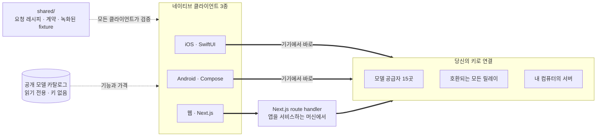

<div align="center">


# Oriveo

**모든 모델을, 하나의 앱에서.**

iOS, Android, 웹을 위한 오픈소스 BYOK AI 채팅 클라이언트.
계정도, 구독도 없고, 요청 경로에 저희 서비스가 끼어들지도 않습니다.

<a href="../../LICENSE"></a>
<a href="ios.md"></a>
<a href="android.md"></a>
<a href="web.md"></a>


<a href="https://oriveoai.com">웹사이트</a> &nbsp;·&nbsp;
<a href="#시작하기">시작하기</a> &nbsp;·&nbsp;
<a href="#아키텍처">아키텍처</a> &nbsp;·&nbsp;
<a href="#community-edition과-oriveo">에디션</a> &nbsp;·&nbsp;
<a href="#자주-묻는-질문">자주 묻는 질문</a> &nbsp;·&nbsp;
<a href="../../CONTRIBUTING.md">기여하기</a>

<sub>

<a href="../../README.md">English</a> ·
<a href="../ar/README.md">العربية</a> ·
<a href="../de/README.md">Deutsch</a> ·
<a href="../es/README.md">Español</a> ·
<a href="../fr/README.md">Français</a> ·
<a href="../hi/README.md">हिन्दी</a> ·
<a href="../id/README.md">Indonesia</a> ·
<a href="../ja/README.md">日本語</a> ·
**한국어** ·
<a href="../pt-BR/README.md">Português</a> ·
<a href="../ru/README.md">Русский</a> ·
<a href="../th/README.md">ไทย</a> ·
<a href="../tr/README.md">Türkçe</a> ·
<a href="../vi/README.md">Tiếng Việt</a> ·
<a href="../zh-Hans/README.md">简体中文</a> ·
<a href="../zh-Hant/README.md">繁體中文</a>

</sub>

</div>

---

## Oriveo란

Oriveo Community Edition은 iOS, Android, 웹을 위한 BYOK(bring-your-own-key) AI 채팅
클라이언트입니다. 이미 가지고 있는 API 키를 직접 넣으면, 클라이언트가 그 키로 공급자와
통신합니다. Oriveo 계정도 구독도 없고, 저희 쪽으로 보고되는 것도 없습니다.

**모델 공급자 15곳**과 네이티브로 통신합니다 — OpenAI, Anthropic, Google Gemini, OpenRouter,
DeepSeek, Grok, Mistral, Groq, Together AI, Fireworks AI, MiniMax, Z.ai, Qwen, Kimi (Moonshot),
SiliconFlow. 여기에 더해 **OpenAI · Anthropic · Gemini 호환 엔드포인트**라면 무엇이든 지정할 수
있고, 여기에는 자신의 컴퓨터에서 돌아가는 llama.cpp, Ollama, LM Studio, vLLM도 포함됩니다.

| | |
|---|---|
| **공급자** | 15곳 기본 내장, 여기에 사용자 지정 릴레이 엔드포인트와 로컬 모델 서버 |
| **클라이언트** | iOS(SwiftUI) · Android(Jetpack Compose) · 웹(Next.js) |
| **인터페이스 언어** | 16개 |
| **계정 필요 여부** | 없음 |
| **앱이 자기 자신을 위해 보내는 호출** | 한 가지, 요청 두 번: 읽기 전용 모델 카탈로그. 키도 식별자도 붙지 않음 |
| **라이선스** | AGPL-3.0-or-later |

## 왜 만들었나

사용자가 돈을 내고 쓰는 모델을 누군가가 계량하거나, 기록하거나, 가격을 얹을 수 있어서는 안 됩니다.

- **당신의 키, 당신의 청구서.** 공급자의 정가를 그대로 냅니다. 가격을 얹거나, 사용량을 따로
  계량하거나, 되파는 일이 없습니다.
- **기본이 로컬.** 대화, 노트, 폴더, 스킬, 첨부 파일은 기기 안에 있습니다. 언제든 파일로 내보낼
  수 있고, 접근 권한을 잃을 클라우드 사본 자체가 없습니다.
- **하나의 동작, 세 개의 클라이언트.** 특정 공급자·transport·기능에 대해 요청을 어떻게 만들지는
  [`shared/`](shared.md)에 한 번만 적어 두고, 세 클라이언트 모두 같은 JSON fixture에 대고
  검증합니다. 그 데이터 안에 있는 특이 동작은 한 번만 고치면 되고, 파서 안에 있는 것은 세 테스트
  스위트가 동시에 잡아냅니다.
- **앱이 보내는 단 한 번의 호출.** 오늘 나온 모델이 앱 업데이트 없이도 동작하도록, 앱은 공개
  모델 카탈로그를 받아옵니다. 읽기 전용이고 키도 식별자도 붙지 않으며, 원한다면 직접 운영하는
  호스트를 가리키게 할 수 있습니다.

## 기능

- **채팅** — 스트리밍, 추론 블록, 인용, 첨부 파일(이미지, PDF, Office, EPUB, HTML, 일반 텍스트),
  선택 영역 인용, 재시도, 다시 생성, 끊긴 답변 이어받기
- **공급자** — 15곳 기본 내장, 각각 본인의 키로 연결. 공급자별 엔드포인트·모델·파라미터 재정의
- **릴레이** — OpenAI · Anthropic · Gemini 호환 엔드포인트라면 무엇이든, LAN 안의 것도 포함
- **로컬 모델 서버** — llama.cpp, Ollama, LM Studio, vLLM. iOS와 Android는 mDNS로 로컬
  네트워크에서 찾아냅니다
- **구독 로그인** — API 키 대신 이미 가지고 있는 Codex 또는 Grok 구독을 그대로 사용
- **스킬** — 전용 모델·파라미터·참고 문서를 가진 재사용 가능한 시스템 프롬프트
- **노트와 폴더** — 답변을 노트로 저장하고, 대화를 정리하고, 전문 검색
- **교차 검증** — 같은 질문을 두 번째 모델에 다시 물어보고 두 답변을 나란히 보관
- **비용** — 메시지별·공급자별 지출을 각 응답이 실제로 보고한 값으로 기기에서 계산하며, 캐시 할인
  구간도 반영
- **이미지 생성** — 공급자가 지원하는 경우
- **백업** — 전체를 파일로 내보내며, 원하면 직접 정한 비밀번호로 암호화
- **인터페이스 언어 16개**, 아랍어는 완전한 오른쪽에서 왼쪽 레이아웃까지 지원

## Community Edition과 Oriveo

이 저장소는 [AGPL-3.0-or-later](../../LICENSE)로 배포되는 **Oriveo Community Edition**입니다.
App Store와 Google Play의 앱, 그리고 호스팅되는 웹 앱은 **Oriveo**로, 같은 클라이언트를 바탕으로
계정 계층을 얹은 별도의 독점 제품입니다.

| | Community Edition | Oriveo |
|---|---|---|
| 소스 | 이 저장소, AGPL-3.0-or-later | 독점 |
| 본인 공급자 키로 채팅 | 예 | 예 |
| 릴레이와 로컬 모델 서버 | 예 | 예 |
| 노트, 폴더, 스킬, 첨부 파일 | 예 | 예 |
| 기기 내 비용 추적 | 예 | 예 |
| 계정 | 없음 | Oriveo 계정 |
| 저장 | 기기 안. 수동 내보내기와 복원 | 로컬 우선 + 기기 간 클라우드 동기화 |
| 사용량 분석과 예산 알림 | — | 예 |
| Oriveo가 비용을 부담하는 모델 | — | 예 |
| 분석과 크래시 리포트 | 기본값은 꺼짐 — 웹 번들에 Sentry가 들어 있지만 DSN이 없으면 아무것도 보내지 않음 | 예 |

Community Edition 빌드는 `ai.oriveo.community` 식별자 접두사를 쓰므로, 스토어 빌드와 나란히
설치해도 둘이 keychain이나 로컬 데이터를 공유하지 않습니다. 이 에디션이 무엇을 받아들이고 무엇을
받아들이지 않는지는 [COMMUNITY.md](../../COMMUNITY.md)에 적혀 있습니다.

**Oriveo 정식 제품:**
[iPhone과 iPad](https://apps.apple.com/app/oriveo/id6775370458) &nbsp;·&nbsp;
[Android](https://play.google.com/store/apps/details?id=com.kenny.oriveo) &nbsp;·&nbsp;
[웹](https://app.oriveoai.com) &nbsp;·&nbsp;
[oriveoai.com](https://oriveoai.com)

## 공급자

아래 모든 공급자는 사용자가 직접 발급한 키로 연결합니다.

| 공급자 | 키 발급처 |
|---|---|
| OpenAI | [platform.openai.com](https://platform.openai.com/api-keys) |
| Anthropic | [console.anthropic.com](https://console.anthropic.com/settings/keys) |
| Google Gemini | [aistudio.google.com](https://aistudio.google.com/apikey) |
| OpenRouter | [openrouter.ai](https://openrouter.ai/keys) |
| DeepSeek | [platform.deepseek.com](https://platform.deepseek.com/api_keys) |
| Grok | [console.x.ai](https://console.x.ai/) |
| Mistral | [console.mistral.ai](https://console.mistral.ai/api-keys) |
| Groq | [console.groq.com](https://console.groq.com/keys) |
| Together AI | [api.together.xyz](https://api.together.xyz/settings/api-keys) |
| Fireworks AI | [fireworks.ai](https://fireworks.ai/api-keys) |
| MiniMax | [platform.minimax.io](https://platform.minimax.io/docs/guides/quickstart-preparation) |
| Z.ai | [open.bigmodel.cn](https://open.bigmodel.cn/usercenter/apikeys) |
| Qwen | [bailian.console.alibabacloud.com](https://bailian.console.alibabacloud.com/?apiKey=1#/api-key) |
| Kimi (Moonshot) | [platform.kimi.ai](https://platform.kimi.ai/console/api-keys) |
| SiliconFlow | [cloud.siliconflow.cn](https://cloud.siliconflow.cn/account/ak) |
| **릴레이** | OpenAI · Anthropic · Gemini 호환 엔드포인트라면 무엇이든, 본인 컴퓨터의 것도 포함 |

## 아키텍처

세 개의 네이티브 클라이언트, 모델 공급자와 통신하는 방법에 대한 하나의 정의.



각 클라이언트는 자체 UI와 저장소, 내비게이션을 가지며, 공유 계약과는 딱 한 지점에서만 만납니다.
*이 모델, 이 기능*을 HTTP 요청으로 바꾸는 계층입니다.

알아둘 만한 비대칭이 하나 있는데, 웹 클라이언트입니다. 대부분의 공급자 API는 CORS 헤더를 보내지
않아서 브라우저가 직접 호출할 수 없습니다. 그런 요청은 앱을 서비스하는 머신에서 돌아가는 Next.js
route handler를 거칩니다. 로컬에서 실행한다면 그 머신은 당신의 컴퓨터입니다. 브라우저 호출을
허용하는 몇 안 되는 엔드포인트(Kimi의 중국 엔드포인트, 일부 공급자의 잔액 엔드포인트)와 자신의
네트워크 안에 있는 릴레이는 직접 호출합니다. iOS와 Android 클라이언트에는 그런 제약이 없어 언제나
공급자로 바로 갑니다.

**각 클라이언트의 아키텍처:**

| | 스택 | README |
|---|---|---|
| **iOS** | SwiftUI + UIKit 트랜스크립트, GRDB | [ios/README.md](ios.md) |
| **Android** | Jetpack Compose, Room, Koin, Ktor/OkHttp | [android/README.md](android.md) |
| **웹** | Next.js App Router, React, Zustand, TypeScript | [web/README.md](web.md) |
| **공유** | 계약, 녹화된 fixture, Swift wire 커널 | [shared/README.md](shared.md) |

## 시작하기

여기에는 미리 빌드된 바이너리가 없습니다. APK도, `.ipa`도, 릴리스도 없습니다. Community Edition은
직접 빌드하는 소스이고, 스토어 앱은 별개의 제품입니다. 앱을 가장 빨리 띄워 보는 길은 웹
클라이언트입니다.

<details open>
<summary><b>웹</b> — 가장 빨리 써 보는 방법</summary>

<br>

Node 22가 필요합니다([`web/.nvmrc`](../../web/.nvmrc) 참고).

```bash
cd web
npm install
npm run dev:app        # http://localhost:3001
```

첫 화면에서 공급자 API 키를 물어봅니다. 그 외에 필요한 것은 없습니다.
더 많은 명령과 설정: [web/README.md](web.md).

</details>

<details>
<summary><b>iOS</b> — 내 iPhone에서 직접 빌드해서 실행</summary>

<br>

Xcode 26이 설치된 Mac과 iOS 18 이상의 기기가 필요합니다. 무료 Apple Developer 계정이면
충분합니다 — 앱은 유료 capability를 쓰지 않습니다.

1. `ios/Oriveo/Oriveo.xcodeproj` 열기
2. `Oriveo` scheme 선택
3. Signing &amp; Capabilities에서 본인의 Team 선택
4. 실행

Xcode가 프로젝트 열기를 거부할 때의 대처를 포함한 전체 안내:
[ios/README.md](ios.md).

</details>

<details>
<summary><b>Android</b> — APK 빌드</summary>

<br>

JDK 21과 Android SDK가 필요합니다. 빌드는 AGP 9.3, Gradle 9.5, Kotlin 2.3을 쓰므로 Android
Studio는 이들을 sync할 수 있는 릴리스여야 합니다. 명령줄에서는 JDK와 SDK만 있으면 됩니다.

```bash
cd android
./gradlew :app:assembleDebug
```

모델 카탈로그를 직접 호스팅하기: [android/README.md](android.md).

</details>

## 개인정보

- **공급자 키**는 iOS에서는 Keychain에, Android에서는 Android Keystore가 보관하는 키로 보호되는
  `EncryptedSharedPreferences`에 저장됩니다. 브라우저에는 이에 해당하는 장치가 없어서 웹에서는
  암호화되지 않은 채로 IndexedDB에 놓이며, 이는 브라우저 기반 BYOK 클라이언트가 보통 쓰는 방식과
  같습니다. 가장 강한 보장을 원한다면 iOS나 Android 클라이언트를 쓰세요.
- **대화, 노트, 폴더, 스킬, 첨부 파일**은 기기에 저장됩니다. 어디로도 업로드되지 않습니다.
- **계정 없음, 저희 쪽으로 보고되는 것도 없음.** 로그인할 대상이 없습니다. 웹 번들에는 Sentry가
  들어 있지만, 직접 DSN을 설정하지 않는 한 아무것도 보내지 않습니다.
- **iOS와 Android에서는 채팅 요청이 기기에서 공급자로 곧장 갑니다.** 웹에서는 대부분의 공급자 API가
  브라우저의 직접 호출을 허용하지 않기 때문에 요청 대부분이 앱을 서비스하는 Next.js 서버를 거칩니다.
  그 서버는 키도 메시지도 저장하지 않으며, 앱을 로컬에서 실행하면 그 서버는 당신의 컴퓨터입니다.
- **저희가 스스로 보내는 요청은 하나:** 읽기 전용 모델 카탈로그입니다. 키도, 대화도, 식별자도
  붙지 않은 채로 받아오고, 덕분에 오늘 나온 모델이 새 빌드 없이도 동작합니다. 직접 서비스하고
  싶다면 자신의 호스트를 가리키게 하면 됩니다.

## 자주 묻는 질문

<details>
<summary><b>BYOK가 무슨 뜻인가요?</b></summary>

<br>

Bring your own key, 즉 자기 키를 직접 가져온다는 뜻입니다. OpenAI, Anthropic, Google 등 공급자의
콘솔에서 API 키를 만들어 Oriveo에 붙여 넣습니다. 요청 비용은 그 공급자가 정가로 청구합니다.
Oriveo는 클라이언트일 뿐, 리셀러가 아니며 수수료를 떼지 않습니다.

</details>

<details>
<summary><b>제 대화가 Oriveo 서버를 거치나요?</b></summary>

<br>

아니요. iOS와 Android에서는 클라이언트가 공급자 엔드포인트를 직접 호출합니다. 웹에서는 대부분의
공급자 API가 브라우저의 직접 호출을 거부하기 때문에 요청 대부분이 앱을 서비스하는 Next.js 서버를
거치는데, 로컬에서 실행한다면 그 서버는 당신의 컴퓨터입니다. 직접 호출을 허용하는 몇 안 되는 곳은
그대로 직접 호출합니다. 어느 경로에도 Oriveo가 운영하는 서버는 없습니다. Oriveo가 스스로 보내는
유일한 요청은 공개 모델 카탈로그를 읽기 전용으로 받아오는 것이며, 여기에는 키도, 대화도, 식별자도
붙지 않습니다.

</details>

<details>
<summary><b>제 컴퓨터에서 돌아가는 모델을 쓸 수 있나요?</b></summary>

<br>

네. OpenAI · Anthropic · Gemini 호환 서버를 가리키는 릴레이 연결을 추가하세요 — llama.cpp,
Ollama, LM Studio, vLLM 등 그 프로토콜 중 하나를 쓰는 것이면 무엇이든 됩니다. iOS와 Android
클라이언트는 mDNS로 로컬 네트워크에서 그런 서버를 찾아낼 수 있고, 웹 클라이언트는 각 엔진의 기본
주소를 제시하고 그 주소를 탐지해 봅니다. 로컬 HTTP는 자격 증명을 쓰지 않으며 네트워크 밖으로
나가지 않습니다.

</details>

<details>
<summary><b>App Store에 있는 앱과 무엇이 다른가요?</b></summary>

<br>

스토어 앱은 계정, 기기 간 클라우드 동기화, 사용량 분석, 그리고 Oriveo가 비용을 부담하는 모델을
더한 독점 제품 Oriveo입니다. Community Edition은 그런 것이 전혀 없는 같은 클라이언트 세 개입니다.
계정도, 동기화 서비스도, 과금도 없고, 저희 쪽으로 보고되는 것도 없습니다. 전체 비교는
[Community Edition과 Oriveo](#community-edition과-oriveo)를 보세요.

</details>

<details>
<summary><b>macOS 클라이언트가 있나요?</b></summary>

<br>

이 저장소에는 없습니다. 그때까지는 웹 클라이언트를 아무 브라우저에서나 데스크톱 앱처럼 쓸 수 있고,
iOS 빌드도 대체로 Apple silicon Mac에서 실행할 수 있습니다.

</details>

<details>
<summary><b>인터페이스는 어떤 언어로 제공되나요?</b></summary>

<br>

16개입니다. 아랍어, 독일어, 영어, 스페인어, 프랑스어, 힌디어, 인도네시아어, 일본어, 한국어, 브라질
포르투갈어, 러시아어, 태국어, 튀르키예어, 베트남어, 중국어 간체, 중국어 번체. 아랍어는 완전한
오른쪽에서 왼쪽 레이아웃을 지원합니다.

</details>

## 저장소 구조

```
ios/           iOS client (SwiftUI)
android/       Android client (Jetpack Compose)
web/           Web client (Next.js)
macos/         Reserved for a macOS client
shared/        Cross-client contracts, recorded fixtures, and the Swift wire kernel
readme_i18n/   These READMEs in fifteen more languages
docs/assets/   Images used by the READMEs
```

## 기여하기

버그 리포트와 pull request를 환영합니다. [CONTRIBUTING.md](../../CONTRIBUTING.md)에는 각
클라이언트를 빌드하는 방법과 좋은 pull request가 어떤 모습인지 정리되어 있고,
[COMMUNITY.md](../../COMMUNITY.md)에는 이 에디션이 무엇을 위한 것인지, 그리고 아무리 잘 쓰였어도
받아들이지 않는 몇 가지 변경 유형이 적혀 있습니다.

보안 문제를 발견했다면 공개 이슈를 열지 말아 주세요. [SECURITY.md](../../SECURITY.md)에 비공개로
신고하는 방법과, 이 프로젝트가 무엇을 취약점으로 보고 무엇을 보지 않는지 설명되어 있습니다.
참여하는 모든 사람은 [행동 강령](../../CODE_OF_CONDUCT.md)을 따라야 합니다.

## 라이선스

[AGPL-3.0-or-later](../../LICENSE). 기여물도 같은 라이선스로 받습니다.
