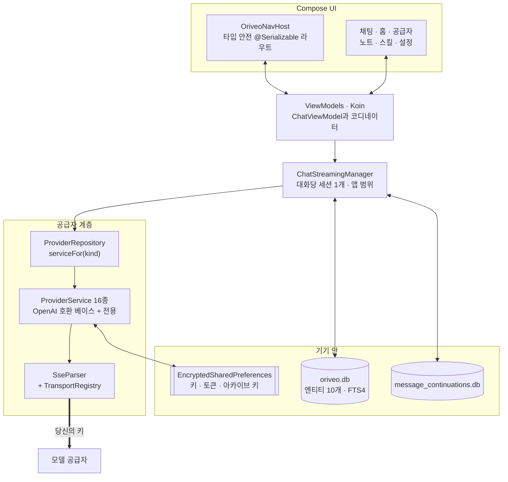

<div align="center">

# Android용 Oriveo

**이미 돈을 내고 쓰는 AI 모델을 위한 네이티브 Jetpack Compose 채팅 클라이언트.**

<a href="../../LICENSE"></a>


<sub>

<a href="../../android/README.md">English</a> ·
<a href="../ar/android.md">العربية</a> ·
<a href="../de/android.md">Deutsch</a> ·
<a href="../es/android.md">Español</a> ·
<a href="../fr/android.md">Français</a> ·
<a href="../hi/android.md">हिन्दी</a> ·
<a href="../id/android.md">Indonesia</a> ·
<a href="../ja/android.md">日本語</a> ·
**한국어** ·
<a href="../pt-BR/android.md">Português</a> ·
<a href="../ru/android.md">Русский</a> ·
<a href="../th/android.md">ไทย</a> ·
<a href="../tr/android.md">Türkçe</a> ·
<a href="../vi/android.md">Tiếng Việt</a> ·
<a href="../zh-Hans/android.md">简体中文</a> ·
<a href="../zh-Hant/android.md">繁體中文</a>

</sub>

</div>

---

Oriveo Android 클라이언트는 BYOK(bring-your-own-key) AI 채팅 앱입니다. 이미 가지고 있는 API 키를
추가하면, 앱이 휴대폰에서 각 공급자와 직접 통신합니다. 대화, 노트, 폴더, 스킬은
기기 안 Room에 저장되고, API 키는 Android Keystore에 보관된 키로 암호화됩니다. 계정도 로그인도
없습니다.

이 앱은 [Oriveo Community Edition](README.md)의 일부입니다 — 모델 공급자와 통신하는 방법에 대한
하나의 정의를 공유하는 세 개의 클라이언트.

## 아키텍처



이 다이어그램에서 셋은 우연히 그렇게 된 구조가 아니라 의도한 설계 결정입니다.

**스트리밍은 화면 위쪽에 삽니다.** `ChatStreamingManager`는 `ConcurrentHashMap` 안에 대화 id마다
`StreamingSession`을 하나씩 두고, 각각을 앱 범위의 단일
`CoroutineScope(SupervisorJob() + Dispatchers.IO)` 위에서 별도의 `Job`으로 돌립니다 — 핵심은
supervisor로, 스트림 하나가 실패해도 나머지를 끌고 내려가지 않습니다. 채팅에서 나가도 답변이
취소되지 않고, `StreamingTokenBuffer`가 충분히 쌓였다고 판단할 때마다(4,000자 또는 60초)
`ChatRepository`가 부분 텍스트를 SQLite에 내려쓰므로 답변 도중에 앱을 죽여도 이미 도착한 내용은
잃지 않습니다.

**데이터베이스는 하나가 아니라 둘입니다.** `oriveo.db`는 대화, 메시지, 첨부 파일, 노트, 폴더,
스킬, 모델 카탈로그 캐시를 담습니다. `message_continuations.db`는 공급자의 불투명한 continuation
상태만 담는 물리적으로 별개인 파일인데, 정확히 `backup_rules.xml`과 `data_extraction_rules.xml`이
이를 클라우드 백업과 기기 이전에서 제외할 수 있게 하기 위해서입니다. 다른 기기로 복원된
continuation 토큰은 잘해야 무의미합니다.

**바이너리보다 새로운 카탈로그는 성능이 떨어질 뿐, 망가지지 않습니다.** `TransportKind`는 관대한
디시리얼라이저를 가진 닫힌 enum입니다. 모르는 transport 문자열은 `null`로 디코딩되고,
`TransportRegistry`가 전략을 돌려주지 않으며, 그 모델은 선택기에서 걸러집니다. 대안인 엄격한
enum이라면 카탈로그 파싱 전체가 실패하면서 다른 모든 모델까지 함께 무너졌을 것입니다.

## 모델이 무엇을 할 수 있는가

클라이언트는 모델의 기능을 이름으로 추측하지 않습니다. 대신 카탈로그에서 capability runtime을
읽습니다. 특정 공급자·transport·기능에 대해 요청에 어떤 JSON 포인터를 써넣을지 기술한 레시피
모음입니다. `ProviderRecipeRequestCompiler`는 레시피를 공급자·기능·transport에 대해 검증한 뒤에야
소유된 body delta로 컴파일하고, 아무도 검토하지 않은 요청을 조용히 만들어 내는 대신 이름 붙은
사유(`recipe_not_found`, `transport_mismatch`, `model_route_must_not_patch_body`)로 거부합니다.

돌아오는 길에는 `CapabilityEvidenceFacade`가 어떤 기능에 대해 실제로 알려진 것을 출처별로
순위 매깁니다 — `operator_override` > `server_typed` > `server_profile` > `model_facts` >
`relay_verification` > `relay_declaration` > `legacy_metadata`. 기능을 *observed*로 표시할 수 있는
것은 스트림 파서뿐입니다. 의도, 레시피, HTTP 200, 도구 선언은 명시적으로 셈에 들어가지 않습니다.
메시지별 결과는 영속화되므로 UI가 *요청됨*과 *확인됨*을 구분할 수 있습니다.

재정의는 일곱 개 범위에 걸쳐 마지막 쓰기가 이기는 방식으로 해석되며, 우선순위는
`single_send` > `conversation_connection_model` > `skill_agent` > `connection_model` >
`connection` > `provider_recipe` > `provider_default` 순입니다.

## 저장과 비밀 값

| 무엇 | 어디에 |
|---|---|
| 대화, 메시지, 첨부 파일, 노트, 폴더, 스킬 | Room, `oriveo.db` |
| 노트 전문 검색 | FTS4 가상 테이블 |
| 모델 카탈로그 캐시 | `oriveo.db`의 한 행, 청크로 나눠 읽음 |
| 공급자 continuation 상태 | `message_continuations.db`, 백업에서 제외 |
| 공급자 API 키 | `EncryptedSharedPreferences`, AES-256-GCM, Keystore가 보관하는 마스터 키 |
| 구독 OAuth 토큰 | 두 번째 별도 암호화 preferences 파일 |
| 백업 아카이브 키 | 세 번째 |
| 첨부 파일 blob | 디스크의 파일, id로 참조 |

암호화된 preferences 파일 세 개는 편의를 위해 합치는 대신 수명과 피해 반경에 따라 나뉘어 있습니다.
각각에는 복구 경로가 있습니다. 손상된 파일(`AEADBadTagException`, `VERIFICATION_FAILED`)은 감지해
삭제하고 다시 만들며, 매번 실행할 때마다 앱이 죽게 두지 않습니다.

이 셋과 continuation 데이터베이스는 Android 클라우드 백업과 기기 이전에서 제외됩니다. 이는 실수가
아니라 이들을 Keystore에 묶은 결과입니다. 어차피 새 기기에서는 암호문을 복호화할 수 없습니다.
**새 휴대폰으로 옮긴 뒤에는 API 키를 다시 입력하고 공급자 구독에 다시 로그인해야 합니다.** 대화와
노트는 정상적으로 넘어옵니다.

직접 내보내는 아카이브는 `data.json`과 첨부 파일들을 담은 zip입니다. 사용자가 정한 비밀번호가 지키는
것은 그 안의 **공급자 API 키뿐**입니다. 키는 반복 600,000회의 PBKDF2-HMAC-SHA256과 AES-GCM으로
암호화되어 `data.json`의 한 필드로 저장됩니다. 대화, 메시지, 노트, 폴더, 스킬, 환경설정, 첨부 파일은
어느 경우든 평문 JSON과 평문 파일로 쓰이므로, 아카이브는 그 파일을 가진 사람이면 누구나 읽을 수 있다고
생각하세요. 기록만 필요하다면 키를 빼고 내보내세요.

## 내 네트워크의 모델 서버에 접속하기

매니페스트는 의도적으로 `android:usesCleartextTraffic="true"`를 설정합니다. 로컬 모델 서버 —
llama.cpp, Ollama, LM Studio, vLLM — 는 내 컴퓨터나 LAN에서 평문 HTTP로 말하고, 대개 인증서가
없기 때문입니다.

진짜 경계는 매니페스트가 아니라 코드에 있습니다. 그럴 수밖에 없기 때문입니다.
`RelayEndpointPolicy`는 호스트를 해석하고, 해석된 **모든** 주소가 사설이어야 한다고 요구하며
(loopback, RFC 1918, link-local, unique-local, 그리고 VPN 모드에서는 CGNAT 대역), 공인 주소와 사설
주소가 섞여 나오는 호스트는 거부하고, DNS 리바인딩에 대비해 해석된 주소 집합을 고정한 뒤 전송
시점에 다시 검증합니다. 자격 증명이 실린 평문 요청은 거부합니다. 디스커버리와 로컬 엔진
클라이언트에서는 리다이렉트를 아예 따라가지 않으며, 그 주소 고정이 최후의 방어선입니다.

Android network security config로는 그런 집합을 표현할 수 없습니다. 호스트 이름으로만 매칭하고,
주소 대역을 쓸 문법이 없으며, 여기서 다루는 주소는 런타임에 사용자의 네트워크에서 나오기
때문입니다. 게다가 config는 이름이 어떤 주소로 해석되었는지 결코 보지 못하므로 엄격히 더
약합니다.

## 모델 카탈로그

앱은 오늘 나온 모델이 앱 업데이트 없이도 동작하도록, 공개 카탈로그에서 모델의 기능과 가격을
읽습니다. 자격 증명도 식별자도 붙지 않은 평범한 HTTPS `GET`이며, 채팅 요청은 그 근처에도 가지
않습니다. 요청하는 엔드포인트는 둘뿐입니다.

```
GET {base}/api/metadata?view=lean
GET {base}/api/metadata/model-facts
```

기본 URL은 빌드 시점 프로퍼티이며 기본값은 `https://api.oriveoai.com`입니다.

```bash
./gradlew :app:assembleDebug -PORIVEO_METADATA_BASE_URL=https://your.host
```

응답은 ETag로 재검증되어 `oriveo.db`에 캐시되므로, 한 번 성공적으로 받아 온 뒤에는 나중에
카탈로그에 닿지 못해도 앱이 캐시본으로 계속 동작합니다.

> [!IMPORTANT]
> 빈 값(`-PORIVEO_METADATA_BASE_URL=`)으로 빌드하면 카탈로그 가져오기가 완전히 꺼지며, **APK 안에
> 스냅샷이 들어 있지도 않습니다.** 그렇게 빌드한 앱을 새로 설치하면 이렇게 됩니다.
>
> - 내장 공급자 15곳 중 어느 곳도 모델 목록을 받지 못하고, 앱이 공급자에게 목록을 물어보지도
>   않습니다 — 카탈로그가 유일한 출처입니다.
> - 공급자 상세 화면에는 「공식 모델을 불러올 수 없습니다」 배너가 뜨지만, 키를 추가하면 여전히
>   성공했다고 보고하고 모델 선택기는 그냥 비어 있습니다.
> - 해당 공급자에서는 모델을 수동 입력할 수 없기 때문에 **OpenAI는 쓸 수 없게 됩니다.**
> - 릴레이 서비스(Relay) 엔드포인트와 로컬 모델 서버는 그대로 온전히 동작하며, 유일하게 멀쩡한 경로입니다.
>
> 오프라인 빌드를 원한다면 값을 비우지 말고, 카탈로그를 직접 서비스한 뒤 빌드가 그곳을 가리키게
> 하세요.

## 프로젝트 구조

```
android/
  app/src/main/java/ai/oriveo/community/
    core/
      provider/    every provider service, transports, relay, capability recipes
      data/        Room entities, DAOs, repositories, backup, catalog client
      model/       domain models and the capability/preference resolvers
      attachments/ routing, budgets, per-format text extraction
      security/    SecureKeyStore, BackupCrypto, external-URL policy
      streaming/   ChatStreamingManager
      navigation/  AppRoute, OriveoNavHost
    feature/       one package per screen
    ui/            shared components, Markdown + LaTeX renderer, theme
    di/            Koin modules
  benchmark/       macrobenchmark suite (cold start, model picker)
```

## 빌드

요구 사항: **JDK 21**과 Android SDK. 빌드는 AGP 9.3, Gradle 9.5, Kotlin 2.3을 쓰므로 Android
Studio는 AGP 9.3을 sync할 수 있는 릴리스여야 합니다. 명령줄에서는 JDK와 SDK만 있으면 됩니다.

```bash
./gradlew :app:assembleDebug
./gradlew :app:testDebugUnitTest
```

빌드 대상은 `minSdk 26`, `targetSdk 36`, `compileSdk 37`입니다. `local.properties`(당신의 SDK
경로)는 Android Studio가 생성하며 커밋되지 않습니다. 릴리스 서명은
[SIGNING.md](../../android/SIGNING.md)에 설명되어 있습니다.

> [!NOTE]
> Gradle 데몬은 Java 21 툴체인(`gradle/gradle-daemon-jvm.properties`)에서 돌아가며, 매칭은
> "21 이상"이 아니라 정확히 21입니다. 다른 JDK만 설치되어 있으면 Gradle이 첫 빌드에서 자기 몫의
> JDK 21을 내려받고, 여기에는 네트워크 접근이 필요합니다. JDK 21을 직접 설치하면 그 과정을 피할 수
> 있습니다. `org.gradle.java.installations.auto-download=false`로 설정해 두었다면 그 다운로드가
> 일어날 수 없어 `Toolchain auto-provisioning is not enabled.` 오류로 빌드가 실패합니다. JDK 17만
> 으로는 정말로 부족한 유일한 경우입니다. 컴파일 타깃은 어느 쪽이든 Java 17입니다.

단위 테스트 병렬도는 하드코딩이 아니라 머신의 CPU 수와 물리 메모리에서 계산되므로, 노트북에서도 큰
워크스테이션에서도 스위트가 무난히 돌아갑니다.

## 의존성

| 라이브러리 | 버전 | 용도 |
|---|---|---|
| Jetpack Compose BOM | 2026.08.00 | UI, Material 3 |
| Room | 2.8.4 | SQLite, DAO, FTS4 |
| Koin | 4.2.2 | 의존성 주입 |
| Ktor client (OkHttp engine) | 3.5.2 | 공급자 HTTP와 SSE |
| kotlinx.serialization | 1.11.0 | JSON |
| navigation-compose | 2.9.6 | 타입 안전 라우트 |
| androidx.security-crypto | 1.1.0 | `EncryptedSharedPreferences` |
| haze | 1.7.3 | 배경 블러 |
| PDFBox-Android, jsoup | 2.0.27.0, 1.23.2 | 첨부 파일 텍스트 추출 |
| jlatexmath-android | 0.2.0 | LaTeX 렌더링 |

정확한 버전은 [`gradle/libs.versions.toml`](../../android/gradle/libs.versions.toml)에 고정되어
있습니다.

## 테스트

```bash
./gradlew :app:testDebugUnitTest
```

318개 파일에 걸쳐 단위 테스트 약 3,000개가 있으며, JUnit 4, MockK, Robolectric,
`kotlinx-coroutines-test`, Ktor의 mock 엔진을 씁니다. 실수의 대가가 가장 큰 곳에 커버리지가 가장
두텁습니다. 공급자별 요청 형태, SSE 파싱, transport 선택, 릴레이 서비스 프로빙과 보안 모드, 기능 레시피
실행, 카탈로그 캐싱과 계약 버전 처리, Room 영속화, 백업 왕복이 그렇습니다.

> [!IMPORTANT]
> 약 38개 스위트가 작업 디렉터리에서 위로 올라가며 `shared/`를 찾아 계약 fixture를 읽으므로
> **테스트는 전체 체크아웃에서만 통과합니다** — `android/`만 따로 복사해 내면 동작하지 않습니다.

계측 테스트도 셋 있습니다. 로컬 엔진 릴리스 매트릭스, 평문 소켓 테스트, keystore 격리 테스트입니다.
이들은 자체 완결적이지 않습니다. 로컬 엔진 쪽은 네트워크에서 실제로 돌아가는 모델 서버를 지정하는
instrumentation 인자가 필요하므로 `connectedAndroidTest`가 그대로는 통과하지 않습니다. pull request
의 관문은 단위 테스트 스위트입니다.

`:benchmark` 모듈에는 콜드 스타트와 모델 선택기에 대한 macrobenchmark가 들어 있습니다. 별도의
Gradle 모듈로 self-instrumentation과 함께 `com.android.test`를 쓰고, `:app`의 전용 `benchmark`
빌드 타입을 구동합니다.

두 데이터베이스 모두 아직 마이그레이션 없이 `version = 1`이며, 스키마는 `app/schemas/`로 내보내
커밋되어 있습니다. 첫 마이그레이션의 `2.json`이 바로 여기에 들어올 자리입니다.

## 현지화

16개 언어입니다. `values/`(영어, 소스)와 열다섯 개의 로케일 디렉터리로 이루어지며, 문자열이 없는
`values-night`도 함께 있습니다. 각각 약 1,340개 문자열을 담고 모든 로케일이 동일한 키 집합을
가집니다. 앱 내 언어 전환은
`AppLanguageManager`와 `android:localeConfig`를 거칩니다. 번들에서 언어 split을 껐기 때문에 하나의
아티팩트가 모든 번역을 담습니다.

## 기여하기

[CONTRIBUTING.md](../../CONTRIBUTING.md)를 보세요. 이 프로젝트의 작업 언어는 영어입니다. 소스,
주석, 테스트, 커밋 메시지 모두 그렇습니다. UI 문자열은 번역됩니다 — 새 문자열은 먼저 `values/`에
추가하고, 나머지 로케일은 뒤따라오게 두세요. pull request를 열기 전에 단위 테스트를 돌리세요.

## 라이선스

[AGPL-3.0-or-later](../../LICENSE).
