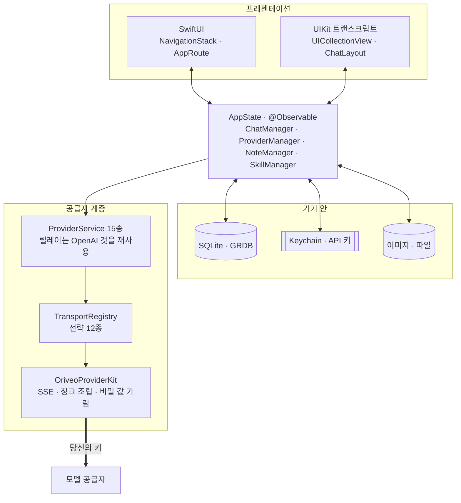
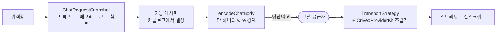

<div align="center">

# iOS용 Oriveo

**이미 돈을 내고 쓰는 AI 모델을 위한 네이티브 SwiftUI 채팅 클라이언트.**

<a href="../../LICENSE"></a>


<sub>

<a href="../../ios/README.md">English</a> ·
<a href="../ar/ios.md">العربية</a> ·
<a href="../de/ios.md">Deutsch</a> ·
<a href="../es/ios.md">Español</a> ·
<a href="../fr/ios.md">Français</a> ·
<a href="../hi/ios.md">हिन्दी</a> ·
<a href="../id/ios.md">Indonesia</a> ·
<a href="../ja/ios.md">日本語</a> ·
**한국어** ·
<a href="../pt-BR/ios.md">Português</a> ·
<a href="../ru/ios.md">Русский</a> ·
<a href="../th/ios.md">ไทย</a> ·
<a href="../tr/ios.md">Türkçe</a> ·
<a href="../vi/ios.md">Tiếng Việt</a> ·
<a href="../zh-Hans/ios.md">简体中文</a> ·
<a href="../zh-Hant/ios.md">繁體中文</a>

</sub>

</div>

---

Oriveo iOS 클라이언트는 BYOK(bring-your-own-key) AI 채팅 앱입니다. 이미 가지고 있는 API 키를
추가하면, 앱이 아이폰에서 각 공급자를 직접 호출합니다. 대화, 메시지, 노트, 노트 폴더는 기기 안
SQLite 데이터베이스에 있고, 첨부 파일 blob은 그 옆의 파일이며, 스킬과 환경설정, 공급자 목록, 대화
폴더는 기기 안 JSON입니다. API 키는 iOS Keychain으로 들어갑니다.

Oriveo 계정은 없습니다. 아무것도 업로드되지 않고, 로그인할 대상도 없습니다. 다만 두 공급자는 키를
붙여 넣는 대신 이미 가지고 있는 구독으로 로그인하는 방법도 제공합니다 — ChatGPT와 Grok이며, 그
로그인은 OpenAI와 xAI로 가고 저희 쪽으로는 오지 않습니다.

이 앱은 [Oriveo Community Edition](README.md)의 일부입니다 — 모델 공급자와 통신하는 방법에 대한
하나의 정의를 공유하는 세 개의 클라이언트.

## 아키텍처



이 다이어그램에서 분명히 짚어둘 만한 것이 셋 있습니다.

**트랜스크립트는 UIKit이고, 나머지는 SwiftUI입니다.** `ChatView`는
[ChatLayout](https://github.com/ekazaev/ChatLayout)이 구동하는 `UICollectionView`를
`ChatListViewControllerRepresentable`로 감싸 품고 있습니다. 그 밖의 모든 것 — 내비게이션, 설정,
공급자 설정, 노트, 스킬 — 은 SwiftUI입니다. 이렇게 나눈 이유는, 토큰 속도로 흘러드는 스트리밍
트랜스크립트에는 SwiftUI의 diffing이 주지 못하는 셀 단위의 측정·재사용 제어가 필요하기 때문입니다.
경계는
[`Features/Chat/ARCHITECTURE.md`](../../ios/Oriveo/Oriveo/Features/Chat/ARCHITECTURE.md)에 정리되어
있습니다.

**세 개의 서로 다른 경로가 그 트랜스크립트를 갱신합니다.** 의도한 설계입니다.

| 경로 | 무엇을 나르나 | 이유 |
|---|---|---|
| `@Observable AppState` | 구조 변화 — 메시지가 새로 나타나거나, 대화가 전환될 때 | SwiftUI에 자연스럽고, 빈도가 낮은 이벤트에는 비용이 싸다 |
| GRDB `ValueObservation` | SQLite에서 다시 읽어 온 영속 상태 | 쓰기 이후의 단일 진실 공급원이고, 앱을 다시 켜도 남는다 |
| 대화별 Combine `PassthroughSubject` | 스트리밍 텍스트와 추론 델타 | 토큰 속도에서 SwiftUI diffing을 아예 우회한다 |

**공급자 지원은 하나의 enum이 아니라 서로 독립적인 네 개의 축입니다.** `ProviderKind`(16가지:
공급자 열다섯 곳과 릴레이)는
*사용자가 무엇을 설정했는가*입니다. `ProviderServiceProtocol`은 *호출 표면*입니다.
`TransportKind`(12가지)는 *실제로 어떤 wire 프로토콜을 쓰는가*이며, **모델마다 카탈로그를 보고**
결정되므로 같은 키 뒤에 있는 두 모델이 서로 다를 수 있습니다. `RelayKind`는 사용자가 직접 넣은
엔드포인트를 담당합니다. 이들을 분리해 두었기에 새 모델이 새 빌드 없이도 동작합니다.

### 메시지 하나가 전송되는 과정



`BaseAPIService.encodeChatBody`는 OpenAI 호환 요청이 바이트가 되기 직전의 마지막 관문입니다. 열여섯
가지 중 열둘이 여기를 지나므로, 기능 레시피나 생성 파라미터, 커스텀 필드를 열두 군데가 아니라 한
군데에서 테스트할 수 있습니다. OpenAI와 Anthropic, Gemini는 각자의 형태를 쓰고 각자의 서비스에서
직렬화하며, 그 지점들은 각각 자체 요청 형태 스위트가 다룹니다.

## 모델이 무엇을 할 수 있는가

클라이언트는 모델의 기능을 이름으로 추측하지 않습니다. 대신 **capability runtime**을 읽습니다.
특정 공급자·transport·기능에 대해, 요청에 어떤 JSON 포인터를 써넣을지 정확히 기술한 레시피
모음입니다. 이 레시피들은 [`shared/capabilityrecipe`](../../shared/capabilityrecipe/)에 있고
`CapabilityRecipeRequestCompiler`가 적용합니다.

돌아오는 길에는 `CapabilityExecutionRuntime`이 실제로 무슨 일이 일어났는지 기록합니다. 지정된
프로덕션 스트림 파서만이 기능을 *observed*로 승격할 수 있습니다. HTTP 200도, 비어 있지 않은
답변도, 요청에 들어 있던 도구 선언도 명시적으로 **증거가 아닙니다**. 최종 상태는 메시지 단위로
저장되므로, UI는 어떤 제어가 요청되었지만 확인된 적은 없다는 사실을 은근슬쩍 성공한 척하지 않고
그대로 알려 줄 수 있습니다.

## 저장

```
Application Support/Oriveo/
  active-uid                     # storage partition, "guest" by default
  users/<uid>/
    oriveo.sqlite                # conversations, messages, notes and folders, catalog cache
    Images/  Files/              # attachment blobs, referenced by id
    session-snapshot.json        # preferences, provider list, folders, last used model
```

- **GRDB를 통한 SQLite**. WAL을 켜고, 외래 키를 켜고, 모든 스키마 변경을 `DatabaseMigrator`가
  다룹니다. 메시지와 노트에 대한 전문 검색은 trigram 토크나이저를 쓰는 FTS5를 사용합니다.
- **API 키는 Keychain에 있으며**, 공급자와 파티션으로 키를 구분하고, 세션 스냅샷을 쓰기 전에
  거기서 지워집니다. 스킬은 따로 `UserDefaults`의 JSON으로 저장됩니다.
- **첨부 파일 blob은 행이 아니라 디스크의 파일**이라, 큰 PDF 하나가 데이터베이스를 부풀리지
  않습니다.

백업은 `data.json`과 이미지 파일들을 담은 `.oriveo` ZIP입니다. 선택 사항인 비밀번호는 아카이브를
암호화하지 않습니다. 그 안에 든 공급자 API 키만 암호화합니다(AES-GCM, PBKDF2-HMAC-SHA256을 600,000회
반복해 유도한 키). 대화와 노트, 스킬, 환경설정은 어느 경우든 아카이브 안에서 평문 JSON이므로, 백업
파일은 그것을 가진 사람이면 누구나 읽을 수 있다고 생각하세요.

## 앱이 스스로 보내는 요청

콜드 스타트 때 앱은 `https://api.oriveoai.com/api/metadata?view=lean`으로 인증 없는 ETag 조건부
`GET` 요청 하나를 보냅니다. 공개 모델 카탈로그를 받아오는 요청으로, 어떤 모델이 있는지, 각 모델이
무엇을 지원하는지, 추론 제어의 이름이 무엇인지, 가격이 얼마인지를 가져옵니다. 키도, 대화도, 식별자도
붙지 않으며, 응답은 SQLite에 캐시되어 카탈로그에 닿지 못할 때도 앱이 캐시본으로 동작합니다. 두 번째
엔드포인트 `/api/metadata/model-facts`는 ChatGPT나 Grok 구독으로 로그인한 뒤에만 읽으며, 그 구독의
모델이 무엇을 할 수 있는지 알아내는 데 씁니다.

앱이 자기 자신을 위해 보내는 요청은 이것뿐입니다. 나머지는 전부 사용자가 설정한 공급자에게,
사용자의 키로 갑니다.

카탈로그를 자신의 호스트로 향하게 하는 것은 **Debug 빌드용 편의 기능**이며,
`Oriveo/Core/Providers/BackendURLResolver.swift`에서 다음 순서로 결정됩니다.

1. scheme의 Run 액션에 설정한 `ORIVEO_METADATA_BASE_URL` 환경 변수, 그다음
2. `ios/Oriveo/Config/Info.plist`의 `ORIVEO_METADATA_BASE_URL` 문자열 — 키는 이미 비어 있는 채로
   들어 있으므로 값만 채우면 됩니다, 그다음
3. `https://api.oriveoai.com`.

알아둘 것이 두 가지 있습니다. Release 빌드는 둘 다 무시하고 언제나 게시된 카탈로그를 씁니다. 이를
바꾸려면 `BackendURLResolver`를 손봐야 합니다. 그리고 테스트 번들이 실행 중이거나 `CI=true`일 때는
사설 주소(localhost, `10/8`, `192.168/16`, `172.16/12`, `.local`, 링크 로컬 IPv6)를 가리키는 재정의가
무시됩니다. 남겨 둔 로컬 호스트 때문에 스위트가 지금 앉아 있는 기계에 의존하게 되는 일을 막기
위해서입니다.

## 프로젝트 구조

```
ios/Oriveo/
  Config/Info.plist    the app's Info.plist; GENERATE_INFOPLIST_FILE is off
  Oriveo.xcodeproj/
  Oriveo/
    Core/
      Providers/       15 provider services, transports, capability runtime, catalog client
      State/           AppState and the managers it owns
      Database/        GRDB pool, schema, migrator, stores, observations
      Models/          domain types
      Attachments/     import limits, budgets, per-format text extraction
      Tools/           tool-call loop and per-protocol adapters
      Cache/ Localization/ Observability/ Reachability/ Routing/ Usage/
    Features/
      App/             root view and tab shell
      Chat/            transcript, composer, model controls, cross-check, export
      Providers/       setup, detail, relay, local engines, subscription sign-in
      Home/ Notes/ Skills/ Settings/ Backup/ Onboarding/
    Shared/Components/ shared views
    DesignSystem/      theme, colour, haptics
    Preview/           sample data for SwiftUI previews
    *.xcstrings        ten string catalogs
    Assets.xcassets · PrivacyInfo.xcprivacy · Oriveo.entitlements
  OriveoTests/
```

## 빌드와 실행

**Xcode 26**이 필요하고, 실제 기기에서 돌리려면 **iOS 18 이상**의 기기가 필요합니다. 무료 Apple
Developer 계정이면 충분합니다. entitlements 파일은 비어 있고 앱은 유료 capability를 쓰지 않습니다 —
푸시도, iCloud도, 앱 그룹도, associated domains도 없습니다.

프로젝트 포맷과 Swift tools 버전이 실제로 강제하는 하한은 Xcode 16.3이지만, 타깃이
`SWIFT_APPROACHABLE_CONCURRENCY`와 `SWIFT_DEFAULT_ACTOR_ISOLATION = MainActor`를 설정하고 있고
오래된 Xcode는 이를 아무 말 없이 무시합니다. actor isolation이 조용히 바뀌는 것으로 그 사실을 알게
되는 건 좋은 방법이 아니니, 빌드는 Xcode 26으로 하세요.

1. `ios/Oriveo/Oriveo.xcodeproj` 열기
2. `Oriveo` scheme 선택
3. **Signing & Capabilities**에서 본인의 Team 선택
4. Xcode가 `ai.oriveo.community`를 등록하지 못하면, 번들 식별자를 본인 팀 소유의 것으로 변경
5. iPhone 연결, 개발자 모드 활성화, 컴퓨터 신뢰, 그리고 Run

시뮬레이터로 빌드하려면 아무 iPhone 시뮬레이터나 골라 Run하면 됩니다. 패키지 의존성은 커밋된
`Package.resolved`에서 해석됩니다.

**Apple silicon Mac에서는** iPhone 빌드가 네이티브로도 돌아갑니다. **My Mac (Designed for iPad)**
destination을 고르세요. Mac Catalyst는 일부러 꺼 두었으므로(`SUPPORTS_MACCATALYST = NO`), 이것은 Mac
앱이 아니라 iPad 호환 런타임에서 돌아가는 iOS 앱입니다 — 카메라 촬영처럼 기기에서만 쓰이는 경로는
Mac에서 동작하는 그대로 동작합니다.

프로젝트 파일은 파일 시스템 동기화 그룹과 함께 `objectVersion = 77`을 쓰므로, 오래된 Xcode는 열기를
거부할 수 있습니다. 프로젝트 포맷을 손대지 말고 Xcode를 업데이트하세요.

> [!NOTE]
> 앱 타깃은 Swift 5 언어 모드로 컴파일됩니다. 로컬 `OriveoProviderKit` 패키지는
> `swift-tools-version: 6.1`을 선언하고 Swift 6 언어 모드로 빌드됩니다.

## 의존성

| 패키지 | 버전 | 용도 |
|---|---|---|
| [GRDB.swift](https://github.com/groue/GRDB.swift) | 7.11.1 | SQLite 접근, 마이그레이션, `ValueObservation` |
| [ChatLayout](https://github.com/ekazaev/ChatLayout) | 2.4.3 | 트랜스크립트의 컬렉션 뷰 레이아웃 |
| [swift-markdown-ui](https://github.com/gonzalezreal/swift-markdown-ui) | 2.4.1 | 마크다운 렌더링 |
| [SwiftMath](https://github.com/mgriebling/SwiftMath) | 1.7.3 | LaTeX 렌더링 |
| [ZIPFoundation](https://github.com/weichsel/ZIPFoundation) | 0.9.20 | 백업 아카이브, Office/EPUB/ODF 추출 |
| `OriveoProviderKit` | 로컬 | [`shared/`](shared.md)에 있는 공급자 wire 커널 |

`Package.resolved`는 swift-markdown-ui가 끌어오는 전이 의존성 두 개도 고정합니다.
[NetworkImage](https://github.com/gonzalezreal/NetworkImage) 6.0.1과
[swift-cmark](https://github.com/swiftlang/swift-cmark) 0.8.0입니다. 직접 의존성은 모두 MIT
라이선스이고 swift-cmark는 BSD-2-Clause로, 전부 AGPL-3.0-or-later와 호환됩니다.

## 테스트

Xcode에서 `Oriveo` scheme의 테스트 액션(⌘U)을 실행하거나, 저장소 루트에서 다음을 쓰세요.

```bash
xcodebuild test -project ios/Oriveo/Oriveo.xcodeproj -scheme Oriveo \
  -destination 'platform=iOS Simulator,name=iPhone 16'
```

실제로 가지고 있는 시뮬레이터로 바꿔 넣으세요. 같은 project와 scheme으로
`xcodebuild -showdestinations`를 돌리면 이 체크아웃으로 빌드할 수 있는 모든 대상이 나옵니다.

> [!IMPORTANT]
> 테스트 타깃은 `#filePath`에서 위로 거슬러 올라가며 `shared/` 디렉터리를 찾아 계약 fixture를
> 읽으므로 **테스트는 전체 체크아웃에서만 통과합니다** — `ios/`만 따로 복사해 내면 동작하지
> 않습니다.

스위트는 큽니다. [Swift Testing](https://github.com/swiftlang/swift-testing) 케이스 약 2,900개에
XCTest 케이스 76개가 더해져, 274개 파일에 걸쳐 있습니다. 공급자별 요청 형태, 녹화된 업스트림 SSE
재생, 릴레이와 로컬 엔진 정책, 트랜스크립트 측정과 스트리밍 동작, 저장, 백업 왕복을 다룹니다.

`shared/OriveoProviderKit`에는 자체 스위트가 있습니다.

```bash
cd shared/OriveoProviderKit && swift test
```

## 현지화

16개 언어이며 Xcode String Catalog(`.xcstrings`)로 저장됩니다 — 카탈로그 10개, 키 약 1,340개,
소스는 영어입니다. `shouldTranslate: false`로 표시된 몇 개를 빼면 모든 키가 16개 언어로 번역되어
있습니다. 제외되는 것은 제품명, 문장 부호, 포맷 스켈레톤, 그리고 현지화하면 틀리게 되는 프로토콜
값입니다. 문자열은 사용자의 앱 내 언어 설정으로 고른 `.lproj` 번들에 대해 `L10n.tr(_:table:)`로
해석되므로, 언어를 바꿔도 앱을 다시 켤 필요가 없습니다. 아랍어의 오른쪽에서 왼쪽 레이아웃은
명시적으로 처리합니다.

## 기여하기

[CONTRIBUTING.md](../../CONTRIBUTING.md)를 보세요. 동작이 바뀌면 테스트를 함께 추가하세요. 공급자
프로토콜 수정이라면 손으로 쓴 mock보다 `shared/test-fixtures` 아래의 녹화된 fixture를 쓰고, 어떤
공급자와 모델로 확인했는지 밝혀 주세요.

## 라이선스

[AGPL-3.0-or-later](../../LICENSE).
